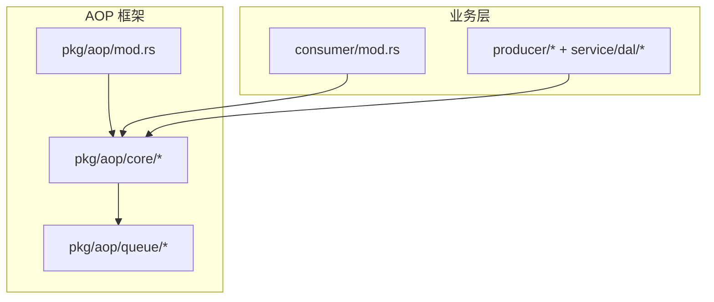
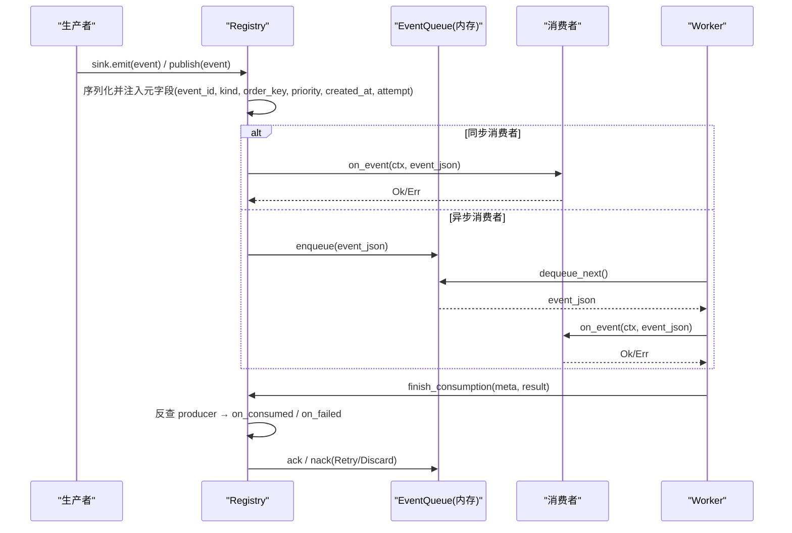
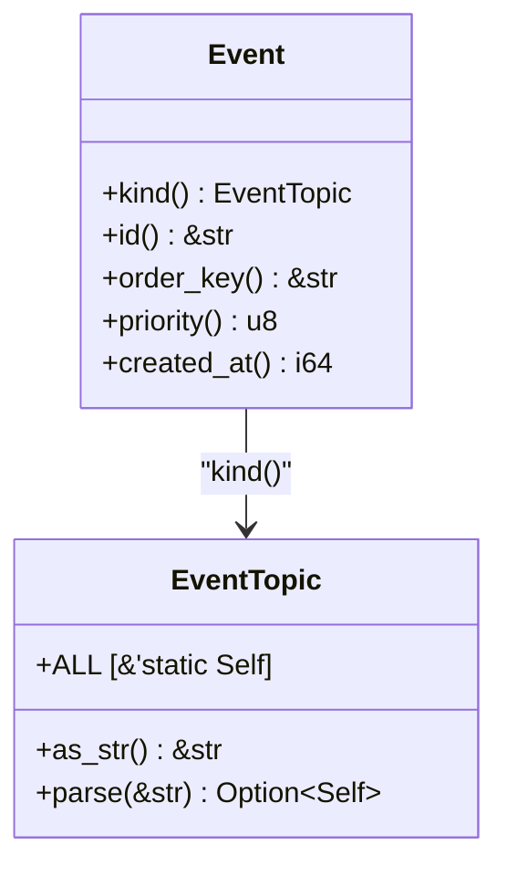
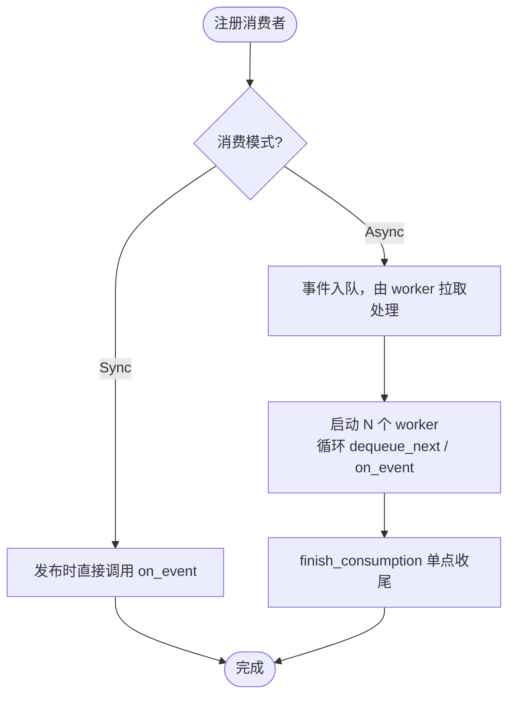
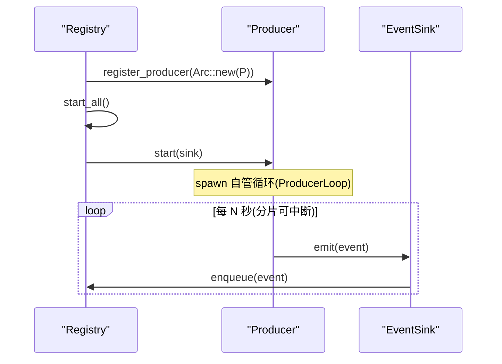
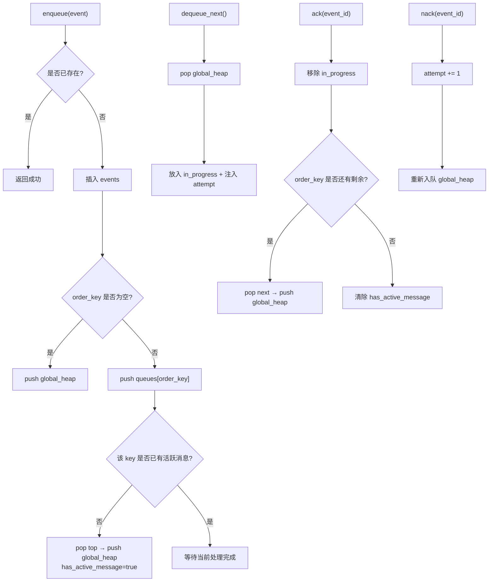
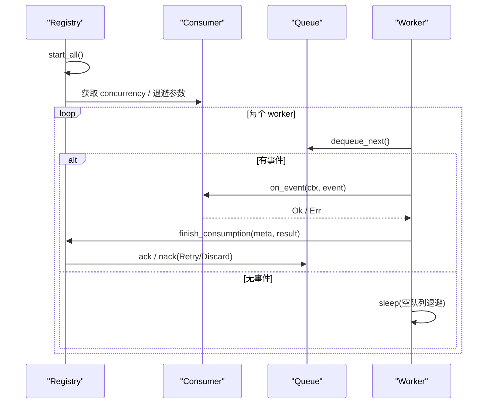
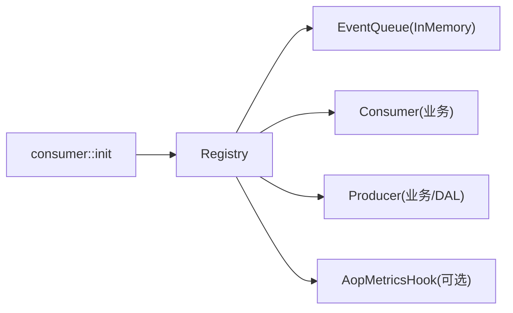

# 事件队列系统

<cite>
**本文引用的文件**
- [src/pkg/aop/mod.rs](src/pkg/aop/mod.rs) — `publish` / `init_all` / `shutdown_all`
- [src/pkg/aop/core/mod.rs](src/pkg/aop/core/mod.rs)
- [src/pkg/aop/core/event.rs](src/pkg/aop/core/event.rs) — `Event` trait
- [src/pkg/aop/core/consumer.rs](src/pkg/aop/core/consumer.rs) — `Consumer` / `Subscription`
- [src/pkg/aop/core/producer.rs](src/pkg/aop/core/producer.rs) — `Producer` / `ProducerLoop` / `RetryDecision`
- [src/pkg/aop/core/event_sink.rs](src/pkg/aop/core/event_sink.rs) — `EventSink`
- [src/pkg/aop/core/registry.rs](src/pkg/aop/core/registry.rs) — `start_all` / `finish_consumption` / `DeliveryOutcome`
- [common/src/enums/event_topic.rs](common/src/enums/event_topic.rs) — `EventTopic`
- [src/pkg/aop/queue/mod.rs](src/pkg/aop/queue/mod.rs) — `EventQueue` 抽象
- [src/pkg/aop/queue/in_memory.rs](src/pkg/aop/queue/in_memory.rs) — `InMemoryEventQueue` / `EventRef.attempt`
- [src/consumer/mod.rs](src/consumer/mod.rs)
</cite>

## 更新摘要
**变更内容**
- 主题体系：事件路由键由 `EventKind` 改为 `EventTopic`（`Event::kind() -> EventTopic`，闭环 16 变体枚举）
- 消费收尾：删除 `Consumer::ack/nack` 与 `source`；统一由 `finish_consumption` 单点按 topic 反查 producer 回调 `on_consumed` / `on_failed`
- 生产者投递：删除 `poll()` / `poll_interval_secs`；生产者经 `EventSink::emit` 投递，`ProducerLoop` 自管可中断循环
- 重试语义：队列侧 `EventRef.attempt` 累计次数，`DeliveryOutcome { Ack, Nack }` 驱动 ack/nack；框架不设 `max_retry`、无死信，决策权下沉生产者 `RetryDecision { Retry, Discard }`
- 调度：Registry 不再为生产者 spawn 轮询协程，仅 `start_all` / `shutdown_all` 编排；worker 仍按 `concurrency` 拉取处理

## 目录
1. [简介](#简介)
2. [项目结构](#项目结构)
3. [核心组件](#核心组件)
4. [架构总览](#架构总览)
5. [详细组件分析](#详细组件分析)
6. [依赖关系分析](#依赖关系分析)
7. [性能与调优](#性能与调优)
8. [故障排查指南](#故障排查指南)
9. [故障恢复与高可用](#故障恢复与高可用)
10. [监控与可观测性](#监控与可观测性)
11. [扩展指南：自定义队列后端](#扩展指南自定义队列后端)
12. [结论](#结论)

## 简介
本文件系统性地文档化 AOP 事件队列系统的抽象设计与具体实现，覆盖内存队列的实现原理、持久化与数据结构设计、消息重试与错误处理策略、worker 并发控制与资源管理、配置与性能调优参数、监控指标、扩展方式以及故障恢复与高可用方案。该系统以「生产者-消费者」模式为核心，通过 Registry 统一分发事件，Queue 提供可靠存储，Consumer 负责业务处理，Producer 通过 EventSink 负责事件接入与收尾。

## 项目结构
AOP 事件中心位于 `src/pkg/aop`，包含核心抽象（core）、队列抽象与内存实现（queue），并通过全局单例暴露 `publish`、`init_all` 等便捷 API。业务消费者在 `src/consumer` 中注册并启动。

图表来源
- [src/pkg/aop/mod.rs](src/pkg/aop/mod.rs)
- [src/pkg/aop/core/mod.rs](src/pkg/aop/core/mod.rs)
- [src/pkg/aop/queue/mod.rs](src/pkg/aop/queue/mod.rs)
- [src/consumer/mod.rs](src/consumer/mod.rs)

章节来源
- [src/pkg/aop/mod.rs](src/pkg/aop/mod.rs)
- [src/pkg/aop/core/mod.rs](src/pkg/aop/core/mod.rs)
- [src/pkg/aop/queue/mod.rs](src/pkg/aop/queue/mod.rs)
- [src/consumer/mod.rs](src/consumer/mod.rs)

## 核心组件
- Event：事件数据载体，携带 `id`、`kind()`（`EventTopic`）、`order_key`、`priority`、`created_at` 等元信息，用于排序、顺序消费与追踪。
- Consumer：事件消费者，通过 `subscriptions()` 声明 `Subscription { kind, ordered, notify_producer }` 与消费模式；异步模式下由框架按 `concurrency` 启动 worker，不再自行 ack/nack。
- Producer：事件生产者，通过 `EventSink::emit` 投递；`start(sink)` 内自管 `ProducerLoop` 循环，`on_consumed` / `on_failed` 完成收尾。
- Registry：注册中心，负责消费者/生产者（按 topic 索引）注册、事件入队、worker 启动、指标钩子注入与 `finish_consumption` 单点收尾反查。
- Queue：队列抽象，提供 `enqueue` / `enqueue_batch` / `dequeue_next` / `ack` / `nack` / `stats` / `query_events` / `get_event` / `recover` / `clear` 等方法；当前默认实现为 InMemoryEventQueue。

章节来源
- [src/pkg/aop/core/event.rs](src/pkg/aop/core/event.rs)
- [src/pkg/aop/core/consumer.rs](src/pkg/aop/core/consumer.rs)
- [src/pkg/aop/core/producer.rs](src/pkg/aop/core/producer.rs)
- [src/pkg/aop/core/registry.rs](src/pkg/aop/core/registry.rs)
- [src/pkg/aop/queue/mod.rs](src/pkg/aop/queue/mod.rs)

## 架构总览
AOP 事件中心采用「发布-订阅 + 队列」的解耦架构。生产者在任意位置经 `EventSink::emit(event)` 或 `aop::publish(event)`，Registry 入队；同步消费者直接执行 `on_event`，异步消费者将事件入队并由 worker 拉取处理。消费结束统一走 `finish_consumption`：按 topic 反查 `producer_for(kind)` → 回调 `on_consumed` / `on_failed`，由 `RetryDecision` 决定重试或丢弃，再据此 ack/nack。

图表来源
- [src/pkg/aop/core/registry.rs](src/pkg/aop/core/registry.rs)
- [src/pkg/aop/core/event_sink.rs](src/pkg/aop/core/event_sink.rs)
- [src/pkg/aop/queue/in_memory.rs](src/pkg/aop/queue/in_memory.rs)

## 详细组件分析

### 事件模型与元数据
- `Event` trait 定义事件类型标识（`kind() -> EventTopic`）、唯一 `id`、`order_key`、`priority` 与 `created_at`。
- `EventTopic`：闭环枚举（`common/src/enums/event_topic.rs`），16 变体，点分线字符串；提供 `as_str` / `parse` / `ALL` / `Display`。
- Registry 在序列化前提取元字段并统一注入 JSON 顶层，确保队列与监控读取一致；`attempt` 由 `nack` 自增后随出队注入封套。

图表来源
- [src/pkg/aop/core/event.rs](src/pkg/aop/core/event.rs)
- [common/src/enums/event_topic.rs](common/src/enums/event_topic.rs)

章节来源
- [src/pkg/aop/core/event.rs](src/pkg/aop/core/event.rs)
- [src/pkg/aop/core/registry.rs](src/pkg/aop/core/registry.rs)

### 消费者与消费模式
- `Consumer` trait 区分同步与异步消费（`ConsumeMode`）。
- 异步消费者由框架按 `concurrency` 启动 worker；不再实现 ack/nack，收尾统一在 `finish_consumption`。
- 订阅通过 `subscriptions()` 返回 `Vec<Subscription>`；Sync 消费者声明 `ordered` 会在注册期返回 `Err`；声明 `notify_producer` 的 topic 缺 producer 时 `start_all` 返回 `Err`。

图表来源
- [src/pkg/aop/core/consumer.rs](src/pkg/aop/core/consumer.rs)
- [src/pkg/aop/core/registry.rs](src/pkg/aop/core/registry.rs)

章节来源
- [src/pkg/aop/core/consumer.rs](src/pkg/aop/core/consumer.rs)
- [src/consumer/mod.rs](src/consumer/mod.rs)

### 生产者与投递机制
- 生产者经 `EventSink::emit` 投递；`EventSink` 预绑定 `producer.topic()`，校验 `event.kind() == topic`（1 producer : 1 topic）。
- `start(sink)` 内 spawn 自管循环（如 `ProducerLoop` 的 250ms 分片可中断 `sleep`），立即返回；`stop()` 置位并 await。
- Registry.start_all 不再为生产者 spawn 轮询协程，而是为每个生产者建 `EventSink` 并调用 `start`。

图表来源
- [src/pkg/aop/core/producer.rs](src/pkg/aop/core/producer.rs)
- [src/pkg/aop/core/event_sink.rs](src/pkg/aop/core/event_sink.rs)
- [src/pkg/aop/core/registry.rs](src/pkg/aop/core/registry.rs)

章节来源
- [src/pkg/aop/core/producer.rs](src/pkg/aop/core/producer.rs)
- [src/pkg/aop/core/event_sink.rs](src/pkg/aop/core/event_sink.rs)

### 内存队列实现与数据结构
- 数据结构：
  - `events`：`HashMap<event_id, serde_json::Value>` 存储事件完整负载。
  - `queues`：`HashMap<order_key, BinaryHeap<EventRef>>` 按 `order_key` 分组维护有序队列。
  - `global_heap`：`BinaryHeap<EventRef>` 全局优先级堆，用于快速取出下一个待处理事件。
  - `in_progress`：`HashMap<event_id, (EventRef, order_key)>` 记录正在处理的事件及其 `order_key`。
  - `has_active_message`：`HashMap<order_key, bool>` 标记某 `order_key` 是否有活跃消息，保证同 key 严格顺序。
- 关键特性：
  - 优先级排序：`priority` 降序，相同 `priority` 按 `created_at` 降序。
  - 顺序消费：`order_key` 非空时，同一 key 内严格串行；空 key 支持并行。
  - 重试计数：`EventRef.attempt` 记录被消费累计次数；`nack` 时自增，下次出队注入封套供 `AopEventMeta.attempt` 读取。
  - 去重：基于 `event_id` 防止重复入队。
  - 统计与查询：`stats`、`query_events`、`get_event` 提供监控与排查能力。

图表来源
- [src/pkg/aop/queue/in_memory.rs](src/pkg/aop/queue/in_memory.rs)

章节来源
- [src/pkg/aop/queue/in_memory.rs](src/pkg/aop/queue/in_memory.rs)
- [src/pkg/aop/queue/mod.rs](src/pkg/aop/queue/mod.rs)

### worker 并发控制
- Registry.start_all 会收集所有异步消费者，为每个消费者创建独立队列，并按 `concurrency` 启动多个 worker。
- 每个 worker 循环执行 `dequeue_next` → `on_event` → 结果交给 `finish_consumption`；框架按 `RetryDecision` 执行 `ack` / `nack`（Nack 重投由队列 `attempt` 自增体现），并在空队列或错误时退避。
- 生产者若需周期行为，由 `ProducerLoop` 在自己的循环内用 250ms 分片可中断 `sleep` 控制（不再由 Registry 调度）。

图表来源
- [src/pkg/aop/core/registry.rs](src/pkg/aop/core/registry.rs)
- [src/pkg/aop/queue/in_memory.rs](src/pkg/aop/queue/in_memory.rs)

章节来源
- [src/pkg/aop/core/registry.rs](src/pkg/aop/core/registry.rs)

## 依赖关系分析
- AOP 模块对外暴露 Event、Consumer、Producer、Registry、EventQueue 等核心类型。
- 业务消费者在 `consumer::init` 中统一注册到 Registry；生产者在 `dal::init_all` / `producer::init` 中注册。
- Registry 依赖 queue 实现进行异步消费；默认使用 InMemoryEventQueue。
- 指标采集通过 `AopMetricsHook` 注入，避免对业务代码产生耦合。

图表来源
- [src/pkg/aop/core/registry.rs](src/pkg/aop/core/registry.rs)
- [src/consumer/mod.rs](src/consumer/mod.rs)

章节来源
- [src/pkg/aop/core/registry.rs](src/pkg/aop/core/registry.rs)
- [src/consumer/mod.rs](src/consumer/mod.rs)

## 性能与调优
- 队列复杂度：
  - 入队：O(log N)（堆操作）+ O(1)（哈希表插入）。
  - 出队：O(log N)（堆弹出）。
  - 顺序键组内保持严格顺序，避免跨 key 竞争。
- 并发与吞吐：
  - 通过 `Consumer` 的 `concurrency` 调整 worker 数量，平衡 CPU 与 I/O。
  - 空队列退避由框架控制，降低空转开销。
  - 错误经 `RetryDecision::Retry` 触发 Nack 重投，`attempt` 自增；避免错误风暴导致的紧密自旋。
- 内存占用：
  - `events` 持有完整事件负载，需关注事件大小与生命周期。
  - 建议在生产者侧控制事件体积，必要时拆分或压缩。
- 顺序与并行：
  - 使用 `order_key` 控制顺序消费范围；尽量缩小 key 粒度以提升并行度。
  - 空 `order_key` 表示可并行消费，适合无状态、幂等的处理逻辑。

[本节为通用指导，不直接分析具体文件]

## 故障排查指南
- 事件未消费：检查消费者是否正确注册（`consumer::init`）、`subscriptions()` 中的 `kind` 是否匹配、队列是否为空；注意 `a2a.poll.requested` 等无 producer 的 topic 仍须有消费者。
- 顺序阻塞：检查 `order_key` 是否过大导致热点；确认同 `order_key` 是否因频繁 `Retry` 堆积。
- 无限重投（Nack 风暴）：消费返回 `Err` 且无 producer 时，`delivery_of` 兜底 `Nack` → 无限重投；入站生产者 `on_failed` 应经 `inbound_retry::decide`（`MAX_ATTEMPTS=8`）收敛为 `Discard`。
- Discard 静默：`Discard` 走 ack 且仍回调 `on_consumed`，打 `on_consume_discarded` 埋点（不计入失败率）；排查丢弃原因看 error 日志与丢弃埋点。
- 高 CPU：检查错误退避是否过小导致重投风暴；确认 `on_event` 是否存在密集计算。
- 内存增长：检查事件大小与生命周期；必要时限制队列长度或清理历史事件。
- 诊断工具：
  - 使用 `stats` 与 `query_events` 查看队列状态与事件列表。
  - 使用 `get_event` 获取事件详情与预览，定位 payload 问题。
  - 查看日志中的 `sys_error` / `sys_warn`，定位序列化、队列访问与 worker 异常。

章节来源
- [src/pkg/aop/queue/in_memory.rs](src/pkg/aop/queue/in_memory.rs)
- [src/pkg/aop/core/registry.rs](src/pkg/aop/core/registry.rs)

## 故障恢复与高可用
- 内存队列 `recover` 当前返回 0，即进程重启后无法恢复未确认事件。适用于开发测试或可容忍丢失的场景。
- 对于需要持久化的场景，应实现自定义 `EventQueue` 后端（见扩展指南），并提供 `recover` 从磁盘/数据库恢复未完成事件。
- 重试与死信：框架**不设 `max_retry`、无死信队列**——重试次数完全由 `EventRef.attempt` 体现，是否继续由生产者 `on_failed` 返回的 `RetryDecision` 决定；若需要死信能力，应在生产者侧自行实现（如 `Discard` 分支写入独立存储）。
- 一致性保障：
  - ack/nack 与队列状态变更在同一锁保护下完成，避免竞态。
  - 顺序键保证同 key 严格串行，避免乱序导致的数据不一致。
- 高可用建议：
  - 多实例部署时，建议使用分布式队列后端（如 Redis/RDBMS），结合 leader election 避免重复消费。
  - 在生产者侧实现补偿/死信逻辑，弥补框架无内置死信的缺口。

[本节为通用指导，不直接分析具体文件]

## 监控与可观测性
- 队列统计：
  - `QueueStats`：`pending_count`、`in_progress_count`、`order_keys`、`oldest_event_age_secs`。
  - `query_events`：按 `order_key`、`status` 分页查询事件摘要。
  - `get_event`：按 `event_id` 获取详情与脱敏预览。
- 指标钩子：
  - `AopMetricsHook.on_publish` / `on_consume_start` / `on_consume_success` / `on_consume_failure` 提供发布与消费全链路指标。
- 日志与错误：
  - Registry 在序列化、队列访问、worker 循环中记录 `sys_error` / `sys_warn`，便于定位问题。

章节来源
- [src/pkg/aop/queue/mod.rs](src/pkg/aop/queue/mod.rs)
- [src/pkg/aop/core/registry.rs](src/pkg/aop/core/registry.rs)
- [src/pkg/aop/core/metrics_hook.rs](src/pkg/aop/core/metrics_hook.rs)

## 扩展指南：自定义队列后端
- 目标：替换 InMemoryEventQueue，实现持久化、分布式与高可用。
- 步骤：
  1. 实现 `EventQueue` trait，提供 `enqueue` / `enqueue_batch` / `dequeue_next` / `ack` / `nack` / `len` / `in_progress_count` / `recover` / `clear` / `stats` / `query_events` / `get_event`。
  2. 在 `Registry::register_consumer` 中为异步消费者注入自定义队列（或通过工厂方法替换默认实现）。
  3. 实现 `recover`：从持久化层恢复 `in_progress` 事件，重新入队。
  4. 实现死信能力（如需）：对 `Discard` 的事件转入独立存储，并提供查询与回放能力（框架本身不提供死信）。
  5. 提供监控：`stats` 与 `query_events` 返回必要指标，便于运维观察。
- 注意事项：
  - 保证事务性与幂等：ack/nack 与状态变更需原子。
  - 顺序键语义：确保同 `order_key` 严格串行。
  - 性能：批量入队、分页查询、索引优化。

[本节为通用指导，不直接分析具体文件]

## 结论
AOP 事件队列系统通过清晰的抽象与模块化设计，实现了高效、可扩展的事件处理能力。内存队列提供了高性能的本地实现，满足开发与测试需求；通过自定义队列后端可实现持久化与高可用。结合监控指标与排错工具，系统具备良好的可观测性与可维护性。建议在关键业务场景中引入持久化队列，并在生产者侧实现补偿/死信逻辑（框架不设 `max_retry`、无死信），进一步提升可靠性与容错能力。
