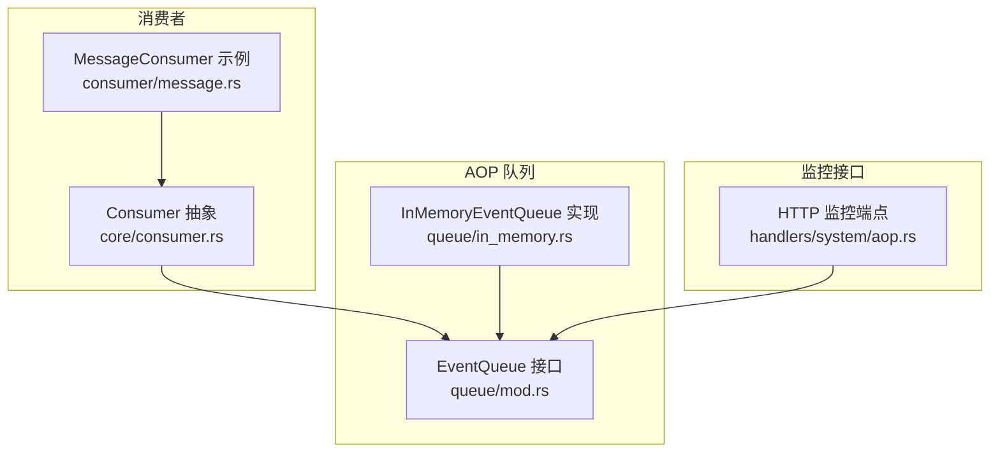
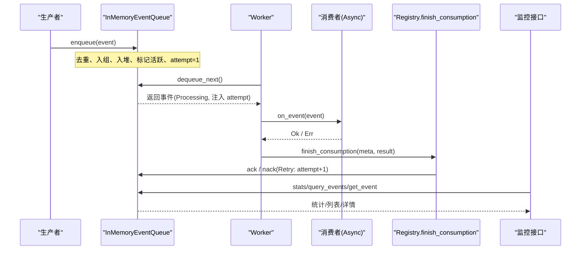
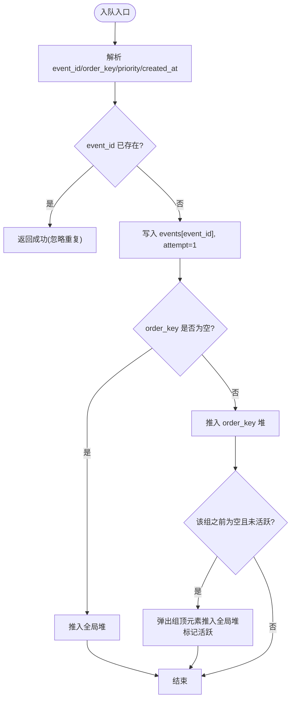
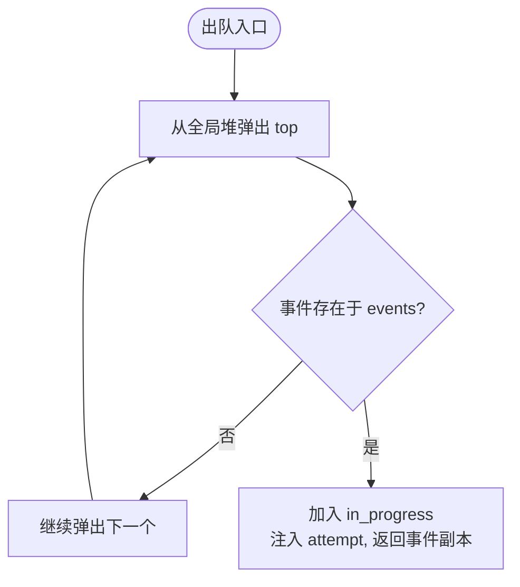
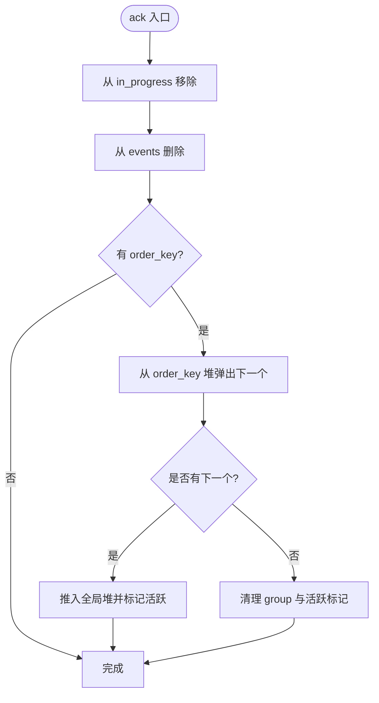
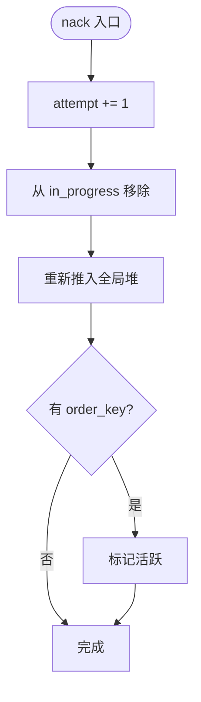
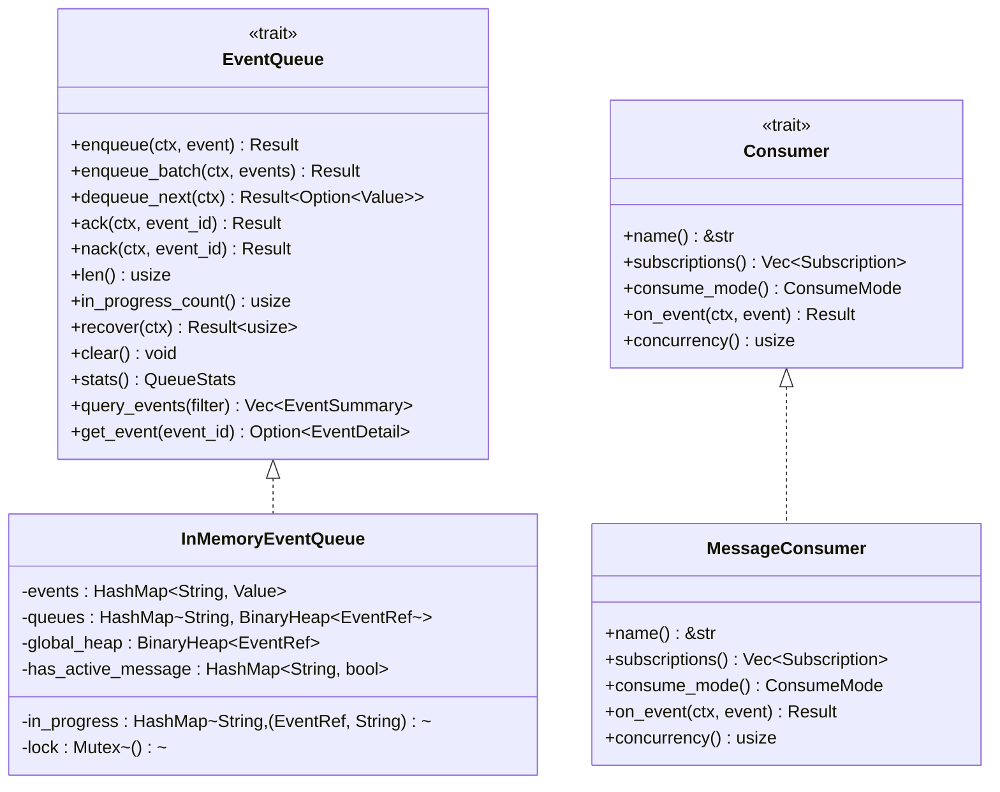

# 队列实现

<cite>
**本文引用的文件**
- [in_memory.rs](src/pkg/aop/queue/in_memory.rs) — `InMemoryEventQueue` / `EventRef.attempt`
- [mod.rs（队列接口）](src/pkg/aop/queue/mod.rs) — `EventQueue` trait
- [consumer.rs](src/pkg/aop/core/consumer.rs) — `Consumer` / `Subscription`
- [registry.rs](src/pkg/aop/core/registry.rs) — `finish_consumption` / `DeliveryOutcome`
- [event_sink.rs](src/pkg/aop/core/event_sink.rs) — `EventSink`
- [aop.rs（系统监控接口）](src/handlers/system/aop.rs)
- [message.rs（消息消费者示例）](src/consumer/message.rs)
</cite>

## 更新摘要
**变更内容**
- 收尾归属：删除 `Consumer::ack/nack`，消费结束统一由 `Registry::finish_consumption` 单点按 topic 反查 producer 回调 `on_consumed` / `on_failed`；队列侧 `DeliveryOutcome { Ack, Nack }` 驱动 ack/nack
- 重试计数：`EventRef.attempt` 记录被消费累计次数，`nack` 时自增，下次 `dequeue_next` 注入封套供消费侧读取 `AopEventMeta.attempt`；框架不设 `max_retry`、无死信
- 消费者契约：`interested_events()` → `subscriptions()`（`Subscription { kind, ordered, notify_producer }`）；不再由消费者自行 ack/nack
- 投递：生产者经 `EventSink::emit` 投递，校验 `event.kind() == topic`

## 目录
1. [简介](#简介)
2. [项目结构](#项目结构)
3. [核心组件](#核心组件)
4. [架构总览](#架构总览)
5. [详细组件分析](#详细组件分析)
6. [依赖关系分析](#依赖关系分析)
7. [性能考量](#性能考量)
8. [故障排查指南](#故障排查指南)
9. [结论](#结论)
10. [附录：监控接口使用示例](#附录监控接口使用示例)

## 简介
本文件聚焦 AOP 事件队列的内存实现 InMemoryEventQueue，系统性说明其数据结构设计、并发安全机制与性能特性；详解入队、出队、确认与否定确认的核心逻辑；解释 Pending 与 Processing 状态转换规则；文档化批量入队的实现与优化策略；并给出队列统计信息的收集与维护方式，以及监控接口的使用说明。

## 项目结构
AOP 队列位于 `pkg/aop` 模块中，采用「接口 + 实现」的分层组织：
- 队列接口定义在 `queue/mod.rs`，提供 `EventQueue` trait 及统计、查询等监控方法。
- 内存队列实现为 `in_memory.rs`，基于 `Mutex` 实现线程安全的并发控制。
- 消费者通过 `core/consumer.rs` 的 `Consumer` trait 接入，通过 `subscriptions()` 声明订阅，支持同步与异步两种消费模式；异步模式下由框架按 `concurrency` 启动 worker。
- 系统监控 HTTP 接口在 `handlers/system/aop.rs`，暴露 stats、events、event 查询能力。



图表来源
- [mod.rs（队列接口）](src/pkg/aop/queue/mod.rs)
- [in_memory.rs](src/pkg/aop/queue/in_memory.rs)
- [consumer.rs](src/pkg/aop/core/consumer.rs)
- [aop.rs](src/handlers/system/aop.rs)

章节来源
- [mod.rs（队列接口）](src/pkg/aop/queue/mod.rs)
- [in_memory.rs](src/pkg/aop/queue/in_memory.rs)
- [consumer.rs](src/pkg/aop/core/consumer.rs)
- [aop.rs](src/handlers/system/aop.rs)

## 核心组件
- InMemoryEventQueue：内存中的事件队列，维护事件存储、按 `order_key` 分组队列、全局优先级堆、处理中事件集合与活跃标记。
- EventQueue 接口：定义 `enqueue` / `enqueue_batch` / `dequeue_next` / `ack` / `nack` / `len` / `in_progress_count` / `recover` / `clear` / `stats` / `query_events` / `get_event` 等方法。
- Consumer：事件消费者抽象，通过 `subscriptions()` 声明 `Subscription { kind, ordered, notify_producer }` 与 `consume_mode`；异步模式下由框架按 `concurrency` 启动 worker 拉取，收尾统一在 `finish_consumption`。
- 监控接口：HTTP 端点将队列 `stats`、事件列表、事件详情暴露给外部。

章节来源
- [in_memory.rs](src/pkg/aop/queue/in_memory.rs)
- [mod.rs（队列接口）](src/pkg/aop/queue/mod.rs)
- [consumer.rs](src/pkg/aop/core/consumer.rs)
- [aop.rs](src/handlers/system/aop.rs)

## 架构总览
AOP 事件中心的工作流如下：
- 生产者经 `EventSink::emit` 发布事件到队列（`enqueue`），队列根据 `event_id` 去重，按 `priority` 和 `created_at` 排序，并按 `order_key` 分组；`attempt` 初始为 1。
- 消费者以 Async 模式运行，worker 循环从队列 `dequeue_next` 获取待处理事件，执行 `on_event`。
- 消费结束交给 `finish_consumption`：按 topic 反查 producer 回调 `on_consumed` / `on_failed`，由 `RetryDecision` 决定 `Ack` / `Nack`（Nack 触发 `nack` 重投，`attempt` 自增）。
- 监控系统通过 `stats`、`query_events`、`get_event` 读取队列快照，用于可视化与排障。



图表来源
- [in_memory.rs](src/pkg/aop/queue/in_memory.rs)
- [consumer.rs](src/pkg/aop/core/consumer.rs)
- [registry.rs](src/pkg/aop/core/registry.rs)
- [aop.rs](src/handlers/system/aop.rs)

## 详细组件分析

### 数据结构与并发安全
- 事件存储：`HashMap<String, serde_json::Value>`，键为 `event_id`，值为事件 JSON。
- 分组队列：`HashMap<String, BinaryHeap<EventRef>>`，按 `order_key` 分组，每个组内用最大堆维护优先级。
- 全局堆：`BinaryHeap<EventRef>`，跨所有 `order_key` 的全局优先级队列，用于快速取出下一个可处理事件。
- 处理中集合：`HashMap<String, (EventRef, String)>`，记录正在处理的事件及其 `order_key`。
- 活跃标记：`HashMap<String, bool>`，标记某个 `order_key` 是否有活动事件进入全局堆，避免重复推送。
- `EventRef`：除 `event_id` / `order_key` / `priority` / `created_at` 外含 `attempt` 字段，记录被消费累计次数。
- 并发安全：
  - 使用 `Mutex<()>` 作为全局锁，保护所有写操作与关键读操作。
  - 对外实现 `Send + Sync`，保证多线程安全。

复杂度与特性
- 入队：O(log N) 堆插入，哈希表 O(1)。
- 出队：O(log N) 堆弹出，哈希表查找 O(1)。
- 确认/否定确认：O(log N) 堆操作或 O(1) 删除。
- 统计：O(K) 遍历各 `order_key` 的队列长度，K 为不同 `order_key` 数量。

章节来源
- [in_memory.rs](src/pkg/aop/queue/in_memory.rs)
- [mod.rs（队列接口）](src/pkg/aop/queue/mod.rs)

### 核心操作：入队（enqueue）
- 解析事件关键字段：`event_id`、`order_key`、`priority`、`created_at`。
- 去重：若 `event_id` 已存在则直接返回，避免重复入队。
- 存储事件：写入 `events` 映射。
- 分组与全局堆：
  - 若 `order_key` 为空，直接推入全局堆。
  - 否则加入对应 `order_key` 的堆；若该组之前为空且未标记活跃，弹出当前最高优先级事件推入全局堆，并标记活跃。
- `attempt` 初始为 1（首次取出即 `attempt == 1`）。
- 并发：整个流程受 `Mutex` 保护，确保一致性。



图表来源
- [in_memory.rs](src/pkg/aop/queue/in_memory.rs)

章节来源
- [in_memory.rs](src/pkg/aop/queue/in_memory.rs)

### 核心操作：出队（dequeue_next）
- 从全局堆弹出最高优先级事件引用。
- 校验事件是否存在于 `events`，不存在则跳过继续尝试下一个。
- 将事件移入 `in_progress`，并把 `event_ref.attempt` 注入事件 JSON 顶层（消费侧读取 `AopEventMeta.attempt`），返回事件副本供消费者处理。
- 并发：受 `Mutex` 保护，保证原子性。



图表来源
- [in_memory.rs](src/pkg/aop/queue/in_memory.rs)

章节来源
- [in_memory.rs](src/pkg/aop/queue/in_memory.rs)

### 核心操作：确认（ack）与否定确认（nack）
- ack：
  - 从 `in_progress` 移除事件，并从 `events` 删除。
  - 若属于某 `order_key`，检查该组是否还有剩余事件；若有，弹出下一个推入全局堆并标记活跃；若为空，清理该组与活跃标记。
- nack：
  - 先将该事件 `attempt` 自增（累计消费次数 +1）。
  - 从 `in_progress` 移除事件，将其重新推回全局堆以便重试（`dequeue_next` 会带上新的 `attempt`）。
  - 若属于某 `order_key`，标记活跃以确保调度继续。



图表来源
- [in_memory.rs](src/pkg/aop/queue/in_memory.rs)



图表来源
- [in_memory.rs](src/pkg/aop/queue/in_memory.rs)

章节来源
- [in_memory.rs](src/pkg/aop/queue/in_memory.rs)

### 事件状态管理：Pending 与 Processing
- Pending：事件存在于 `events` 但不在 `in_progress`。
- Processing：事件存在于 `in_progress`。
- 转换规则：
  - enqueue：事件进入 Pending（若尚未存在）。
  - dequeue_next：Pending → Processing（并注入 `attempt`）。
  - ack：Processing → 删除（完成）。
  - nack：Processing → Pending（重新入堆等待重试，`attempt` 自增）。

```mermaid
graph TB
Enqueue["enqueue"] --> Pending["Pending"]
Pending -->|dequeue_next| Processing["Processing"]
Processing -->|nack(attempt+1)| Pending
Processing -->|ack| Done(["完成(删除)"])
```

图表来源
- [in_memory.rs](src/pkg/aop/queue/in_memory.rs)
- [mod.rs（队列接口）](src/pkg/aop/queue/mod.rs)

章节来源
- [in_memory.rs](src/pkg/aop/queue/in_memory.rs)
- [mod.rs（队列接口）](src/pkg/aop/queue/mod.rs)

### 批量操作：enqueue_batch
- 默认实现：对每个事件依次调用 `enqueue`，保持与单条入队一致的去重与排序逻辑。
- 优化策略建议：
  - 批内去重：先对批次内 `event_id` 去重，减少重复入队开销。
  - 批量构建堆：先将批次内事件按 `order_key` 分组，再一次性合并到对应组的堆，最后统一将各组顶元素推入全局堆，降低堆操作次数。
  - 提前计算活跃标记：对首次出现的 `order_key` 设置活跃标记，避免重复推送。
- 注意：当前实现简单可靠，适合中小批量；超大批量可按上述策略扩展。

章节来源
- [in_memory.rs](src/pkg/aop/queue/in_memory.rs)

### 统计信息：stats、order_keys、oldest_event_age_secs
- pending_count：`events` 总数减去 `in_progress` 数量。
- in_progress_count：`in_progress` 大小。
- order_keys：遍历各 `order_key` 的队列长度，仅保留 pending > 0 的项，并按 `pending_count` 降序排列。
- oldest_event_age_secs：扫描 `events` 中 `created_at` 的最小值，计算距今秒数。
- 并发：所有统计读取均受 `Mutex` 保护，保证一致性。

章节来源
- [in_memory.rs](src/pkg/aop/queue/in_memory.rs)

### 监控接口：stats()、query_events()、get_event()
- `stats()`：返回 `QueueStats`，包含 `pending_count`、`in_progress_count`、`order_keys`、`oldest_event_age_secs`。
- `query_events(filter)`：按 `order_key`、`status`、`limit`、`offset` 过滤并分页返回 `EventSummary` 列表，按 `created_at` 降序。
- `get_event(event_id)`：返回 `EventDetail`，包含 `summary` 与 `payload_preview`（前 200 字符脱敏）。
- HTTP 端点：
  - `GET /api/v1/system/aop/stats`：获取所有消费者队列统计。
  - `GET /api/v1/system/aop/{consumer}/stats`：获取指定消费者队列统计。
  - `GET /api/v1/system/aop/{consumer}/events`：列出事件，支持 `status`、`order_key`、`limit`、`offset`。
  - `GET /api/v1/system/aop/{consumer}/events/{event_id}`：获取事件详情。

章节来源
- [in_memory.rs](src/pkg/aop/queue/in_memory.rs)
- [aop.rs](src/handlers/system/aop.rs)

## 依赖关系分析
- InMemoryEventQueue 依赖：
  - `RequestContext`：上下文传递（在接口签名中保留，实现中部分方法未使用）。
  - `serde_json`：事件以 JSON 形式存储与查询。
  - std 库：`Mutex`、`HashMap`、`BinaryHeap`。
- 消费者依赖：
  - `Consumer` trait：定义 `name`、`subscriptions()`、`consume_mode`、`on_event`、`concurrency` 等（不再有 `ack` / `nack`）。
  - `MessageConsumer`：具体业务消费者，通过 `subscriptions()` 订阅 `message.created`，异步消费；消息状态落库由 `MessageDalImpl`（`impl Producer for MessageDalImpl::on_consumed`）在收尾反查中完成。
- 监控接口依赖：
  - `domain().aop_monitor()`：聚合多个消费者的队列统计与查询结果。
  - `common::api`：请求/响应结构体。



图表来源
- [mod.rs（队列接口）](src/pkg/aop/queue/mod.rs)
- [in_memory.rs](src/pkg/aop/queue/in_memory.rs)
- [consumer.rs](src/pkg/aop/core/consumer.rs)
- [message.rs](src/consumer/message.rs)

章节来源
- [mod.rs（队列接口）](src/pkg/aop/queue/mod.rs)
- [in_memory.rs](src/pkg/aop/queue/in_memory.rs)
- [consumer.rs](src/pkg/aop/core/consumer.rs)
- [message.rs](src/consumer/message.rs)

## 性能考量
- 时间复杂度：
  - 入队/出队/确认/否定确认均为 O(log N)，N 为全局堆大小。
  - 统计为 O(K)，K 为不同 `order_key` 数量。
- 空间复杂度：
  - 线性于事件总数，额外存储分组堆与处理中集合。
- 并发模型：
  - 单锁串行化写操作，避免复杂锁粒度带来的死锁风险。
  - 读操作（如 `stats`、`query_events`）也加锁，保证一致性。
- 优化方向：
  - 批量入队批内去重与分组堆合并，减少堆操作次数。
  - 针对高并发场景，考虑分片队列或读写分离的锁粒度细化。
  - 热点 `order_key` 的堆操作可能成为瓶颈，可评估按 `order_key` 分桶并行。

[本节为通用性能讨论，不直接分析具体文件]

## 故障排查指南
- 事件重复入队：检查 `event_id` 是否唯一；当前实现会忽略重复 `event_id`。
- 事件卡住 Processing：框架在 worker 结束 `on_event` 后统一走 `finish_consumption` 执行 ack/nack；若消费者 panic 导致 worker 崩溃，事件可能留在 `in_progress`，需重启 worker 或经由 `recover` 重新入队。
- 无限重投（Nack 风暴）：消费返回 `Err` 且无 producer 时，`delivery_of` 兜底 `Nack` → `attempt` 持续自增、无限重投；入站生产者 `on_failed` 应经 `inbound_retry::decide`（`MAX_ATTEMPTS=8`）收敛为 `Discard`。
- Discard 静默：`Discard` 走 ack 且仍回调 `on_consumed`，打 `on_consume_discarded` 埋点（不计入失败率）；排查丢弃原因看 error 日志与丢弃埋点。
- 顺序错乱：检查 `order_key` 是否正确设置；无 `order_key` 的事件走全局堆，遵循 `priority` 与 `created_at`。
- 统计异常：确认 `stats` 读取是否在锁保护下；当前实现已加锁。
- 监控接口 404：确认 consumer 名称是否正确；错误提示会指明缺失的消费者或事件。

章节来源
- [in_memory.rs](src/pkg/aop/queue/in_memory.rs)
- [registry.rs](src/pkg/aop/core/registry.rs)
- [aop.rs](src/handlers/system/aop.rs)

## 结论
InMemoryEventQueue 以简洁的数据结构与严格的锁保护实现了高内聚、低耦合的内存事件队列。其支持按 `order_key` 分组与全局优先级调度，具备 Pending/Processing 状态机与完善的监控接口；`EventRef.attempt` 累计重试次数、`DeliveryOutcome` 驱动 ack/nack，配合 `finish_consumption` 单点收尾将重试决策权下沉生产者。对于大多数应用场景，该实现足以提供稳定高效的 AOP 事件处理能力；在高吞吐或极端并发场景下，可结合批量优化与分片策略进一步提升性能。

[本节为总结性内容，不直接分析具体文件]

## 附录：监控接口使用示例
- 获取所有消费者队列统计：
  - 请求：`GET /api/v1/system/aop/stats`
  - 响应：数组，每项包含 `consumer_name`、`pending_count`、`in_progress_count`、`order_keys`、`oldest_event_age_secs`。
- 获取指定消费者队列统计：
  - 请求：`GET /api/v1/system/aop/{consumer}/stats`
  - 响应：单个 `QueueStatsResponse`。
- 列出事件：
  - 请求：`GET /api/v1/system/aop/{consumer}/events?status={pending|processing}&order_key=...&limit=...&offset=...`
  - 响应：`EventSummary` 数组，按 `created_at` 降序。
- 获取事件详情：
  - 请求：`GET /api/v1/system/aop/{consumer}/events/{event_id}`
  - 响应：`EventDetailResponse`，包含 `summary` 与 `payload_preview`（前 200 字符）。

章节来源
- [aop.rs](src/handlers/system/aop.rs)
