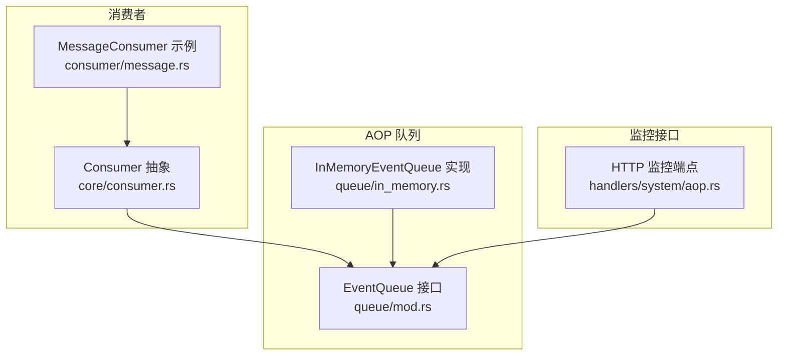
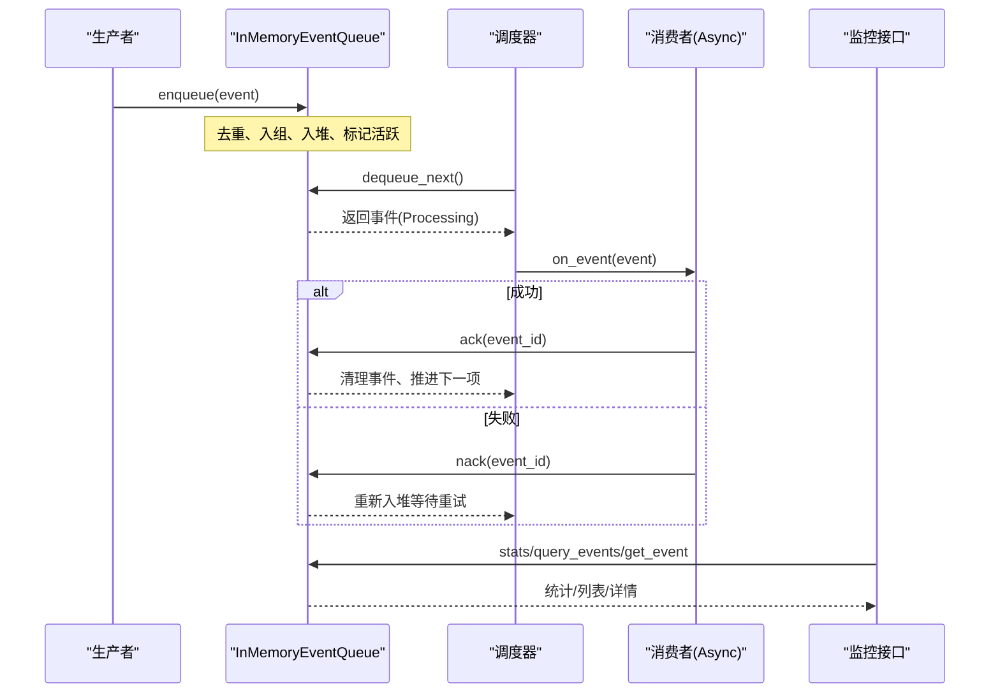
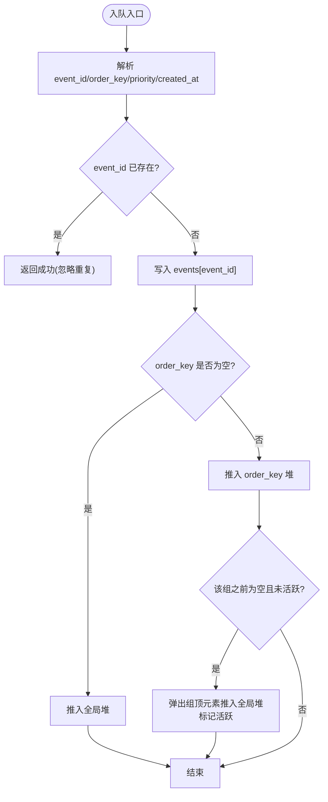
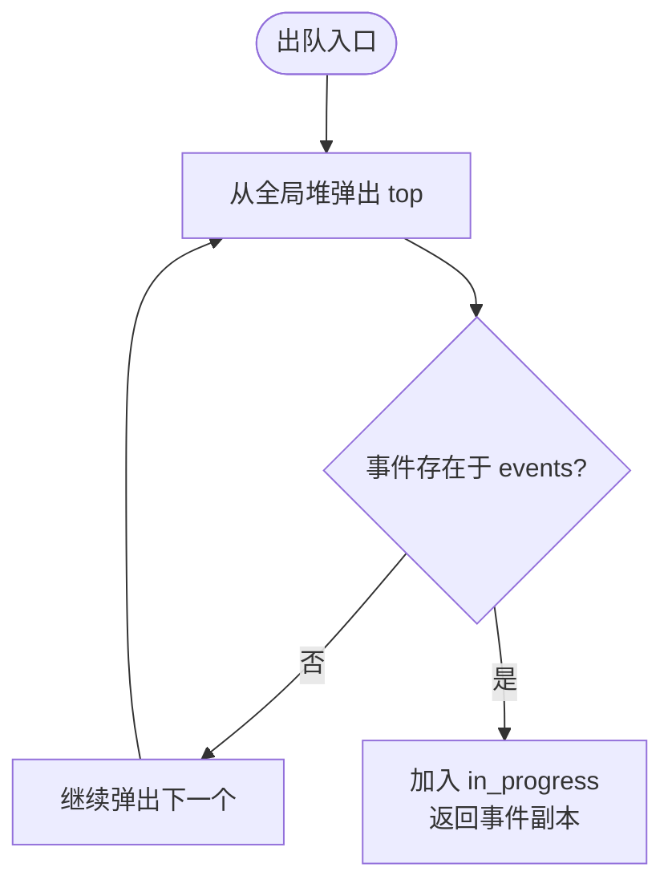
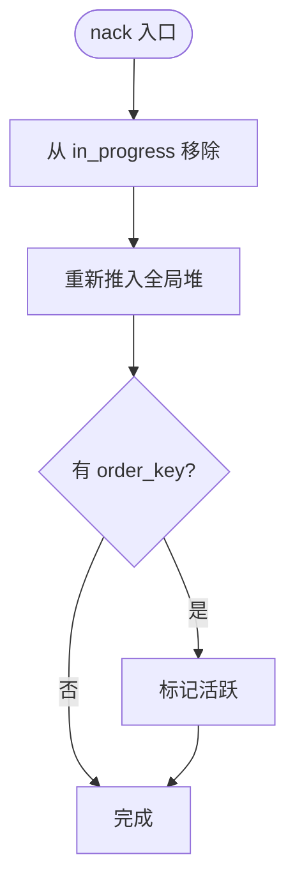
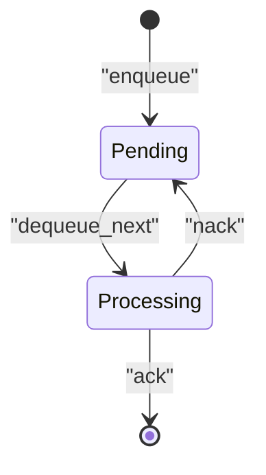

# 队列实现

<cite>
**本文引用的文件**
- [in_memory.rs](src/pkg/aop/queue/in_memory.rs)
- [mod.rs（队列接口）](src/pkg/aop/queue/mod.rs)
- [consumer.rs](src/pkg/aop/core/consumer.rs)
- [aop.rs（系统监控接口）](src/handlers/system/aop.rs)
- [message.rs（消息消费者示例）](src/consumer/message.rs)
</cite>

## 目录
1. [简介](#简介)
2. [项目结构](#项目结构)
3. [核心组件](#核心组件)
4. [架构总览](#架构总览)
5. [详细组件分析](#详细组件分析)
6. [依赖关系分析](#依赖关系分析)
7. [性能考量](#性能考量)
8. [故障排查指南](#故障排查指南)
9. [结论](#结论)
10. [附录：监控接口使用示例](#附录监控接口使用示例)

## 简介
本文件聚焦 AOP 事件队列的内存实现 InMemoryEventQueue，系统性说明其数据结构设计、并发安全机制与性能特性；详解入队、出队、确认与否定确认的核心逻辑；解释 Pending 与 Processing 状态转换规则；文档化批量入队的实现与优化策略；并给出队列统计信息的收集与维护方式，以及监控接口的使用说明。

## 项目结构
AOP 队列位于 pkg/aop 模块中，采用“接口 + 实现”的分层组织：
- 队列接口定义在 queue/mod.rs，提供 EventQueue trait 及统计、查询等监控方法。
- 内存队列实现为 in_memory.rs，基于 UnsafeCell + Mutex 实现线程安全的并发控制。
- 消费者通过 core/consumer.rs 的 Consumer trait 接入，支持同步与异步两种消费模式。
- 系统监控 HTTP 接口在 handlers/system/aop.rs，暴露 stats、events、event 查询能力。



图表来源
- [mod.rs（队列接口）:1-107](src/pkg/aop/queue/mod.rs#L1-L107)
- [in_memory.rs:104-449](src/pkg/aop/queue/in_memory.rs#L104-L449)
- [consumer.rs:1-72](src/pkg/aop/core/consumer.rs#L1-L72)
- [aop.rs:14-145](src/handlers/system/aop.rs#L14-L145)

章节来源
- [mod.rs（队列接口）:1-107](src/pkg/aop/queue/mod.rs#L1-L107)
- [in_memory.rs:1-449](src/pkg/aop/queue/in_memory.rs#L1-L449)
- [consumer.rs:1-72](src/pkg/aop/core/consumer.rs#L1-L72)
- [aop.rs:14-145](src/handlers/system/aop.rs#L14-L145)

## 核心组件
- InMemoryEventQueue：内存中的事件队列，维护事件存储、按 order_key 分组队列、全局优先级堆、处理中事件集合与活跃标记。
- EventQueue 接口：定义 enqueue、enqueue_batch、dequeue_next、ack、nack、stats、query_events、get_event 等方法。
- Consumer：事件消费者抽象，支持 Sync/Async 模式，异步模式下由调度器拉取队列事件并调用 on_event，完成后 ack/nack。
- 监控接口：HTTP 端点将队列 stats、事件列表、事件详情暴露给外部。

章节来源
- [in_memory.rs:104-449](src/pkg/aop/queue/in_memory.rs#L104-L449)
- [mod.rs（队列接口）:77-107](src/pkg/aop/queue/mod.rs#L77-L107)
- [consumer.rs:1-72](src/pkg/aop/core/consumer.rs#L1-L72)
- [aop.rs:14-145](src/handlers/system/aop.rs#L14-L145)

## 架构总览
AOP 事件中心的工作流如下：
- 生产者发布事件到队列（enqueue），队列根据 event_id 去重，按 priority 和 created_at 排序，并按 order_key 分组。
- 消费者以 Async 模式运行，调度器循环从队列 dequeue_next 获取待处理事件，执行 on_event。
- 成功时调用 ack，失败时调用 nack，队列据此更新事件状态与后续调度。
- 监控系统通过 stats、query_events、get_event 读取队列快照，用于可视化与排障。



图表来源
- [in_memory.rs:106-267](src/pkg/aop/queue/in_memory.rs#L106-L267)
- [consumer.rs:24-72](src/pkg/aop/core/consumer.rs#L24-L72)
- [aop.rs:14-145](src/handlers/system/aop.rs#L14-L145)

## 详细组件分析

### 数据结构与并发安全
- 事件存储：HashMap<String, serde_json::Value>，键为 event_id，值为事件 JSON。
- 分组队列：HashMap<String, BinaryHeap<EventRef>>，按 order_key 分组，每个组内用最大堆维护优先级。
- 全局堆：BinaryHeap<EventRef>，跨所有 order_key 的全局优先级队列，用于快速取出下一个可处理事件。
- 处理中集合：HashMap<String, (EventRef, String)>，记录正在处理的事件及其 order_key。
- 活跃标记：HashMap<String, bool>，标记某个 order_key 是否有活动事件进入全局堆，避免重复推送。
- 并发安全：
  - 使用 Mutex<()> 作为全局锁，保护所有写操作与关键读操作。
  - 内部字段通过 UnsafeCell 访问，确保在持有锁的前提下进行高效可变借用。
  - 对外实现 Send + Sync，保证多线程安全。

复杂度与特性
- 入队：O(log N) 堆插入，哈希表 O(1)。
- 出队：O(log N) 堆弹出，哈希表查找 O(1)。
- 确认/否定确认：O(log N) 堆操作或 O(1) 删除。
- 统计：O(K) 遍历各 order_key 的队列长度，K 为不同 order_key 数量。

章节来源
- [in_memory.rs:11-49](src/pkg/aop/queue/in_memory.rs#L11-L49)
- [in_memory.rs:106-267](src/pkg/aop/queue/in_memory.rs#L106-L267)

### 核心操作：入队（enqueue）
- 解析事件关键字段：event_id、order_key、priority、created_at。
- 去重：若 event_id 已存在则直接返回，避免重复入队。
- 存储事件：写入 events 映射。
- 分组与全局堆：
  - 若 order_key 为空，直接推入全局堆。
  - 否则加入对应 order_key 的堆；若该组之前为空且未标记活跃，弹出当前最高优先级事件推入全局堆，并标记活跃。
- 并发：整个流程受 Mutex 保护，确保一致性。



图表来源
- [in_memory.rs:106-166](src/pkg/aop/queue/in_memory.rs#L106-L166)

章节来源
- [in_memory.rs:106-166](src/pkg/aop/queue/in_memory.rs#L106-L166)

### 核心操作：出队（dequeue_next）
- 从全局堆弹出最高优先级事件引用。
- 校验事件是否存在于 events，不存在则跳过继续尝试下一个。
- 将事件移入 in_progress，并返回事件副本供消费者处理。
- 并发：受 Mutex 保护，保证原子性。



图表来源
- [in_memory.rs:179-206](src/pkg/aop/queue/in_memory.rs#L179-L206)

章节来源
- [in_memory.rs:179-206](src/pkg/aop/queue/in_memory.rs#L179-L206)

### 核心操作：确认（ack）与否定确认（nack）
- ack：
  - 从 in_progress 移除事件，并从 events 删除。
  - 若属于某 order_key，检查该组是否还有剩余事件；若有，弹出下一个推入全局堆并标记活跃；若为空，清理该组与活跃标记。
- nack：
  - 从 in_progress 移除事件，将其重新推回全局堆以便重试。
  - 若属于某 order_key，标记活跃以确保调度继续。


图表来源
- [in_memory.rs:208-245](src/pkg/aop/queue/in_memory.rs#L208-L245)



图表来源
- [in_memory.rs:247-267](src/pkg/aop/queue/in_memory.rs#L247-L267)

章节来源
- [in_memory.rs:208-267](src/pkg/aop/queue/in_memory.rs#L208-L267)

### 事件状态管理：Pending 与 Processing
- Pending：事件存在于 events 但不在 in_progress。
- Processing：事件存在于 in_progress。
- 转换规则：
  - enqueue：事件进入 Pending（若尚未存在）。
  - dequeue_next：Pending → Processing。
  - ack：Processing → 删除（完成）。
  - nack：Processing → Pending（重新入堆等待重试）。



图表来源
- [in_memory.rs:106-267](src/pkg/aop/queue/in_memory.rs#L106-L267)
- [mod.rs（队列接口）:30-47](src/pkg/aop/queue/mod.rs#L30-L47)

章节来源
- [in_memory.rs:106-267](src/pkg/aop/queue/in_memory.rs#L106-L267)
- [mod.rs（队列接口）:30-47](src/pkg/aop/queue/mod.rs#L30-L47)

### 批量操作：enqueue_batch
- 默认实现：对每个事件依次调用 enqueue，保持与单条入队一致的去重与排序逻辑。
- 优化策略建议：
  - 批内去重：先对批次内 event_id 去重，减少重复入队开销。
  - 批量构建堆：先将批次内事件按 order_key 分组，再一次性合并到对应组的堆，最后统一将各组顶元素推入全局堆，降低堆操作次数。
  - 提前计算活跃标记：对首次出现的 order_key 设置活跃标记，避免重复推送。
- 注意：当前实现简单可靠，适合中小批量；超大批量可按上述策略扩展。

章节来源
- [in_memory.rs:168-177](src/pkg/aop/queue/in_memory.rs#L168-L177)

### 统计信息：stats、order_keys、oldest_event_age_secs
- pending_count：events 总数减去 in_progress 数量。
- in_progress_count：in_progress 大小。
- order_keys：遍历各 order_key 的队列长度，仅保留 pending > 0 的项，并按 pending_count 降序排列。
- oldest_event_age_secs：扫描 events 中 created_at 的最小值，计算距今秒数。
- 并发：所有统计读取均受 Mutex 保护，保证一致性。

章节来源
- [in_memory.rs:66-101](src/pkg/aop/queue/in_memory.rs#L66-L101)
- [in_memory.rs:300-312](src/pkg/aop/queue/in_memory.rs#L300-L312)

### 监控接口：stats()、query_events()、get_event()
- stats()：返回 QueueStats，包含 pending_count、in_progress_count、order_keys、oldest_event_age_secs。
- query_events(filter)：按 order_key、status、limit、offset 过滤并分页返回 EventSummary 列表，按 created_at 降序。
- get_event(event_id)：返回 EventDetail，包含 summary 与 payload_preview（前 200 字符脱敏）。
- HTTP 端点：
  - GET /api/v1/system/aop/stats：获取所有消费者队列统计。
  - GET /api/v1/system/aop/{consumer}/stats：获取指定消费者队列统计。
  - GET /api/v1/system/aop/{consumer}/events：列出事件，支持 status、order_key、limit、offset。
  - GET /api/v1/system/aop/{consumer}/events/{event_id}：获取事件详情。

章节来源
- [in_memory.rs:314-447](src/pkg/aop/queue/in_memory.rs#L314-L447)
- [aop.rs:14-145](src/handlers/system/aop.rs#L14-L145)

## 依赖关系分析
- InMemoryEventQueue 依赖：
  - RequestContext：上下文传递（在接口签名中保留，实现中部分方法未使用）。
  - serde_json：事件以 JSON 形式存储与查询。
  - std 库：UnsafeCell、Mutex、HashMap、BinaryHeap。
- 消费者依赖：
  - Consumer trait：定义 name、interested_events、consume_mode、on_event、ack、nack、concurrency 等。
  - MessageConsumer：具体业务消费者，演示 Async 模式下的 ack/nack 与业务编排。
- 监控接口依赖：
  - domain().aop_monitor()：聚合多个消费者的队列统计与查询结果。
  - common::api：请求/响应结构体。

```mermaid
classDiagram
class EventQueue {
<<trait>>
+enqueue(ctx, event) Result
+enqueue_batch(ctx, events) Result
+dequeue_next(ctx) Result<Option<Value>>
+ack(ctx, event_id) Result
+nack(ctx, event_id) Result
+len() usize
+in_progress_count() usize
+recover(ctx) Result<usize>
+clear() void
+stats() QueueStats
+query_events(filter) Vec<EventSummary>
+get_event(event_id) Option<EventDetail>
}
class InMemoryEventQueue {
-events : HashMap<String, Value>
-queues : HashMap<String, BinaryHeap<EventRef>>
-global_heap : BinaryHeap<EventRef>
-in_progress : HashMap<String, (EventRef, String)>
-has_active_message : HashMap<String, bool>
-lock : Mutex<()>
}
class Consumer {
<<trait>>
+name() &str
+interested_events() Vec<EventKind>
+consume_mode() ConsumeMode
+on_event(event) Result
+ack(event_id) Result
+nack(event_id) Result
+concurrency() usize
+empty_queue_sleep_ms() u64
+error_retry_sleep_ms() u64
}
class MessageConsumer {
+name() &str
+interested_events() Vec<EventKind>
+consume_mode() ConsumeMode
+on_event(event) Result
+ack(event_id) Result
+nack(event_id) Result
+concurrency() usize
}
EventQueue <|.. InMemoryEventQueue
Consumer <|.. MessageConsumer
```

图表来源
- [mod.rs（队列接口）:77-107](src/pkg/aop/queue/mod.rs#L77-L107)
- [in_memory.rs:11-49](src/pkg/aop/queue/in_memory.rs#L11-L49)
- [consumer.rs:1-72](src/pkg/aop/core/consumer.rs#L1-L72)
- [message.rs:64-141](src/consumer/message.rs#L64-L141)

章节来源
- [mod.rs（队列接口）:77-107](src/pkg/aop/queue/mod.rs#L77-L107)
- [in_memory.rs:11-49](src/pkg/aop/queue/in_memory.rs#L11-L49)
- [consumer.rs:1-72](src/pkg/aop/core/consumer.rs#L1-L72)
- [message.rs:64-141](src/consumer/message.rs#L64-L141)

## 性能考量
- 时间复杂度：
  - 入队/出队/确认/否定确认均为 O(log N)，N 为全局堆大小。
  - 统计为 O(K)，K 为不同 order_key 数量。
- 空间复杂度：
  - 线性于事件总数，额外存储分组堆与处理中集合。
- 并发模型：
  - 单锁串行化写操作，避免复杂锁粒度带来的死锁风险。
  - 读操作（如 stats、query_events）也加锁，保证一致性。
- 优化方向：
  - 批量入队批内去重与分组堆合并，减少堆操作次数。
  - 针对高并发场景，考虑分片队列或读写分离的锁粒度细化。
  - 热点 order_key 的堆操作可能成为瓶颈，可评估按 order_key 分桶并行。

[本节为通用性能讨论，不直接分析具体文件]

## 故障排查指南
- 事件重复入队：检查 event_id 是否唯一；当前实现会忽略重复 event_id。
- 事件卡住 Processing：确认消费者是否正确调用 ack/nack；若异常退出，事件将留在 in_progress。
- 顺序错乱：检查 order_key 是否正确设置；无 order_key 的事件走全局堆，遵循 priority 与 created_at。
- 统计异常：确认 stats 读取是否在锁保护下；当前实现已加锁。
- 监控接口 404：确认 consumer 名称是否正确；错误提示会指明缺失的消费者或事件。

章节来源
- [in_memory.rs:106-267](src/pkg/aop/queue/in_memory.rs#L106-L267)
- [aop.rs:43-71](src/handlers/system/aop.rs#L43-L71)
- [aop.rs:119-145](src/handlers/system/aop.rs#L119-L145)

## 结论
InMemoryEventQueue 以简洁的数据结构与严格的锁保护实现了高内聚、低耦合的内存事件队列。其支持按 order_key 分组与全局优先级调度，具备 Pending/Processing 状态机与完善的监控接口。对于大多数应用场景，该实现足以提供稳定高效的 AOP 事件处理能力；在高吞吐或极端并发场景下，可结合批量优化与分片策略进一步提升性能。

[本节为总结性内容，不直接分析具体文件]

## 附录：监控接口使用示例
- 获取所有消费者队列统计：
  - 请求：GET /api/v1/system/aop/stats
  - 响应：数组，每项包含 consumer_name、pending_count、in_progress_count、order_keys、oldest_event_age_secs。
- 获取指定消费者队列统计：
  - 请求：GET /api/v1/system/aop/{consumer}/stats
  - 响应：单个 QueueStatsResponse。
- 列出事件：
  - 请求：GET /api/v1/system/aop/{consumer}/events?status={pending|processing}&order_key=...&limit=...&offset=...
  - 响应：EventSummary 数组，按 created_at 降序。
- 获取事件详情：
  - 请求：GET /api/v1/system/aop/{consumer}/events/{event_id}
  - 响应：EventDetailResponse，包含 summary 与 payload_preview（前 200 字符）。

章节来源
- [aop.rs:14-145](src/handlers/system/aop.rs#L14-L145)