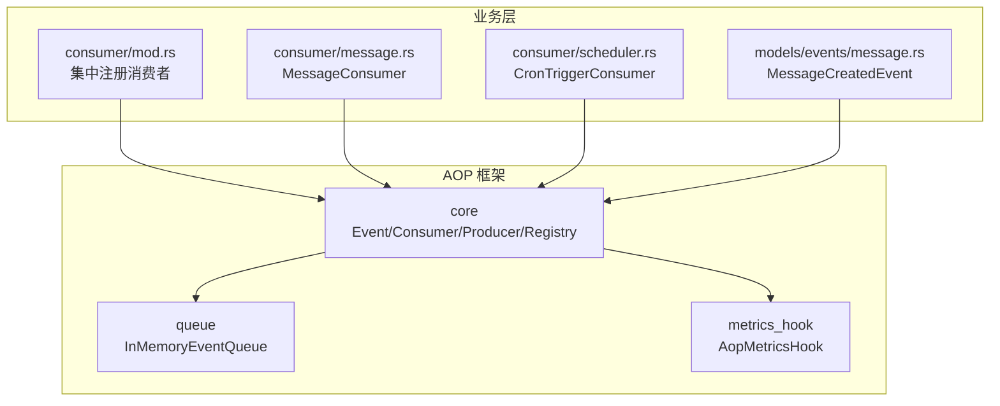
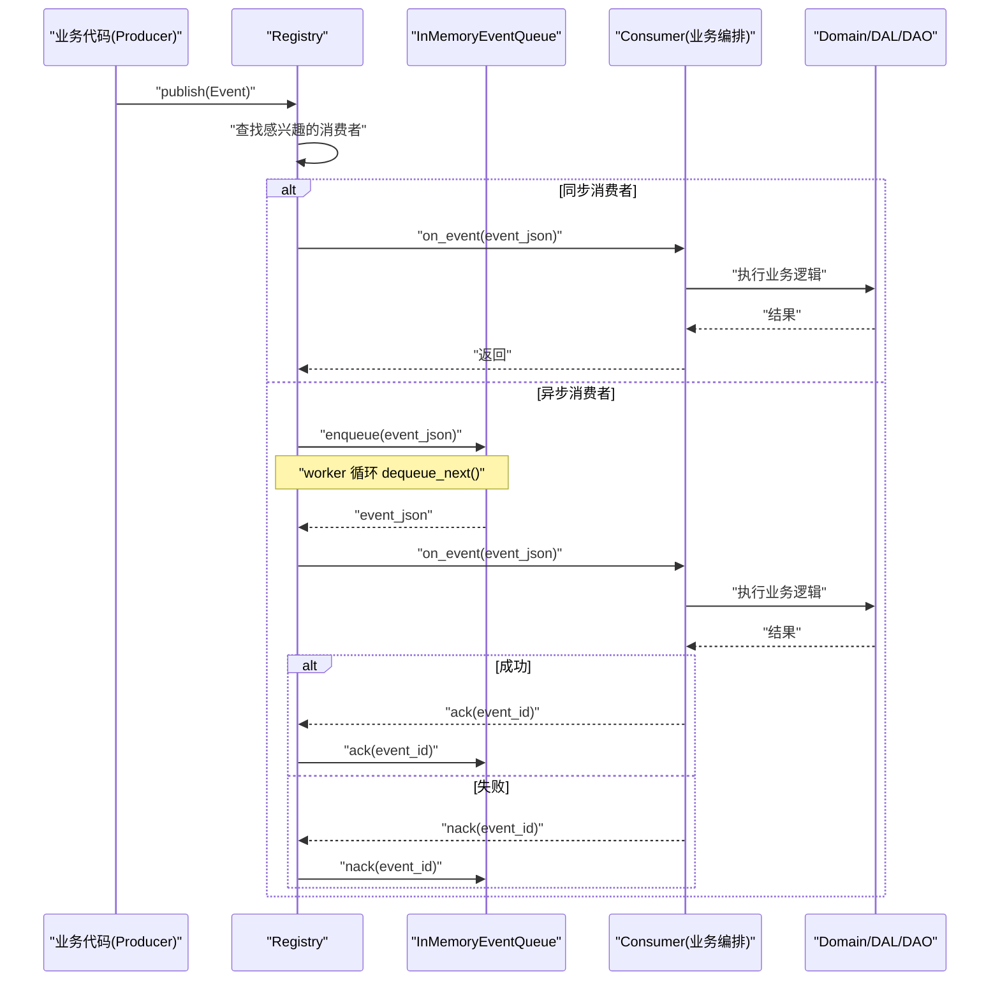
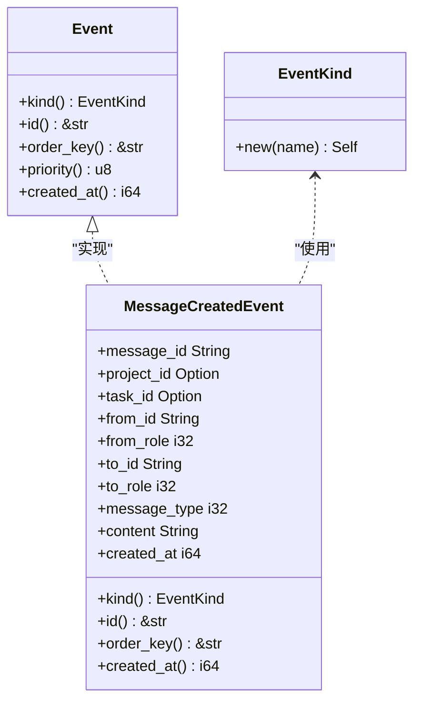
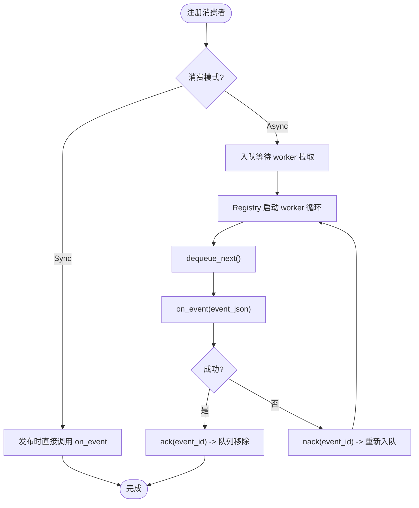
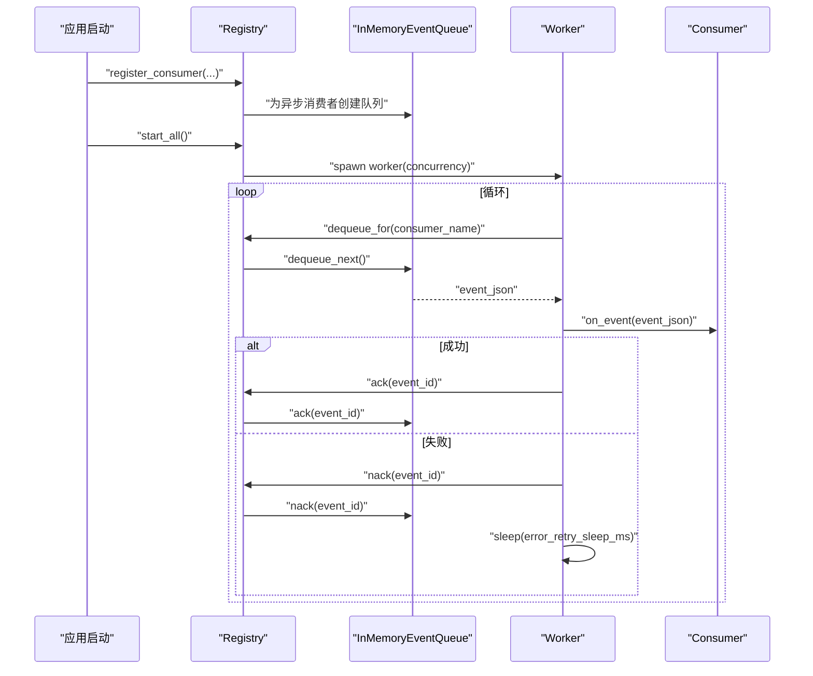
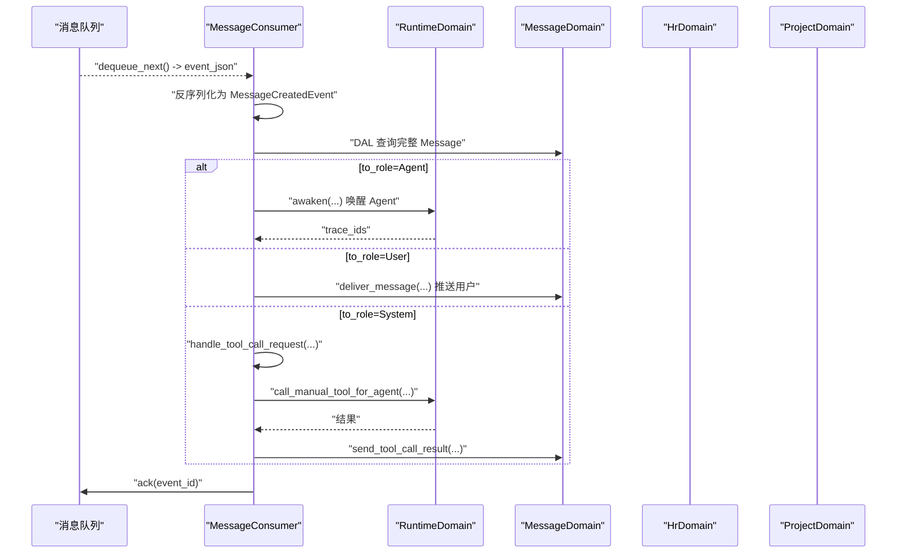
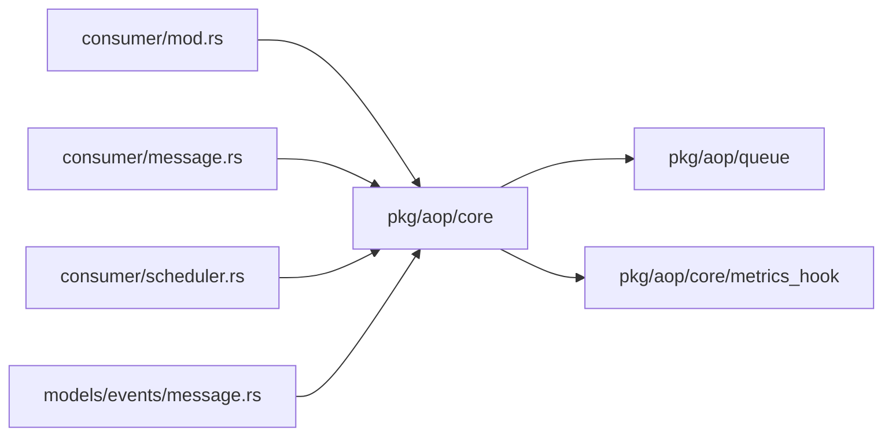

# 核心概念与架构

<cite>
**本文引用的文件**
- [src/pkg/aop/mod.rs](src/pkg/aop/mod.rs)
- [src/pkg/aop/core/event.rs](src/pkg/aop/core/event.rs)
- [src/pkg/aop/core/consumer.rs](src/pkg/aop/core/consumer.rs)
- [src/pkg/aop/core/producer.rs](src/pkg/aop/core/producer.rs)
- [src/pkg/aop/core/registry.rs](src/pkg/aop/core/registry.rs)
- [src/pkg/aop/core/metrics_hook.rs](src/pkg/aop/core/metrics_hook.rs)
- [src/pkg/aop/queue/in_memory.rs](src/pkg/aop/queue/in_memory.rs)
- [src/models/events/message.rs](src/models/events/message.rs)
- [src/consumer/mod.rs](src/consumer/mod.rs)
- [src/consumer/message.rs](src/consumer/message.rs)
- [src/consumer/scheduler.rs](src/consumer/scheduler.rs)
- [docs/event_design.md](docs/event_design.md)
</cite>

## 目录
1. [简介](#简介)
2. [项目结构](#项目结构)
3. [核心组件](#核心组件)
4. [架构总览](#架构总览)
5. [详细组件分析](#详细组件分析)
6. [依赖关系分析](#依赖关系分析)
7. [性能考量](#性能考量)
8. [故障排查指南](#故障排查指南)
9. [结论](#结论)
10. [附录：使用示例与最佳实践](#附录使用示例与最佳实践)

## 简介
本章节面向 AOP 事件系统的核心概念与架构，解释在 AI Orz 中如何实现面向切面编程的事件驱动机制。系统围绕 Event、Consumer、Producer、Registry 等核心抽象，提供统一的事件发布、注册、分发与异步调度能力；通过内存队列实现可靠消费、顺序保证与优先级调度；以 Hook 注入方式实现指标采集，保持框架层业务无关性。文档同时说明事件定义规范、生命周期管理、类型安全机制，以及注册中心的工作流程（消费者注册、事件分发、异步调度）。

## 项目结构
AOP 事件系统位于 src/pkg/aop 下，采用“核心抽象 + 队列实现 + 业务消费者”的分层组织：
- core：Event、Consumer、Producer、Registry、指标 Hook 等核心接口与分发器
- queue：底层队列抽象与内存实现（InMemoryEventQueue）
- impls：业务相关的事件与消费者（当前包含消息系统相关）
- consumer：业务层消费者注册入口，启动时集中注册各消费者到 Registry

图表来源
- [src/pkg/aop/core/registry.rs:1-561](src/pkg/aop/core/registry.rs#L1-L561)
- [src/pkg/aop/queue/in_memory.rs:1-449](src/pkg/aop/queue/in_memory.rs#L1-L449)
- [src/consumer/mod.rs:1-42](src/consumer/mod.rs#L1-L42)
- [src/consumer/message.rs:1-534](src/consumer/message.rs#L1-L534)
- [src/consumer/scheduler.rs:1-211](src/consumer/scheduler.rs#L1-L211)
- [src/models/events/message.rs:1-53](src/models/events/message.rs#L1-L53)

章节来源
- [src/pkg/aop/mod.rs:1-200](src/pkg/aop/mod.rs#L1-L200)
- [src/consumer/mod.rs:1-42](src/consumer/mod.rs#L1-L42)

## 核心组件
- Event：事件数据载体，具备唯一 ID、类型标识、顺序键、优先级、创建时间等元信息，支持序列化/反序列化，确保跨进程/队列传输的稳定性与可观测性。
- Consumer：事件消费者，声明感兴趣的事件类型列表、消费模式（同步/异步）、处理逻辑 on_event，以及异步确认 ack/nack、并发度与轮询策略。
- Producer：外部或内部生产者，负责将变化转换为事件并发布到 Registry；支持轮询模式与非轮询模式的生命周期管理。
- Registry：注册中心，维护消费者与生产者集合，按事件类型路由分发；为异步消费者分配独立队列，并启动 worker 拉取事件、执行 ack/nack 与重试退避。
- Queue：底层队列抽象，内存实现提供优先级堆、order_key 分组、in_progress 跟踪、查询与统计能力。
- Metrics Hook：指标采集钩子，零侵入地记录 publish/consume 成功/失败耗时等关键指标。

章节来源
- [src/pkg/aop/core/event.rs:1-25](src/pkg/aop/core/event.rs#L1-L25)
- [src/pkg/aop/core/consumer.rs:1-72](src/pkg/aop/core/consumer.rs#L1-L72)
- [src/pkg/aop/core/producer.rs:1-36](src/pkg/aop/core/producer.rs#L1-L36)
- [src/pkg/aop/core/registry.rs:1-561](src/pkg/aop/core/registry.rs#L1-L561)
- [src/pkg/aop/queue/in_memory.rs:1-449](src/pkg/aop/queue/in_memory.rs#L1-L449)
- [src/pkg/aop/core/metrics_hook.rs:1-90](src/pkg/aop/core/metrics_hook.rs#L1-L90)

## 架构总览
AOP 事件系统遵循“纯框架设计原则”，框架层不感知任何业务语义，仅负责事件流转与调度。业务层通过实现 Consumer/Producer 接入，并在启动阶段集中注册。事件发布后，Registry 根据消费者声明的兴趣事件进行分发；同步消费者直接调用 on_event，异步消费者入队并由 worker 拉取处理，完成 ack/nack 与重试。

图表来源
- [src/pkg/aop/core/registry.rs:97-206](src/pkg/aop/core/registry.rs#L97-L206)
- [src/pkg/aop/core/registry.rs:260-487](src/pkg/aop/core/registry.rs#L260-L487)
- [src/pkg/aop/queue/in_memory.rs:104-267](src/pkg/aop/queue/in_memory.rs#L104-L267)
- [src/consumer/message.rs:78-141](src/consumer/message.rs#L78-L141)

## 详细组件分析

### 事件模型与类型安全
- EventKind：静态字符串标识事件类型，便于路由与监控。
- Event trait：要求实现 kind、id、order_key、priority、created_at 等元信息，并通过 serde 序列化/反序列化，确保跨队列传输稳定。
- MessageCreatedEvent：具体事件实现，定义了 order_key 分层策略（Agent 接收者按 agent_id 串行，非 Agent 按 task/project 降级），保障同 Agent 的消息顺序与避免无效重试。

图表来源
- [src/pkg/aop/core/event.rs:1-25](src/pkg/aop/core/event.rs#L1-L25)
- [src/models/events/message.rs:1-53](src/models/events/message.rs#L1-L53)

章节来源
- [src/pkg/aop/core/event.rs:1-25](src/pkg/aop/core/event.rs#L1-L25)
- [src/models/events/message.rs:1-53](src/models/events/message.rs#L1-L53)

### 消费者与生产者的职责划分
- Consumer：声明 interested_events、consume_mode、on_event；异步消费者需实现 ack/nack，并可配置 concurrency、empty_queue_sleep_ms、error_retry_sleep_ms。
- Producer：对外部渠道或定时任务进行封装，支持 start/stop/poll；Registry 在 start_all 时自动启动轮询或非轮询模式的生产者。

图表来源
- [src/pkg/aop/core/consumer.rs:1-72](src/pkg/aop/core/consumer.rs#L1-L72)
- [src/pkg/aop/core/registry.rs:260-487](src/pkg/aop/core/registry.rs#L260-L487)
- [src/pkg/aop/queue/in_memory.rs:179-267](src/pkg/aop/queue/in_memory.rs#L179-L267)

章节来源
- [src/pkg/aop/core/consumer.rs:1-72](src/pkg/aop/core/consumer.rs#L1-L72)
- [src/pkg/aop/core/producer.rs:1-36](src/pkg/aop/core/producer.rs#L1-L36)

### 注册中心工作流程
- 消费者注册：register_consumer 按事件类型索引消费者；异步消费者分配独立 InMemoryEventQueue。
- 事件发布：publish 提取元字段并注入 JSON 顶层，供监控与队列使用；按 consume_mode 分派到同步或直接入队。
- 异步调度：start_all 扫描异步消费者，为每个消费者启动多个 worker；worker 循环 dequeue_next，成功则 ack，失败则 nack 并退避 sleep。
- 指标采集：通过 set_metrics_hook 注入 AopMetricsHook，在 publish/on_consume_start/on_consume_success/on_consume_failure 回调中记录指标。

图表来源
- [src/pkg/aop/core/registry.rs:49-95](src/pkg/aop/core/registry.rs#L49-L95)
- [src/pkg/aop/core/registry.rs:97-206](src/pkg/aop/core/registry.rs#L97-L206)
- [src/pkg/aop/core/registry.rs:260-487](src/pkg/aop/core/registry.rs#L260-L487)
- [src/pkg/aop/queue/in_memory.rs:104-267](src/pkg/aop/queue/in_memory.rs#L104-L267)

章节来源
- [src/pkg/aop/core/registry.rs:1-561](src/pkg/aop/core/registry.rs#L1-L561)
- [src/pkg/aop/core/metrics_hook.rs:1-90](src/pkg/aop/core/metrics_hook.rs#L1-L90)

### 业务消费者示例
- MessageConsumer：订阅 message.created，异步消费；从 DB 加载完整 Message，按 to_role 分发到 RuntimeDomain/MessageDomain/HrDomain/ProjectDomain；实现 ack/nack 更新消息状态；并发度 4，空队列休眠 100ms，错误重试 1000ms。
- CronTriggerConsumer：订阅 cron.trigger，同步消费；解析 payload.action，分别处理 agent_rest 与 project_followup；agent_rest 复用 settle_memory 公共函数，project_followup 扫描进行中项目并向 Owner Agent 发送跟进通知。

图表来源
- [src/consumer/message.rs:78-141](src/consumer/message.rs#L78-L141)
- [src/consumer/message.rs:147-357](src/consumer/message.rs#L147-L357)
- [src/consumer/message.rs:359-477](src/consumer/message.rs#L359-L477)

章节来源
- [src/consumer/message.rs:1-534](src/consumer/message.rs#L1-L534)
- [src/consumer/scheduler.rs:1-211](src/consumer/scheduler.rs#L1-L211)

## 依赖关系分析
- 框架层（pkg/aop）对业务无感知，仅依赖通用错误类型、RequestContext、serde 等基础库。
- 业务消费者（consumer/*）依赖 Domain/DAL/DAO 完成实际业务编排，但只通过 AOP 接口与框架交互。
- Registry 依赖 InMemoryEventQueue 提供队列能力，并通过 metrics_hook 注入指标采集逻辑。
- 事件模型（models/events/*）实现 Event trait，确保类型安全与可序列化。

图表来源
- [src/pkg/aop/core/registry.rs:1-561](src/pkg/aop/core/registry.rs#L1-L561)
- [src/pkg/aop/queue/in_memory.rs:1-449](src/pkg/aop/queue/in_memory.rs#L1-L449)
- [src/consumer/mod.rs:1-42](src/consumer/mod.rs#L1-L42)
- [src/consumer/message.rs:1-534](src/consumer/message.rs#L1-L534)
- [src/consumer/scheduler.rs:1-211](src/consumer/scheduler.rs#L1-L211)
- [src/models/events/message.rs:1-53](src/models/events/message.rs#L1-L53)

章节来源
- [src/pkg/aop/core/registry.rs:1-561](src/pkg/aop/core/registry.rs#L1-L561)
- [src/pkg/aop/queue/in_memory.rs:1-449](src/pkg/aop/queue/in_memory.rs#L1-L449)
- [src/consumer/mod.rs:1-42](src/consumer/mod.rs#L1-L42)

## 性能考量
- 优先级与顺序：InMemoryEventQueue 使用最大堆按 priority DESC、created_at ASC 排序；order_key 分组保证相同 key 的顺序消费，减少竞争与重试开销。
- 并发控制：Consumer 可配置 concurrency，Registry 为每个异步消费者启动对应数量的 worker，避免单点瓶颈。
- 退避策略：空队列与错误重试均支持 sleep 参数，防止紧密自旋导致 CPU 浪费。
- 指标采集：通过 AopMetricsHook 在 publish/consume 关键节点记录耗时与错误，便于定位性能问题。
- 历史演进：旧版事件总线设计强调持久化与恢复、优先级与顺序保证，当前 AOP 框架在此基础上提供更清晰的抽象与更灵活的调度。

章节来源
- [src/pkg/aop/queue/in_memory.rs:1-449](src/pkg/aop/queue/in_memory.rs#L1-L449)
- [src/pkg/aop/core/registry.rs:260-487](src/pkg/aop/core/registry.rs#L260-L487)
- [docs/event_design.md:1-195](docs/event_design.md#L1-L195)

## 故障排查指南
- 事件未消费：检查消费者是否已注册（consumer/mod.rs 中的 init），确认 interested_events 匹配；查看队列长度与 stats。
- 顺序阻塞：关注 order_key 设置是否正确；若同 order_key 大量堆积，检查是否有长时间处理或频繁 nack。
- 重复消费：确认 ack/nack 是否被正确调用；Registry 在成功路径调用 ack，失败路径调用 nack 并退避。
- 指标异常：检查是否注入 AopMetricsHook；核对 on_publish/on_consume_start/on_consume_success/on_consume_failure 回调是否生效。
- 历史兼容：旧版事件总线已归档，当前以 AOP 框架为准；如需迁移，参考计划文档与现有消费者实现。

章节来源
- [src/consumer/mod.rs:1-42](src/consumer/mod.rs#L1-L42)
- [src/pkg/aop/core/registry.rs:260-487](src/pkg/aop/core/registry.rs#L260-L487)
- [src/pkg/aop/core/metrics_hook.rs:1-90](src/pkg/aop/core/metrics_hook.rs#L1-L90)
- [docs/event_design.md:1-195](docs/event_design.md#L1-L195)

## 结论
AI Orz 的 AOP 事件系统通过 Event/Consumer/Producer/Registry 的核心抽象，实现了高内聚、低耦合的事件驱动架构。框架层保持业务无关性，业务层通过消费者编排领域逻辑；内存队列提供优先级、顺序与可靠性；指标 Hook 实现零侵入的可观测性。该设计适用于多 Agent 协作、消息投递、定时任务、工具执行等场景，具备良好的扩展性与可维护性。

## 附录：使用示例与最佳实践
- 事件定义规范
  - 实现 Event trait，明确 kind、id、order_key、priority、created_at；确保可序列化。
  - 合理设置 order_key：Agent 接收者按 agent_id 串行，非 Agent 按 task/project 降级，避免不必要的全局串行。
- 消费者实现要点
  - 声明 interested_events 与 consume_mode；异步消费者实现 ack/nack，并配置 concurrency、sleep 参数。
  - 在 on_event 中重建 RequestContext，调用 Domain/DAL/DAO 完成业务编排。
- 生产者与注册
  - 通过 consumer/mod.rs 的 init 集中注册所有消费者；必要时实现 Producer 并注册到 Registry。
  - 启动时调用 Registry::start_all，自动启动 worker 与生产者。
- 指标与可观测性
  - 注入 AopMetricsHook，记录 publish/consume 关键节点指标；利用队列 stats 与事件查询定位问题。
- 最佳实践
  - 优先使用异步消费者处理重任务，同步消费者用于轻量操作（如日志、指标）。
  - 合理设置 order_key 与优先级，平衡顺序与吞吐。
  - 避免在 on_event 中进行长事务；必要时拆分任务并通过事件驱动。
  - 使用 ack/nack 明确事件生命周期，防止消息丢失或重复处理。

章节来源
- [src/models/events/message.rs:1-53](src/models/events/message.rs#L1-L53)
- [src/consumer/message.rs:1-534](src/consumer/message.rs#L1-L534)
- [src/consumer/scheduler.rs:1-211](src/consumer/scheduler.rs#L1-L211)
- [src/pkg/aop/core/metrics_hook.rs:1-90](src/pkg/aop/core/metrics_hook.rs#L1-L90)
- [src/consumer/mod.rs:1-42](src/consumer/mod.rs#L1-L42)