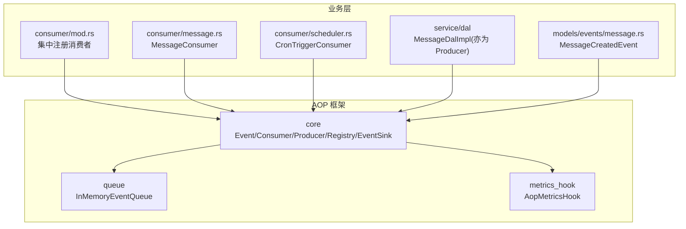
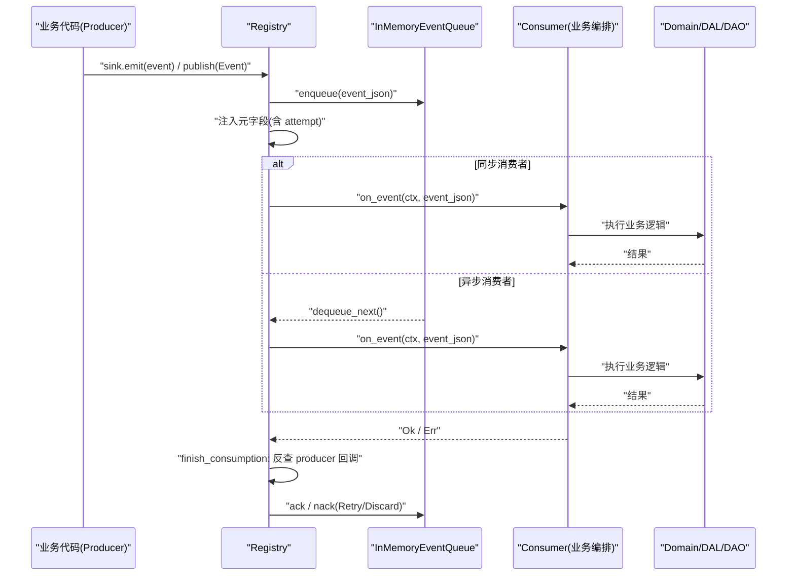
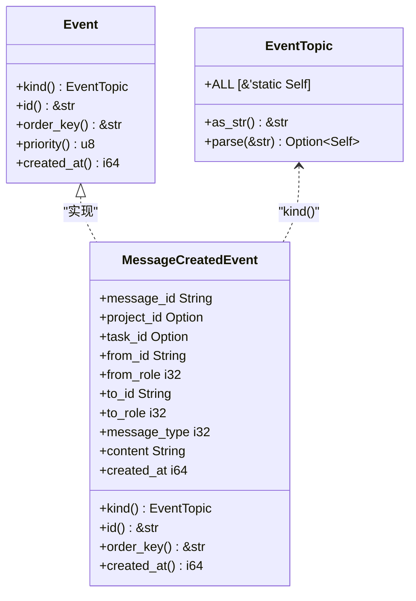
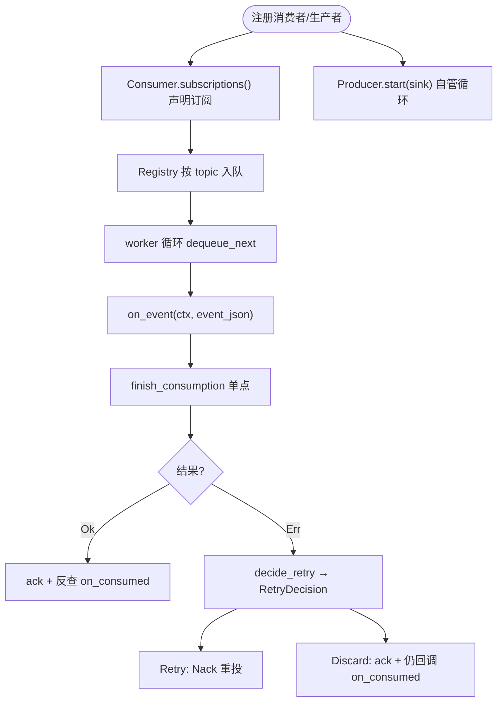
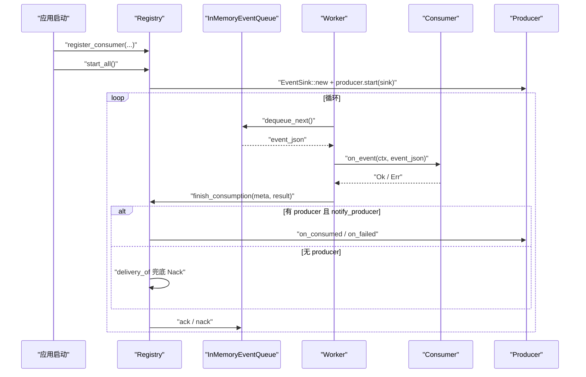
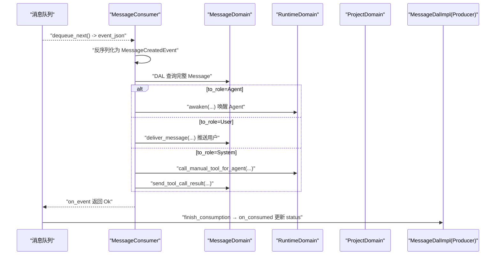
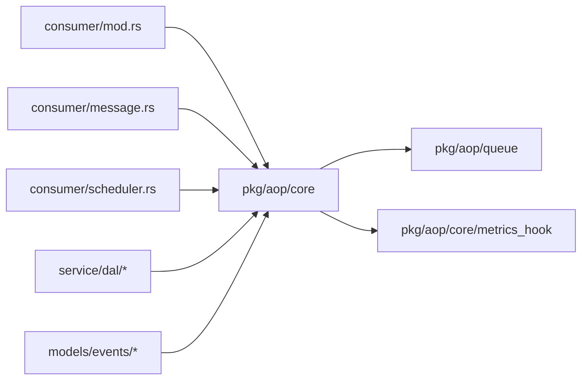

# 核心概念与架构

<cite>
**本文引用的文件**
- [src/pkg/aop/mod.rs](src/pkg/aop/mod.rs)
- [src/pkg/aop/core/event.rs](src/pkg/aop/core/event.rs) — `Event` trait（`kind` / `order_key` / `id` / `priority` / `created_at`）
- [src/pkg/aop/core/consumer.rs](src/pkg/aop/core/consumer.rs) — `Consumer` trait + `Subscription`
- [src/pkg/aop/core/producer.rs](src/pkg/aop/core/producer.rs) — `Producer` trait + `ProducerLoop` + `RetryDecision`
- [src/pkg/aop/core/event_sink.rs](src/pkg/aop/core/event_sink.rs) — `EventSink`（1 producer : 1 topic）
- [src/pkg/aop/core/registry.rs](src/pkg/aop/core/registry.rs) — `register_producer` / `start_all` / `finish_consumption` / `DeliveryOutcome`
- [src/pkg/aop/core/metrics_hook.rs](src/pkg/aop/core/metrics_hook.rs) — `AopMetricsHook` / `AopEventMeta`
- [src/pkg/aop/queue/in_memory.rs](src/pkg/aop/queue/in_memory.rs) — `EventRef.attempt`
- [common/src/enums/event_topic.rs](common/src/enums/event_topic.rs) — `EventTopic` 主题枚举
- [src/models/events/mod.rs](src/models/events/mod.rs) — 领域事件目录
- [src/models/events/message.rs](src/models/events/message.rs) — `MessageCreatedEvent`
- [src/consumer/mod.rs](src/consumer/mod.rs) — 集中注册消费者
- [src/consumer/message.rs](src/consumer/message.rs) — `MessageConsumer`（订阅 `message.created`）
- [src/consumer/scheduler.rs](src/consumer/scheduler.rs) — `CronTriggerConsumer`（订阅 `cron.trigger`）
- [docs/event_design.md](docs/event_design.md)

**本文关联的 RAG 知识卡**
- [AOP 生产消费事件中心：纯框架零业务 + pkg/aop/core 6 Trait + Registry 全局单例 + 8 类业务消费者注册](docs/wiki/knowledge/zh/AOP%20%E7%94%9F%E4%BA%A7%E6%B6%88%E8%B4%B9%E4%BA%8B%E4%BB%B6%E4%B8%AD%E5%BF%83%EF%BC%9A%E7%BA%AF%E6%A1%86%E6%9E%B6%E9%9B%B6%E4%B8%9A%E5%8A%A1%20+%20pkg/aop/core%206%20Trait%20+%20Registry%20%E5%85%A8%E5%B1%80%E5%8D%95%E4%BE%8B%20+%208%20%E7%B1%BB%E4%B8%9A%E5%8A%A1%E6%B6%88%E8%B4%B9%E8%80%85%E6%B3%A8%E5%86%8C/AOP%20%E7%94%9F%E4%BA%A7%E6%B6%88%E8%B4%B9%E4%BA%8B%E4%BB%B6%E4%B8%AD%E5%BF%83%EF%BC%9A%E7%BA%AF%E6%A1%86%E6%9E%B6%E9%9B%B6%E4%B8%9A%E5%8A%A1%20+%20pkg/aop/core%206%20Trait%20+%20Registry%20%E5%85%A8%E5%B1%80%E5%8D%95%E4%BE%8B%20+%208%20%E7%B1%BB%E4%B8%9A%E5%8A%A1%E6%B6%88%E8%B4%B9%E8%80%85%E6%B3%A8%E5%86%8C.md)
- [Domain 内部事件与消费者全链路](docs/wiki/knowledge/zh/Domain%20%E5%86%85%E9%83%A8%E4%BA%8B%E4%BB%B6%E4%B8%8E%E6%B6%88%E8%B4%B9%E8%80%85%E5%85%A8%E9%93%BE%E8%B7%AF%EF%BC%9A8%20%E7%B1%BB%20DomainEvent%20%E6%9E%83%E4%B8%BE%20+%208%20%E7%B1%BB%20Consumer%20%E4%B8%9A%E5%8A%A1%E6%B6%88%E8%B4%B9%20+%20AOP%20Producer%20%E6%8A%95%E9%80%92%E5%85%A5%E5%8F%A3%20+%20Registry%20%E8%AE%A2%E9%98%85/Domain%20%E5%86%85%E9%83%A8%E4%BA%8B%E4%BB%B6%E4%B8%8E%E6%B6%88%E8%B4%B9%E8%80%85%E5%85%A8%E9%93%BE%E8%B7%AF%EF%BC%9A8%20%E7%B1%BB%20DomainEvent%20%E6%9E%83%E4%B8%BE%20+%208%20%E7%B1%BB%20Consumer%20%E4%B8%9A%E5%8A%A1%E6%B6%88%E8%B4%B9%20+%20AOP%20Producer%20%E6%8A%95%E9%80%92%E5%85%A5%E5%8F%A3%20+%20Registry%20%E8%AE%A2%E9%98%85.md)
</cite>

## 更新摘要（生产者-消费者契约重构）
**变更内容**
- 主题体系：删除 `EventKind`，统一为 `common::enums::EventTopic`（`Event::kind() -> EventTopic`）；`EventTopic` 为闭环 16 变体枚举，点分线字符串
- 消费者：`interested_events()` → `subscriptions() -> Vec<Subscription>`（`Subscription { kind, ordered, notify_producer }`）；删除 `Consumer::ack/nack` 与 `source`，收尾统一由 `finish_consumption` 按 topic 反查 producer
- 生产者：删除 `register()` / `poll()` / `poll_interval_secs`；新增 `start(sink)` / `stop()` 与 `EventSink`；`ProducerLoop` 自管可中断循环；`RetryDecision { Retry, Discard }` 判定权下沉消费者（`decide_retry`）
- 收尾单一出口：`finish_consumption` 反查链（parse kind ∧ 声明 notify_producer ∧ 有 producer_for）→ 回调 `on_consumed` / `on_failed`；无 producer 时同样按 `decide_retry` 收敛（只是没有数据收尾）
- 「DAL-as-Producer」：`message.created` 等由对应 DAL 对象自身实现 `Producer` 收尾（如 `MessageDalImpl::on_consumed` 更新消息状态）

## 更新摘要 2026-08-31：Consumer 签名变更 + context_carrier 贯穿 AOP 事件链路

**核心变更**：AOP 事件中心引入 RequestContext 贯穿机制，解决消费侧丢失 log_id 导致链路断链的问题。

1. **Consumer.on_event 签名变更**：从 `on_event(&self, event: serde_json::Value)` 改为 `on_event(&self, ctx: RequestContext, event: serde_json::Value)`。框架在 Sync 和 Async 两条路径均通过 `carried_ctx(&event_json)` 从事件顶层 `context_carrier` 字段还原同源 ctx 后传入。

2. **AopEventMeta 扩展**：新增 `context_carrier: Option<ContextCarrier>` 字段，`from_json` 方法同步从事件顶层解析。

3. **Registry.publish 注入**：publish 时在统一元字段注入块之后，追加调用 `ctx.to_carrier()` 序列化链路标识到事件 JSON 顶层 `context_carrier` 字段。

4. **AopStatsHook 链路可观测日志**：四回调（on_publish / on_consume_start / on_consume_success / on_consume_failed）追加 `[aop] log_id={} event={} ...` 格式 sys_info! 日志，配套 `log_id_of(meta)` 辅助函数从 context_carrier 提取 log_id，缺失回退 "unknown"。

5. **业务 Consumer 适配**：所有业务 Consumer（message / agent_loop / task_event / think_round_stats / tool_exec_log / tool_exec_stats / scheduler）均已适配新签名。MessageConsumer 不再自己 `new_system()` 重建 ctx，而是以框架传来的 ctx 为基底用 `to_builder()` 追加业务字段。

---

## 目录
1. [简介](#简介)
2. [项目结构](#项目结构)
3. [核心组件](#核心组件)
4. [架构总览](#架构总览)
5. [详细组件分析](#详细组件分析)
6. [依赖关系分析](#依赖关系分析)
7. [性能考量](#性能考量)
8. [故障排查指南](#故障排查指南)
9. [结论](#结论)
10. [附录：使用示例与最佳实践](#附录使用示例与最佳实践)

## 简介
本章节面向 AOP 事件系统的核心概念与架构，解释在 AI Orz 中如何实现面向切面编程的事件驱动机制。系统围绕 Event、Consumer、Producer、Registry 等核心抽象，提供统一的事件发布、注册、分发与异步调度能力；通过内存队列实现可靠消费、顺序保证与优先级调度；以 Hook 注入方式实现指标采集，保持框架层业务无关性。文档同时说明事件定义规范、生命周期管理、类型安全机制，以及注册中心的工作流程（消费者注册、事件分发、异步调度、收尾反查）。

## 项目结构
AOP 事件系统位于 `src/pkg/aop` 下，采用「核心抽象 + 队列实现 + 业务消费者」的分层组织：
- core：Event、Consumer、Producer、Registry、EventSink、指标 Hook 等核心接口与分发器
- queue：底层队列抽象与内存实现（InMemoryEventQueue）
- impls：业务相关的事件与消费者（当前包含消息系统相关）
- consumer：业务层消费者注册入口，启动时集中注册各消费者到 Registry

图表来源
- [src/pkg/aop/core/registry.rs](src/pkg/aop/core/registry.rs)
- [src/pkg/aop/queue/in_memory.rs](src/pkg/aop/queue/in_memory.rs)
- [src/consumer/mod.rs](src/consumer/mod.rs)
- [src/consumer/message.rs](src/consumer/message.rs)
- [src/consumer/scheduler.rs](src/consumer/scheduler.rs)
- [src/models/events/message.rs](src/models/events/message.rs)

章节来源
- [src/pkg/aop/mod.rs](src/pkg/aop/mod.rs)
- [src/consumer/mod.rs](src/consumer/mod.rs)

## 核心组件
- Event：事件数据载体，具备唯一 ID、主题标识、顺序键、优先级、创建时间等元信息，支持序列化/反序列化，确保跨进程/队列传输的稳定性与可观测性。
- Consumer：事件消费者，通过 `subscriptions()` 声明订阅的 `Subscription { kind, ordered, notify_producer }`、消费模式（同步/异步）与处理逻辑 `on_event`；不再自行 ack/nack，收尾由框架统一处理。
- Producer：生产者通过 `EventSink` 投递事件，并实现 `start(sink)` / `stop()` 生命周期与 `on_consumed` / `on_failed` 收尾回调；`ProducerLoop` 自管可中断循环。
- Registry：注册中心，以 `producers_by_topic` / `consumers_by_topic` 维护生产者（按 topic 索引）与消费者集合；负责入队、出队、`start_all` / `shutdown_all` 编排与 `finish_consumption` 单点收尾反查。
- Queue：底层队列抽象，内存实现提供优先级堆、`order_key` 分组、`in_progress` 跟踪、查询与统计能力。
- Metrics Hook：指标采集钩子，零侵入地记录 publish/consume 成功/失败耗时等关键指标。

章节来源
- [src/pkg/aop/core/event.rs](src/pkg/aop/core/event.rs)
- [src/pkg/aop/core/consumer.rs](src/pkg/aop/core/consumer.rs)
- [src/pkg/aop/core/producer.rs](src/pkg/aop/core/producer.rs)
- [src/pkg/aop/core/registry.rs](src/pkg/aop/core/registry.rs)
- [src/pkg/aop/queue/in_memory.rs](src/pkg/aop/queue/in_memory.rs)
- [src/pkg/aop/core/metrics_hook.rs](src/pkg/aop/core/metrics_hook.rs)

## 架构总览
AOP 事件系统遵循「纯框架设计原则」，框架层不感知任何业务语义，仅负责事件流转与调度。业务层通过实现 Consumer/Producer 接入，并在启动阶段集中注册。事件发布后，Registry 入队；异步消费者由 worker 拉取处理，结束统一走 `finish_consumption` 单点收尾——按 topic 反查生产者回调 `on_consumed` / `on_failed`，由 `decide_retry` 判定的 `RetryDecision` 决定重试或丢弃。

图表来源
- [src/pkg/aop/core/event_sink.rs](src/pkg/aop/core/event_sink.rs)
- [src/pkg/aop/core/registry.rs](src/pkg/aop/core/registry.rs)
- [src/pkg/aop/queue/in_memory.rs](src/pkg/aop/queue/in_memory.rs)
- [src/consumer/message.rs](src/consumer/message.rs)

## 详细组件分析

### 事件模型与类型安全
- `EventTopic`：闭环枚举，定义于 `common/src/enums/event_topic.rs`，16 个变体，点分线字符串格式；提供 `as_str` / `parse` / `ALL` / `Display`，手写序列化以匹配点分格式。
- `Event` trait：要求 `kind() -> EventTopic`、`id()`、`order_key()`、`priority()`、`created_at()`，并通过 serde 序列化/反序列化，确保跨队列传输稳定。
- `MessageCreatedEvent`：具体事件实现，定义了 `order_key` 分层策略（Agent 接收者按 `agent_id` 串行，非 Agent 按 `task` / `project` 降级），保障同 Agent 的消息顺序与避免无效重试。

图表来源
- [src/pkg/aop/core/event.rs](src/pkg/aop/core/event.rs)
- [common/src/enums/event_topic.rs](common/src/enums/event_topic.rs)
- [src/models/events/message.rs](src/models/events/message.rs)

章节来源
- [src/pkg/aop/core/event.rs](src/pkg/aop/core/event.rs)
- [common/src/enums/event_topic.rs](common/src/enums/event_topic.rs)
- [src/models/events/message.rs](src/models/events/message.rs)

### 消费者与生产者的职责划分
- Consumer：通过 `subscriptions()` 返回 `Vec<Subscription>`，每项声明 `kind` / `ordered` / `notify_producer` 与 `consume_mode`；实现 `on_event(ctx, event_json)`；不再实现 ack/nack，框架在 `finish_consumption` 统一处理。
- Producer：对外部渠道或定时任务进行封装，通过 `EventSink::emit` 投递；`start(sink)` 中 spawn 自管循环（如 `ProducerLoop` 的 250ms 分片可中断 sleep）后立即返回，`stop()` 置位并 await；`on_consumed` / `on_failed` 完成收尾（`Retry` / `Discard` 由消费者 `decide_retry` 判定）。

图表来源
- [src/pkg/aop/core/consumer.rs](src/pkg/aop/core/consumer.rs)
- [src/pkg/aop/core/producer.rs](src/pkg/aop/core/producer.rs)
- [src/pkg/aop/core/registry.rs](src/pkg/aop/core/registry.rs)
- [src/pkg/aop/queue/in_memory.rs](src/pkg/aop/queue/in_memory.rs)

章节来源
- [src/pkg/aop/core/consumer.rs](src/pkg/aop/core/consumer.rs)
- [src/pkg/aop/core/producer.rs](src/pkg/aop/core/producer.rs)

### 注册中心工作流程
- 消费者注册：`register_consumer` 按 `subscriptions()` 中的 `kind` 索引消费者；异步消费者分配独立 InMemoryEventQueue；Sync 消费者声明 `ordered` 会在注册期返回 `Err`。
- 事件发布：`publish` / `EventSink::emit` 提取元字段并注入 JSON 顶层（含 `attempt`），供监控与队列使用；按 `consume_mode` 分派到同步或直接入队。
- 异步调度：`start_all` 先校验（声明 `notify_producer` 的 topic 缺 producer → 启动 `Err`），再为每个生产者建 `EventSink` 并 `start`；worker 循环 `dequeue_next`，调用 `on_event`，结果交给 `finish_consumption`。
- 收尾反查：`finish_consumption` 还原 `carried_ctx`，按 topic 反查 `producer_for(kind)`；存在且消费者声明 `notify_producer` → 回调 `on_consumed` / `on_failed`；无 producer 时同样按 `decide_retry` 收敛（只是没有数据收尾）。
- 指标采集：通过 `set_metrics_hook` 注入 `AopMetricsHook`，在 publish / on_consume_start / on_consume_success / on_consume_failure 回调中记录指标。

图表来源
- [src/pkg/aop/core/registry.rs](src/pkg/aop/core/registry.rs)
- [src/pkg/aop/core/event_sink.rs](src/pkg/aop/core/event_sink.rs)
- [src/pkg/aop/queue/in_memory.rs](src/pkg/aop/queue/in_memory.rs)

章节来源
- [src/pkg/aop/core/registry.rs](src/pkg/aop/core/registry.rs)
- [src/pkg/aop/core/metrics_hook.rs](src/pkg/aop/core/metrics_hook.rs)

### 业务消费者示例
- `MessageConsumer`：通过 `MessageConsumer::declarations()` 订阅 `message.created`，异步消费，并发度 4；从 DB 加载完整 Message，按 `to_role` 分发到 `RuntimeDomain` / `MessageDomain` / `HrDomain` / `ProjectDomain`。消息状态（`Processed`）的落库已移至 `impl Producer for MessageDalImpl::on_consumed`，由收尾反查回调完成，消费者本身不再直接 ack/nack。
- `CronTriggerConsumer`：订阅 `cron.trigger`，同步消费；解析 `payload.action`，分别处理 `agent_rest` 与 `project_followup`；`mark_trigger_executed` 已移入 `CronTriggerProducer::on_consumed`。

图表来源
- [src/consumer/message.rs](src/consumer/message.rs)
- [src/consumer/scheduler.rs](src/consumer/scheduler.rs)
- [src/service/dal/message.rs](src/service/dal/message.rs)

章节来源
- [src/consumer/message.rs](src/consumer/message.rs)
- [src/consumer/scheduler.rs](src/consumer/scheduler.rs)
- [src/service/dal/message.rs](src/service/dal/message.rs)

## 依赖关系分析
- 框架层（pkg/aop）对业务无感知，仅依赖通用错误类型、RequestContext、serde 等基础库。
- 业务消费者（consumer/*）依赖 Domain/DAL/DAO 完成实际业务编排，但只通过 AOP 接口与框架交互。
- Registry 依赖 InMemoryEventQueue 提供队列能力，并通过 metrics_hook 注入指标采集逻辑。
- 事件模型（models/events/*）实现 Event trait，确保类型安全与可序列化；主题统一为 `EventTopic`。

图表来源
- [src/pkg/aop/core/registry.rs](src/pkg/aop/core/registry.rs)
- [src/pkg/aop/queue/in_memory.rs](src/pkg/aop/queue/in_memory.rs)
- [src/consumer/mod.rs](src/consumer/mod.rs)
- [src/consumer/message.rs](src/consumer/message.rs)
- [src/consumer/scheduler.rs](src/consumer/scheduler.rs)
- [src/models/events/message.rs](src/models/events/message.rs)

章节来源
- [src/pkg/aop/core/registry.rs](src/pkg/aop/core/registry.rs)
- [src/pkg/aop/queue/in_memory.rs](src/pkg/aop/queue/in_memory.rs)
- [src/consumer/mod.rs](src/consumer/mod.rs)

## 性能考量
- 优先级与顺序：InMemoryEventQueue 使用最大堆按 priority DESC、created_at ASC 排序；`order_key` 分组保证相同 key 的顺序消费，减少竞争与重试开销。
- 并发控制：Consumer 可配置 concurrency，Registry 为每个异步消费者启动对应数量的 worker，避免单点瓶颈。
- 退避策略：生产者自管循环（ProducerLoop 250ms 分片可中断 sleep）与空队列节奏控制，防止紧密自旋导致 CPU 浪费；`RetryDecision::Retry` 触发 Nack 重投。
- 指标采集：通过 AopMetricsHook 在 publish/consume 关键节点记录耗时与错误，便于定位性能问题。
- 历史演进：旧版事件总线设计强调持久化与恢复、优先级与顺序保证，当前 AOP 框架在此基础上提供更清晰的抽象与更灵活的调度。

章节来源
- [src/pkg/aop/queue/in_memory.rs](src/pkg/aop/queue/in_memory.rs)
- [src/pkg/aop/core/registry.rs](src/pkg/aop/core/registry.rs)
- [src/pkg/aop/core/producer.rs](src/pkg/aop/core/producer.rs)
- [docs/event_design.md](docs/event_design.md)

## 故障排查指南
- 事件未消费：检查消费者是否已注册（`consumer/mod.rs` 的 `init`），确认 `subscriptions()` 中的 `kind` 匹配；查看队列长度与 stats。注意 `a2a.poll.requested` 等无 producer 的 topic 仍须有消费者，否则只入队不消费。
- 顺序阻塞：关注 `order_key` 设置是否正确；若同 `order_key` 大量堆积，检查是否有长时间处理或频繁 `nack`（即 `RetryDecision::Retry`）。
- 无限重投（Nack 风暴）：消费返回 `Err` 时由 `Consumer::decide_retry` 判定（永久错误码 / `attempt >= DEFAULT_MAX_ATTEMPTS(8)` → `Discard`），**与有无 producer 无关**。
- Discard 静默：`Discard` 走 ack 且仍回调 `on_consumed`，打 `on_consume_discarded` 埋点（不计入失败率），排查丢弃原因看 error 日志与丢弃埋点。
- 指标异常：检查是否注入 `AopMetricsHook`；核对 on_publish / on_consume_start / on_consume_success / on_consume_failure 回调是否生效。
- 历史兼容：旧版事件总线已归档，当前以 AOP 框架为准；如需迁移，参考计划文档与现有消费者实现。

章节来源
- [src/consumer/mod.rs](src/consumer/mod.rs)
- [src/pkg/aop/core/registry.rs](src/pkg/aop/core/registry.rs)
- [src/pkg/aop/core/metrics_hook.rs](src/pkg/aop/core/metrics_hook.rs)
- [docs/event_design.md](docs/event_design.md)

## 结论
AI Orz 的 AOP 事件系统通过 Event/Consumer/Producer/Registry 的核心抽象，实现了高内聚、低耦合的事件驱动架构。框架层保持业务无关性，业务层通过消费者编排领域逻辑；内存队列提供优先级、顺序与可靠性；`EventTopic` 闭环枚举统一主题表达；指标 Hook 实现零侵入的可观测性；`finish_consumption` 单点收尾将重试判定权下沉消费者（`decide_retry`）。该设计适用于多 Agent 协作、消息投递、定时任务、工具执行等场景，具备良好的扩展性与可维护性。

## 附录：使用示例与最佳实践
- 事件定义规范
  - 实现 `Event` trait，明确 `kind()` / `id()` / `order_key()` / `priority()` / `created_at()`；确保可序列化。
  - 合理设置 `order_key`：Agent 接收者按 `agent_id` 串行，非 Agent 按 `task` / `project` 降级，避免不必要的全局串行。
- 消费者实现要点
  - 通过 `subscriptions()` 返回 `Vec<Subscription>`，声明 `kind` / `ordered` / `notify_producer` 与 `consume_mode`；Sync 消费者声明 `ordered` 会在注册期报错。
  - 在 `on_event(ctx, event_json)` 中以框架传入的 `ctx` 为基底用 `to_builder()` 追加业务字段完成编排；不再自行 ack/nack。
- 生产者与注册
  - 在 `dal::init_all()` / `producer::init()` 中注册 `Arc<dyn Producer>`；实现 `start(sink)` / `stop()` 与收尾回调。
  - 通过 `EventSink::emit` 投递，框架校验 `event.kind() == topic`（1 producer : 1 topic）。
  - 启动时 `Registry::start_all` 编排生产者循环与 worker。
- 指标与可观测性
  - 注入 `AopMetricsHook`，记录 publish/consume 关键节点指标；利用队列 stats 与事件查询定位问题。
- 最佳实践
  - 优先使用异步消费者处理重任务，同步消费者用于轻量操作（如日志、指标）。
  - 合理设置 `order_key` 与优先级，平衡顺序与吞吐。
  - 避免在 `on_event` 中进行长事务；必要时拆分任务并通过事件驱动。
  - 终局判定放在消费者的 `decide_retry` 中，避免事件丢失或无限重投。

章节来源
- [src/models/events/message.rs](src/models/events/message.rs)
- [src/consumer/message.rs](src/consumer/message.rs)
- [src/consumer/scheduler.rs](src/consumer/scheduler.rs)
- [src/pkg/aop/core/metrics_hook.rs](src/pkg/aop/core/metrics_hook.rs)
- [src/consumer/mod.rs](src/consumer/mod.rs)
