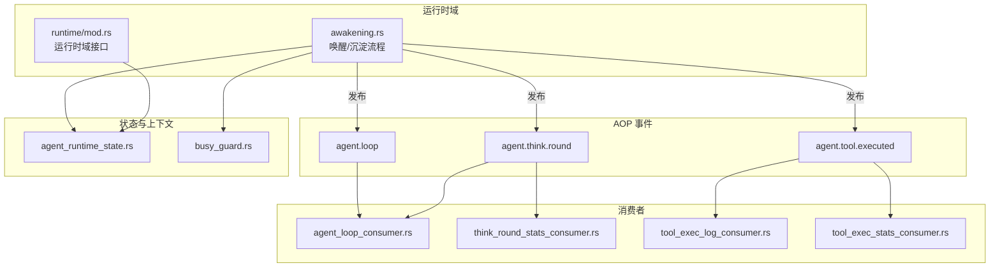
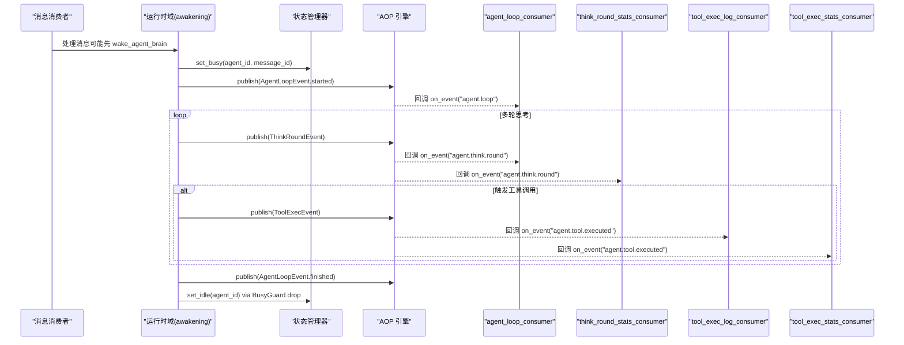
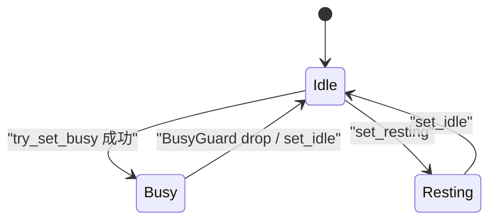
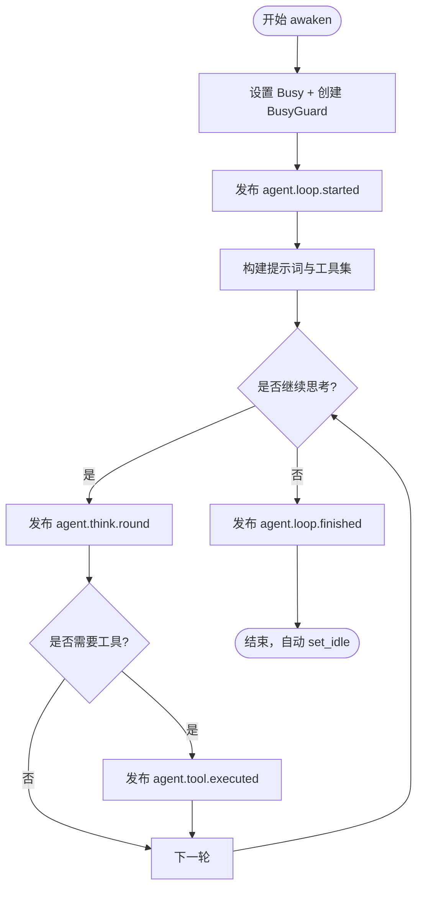
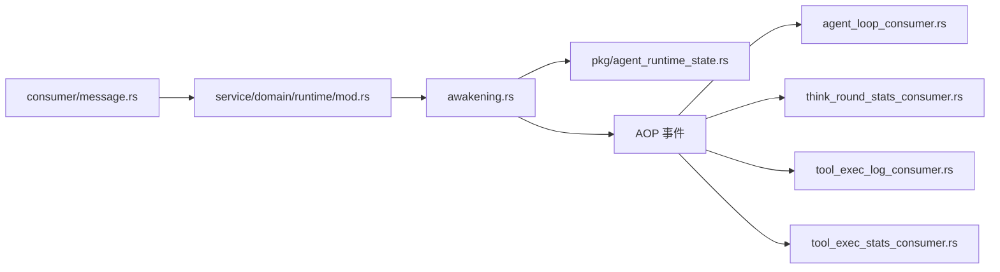

# Agent 循环消费者（代码落地层）

<cite>
**本文引用的文件**
- [agent_loop_consumer.rs](src/consumer/agent_loop_consumer.rs)
- [think_round_stats_consumer.rs](src/consumer/think_round_stats_consumer.rs)
- [tool_exec_log_consumer.rs](src/consumer/tool_exec_log_consumer.rs)
- [tool_exec_stats_consumer.rs](src/consumer/tool_exec_stats_consumer.rs)
- [agent_loop.rs](src/models/events/agent_loop.rs)
- [think_round.rs](src/models/events/think_round.rs)
- [tool_exec.rs](src/models/events/tool_exec.rs)
- [agent_state.rs](src/models/events/agent_state.rs)
- [agent_runtime_state.rs](src/pkg/agent_runtime_state.rs)
- [busy_guard.rs](src/service/domain/runtime/busy_guard.rs)
- [awakening.rs](src/service/domain/runtime/awakening.rs)
- [mod.rs（运行时域）](src/service/domain/runtime/mod.rs)
- [message.rs（消息消费者）](src/consumer/message.rs)
- [agent.rs（枚举：AgentRuntimeState）](common/src/enums/agent.rs)
</cite>

## 目录
1. [简介](#简介)
2. [项目结构](#项目结构)
3. [核心组件](#核心组件)
4. [架构总览](#架构总览)
5. [详细组件分析](#详细组件分析)
6. [依赖关系分析](#依赖关系分析)
7. [性能与并发控制](#性能与并发控制)
8. [故障恢复与超时处理](#故障恢复与超时处理)
9. [监控、统计与调试](#监控统计与调试)
10. [配置优化与扩缩容](#配置优化与扩缩容)
11. [集成方式](#集成方式)
12. [结论](#结论)

## 简介
本文件面向"Agent 循环消费者"，围绕 Agent 的唤醒、思考与沉淀生命周期，系统说明状态机转换、上下文维护、内存管理、并发控制、资源隔离、超时处理、执行计划生成、工具调用协调与结果聚合，以及监控统计、调试信息收集、配置优化、扩缩容策略和故障恢复机制。内容严格基于仓库中已实现的 AOP 事件模型、运行时状态管理与消费者实现。

> 📌 视角说明（AGENTS §2.1.3 Level 3 互补视角平行卡）：
> 本长文是「Agent 循环消费者」主题的 **代码落地层** 视角。同主题还有以下平行视角卡，请按需交叉阅读：
> - [Agent 循环消费者（框架层）](docs/wiki/zh/content/基础设施/AOP 事件系统/事件消费者/Agent 循环消费者.md)

## 项目结构
Agent 循环由“运行时域”驱动，通过 AOP 发布三类关键事件：
- 循环生命周期事件：agent.loop（awaken/settle 的 started/finished）
- 每轮思考事件：agent.think.round（含 token 用量、工具调用计数等）
- 工具执行完成事件：agent.tool.executed（含完整 ToolCallEntry 与统计字段）

对应的同步消费者负责日志记录与指标落库，运行时状态管理器提供内存态的状态机与并发保护，BusyGuard 确保异常路径下状态清理。

图表来源
- [awakening.rs:424-456](src/service/domain/runtime/awakening.rs#L424-L456)
- [agent_loop_consumer.rs:26-43](src/consumer/agent_loop_consumer.rs#L26-L43)
- [think_round_stats_consumer.rs:29-43](src/consumer/think_round_stats_consumer.rs#L29-L43)
- [tool_exec_log_consumer.rs:26-40](src/consumer/tool_exec_log_consumer.rs#L26-L40)
- [tool_exec_stats_consumer.rs:27-41](src/consumer/tool_exec_stats_consumer.rs#L27-L41)
- [agent_runtime_state.rs:31-107](src/pkg/agent_runtime_state.rs#L31-L107)
- [busy_guard.rs:1-32](src/service/domain/runtime/busy_guard.rs#L1-L32)

章节来源
- [awakening.rs:424-456](src/service/domain/runtime/awakening.rs#L424-L456)
- [agent_loop_consumer.rs:26-43](src/consumer/agent_loop_consumer.rs#L26-L43)
- [think_round_stats_consumer.rs:29-43](src/consumer/think_round_stats_consumer.rs#L29-L43)
- [tool_exec_log_consumer.rs:26-40](src/consumer/tool_exec_log_consumer.rs#L26-L40)
- [tool_exec_stats_consumer.rs:27-41](src/consumer/tool_exec_stats_consumer.rs#L27-L41)
- [agent_runtime_state.rs:31-107](src/pkg/agent_runtime_state.rs#L31-L107)
- [busy_guard.rs:1-32](src/service/domain/runtime/busy_guard.rs#L1-L32)

## 核心组件
- Agent 运行时状态管理器：纯内存全局单例，提供 Idle/Resting/Busy 状态切换、原子 try_set_busy、不可用判断、状态变更事件发布。
- BusyGuard：RAII 守卫，在 awaken 作用域结束时自动 set_idle，防止异常或提早返回导致状态泄漏。
- 运行时域 awakening：封装唤醒与沉淀流程，发布 agent.loop 与 agent.think.round 事件，并配合状态管理器与守卫保证一致性。
- AOP 消费者：
  - agent_loop_consumer：订阅 agent.loop 与 agent.think.round，用于日志与可观测性。
  - think_round_stats_consumer：将每轮 think 的 token 用量写入统计。
  - tool_exec_log_consumer：将工具执行结果写入 JSONL 日志。
  - tool_exec_stats_consumer：将工具执行统计写入统计存储。

章节来源
- [agent_runtime_state.rs:31-107](src/pkg/agent_runtime_state.rs#L31-L107)
- [busy_guard.rs:1-32](src/service/domain/runtime/busy_guard.rs#L1-L32)
- [awakening.rs:424-456](src/service/domain/runtime/awakening.rs#L424-L456)
- [agent_loop_consumer.rs:26-43](src/consumer/agent_loop_consumer.rs#L26-L43)
- [think_round_stats_consumer.rs:29-43](src/consumer/think_round_stats_consumer.rs#L29-L43)
- [tool_exec_log_consumer.rs:26-40](src/consumer/tool_exec_log_consumer.rs#L26-L40)
- [tool_exec_stats_consumer.rs:27-41](src/consumer/tool_exec_stats_consumer.rs#L27-L41)

## 架构总览
Agent 循环采用“运行时域 + AOP 事件 + 同步消费者”的解耦架构：
- 运行时域负责编排唤醒/思考/沉淀的主流程，并通过 AOP 发布事件。
- 消费者以同步模式消费事件，完成日志与统计落库，不阻塞主流程语义。
- 状态管理器提供内存级状态机，保障并发安全与可见性。

图表来源
- [message.rs:225-317](src/consumer/message.rs#L225-L317)
- [awakening.rs:424-456](src/service/domain/runtime/awakening.rs#L424-L456)
- [agent_loop_consumer.rs:26-43](src/consumer/agent_loop_consumer.rs#L26-L43)
- [think_round_stats_consumer.rs:29-43](src/consumer/think_round_stats_consumer.rs#L29-L43)
- [tool_exec_log_consumer.rs:26-40](src/consumer/tool_exec_log_consumer.rs#L26-L40)
- [tool_exec_stats_consumer.rs:27-41](src/consumer/tool_exec_stats_consumer.rs#L27-L41)
- [agent_runtime_state.rs:31-107](src/pkg/agent_runtime_state.rs#L31-L107)

## 详细组件分析

### Agent 运行时状态机与并发控制
- 状态定义：Idle、Resting、Busy；is_unavailable 表示不可接受新消息。
- 原子设置 Busy：try_set_busy 在持有锁的临界区内检查并更新状态，避免 TOCTOU 竞态。
- 状态变更事件：每次状态切换都会异步发布 AgentStateEvent，便于审计与可视化。
- RAII 清理：BusyGuard 在 awaken 作用域结束时自动 set_idle，覆盖所有异常与提早返回路径。

图表来源
- [agent.rs:64-99](common/src/enums/agent.rs#L64-L99)
- [agent_runtime_state.rs:31-107](src/pkg/agent_runtime_state.rs#L31-L107)
- [busy_guard.rs:1-32](src/service/domain/runtime/busy_guard.rs#L1-L32)

章节来源
- [agent.rs:64-99](common/src/enums/agent.rs#L64-L99)
- [agent_runtime_state.rs:31-107](src/pkg/agent_runtime_state.rs#L31-L107)
- [busy_guard.rs:1-32](src/service/domain/runtime/busy_guard.rs#L1-L32)

### 唤醒与沉淀的生命周期
- 唤醒（awaken）：
  - 设置 Busy，创建 BusyGuard。
  - 发布 AgentLoopEvent.started（scene=awaken）。
  - 构建提示词与工具描述，进入思考循环。
  - 每轮发布 ThinkRoundEvent，必要时发布 ToolExecEvent。
  - 结束发布 AgentLoopEvent.finished（包含 status/duration_ms）。
  - BusyGuard 自动 set_idle。
- 沉淀（sleep_and_settle）：
  - 复用 run_think_loop，仅暴露记忆类工具，使 Agent 可通过 function calling 完成知识沉淀。
  - 同样遵循事件发布与状态清理约定。

图表来源
- [awakening.rs:424-456](src/service/domain/runtime/awakening.rs#L424-L456)
- [agent_loop.rs:1-79](src/models/events/agent_loop.rs#L1-L79)
- [think_round.rs:1-124](src/models/events/think_round.rs#L1-L124)
- [tool_exec.rs:1-65](src/models/events/tool_exec.rs#L1-L65)

章节来源
- [awakening.rs:424-456](src/service/domain/runtime/awakening.rs#L424-L456)
- [agent_loop.rs:1-79](src/models/events/agent_loop.rs#L1-L79)
- [think_round.rs:1-124](src/models/events/think_round.rs#L1-L124)
- [tool_exec.rs:1-65](src/models/events/tool_exec.rs#L1-L65)

### 执行计划生成、工具调用协调与结果聚合
- 执行计划：由运行时域根据当前场景（awaken/settle）选择可用工具集，构造提示词与工具描述，驱动模型进行函数调用。
- 工具协调：每次工具执行完成后发布 ToolExecEvent，包含完整 ToolCallEntry 与统计字段（组织/用户/任务/项目等）。
- 结果聚合：消费者分别负责日志与统计落库；think_round_stats_consumer 汇总 token 用量；tool_exec_stats_consumer 汇总工具调用成功率与耗时。

章节来源
- [think_round_stats_consumer.rs:29-73](src/consumer/think_round_stats_consumer.rs#L29-L73)
- [tool_exec_log_consumer.rs:26-53](src/consumer/tool_exec_log_consumer.rs#L26-L53)
- [tool_exec_stats_consumer.rs:27-73](src/consumer/tool_exec_stats_consumer.rs#L27-L73)
- [tool_exec.rs:1-65](src/models/events/tool_exec.rs#L1-L65)

### 上下文维护与内存管理
- 上下文：awaken 过程中会 enrich ctx（如 model_provider_id/model_name），供后续调用链复用。
- 内存管理：AgentRuntimeStateManager 为纯内存全局单例，服务重启后重置；DashMap 提供并发安全的键值访问。
- 消息关联：Busy 状态携带 current_message_id，便于追踪当前处理的消息。

章节来源
- [agent_runtime_state.rs:11-19](src/pkg/agent_runtime_state.rs#L11-L19)
- [agent_runtime_state.rs:31-107](src/pkg/agent_runtime_state.rs#L31-L107)
- [awakening.rs:424-456](src/service/domain/runtime/awakening.rs#L424-L456)

## 依赖关系分析
- 运行时域依赖状态管理器与 AOP 发布能力。
- 消费者依赖事件类型与统计/日志基础设施。
- 消息消费者在必要时先唤醒大脑，再进入 awaken 流程。

图表来源
- [message.rs:225-317](src/consumer/message.rs#L225-L317)
- [mod.rs（运行时域）:392-429](src/service/domain/runtime/mod.rs#L392-L429)
- [awakening.rs:424-456](src/service/domain/runtime/awakening.rs#L424-L456)
- [agent_runtime_state.rs:31-107](src/pkg/agent_runtime_state.rs#L31-L107)
- [agent_loop_consumer.rs:26-43](src/consumer/agent_loop_consumer.rs#L26-L43)
- [think_round_stats_consumer.rs:29-43](src/consumer/think_round_stats_consumer.rs#L29-L43)
- [tool_exec_log_consumer.rs:26-40](src/consumer/tool_exec_log_consumer.rs#L26-L40)
- [tool_exec_stats_consumer.rs:27-41](src/consumer/tool_exec_stats_consumer.rs#L27-L41)

章节来源
- [message.rs:225-317](src/consumer/message.rs#L225-L317)
- [mod.rs（运行时域）:392-429](src/service/domain/runtime/mod.rs#L392-L429)
- [awakening.rs:424-456](src/service/domain/runtime/awakening.rs#L424-L456)
- [agent_runtime_state.rs:31-107](src/pkg/agent_runtime_state.rs#L31-L107)

## 性能与并发控制
- 并发安全：
  - DashMap 提供无锁读与细粒度写，适合高并发状态查询。
  - try_set_busy 在临界区内完成“检查+设置”，避免重复唤醒同一 Agent。
- 资源隔离：
  - 每个 Agent 的运行时状态独立映射到 agent_id 键，互不影响。
  - 消费者同步处理事件，但内部 I/O（如统计落库）通过异步任务或缓冲降低阻塞影响。
- 超时与限流：
  - 消息消费者侧对最大思考深度进行限制，达到阈值时主动停止循环，防止无限思考。
  - 建议在外部网关/调度层增加请求级超时，结合 Agent 内部深度限制形成双重保护。

章节来源
- [agent_runtime_state.rs:31-107](src/pkg/agent_runtime_state.rs#L31-L107)
- [message.rs:246-293](src/consumer/message.rs#L246-L293)

## 故障恢复与超时处理
- 状态恢复：
  - BusyGuard 确保任何返回路径（包括 panic）都会释放 Busy，避免永久占用。
  - 若中间步骤失败（如 brain 未初始化），消息消费者会显式 set_idle 并允许重试。
- 错误路径：
  - awaken 失败时发布 finished 事件并附带失败状态与耗时，便于追踪。
  - 工具执行失败也会发布 ToolExecEvent，消费者据此记录失败统计。
- 超时建议：
  - 在调用模型与工具时设置超时，并在消费者侧记录超时导致的失败。
  - 结合最大思考深度与外部超时，避免长尾请求拖垮系统。

章节来源
- [busy_guard.rs:1-32](src/service/domain/runtime/busy_guard.rs#L1-L32)
- [message.rs:225-317](src/consumer/message.rs#L225-L317)
- [agent_loop.rs:1-79](src/models/events/agent_loop.rs#L1-L79)
- [tool_exec.rs:1-65](src/models/events/tool_exec.rs#L1-L65)

## 监控统计与调试
- 循环生命周期：
  - agent_loop_consumer 记录 awaken/settle 的 started/finished，包含 duration_ms、status、trace_id。
- 每轮思考：
  - agent_loop_consumer 与 think_round_stats_consumer 同时消费 agent.think.round，前者用于日志，后者用于 token 用量统计。
- 工具执行：
  - tool_exec_log_consumer 写入 JSONL 日志，tool_exec_stats_consumer 记录工具调用成功率、耗时与参数/结果长度。
- 状态变更：
  - AgentStateEvent 在状态切换时发布，可用于 UI 展示与审计。

章节来源
- [agent_loop_consumer.rs:26-97](src/consumer/agent_loop_consumer.rs#L26-L97)
- [think_round_stats_consumer.rs:29-73](src/consumer/think_round_stats_consumer.rs#L29-L73)
- [tool_exec_log_consumer.rs:26-53](src/consumer/tool_exec_log_consumer.rs#L26-L53)
- [tool_exec_stats_consumer.rs:27-73](src/consumer/tool_exec_stats_consumer.rs#L27-L73)
- [agent_state.rs:1-53](src/models/events/agent_state.rs#L1-L53)

## 配置优化与扩缩容
- 配置要点：
  - 最大思考深度：在消息消费者侧限制，避免过度消耗模型与工具资源。
  - 工具过滤：在沉淀阶段仅暴露记忆类工具，减少无关调用。
- 扩缩容策略：
  - 基于 AgentRuntimeStateManager 的全局状态，可在水平扩展时通过共享内存或分布式状态（如 Redis）统一管控 Busy/Resting。
  - 消费者可水平扩展，按 agent_id 哈希路由保证顺序性（order_key 使用 agent_id）。
- 故障恢复：
  - 服务重启后内存状态重置，Agent 自动 Idle；业务链路通过持久化实体（Message/Task/Project）可追溯。
  - 建议在启动时校验并修复异常 Busy 状态（例如长时间处于 Busy 的 Agent 强制置 Idle）。

章节来源
- [message.rs:246-293](src/consumer/message.rs#L246-L293)
- [agent_runtime_state.rs:1-19](src/pkg/agent_runtime_state.rs#L1-L19)
- [tool_exec.rs:56-59](src/models/events/tool_exec.rs#L56-L59)

## 集成方式
- 与模型提供商：
  - awaken 流程中会补充 model_provider_id 与 model_name，ThinkRoundEvent 携带 token 用量，便于统计与成本核算。
- 与工具系统：
  - 工具执行完成后发布 ToolExecEvent，消费者分别负责日志与统计；支持内置工具与 MCP 工具的统一入口。
- 与存储服务：
  - 统计事件通过 Stats 单例写入 DuckDB 等统计存储；JSONL 日志通过 ToolCallLogger 持久化。
  - 向量搜索与全文检索在其它模块中提供，Agent 可通过工具间接使用。

章节来源
- [think_round.rs:1-124](src/models/events/think_round.rs#L1-L124)
- [tool_exec.rs:1-65](src/models/events/tool_exec.rs#L1-L65)
- [think_round_stats_consumer.rs:29-73](src/consumer/think_round_stats_consumer.rs#L29-L73)
- [tool_exec_log_consumer.rs:26-53](src/consumer/tool_exec_log_consumer.rs#L26-L53)
- [tool_exec_stats_consumer.rs:27-73](src/consumer/tool_exec_stats_consumer.rs#L27-L73)

## 结论
Agent 循环消费者通过 AOP 事件将“唤醒—思考—沉淀”的核心流程与“日志—统计—状态”的横切关注点解耦。运行时域负责编排与发布，消费者专注记录与度量，状态管理器提供内存级并发安全与可见性。借助 BusyGuard 与最大思考深度限制，系统在异常与高负载下具备更强的鲁棒性。未来可按需引入分布式状态与更细粒度的超时控制，进一步提升可扩展性与稳定性。