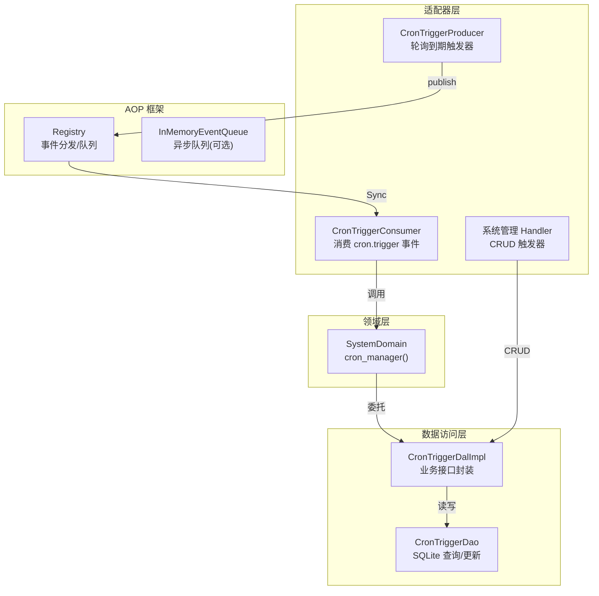
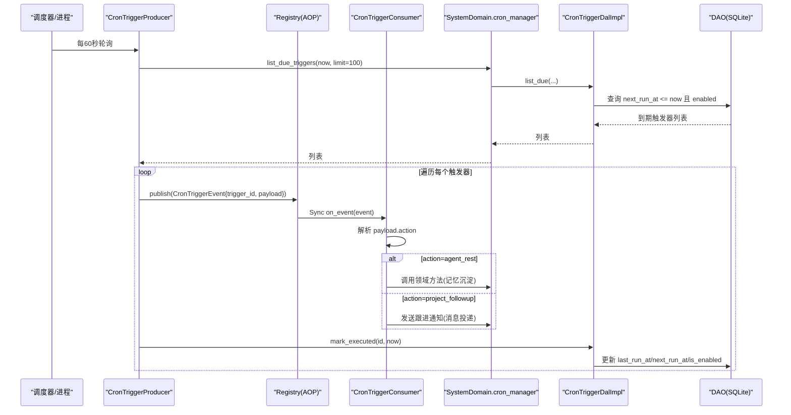
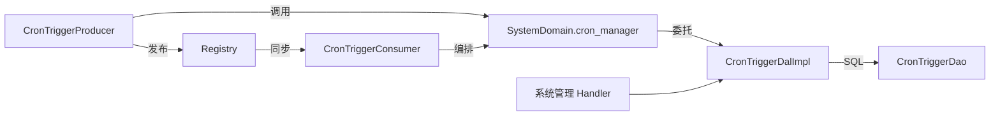

# 定时任务消费者

<cite>
**本文引用的文件**
- [src/consumer/scheduler.rs](src/consumer/scheduler.rs)
- [src/producer/cron_trigger.rs](src/producer/cron_trigger.rs)
- [src/models/events/cron_trigger.rs](src/models/events/cron_trigger.rs)
- [src/service/dal/cron_trigger.rs](src/service/dal/cron_trigger.rs)
- [common/src/enums/cron_trigger.rs](common/src/enums/cron_trigger.rs)
- [common/src/api/cron_trigger.rs](common/src/api/cron_trigger.rs)
- [src/handlers/system/cron_trigger/response.rs](src/handlers/system/cron_trigger/response.rs)
- [src/consumer/mod.rs](src/consumer/mod.rs)
- [src/pkg/aop/mod.rs](src/pkg/aop/mod.rs)
- [src/pkg/aop/core/registry.rs](src/pkg/aop/core/registry.rs)
- [frontend/src/pages/system/triggers.rs](frontend/src/pages/system/triggers.rs)
</cite>

## 目录
1. [简介](#简介)
2. [项目结构](#项目结构)
3. [核心组件](#核心组件)
4. [架构总览](#架构总览)
5. [详细组件分析](#详细组件分析)
6. [依赖关系分析](#依赖关系分析)
7. [性能与并发控制](#性能与并发控制)
8. [故障处理与重试](#故障处理与重试)
9. [状态跟踪、日志与结果回调](#状态跟踪日志与结果回调)
10. [配置管理、动态调度与运维](#配置管理动态调度与运维)
11. [外部系统集成、Webhook 与消息推送](#外部系统集成webhook-与消息推送)
12. [结论](#结论)
13. [附录：API 与数据模型速查](#附录api-与数据模型速查)

## 简介
本文件面向“定时任务消费者”子系统，围绕 Cron 触发器的解析、任务调度与执行机制进行系统化说明。重点覆盖：
- Cron 表达式解析现状与限制
- 生产者扫描到期触发器并发布事件
- 消费者按动作路由到领域逻辑（如 agent_rest、project_followup）
- 任务优先级、并发控制与资源限制
- 失败重试、延迟执行与取消机制
- 执行状态跟踪、日志记录与结果回调
- 性能监控、执行时间统计与资源使用分析
- 配置管理、动态调度与运维操作指南
- 与外部系统集成、Webhook 回调与消息推送方式

## 项目结构
定时任务消费者由“生产者 + 消费者 + DAL/DAO + 事件模型 + AOP 框架”组成，遵循四层单向调用原则：Adapter（Handler/Producer/Consumer）→ Domain → DAL → DAO。

图示来源
- [src/producer/cron_trigger.rs:1-88](src/producer/cron_trigger.rs#L1-L88)
- [src/consumer/scheduler.rs:1-211](src/consumer/scheduler.rs#L1-L211)
- [src/service/dal/cron_trigger.rs:1-177](src/service/dal/cron_trigger.rs#L1-L177)
- [src/pkg/aop/core/registry.rs:728-950](src/pkg/aop/core/registry.rs#L728-L950)

章节来源
- [src/producer/cron_trigger.rs:1-88](src/producer/cron_trigger.rs#L1-L88)
- [src/consumer/scheduler.rs:1-211](src/consumer/scheduler.rs#L1-L211)
- [src/service/dal/cron_trigger.rs:1-177](src/service/dal/cron_trigger.rs#L1-L177)
- [src/pkg/aop/core/registry.rs:728-950](src/pkg/aop/core/registry.rs#L728-L950)

## 核心组件
- CronTriggerProducer：周期性扫描到期触发器，发布 cron.trigger 事件，并标记已执行。
- CronTriggerConsumer：订阅 cron.trigger 事件，解析 payload.action 路由到具体业务处理。
- CronTriggerDalImpl：封装触发器创建、暂停/恢复、到期查询、执行后更新时间等逻辑。
- CronTriggerEvent：事件模型，携带 trigger_id、trigger_name、payload、created_at。
- TriggerType：触发器类型枚举（Once/Cron/Interval）。
- Registry：AOP 事件中心，负责同步/异步消费分发与队列管理。

章节来源
- [src/producer/cron_trigger.rs:1-88](src/producer/cron_trigger.rs#L1-L88)
- [src/consumer/scheduler.rs:1-211](src/consumer/scheduler.rs#L1-L211)
- [src/service/dal/cron_trigger.rs:1-177](src/service/dal/cron_trigger.rs#L1-L177)
- [src/models/events/cron_trigger.rs:1-30](src/models/events/cron_trigger.rs#L1-L30)
- [common/src/enums/cron_trigger.rs:1-47](common/src/enums/cron_trigger.rs#L1-L47)
- [src/pkg/aop/core/registry.rs:728-950](src/pkg/aop/core/registry.rs#L728-L950)

## 架构总览
下图展示从“到期扫描”到“业务编排”的完整流程，包括事件发布、同步消费、领域调用与持久化更新。

图示来源
- [src/producer/cron_trigger.rs:42-86](src/producer/cron_trigger.rs#L42-L86)
- [src/consumer/scheduler.rs:53-94](src/consumer/scheduler.rs#L53-L94)
- [src/service/dal/cron_trigger.rs:131-176](src/service/dal/cron_trigger.rs#L131-L176)
- [src/models/events/cron_trigger.rs:1-30](src/models/events/cron_trigger.rs#L1-L30)

## 详细组件分析

### CronTriggerProducer（生产者）
- 职责：每 60 秒扫描到期触发器，发布事件并标记执行。
- 关键行为：
  - 通过 system::domain().cron_manager().list_due_triggers(ctx, now, 100) 获取到期触发器。
  - 为每个触发器构造 CronTriggerEvent 并通过 registry.publish 发布。
  - 立即调用 mark_trigger_executed 更新下次执行时间或禁用一次性触发器。
- 错误处理：未注册 Registry 时返回内部错误；无到期触发器直接返回。

章节来源
- [src/producer/cron_trigger.rs:26-86](src/producer/cron_trigger.rs#L26-L86)

### CronTriggerConsumer（消费者）
- 职责：订阅 cron.trigger 事件，按 payload.action 路由到不同业务处理。
- 关键行为：
  - 解析 CronTriggerEvent 与 payload，记录日志。
  - 支持 action：
    - agent_rest：加载 Agent 并执行记忆沉淀（复用 settle_memory 公共函数）。
    - project_followup：对所有进行中且有 Owner Agent 的项目发送跟进通知（预检查 Agent 状态避免 nack 堆积）。
  - 未知 action 记录警告日志。
- 消费模式：ConsumeMode::Sync（同步回调），适合轻量编排。

章节来源
- [src/consumer/scheduler.rs:39-94](src/consumer/scheduler.rs#L39-L94)
- [src/consumer/scheduler.rs:99-194](src/consumer/scheduler.rs#L99-L194)

### CronTriggerDalImpl（DAL 实现）
- 职责：封装触发器 CRUD、暂停/恢复、到期查询与执行后更新。
- 关键行为：
  - pause/resume：读取 PO，修改 is_enabled，touch 更新时间与修改人。
  - list_due：委托 DAO 查询 next_run_at <= now 且启用的触发器。
  - mark_executed：
    - Once：禁用并记录 last_run_at。
    - Interval：计算 next_run_at = executed_at + interval_seconds 并更新。
    - Cron：当前返回 UnsupportedOperation（尚未实现 Cron 表达式解析）。
- 错误处理：找不到触发器返回 ResourceNotFound；Interval 缺少 interval_seconds 返回 InvalidRequest。

章节来源
- [src/service/dal/cron_trigger.rs:36-74](src/service/dal/cron_trigger.rs#L36-L74)
- [src/service/dal/cron_trigger.rs:109-176](src/service/dal/cron_trigger.rs#L109-L176)

### 事件模型与枚举
- CronTriggerEvent：包含 event_id、trigger_id、trigger_name、payload、created_at；实现 Event trait，kind 为 "cron.trigger"。
- TriggerType：Once/Cron/Interval，用于区分触发策略。

章节来源
- [src/models/events/cron_trigger.rs:1-30](src/models/events/cron_trigger.rs#L1-L30)
- [common/src/enums/cron_trigger.rs:1-47](common/src/enums/cron_trigger.rs#L1-L47)

### AOP 框架集成
- Registry：管理 Producer/Consumer，按事件类型分发；同步消费者直接调用 on_event，异步消费者入队。
- consumer::init：注册 CronTriggerConsumer 与其他业务消费者。
- 全局 Registry：通过 Lazy 初始化，提供统一入口。

章节来源
- [src/pkg/aop/mod.rs:1-46](src/pkg/aop/mod.rs#L1-L46)
- [src/consumer/mod.rs:16-34](src/consumer/mod.rs#L16-L34)
- [src/pkg/aop/core/registry.rs:728-950](src/pkg/aop/core/registry.rs#L728-L950)

## 依赖关系分析
- 生产者依赖 SystemDomain.cron_manager 获取到期触发器，并通过 AOP Registry 发布事件。
- 消费者依赖领域层完成业务编排（agent_rest/project_followup），不直接访问数据库。
- DAL 封装 DAO 的 SQL 操作，对外暴露业务语义接口。
- 前端通过系统管理页面进行触发器 CRUD，后端 Handler 使用 common API DTO。

图示来源
- [src/producer/cron_trigger.rs:55-80](src/producer/cron_trigger.rs#L55-L80)
- [src/consumer/scheduler.rs:78-94](src/consumer/scheduler.rs#L78-L94)
- [src/service/dal/cron_trigger.rs:131-176](src/service/dal/cron_trigger.rs#L131-L176)
- [src/handlers/system/cron_trigger/response.rs:1-44](src/handlers/system/cron_trigger/response.rs#L1-L44)

章节来源
- [src/producer/cron_trigger.rs:55-80](src/producer/cron_trigger.rs#L55-L80)
- [src/consumer/scheduler.rs:78-94](src/consumer/scheduler.rs#L78-L94)
- [src/service/dal/cron_trigger.rs:131-176](src/service/dal/cron_trigger.rs#L131-L176)
- [src/handlers/system/cron_trigger/response.rs:1-44](src/handlers/system/cron_trigger/response.rs#L1-L44)

## 性能与并发控制
- 轮询间隔：生产者固定 60 秒轮询一次到期触发器，limit 默认 100，避免单次扫描过多。
- 消费模式：CronTriggerConsumer 采用 ConsumeMode::Sync，事件发布时直接调用 on_event，适合轻量编排。
- 并发控制：
  - 当前消费者为同步模式，无独立队列与 worker，因此不存在多实例竞争问题。
  - 对于重任务场景，可考虑改为 ConsumeMode::Async，利用 Registry 的 InMemoryEventQueue 与 worker 进行异步消费与退避。
- 资源限制：
  - project_followup 在发送前检查 Agent 运行时状态，跳过 Busy/Resting 的 Agent，减少无效重试与 nack 堆积。
  - 批量扫描限制为 100，降低数据库压力。

章节来源
- [src/producer/cron_trigger.rs:38-58](src/producer/cron_trigger.rs#L38-L58)
- [src/consumer/scheduler.rs:49-51](src/consumer/scheduler.rs#L49-L51)
- [src/consumer/scheduler.rs:161-166](src/consumer/scheduler.rs#L161-L166)
- [src/pkg/aop/core/registry.rs:784-842](src/pkg/aop/core/registry.rs#L784-L842)

## 故障处理与重试
- 事件反序列化失败：消费者解析事件或 payload 失败时返回错误，便于上层记录与告警。
- 未知 action：记录警告日志，避免静默失败。
- 领域调用失败：project_followup 发送消息失败时记录警告，不影响其他项目继续处理。
- 重试机制：
  - 当前 CronTriggerConsumer 为同步模式，on_event 失败不会自动重试。
  - 若需可靠消费，可切换为 ConsumeMode::Async，结合 Registry 的 nack/ack 与退避策略实现重试。
- 取消机制：
  - 可通过暂停触发器（is_enabled=0）停止后续调度。
  - 一次性触发器执行后自动禁用。

章节来源
- [src/consumer/scheduler.rs:53-94](src/consumer/scheduler.rs#L53-L94)
- [src/consumer/scheduler.rs:184-190](src/consumer/scheduler.rs#L184-L190)
- [src/service/dal/cron_trigger.rs:147-176](src/service/dal/cron_trigger.rs#L147-L176)
- [src/pkg/aop/core/registry.rs:869-878](src/pkg/aop/core/registry.rs#L869-L878)

## 状态跟踪、日志与结果回调
- 状态跟踪：
  - CronTriggerPo 包含 next_run_at、last_run_at、is_enabled，反映触发器生命周期。
  - 执行后通过 mark_executed 更新状态。
- 日志记录：
  - 消费者记录收到事件、解析 payload、执行 action 的日志。
  - 生产者在扫描与发布时记录日志。
- 结果回调：
  - 当前未实现统一的 Webhook 回调机制；如需回调，可在领域层扩展（例如在 project_followup 成功后调用外部 Webhook）。
  - 可通过 AOP 事件中心发布自定义结果事件，供其他消费者订阅。

章节来源
- [src/models/cron_trigger.rs:10-27](src/models/cron_trigger.rs#L10-L27)
- [src/consumer/scheduler.rs:58-76](src/consumer/scheduler.rs#L58-L76)
- [src/producer/cron_trigger.rs:64-83](src/producer/cron_trigger.rs#L64-L83)

## 配置管理、动态调度与运维
- 配置项：
  - name：触发器名称
  - trigger_type：Once/Cron/Interval
  - cron_expression：Cron 表达式（当前不可用）
  - interval_seconds：间隔秒数（Interval 必需）
  - run_at：一次性执行时间戳（Once 必需）
  - payload：JSON 字符串，包含 action 与 extra
- 动态调度：
  - 通过系统管理 API 创建、更新、暂停、恢复、删除触发器。
  - 前端支持选择类型与输入对应参数，生成 payload。
- 运维操作：
  - 暂停触发器：is_enabled=0，停止调度。
  - 查看最近执行时间：last_run_at。
  - 排查问题：检查日志中触发器 ID、action、错误信息。

章节来源
- [common/src/api/cron_trigger.rs:8-105](common/src/api/cron_trigger.rs#L8-L105)
- [src/handlers/system/cron_trigger/response.rs:8-44](src/handlers/system/cron_trigger/response.rs#L8-L44)
- [frontend/src/pages/system/triggers.rs:113-150](frontend/src/pages/system/triggers.rs#L113-L150)

## 外部系统集成、Webhook 回调与消息推送
- 消息推送：
  - project_followup 通过 message_domain.delivery.send_to_agent 向 Owner Agent 发送跟进通知。
  - 支持填充 project_id 上下文，MessageConsumer 自动补充项目信息。
- Webhook 回调：
  - 当前未实现通用 Webhook 回调；可在领域层扩展，例如在 agent_rest 完成后调用外部 Webhook。
- 外部系统：
  - 通过 AOP 事件中心发布自定义事件，供其他服务订阅。
  - 可结合工具调用（HTTP/MCP）与消息通道实现外部集成。

章节来源
- [src/consumer/scheduler.rs:149-190](src/consumer/scheduler.rs#L149-L190)
- [src/pkg/aop/mod.rs:1-46](src/pkg/aop/mod.rs#L1-L46)

## 结论
定时任务消费者基于 AOP 事件中心实现了“生产者扫描 + 消费者编排”的解耦架构。当前对 Cron 表达式解析尚未实现，但 Once 与 Interval 类型已可用。通过 DAL 封装与领域调用，保证了业务逻辑的可维护性与可扩展性。未来可引入异步消费、重试退避、Webhook 回调与更丰富的监控指标，进一步提升可靠性与可观测性。

## 附录：API 与数据模型速查
- 触发器类型：Once/Cron/Interval
- 请求/响应 DTO：CreateCronTriggerRequest、UpdateCronTriggerRequest、CronTriggerDetail、ListCronTriggersResponse
- 事件模型：CronTriggerEvent（kind="cron.trigger"）
- 持久化对象：CronTriggerPo（id、name、trigger_type、cron_expression、interval_seconds、run_at、next_run_at、is_enabled、payload、last_run_at、created_at、updated_at、created_by、updated_by）

章节来源
- [common/src/enums/cron_trigger.rs:1-47](common/src/enums/cron_trigger.rs#L1-L47)
- [common/src/api/cron_trigger.rs:8-105](common/src/api/cron_trigger.rs#L8-L105)
- [src/models/events/cron_trigger.rs:1-30](src/models/events/cron_trigger.rs#L1-L30)
- [src/models/cron_trigger.rs:10-27](src/models/cron_trigger.rs#L10-L27)