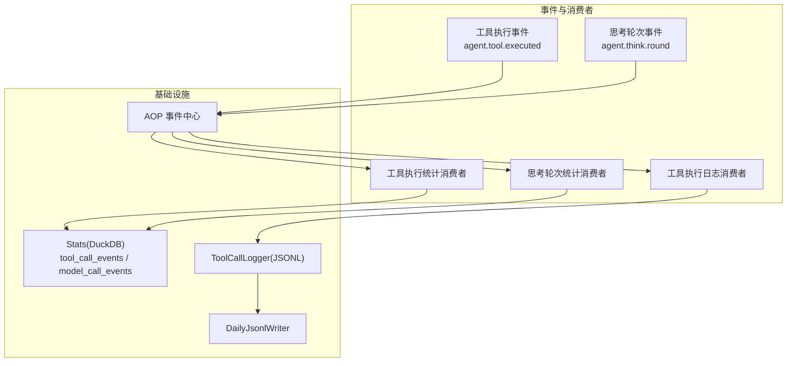
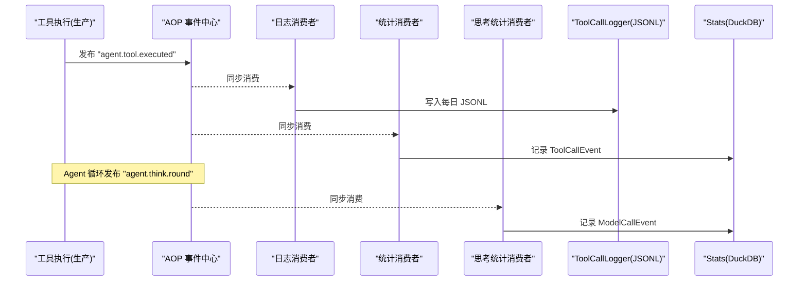
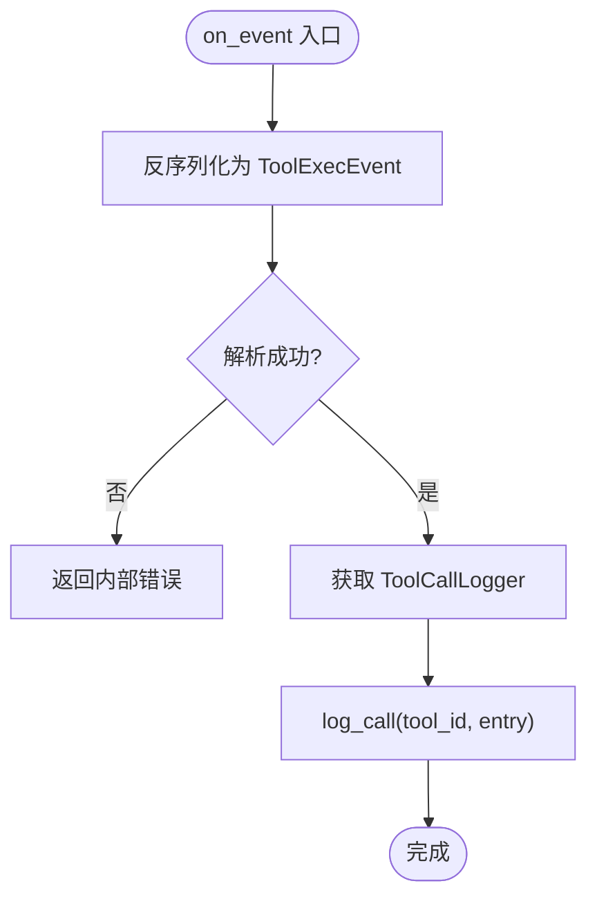
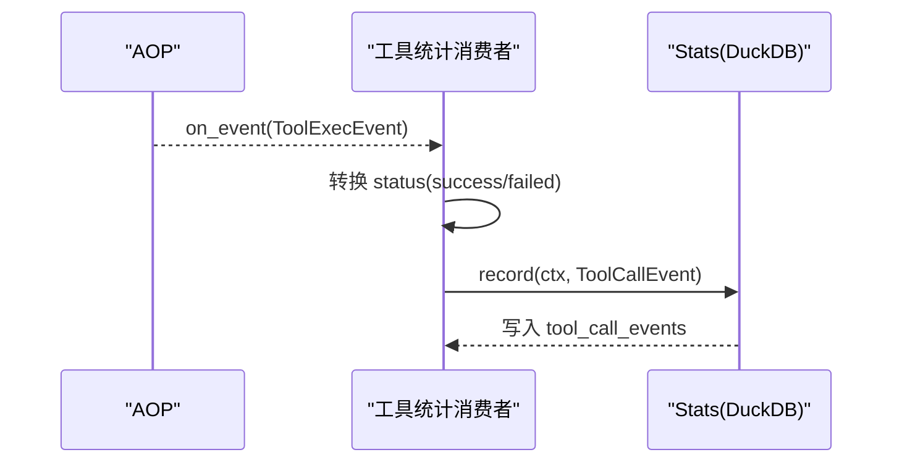
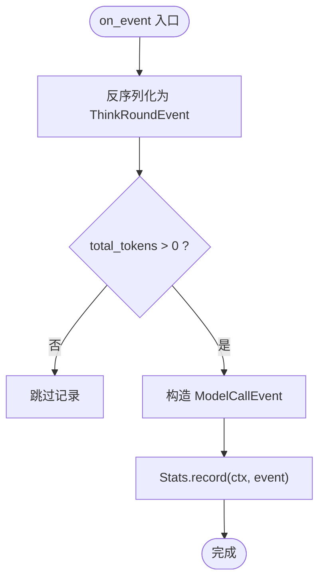
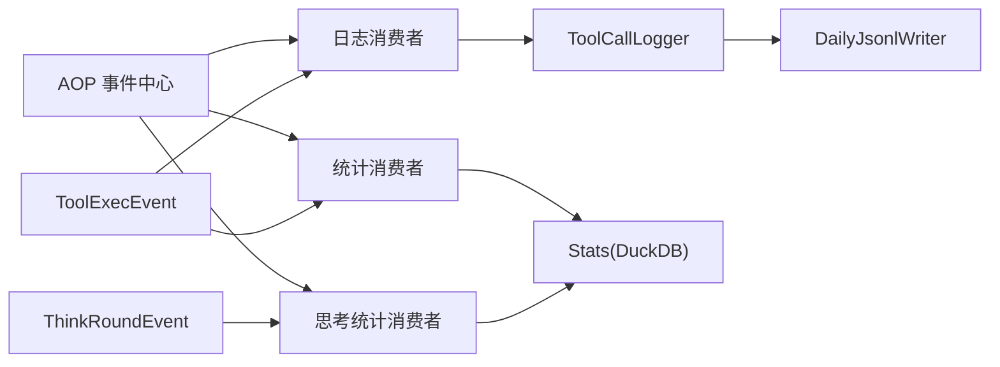

# 工具执行消费者

<cite>
**本文引用的文件**
- [src/consumer/mod.rs](src/consumer/mod.rs)
- [src/consumer/tool_exec_log_consumer.rs](src/consumer/tool_exec_log_consumer.rs)
- [src/consumer/tool_exec_stats_consumer.rs](src/consumer/tool_exec_stats_consumer.rs)
- [src/consumer/think_round_stats_consumer.rs](src/consumer/think_round_stats_consumer.rs)
- [src/models/events/tool_exec.rs](src/models/events/tool_exec.rs)
- [src/models/events/think_round.rs](src/models/events/think_round.rs)
- [src/pkg/aop/mod.rs](src/pkg/aop/mod.rs)
- [src/pkg/stats/mod.rs](src/pkg/stats/mod.rs)
- [src/pkg/stats/tool_call.rs](src/pkg/stats/tool_call.rs)
- [src/pkg/tool_tracing/logger.rs](src/pkg/tool_tracing/logger.rs)
- [src/pkg/daily_jsonl.rs](src/pkg/daily_jsonl.rs)
- [common/src/models/stats.rs](common/src/models/stats.rs)
</cite>

## 目录
1. [简介](#简介)
2. [项目结构](#项目结构)
3. [核心组件](#核心组件)
4. [架构总览](#架构总览)
5. [详细组件分析](#详细组件分析)
6. [依赖关系分析](#依赖关系分析)
7. [性能考量](#性能考量)
8. [故障排查指南](#故障排查指南)
9. [结论](#结论)
10. [附录](#附录)

## 简介
本文件面向“工具执行相关消费者”的文档，覆盖以下职责与能力：
- 工具执行日志消费者：将工具调用事件持久化为每日 JSONL 追踪日志，支持按时间、工具、任务等维度查询。
- 工具执行统计消费者：将工具调用指标写入 DuckDB 统计表，用于聚合、时序分析与报表。
- 思考轮次统计消费者：将每轮 think 的 token 用量与模型信息记录到模型调用统计表，支撑成本与性能分析。
- 数据聚合、时间序列分析与报表生成：基于 Stats 模块（DuckDB）提供统一的事件表与查询接口。
- 异常检测、瓶颈识别与优化建议：通过失败率、耗时分布、QPS 与时序趋势定位问题。
- 数据存储策略、查询优化与访问控制：JSONL 轨迹 + DuckDB 统计的双层存储；查询限流与索引建议；结合系统鉴权与上下文隔离。
- 监控仪表板配置、告警规则与诊断指南：围绕工具调用成功率、延迟、token 消耗与失败热点构建可观测性体系。
- 与 APM、日志系统与业务分析平台集成：AOP 事件中心解耦生产消费；JSONL 作为结构化日志；Stats 作为分析数据源。

## 项目结构
消费者位于 src/consumer 下，通过 AOP 注册并订阅特定事件；事件定义在 models/events；统计写入 pkg/stats；日志落盘在 pkg/tool_tracing/logger 使用 daily JSONL 实现。

图表来源
- [src/consumer/mod.rs:16-36](src/consumer/mod.rs#L16-L36)
- [src/models/events/tool_exec.rs:47-64](src/models/events/tool_exec.rs#L47-L64)
- [src/models/events/think_round.rs:107-123](src/models/events/think_round.rs#L107-L123)
- [src/pkg/aop/mod.rs:48-58](src/pkg/aop/mod.rs#L48-L58)
- [src/pkg/stats/mod.rs:152-171](src/pkg/stats/mod.rs#L152-L171)
- [src/pkg/tool_tracing/logger.rs:64-73](src/pkg/tool_tracing/logger.rs#L64-L73)
- [src/pkg/daily_jsonl.rs:54-73](src/pkg/daily_jsonl.rs#L54-L73)

章节来源
- [src/consumer/mod.rs:16-36](src/consumer/mod.rs#L16-L36)
- [src/pkg/aop/mod.rs:48-58](src/pkg/aop/mod.rs#L48-L58)

## 核心组件
- 工具执行日志消费者：订阅 agent.tool.executed，反序列化后调用 ToolCallLogger 写入每日 JSONL 追踪文件。
- 工具执行统计消费者：订阅 agent.tool.executed，构造 ToolCallEvent 并通过全局 Stats 单例记录到 tool_call_events。
- 思考轮次统计消费者：订阅 agent.think.round，构造 ModelCallEvent 并记录到模型调用统计表，跳过无 token 用量的轮次。
- AOP 事件中心：提供事件发布/注册/调度，消费者以同步模式处理关键路径事件，保证顺序与低延迟。
- Stats 统计模块：提供全局 Stats 访问器与多表事件类型，持久化至 DuckDB，支持聚合与时序查询。
- 工具追踪日志：基于 DailyJsonlWriter 按日分片存储，支持按 call_id、工具、任务等条件查询。

章节来源
- [src/consumer/tool_exec_log_consumer.rs:26-51](src/consumer/tool_exec_log_consumer.rs#L26-L51)
- [src/consumer/tool_exec_stats_consumer.rs:27-71](src/consumer/tool_exec_stats_consumer.rs#L27-L71)
- [src/consumer/think_round_stats_consumer.rs:29-71](src/consumer/think_round_stats_consumer.rs#L29-L71)
- [src/pkg/stats/mod.rs:152-171](src/pkg/stats/mod.rs#L152-L171)
- [src/pkg/tool_tracing/logger.rs:64-73](src/pkg/tool_tracing/logger.rs#L64-L73)
- [src/pkg/daily_jsonl.rs:54-73](src/pkg/daily_jsonl.rs#L54-L73)

## 架构总览
工具执行链路采用“生产者-消费者”解耦：
- 生产侧：工具执行完成后发布 ToolExecEvent；Agent 循环中发布 ThinkRoundEvent。
- 消费侧：AOP 分发到对应消费者；日志消费者写 JSONL，统计消费者写 DuckDB。
- 数据层：JSONL 用于可追溯的原始调用详情；DuckDB 用于聚合、时序与报表。

图表来源
- [src/models/events/tool_exec.rs:47-64](src/models/events/tool_exec.rs#L47-L64)
- [src/models/events/think_round.rs:107-123](src/models/events/think_round.rs#L107-L123)
- [src/consumer/tool_exec_log_consumer.rs:26-51](src/consumer/tool_exec_log_consumer.rs#L26-L51)
- [src/consumer/tool_exec_stats_consumer.rs:27-71](src/consumer/tool_exec_stats_consumer.rs#L27-L71)
- [src/consumer/think_round_stats_consumer.rs:29-71](src/consumer/think_round_stats_consumer.rs#L29-L71)
- [src/pkg/tool_tracing/logger.rs:64-73](src/pkg/tool_tracing/logger.rs#L64-L73)
- [src/pkg/stats/mod.rs:152-171](src/pkg/stats/mod.rs#L152-L171)

## 详细组件分析

### 工具执行日志消费者
- 职责：订阅 agent.tool.executed，将完整工具调用条目写入每日 JSONL 追踪文件，便于回溯与审计。
- 关键点：
  - 同步消费，确保同一 Agent 的工具日志顺序（事件 order_key 为 agent_id）。
  - 使用 ToolCallLogger 的 log_call 方法，内部通过 DailyJsonlWriter 按日分片追加。
  - 错误处理：反序列化失败返回内部错误，避免阻塞上游。

图表来源
- [src/consumer/tool_exec_log_consumer.rs:26-51](src/consumer/tool_exec_log_consumer.rs#L26-L51)
- [src/pkg/tool_tracing/logger.rs:64-73](src/pkg/tool_tracing/logger.rs#L64-L73)
- [src/pkg/daily_jsonl.rs:54-73](src/pkg/daily_jsonl.rs#L54-L73)

章节来源
- [src/consumer/tool_exec_log_consumer.rs:26-51](src/consumer/tool_exec_log_consumer.rs#L26-L51)
- [src/pkg/tool_tracing/logger.rs:64-73](src/pkg/tool_tracing/logger.rs#L64-L73)
- [src/pkg/daily_jsonl.rs:54-73](src/pkg/daily_jsonl.rs#L54-L73)

### 工具执行统计消费者
- 职责：订阅 agent.tool.executed，构造 ToolCallEvent 并记录到 tool_call_events 表，用于 QPS、耗时、参数/结果大小、成功率等指标。
- 关键点：
  - 状态映射：Completed -> success，否则 failed。
  - 通过 global_stats() 获取 Stats 单例，构造 RequestContext::new_system() 进行记录。
  - 字段包含 tool_id、tool_name、agent_id、project_id、task_id、organization_id、user_id、args_len、result_len、duration_ms、status。

图表来源
- [src/consumer/tool_exec_stats_consumer.rs:27-71](src/consumer/tool_exec_stats_consumer.rs#L27-L71)
- [src/pkg/stats/mod.rs:152-171](src/pkg/stats/mod.rs#L152-L171)
- [src/pkg/stats/tool_call.rs:12-41](src/pkg/stats/tool_call.rs#L12-L41)

章节来源
- [src/consumer/tool_exec_stats_consumer.rs:27-71](src/consumer/tool_exec_stats_consumer.rs#L27-L71)
- [src/pkg/stats/tool_call.rs:12-41](src/pkg/stats/tool_call.rs#L12-L41)
- [src/pkg/stats/mod.rs:152-171](src/pkg/stats/mod.rs#L152-L171)

### 思考轮次统计消费者
- 职责：订阅 agent.think.round，记录每轮的模型调用 token 用量与模型信息，用于成本与性能分析。
- 关键点：
  - 若 total_tokens == 0（如外部 agent），直接跳过，减少无效写入。
  - 构造 ModelCallEvent 并记录到模型调用统计表。
  - 使用 global_stats() 与系统上下文记录。

图表来源
- [src/consumer/think_round_stats_consumer.rs:29-71](src/consumer/think_round_stats_consumer.rs#L29-L71)
- [src/models/events/think_round.rs:107-123](src/models/events/think_round.rs#L107-L123)
- [src/pkg/stats/mod.rs:152-171](src/pkg/stats/mod.rs#L152-L171)

章节来源
- [src/consumer/think_round_stats_consumer.rs:29-71](src/consumer/think_round_stats_consumer.rs#L29-L71)
- [src/models/events/think_round.rs:107-123](src/models/events/think_round.rs#L107-L123)

### 事件模型与顺序保证
- ToolExecEvent：携带完整 ToolCallEntry 与组织/用户上下文，order_key 为 agent_id，保证同 Agent 的工具日志顺序。
- ThinkRoundEvent：携带 round_number、duration_ms、has_tool_calls、tool_call_count、模型信息与 token 用量，order_key 为 agent_id。

章节来源
- [src/models/events/tool_exec.rs:11-25](src/models/events/tool_exec.rs#L11-L25)
- [src/models/events/tool_exec.rs:47-64](src/models/events/tool_exec.rs#L47-L64)
- [src/models/events/think_round.rs:6-39](src/models/events/think_round.rs#L6-L39)
- [src/models/events/think_round.rs:107-123](src/models/events/think_round.rs#L107-L123)

## 依赖关系分析
- 消费者依赖 AOP 事件中心进行事件订阅与分发。
- 日志消费者依赖 ToolCallLogger 与 DailyJsonlWriter 进行 JSONL 落盘。
- 统计消费者依赖 Stats 模块的全局访问器与具体事件表（ToolCallEvent/ModelCallEvent）。
- 事件模型由 models/events 提供，被消费者反序列化消费。

图表来源
- [src/consumer/mod.rs:16-36](src/consumer/mod.rs#L16-L36)
- [src/pkg/aop/mod.rs:48-58](src/pkg/aop/mod.rs#L48-L58)
- [src/pkg/tool_tracing/logger.rs:64-73](src/pkg/tool_tracing/logger.rs#L64-L73)
- [src/pkg/daily_jsonl.rs:54-73](src/pkg/daily_jsonl.rs#L54-L73)
- [src/pkg/stats/mod.rs:152-171](src/pkg/stats/mod.rs#L152-L171)
- [src/models/events/tool_exec.rs:47-64](src/models/events/tool_exec.rs#L47-L64)
- [src/models/events/think_round.rs:107-123](src/models/events/think_round.rs#L107-L123)

章节来源
- [src/consumer/mod.rs:16-36](src/consumer/mod.rs#L16-L36)
- [src/pkg/aop/mod.rs:48-58](src/pkg/aop/mod.rs#L48-L58)

## 性能考量
- 同步消费：日志与统计消费者均使用同步模式，降低异步队列开销，适合高频工具调用场景；需确保下游 IO 快速且幂等。
- 顺序保证：事件 order_key 基于 agent_id，避免乱序导致的追踪与分析偏差。
- 存储分层：JSONL 用于原始追踪，DuckDB 用于聚合查询；两者互补，避免单一存储的压力。
- 查询限制：JSONL 查询默认限制最大条数，防止大结果集拖慢服务。
- 批量写入：Stats 支持 bulk_insert，可在上层聚合后批量写入以降低 DB 压力。
- 内存与持久化：Stats 同时提供内存版运行时统计与持久化版，根据场景选择。

[本节为通用指导，不直接分析具体文件]

## 故障排查指南
- 反序列化失败：当事件格式变更或字段缺失时，消费者会返回内部错误；检查事件结构与序列化兼容性。
- JSONL 写入失败：确认 base_data_path 存在且可写；检查磁盘空间与权限；必要时清理过期日志。
- Stats 写入失败：确认全局 Stats 已初始化；检查 DuckDB 连接与表结构；必要时重建表或回滚版本。
- 顺序错乱：确认事件 order_key 设置正确（agent_id）；检查 AOP 调度是否并发导致跨 Agent 交错。
- 查询超时：限制 limit；增加过滤条件（tool_id、task_id、时间范围）；考虑对高频字段建立索引。

章节来源
- [src/consumer/tool_exec_log_consumer.rs:40-51](src/consumer/tool_exec_log_consumer.rs#L40-L51)
- [src/consumer/tool_exec_stats_consumer.rs:41-71](src/consumer/tool_exec_stats_consumer.rs#L41-L71)
- [src/consumer/think_round_stats_consumer.rs:43-71](src/consumer/think_round_stats_consumer.rs#L43-L71)
- [src/pkg/tool_tracing/logger.rs:105-140](src/pkg/tool_tracing/logger.rs#L105-L140)
- [src/pkg/stats/tool_call.rs:130-188](src/pkg/stats/tool_call.rs#L130-L188)

## 结论
工具执行相关消费者通过 AOP 事件中心解耦生产与消费，分别承担日志追踪与统计指标收集职责。JSONL 与 DuckDB 双层存储兼顾可追溯性与分析能力；同步消费保障顺序与低延迟；统一的 Stats 接口简化了聚合与时序查询。配合合理的监控、告警与查询优化，可有效提升系统可观测性与稳定性。

[本节为总结，不直接分析具体文件]

## 附录

### 数据聚合、时间序列分析与报表生成
- 聚合维度：tool_id、agent_id、project_id、task_id、organization_id、user_id、status。
- 时间序列：按小时/天分组，计算调用次数、token 输入输出、平均耗时等。
- 报表指标：
  - 工具调用成功率、失败率、P50/P95/P99 耗时。
  - Token 消耗总量与趋势。
  - 各工具调用分布 TopN。
  - QPS（平均与瞬时）。

章节来源
- [common/src/models/stats.rs:8-28](common/src/models/stats.rs#L8-L28)
- [common/src/models/stats.rs:41-72](common/src/models/stats.rs#L41-L72)
- [common/src/models/stats.rs:85-149](common/src/models/stats.rs#L85-L149)
- [src/pkg/stats/tool_call.rs:12-41](src/pkg/stats/tool_call.rs#L12-L41)

### 异常检测、性能瓶颈识别与优化建议
- 异常检测：
  - 失败率突增：监控 status=failed 的比例变化。
  - 高延迟：关注 duration_ms 的分位值变化。
  - Token 异常：tokens_input/output 异常增长。
- 瓶颈识别：
  - 某工具调用频繁但失败率高：聚焦该工具实现与依赖。
  - 某 Agent 耗时占比高：分析其 think 轮次与工具调用链。
- 优化建议：
  - 对高频工具增加缓存或降级策略。
  - 调整请求批大小与重试策略。
  - 对 Stats 查询增加索引与分页限制。

[本节为通用指导，不直接分析具体文件]

### 数据存储策略、查询优化与访问控制
- 存储策略：
  - JSONL：按日分片，路径 {base_data_path}/tools/{tool_id}/call_trace/{YYYYMMDD}.jsonl。
  - DuckDB：tool_call_events、model_call_events 等专用表。
- 查询优化：
  - 限制 limit，避免全量扫描。
  - 使用 tool_id、task_id、时间范围过滤。
  - 对高频过滤字段建立索引（如 timestamp、tool_id、task_id）。
- 访问控制：
  - 结合系统鉴权与 RequestContext 中的 organization_id/user_id 进行数据隔离。
  - 仅允许有权限的用户/角色访问相应工具与任务的追踪与统计。

章节来源
- [src/pkg/tool_tracing/logger.rs:142-172](src/pkg/tool_tracing/logger.rs#L142-L172)
- [src/pkg/stats/tool_call.rs:130-188](src/pkg/stats/tool_call.rs#L130-L188)
- [common/src/models/stats.rs:57-72](common/src/models/stats.rs#L57-L72)

### 监控仪表板配置、告警规则与问题诊断指南
- 仪表板：
  - 工具调用成功率、失败率、P95/P99 耗时。
  - Token 消耗趋势（输入/输出/总计）。
  - 各工具调用分布 TopN。
  - QPS（平均与瞬时）。
- 告警规则：
  - 失败率超过阈值（如 5%）持续 N 分钟。
  - P99 耗时超过阈值（如 2s）持续 N 分钟。
  - Token 消耗突增（环比增长 > X%）。
- 诊断指南：
  - 通过 JSONL 回溯具体调用链，定位参数与响应。
  - 通过 Stats 聚合分析热点工具与 Agent。
  - 结合任务/项目维度缩小问题范围。

[本节为通用指导，不直接分析具体文件]

### 与 APM、日志系统与业务分析平台的集成方式
- APM 集成：
  - 使用 Trace ID（think_round 事件中的 trace_id）关联端到端链路。
  - 将耗时、失败率、Token 指标上报至 APM 系统。
- 日志系统集成：
  - JSONL 可作为结构化日志接入日志采集系统（如 Filebeat/Fluentd）。
  - 支持按日期滚动与压缩，便于归档与检索。
- 业务分析平台：
  - 通过 DuckDB 导出或直连 Stats 表，构建 BI 报表。
  - 使用 TimeSeriesPoint 与 CallSummary 进行趋势与对比分析。

[本节为通用指导，不直接分析具体文件]