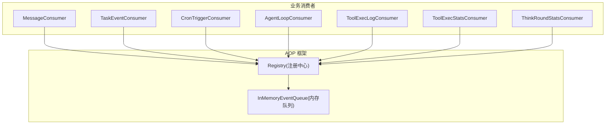
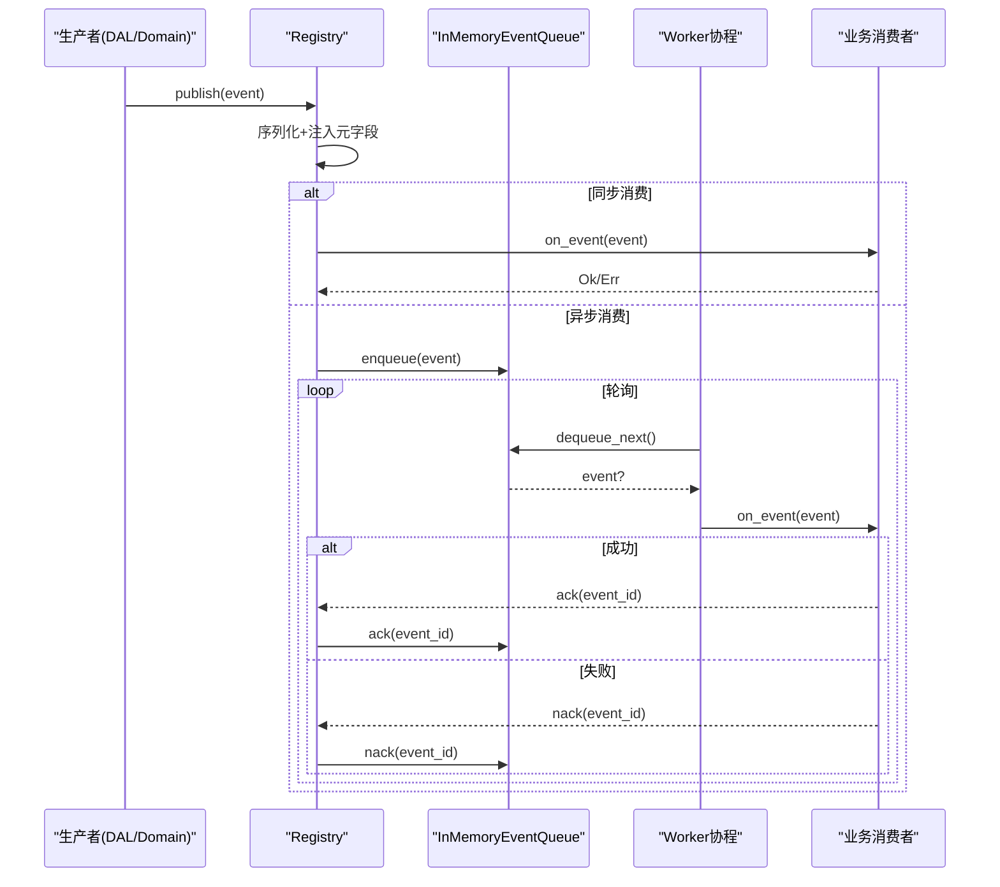
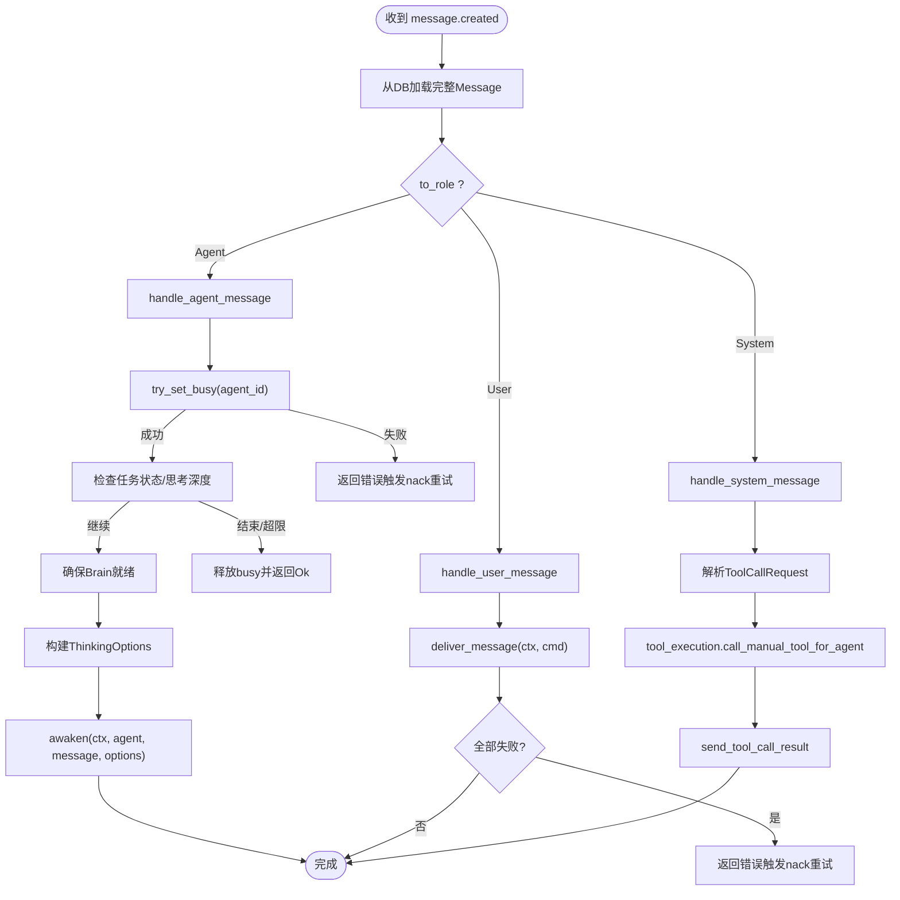
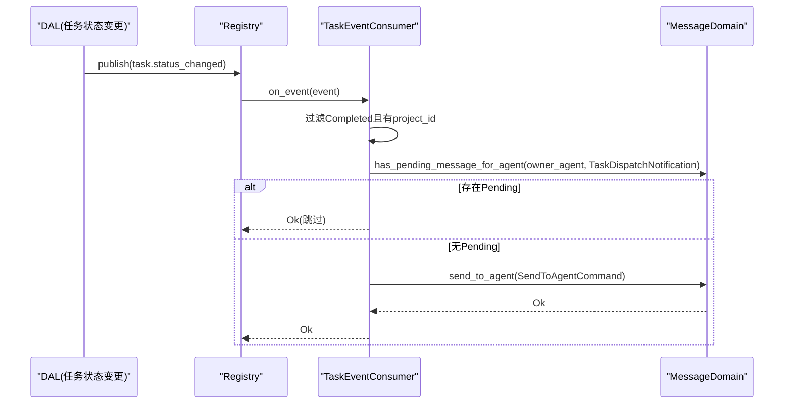
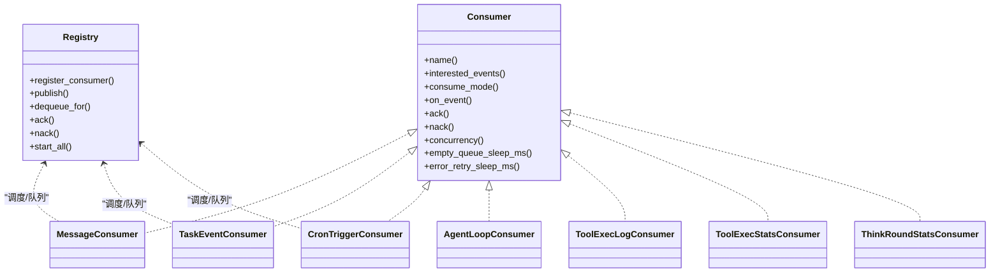

# 消息消费者（代码落地层）

<cite>
**本文引用的文件**
- [src/consumer/mod.rs](src/consumer/mod.rs)
- [src/consumer/message.rs](src/consumer/message.rs)
- [src/consumer/agent_loop_consumer.rs](src/consumer/agent_loop_consumer.rs)
- [src/consumer/task_event_consumer.rs](src/consumer/task_event_consumer.rs)
- [src/consumer/scheduler.rs](src/consumer/scheduler.rs)
- [src/consumer/tool_exec_log_consumer.rs](src/consumer/tool_exec_log_consumer.rs)
- [src/consumer/tool_exec_stats_consumer.rs](src/consumer/tool_exec_stats_consumer.rs)
- [src/consumer/think_round_stats_consumer.rs](src/consumer/think_round_stats_consumer.rs)
- [src/pkg/aop/mod.rs](src/pkg/aop/mod.rs)
- [src/pkg/aop/core/registry.rs](src/pkg/aop/core/registry.rs)
- [src/pkg/aop/core/consumer.rs](src/pkg/aop/core/consumer.rs)
</cite>

## 目录
1. [简介](#简介)
2. [项目结构](#项目结构)
3. [核心组件](#核心组件)
4. [架构总览](#架构总览)
5. [详细组件分析](#详细组件分析)
6. [依赖关系分析](#依赖关系分析)
7. [性能与背压](#性能与背压)
8. [故障排查指南](#故障排查指南)
9. [结论](#结论)
10. [附录：配置与监控](#附录：配置与监控)

## 简介
本章节面向"消息消费者"子系统，系统性说明其在 AOP 事件中心之上的角色与职责：订阅并消费系统事件，完成消息路由、分发与处理；实现消息持久化、去重与幂等保证；提供失败重试、死信队列与补偿机制；并给出性能优化、批量处理、背压控制、配置选项、监控指标与故障排查建议。

> 📌 视角说明（AGENTS §2.1.3 Level 3 互补视角平行卡）：
> 本长文是「消息消费者」主题的 **代码落地层** 视角。同主题还有以下平行视角卡，请按需交叉阅读：
> - [消息消费者（框架层）](docs/wiki/zh/content/基础设施/AOP 事件系统/事件消费者/消息消费者.md)

## 项目结构
消息消费者位于 src/consumer 模块，通过 consumer::init 统一注册到 AOP 框架的 Registry；AOP 负责事件分发、调度与队列管理，业务消费者仅关注业务编排与领域调用。

图表来源
- [src/consumer/mod.rs:16-36](src/consumer/mod.rs#L16-L36)
- [src/pkg/aop/core/registry.rs:49-73](src/pkg/aop/core/registry.rs#L49-L73)
- [src/pkg/aop/core/registry.rs:260-449](src/pkg/aop/core/registry.rs#L260-L449)

章节来源
- [src/consumer/mod.rs:1-43](src/consumer/mod.rs#L1-L43)
- [src/pkg/aop/mod.rs:1-61](src/pkg/aop/mod.rs#L1-L61)

## 核心组件
- 消息消费者（MessageConsumer）：订阅 message.created 事件，按 to_role 路由到 Agent/User/System 三类处理路径，调用 Domain 层完成唤醒、投递与工具执行。
- 任务事件消费者（TaskEventConsumer）：订阅 task.status_changed，在任务完成时向项目 Owner Agent 发送调度通知，驱动 Layer 2 补偿。
- Cron 触发器消费者（CronTriggerConsumer）：订阅 cron.trigger，执行 agent_rest 记忆沉淀与 project_followup 项目跟进。
- 日志与统计消费者：
  - AgentLoopConsumer：记录 Agent 生命周期与每轮思考指标。
  - ToolExecLogConsumer：将工具执行事件写入 JSONL 日志。
  - ToolExecStatsConsumer：将工具调用统计写入全局 Stats。
  - ThinkRoundStatsConsumer：将模型调用 Token 用量写入统计。

章节来源
- [src/consumer/message.rs:1-141](src/consumer/message.rs#L1-L141)
- [src/consumer/task_event_consumer.rs:1-138](src/consumer/task_event_consumer.rs#L1-L138)
- [src/consumer/scheduler.rs:1-211](src/consumer/scheduler.rs#L1-L211)
- [src/consumer/agent_loop_consumer.rs:1-97](src/consumer/agent_loop_consumer.rs#L1-L97)
- [src/consumer/tool_exec_log_consumer.rs:1-53](src/consumer/tool_exec_log_consumer.rs#L1-L53)
- [src/consumer/tool_exec_stats_consumer.rs:1-73](src/consumer/tool_exec_stats_consumer.rs#L1-L73)
- [src/consumer/think_round_stats_consumer.rs:1-73](src/consumer/think_round_stats_consumer.rs#L1-L73)

## 架构总览
AOP 事件中心提供统一的发布-订阅与异步调度能力。业务消费者通过实现 Consumer trait 声明感兴趣的事件类型与消费模式（Sync/Async）。Registry 负责：
- 注册消费者与生产者
- 事件序列化与元数据注入（event_id、kind、order_key、priority、created_at）
- 同步直接调用 on_event，或异步入队由 worker 拉取
- 维护 ack/nack 语义，驱动重试与去重
- 启动多 worker 并发消费，支持空队列休眠与错误退避

图表来源
- [src/pkg/aop/core/registry.rs:97-206](src/pkg/aop/core/registry.rs#L97-L206)
- [src/pkg/aop/core/registry.rs:208-258](src/pkg/aop/core/registry.rs#L208-L258)
- [src/pkg/aop/core/registry.rs:260-449](src/pkg/aop/core/registry.rs#L260-L449)

章节来源
- [src/pkg/aop/core/registry.rs:97-449](src/pkg/aop/core/registry.rs#L97-L449)
- [src/pkg/aop/core/consumer.rs:1-72](src/pkg/aop/core/consumer.rs#L1-L72)

## 详细组件分析

### 消息消费者（MessageConsumer）
- 事件订阅：message.created
- 路由策略：根据 Message.to_role 分派到 Agent/User/System 三种处理路径
- 幂等与确认：
  - ack：将消息状态更新为已处理
  - nack：将消息状态回滚为待处理，触发重试
- 并发与退避：concurrency=4，空队列休眠 100ms，错误重试休眠 1000ms
- 关键处理逻辑：
  - Agent 消息：原子占用 Agent（避免 TOCTOU），检查任务状态与最大思考深度，必要时唤醒 Agent Brain 并调用 awaken；若任务已结束则跳过唤醒
  - User 消息：投递给用户，所有渠道失败时返回错误以触发重试
  - System 消息：解析 ToolCallRequest，构造 RequestContext，调用 RuntimeDomain 执行工具并将结果回写

图表来源
- [src/consumer/message.rs:78-141](src/consumer/message.rs#L78-L141)
- [src/consumer/message.rs:147-357](src/consumer/message.rs#L147-L357)
- [src/consumer/message.rs:359-477](src/consumer/message.rs#L359-L477)

章节来源
- [src/consumer/message.rs:1-534](src/consumer/message.rs#L1-L534)

### 任务事件消费者（TaskEventConsumer）
- 事件订阅：task.status_changed
- 过滤条件：仅处理 Completed 且具备 project_id 的事件
- 去重策略：发送前检查该 Owner Agent 是否已有 Pending 的 TaskDispatchNotification，避免重复通知
- 补偿机制：向 Owner Agent 发送 ProjectFollowupNotification，驱动其检查项目进度与阻塞任务

图表来源
- [src/consumer/task_event_consumer.rs:52-136](src/consumer/task_event_consumer.rs#L52-L136)

章节来源
- [src/consumer/task_event_consumer.rs:1-138](src/consumer/task_event_consumer.rs#L1-L138)

### Cron 触发器消费者（CronTriggerConsumer）
- 事件订阅：cron.trigger
- 动作分发：
  - agent_rest：加载 Agent 并执行记忆沉淀（复用 settle_memory 流程）
  - project_followup：扫描进行中且有 Owner Agent 的项目，预检查 Agent 空闲后发送跟进通知
- 消费模式：Sync（事件发布时立即处理）

章节来源
- [src/consumer/scheduler.rs:1-211](src/consumer/scheduler.rs#L1-L211)

### 日志与统计消费者
- AgentLoopConsumer：记录 Agent 循环开始/结束与每轮 think 指标（Sync）
- ToolExecLogConsumer：将工具执行事件写入 JSONL 日志（Sync）
- ToolExecStatsConsumer：将工具调用统计写入全局 Stats（Sync）
- ThinkRoundStatsConsumer：将模型调用 Token 用量写入统计（Sync）

章节来源
- [src/consumer/agent_loop_consumer.rs:1-97](src/consumer/agent_loop_consumer.rs#L1-L97)
- [src/consumer/tool_exec_log_consumer.rs:1-53](src/consumer/tool_exec_log_consumer.rs#L1-L53)
- [src/consumer/tool_exec_stats_consumer.rs:1-73](src/consumer/tool_exec_stats_consumer.rs#L1-L73)
- [src/consumer/think_round_stats_consumer.rs:1-73](src/consumer/think_round_stats_consumer.rs#L1-L73)

## 依赖关系分析
- 消费者与 AOP 框架：
  - 通过 Consumer trait 声明事件与消费模式
  - Registry 负责事件分发、队列管理与 worker 调度
- 消费者与领域层：
  - MessageConsumer 依赖 RuntimeDomain、MessageDomain、HrDomain、ProjectDomain
  - TaskEventConsumer 依赖 MessageDomain 与 ProjectDomain
  - CronTriggerConsumer 依赖 ProjectDomain 与 MessageDomain
- 消费者与基础设施：
  - 使用 RequestContext 传递上下文
  - 使用 AgentRuntimeStateManager 进行 Agent 状态协调
  - 使用全局 Stats 记录指标

图表来源
- [src/pkg/aop/core/consumer.rs:1-72](src/pkg/aop/core/consumer.rs#L1-L72)
- [src/pkg/aop/core/registry.rs:49-73](src/pkg/aop/core/registry.rs#L49-L73)
- [src/pkg/aop/core/registry.rs:260-449](src/pkg/aop/core/registry.rs#L260-L449)

章节来源
- [src/pkg/aop/core/consumer.rs:1-72](src/pkg/aop/core/consumer.rs#L1-L72)
- [src/pkg/aop/core/registry.rs:49-449](src/pkg/aop/core/registry.rs#L49-L449)

## 性能与背压
- 并发与吞吐
  - MessageConsumer 设置 concurrency=4，适合中等吞吐的消息处理
  - 其他统计类消费者采用 Sync 模式，轻量且不阻塞主流程
- 背压与退避
  - 空队列休眠：empty_queue_sleep_ms=100ms，降低空转 CPU
  - 错误重试休眠：error_retry_sleep_ms=1000ms，避免紧密自旋
  - Registry 在 on_event 失败后主动 sleep，防止 nack 后立即被重新取出导致抖动
- 批处理
  - 当前消费者未实现显式批处理；如需提升吞吐，可在消费者内部聚合多条事件后批量调用 Domain/DAO
- 资源保护
  - Agent 占用采用 try_set_busy 原子操作，避免并发冲突
  - 对已完成/取消/归档的任务直接跳过唤醒，减少无效计算

章节来源
- [src/consumer/message.rs:130-141](src/consumer/message.rs#L130-L141)
- [src/pkg/aop/core/registry.rs:424-431](src/pkg/aop/core/registry.rs#L424-L431)
- [src/consumer/message.rs:147-196](src/consumer/message.rs#L147-L196)

## 故障排查指南
- 常见问题定位
  - 消息未处理：检查消费者是否已注册（consumer::init）、事件类型是否正确、should_consume 是否过滤
  - 重复处理：检查 ack/nack 是否成对调用；Registry 会在成功时调用 queue.ack，失败时调用 queue.nack
  - 卡死或堆积：查看队列长度与事件详情（Registry::queue_len / query_events / get_event）
  - Agent 忙碌：检查 try_set_busy 失败原因与 busy/idle 状态清理路径
- 诊断手段
  - 使用 Registry 提供的队列统计与事件查询接口定位具体事件
  - 结合日志（tracing/sys_info/sys_debug）追踪事件流转与错误堆栈
  - 对超时或慢处理场景，调整 empty_queue_sleep_ms 与 error_retry_sleep_ms
- 恢复策略
  - 对于临时错误（如网络/DB 异常），保持 nack 以触发重试
  - 对于永久错误（如实体不存在），返回非重试错误并清理资源（如释放 busy）

章节来源
- [src/pkg/aop/core/registry.rs:208-258](src/pkg/aop/core/registry.rs#L208-L258)
- [src/pkg/aop/core/registry.rs:336-443](src/pkg/aop/core/registry.rs#L336-L443)
- [src/consumer/message.rs:114-141](src/consumer/message.rs#L114-L141)

## 结论
消息消费者基于 AOP 事件中心实现了高内聚、低耦合的事件处理体系。通过明确的路由与分发逻辑、完善的 ack/nack 语义、合理的并发与退避策略，以及去重与补偿机制，保障了消息处理的可靠性与可观测性。后续可根据业务规模引入批处理与更细粒度的背压控制，进一步提升吞吐与稳定性。

## 附录：配置与监控
- 消费者配置要点
  - 消费模式：Sync/Async（影响是否入队与 worker 调度）
  - 并发度：concurrency（默认 1，MessageConsumer 为 4）
  - 轮询节奏：empty_queue_sleep_ms（默认 100ms）、error_retry_sleep_ms（默认 1000ms）
  - 事件过滤：should_consume（可按需扩展）
- 监控指标
  - Registry 提供队列长度与统计：queue_len、all_queue_stats、queue_stats
  - 事件查询：query_events、get_event
  - 指标 Hook：AopMetricsHook（可注入自定义采集逻辑）
- 与其他组件交互
  - 与 DAL/DAO：通过 Domain 层间接访问数据，禁止跨层直调
  - 与 RequestContext：统一传递组织、项目、任务、用户等上下文
  - 与 AgentRuntimeStateManager：协调 Agent 生命周期与并发占用

章节来源
- [src/pkg/aop/core/consumer.rs:1-72](src/pkg/aop/core/consumer.rs#L1-L72)
- [src/pkg/aop/core/registry.rs:489-553](src/pkg/aop/core/registry.rs#L489-L553)
- [src/consumer/message.rs:479-514](src/consumer/message.rs#L479-L514)