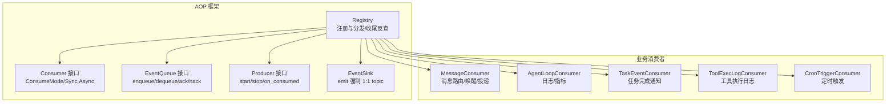
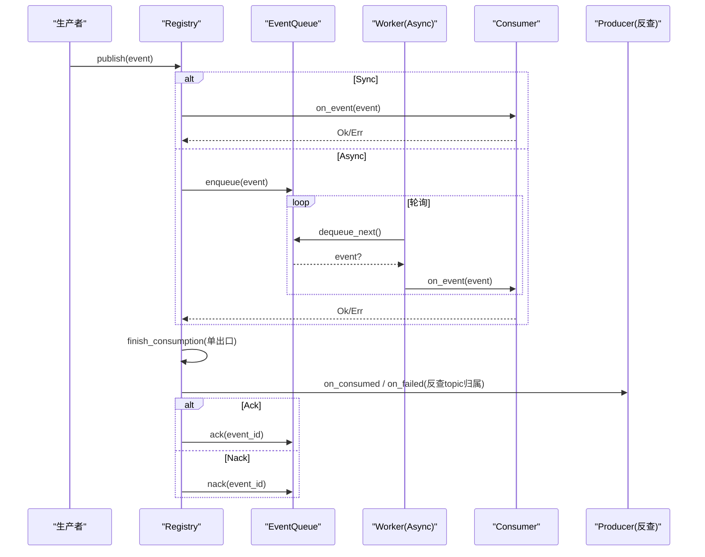
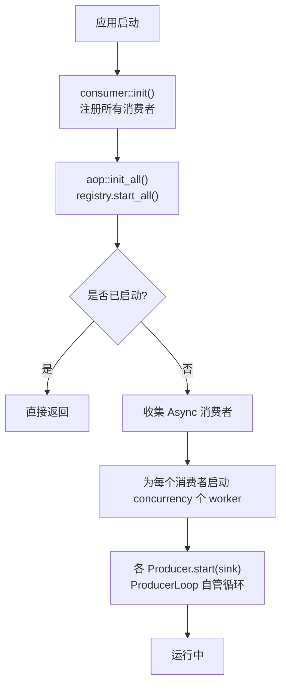
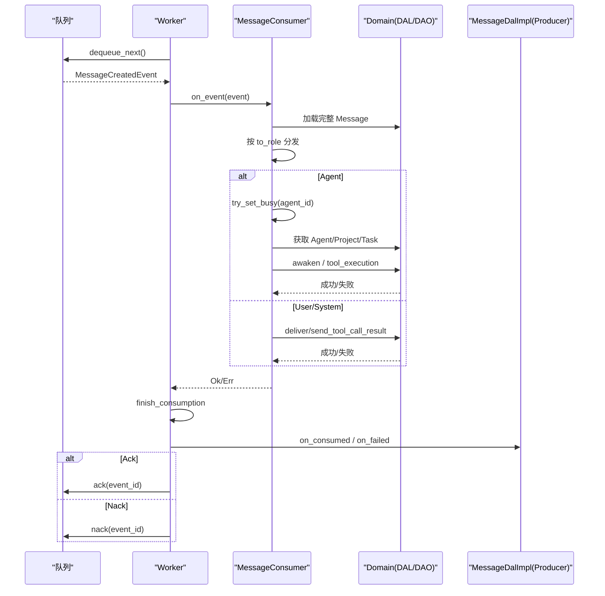
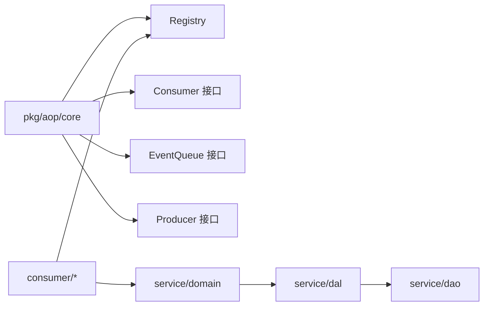

# 消费者接口规范

<cite>
**本文引用的文件**
- [src/consumer/mod.rs](src/consumer/mod.rs)
- [src/pkg/aop/mod.rs](src/pkg/aop/mod.rs)
- [src/pkg/aop/core/mod.rs](src/pkg/aop/core/mod.rs)
- [src/pkg/aop/core/consumer.rs](src/pkg/aop/core/consumer.rs)
- [src/pkg/aop/core/consumer.rs#L44-L48](src/pkg/aop/core/consumer.rs#L44-L48) (on_event 签名变更：(ctx: RequestContext, event: serde_json::Value))
- [src/pkg/aop/core/registry.rs](src/pkg/aop/core/registry.rs)
- [src/pkg/aop/core/registry.rs#L148-L156](src/pkg/aop/core/registry.rs#L148-L156) (publish 注入 context_carrier)
- [src/pkg/aop/core/registry.rs#L277-L233](src/pkg/aop/core/registry.rs#L277-L283) (carried_ctx 还原 helper)
- [src/pkg/aop/core/registry.rs#L734-L805](src/pkg/aop/core/registry.rs#L734-L805) (finish_consumption 收尾反查)
- [src/pkg/aop/core/event_sink.rs](src/pkg/aop/core/event_sink.rs)
- [common/src/enums/event_topic.rs](common/src/enums/event_topic.rs)
- [src/pkg/aop/core/producer.rs](src/pkg/aop/core/producer.rs)
- [src/pkg/aop/queue/mod.rs](src/pkg/aop/queue/mod.rs)
- [src/pkg/aop/core/metrics_hook.rs#L18-L61](src/pkg/aop/core/metrics_hook.rs#L18-L61) (AopEventMeta context_carrier)
- [src/consumer/message.rs](src/consumer/message.rs)
- [src/consumer/message.rs#L78-L82](src/consumer/message.rs#L78-L82) (on_event 签名适配 + ctx 使用说明)
- [src/consumer/message.rs#L621-L661](src/consumer/message.rs#L621-L661) (rebuild_context 以框架 ctx 为基底追加字段)
- [src/consumer/agent_loop_consumer.rs](src/consumer/agent_loop_consumer.rs)
- [src/consumer/task_event_consumer.rs](src/consumer/task_event_consumer.rs)
- [src/consumer/tool_exec_log_consumer.rs](src/consumer/tool_exec_log_consumer.rs)
- [src/consumer/scheduler.rs](src/consumer/scheduler.rs)

**本文关联的 RAG 知识卡**
- docs/wiki/knowledge/zh/AOP 生产消费事件中心：纯框架零业务 + pkg/aop/core 6 Trait + Registry 全局单例 + 8 类业务消费者注册/AOP 生产消费事件中心：纯框架零业务 + pkg/aop/core 6 Trait + Registry 全局单例 + 8 类业务消费者注册.md
- docs/wiki/knowledge/zh/Domain 内部事件与消费者全链路：8 类 DomainEvent 枚举 + 8 类 Consumer 业务消费 + AOP Producer 投递入口 + Registry 订阅/Domain 内部事件与消费者全链路：8 类 DomainEvent 枚举 + 8 类 Consumer 业务消费 + AOP Producer 投递入口 + Registry 订阅.md
</cite>

## 更新摘要 2026-08-31：Consumer.on_event 签名变更 — 框架传入同源 ctx，禁止业务自行重建

**核心变更**：Consumer trait 的 `on_event` 方法签名从单参数改为双参数，新增 `ctx: RequestContext` 由 AOP 框架统一从事件 `context_carrier` 字段还原后传入。

1. **签名更新**：`async fn on_event(&self, ctx: RequestContext, event: serde_json::Value) -> Result<()>` —— Sync 路径与 Async worker 路径均使用 `carried_ctx(&event_json)` 还原 ctx 后调用。

2. **carried_ctx 辅助方法**（`registry.rs#L277-L283`）：从事件 JSON 顶层提取 `context_carrier` 字段，通过 `ContextCarrier::from_json → into_context` 重建 RequestContext；缺失或解析失败时回退为 `RequestContext::new_system()`。

3. **业务 Consumer 适配要点**：
   - 所有现有 Consumer 已适配（7 类同步 + 1 类异步）。纯透传消费者用 `_ctx: RequestContext` 忽略；
   - MessageConsumer 不再自己 `RequestContext::new_system()` 重建 ctx，`rebuild_context` 方法（`message.rs#L621-L661`）以框架传来的 ctx 为基底，用 `to_builder()` 追加 organization_id / caller_type / user_id / project_id / task_id / agent_id 等业务字段，**保留原始 log_id 贯穿整条链路**。

4. **硬约束**：业务 Consumer 内部禁止再次调用 `RequestContext::new_system()` —— 这样会丢失 log_id 等链路标识，导致 AopStatsHook 的 `[aop]` 链路日志中断。正确做法是接收框架传入的 ctx，按需用 `ctx.to_builder().xxx().build()` 追加字段。

---

## 更新摘要（AOP 生产者-消费者契约重构）：subscriptions / EventTopic / finish_consumption 收尾

**变更内容**
- `EventKind` 删除，统一改用 `common::enums::EventTopic`（点分线字符串枚举）；`Event::kind()` 返回 `EventTopic`。
- 消费者订阅声明由 `interested_events() -> Vec<EventKind>` 改为 `subscriptions() -> Vec<Subscription>`，`Subscription { kind: EventTopic, ordered: bool, notify_producer: bool }`。
- 消费者 trait 删除 `ack` / `nack` / `source`；收尾统一在 `Registry::finish_consumption` 单出口，按 topic 反查 producer：`Ok → on_consumed → Ack`，`Err → on_failed → RetryDecision{Retry(Nack)/Discard(Ack)}`。
- `RetryDecision { Retry, Discard }`：框架不设 `max_retry`、无死信，重试决策权下沉生产者；`Discard` 仍回调 `on_consumed` 并打 `on_consume_discarded` 埋点（不计入失败率）。
- 生产者不再 `register()`/`poll()`/`poll_interval_secs`，改为 `start(sink)`/`stop()` 经 `ProducerLoop` 自管循环；`EventSink` 预绑定 topic 并强制 `1 producer : 1 topic`。

---

## 目录
1. [简介](#简介)
2. [项目结构](#项目结构)
3. [核心组件](#核心组件)
4. [架构总览](#架构总览)
5. [详细组件分析](#详细组件分析)
6. [依赖关系分析](#依赖关系分析)
7. [性能考量](#性能考量)
8. [故障排查指南](#故障排查指南)
9. [结论](#结论)
10. [附录：自定义消费者开发指南](#附录自定义消费者开发指南)

## 简介
本规范面向 AOP 消费者接口，定义统一的消费者抽象、消费模式（同步/异步）、生命周期方法实现要求、错误处理与重试策略、注册与启动顺序控制，以及性能优化、资源管理与监控集成方案。同时提供自定义消费者开发指南，涵盖接口实现规范、测试方法与部署配置建议。

## 项目结构
AOP 事件中心位于 pkg/aop，包含核心接口、注册中心、队列抽象、生产者与事件汇；业务消费者位于 consumer 模块，按事件类型订阅并编排领域逻辑。

图表来源
- [src/pkg/aop/core/registry.rs#L1-L120](src/pkg/aop/core/registry.rs#L1-L120)
- [src/pkg/aop/core/consumer.rs#L22-L72](src/pkg/aop/core/consumer.rs#L22-L72)
- [src/pkg/aop/core/producer.rs#L35-L96](src/pkg/aop/core/producer.rs#L35-L96)
- [src/pkg/aop/core/event_sink.rs#L20-L40](src/pkg/aop/core/event_sink.rs#L20-L40)
- [src/pkg/aop/queue/mod.rs#L77-L107](src/pkg/aop/queue/mod.rs#L77-L107)
- [src/consumer/message.rs#L64-L141](src/consumer/message.rs#L64-L141)
- [src/consumer/agent_loop_consumer.rs#L26-L96](src/consumer/agent_loop_consumer.rs#L26-L96)
- [src/consumer/task_event_consumer.rs#L38-L138](src/consumer/task_event_consumer.rs#L38-L138)
- [src/consumer/tool_exec_log_consumer.rs#L26-L53](src/consumer/tool_exec_log_consumer.rs#L26-L53)
- [src/consumer/scheduler.rs#L39-L95](src/consumer/scheduler.rs#L39-L95)

章节来源
- [src/pkg/aop/mod.rs#L1-L61](src/pkg/aop/mod.rs#L1-L61)
- [src/consumer/mod.rs#L1-L43](src/consumer/mod.rs#L1-L43)

## 核心组件
- Consumer 接口：定义 name、`subscriptions()`、`should_consume`、`consume_mode`、`on_event`，以及并发/退避参数 concurrency、empty_queue_sleep_ms、error_retry_sleep_ms。不再包含 ack/nack（收尾由框架在 finish_consumption 内完成）。
- ConsumeMode：Sync（发布线程直接 on_event）与 Async（入队由 worker 拉取）。
- Registry：全局注册中心，负责消费者/生产者注册、事件分发、队列管理、worker 启动、收尾反查与统计查询。
- EventQueue：队列抽象，支持 enqueue/dequeue/ack/nack/stats/query/get_event 等。
- Producer：生产者接口，通过 `start(sink)` 自管循环、`on_consumed`/`on_failed` 承接消费收尾；`EventSink` 预绑定 topic 并校验 `event.kind() == topic`。

章节来源
- [src/pkg/aop/core/consumer.rs#L22-L72](src/pkg/aop/core/consumer.rs#L22-L72)
- [src/pkg/aop/core/registry.rs#L1-L120](src/pkg/aop/core/registry.rs#L1-L120)
- [src/pkg/aop/queue/mod.rs#L77-L107](src/pkg/aop/queue/mod.rs#L77-L107)
- [src/pkg/aop/core/producer.rs#L35-L96](src/pkg/aop/core/producer.rs#L35-L96)
- [src/pkg/aop/core/event_sink.rs#L20-L40](src/pkg/aop/core/event_sink.rs#L20-L40)

## 架构总览
AOP 框架解耦生产与消费：Producer 经 EventSink 投递，Consumer 专注业务编排。Registry 统一分发事件，根据 consume_mode 选择同步或异步路径；异步路径通过 EventQueue 缓冲并由多 worker 拉取消费。消费结果进入 `finish_consumption` 单一出口，按 topic 反查已注册 producer 回调 `on_consumed`/`on_failed`，由 `RetryDecision` 决定 Ack（移除事件）或 Nack（退避重投），从而在不暴露 Consumer::ack/nack 的前提下保证可靠性。

图表来源
- [src/pkg/aop/core/registry.rs#L53-L206](src/pkg/aop/core/registry.rs#L53-L206)
- [src/pkg/aop/core/registry.rs#L734-L805](src/pkg/aop/core/registry.rs#L734-L805)
- [src/pkg/aop/queue/mod.rs#L77-L107](src/pkg/aop/queue/mod.rs#L77-L107)

## 详细组件分析

### 消费者抽象与消费模式
- 同步模式（Sync）：适合轻量、快速处理，避免额外队列开销。
- 异步模式（Async）：适合耗时操作，具备并发 worker、退避重试与收尾反查机制。
- should_consume：可基于事件内容做细粒度过滤。
- 生命周期方法：
  - init：在 consumer::init 中完成注册（非接口方法）。
  - on_event：核心处理逻辑，必须幂等且健壮。
  - shutdown：当前框架未暴露显式 shutdown；可通过进程退出或外部信号停止 worker。

章节来源
- [src/pkg/aop/core/consumer.rs#L22-L72](src/pkg/aop/core/consumer.rs#L22-L72)
- [src/consumer/mod.rs#L16-L37](src/consumer/mod.rs#L16-L37)

### 注册流程与启动顺序
- 注册阶段：consumer::init 调用 aop::registry().register_consumer(...) 注册各消费者。
- 启动阶段：aop::init_all() 调用 registry.start_all()，为每个 Async 消费者启动 concurrency 个 worker；生产者由各自 `start(sink)` 经 ProducerLoop 自管循环，Registry 仅负责 start/stop。
- 顺序约束：先注册消费者，再启动；start_all 幂等，重复调用直接返回。register_producer 为同步，topic 占位冲突报 Conflict（「1 topic : 1 producer」）。

图表来源
- [src/consumer/mod.rs#L16-L37](src/consumer/mod.rs#L16-L37)
- [src/pkg/aop/mod.rs#L53-L61](src/pkg/aop/mod.rs#L53-L61)
- [src/pkg/aop/core/registry.rs#L343-L487](src/pkg/aop/core/registry.rs#L343-L487)
- [src/pkg/aop/core/producer.rs#L87-L136](src/pkg/aop/core/producer.rs#L87-L136)

章节来源
- [src/consumer/mod.rs#L16-L37](src/consumer/mod.rs#L16-L37)
- [src/pkg/aop/mod.rs#L53-L61](src/pkg/aop/mod.rs#L53-L61)
- [src/pkg/aop/core/registry.rs#L343-L487](src/pkg/aop/core/registry.rs#L343-L487)

### 错误处理与重试策略
- 同步模式：on_event 抛出错误会被记录并通过 metrics hook 上报，无自动重试。
- 异步模式：
  - on_event 成功：`finish_consumption` 反查 producer 调用 `on_consumed`，随后 queue.ack 移除事件。
  - on_event 失败：反查 producer 调用 `on_failed` 得到 `RetryDecision`；`Retry` 走 queue.nack 退避重投，`Discard` 走 queue.ack 但仍回调 `on_consumed` 并打 `on_consume_discarded` 埋点（不计入失败率）。
  - dequeue 失败：sleep(error_retry_sleep_ms)。
  - 队列为空：sleep(empty_queue_sleep_ms)。
- 框架不设 max_retry、无死信：重试上限与永久错误处理完全由 producer 的 `on_failed` 决策。
- 业务侧需区分临时错误（返回 Err 以触发 Retry）与永久错误（经 decide 落到 Discard），避免无限重投。

章节来源
- [src/pkg/aop/core/registry.rs#L156-L206](src/pkg/aop/core/registry.rs#L156-L206)
- [src/pkg/aop/core/registry.rs#L734-L805](src/pkg/aop/core/registry.rs#L734-L805)
- [src/pkg/aop/core/producer.rs#L13-L68](src/pkg/aop/core/producer.rs#L13-L68)
- [src/consumer/message.rs#L114-L141](src/consumer/message.rs#L114-L141)

### 典型消费者实现

#### MessageConsumer（消息路由与 Agent 唤醒）
- 模式：Async，concurrency=4，用于高吞吐的消息分发。
- 职责：解析 message.created 事件，按 to_role 分发到 Agent/User/System 分支；Agent 分支进行原子占用（try_set_busy）、上下文重建、唤醒与工具调用结果回写。
- 错误处理：用户消息投递全部失败时返回错误以触发 Nack；Agent 不存在返回永久错误经 decide 落到 Discard；Busy/Resting 状态冲突返回冲突错误触发 Retry。

图表来源
- [src/consumer/message.rs#L64-L141](src/consumer/message.rs#L64-L141)
- [src/consumer/message.rs#L147-L357](src/consumer/message.rs#L147-L357)
- [src/consumer/message.rs#L359-L477](src/consumer/message.rs#L359-L477)
- [src/pkg/aop/core/registry.rs#L734-L805](src/pkg/aop/core/registry.rs#L734-L805)
- [src/service/dal/message.rs#L765-L800](src/service/dal/message.rs#L765-L800)

章节来源
- [src/consumer/message.rs#L64-L141](src/consumer/message.rs#L64-L141)
- [src/consumer/message.rs#L147-L357](src/consumer/message.rs#L147-L357)
- [src/consumer/message.rs#L359-L477](src/consumer/message.rs#L359-L477)

#### AgentLoopConsumer（同步日志/指标）
- 模式：Sync，订阅 agent.loop 与 agent.think.round，用于日志与观测。
- 特点：轻量、低延迟，适合对性能敏感的路径。

章节来源
- [src/consumer/agent_loop_consumer.rs#L26-L96](src/consumer/agent_loop_consumer.rs#L26-L96)

#### TaskEventConsumer（任务完成通知）
- 模式：Async，订阅 task.status_changed，仅在 Completed 时向 Owner Agent 发送通知。
- 去重：检查是否存在 Pending 的 TaskDispatchNotification，避免重复通知。

章节来源
- [src/consumer/task_event_consumer.rs#L38-L138](src/consumer/task_event_consumer.rs#L38-L138)

#### ToolExecLogConsumer（工具执行日志）
- 模式：Sync，订阅 agent.tool.executed，写入 JSONL 日志。
- 特点：简单可靠，不影响主流程。

章节来源
- [src/consumer/tool_exec_log_consumer.rs#L26-L53](src/consumer/tool_exec_log_consumer.rs#L26-L53)

#### CronTriggerConsumer（定时触发）
- 模式：Sync，订阅 cron.trigger（声明 notify_producer），按 action 分发到 agent_rest 与 project_followup。
- 特性：mark_trigger_executed 已移入 CronTriggerProducer::on_consumed；预检查 Agent 运行时状态，避免无效重试堆积。

章节来源
- [src/consumer/scheduler.rs#L39-L95](src/consumer/scheduler.rs#L39-L95)
- [src/consumer/scheduler.rs#L133-L194](src/consumer/scheduler.rs#L133-L194)
- [src/producer/cron_trigger.rs#L110-L162](src/producer/cron_trigger.rs#L110-L162)

## 依赖关系分析
- 耦合度：AOP 框架与业务消费者通过 Consumer 接口与 EventTopic 解耦；业务消费者依赖 Domain/DAL/DAO 完成具体逻辑。
- 循环依赖：AOP 层不感知业务实体，避免反向依赖。
- 外部依赖：Tokio 协程、serde_json 序列化、Tracing/日志宏。

图表来源
- [src/pkg/aop/core/mod.rs#L1-L14](src/pkg/aop/core/mod.rs#L1-L14)
- [src/consumer/mod.rs#L1-L43](src/consumer/mod.rs#L1-L43)

章节来源
- [src/pkg/aop/core/mod.rs#L1-L14](src/pkg/aop/core/mod.rs#L1-L14)
- [src/consumer/mod.rs#L1-L43](src/consumer/mod.rs#L1-L43)

## 性能考量
- 消费模式选择：
  - 同步：适用于轻量、低延迟场景（如日志、指标）。
  - 异步：适用于耗时、可并行场景（如消息投递、Agent 唤醒）。
- 并发与退避：
  - 合理设置 concurrency（例如 MessageConsumer 为 4）。
  - empty_queue_sleep_ms 与 error_retry_sleep_ms 平衡 CPU 与延迟。
- 队列与收尾：
  - 确认 finish_consumption 正确进入 Ack/Nack 分支，避免队列积压与 order_key 卡死。
- 上下文与序列化：
  - 最小化 on_event 中的序列化/反序列化成本；复用 RequestContext。
- 资源管理：
  - 避免在 on_event 中持有长连接或大对象；及时释放资源。
- 监控集成：
  - 通过 AopMetricsHook 采集 on_publish/on_consume_start/on_consume_success/on_consume_failure/on_consume_discarded。
  - 使用 Registry 提供的 queue_stats/all_queue_stats 观察队列健康。

[本节为通用指导，无需特定文件引用]

## 故障排查指南
- 常见问题定位：
  - 队列堆积：检查 queue.stats 与 all_queue_stats，确认是否有大量 pending/in_progress。
  - 事件卡死：确认 on_event 是否成功进入 finish_consumption 的 Ack 分支并释放 in_progress；order_key 相同的事件可能因未 Ack 而阻塞后续事件。
  - 无限重投：若某 topic 未注册 producer，消费失败会走 delivery_of 兜底直接 Nack，导致无限重投；需确认 subscriptions() 中 notify_producer=true 的 topic 都已 register_producer。
  - 丢弃静默：Discard 走 Ack 但仍回调 on_consumed 并打 on_consume_discarded 埋点，不计入失败率；事件「消失但失败率为 0」时应查 discarded 指标。
  - CPU 自旋：确认 on_event 失败后存在 sleep(error_retry_sleep_ms)，避免紧密循环。
- 诊断手段：
  - 使用 Registry::query_events 与 get_event 查看事件详情。
  - 结合 Tracing/日志定位 on_event 内部异常。
  - 通过 metrics hook 统计成功率、discarded 率与耗时分布。

章节来源
- [src/pkg/aop/core/registry.rs#L500-L553](src/pkg/aop/core/registry.rs#L500-L553)
- [src/pkg/aop/core/registry.rs#L734-L805](src/pkg/aop/core/registry.rs#L734-L805)
- [src/pkg/aop/core/registry.rs#L333-L449](src/pkg/aop/core/registry.rs#L333-L449)

## 结论
AOP 消费者接口通过统一的 Consumer 抽象与 Registry 调度，实现了高内聚、低耦合的事件驱动架构。消费收尾已收敛到 finish_consumption 单一出口，按 topic 反查 producer 完成 on_consumed/on_failed 回调，配合 RetryDecision 把重试决策权下沉生产者；选择合适的消费模式、合理的并发与退避策略、严格的收尾语义与完善的监控集成，是构建稳定高效消费者的关键。

[本节为总结性内容，无需特定文件引用]

## 附录：自定义消费者开发指南

### 接口实现规范
- 实现 Consumer trait：
  - name：全局唯一标识，用于队列路由与日志追踪。
  - subscriptions：返回 `Vec<Subscription>`，声明感兴趣的事件类型（EventTopic）、ordered 与 notify_producer。
  - should_consume：可选过滤，减少不必要处理。
  - consume_mode：根据场景选择 Sync 或 Async。
  - on_event：核心业务逻辑，必须幂等、健壮、可重试。
  - concurrency/empty_queue_sleep_ms/error_retry_sleep_ms：调优参数。
- 收尾回调：若 subscriptions 中某 topic 置 notify_producer=true，需注册对应 Producer 实现 on_consumed/on_failed，由框架在 finish_consumption 中回调；不再自行实现 ack/nack。

章节来源
- [src/pkg/aop/core/consumer.rs#L22-L72](src/pkg/aop/core/consumer.rs#L22-L72)
- [src/pkg/aop/core/producer.rs#L35-L68](src/pkg/aop/core/producer.rs#L35-L68)

### 注册与启动
- 在 consumer::init 中注册消费者。
- 在应用启动时调用 aop::init_all() 启动调度器（顺序：dal::init_all → producer::init → consumer::init → aop::init_all）。

章节来源
- [src/consumer/mod.rs#L16-L37](src/consumer/mod.rs#L16-L37)
- [src/pkg/aop/mod.rs#L53-L61](src/pkg/aop/mod.rs#L53-L61)

### 测试方法
- 单元测试：
  - 构造事件 JSON，直接调用 on_event，验证副作用（如 DAL/DAO 调用）。
  - 模拟 Domain/DAL 返回值，覆盖成功/失败分支。
- 集成测试：
  - 使用 Registry::publish 发布事件，验证队列行为与 finish_consumption 的 Ack/Nack 及 producer 回调。
  - 验证 queue.stats 与 query_events 的结果。

[本节为通用指导，无需特定文件引用]

### 部署配置
- 调整 concurrency、empty_queue_sleep_ms、error_retry_sleep_ms 以适应负载。
- 启用 AopMetricsHook 接入监控系统，关注 discarded 指标。
- 定期巡检队列健康与错误率。

[本节为通用指导，无需特定文件引用]
