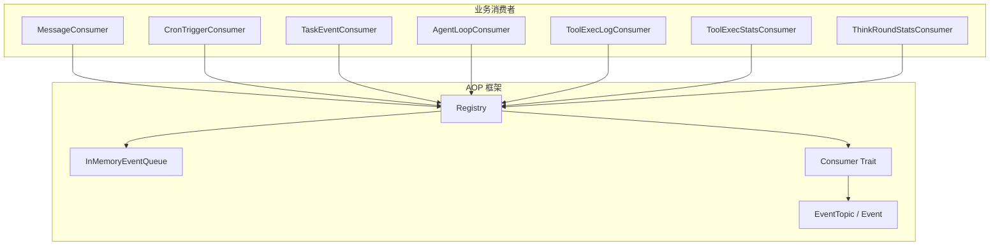
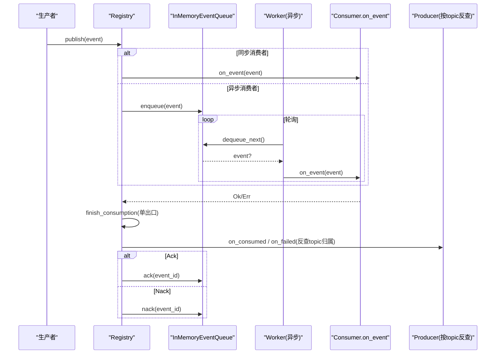
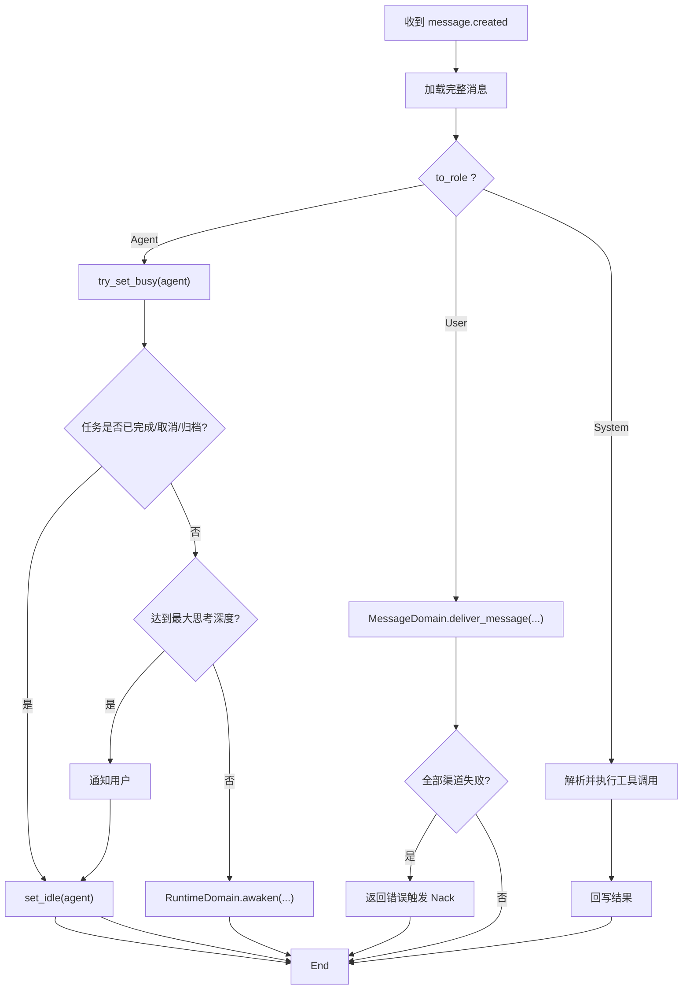
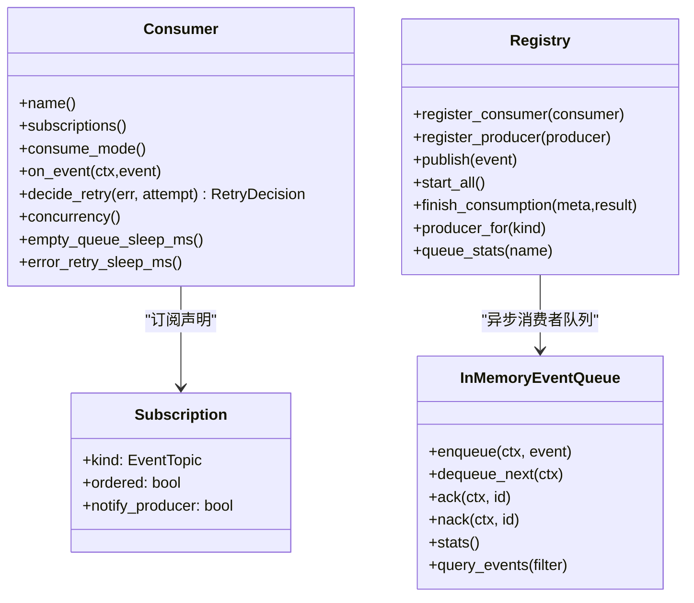

# 消费者框架

<cite>
**本文引用的文件**
- [src/consumer/mod.rs](src/consumer/mod.rs)
- [src/pkg/aop/core/consumer.rs](src/pkg/aop/core/consumer.rs)
- [src/pkg/aop/core/event.rs](src/pkg/aop/core/event.rs)
- [src/pkg/aop/core/registry.rs](src/pkg/aop/core/registry.rs)
- [src/pkg/aop/queue/in_memory.rs](src/pkg/aop/queue/in_memory.rs)
- [src/pkg/aop/core/event_sink.rs](src/pkg/aop/core/event_sink.rs)
- [common/src/enums/event_topic.rs](common/src/enums/event_topic.rs)
- [src/consumer/message.rs](src/consumer/message.rs)
- [src/consumer/scheduler.rs](src/consumer/scheduler.rs)
- [src/consumer/agent_loop_consumer.rs](src/consumer/agent_loop_consumer.rs)
- [src/consumer/task_event_consumer.rs](src/consumer/task_event_consumer.rs)
- [src/consumer/tool_exec_log_consumer.rs](src/consumer/tool_exec_log_consumer.rs)
- [src/consumer/tool_exec_stats_consumer.rs](src/consumer/tool_exec_stats_consumer.rs)
- [src/consumer/think_round_stats_consumer.rs](src/consumer/think_round_stats_consumer.rs)
- [frontend/src/components/aop_gauge.rs](frontend/src/components/aop_gauge.rs)
</cite>

## 更新摘要

**变更内容**
- `EventKind` 已删除，统一改用 `common::enums::EventTopic`（点分线字符串枚举，如 `message.created` / `cron.trigger`），`Event::kind()` 返回 `EventTopic`。
- 消费者订阅声明由 `interested_events() -> Vec<EventKind>` 改为 `subscriptions() -> Vec<Subscription>`，其中 `Subscription { kind: EventTopic, ordered: bool, notify_producer: bool }`。
- 消费者 trait 不再暴露 `ack` / `nack` / `source`：收尾统一在 `Registry::finish_consumption` 单一出口，按 topic 归属反查已注册 producer 完成回调；`Ok → on_consumed → Ack`，`Err → on_failed → Retry(Nack) / Discard(Ack)`。
- `RetryDecision { Retry, Discard }`：框架不设 `max_retry`、无死信队列，重试判定权下沉到消费者（`decide_retry`）。
- `ordered` 当前仅被注册期校验读取（Sync 消费者声明 `ordered` 会注册失败）；入队仍无条件按 `order_key`，运行期告警尚未接线。

---

## 目录
1. [简介](#简介)
2. [项目结构](#项目结构)
3. [核心组件](#核心组件)
4. [架构总览](#架构总览)
5. [详细组件分析](#详细组件分析)
6. [依赖关系分析](#依赖关系分析)
7. [性能与资源管理](#性能与资源管理)
8. [故障排查指南](#故障排查指南)
9. [结论](#结论)
10. [附录：自定义消费者开发指南](#附录自定义消费者开发指南)

## 简介
本框架基于 AOP 事件中心提供统一的生产者-消费者模型，用于解耦业务模块、实现可靠的事件驱动处理。消费者通过实现 Consumer trait 声明感兴趣的事件类型（`subscriptions()`）、消费模式（同步/异步）以及并发与退避策略；注册中心负责分发事件、维护队列、调度 worker、并在消费完成后按 topic 反查 producer 完成收尾与指标采集。内置消费者覆盖消息投递、定时任务、Agent 循环日志、工具执行统计等关键场景。

## 项目结构
消费者相关代码主要分布在两个层次：
- 框架层（pkg/aop）：定义 Event、Consumer、Registry、EventQueue 抽象及内存队列实现，提供发布、订阅、调度、收尾反查、指标钩子能力。
- 业务层（consumer）：实现具体消费者，将事件编排到 Domain/DAL/DAO，完成 Agent 唤醒、消息投递、统计落库等。

图表来源
- [src/consumer/mod.rs#L16-L36](src/consumer/mod.rs#L16-L36)
- [src/pkg/aop/core/registry.rs#L53-L73](src/pkg/aop/core/registry.rs#L53-L73)
- [src/pkg/aop/core/consumer.rs#L22-L43](src/pkg/aop/core/consumer.rs#L22-L43)
- [src/pkg/aop/core/event.rs#L4-L25](src/pkg/aop/core/event.rs#L4-L25)
- [common/src/enums/event_topic.rs#L32-L115](common/src/enums/event_topic.rs#L32-L115)
- [src/pkg/aop/queue/in_memory.rs#L108-L166](src/pkg/aop/queue/in_memory.rs#L108-L166)

章节来源
- [src/consumer/mod.rs#L16-L36](src/consumer/mod.rs#L16-L36)

## 核心组件
- ConsumeMode：同步（Sync）与异步（Async）两种消费模式。同步在发布线程直接调用 on_event；异步入队后由 Registry 启动的 worker 拉取处理。
- Consumer trait：声明 name、`subscriptions()`、`consume_mode`、`on_event`，以及可选的 `should_consume`、`concurrency`、`empty_queue_sleep_ms`、`error_retry_sleep_ms`。`subscriptions()` 返回 `Subscription { kind: EventTopic, ordered: bool, notify_producer: bool }`，`ordered` 与 `notify_producer` 参与注册期校验与收尾反查。消费者不再实现 ack/nack，确认动作由框架在 `finish_consumption` 内完成。
- Registry：全局注册中心，维护消费者索引、每个异步消费者的独立队列、生命周期管理与指标 Hook 注入；消费完成后按 topic 反查 producer 回调 `on_consumed` / `on_failed`。
- InMemoryEventQueue：内存队列，支持按 order_key 顺序、优先级与创建时间排序，维护 pending/in_progress 状态，提供 ack/nack/stats/query。

章节来源
- [src/pkg/aop/core/consumer.rs#L22-L71](src/pkg/aop/core/consumer.rs#L22-L71)
- [src/pkg/aop/core/registry.rs#L11-L47](src/pkg/aop/core/registry.rs#L11-L47)
- [src/pkg/aop/queue/in_memory.rs#L41-L102](src/pkg/aop/queue/in_memory.rs#L41-L102)

## 架构总览
事件从生产者发出后，Registry 根据事件类型路由到对应消费者；同步消费者立即处理，异步消费者入队并由 worker 循环拉取。消费结果统一进入 `finish_consumption` 单一出口：成功经 producer 回调 `on_consumed` 后 `Ack`，失败经 `Consumer::decide_retry` 判定 `RetryDecision`——`Retry` 走 `Nack` 退避重投，`Discard` 走 `Ack` 但仍回调 `on_consumed` 并打 `on_consume_discarded` 埋点（不计入失败率）。队列保证同 order_key 的顺序性与单活消息，避免重复处理导致的竞争。

图表来源
- [src/pkg/aop/core/registry.rs#L53-L206](src/pkg/aop/core/registry.rs#L53-L206)
- [src/pkg/aop/core/registry.rs#L734-L805](src/pkg/aop/core/registry.rs#L734-L805)
- [src/pkg/aop/queue/in_memory.rs#L179-L267](src/pkg/aop/queue/in_memory.rs#L179-L267)

## 详细组件分析

### 消费者抽象与选择策略
- 同步 vs 异步选择：
  - 轻量、非阻塞、可容忍失败的侧写（如日志、统计）使用 Sync。
  - 重任务、需要可靠性与重试（如消息投递、Agent 唤醒）使用 Async。
- 过滤与元数据：should_consume 可在进入 on_event 前进行快速过滤；事件 JSON 会注入 event_id/kind/order_key/priority/created_at 供监控与队列使用。
- 并发与退避：concurrency 控制 worker 数量；empty_queue_sleep_ms 控制空轮休眠；error_retry_sleep_ms 控制失败重试间隔。

章节来源
- [src/pkg/aop/core/consumer.rs#L22-L71](src/pkg/aop/core/consumer.rs#L22-L71)
- [src/pkg/aop/core/registry.rs#L116-L142](src/pkg/aop/core/registry.rs#L116-L142)

### 消息消费者（Agent 唤醒/用户投递/工具回调）
- 事件：message.created（由 MessageDalImpl 作为 producer 拥有收尾）
- 模式：Async，并发 4
- 职责：
  - 解析 MessageCreatedEvent，加载完整 Message。
  - 按 to_role 分发：Agent → RuntimeDomain.awaken；User → MessageDomain.deliver_message；System → 工具调用请求处理。
- 收尾保障：on_event 成功 → producer.on_consumed 回写消息状态为 Processed；失败按 `RetryDecision` 重试或丢弃；原子占用 Agent（try_set_busy）避免多 worker 同时唤醒同一 Agent。

图表来源
- [src/consumer/message.rs#L78-L141](src/consumer/message.rs#L78-L141)
- [src/consumer/message.rs#L147-L357](src/consumer/message.rs#L147-L357)
- [src/consumer/message.rs#L359-L477](src/consumer/message.rs#L359-L477)

章节来源
- [src/consumer/message.rs#L78-L141](src/consumer/message.rs#L78-L141)
- [src/consumer/message.rs#L147-L357](src/consumer/message.rs#L147-L357)
- [src/consumer/message.rs#L359-L477](src/consumer/message.rs#L359-L477)

### Cron 触发器消费者（定时任务）
- 事件：cron.trigger（由 CronTriggerProducer 拥有收尾，订阅声明 `notify_producer`）
- 模式：Sync
- 动作：
  - agent_rest：加载 Agent 并执行记忆沉淀（复用 settle_memory 逻辑）。
  - project_followup：扫描进行中且有 Owner Agent 的项目，检查 Agent 空闲后发送跟进通知。

章节来源
- [src/consumer/scheduler.rs#L53-L95](src/consumer/scheduler.rs#L53-L95)
- [src/consumer/scheduler.rs#L104-L194](src/consumer/scheduler.rs#L104-L194)

### Agent 循环消费者（日志与可见性）
- 事件：agent.loop、agent.think.round
- 模式：Sync
- 职责：记录 Agent 循环开始/结束、每轮 think 的耗时与工具调用次数，便于追踪与排障。

章节来源
- [src/consumer/agent_loop_consumer.rs#L27-L96](src/consumer/agent_loop_consumer.rs#L27-L96)

### 任务事件消费者（任务完成补偿）
- 事件：task.status_changed
- 模式：Async
- 职责：当任务完成且存在项目级 Owner Agent 时，去重后发送 TaskDispatchNotification，驱动 Agent Loop Engine 的 Layer 2 补偿机制。

章节来源
- [src/consumer/task_event_consumer.rs#L52-L136](src/consumer/task_event_consumer.rs#L52-L136)

### 工具执行日志与统计消费者
- 工具执行日志：订阅 agent.tool.executed，写入 JSONL 日志。
- 工具执行统计：订阅 agent.tool.executed，构造 ToolCallEvent 并通过 global_stats 记录。
- 思考轮次统计：订阅 agent.think.round，构造 ModelCallEvent 记录 token 用量。

章节来源
- [src/consumer/tool_exec_log_consumer.rs#L27-L51](src/consumer/tool_exec_log_consumer.rs#L27-L51)
- [src/consumer/tool_exec_stats_consumer.rs#L27-L72](src/consumer/tool_exec_stats_consumer.rs#L27-L72)
- [src/consumer/think_round_stats_consumer.rs#L29-L72](src/consumer/think_round_stats_consumer.rs#L29-L72)

### 消费者注册与启动顺序
- 注册：应用启动时调用 consumer::init，将各业务消费者注册到 AOP 注册中心。
- 启动：Registry.start_all 收集所有异步消费者，按 concurrency 启动 worker 协程，循环 dequeue → on_event → finish_consumption；生产者由各自的 `start(sink)` 经 `ProducerLoop` 自管循环，Registry 仅负责 start/stop。
- 指标：可通过 set_metrics_hook 注入 AopMetricsHook，采集 on_publish/on_consume_start/success/failure/discarded。

章节来源
- [src/consumer/mod.rs#L16-L36](src/consumer/mod.rs#L16-L36)
- [src/pkg/aop/core/registry.rs#L343-L449](src/pkg/aop/core/registry.rs#L343-L449)
- [src/pkg/aop/core/producer.rs#L105-L136](src/pkg/aop/core/producer.rs#L105-L136)

## 依赖关系分析
- 业务消费者依赖 Domain/DAL/DAO 完成实际业务操作，但仅通过事件入口与 AOP 框架交互，保持单向依赖。
- Registry 依赖 EventQueue 抽象，当前默认使用 InMemoryEventQueue，支持顺序键、优先级与 in_progress 跟踪；收尾反查依赖 `producers_by_topic` 与消费者的 `notify_producer` 声明。
- 前端仪表盘通过 aop_gauge 展示消费者队列的 pending/in_progress/最老事件年龄等指标，便于运维观察。

图表来源
- [src/pkg/aop/core/consumer.rs#L22-L71](src/pkg/aop/core/consumer.rs#L22-L71)
- [src/pkg/aop/core/registry.rs#L53-L73](src/pkg/aop/core/registry.rs#L53-L73)
- [src/pkg/aop/core/registry.rs#L734-L805](src/pkg/aop/core/registry.rs#L734-L805)
- [src/pkg/aop/queue/in_memory.rs#L108-L166](src/pkg/aop/queue/in_memory.rs#L108-L166)

章节来源
- [frontend/src/components/aop_gauge.rs#L13-L42](frontend/src/components/aop_gauge.rs#L13-L42)

## 性能与资源管理
- 并发控制：通过 Consumer.concurrency 调整 worker 数，避免过度并行导致资源争用。
- 退避策略：empty_queue_sleep_ms 降低空轮 CPU 消耗；error_retry_sleep_ms 避免失败紧密自旋。
- 顺序与去重：order_key 保证同 key 顺序消费；队列维护 has_active_message 与 in_progress，避免重复处理与死锁。
- 指标采集：通过 AopMetricsHook 在 publish 与 consume 阶段埋点，结合前端 Gauge 可视化队列健康度。
- 资源清理：ack 成功后从队列移除事件；nack 失败重新入队等待重试（注意无 max_retry，重试上限由 producer 决策）；Registry 启动幂等，避免重复启动。

章节来源
- [src/pkg/aop/core/registry.rs#L333-L449](src/pkg/aop/core/registry.rs#L333-L449)
- [src/pkg/aop/queue/in_memory.rs#L143-L166](src/pkg/aop/queue/in_memory.rs#L143-L166)
- [src/pkg/aop/queue/in_memory.rs#L208-L267](src/pkg/aop/queue/in_memory.rs#L208-L267)

## 故障排查指南
- 事件未被消费：
  - 检查消费者是否正确注册（consumer::init），并确认 `subscriptions()` 包含目标 `EventTopic`。
  - 查看队列 stats 与前端 Gauge 的 pending/in_progress。
- 事件卡住（同 order_key 后续消息不推进）：
  - 确认 on_event 成功进入 `finish_consumption` 的 Ack 分支并释放 in_progress；否则 has_active_message 永远 true。
- 无限重投（retry loop）：
  - 消费失败的收敛由 `Consumer::decide_retry` 负责（与 producer 无关）；`notify_producer=true` 的 topic 若未 `register_producer`，后果只是**没有数据收尾**（状态不翻转 / 游标不推进）。
  - 检查 `decide_retry` 的判定：临时错误应判 `Retry`，永久错误应落到 `Discard`（默认策略已覆盖永久错误码与 8 次兜底）。
- 丢弃静默（discard-silent）：
  - `Discard` 走 Ack 但仍回调 `on_consumed` 并打 `on_consume_discarded` 埋点，不计入失败率；若发现「失败率为 0 但事件消失」，应查 discarded 指标而非失败率。
- 指标缺失：确认已设置 metrics hook（set_metrics_hook），并在 publish/consume 路径有埋点。

章节来源
- [src/pkg/aop/core/registry.rs#L364-L430](src/pkg/aop/core/registry.rs#L364-L430)
- [src/pkg/aop/core/registry.rs#L734-L805](src/pkg/aop/core/registry.rs#L734-L805)
- [src/consumer/message.rs#L114-L128](src/consumer/message.rs#L114-L128)

## 结论
该消费者框架通过统一的 Consumer 抽象与 Registry 调度，实现了高内聚、低耦合的事件驱动架构。消费收尾已收敛到 `finish_consumption` 单一出口，按 topic 反查 producer 完成回调，配合 `RetryDecision { Retry, Discard }` 把重试判定权下沉消费者（`decide_retry`）；内置消费者覆盖了消息、定时、Agent 循环、工具执行与统计等关键场景；内存队列提供了顺序、优先级与重试能力；指标钩子与前端仪表盘形成闭环监控。遵循同步/异步模式的选择策略与并发/退避配置，可在保证可靠性的同时获得良好性能。

## 附录：自定义消费者开发指南
- 接口实现要点：
  - 实现 Consumer trait：name、`subscriptions()`、`consume_mode`、`on_event`。
  - `subscriptions()` 返回 `Vec<Subscription>`，每个订阅带 `kind: EventTopic`、`ordered`、`notify_producer`；如需框架在消费后回调 producer，置 `notify_producer = true` 并确保对应 topic 已注册 producer。
  - 如需过滤事件，重写 should_consume。
  - 合理设置 concurrency、empty_queue_sleep_ms、error_retry_sleep_ms；不再实现 ack/nack。
- 测试方法：
  - 使用 Registry 的 publish 编写测试，验证 on_event 副作用经 `finish_consumption` 进入 Ack/Nack，并核对 producer 回调。
  - 针对顺序键场景，构造相同 order_key 的事件，验证顺序与单活。
- 部署配置：
  - 在应用启动时调用 consumer::init 注册消费者，并确保 `dal::init_all() → producer::init() → consumer::init() → aop::init_all()` 顺序。
  - 如需指标，注入 AopMetricsHook（例如 AopStatsHook）。
  - 通过前端 aop_gauge 观察队列健康度与延迟。

章节来源
- [src/pkg/aop/core/consumer.rs#L22-L71](src/pkg/aop/core/consumer.rs#L22-L71)
- [src/consumer/mod.rs#L16-L36](src/consumer/mod.rs#L16-L36)
- [frontend/src/components/aop_gauge.rs#L13-L42](frontend/src/components/aop_gauge.rs#L13-L42)
