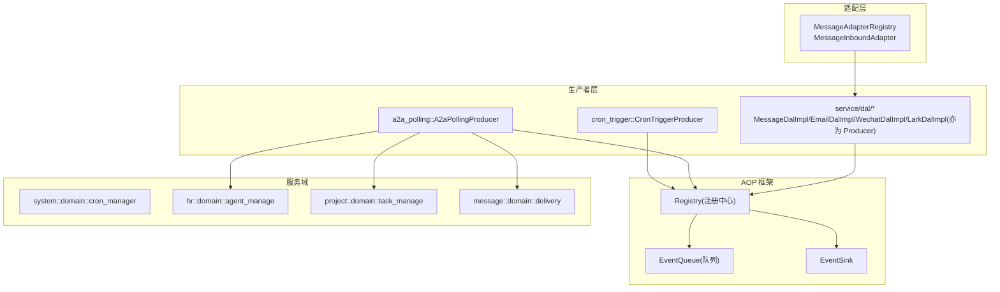
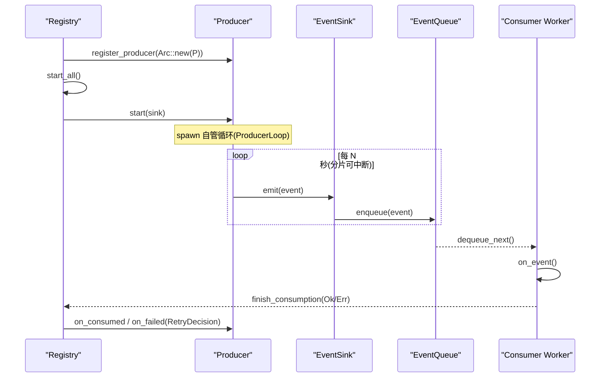
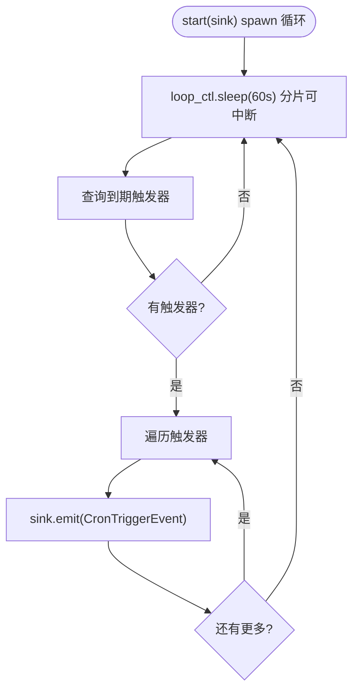
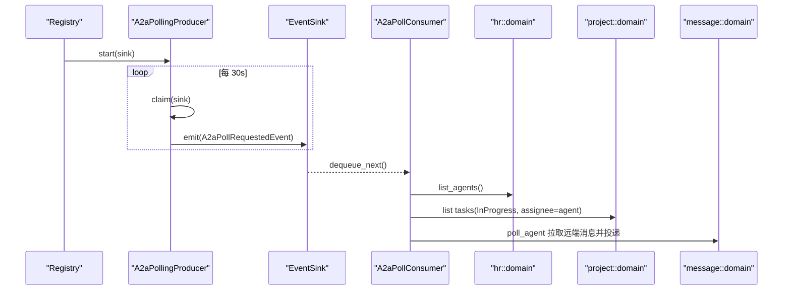
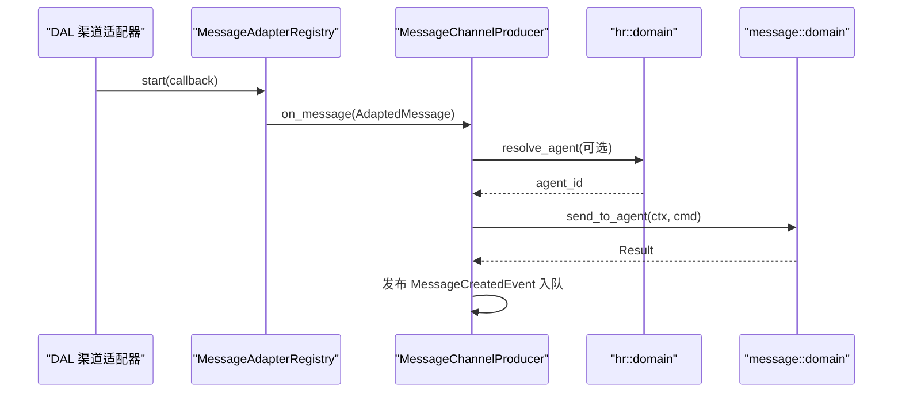
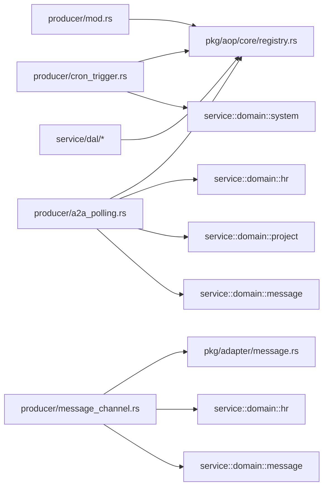

# 生产者机制

<cite>
**本文引用的文件**
- [src/producer/mod.rs](src/producer/mod.rs) — 生产者注册入口（`cron_trigger` / `a2a_polling` / `message_channel`）
- [src/producer/cron_trigger.rs](src/producer/cron_trigger.rs) — `CronTriggerProducer`
- [src/producer/a2a_polling.rs](src/producer/a2a_polling.rs) — `A2aPollingProducer`（`claim` / `ProducerLoop`）
- [src/producer/message_channel.rs](src/producer/message_channel.rs) — 入站适配回调 `MessageChannelProducer`
- [src/pkg/aop/mod.rs](src/pkg/aop/mod.rs) — `init_all` / `publish`
- [src/pkg/aop/core/producer.rs](src/pkg/aop/core/producer.rs) — `Producer` trait + `ProducerLoop` + `RetryDecision`
- [src/pkg/aop/core/event_sink.rs](src/pkg/aop/core/event_sink.rs) — `EventSink`
- [src/pkg/aop/core/registry.rs](src/pkg/aop/core/registry.rs) — `register_producer` / `start_all` / `finish_consumption`
- [src/models/events/a2a_poll.rs](src/models/events/a2a_poll.rs) — `A2aPollRequestedEvent`
- [src/consumer/a2a_poll.rs](src/consumer/a2a_poll.rs) — `A2aPollConsumer`（执行真实远端抓取）
- [src/service/dal/message.rs](src/service/dal/message.rs) — `MessageDalImpl`（亦为 `message.created` 生产者）
- [src/service/dal/email/impl.rs](src/service/dal/email/impl.rs) — `EmailDalImpl`（亦为 `email.inbound.message` 生产者）
- [src/service/dal/wechat/impl.rs](src/service/dal/wechat/impl.rs) — `WechatDalImpl`
- [src/service/dal/lark/impl.rs](src/service/dal/lark/impl.rs) — `LarkDalImpl`
- [src/service/dal/inbound_retry.rs](src/service/dal/inbound_retry.rs) — 入站失败决策 `decide` / `MAX_ATTEMPTS`
</cite>

## 更新摘要
**变更内容**
- 生产者契约改形：删除 `register()` / `poll()` / `poll_interval_secs`；新增 `start(sink)` / `stop()` 与 `EventSink`；`ProducerLoop` 自管可中断循环（250ms 分片），Registry 不再定时调用 `poll`
- `RetryDecision { Retry, Discard }`：框架不设 `max_retry`、无死信，重试决策权下沉生产者
- DAL-as-Producer：`message.created` / `cron.trigger` / `email` / `wechat` / `lark` 入站由对应 DAL / 生产者对象自身实现 `Producer` 收尾（`on_consumed` / `on_failed`）
- A2A 拆分：`A2aPollingProducer::claim(sink)` 只 emit `A2aPollRequestedEvent`，真实远端抓取由 `A2aPollConsumer` 完成
- 启动校验：声明 `notify_producer` 的 topic 缺 producer 时 `start_all` 直接返回 `Err`

## 目录
1. [简介](#简介)
2. [项目结构](#项目结构)
3. [核心组件](#核心组件)
4. [架构总览](#架构总览)
5. [详细组件分析](#详细组件分析)
6. [依赖关系分析](#依赖关系分析)
7. [性能与并发特性](#性能与并发特性)
8. [故障排查指南](#故障排查指南)
9. [错误处理、重试与失败恢复](#错误处理重试与失败恢复)
10. [监控、日志与调试](#监控日志与调试)
11. [自定义生产者开发指南](#自定义生产者开发指南)
12. [生产者的协作与资源竞争处理](#生产者的协作与资源竞争处理)
13. [结论](#结论)

## 简介
本文件系统化梳理 AOP 生产者机制，覆盖抽象设计、实现模式、内置生产者（定时触发生产者、A2A 轮询生产者、各入站通道的 DAL 生产者、入站适配回调）、配置项、触发条件与执行策略、错误处理与重试、监控日志与调试、以及自定义生产者开发与集成方案。文档严格遵循四层单向调用原则：Adapter（HTTP Handler / 公开回调 Handler / AOP Producer）→ Domain → DAL → DAO，禁止跨层或同层互调；通用基础设施统一在 pkg 层，业务逻辑在 service/domain 层。

## 项目结构
生产者位于 `src/producer` 模块，通过 AOP 注册中心统一管理生命周期（注册为 `Arc<dyn Producer>`，由 `start_all` 编排启停）；消息入站适配器位于 `pkg/adapter/message`，作为中台解耦各渠道 DAL 与 producer 层。DAL 侧对象（如 `MessageDalImpl`）在 `dal::init_all` 中同时 coerce 为 `Arc<dyn Producer>` 注册，实现「DAL-as-Producer」归属模型。

图表来源
- [src/producer/mod.rs](src/producer/mod.rs)
- [src/pkg/aop/core/registry.rs](src/pkg/aop/core/registry.rs)
- [src/pkg/adapter/message.rs](src/pkg/adapter/message.rs)

章节来源
- [src/producer/mod.rs](src/producer/mod.rs)
- [src/pkg/aop/mod.rs](src/pkg/aop/mod.rs)
- [src/pkg/adapter/message.rs](src/pkg/adapter/message.rs)

## 核心组件
- 生产者抽象 Producer：定义 `name()` / `topic()` / `on_consumed(ctx, event)` / `on_failed(ctx, event, err) -> RetryDecision` / `start(sink)` / `stop()`。不再有 `register()` / `poll()` / `poll_interval_secs`。
- 事件汇 EventSink：预绑定 `producer.topic()`，`emit` 校验 `event.kind() == topic`（「1 producer : 1 topic」强制点）；生产者通过 `sink.emit` 投递。
- 可中断循环 ProducerLoop：`AtomicBool` + 250ms 分片 sleep；`start` 中 spawn 循环并立即返回，`stop` 置位后下一次分片 `sleep` 返回 `false`，loop 退出。
- 注册中心 Registry：集中管理消费者与生产者（按 topic 索引），负责事件入队、异步消费调度、指标埋点、`start_all` / `shutdown_all` 编排与 `finish_consumption` 单点收尾反查。
- 消息适配器中台 MessageAdapterRegistry：统一启停各渠道的入站监听，将适配后的消息通过回调（如 `MessageChannelProducer`）投递到事件链路。

章节来源
- [src/pkg/aop/core/producer.rs](src/pkg/aop/core/producer.rs)
- [src/pkg/aop/core/event_sink.rs](src/pkg/aop/core/event_sink.rs)
- [src/pkg/aop/core/registry.rs](src/pkg/aop/core/registry.rs)
- [src/pkg/adapter/message.rs](src/pkg/adapter/message.rs)

## 架构总览
AOP 生产者机制以「事件驱动 + 自管循环 / 回调」模式运行：
- 循环型生产者：在 `start(sink)` 内 spawn 循环，用 `ProducerLoop` 的 250ms 分片可中断 `sleep` 控制节奏（如 `CronTriggerProducer` 60s、`A2aPollingProducer` 30s）；每次循环通过 `sink.emit` 投递事件。
- 回调型生产者：由 `start` 启动外部监听（如各渠道 DAL 的入站适配器），收到事件后经回调构造 `EventSink` 投递。
- 收尾反查：消费者处理结束统一走 `finish_consumption`，按 topic 反查 `producer_for(kind)` → 回调 `on_consumed` / `on_failed`，由 `RetryDecision` 决定重试或丢弃。

图表来源
- [src/pkg/aop/core/registry.rs](src/pkg/aop/core/registry.rs)
- [src/pkg/aop/core/producer.rs](src/pkg/aop/core/producer.rs)
- [src/pkg/aop/core/event_sink.rs](src/pkg/aop/core/event_sink.rs)

## 详细组件分析

### 定时触发生产者 CronTriggerProducer
- 职责：周期性查询即将触发的定时任务，构造 `CronTriggerEvent` 并发布到 AOP 事件中心；`executed_at` 取事件 `created_at`（≈触发时刻），避免被消费耗时越拖越后。
- 触发条件：当前时间戳与 cron_manager 的 due triggers 列表匹配，每次最多拉取 100 条。
- 执行策略：循环型，`start(sink)` 内 spawn 循环，`loop_ctl.sleep(60s)`（ProducerLoop 250ms 分片）；每条触发记录生成独立 `event_id`。
- 收尾：`mark_trigger_executed` 已移入 `CronTriggerProducer::on_consumed`；`on_failed` 恒返回 `Retry`（Discard 会 ack 且仍回调 → 反把未执行标成「已执行」）。消费者 `CronTriggerConsumer` 订阅 `cron.trigger` 且声明 `notify_producer()`。

图表来源
- [src/producer/cron_trigger.rs](src/producer/cron_trigger.rs)

章节来源
- [src/producer/cron_trigger.rs](src/producer/cron_trigger.rs)
- [src/consumer/scheduler.rs](src/consumer/scheduler.rs)

### A2A 轮询生产者 A2aPollingProducer
- 职责：`claim(sink)` 只 `list_agents` → 过滤 remote → 逐条 `sink.emit(A2aPollRequestedEvent::new(agent_id, tick_at))`；**不再直接调 domain 做网络重活**。
- 触发条件：存在 remote agent 且其关联任务处于 InProgress；`A2aPollRequestedEvent` 的 `order_key = agent_id`，`id = "{agent_id}-{tick_at}"`。
- 执行策略：循环型，`start(sink)` spawn 循环，`loop_ctl.sleep(30s)`。
- 消费侧：新消费者 `A2aPollConsumer`（Async + `.ordered()`）的 `on_event` → `poll_agent(ctx, &agent_id)` 完成原 tick 的远端抓取 / 消息投递 / `a2a_synced_msgs` tag 推进 / `transition_status`。`a2a.poll.requested` 无 producer（不声明 `notify_producer`），进度账记在 task tag 里。

图表来源
- [src/producer/a2a_polling.rs](src/producer/a2a_polling.rs)
- [src/consumer/a2a_poll.rs](src/consumer/a2a_poll.rs)

章节来源
- [src/producer/a2a_polling.rs](src/producer/a2a_polling.rs)
- [src/consumer/a2a_poll.rs](src/consumer/a2a_poll.rs)
- [src/models/events/a2a_poll.rs](src/models/events/a2a_poll.rs)

### DAL 生产者（DAL-as-Producer）
- 归属：`message.created` → `MessageDalImpl`（`src/service/dal/message.rs`）；`email.inbound.message` → `EmailDalImpl`；`wechat.inbound.message` → `WechatDalImpl`；`lark.inbound.message` → `LarkDalImpl`。各对象在同一 `Arc` 上分别 coerce 为 `Arc<dyn XxxDal>` 与 `Arc<dyn Producer>` 注册（DAL trait 无 Producer supertrait，避免测试桩被迫实现）。
- 收尾：`on_consumed` 完成业务状态落库（如 `MessageDalImpl` 将 `messages.status` 置 `Processed`、`advance_inbound_cursor` 推进游标）；`on_failed` 经 `inbound_retry::decide(err, attempt)` 收敛（`MAX_ATTEMPTS=8`，永久错误码 → `Discard`，否则 `Retry`）。
- 启动：`dal::init_all()` 注册 4 个 DAL 生产者，早于 `consumer::init()` 与 `aop::init_all()`。

章节来源
- [src/service/dal/message.rs](src/service/dal/message.rs)
- [src/service/dal/email/impl.rs](src/service/dal/email/impl.rs)
- [src/service/dal/wechat/impl.rs](src/service/dal/wechat/impl.rs)
- [src/service/dal/lark/impl.rs](src/service/dal/lark/impl.rs)
- [src/service/dal/inbound_retry.rs](src/service/dal/inbound_retry.rs)

### 入站适配回调 MessageChannelProducer
- 职责：接收来自各渠道的消息（经 `MessageAdapterRegistry` 适配），构建 `RequestContext`，解析目标 Agent，调用 `message_domain.delivery.send_to_agent` 投递；它不是注册到 Registry 的 `Producer` trait 实现，而是 `MessageAdapterCallback`，负责把入站消息发布为 AOP 事件（如 `MessageCreatedEvent`），后续的 `message.created` 收尾由 `MessageDalImpl` 完成。
- 触发条件：任一渠道适配器启动并收到消息时回调 `on_message`。
- 执行策略：回调型，由 `start_all` 启动所有适配器；`on_message` 内完成路由与投递。
- 错误处理：无法解析目标 Agent 时记录警告并返回；投递失败包装为内部错误并返回。

图表来源
- [src/producer/message_channel.rs](src/producer/message_channel.rs)
- [src/pkg/adapter/message.rs](src/pkg/adapter/message.rs)

章节来源
- [src/producer/message_channel.rs](src/producer/message_channel.rs)
- [src/pkg/adapter/message.rs](src/pkg/adapter/message.rs)

## 依赖关系分析
- 生产者与 AOP 框架：所有注册型生产者通过 `Registry::register_producer` 注册（同步，topic 冲突报 `Conflict`）；`start_all` 逐个建 `EventSink` 并 `start`。
- 生产者与服务域：CronTriggerProducer 依赖 `system::domain::cron_manager`；A2aPollingProducer 依赖 `hr` / `project` / `message` 领域；DAL 生产者依赖各自 DAO；MessageChannelProducer 依赖 `hr` / `message` 领域。
- 消息适配器中台：`producer/message_channel` 仅依赖 `pkg/adapter/message`，不感知具体渠道 DAL，新增渠道只需实现 `MessageInboundAdapter` 并注册。

图表来源
- [src/producer/mod.rs](src/producer/mod.rs)
- [src/pkg/aop/core/registry.rs](src/pkg/aop/core/registry.rs)
- [src/pkg/adapter/message.rs](src/pkg/adapter/message.rs)

章节来源
- [src/producer/mod.rs](src/producer/mod.rs)
- [src/pkg/aop/core/registry.rs](src/pkg/aop/core/registry.rs)

## 性能与并发特性
- 轮询间隔：CronTriggerProducer 60s，A2aPollingProducer 30s，由 `ProducerLoop` 的 250ms 分片可中断 sleep 控制，stop 立即生效。
- 批量限制：CronTriggerProducer 单次最多拉取 100 条触发器；A2aPollingProducer 单次最多处理 100 个任务，避免一次性压力过大。
- 消费者并发：Registry.start_all 会为每个异步消费者启动多个 worker（concurrency 可配置），空队列/错误退避由框架控制。
- 内存队列：异步消费者使用 InMemoryEventQueue，支持 ack/nack 与统计查询；`EventRef.attempt` 累计重试次数。

章节来源
- [src/producer/cron_trigger.rs](src/producer/cron_trigger.rs)
- [src/producer/a2a_polling.rs](src/producer/a2a_polling.rs)
- [src/pkg/aop/core/registry.rs](src/pkg/aop/core/registry.rs)
- [src/pkg/aop/queue/in_memory.rs](src/pkg/aop/queue/in_memory.rs)

## 故障排查指南
- 生产者未生效：
  - 检查是否在 `producer::init` / `dal::init_all` 中注册了生产者（`register_producer`）。
  - 确认 `aop::init_all()` 已调用，且 `start_all` 未因「声明 `notify_producer` 的 topic 缺 producer」返回 `Err`。
- 轮询未触发：
  - 确认 `ProducerLoop` 已 spawn（`start` 立即返回，循环在后台）；查看日志中生产者启动信息。
  - 用 `carried_ctx` 链路日志核对事件是否成功 `sink.emit`。
- 无限重投（Nack 风暴）：
  - 消费返回 `Err` 且无 producer 时，`delivery_of` 兜底 `Nack` → 无限重投；入站生产者 `on_failed` 应经 `inbound_retry::decide`（`MAX_ATTEMPTS=8`）收敛为 `Discard`。
- Discard 静默：
  - `Discard` 走 ack 且仍回调 `on_consumed`，打 `on_consume_discarded` 埋点（不计入失败率）；排查丢弃原因看 error 日志与丢弃埋点。
- 事件堆积：
  - 使用 `queue_stats` 与 `query_events` 检查队列长度与事件详情。
  - 调整消费者 `concurrency`、空队列 / 错误退避参数。
- A2A 同步失败：
  - 检查远端 endpoint、auth_token、timeout_secs；核对 `A2aPollConsumer` 的远端 fetch 与 task tag 推进。
- 消息投递失败：
  - 检查 `MessageChannelProducer` 的目标 Agent 解析逻辑与 `delivery` 调用结果。

章节来源
- [src/producer/mod.rs](src/producer/mod.rs)
- [src/pkg/aop/core/registry.rs](src/pkg/aop/core/registry.rs)
- [src/producer/a2a_polling.rs](src/producer/a2a_polling.rs)
- [src/producer/message_channel.rs](src/producer/message_channel.rs)

## 错误处理、重试与失败恢复
- 生产者侧：
  - CronTriggerProducer：`registry` 未注册返回错误；无触发任务直接返回；`mark_trigger_executed` 失败记录日志。`on_failed` 恒 `Retry`。
  - A2aPollingProducer：`claim` 中远端 `list_agents` 失败记录警告并跳过；`poll_agent` 失败由 `A2aPollConsumer` 侧经 `on_failed` 决策。
  - DAL 生产者：`on_failed` 经 `inbound_retry::decide(err, attempt)`；永久错误码 → `Discard`，否则 `Retry`；`attempt >= MAX_ATTEMPTS(8)` 兜底 `Discard`。
  - MessageChannelProducer：无法解析目标 Agent 记录警告并返回；投递失败包装为内部错误。
- 消费者侧（框架）：
  - `on_event` 成功：`finish_consumption` 反查 producer 回调 `on_consumed` → `ack`。
  - `on_event` 失败：反查 producer 回调 `on_failed` → `RetryDecision::Retry` 走 `Nack` 重投，`Discard` 走 `ack` + 仍回调 `on_consumed` + 丢弃埋点。
  - 无 producer 的 `Err`：`delivery_of` 兜底 `Nack`（无限重投）。

章节来源
- [src/producer/cron_trigger.rs](src/producer/cron_trigger.rs)
- [src/producer/a2a_polling.rs](src/producer/a2a_polling.rs)
- [src/service/dal/message.rs](src/service/dal/message.rs)
- [src/service/dal/inbound_retry.rs](src/service/dal/inbound_retry.rs)
- [src/pkg/aop/core/registry.rs](src/pkg/aop/core/registry.rs)

## 监控、日志与调试
- 指标埋点：Registry 在 publish、consume_start、consume_success、consume_failure 处调用 `AopMetricsHook`（可注入业务层实现）。
- 队列统计：提供 `all_queue_stats`、`queue_stats`、`query_events`、`get_event` 等接口用于诊断。
- 日志：大量 `sys_info` / `sys_warn` / `sys_error` / `log_debug` 输出，便于定位问题（含 `carried_ctx` 还原的 `log_id`）。
- 调试建议：
  - 查看队列长度与事件详情，确认是否堆积或卡死。
  - 检查消费者 worker 数量与退避参数，避免 CPU 自旋或延迟过高。
  - 针对 A2A 场景，核对远端 endpoint、auth_token、timeout_secs 配置。

章节来源
- [src/pkg/aop/core/registry.rs](src/pkg/aop/core/registry.rs)
- [src/consumer/aop_stats_hook.rs](src/consumer/aop_stats_hook.rs)
- [src/pkg/aop/core/metrics_hook.rs](src/pkg/aop/core/metrics_hook.rs)

## 自定义生产者开发指南
- 实现 Producer trait：
  - `name()`：唯一标识。
  - `topic()`：本生产者负责的 `EventTopic`（1 producer : 1 topic）。
  - `start(sink)`：spawn 自管循环（用 `ProducerLoop` 的 `loop_ctl.sleep(d)` 分片可中断 sleep）后立即返回；循环内通过 `sink.emit(event)` 投递。
  - `stop()`：`self.loop_ctl.stop()` 并 `await` 保存的 `JoinHandle`。
  - `on_consumed` / `on_failed`：收尾回调；`on_failed` 返回 `RetryDecision { Retry, Discard }`，决策权在你。
- 注册与启动：
  - 在 `producer::init` 或 `dal::init_all` 中调用 `aop::registry().register_producer(Arc::new(YourProducer))`。
  - 应用启动时调用 `aop::init_all()` 启动所有生产者与消费者 worker。
- 测试方法：
  - 单元测试：模拟 `EventSink` 与下游 domain，验证 `start` 循环与 `emit` 行为、边界条件。
  - 集成测试：使用真实数据库与 mock 外部服务，验证端到端流程。
- 集成方案：
  - 遵循分层：Producer 仅依赖 pkg 与 service/domain，不直接访问 DAO。
  - 使用 `RequestContext::builder()` 构建上下文，确保 `caller_type`、`user_id`、`agent_id`、`task_id` 等字段正确（收尾回调跑在 `carried_ctx` 恢复的 ctx 上，先于 ack，必须幂等）。

章节来源
- [src/pkg/aop/core/producer.rs](src/pkg/aop/core/producer.rs)
- [src/pkg/aop/core/event_sink.rs](src/pkg/aop/core/event_sink.rs)
- [src/producer/mod.rs](src/producer/mod.rs)
- [src/pkg/aop/mod.rs](src/pkg/aop/mod.rs)

## 生产者的协作与资源竞争处理
- 事件去重与顺序：事件 JSON 顶层注入 `event_id`、`order_key`、`priority`、`created_at`、`attempt`，消费者可通过 `order_key` 保证顺序消费；`A2aPollRequestedEvent` 以 `agent_id` 为 `order_key` 且由 `A2aPollConsumer` 声明 `.ordered()`。
- 队列隔离：每个异步消费者拥有独立队列，避免相互干扰。
- 资源竞争：
  - Registry 使用 `RwLock` 保护共享状态，`start_all` 原子标记 `started`，避免重复启动；topic 占位冲突报 `Conflict`（1 topic : 1 producer）。
  - 消息适配器注册中台防止同一渠道类型重复注册，启动失败不影响其他渠道。
- 协作模式：
  - 循环型生产者通过 `sink.emit` 将事件交给消费者处理；回调型生产者通过适配器中台统一接入，producer 专注业务路由与投递。
  - DAL-as-Producer：DAL 对象自身既是数据访问层又是收尾生产者，避免新建独立 producer 类型。

章节来源
- [src/pkg/aop/core/registry.rs](src/pkg/aop/core/registry.rs)
- [src/pkg/adapter/message.rs](src/pkg/adapter/message.rs)

## 结论
AOP 生产者机制通过统一的 `Producer` 抽象与 Registry 编排，实现了循环与回调两种模式的灵活组合，内置定时触发、A2A 轮询与 DAL 入站生产者覆盖了典型的生产场景。`ProducerLoop` 自管可中断循环取代了旧的 Registry 轮询调度，`EventSink` 强制 1 producer : 1 topic，`RetryDecision` 将重试决策权下沉生产者，配合 `finish_consumption` 单点收尾，系统具备良好的可观测性与可维护性。扩展自定义生产者时，遵循分层与接口约定即可无缝集成。
