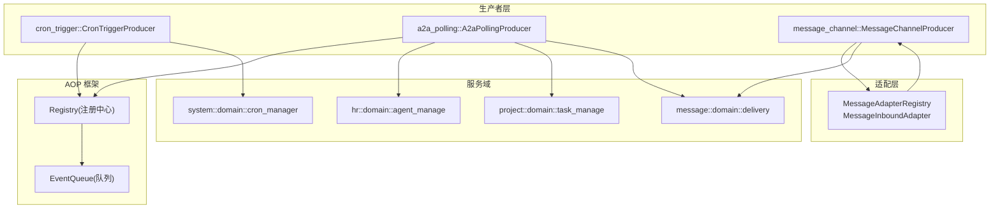
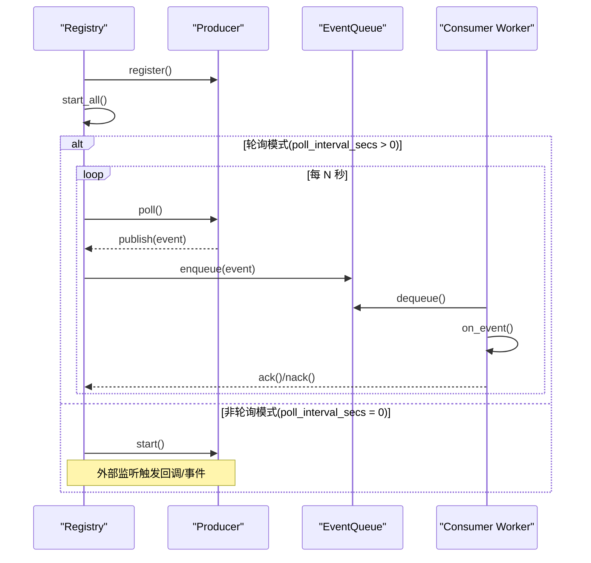
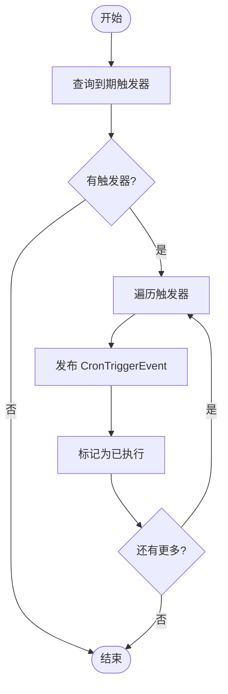
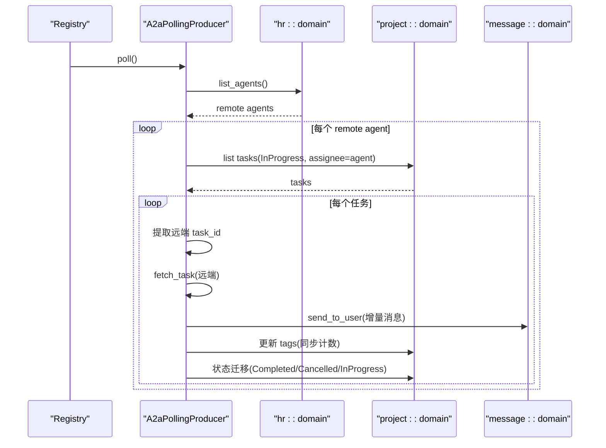
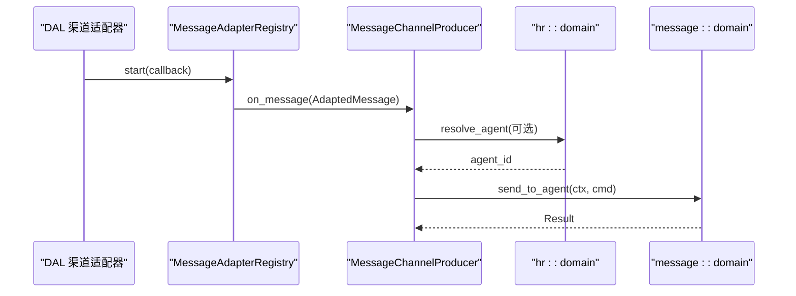
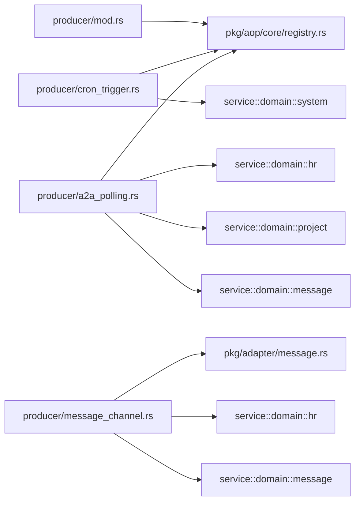

# 生产者机制

<cite>
**本文引用的文件**
- [src/producer/mod.rs](src/producer/mod.rs)
- [src/producer/cron_trigger.rs](src/producer/cron_trigger.rs)
- [src/producer/a2a_polling.rs](src/producer/a2a_polling.rs)
- [src/producer/message_channel.rs](src/producer/message_channel.rs)
- [src/pkg/aop/mod.rs](src/pkg/aop/mod.rs)
- [src/pkg/aop/core/producer.rs](src/pkg/aop/core/producer.rs)
- [src/pkg/aop/core/registry.rs](src/pkg/aop/core/registry.rs)
- [src/pkg/adapter/message.rs](src/pkg/adapter/message.rs)
- [common/src/config.rs](common/src/config.rs)
</cite>

## 目录
1. [简介](#简介)
2. [项目结构](#项目结构)
3. [核心组件](#核心组件)
4. [架构总览](#架构总览)
5. [详细组件分析](#详细组件分析)
6. [依赖关系分析](#依赖关系分析)
7. [性能与并发特性](#性能与并发特性)
8. [错误处理、重试与失败恢复](#错误处理重试与失败恢复)
9. [监控、日志与调试](#监控日志与调试)
10. [自定义生产者开发指南](#自定义生产者开发指南)
11. [生产者的协作与资源竞争处理](#生产者的协作与资源竞争处理)
12. [故障排查清单](#故障排查清单)
13. [结论](#结论)

## 简介
本文件系统化梳理 AOP 生产者机制，覆盖抽象设计、实现模式、内置生产者（消息渠道生产者、定时触发生产者、A2A 轮询生产者）、配置项、触发条件与执行策略、错误处理与重试、监控日志与调试、以及自定义生产者开发与集成方案。文档严格遵循四层单向调用原则：Adapter（HTTP Handler / 公开回调 Handler / AOP Producer）→ Domain → DAL → DAO，禁止跨层或同层互调；通用基础设施统一在 pkg 层，业务逻辑在 service/domain 层。

## 项目结构
生产者位于 src/producer 模块，通过 AOP 注册中心统一管理生命周期与调度；消息入站适配器位于 pkg/adapter/message，作为中台解耦各渠道 DAL 与 producer 层。

图示来源
- [src/producer/mod.rs:9-25](src/producer/mod.rs#L9-L25)
- [src/pkg/aop/core/registry.rs:75-95](src/pkg/aop/core/registry.rs#L75-L95)
- [src/pkg/adapter/message.rs:78-136](src/pkg/adapter/message.rs#L78-L136)

章节来源
- [src/producer/mod.rs:1-27](src/producer/mod.rs#L1-L27)
- [src/pkg/aop/mod.rs:1-61](src/pkg/aop/mod.rs#L1-L61)
- [src/pkg/adapter/message.rs:1-190](src/pkg/adapter/message.rs#L1-L190)

## 核心组件
- 生产者抽象 Producer：定义 name、register、start/stop、poll_interval_secs、poll。返回 0 表示非轮询模式（由 start 自行管理），>0 表示轮询模式（由 Registry 定时调用 poll）。
- 注册中心 Registry：集中管理消费者与生产者，负责事件发布、异步消费调度、队列 ack/nack、指标埋点、启动所有生产者与消费者 worker。
- 消息适配器中台 MessageAdapterRegistry：统一启停各渠道的入站监听，将适配后的消息通过回调投递到 producer 层。

章节来源
- [src/pkg/aop/core/producer.rs:7-35](src/pkg/aop/core/producer.rs#L7-L35)
- [src/pkg/aop/core/registry.rs:11-47](src/pkg/aop/core/registry.rs#L11-L47)
- [src/pkg/adapter/message.rs:36-80](src/pkg/adapter/message.rs#L36-L80)

## 架构总览
AOP 生产者机制以“事件驱动 + 轮询/回调”双模式运行：
- 轮询型生产者：实现 poll_interval_secs > 0，由 Registry 后台任务按间隔调用 poll，适合定时拉取或周期性扫描。
- 回调型生产者：实现 poll_interval_secs = 0，由 start 启动外部监听，收到事件后通过回调或发布事件进入消费链路。

图示来源
- [src/pkg/aop/core/registry.rs:260-487](src/pkg/aop/core/registry.rs#L260-L487)
- [src/pkg/aop/core/producer.rs:7-35](src/pkg/aop/core/producer.rs#L7-L35)

## 详细组件分析

### 定时触发生产者 CronTriggerProducer
- 职责：周期性查询即将触发的定时任务，构造 CronTriggerEvent 并发布到 AOP 事件中心，同时标记已执行。
- 触发条件：当前时间戳与 cron_manager 的 due triggers 列表匹配，每次最多拉取 100 条。
- 执行策略：轮询模式，poll_interval_secs = 60 秒；每条触发记录生成独立 event_id，payload 携带 trigger 信息。
- 错误处理：若 registry 未注册则返回错误；无待触发任务直接返回；mark_trigger_executed 失败会记录日志并继续。

图示来源
- [src/producer/cron_trigger.rs:42-86](src/producer/cron_trigger.rs#L42-L86)

章节来源
- [src/producer/cron_trigger.rs:1-88](src/producer/cron_trigger.rs#L1-L88)

### A2A 轮询生产者 A2aPollingProducer
- 职责：轮询远程 Agent 的任务状态，同步新消息到本地用户，并根据远端状态更新本地任务状态。
- 触发条件：存在 remote agent 且其关联任务处于 InProgress；任务标签包含远端 task_id。
- 执行策略：轮询模式，poll_interval_secs = 30 秒；对每个任务拉取远端消息，增量同步（基于 tags 中的计数），发送消息到用户，更新任务状态。
- 错误处理：远端 fetch_task 失败记录警告并跳过；send_to_user 失败记录警告；更新 tags 或状态失败记录警告但不中断循环。

图示来源
- [src/producer/a2a_polling.rs:60-270](src/producer/a2a_polling.rs#L60-L270)

章节来源
- [src/producer/a2a_polling.rs:1-272](src/producer/a2a_polling.rs#L1-L272)

### 消息渠道生产者 MessageChannelProducer
- 职责：接收来自各渠道的消息（经 MessageAdapterRegistry 适配），构建 RequestContext，解析目标 Agent，调用 message_domain.delivery.send_to_agent 投递。
- 触发条件：任一渠道适配器启动并收到消息时回调 on_message。
- 执行策略：非轮询模式（poll_interval_secs 默认 0），通过 start_all 启动所有适配器；on_message 内完成路由与投递。
- 错误处理：无法解析目标 Agent 时记录警告并返回；投递失败包装为内部错误并返回。

图示来源
- [src/producer/message_channel.rs:25-90](src/producer/message_channel.rs#L25-L90)
- [src/pkg/adapter/message.rs:111-136](src/pkg/adapter/message.rs#L111-L136)

章节来源
- [src/producer/message_channel.rs:1-116](src/producer/message_channel.rs#L1-L116)
- [src/pkg/adapter/message.rs:1-190](src/pkg/adapter/message.rs#L1-L190)

## 依赖关系分析
- 生产者与 AOP 框架：所有生产者通过 Registry.register_producer 注册，start_all 自动启动轮询或回调模式。
- 生产者与服务域：CronTriggerProducer 依赖 system::domain::cron_manager；A2aPollingProducer 依赖 hr/project/message 领域；MessageChannelProducer 依赖 hr/message 领域。
- 消息适配器中台：producer/message_channel 仅依赖 pkg/adapter/message，不感知具体渠道 DAL，新增渠道只需实现 MessageInboundAdapter 并注册。

图示来源
- [src/producer/mod.rs:9-25](src/producer/mod.rs#L9-L25)
- [src/pkg/aop/core/registry.rs:75-95](src/pkg/aop/core/registry.rs#L75-L95)
- [src/pkg/adapter/message.rs:78-136](src/pkg/adapter/message.rs#L78-L136)

章节来源
- [src/producer/mod.rs:1-27](src/producer/mod.rs#L1-L27)
- [src/pkg/aop/core/registry.rs:1-561](src/pkg/aop/core/registry.rs#L1-L561)

## 性能与并发特性
- 轮询间隔：CronTriggerProducer 60s，A2aPollingProducer 30s，可根据负载调整。
- 批量限制：CronTriggerProducer 单次最多拉取 100 条触发器；A2aPollingProducer 单次最多拉取 100 个任务，避免一次性压力过大。
- 消费者并发：Registry.start_all 会为每个异步消费者启动多个 worker（concurrency 可配置），空队列退避 empty_queue_sleep_ms，错误退避 error_retry_sleep_ms。
- 内存队列：异步消费者使用 InMemoryEventQueue，支持 ack/nack 与统计查询。

章节来源
- [src/producer/cron_trigger.rs:38-58](src/producer/cron_trigger.rs#L38-L58)
- [src/producer/a2a_polling.rs:56-92](src/producer/a2a_polling.rs#L56-L92)
- [src/pkg/aop/core/registry.rs:277-449](src/pkg/aop/core/registry.rs#L277-L449)

## 错误处理、重试与失败恢复
- 生产者侧：
  - CronTriggerProducer：registry 未注册返回错误；无触发任务直接返回；mark_trigger_executed 失败记录日志。
  - A2aPollingProducer：远端 fetch_task 失败记录警告并跳过；send_to_user 失败记录警告；更新 tags 或状态失败记录警告。
  - MessageChannelProducer：无法解析目标 Agent 记录警告并返回；投递失败包装为内部错误。
- 消费者侧（Registry）：
  - on_event 成功：记录耗时并 ack，随后 queue.ack 移除事件。
  - on_event 失败：记录耗时与错误字符串，nack 并 queue.nack 重新入队，sleep(error_retry_sleep_ms) 避免紧密自旋。
  - dequeue 失败：sleep(error_retry_sleep_ms)。
  - 空队列：sleep(empty_queue_sleep_ms)。

章节来源
- [src/producer/cron_trigger.rs:42-86](src/producer/cron_trigger.rs#L42-L86)
- [src/producer/a2a_polling.rs:114-216](src/producer/a2a_polling.rs#L114-L216)
- [src/producer/message_channel.rs:40-80](src/producer/message_channel.rs#L40-L80)
- [src/pkg/aop/core/registry.rs:333-443](src/pkg/aop/core/registry.rs#L333-L443)

## 监控、日志与调试
- 指标埋点：Registry 在 publish、consume_start、consume_success、consume_failure 处调用 AopMetricsHook（可注入业务层实现）。
- 队列统计：提供 all_queue_stats、queue_stats、query_events、get_event 等接口用于诊断。
- 日志：大量 sys_info/sys_warn/sys_error/log_debug 输出，便于定位问题。
- 调试建议：
  - 查看队列长度与事件详情，确认是否堆积或卡死。
  - 检查消费者 worker 数量与退避参数，避免 CPU 自旋或延迟过高。
  - 针对 A2A 场景，核对远端 endpoint、auth_token、timeout_secs 配置。

章节来源
- [src/pkg/aop/core/registry.rs:38-47](src/pkg/aop/core/registry.rs#L38-L47)
- [src/pkg/aop/core/registry.rs:500-553](src/pkg/aop/core/registry.rs#L500-L553)
- [src/producer/a2a_polling.rs:98-106](src/producer/a2a_polling.rs#L98-L106)

## 自定义生产者开发指南
- 实现 Producer trait：
  - name：唯一标识。
  - register：保存 Registry 引用以便后续 publish。
  - poll_interval_secs：>0 启用轮询；=0 实现 start/stop 自行管理生命周期。
  - poll：轮询模式下执行一次生产逻辑。
- 注册与启动：
  - 在 producer::init 中调用 aop::registry().register_producer(Arc::new(YourProducer))。
  - 应用启动时调用 aop::init_all() 启动所有生产者与消费者 worker。
- 测试方法：
  - 单元测试：模拟 Registry 与下游 domain，验证 poll 行为与边界条件。
  - 集成测试：使用真实数据库与 mock 外部服务，验证端到端流程。
- 集成方案：
  - 遵循分层：Producer 仅依赖 pkg 与 service/domain，不直接访问 DAO。
  - 使用 RequestContext::new_system() 或 builder 构建上下文，确保 caller_type、user_id、agent_id、task_id 等字段正确。

章节来源
- [src/pkg/aop/core/producer.rs:7-35](src/pkg/aop/core/producer.rs#L7-L35)
- [src/producer/mod.rs:9-25](src/producer/mod.rs#L9-L25)
- [src/pkg/aop/mod.rs:53-61](src/pkg/aop/mod.rs#L53-L61)

## 生产者的协作与资源竞争处理
- 事件去重与顺序：事件 JSON 顶层注入 event_id、order_key、priority、created_at，消费者可通过 order_key 保证顺序消费。
- 队列隔离：每个异步消费者拥有独立队列，避免相互干扰。
- 资源竞争：
  - Registry 使用 RwLock 保护共享状态，start_all 原子标记 started，避免重复启动。
  - 消息适配器注册中台防止同一渠道类型重复注册，启动失败不影响其他渠道。
- 协作模式：
  - 轮询生产者通过 publish 将事件交给消费者处理。
  - 回调型生产者通过适配器中台统一接入，producer 专注业务路由与投递。

章节来源
- [src/pkg/aop/core/registry.rs:97-206](src/pkg/aop/core/registry.rs#L97-L206)
- [src/pkg/adapter/message.rs:92-109](src/pkg/adapter/message.rs#L92-L109)
- [src/pkg/aop/core/registry.rs:260-275](src/pkg/aop/core/registry.rs#L260-L275)

## 故障排查清单
- 生产者未生效：
  - 检查是否在 producer::init 中注册了生产者。
  - 确认 aop::init_all() 已调用。
- 轮询未触发：
  - 核对 poll_interval_secs 设置是否正确。
  - 查看 Registry 日志中 “[xxx] polling producer started, interval: Xs”。
- 事件堆积：
  - 使用 queue_stats 与 query_events 检查队列长度与事件详情。
  - 调整消费者 concurrency、empty_queue_sleep_ms、error_retry_sleep_ms。
- A2A 同步失败：
  - 检查远端 endpoint、auth_token、timeout_secs。
  - 核对任务标签是否包含远端 task_id。
- 消息投递失败：
  - 检查 MessageChannelProducer 的目标 Agent 解析逻辑与 delivery 调用结果。

章节来源
- [src/producer/mod.rs:9-25](src/producer/mod.rs#L9-L25)
- [src/pkg/aop/core/registry.rs:459-484](src/pkg/aop/core/registry.rs#L459-L484)
- [src/pkg/aop/core/registry.rs:500-553](src/pkg/aop/core/registry.rs#L500-L553)
- [src/producer/a2a_polling.rs:98-106](src/producer/a2a_polling.rs#L98-L106)
- [src/producer/message_channel.rs:40-80](src/producer/message_channel.rs#L40-L80)

## 结论
AOP 生产者机制通过统一的 Producer 抽象与 Registry 调度，实现了轮询与回调两种模式的灵活组合，内置定时触发、A2A 轮询与消息渠道生产者覆盖了典型的生产场景。结合队列 ack/nack、指标埋点与丰富的日志，系统具备良好的可观测性与可维护性。扩展自定义生产者时，遵循分层与接口约定即可无缝集成。