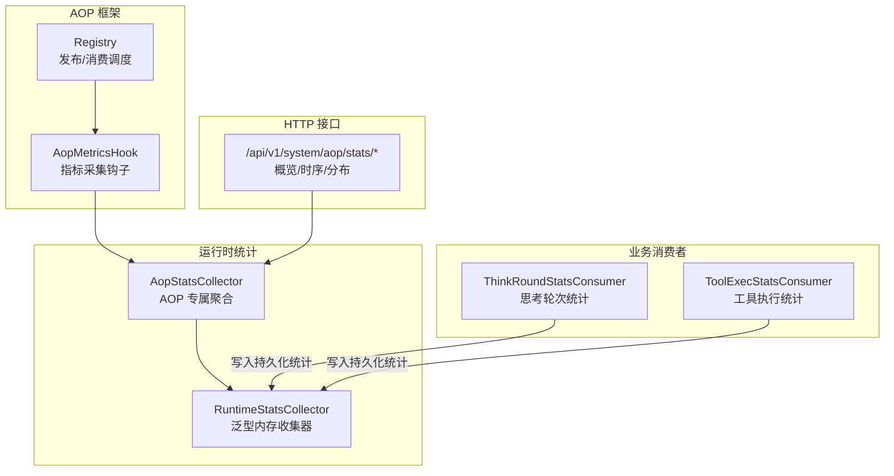
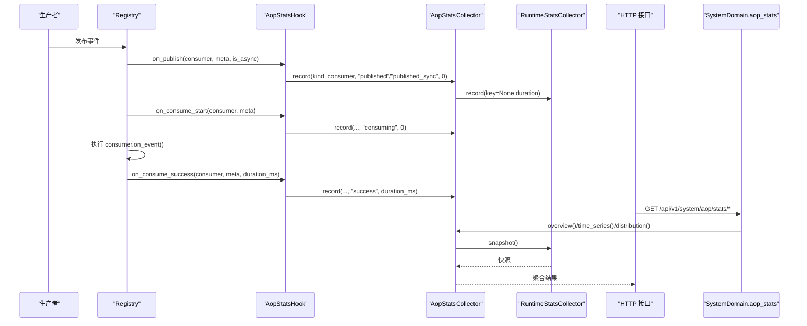
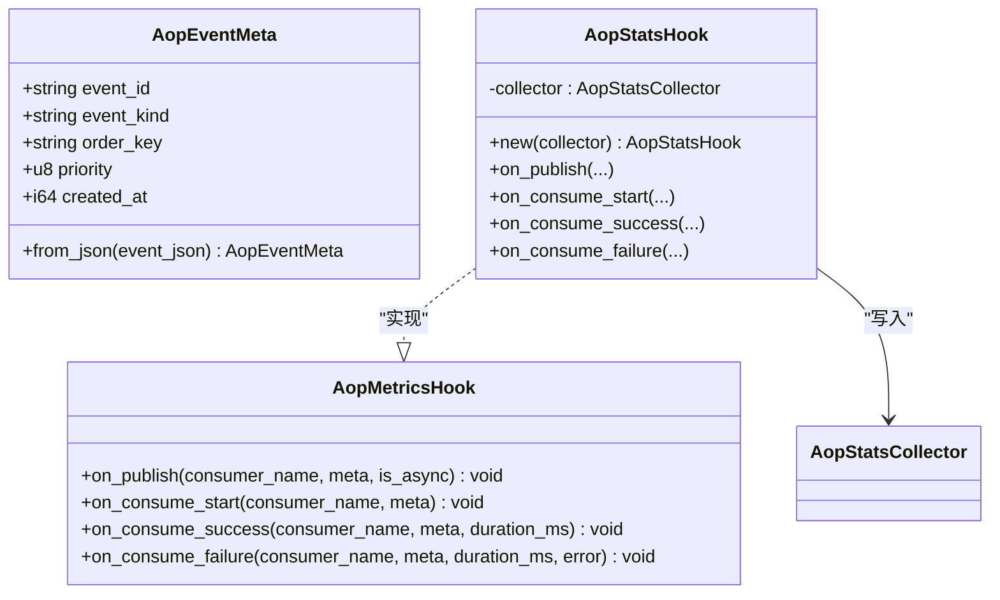
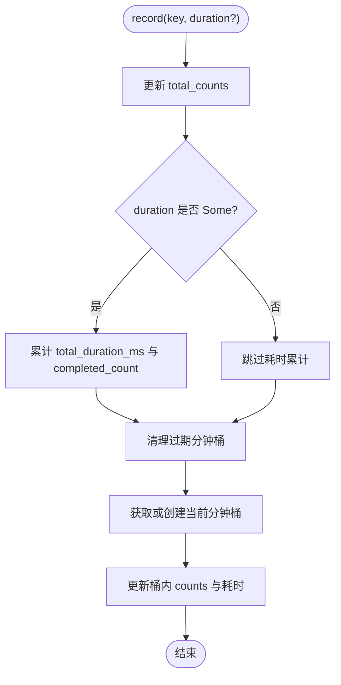
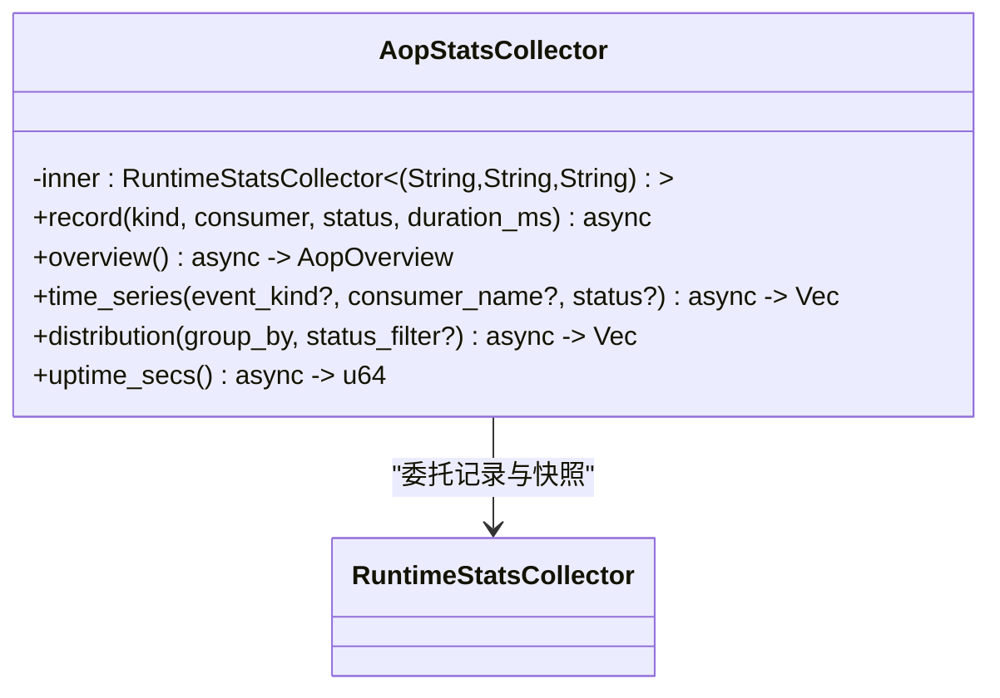
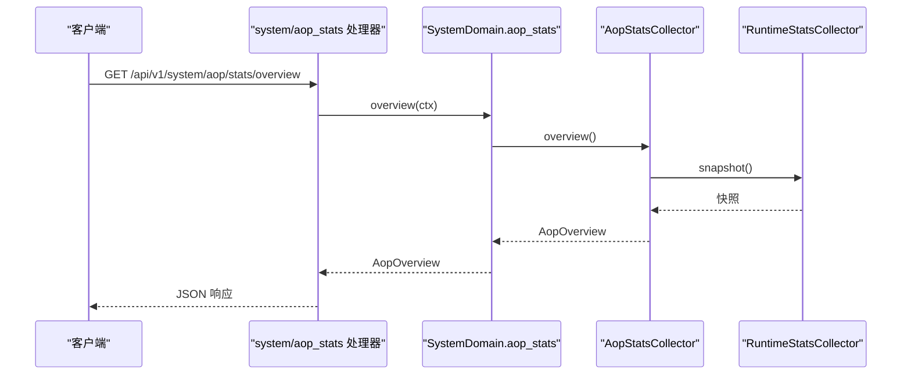
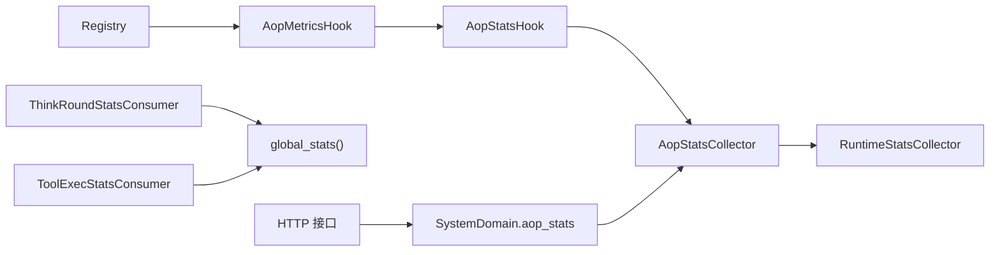

# 监控与统计集成

<cite>
**本文引用的文件**
- [metrics_hook.rs](src/pkg/aop/core/metrics_hook.rs)
- [registry.rs](src/pkg/aop/core/registry.rs)
- [aop_stats_collector.rs](src/consumer/aop_stats_collector.rs)
- [aop_stats_hook.rs](src/consumer/aop_stats_hook.rs)
- [mod.rs（consumer）](src/consumer/mod.rs)
- [runtime/mod.rs](src/pkg/stats/runtime/mod.rs)
- [think_round_stats_consumer.rs](src/consumer/think_round_stats_consumer.rs)
- [tool_exec_stats_consumer.rs](src/consumer/tool_exec_stats_consumer.rs)
- [aop_stats.rs（handlers）](src/handlers/system/aop_stats.rs)
- [aop_stats.rs（domain）](src/service/domain/system/aop_stats.rs)
- [health_metrics.rs](src/handlers/system/health_metrics.rs)
</cite>

## 目录
1. [简介](#简介)
2. [项目结构](#项目结构)
3. [核心组件](#核心组件)
4. [架构总览](#架构总览)
5. [详细组件分析](#详细组件分析)
6. [依赖关系分析](#依赖关系分析)
7. [性能考量](#性能考量)
8. [故障排查指南](#故障排查指南)
9. [结论](#结论)
10. [附录](#附录)

## 简介
本文件系统化说明 AOP 监控与统计集成的设计原理、实现机制与使用方式，覆盖指标采集、性能追踪、异常监控、统计收集器（思考轮次统计、工具执行统计、AOP 指标收集器）、数据流、存储与展示方案、维度设计与聚合查询、告警与阈值配置建议、仪表板使用与自定义指标开发方法，以及导出、分析与报告生成思路。

## 项目结构
本项目采用严格四层单向调用：Adapter（HTTP Handler / AOP Producer）→ Domain → DAL → DAO；通用基础设施统一在 pkg 层，业务消费者在 consumer 层注册到 AOP 事件中心。监控与统计相关的关键位置如下：
- AOP 框架层：定义指标 Hook 并在关键路径埋点
- 运行时统计：提供泛型内存收集器，供 AOP 等场景复用
- 业务消费者：订阅 AOP 事件并写入持久化统计或内存统计
- HTTP 接口：暴露 AOP 实时统计查询端点

图表来源
- [metrics_hook.rs:1-90](src/pkg/aop/core/metrics_hook.rs#L1-L90)
- [registry.rs:44-73](src/pkg/aop/core/registry.rs#L44-L73)
- [aop_stats_collector.rs:1-307](src/consumer/aop_stats_collector.rs#L1-L307)
- [runtime/mod.rs:1-378](src/pkg/stats/runtime/mod.rs#L1-L378)
- [aop_stats.rs（handlers）:1-73](src/handlers/system/aop_stats.rs#L1-L73)

章节来源
- [mod.rs（consumer）:1-42](src/consumer/mod.rs#L1-L42)
- [aop_stats.rs（handlers）:1-73](src/handlers/system/aop_stats.rs#L1-L73)

## 核心组件
- AopMetricsHook：AOP 框架的指标采集钩子，定义 publish/start/success/failure 四个回调，默认空实现零开销
- Registry：在 publish 和 worker 消费路径中触发 Hook，注入元信息并记录耗时
- RuntimeStatsCollector：泛型内存统计收集器，维护全量计数、滑动窗口分钟桶、累计耗时与运行时长
- AopStatsCollector：基于 RuntimeStatsCollector 的 AOP 专用聚合，提供 overview/time_series/distribution/uptime_secs
- AopStatsHook：将 AOP 事件生命周期映射为 (kind, consumer, status) 三维键，异步写入收集器
- ThinkRoundStatsConsumer：订阅 agent.think.round 事件，写入持久化模型调用统计
- ToolExecStatsConsumer：订阅 agent.tool.executed 事件，写入持久化工具调用统计
- SystemDomain AopStats：通过 domain().aop_stats() 暴露内存统计查询能力
- HTTP 接口：/api/v1/system/aop/stats/{overview,time-series,distribution}

章节来源
- [metrics_hook.rs:1-90](src/pkg/aop/core/metrics_hook.rs#L1-L90)
- [registry.rs:44-73](src/pkg/aop/core/registry.rs#L44-L73)
- [runtime/mod.rs:1-378](src/pkg/stats/runtime/mod.rs#L1-L378)
- [aop_stats_collector.rs:1-307](src/consumer/aop_stats_collector.rs#L1-L307)
- [aop_stats_hook.rs:1-118](src/consumer/aop_stats_hook.rs#L1-L118)
- [think_round_stats_consumer.rs:1-73](src/consumer/think_round_stats_consumer.rs#L1-L73)
- [tool_exec_stats_consumer.rs:1-73](src/consumer/tool_exec_stats_consumer.rs#L1-L73)
- [aop_stats.rs（domain）:1-53](src/service/domain/system/aop_stats.rs#L1-L53)
- [aop_stats.rs（handlers）:1-73](src/handlers/system/aop_stats.rs#L1-L73)

## 架构总览
AOP 监控与统计由“框架埋点 + 业务收集 + 内存聚合 + HTTP 查询”构成闭环：
- 框架埋点：Registry 在事件分发与消费时调用 AopMetricsHook
- 业务收集：AopStatsHook 将事件转换为 (kind, consumer, status) 维度并异步写入 AopStatsCollector
- 内存聚合：AopStatsCollector 基于 RuntimeStatsCollector 维护滑动窗口与全局计数
- HTTP 查询：SystemDomain 暴露 aop_stats 能力，Handler 直接返回内存快照

图表来源
- [registry.rs:44-73](src/pkg/aop/core/registry.rs#L44-L73)
- [aop_stats_hook.rs:1-118](src/consumer/aop_stats_hook.rs#L1-L118)
- [aop_stats_collector.rs:1-307](src/consumer/aop_stats_collector.rs#L1-L307)
- [runtime/mod.rs:1-378](src/pkg/stats/runtime/mod.rs#L1-L378)
- [aop_stats.rs（handlers）:1-73](src/handlers/system/aop_stats.rs#L1-L73)
- [aop_stats.rs（domain）:1-53](src/service/domain/system/aop_stats.rs#L1-L53)

## 详细组件分析

### AOP 指标采集钩子（AopMetricsHook）
- 职责：定义事件生命周期的四个回调，默认空实现保证未注入时无开销
- 元信息：从 event_json 顶层提取 event_id/kind/order_key/priority/created_at
- 埋点位置：Registry 在 publish 与 worker 消费路径中调用

图表来源
- [metrics_hook.rs:1-90](src/pkg/aop/core/metrics_hook.rs#L1-L90)
- [aop_stats_hook.rs:1-118](src/consumer/aop_stats_hook.rs#L1-L118)

章节来源
- [metrics_hook.rs:1-90](src/pkg/aop/core/metrics_hook.rs#L1-L90)
- [registry.rs:44-73](src/pkg/aop/core/registry.rs#L44-L73)

### 运行时统计收集器（RuntimeStatsCollector）
- 维度键：任意满足 Hash+Eq+Clone+Send+Sync 的类型，AOP 使用三元组 (kind, consumer, status)
- 数据结构：
  - total_counts：全生命周期累计计数
  - buckets：按分钟对齐的滑动窗口（默认 60 分钟），每个桶包含 counts、累计耗时、完成数
  - total_duration_ms / total_completed：用于计算平均耗时
  - started_at：启动时间，用于 uptime_secs
- 操作：record(key, duration?)、snapshot()、uptime_secs()

图表来源
- [runtime/mod.rs:1-378](src/pkg/stats/runtime/mod.rs#L1-L378)

章节来源
- [runtime/mod.rs:1-378](src/pkg/stats/runtime/mod.rs#L1-L378)

### AOP 统计收集器（AopStatsCollector）
- 基于 RuntimeStatsCollector，封装 AOP 专属聚合：
  - overview：汇总 published/published_sync、consumed(success+failed)、avg_duration_ms
  - time_series：按分钟桶聚合，支持 event_kind/consumer_name/status 过滤
  - distribution：按 consumer/status/kind 分组，支持 status 过滤
  - uptime_secs：进程运行时长
- 记录规则：success/failed 状态计入耗时，其他状态仅计数

图表来源
- [aop_stats_collector.rs:1-307](src/consumer/aop_stats_collector.rs#L1-L307)
- [runtime/mod.rs:1-378](src/pkg/stats/runtime/mod.rs#L1-L378)

章节来源
- [aop_stats_collector.rs:1-307](src/consumer/aop_stats_collector.rs#L1-L307)

### 思考轮次统计消费者（ThinkRoundStatsConsumer）
- 订阅事件：agent.think.round
- 行为：解析 ThinkRoundEvent，若 tokens>0 则构造 ModelCallEvent 并通过 global_stats() 写入持久化统计
- 用途：跟踪每次思考轮次的 token 用量、模型调用上下文

章节来源
- [think_round_stats_consumer.rs:1-73](src/consumer/think_round_stats_consumer.rs#L1-L73)

### 工具执行统计消费者（ToolExecStatsConsumer）
- 订阅事件：agent.tool.executed
- 行为：根据 entry.status 判断 success/failed，构造 ToolCallEvent 并通过 global_stats() 写入持久化统计
- 用途：跟踪工具调用次数、成功率、耗时、参数/结果长度等

章节来源
- [tool_exec_stats_consumer.rs:1-73](src/consumer/tool_exec_stats_consumer.rs#L1-L73)

### HTTP 查询接口（AOP 实时统计）
- 端点：
  - GET /api/v1/system/aop/stats/overview
  - GET /api/v1/system/aop/stats/time-series
  - GET /api/v1/system/aop/stats/distribution
- 流程：Handler 调用 domain().aop_stats() 读取内存快照并返回

图表来源
- [aop_stats.rs（handlers）:1-73](src/handlers/system/aop_stats.rs#L1-L73)
- [aop_stats.rs（domain）:1-53](src/service/domain/system/aop_stats.rs#L1-L53)
- [aop_stats_collector.rs:1-307](src/consumer/aop_stats_collector.rs#L1-L307)
- [runtime/mod.rs:1-378](src/pkg/stats/runtime/mod.rs#L1-L378)

章节来源
- [aop_stats.rs（handlers）:1-73](src/handlers/system/aop_stats.rs#L1-L73)
- [aop_stats.rs（domain）:1-53](src/service/domain/system/aop_stats.rs#L1-L53)

## 依赖关系分析
- Registry 依赖 AopMetricsHook（可空），在关键路径触发埋点
- AopStatsHook 依赖 AopStatsCollector，异步写入避免阻塞主流程
- AopStatsCollector 依赖 RuntimeStatsCollector，复用滑动窗口与快照能力
- ThinkRoundStatsConsumer 与 ToolExecStatsConsumer 依赖全局 Stats 单例，写入持久化统计
- HTTP 接口依赖 SystemDomain.aop_stats，直接读取内存统计

图表来源
- [registry.rs:44-73](src/pkg/aop/core/registry.rs#L44-L73)
- [aop_stats_hook.rs:1-118](src/consumer/aop_stats_hook.rs#L1-L118)
- [aop_stats_collector.rs:1-307](src/consumer/aop_stats_collector.rs#L1-L307)
- [runtime/mod.rs:1-378](src/pkg/stats/runtime/mod.rs#L1-L378)
- [think_round_stats_consumer.rs:1-73](src/consumer/think_round_stats_consumer.rs#L1-L73)
- [tool_exec_stats_consumer.rs:1-73](src/consumer/tool_exec_stats_consumer.rs#L1-L73)
- [aop_stats.rs（handlers）:1-73](src/handlers/system/aop_stats.rs#L1-L73)
- [aop_stats.rs（domain）:1-53](src/service/domain/system/aop_stats.rs#L1-L53)

章节来源
- [mod.rs（consumer）:1-42](src/consumer/mod.rs#L1-L42)

## 性能考量
- 零开销默认：AopMetricsHook 默认空实现，未注入时不影响主流程
- 异步写入：AopStatsHook 使用后台任务异步 record，避免阻塞 AOP 分发与消费
- 内存窗口：RuntimeStatsCollector 使用固定大小滑动窗口（60 分钟），自动淘汰旧桶，控制内存占用
- 快照隔离：snapshot 深拷贝，读锁释放后安全处理，避免长时间持锁
- 查询性能：HTTP 接口直接读取内存快照，无 DB 查询，毫秒级响应

[本节为通用指导，不直接分析具体文件]

## 故障排查指南
- 指标缺失：确认 AopStatsHook 已注入 Registry，且 consumer::init 已注册各业务消费者
- 平均耗时异常：检查 success/failed 状态是否正确记录 duration_ms；published/published_sync/consuming 不累计耗时
- 时序数据为空：确认滑动窗口未过期；检查 event_kind/consumer_name/status 过滤条件
- 接口报错：SystemDomain.aop_stats() 未初始化会返回内部错误；确保启动阶段已创建 collector 并注入

章节来源
- [aop_stats.rs（domain）:1-53](src/service/domain/system/aop_stats.rs#L1-L53)
- [aop_stats_collector.rs:1-307](src/consumer/aop_stats_collector.rs#L1-L307)
- [aop_stats_hook.rs:1-118](src/consumer/aop_stats_hook.rs#L1-L118)

## 结论
本方案通过 AOP 框架层的指标钩子与运行时内存收集器，实现了低侵入、高性能的监控与统计能力。结合思考轮次与工具执行的持久化统计，形成“实时内存 + 持久化历史”的双层观测体系。HTTP 接口提供便捷的查询能力，便于前端仪表板与运维看板使用。后续可扩展告警规则、阈值配置与通知机制，并完善导出与分析报表功能。

[本节为总结性内容，不直接分析具体文件]

## 附录

### 监控数据的采集、存储与展示方案
- 采集：
  - AOP 事件生命周期：publish/start/success/failure 通过 AopMetricsHook 捕获
  - 思考轮次：ThinkRoundStatsConsumer 订阅 agent.think.round 写入持久化统计
  - 工具执行：ToolExecStatsConsumer 订阅 agent.tool.executed 写入持久化统计
- 存储：
  - 实时指标：AopStatsCollector 内存存储（重启重置）
  - 历史指标：pkg/stats 持久化（DuckDB），支持复杂查询
- 展示：
  - HTTP 接口：/api/v1/system/aop/stats/* 提供概览、时序、分布
  - 健康指标：/api/v1/system/health/metrics 聚合系统健康视图

章节来源
- [aop_stats_collector.rs:1-307](src/consumer/aop_stats_collector.rs#L1-L307)
- [think_round_stats_consumer.rs:1-73](src/consumer/think_round_stats_consumer.rs#L1-L73)
- [tool_exec_stats_consumer.rs:1-73](src/consumer/tool_exec_stats_consumer.rs#L1-L73)
- [aop_stats.rs（handlers）:1-73](src/handlers/system/aop_stats.rs#L1-L73)
- [health_metrics.rs:1-26](src/handlers/system/health_metrics.rs#L1-L26)

### 性能指标的维度设计、聚合计算与查询接口
- 维度设计：
  - AOP：(event_kind, consumer_name, status)
  - 思考轮次：model_provider/model/tokens_input/output/total
  - 工具执行：tool_id/tool_name/status/duration_ms/args_len/result_len
- 聚合计算：
  - 概览：published/published_sync、consumed(success+failed)、avg_duration_ms
  - 时序：按分钟桶聚合 call_count，支持多维过滤
  - 分布：按 consumer/status/kind 分组，支持 status 过滤
- 查询接口：
  - overview/time-series/distribution 三个端点

章节来源
- [aop_stats_collector.rs:1-307](src/consumer/aop_stats_collector.rs#L1-L307)
- [runtime/mod.rs:1-378](src/pkg/stats/runtime/mod.rs#L1-L378)
- [aop_stats.rs（handlers）:1-73](src/handlers/system/aop_stats.rs#L1-L73)

### 监控告警规则、阈值配置与通知机制（建议）
- 建议规则：
  - 失败率：failed/(success+failed) > 阈值（如 5%）持续 N 分钟
  - 延迟：avg_duration_ms 超过基线（如 p95 超 2x）
  - 吞吐：time-series 连续 M 分钟下降超过 X%
- 阈值配置：
  - 基于环境变量或配置文件，按环境区分（dev/staging/prod）
- 通知机制：
  - 通过 webhook/邮件/IM 推送告警
  - 与现有健康指标接口联动，统一告警入口

[本节为通用建议，不直接分析具体文件]

### 监控仪表板使用指南与自定义指标开发方法
- 仪表板使用：
  - 概览：查看总发布/消费/成功/失败与平均耗时
  - 时序：观察最近 60 分钟趋势，支持按 kind/consumer/status 过滤
  - 分布：按 consumer/status/kind 查看热点与异常
- 自定义指标：
  - 新增 AopMetricsHook 实现，记录业务维度
  - 扩展 AopStatsCollector 的聚合逻辑（如需新视图）
  - 新增 HTTP 接口暴露新指标

[本节为通用指导，不直接分析具体文件]

### 监控数据的导出、分析与报告生成功能（建议）
- 导出：
  - 定时导出内存快照到文件或对象存储（CSV/JSON）
  - 持久化统计通过 SQL 导出（DuckDB）
- 分析：
  - 离线分析失败根因、慢调用定位
  - 对比不同版本/环境的指标变化
- 报告：
  - 自动生成日报/周报（成功率、延迟、吞吐）
  - 与变更日志关联，辅助复盘

[本节为通用建议，不直接分析具体文件]