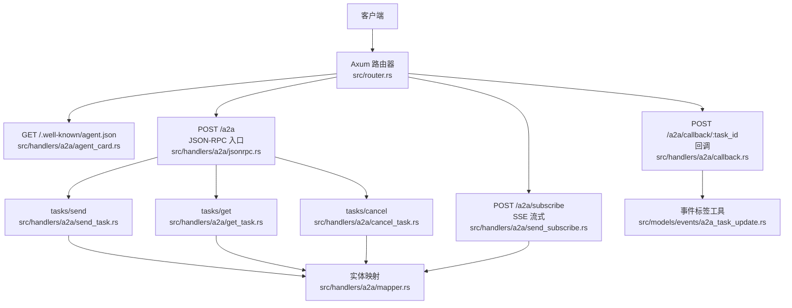
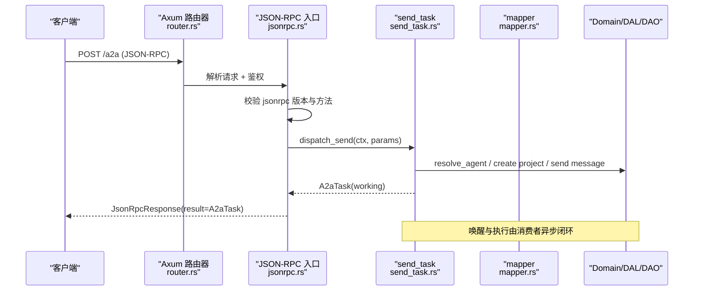
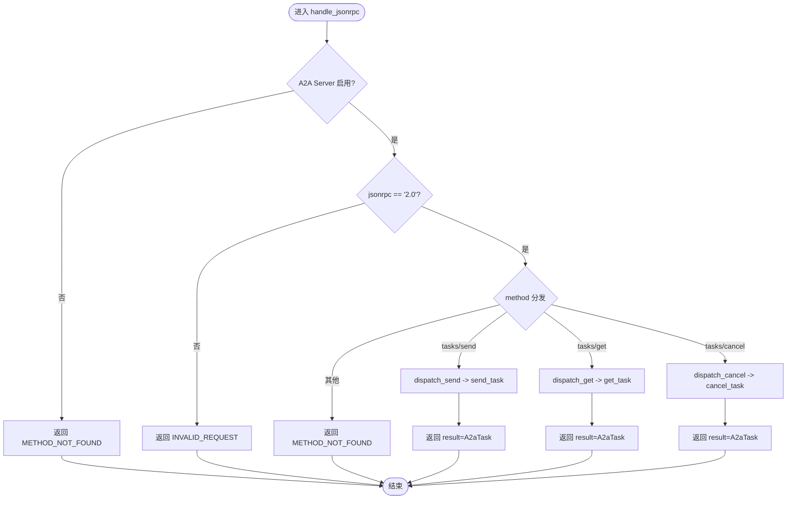
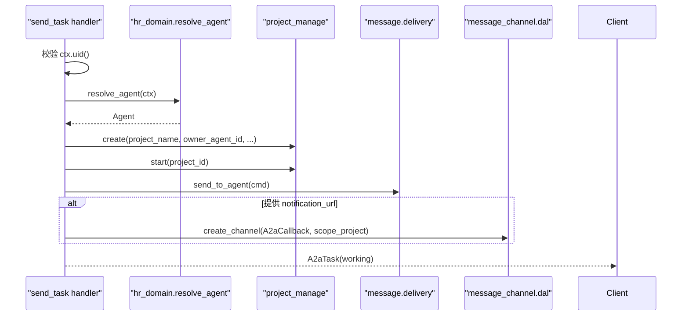
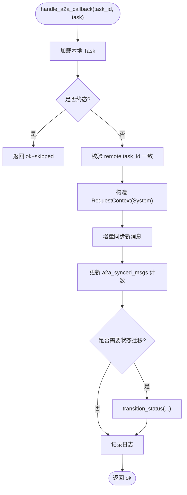
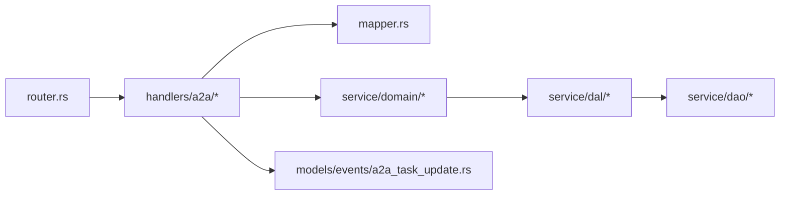

# A2A协议处理器

<cite>
**本文引用的文件**
- [src/handlers/a2a/mod.rs](src/handlers/a2a/mod.rs)
- [src/handlers/a2a/jsonrpc.rs](src/handlers/a2a/jsonrpc.rs)
- [src/handlers/a2a/agent_card.rs](src/handlers/a2a/agent_card.rs)
- [src/handlers/a2a/send_task.rs](src/handlers/a2a/send_task.rs)
- [src/handlers/a2a/get_task.rs](src/handlers/a2a/get_task.rs)
- [src/handlers/a2a/cancel_task.rs](src/handlers/a2a/cancel_task.rs)
- [src/handlers/a2a/send_subscribe.rs](src/handlers/a2a/send_subscribe.rs)
- [src/handlers/a2a/callback.rs](src/handlers/a2a/callback.rs)
- [src/handlers/a2a/mapper.rs](src/handlers/a2a/mapper.rs)
- [common/src/api/a2a.rs](common/src/api/a2a.rs)
- [src/router.rs](src/router.rs)
- [src/models/events/a2a_task_update.rs](src/models/events/a2a_task_update.rs)
- [src/service/dao/agent_runtime/a2a.rs](src/service/dao/agent_runtime/a2a.rs)
- [tests/integration/a2a_flow_test.rs](tests/integration/a2a_flow_test.rs)
- （2026-09-04 清理：superpowers 目录已归档，待 doc-maintainer 跟进）
</cite>

## 目录
1. [简介](#简介)
2. [项目结构](#项目结构)
3. [核心组件](#核心组件)
4. [架构总览](#架构总览)
5. [详细组件分析](#详细组件分析)
6. [依赖关系分析](#依赖关系分析)
7. [性能考量](#性能考量)
8. [故障排查指南](#故障排查指南)
9. [结论](#结论)
10. [附录](#附录)

## 简介
本文件为 A2A（Agent-to-Agent）协议处理器的全面技术文档，聚焦于 HTTP 层对 JSON-RPC 2.0 的实现与编排。内容涵盖 Agent 卡片发现、任务发送、任务查询、回调处理、取消任务、SSE 流式提交等核心能力；解释 JSON-RPC 消息格式、错误码、重试策略、握手流程、任务生命周期管理、状态同步机制以及与外部 Agent 系统的通信方式。同时提供微服务协作最佳实践、调试方法与排障指引。

## 项目结构
A2A 协议处理器位于 handlers/a2a 模块，采用“按功能拆分”的组织方式：每个方法一个文件，mapper 集中负责协议实体与内部实体的转换，jsonrpc 作为统一入口进行方法分发。路由在 router.rs 中注册，公开端点无需 JWT，受保护端点通过 JWT + RequestContext 中间件链获取上下文。

图表来源
- [src/router.rs:12-59](src/router.rs#L12-L59)
- [src/handlers/a2a/jsonrpc.rs:1-94](src/handlers/a2a/jsonrpc.rs#L1-L94)
- [src/handlers/a2a/agent_card.rs:1-37](src/handlers/a2a/agent_card.rs#L1-L37)
- [src/handlers/a2a/send_task.rs:1-128](src/handlers/a2a/send_task.rs#L1-L128)
- [src/handlers/a2a/get_task.rs:1-49](src/handlers/a2a/get_task.rs#L1-L49)
- [src/handlers/a2a/cancel_task.rs:1-55](src/handlers/a2a/cancel_task.rs#L1-L55)
- [src/handlers/a2a/send_subscribe.rs:1-212](src/handlers/a2a/send_subscribe.rs#L1-L212)
- [src/handlers/a2a/callback.rs:1-198](src/handlers/a2a/callback.rs#L1-L198)
- [src/handlers/a2a/mapper.rs:1-99](src/handlers/a2a/mapper.rs#L1-L99)
- [src/models/events/a2a_task_update.rs:1-36](src/models/events/a2a_task_update.rs#L1-L36)

章节来源
- [src/handlers/a2a/mod.rs:1-28](src/handlers/a2a/mod.rs#L1-L28)
- [src/router.rs:12-59](src/router.rs#L12-L59)

## 核心组件
- JSON-RPC 入口与分发：统一解析请求、校验版本与方法名，分派到具体 handler。
- Agent 卡片发现：公开返回组织级能力描述，包含协议版本、端点 URL、能力声明与技能列表。
- 任务发送：异步提交任务，创建 Project 与 Message，立即返回 working 状态，唤醒由消费者异步完成。
- 任务查询：根据 task_id 查询 Project、Messages、Artifacts，并转换为 A2aTask。
- 任务取消：归档 Project，返回最新 A2aTask。
- SSE 流式提交：复用现有消息推送通道，向订阅者推送完整 A2aTask 更新。
- 回调处理：接收远程 Agent 的任务更新，增量同步消息、幂等更新已同步计数、推进本地任务状态。
- 实体映射：ProjectStatus ↔ A2aTaskState、Message ↔ A2aMessage、Artifact ↔ A2aArtifact。
- 外部调用：通过 DAO 层以 JSON-RPC 2.0 调用支持 A2A 的远程 Agent。

章节来源
- [src/handlers/a2a/jsonrpc.rs:1-94](src/handlers/a2a/jsonrpc.rs#L1-L94)
- [src/handlers/a2a/agent_card.rs:1-37](src/handlers/a2a/agent_card.rs#L1-L37)
- [src/handlers/a2a/send_task.rs:1-128](src/handlers/a2a/send_task.rs#L1-L128)
- [src/handlers/a2a/get_task.rs:1-49](src/handlers/a2a/get_task.rs#L1-L49)
- [src/handlers/a2a/cancel_task.rs:1-55](src/handlers/a2a/cancel_task.rs#L1-L55)
- [src/handlers/a2a/send_subscribe.rs:1-212](src/handlers/a2a/send_subscribe.rs#L1-L212)
- [src/handlers/a2a/callback.rs:1-198](src/handlers/a2a/callback.rs#L1-L198)
- [src/handlers/a2a/mapper.rs:1-99](src/handlers/a2a/mapper.rs#L1-L99)
- [src/service/dao/agent_runtime/a2a.rs:1-195](src/service/dao/agent_runtime/a2a.rs#L1-L195)

## 架构总览
A2A 处理器遵循四层单向调用原则：Adapter（HTTP Handler）→ Domain → DAL → DAO。A2A 协议实体仅在 Adapter 层出现，Domain 不感知 A2A。认证与上下文通过 Axum 中间件注入，RequestContext 贯穿调用链。

图表来源
- [src/router.rs:27-38](src/router.rs#L27-L38)
- [src/handlers/a2a/jsonrpc.rs:21-75](src/handlers/a2a/jsonrpc.rs#L21-L75)
- [src/handlers/a2a/send_task.rs:31-127](src/handlers/a2a/send_task.rs#L31-L127)
- [src/handlers/a2a/mapper.rs:57-84](src/handlers/a2a/mapper.rs#L57-L84)

## 详细组件分析

### JSON-RPC 入口与方法分发
- 职责：验证 jsonrpc 版本、启用开关、方法名分发；将 params 反序列化为具体参数类型后调用对应 handler。
- 错误处理：未启用、版本不支持、方法不存在均返回标准 JSON-RPC 错误码；业务异常统一转为 INTERNAL_ERROR。
- 上下文：从 Extension 提取 RequestContext，配置通过全局单例读取。

图表来源
- [src/handlers/a2a/jsonrpc.rs:21-94](src/handlers/a2a/jsonrpc.rs#L21-L94)

章节来源
- [src/handlers/a2a/jsonrpc.rs:1-94](src/handlers/a2a/jsonrpc.rs#L1-L94)

### Agent 卡片发现
- 端点：GET /.well-known/agent.json（公开，无需 JWT）。
- 内容：组织名称、描述、协议版本、端点 URL、能力声明（streaming/push_notifications）、技能列表、默认输入输出模式。
- 用途：外部系统发现 A2A Server 能力与接入点。

章节来源
- [src/handlers/a2a/agent_card.rs:1-37](src/handlers/a2a/agent_card.rs#L1-L37)
- [common/src/api/a2a.rs:10-62](common/src/api/a2a.rs#L10-L62)

### 任务发送（tasks/send）
- 流程要点：
  - 从 RequestContext 提取用户 ID。
  - 通过 hr_domain.resolve_agent 获取前台 Agent。
  - 创建 Project（绑定 owner_agent_id），启动项目。
  - 创建 Message（自动入队 event_queue），唤醒由 consumer 异步完成。
  - 若提供 notification_url，创建 A2aCallback 渠道用于 PushNotifications。
  - 立即返回 working 状态的 A2aTask。
- 数据流：A2aMessage → 文本提取 → Project/Message 创建 → A2aTask 构建。

图表来源
- [src/handlers/a2a/send_task.rs:31-127](src/handlers/a2a/send_task.rs#L31-L127)
- [src/handlers/a2a/mapper.rs:86-99](src/handlers/a2a/mapper.rs#L86-L99)

章节来源
- [src/handlers/a2a/send_task.rs:1-128](src/handlers/a2a/send_task.rs#L1-L128)

### 任务查询（tasks/get）
- 流程：根据 id 查询 Project → 列出 Messages → 列出 Artifacts → 构建 A2aTask。
- 注意：session_id 不持久化，get 时不返回。

章节来源
- [src/handlers/a2a/get_task.rs:1-49](src/handlers/a2a/get_task.rs#L1-L49)
- [src/handlers/a2a/mapper.rs:57-84](src/handlers/a2a/mapper.rs#L57-L84)

### 任务取消（tasks/cancel）
- 流程：查询 Project → 归档（对应 canceled）→ 重新查询 → 列出 Messages/Artifacts → 构建 A2aTask。

章节来源
- [src/handlers/a2a/cancel_task.rs:1-55](src/handlers/a2a/cancel_task.rs#L1-L55)

### SSE 流式提交（tasks/sendSubscribe）
- 流程：同 tasks/send 创建 Project 与 Message，随后订阅用户 SSE 通道；当收到消息更新时，推送完整 A2aTask。
- 连接清理：监听 Ctrl+C 并在退出时注销 SSE 订阅。
- 心跳：非匹配项目或错误时发送 ping keep-alive。

章节来源
- [src/handlers/a2a/send_subscribe.rs:1-212](src/handlers/a2a/send_subscribe.rs#L1-L212)

### 回调处理（/a2a/callback/:task_id）
- 职责：接收远程 Agent 的任务更新，增量同步 agent/assistant 消息，幂等更新已同步计数，推进本地任务状态。
- 幂等性：终态任务直接跳过；基于 tags 中的 a2a_synced_msgs:N 去重。
- 状态映射：Completed → Completed；Failed/Canceled → Cancelled；Working/Submitted/InputRequired → Pending→InProgress。

图表来源
- [src/handlers/a2a/callback.rs:17-198](src/handlers/a2a/callback.rs#L17-L198)
- [src/models/events/a2a_task_update.rs:1-36](src/models/events/a2a_task_update.rs#L1-L36)

章节来源
- [src/handlers/a2a/callback.rs:1-198](src/handlers/a2a/callback.rs#L1-L198)
- [src/models/events/a2a_task_update.rs:1-36](src/models/events/a2a_task_update.rs#L1-L36)

### 实体映射（Mapper）
- 作用：隔离 A2A 协议与内部领域模型，确保 Domain 层零侵入。
- 关键转换：
  - ProjectStatus → A2aTaskState
  - Message → A2aMessage（角色映射：User → user，其余 → agent）
  - Artifact → A2aArtifact
  - 构建 A2aTask（含 messages/artifacts 与时间戳）
  - 从 A2aMessage 提取文本（仅 Text part）

章节来源
- [src/handlers/a2a/mapper.rs:1-99](src/handlers/a2a/mapper.rs#L1-L99)
- [common/src/api/a2a.rs:147-265](common/src/api/a2a.rs#L147-L265)

### 外部 Agent 通信（A2A 客户端）
- 通过 DAO 层以 JSON-RPC 2.0 调用远程 Agent 的 /a2a 端点。
- 特性：
  - 单调递增的请求 ID。
  - 可选 Bearer Token 认证。
  - 统一错误包装与解析。
  - 支持 tasks/send 调用并返回结果。

章节来源
- [src/service/dao/agent_runtime/a2a.rs:1-195](src/service/dao/agent_runtime/a2a.rs#L1-L195)

## 依赖关系分析
- 路由层：router.rs 注册公开与受保护路由，中间件顺序严格（JWT 外层，RequestContext 内层）。
- Handler 层：各方法独立，依赖 mapper 做协议转换，依赖 domain/dal/dao 执行业务。
- 领域层：不感知 A2A 协议实体，仅使用内部实体与命令/查询。
- 数据层：DAO 封装 SQLx 查询；DAL 暴露简洁接口；Domain 组合 DAL 实现业务。

图表来源
- [src/router.rs:12-59](src/router.rs#L12-L59)
- [src/handlers/a2a/mod.rs:1-28](src/handlers/a2a/mod.rs#L1-L28)
- [src/handlers/a2a/mapper.rs:1-99](src/handlers/a2a/mapper.rs#L1-L99)
- [src/models/events/a2a_task_update.rs:1-36](src/models/events/a2a_task_update.rs#L1-L36)

章节来源
- [src/router.rs:12-59](src/router.rs#L12-L59)
- [src/handlers/a2a/mod.rs:1-28](src/handlers/a2a/mod.rs#L1-L28)

## 性能考量
- 异步提交：tasks/send 立即返回 working，避免阻塞等待 Agent 执行，提升吞吐。
- SSE 推送：复用现有消息推送基础设施，减少重复实现与资源占用。
- 幂等与去重：回调通过 a2a_synced_msgs 计数避免重复推送消息。
- 序列化优化：mapper 集中转换，减少跨层对象拷贝与重复解析。
- 网络超时与重试：外部 A2A 调用可结合 reqwest 超时与上层重试策略（如指数退避），避免雪崩。

[本节为通用指导，不直接分析具体文件]

## 故障排查指南
- 常见错误码：
  - -32700 解析错误：检查 JSON 结构与字段类型。
  - -32600 无效请求：检查 jsonrpc 版本与方法名。
  - -32601 方法未找到：确认路由与方法名。
  - -32602 参数无效：检查 params 反序列化失败原因。
  - -32603 内部错误：查看 handler 日志与业务异常。
- 调试建议：
  - 使用集成测试用例验证端到端流程（发送→查询→取消）。
  - 检查路由中间件顺序，确保 JWT 先于 RequestContext。
  - 核对 A2A 协议字段命名与序列化规则（snake_case、type 标签）。
  - 回调幂等：确认 tags 中 a2a_synced_msgs 计数正确更新。
- 定位路径：
  - JSON-RPC 入口：jsonrpc.rs
  - 任务发送：send_task.rs
  - 任务查询：get_task.rs
  - 任务取消：cancel_task.rs
  - 回调处理：callback.rs
  - 实体映射：mapper.rs
  - 协议类型：common/src/api/a2a.rs
  - 路由注册：router.rs
  - 集成测试：tests/integration/a2a_flow_test.rs

章节来源
- [common/src/api/a2a.rs:133-145](common/src/api/a2a.rs#L133-L145)
- [tests/integration/a2a_flow_test.rs:1-202](tests/integration/a2a_flow_test.rs#L1-L202)

## 结论
A2A 协议处理器以清晰的层次划分与严格的中间件顺序，实现了对外 JSON-RPC 2.0 的标准化接入。通过 mapper 隔离协议与领域模型，保证 Domain 层无侵入；借助异步提交与 SSE 推送提升交互体验；通过回调幂等与状态映射保障一致性。配合集成测试与规范文档，可在微服务环境下安全扩展多 Agent 协作能力。

[本节为总结性内容，不直接分析具体文件]

## 附录

### 协议与消息规范
- 协议版本：v0.3.0，传输 JSON-RPC 2.0 over HTTP POST。
- 认证：JWT（HttpOnly Cookie），公开端点无需 JWT。
- 任务映射：A2aTask ↔ Project；Message ↔ MessagePo；Artifact ↔ Artifact。
- 角色映射：from_role=User → role="user"，其余 → role="agent"。
- 状态映射：Active/PendingReview → Submitted；InProgress → Working；Completed → Completed；Archived → Canceled；Deleted → Failed。

章节来源
- （2026-09-04 清理：superpowers 目录已归档，待 doc-maintainer 跟进）
- [common/src/api/a2a.rs:147-265](common/src/api/a2a.rs#L147-L265)

### 握手流程与任务生命周期
- 握手：客户端 GET /.well-known/agent.json 获取能力与端点。
- 任务生命周期：
  - 提交：tasks/send → working（立即返回）。
  - 执行：consumer 异步唤醒 Agent，产生消息与产物。
  - 查询：tasks/get 轮询获取最新状态与消息。
  - 取消：tasks/cancel → archived（canceled）。
  - 回调：远程 Agent 推送更新，增量同步消息并推进状态。

章节来源
- [src/handlers/a2a/agent_card.rs:1-37](src/handlers/a2a/agent_card.rs#L1-L37)
- [src/handlers/a2a/send_task.rs:31-127](src/handlers/a2a/send_task.rs#L31-L127)
- [src/handlers/a2a/get_task.rs:17-48](src/handlers/a2a/get_task.rs#L17-L48)
- [src/handlers/a2a/cancel_task.rs:17-53](src/handlers/a2a/cancel_task.rs#L17-L53)
- [src/handlers/a2a/callback.rs:17-198](src/handlers/a2a/callback.rs#L17-L198)

### 分布式事务与一致性
- 回调幂等：终态任务直接跳过；基于 a2a_synced_msgs 计数去重。
- 状态迁移：仅在必要时调用 transition_status，避免重复变更。
- 上下文传递：回调使用 RequestContext::builder().caller_type(System)，确保审计与追踪一致。

章节来源
- [src/handlers/a2a/callback.rs:56-64](src/handlers/a2a/callback.rs#L56-L64)
- [src/models/events/a2a_task_update.rs:16-25](src/models/events/a2a_task_update.rs#L16-L25)

### 与其他 Agent 系统的通信
- 客户端调用：通过 A2aRuntimeDao 以 JSON-RPC 2.0 调用远程 /a2a，支持 Bearer Token。
- 错误处理：统一包装为 Internal 错误，包含状态码与响应体摘要。
- 超时与重试：建议在调用方实现指数退避与熔断，避免级联失败。

章节来源
- [src/service/dao/agent_runtime/a2a.rs:86-148](src/service/dao/agent_runtime/a2a.rs#L86-L148)
- [src/service/dao/agent_runtime/a2a.rs:150-195](src/service/dao/agent_runtime/a2a.rs#L150-L195)

### 微服务协作最佳实践
- 明确边界：Adapter 仅负责协议适配，Domain 专注业务逻辑。
- 单向依赖：Adapter → Domain → DAL → DAO，禁止反向或同级互调。
- 幂等设计：回调与轮询天然幂等，利用 tags 计数去重。
- 可观测性：统一 RequestContext 与日志埋点，便于链路追踪。
- 配置驱动：A2A 开关、协议版本、端点 URL 通过配置中心管理。

[本节为通用指导，不直接分析具体文件]