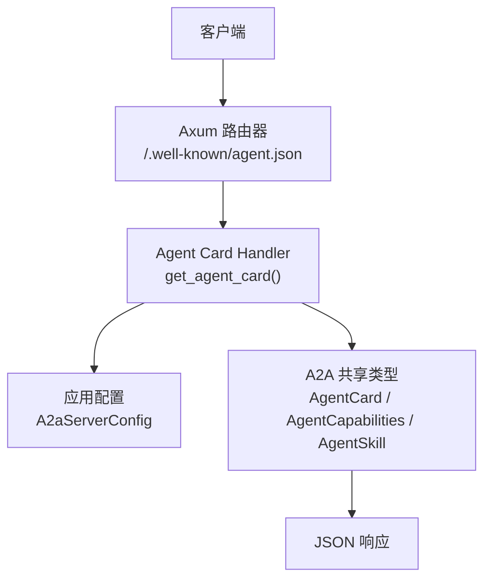
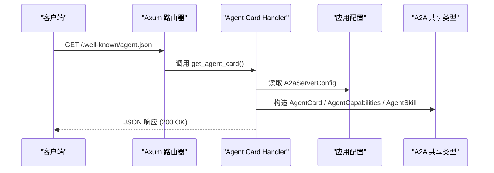
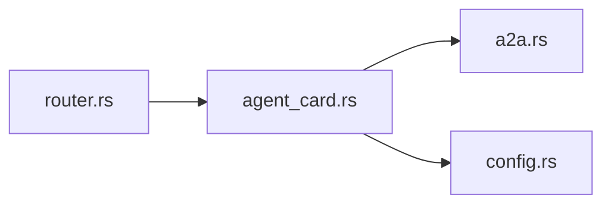
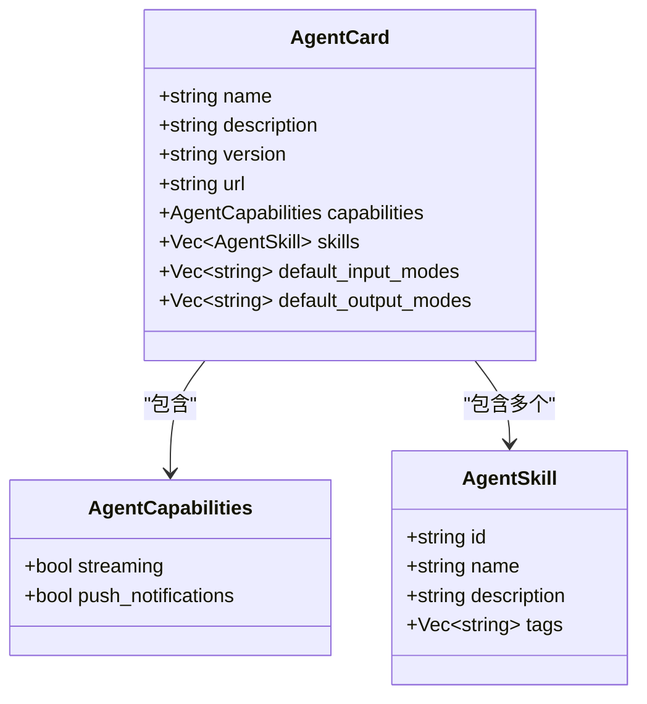
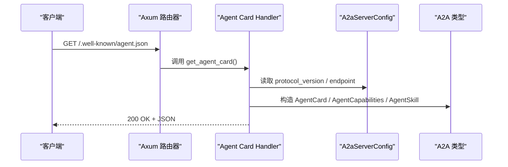
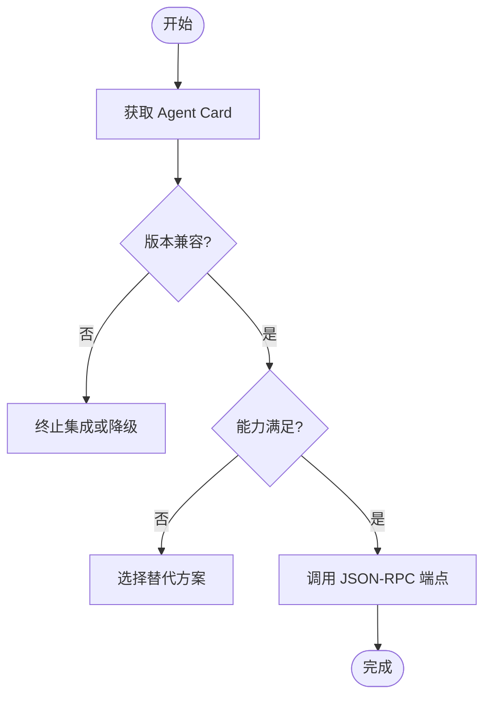

# Agent卡片发现

<cite>
**本文引用的文件**
- [src/handlers/a2a/agent_card.rs](src/handlers/a2a/agent_card.rs)
- [common/src/api/a2a.rs](common/src/api/a2a.rs)
- [src/router.rs](src/router.rs)
- [common/src/config.rs](common/src/config.rs)
- [common/src/api/a2a_test.rs](common/src/api/a2a_test.rs)
- （2026-09-04 清理：superpowers 目录已归档，待 doc-maintainer 跟进）
- [A2A Server Handler 层：JSON-RPC 方法路由 + 公开无鉴权路由 + notification_url 回调渠道自动创建](docs/wiki/knowledge/zh/A2A Server Handler 层：JSON-RPC 方法路由 + 公开无鉴权路由 + notification_url 回调渠道自动创建/A2A Server Handler 层：JSON-RPC 方法路由 + 公开无鉴权路由 + notification_url 回调渠道自动创建.md)
- [A2A 协议层：AgentCard 发现 + JSON-RPC 2.0 + A2aTask 任务状态机 + A2aMessage 双向消息](docs/wiki/knowledge/zh/A2A 协议层：AgentCard 发现 + JSON-RPC 2.0 + A2aTask 任务状态机 + A2aMessage 双向消息/A2A 协议层：AgentCard 发现 + JSON-RPC 2.0 + A2aTask 任务状态机 + A2aMessage 双向消息.md)
</cite>

## 目录
1. [简介](#简介)
2. [项目结构](#项目结构)
3. [核心组件](#核心组件)
4. [架构总览](#架构总览)
5. [详细组件分析](#详细组件分析)
6. [依赖关系分析](#依赖关系分析)
7. [性能考虑](#性能考虑)
8. [故障排查指南](#故障排查指南)
9. [结论](#结论)
10. [附录](#附录)

## 简介
本文件面向A2A协议中的Agent卡片发现能力，围绕以下目标展开：
- 解释Agent卡片的结构定义、元数据字段与版本兼容性机制
- 说明HTTP端点设计、请求响应格式与错误处理策略
- 文档化Agent能力描述、支持的协议版本、通信约束与服务发现机制
- 说明Agent卡片注册流程、动态更新机制与缓存策略（基于当前实现）
- 提供完整的API调用示例，包括GET /.well-known/agent.json的响应解析与客户端集成指南
- 给出Agent卡片的验证规则、安全考虑与性能优化建议

## 项目结构
Agent卡片发现由“路由层 + Handler + 共享类型 + 配置”构成，遵循四层单向调用原则：Adapter（HTTP Handler）→ Domain → DAL → DAO。对于卡片发现而言，Handler直接读取全局配置并返回组织级能力描述，不访问业务域或持久化层。

图表来源
- [src/router.rs:21-26](src/router.rs#L21-L26)
- [src/handlers/a2a/agent_card.rs:13-36](src/handlers/a2a/agent_card.rs#L13-L36)
- [common/src/api/a2a.rs:16-62](common/src/api/a2a.rs#L16-L62)
- [common/src/config.rs:510-549](common/src/config.rs#L510-L549)

章节来源
- [src/router.rs:21-26](src/router.rs#L21-L26)
- [src/handlers/a2a/agent_card.rs:1-36](src/handlers/a2a/agent_card.rs#L1-L36)
- [common/src/api/a2a.rs:16-62](common/src/api/a2a.rs#L16-L62)
- [common/src/config.rs:510-549](common/src/config.rs#L510-L549)

## 核心组件
- Agent卡片数据结构：定义在共享模块中，包含组织名称、描述、协议版本、端点URL、能力声明、技能列表、默认输入/输出模式等字段。
- 能力声明：声明是否支持SSE流式与推送通知。
- 技能描述：组织级对外技能清单，用于服务发现与能力展示。
- 路由与中间件：公开路由无需JWT认证，仅通过RequestContext中间件注入日志上下文。
- 配置：协议版本、端点路径、卡片路径来自A2aServerConfig。

章节来源
- [common/src/api/a2a.rs:16-62](common/src/api/a2a.rs#L16-L62)
- [src/router.rs:21-26](src/router.rs#L21-L26)
- [common/src/config.rs:510-549](common/src/config.rs#L510-L549)

## 架构总览
Agent卡片发现是纯读操作，无状态、无鉴权、无数据库访问。其职责是将组织级能力以标准格式暴露给外部系统，便于其他Agent或服务进行服务发现。

图表来源
- [src/router.rs:21-26](src/router.rs#L21-L26)
- [src/handlers/a2a/agent_card.rs:13-36](src/handlers/a2a/agent_card.rs#L13-L36)
- [common/src/config.rs:510-549](common/src/config.rs#L510-L549)
- [common/src/api/a2a.rs:16-62](common/src/api/a2a.rs#L16-L62)

## 详细组件分析

### Agent卡片数据结构与字段语义
- name：组织名称，用于标识对外能力主体。
- description：可选的组织描述，便于人类阅读。
- version：协议版本字符串，如“0.3.0”，用于客户端进行版本兼容判断。
- url：协议端点URL（例如“/a2a”），供客户端发起后续JSON-RPC调用。
- capabilities：能力声明，包含streaming（是否支持SSE流式）与push_notifications（是否支持推送通知）。
- skills：组织级技能列表，每个技能包含id、name、description、tags。
- default_input_modes：默认输入模式（如"text"）。
- default_output_modes：默认输出模式（如"text"）。

这些字段共同构成服务发现的元数据，帮助调用方了解服务端能力边界与交互方式。

章节来源
- [common/src/api/a2a.rs:16-62](common/src/api/a2a.rs#L16-L62)

### HTTP端点设计与请求响应
- 端点：GET /.well-known/agent.json
- 认证：无需JWT，公开可访问
- 中间件：仅使用request_context_middleware注入日志上下文
- 响应：200 OK，Content-Type为application/json，Body为AgentCard序列化结果

章节来源
- [src/router.rs:21-26](src/router.rs#L21-L26)
- [src/handlers/a2a/agent_card.rs:1-36](src/handlers/a2a/agent_card.rs#L1-L36)

### 版本兼容性与能力协商
- 版本字段version来源于配置A2aServerConfig.protocol_version，默认值为“0.3.0”。
- 能力字段capabilities指示服务端对SSE流式与推送通知的支持情况。
- 客户端应依据version与capabilities决定后续调用策略（例如是否启用SSE订阅或推送回调）。

章节来源
- [common/src/config.rs:510-549](common/src/config.rs#L510-L549)
- [common/src/api/a2a.rs:38-47](common/src/api/a2a.rs#L38-L47)
- （2026-09-04 清理：superpowers 目录已归档，待 doc-maintainer 跟进）

### 通信约束与服务发现机制
- 传输协议：JSON-RPC 2.0 over HTTP POST（后续方法调用），卡片发现为独立GET端点。
- 认证：卡片发现无需认证；JSON-RPC端点需要JWT。
- 服务发现：通过/.well-known/agent.json获取统一入口与能力描述，再根据url字段调用具体方法。

章节来源
- [src/router.rs:21-38](src/router.rs#L21-L38)
- （2026-09-04 清理：superpowers 目录已归档，待 doc-maintainer 跟进）

### Agent能力描述与技能清单
- 能力声明：当前实现中streaming=false，push_notifications=true。
- 技能清单：至少包含一个“对话协作”技能，id为“chat”，标签包含“chat”。
- 默认输入/输出模式：均为"text"。

章节来源
- [src/handlers/a2a/agent_card.rs:16-33](src/handlers/a2a/agent_card.rs#L16-L33)
- [common/src/api/a2a.rs:38-62](common/src/api/a2a.rs#L38-L62)

### 注册流程、动态更新与缓存策略
- 注册流程：Agent卡片并非从数据库注册，而是运行时从配置生成。因此不存在传统意义上的“注册”动作。
- 动态更新：修改A2aServerConfig（protocol_version、endpoint、card_path）后，下次启动生效；当前实现未提供热更新机制。
- 缓存策略：当前实现无内存缓存；每次请求都会读取配置并构造响应。可在网关或CDN层做静态资源缓存以提升性能。

章节来源
- [src/handlers/a2a/agent_card.rs:13-36](src/handlers/a2a/agent_card.rs#L13-L36)
- [common/src/config.rs:510-549](common/src/config.rs#L510-L549)

### API调用示例与客户端集成指南
- 请求：GET {base_url}/.well-known/agent.json
- 响应体字段：
  - name：组织名称
  - description：可选描述
  - version：协议版本
  - url：JSON-RPC端点路径
  - capabilities：{ streaming, push_notifications }
  - skills：[{ id, name, description, tags }]
  - default_input_modes：["text"]
  - default_output_modes：["text"]
- 客户端集成步骤：
  1) 调用卡片端点获取能力与版本
  2) 校验version是否兼容（例如>=期望最低版本）
  3) 根据capabilities决定是否启用SSE订阅或推送回调
  4) 使用url作为JSON-RPC端点发起后续调用（需携带JWT）

章节来源
- [src/router.rs:21-26](src/router.rs#L21-L26)
- [src/handlers/a2a/agent_card.rs:13-36](src/handlers/a2a/agent_card.rs#L13-L36)
- [common/src/api/a2a.rs:16-62](common/src/api/a2a.rs#L16-L62)
- [common/src/config.rs:510-549](common/src/config.rs#L510-L549)

### 验证规则与安全考虑
- 输入验证：卡片发现为只读GET，不涉及用户输入，无需参数校验。
- 安全考虑：
  - 公开端点不包含敏感信息，仅暴露组织级能力描述
  - 实际任务调用（JSON-RPC）受JWT保护，防止未授权访问
  - 建议在网关层限制卡片端点的访问频率，避免滥用
- 错误处理：当前实现未显式抛出错误；若配置缺失或异常，将按框架默认行为返回错误响应。

章节来源
- [src/router.rs:21-38](src/router.rs#L21-L38)
- [src/handlers/a2a/agent_card.rs:13-36](src/handlers/a2a/agent_card.rs#L13-L36)

### 性能优化建议
- 前端/网关缓存：由于卡片内容变化不频繁，可在浏览器或反向代理层缓存较长时间（如24小时）。
- 减少重复构造：如需更高吞吐，可在内存中缓存AgentCard实例并按配置变更失效。
- 压缩响应：启用gzip/br压缩以减少带宽占用。
- 监控与指标：记录卡片请求量与耗时，便于容量规划。

[本节为通用指导，不直接分析具体文件]

## 依赖关系分析
Agent卡片发现依赖以下组件：
- Axum路由：将/.well-known/agent.json映射到Handler
- Handler：读取配置并构造响应
- 共享类型：AgentCard、AgentCapabilities、AgentSkill
- 配置：A2aServerConfig提供协议版本与端点

图表来源
- [src/router.rs:21-26](src/router.rs#L21-L26)
- [src/handlers/a2a/agent_card.rs:13-36](src/handlers/a2a/agent_card.rs#L13-L36)
- [common/src/api/a2a.rs:16-62](common/src/api/a2a.rs#L16-L62)
- [common/src/config.rs:510-549](common/src/config.rs#L510-L549)

章节来源
- [src/router.rs:21-26](src/router.rs#L21-L26)
- [src/handlers/a2a/agent_card.rs:13-36](src/handlers/a2a/agent_card.rs#L13-L36)
- [common/src/api/a2a.rs:16-62](common/src/api/a2a.rs#L16-L62)
- [common/src/config.rs:510-549](common/src/config.rs#L510-L549)

## 性能考虑
- 卡片发现为轻量GET请求，CPU与IO开销极低
- 可通过网关缓存显著降低后端压力
- 在高并发场景下，建议结合连接池与限流策略保护后端

[本节为通用指导，不直接分析具体文件]

## 故障排查指南
- 无法访问卡片端点：检查路由是否正确挂载，确认服务器监听地址与域名
- 返回非200：检查中间件与全局错误处理器，确认配置加载正常
- 版本不兼容：核对A2aServerConfig.protocol_version与客户端期望版本
- 能力不支持：根据capabilities调整客户端行为（如禁用SSE或推送）

章节来源
- [src/router.rs:21-38](src/router.rs#L21-L38)
- [common/src/config.rs:510-549](common/src/config.rs#L510-L549)

## 结论
Agent卡片发现提供了标准化的服务发现入口，使外部系统能够快速获取组织级能力、协议版本与通信约束。该实现简洁、无状态、易扩展，适合在生产环境中配合网关缓存与监控使用。后续可根据需求引入热更新、更丰富的能力描述与更细粒度的版本策略。

[本节为总结性内容，不直接分析具体文件]

## 附录

### 类图：Agent卡片相关类型

图表来源
- [common/src/api/a2a.rs:16-62](common/src/api/a2a.rs#L16-L62)

### 序列图：GET /.well-known/agent.json 调用流程

图表来源
- [src/router.rs:21-26](src/router.rs#L21-L26)
- [src/handlers/a2a/agent_card.rs:13-36](src/handlers/a2a/agent_card.rs#L13-L36)
- [common/src/config.rs:510-549](common/src/config.rs#L510-L549)
- [common/src/api/a2a.rs:16-62](common/src/api/a2a.rs#L16-L62)

### 流程图：客户端集成决策

[此图为概念流程，不直接映射具体代码文件]