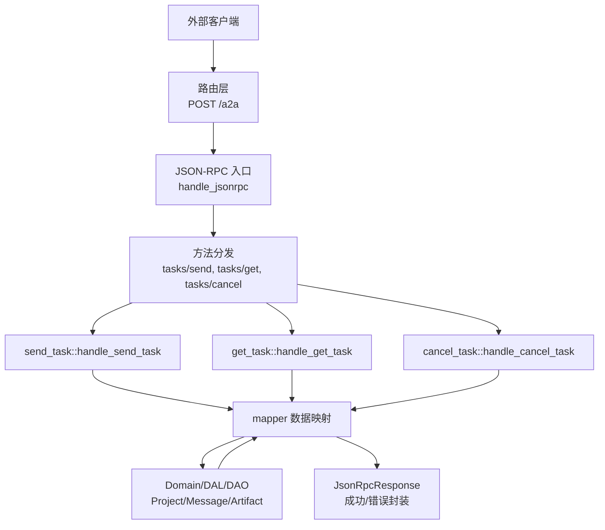
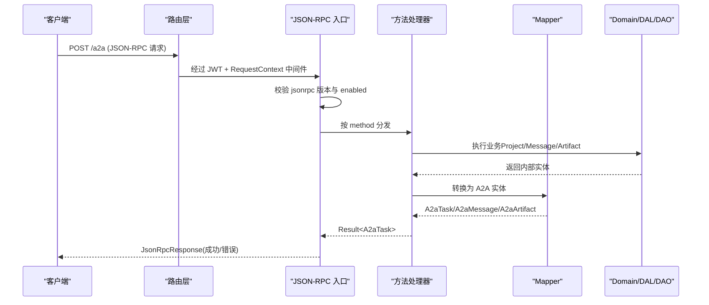
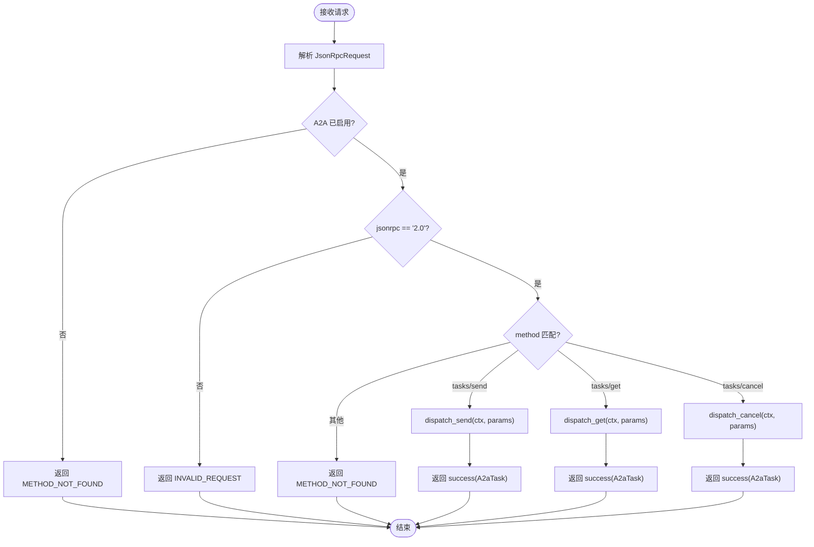
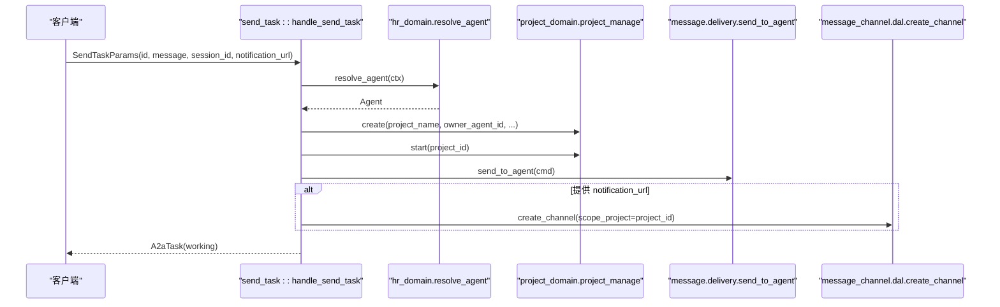
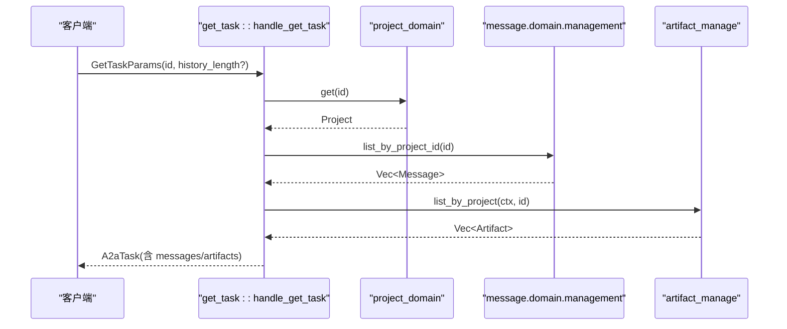
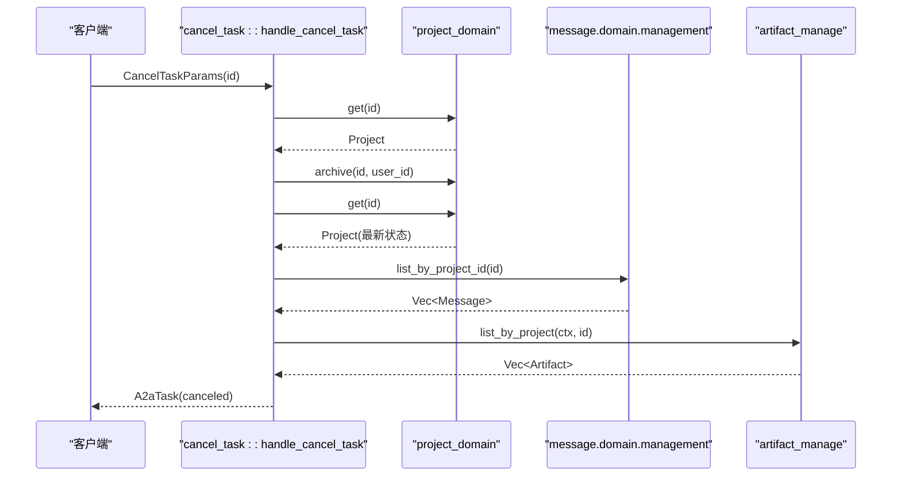
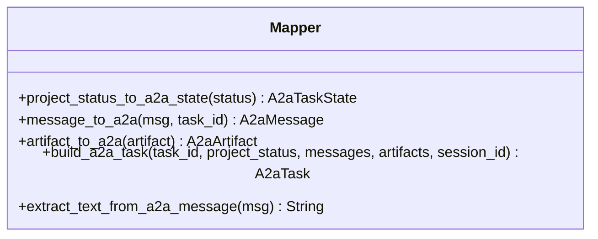
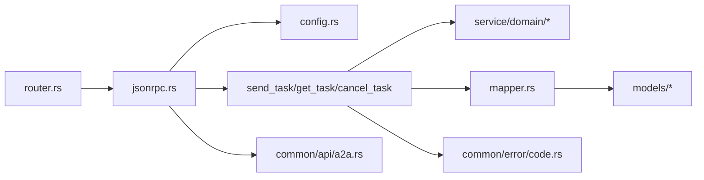

# JSON-RPC核心

<cite>
**本文引用的文件**
- [src/handlers/a2a/jsonrpc.rs](src/handlers/a2a/jsonrpc.rs)
- [common/src/api/a2a.rs](common/src/api/a2a.rs)
- [src/handlers/a2a/mapper.rs](src/handlers/a2a/mapper.rs)
- [src/handlers/a2a/send_task.rs](src/handlers/a2a/send_task.rs)
- [src/handlers/a2a/get_task.rs](src/handlers/a2a/get_task.rs)
- [src/handlers/a2a/cancel_task.rs](src/handlers/a2a/cancel_task.rs)
- [src/router.rs](src/router.rs)
- [common/src/config.rs](common/src/config.rs)
- [common/config/ai_orz.toml](common/config/ai_orz.toml)
- [common/src/error/code.rs](common/src/error/code.rs)
- [src/handlers/a2a/integration_test.rs](src/handlers/a2a/integration_test.rs)
</cite>

## 目录
1. [简介](#简介)
2. [项目结构](#项目结构)
3. [核心组件](#核心组件)
4. [架构总览](#架构总览)
5. [详细组件分析](#详细组件分析)
6. [依赖关系分析](#依赖关系分析)
7. [性能考量](#性能考量)
8. [故障排查指南](#故障排查指南)
9. [结论](#结论)
10. [附录](#附录)

## 简介
本文件为 A2A 协议的 JSON-RPC 核心功能文档，聚焦于 JSON-RPC 2.0 在 ai_orz 中的实现细节：请求解析、方法分发、响应序列化；RPC 方法的注册与参数校验、返回值转换；mapper 模块的数据映射逻辑（A2A 协议实体与 ai_orz 内部实体的双向转换）；错误码映射、异常处理与调试信息输出；以及 JSON-RPC 消息格式规范、批量请求与通知机制的说明。文末提供完整的 RPC 调用示例与性能优化建议。

## 项目结构
A2A 的 JSON-RPC 能力位于 handlers/a2a 子模块，通过 router.rs 暴露 POST /a2a 端点，并挂载 JWT 认证与 RequestContext 中间件。协议类型定义在 common/src/api/a2a.rs，配置项在 common/src/config.rs 中。

**图示来源**
- [src/router.rs:20-48](src/router.rs#L20-L48)
- [src/handlers/a2a/jsonrpc.rs:21-75](src/handlers/a2a/jsonrpc.rs#L21-L75)
- [src/handlers/a2a/send_task.rs:31-127](src/handlers/a2a/send_task.rs#L31-L127)
- [src/handlers/a2a/get_task.rs:17-48](src/handlers/a2a/get_task.rs#L17-L48)
- [src/handlers/a2a/cancel_task.rs:17-54](src/handlers/a2a/cancel_task.rs#L17-L54)
- [src/handlers/a2a/mapper.rs:14-84](src/handlers/a2a/mapper.rs#L14-L84)

**章节来源**
- [src/router.rs:20-48](src/router.rs#L20-L48)
- [src/handlers/a2a/jsonrpc.rs:21-75](src/handlers/a2a/jsonrpc.rs#L21-L75)
- [common/src/config.rs:510-548](common/src/config.rs#L510-L548)

## 核心组件
- JSON-RPC 入口与分发：负责解析请求体、校验版本与方法名、按 method 分发到具体处理器，并将结果或错误封装为 JSON-RPC 响应。
- 方法处理器：
  - tasks/send：异步提交任务，创建 Project 与 Message，立即返回 working 状态。
  - tasks/get：查询 Project、Messages、Artifacts 并组装 A2aTask。
  - tasks/cancel：归档 Project（对应 canceled），重新查询并返回最新状态。
- 数据映射器：将 A2A 协议实体与 ai_orz 内部实体进行双向转换，包括 ProjectStatus 到 A2aTaskState、Message 到 A2aMessage、Artifact 到 A2aArtifact 等。
- 协议类型与错误码：定义 JsonRpcRequest/Response/Error、A2aTask/Message/Artifact 等，并提供标准错误码常量。
- 配置开关：通过 AppConfig.a2a_server.enabled 控制 A2A Server 是否启用。

**章节来源**
- [src/handlers/a2a/jsonrpc.rs:21-94](src/handlers/a2a/jsonrpc.rs#L21-L94)
- [src/handlers/a2a/send_task.rs:31-127](src/handlers/a2a/send_task.rs#L31-L127)
- [src/handlers/a2a/get_task.rs:17-48](src/handlers/a2a/get_task.rs#L17-L48)
- [src/handlers/a2a/cancel_task.rs:17-54](src/handlers/a2a/cancel_task.rs#L17-L54)
- [src/handlers/a2a/mapper.rs:14-99](src/handlers/a2a/mapper.rs#L14-L99)
- [common/src/api/a2a.rs:64-145](common/src/api/a2a.rs#L64-L145)
- [common/src/config.rs:510-548](common/src/config.rs#L510-L548)

## 架构总览
A2A JSON-RPC 遵循“Adapter → Domain → DAL → DAO”的单向调用原则，A2A 概念仅在 Adapter（handlers/a2a）层出现，Domain 层完全无感知。

**图示来源**
- [src/router.rs:20-48](src/router.rs#L20-L48)
- [src/handlers/a2a/jsonrpc.rs:21-75](src/handlers/a2a/jsonrpc.rs#L21-L75)
- [src/handlers/a2a/send_task.rs:31-127](src/handlers/a2a/send_task.rs#L31-L127)
- [src/handlers/a2a/get_task.rs:17-48](src/handlers/a2a/get_task.rs#L17-L48)
- [src/handlers/a2a/cancel_task.rs:17-54](src/handlers/a2a/cancel_task.rs#L17-L54)
- [src/handlers/a2a/mapper.rs:14-84](src/handlers/a2a/mapper.rs#L14-L84)

## 详细组件分析

### JSON-RPC 入口与分发
- 请求解析：从请求体反序列化为 JsonRpcRequest，包含 jsonrpc、id、method、params。
- 版本校验：仅支持 "2.0"，否则返回 INVALID_REQUEST。
- 功能开关：读取 AppConfig.a2a_server.enabled，未启用时返回 METHOD_NOT_FOUND。
- 方法分发：根据 method 字符串分派到 send/get/cancel 处理器；未知方法返回 METHOD_NOT_FOUND。
- 响应封装：成功路径使用 JsonRpcResponse::success，失败路径统一包装为 INTERNAL_ERROR，错误消息来自 Error 的 Display。

**图示来源**
- [src/handlers/a2a/jsonrpc.rs:21-75](src/handlers/a2a/jsonrpc.rs#L21-L75)

**章节来源**
- [src/handlers/a2a/jsonrpc.rs:21-94](src/handlers/a2a/jsonrpc.rs#L21-L94)
- [common/src/api/a2a.rs:64-145](common/src/api/a2a.rs#L64-L145)
- [common/src/config.rs:510-548](common/src/config.rs#L510-L548)

### 方法处理器：tasks/send
- 用户上下文：从 RequestContext 提取 uid，缺失则返回 InvalidRequest。
- Agent 路由：调用 hr_domain().resolve_agent(ctx) 获取前台 Agent（不耦合 project）。
- 创建 Project：以消息内容截取生成项目名称，绑定 owner_agent_id，并启动项目（转为 InProgress）。
- 发送消息：构造 SendToAgentCommand，写入 message 并自动入队 event_queue，由 consumer 异步唤醒 Agent。
- 推送通知：若提供 notification_url，创建 A2aCallback 渠道（scope_project 限定），后续 deliver_message 会推送到该 URL。
- 立即返回：构建 A2aTask（working 状态），不等待 Agent 回复。

**图示来源**
- [src/handlers/a2a/send_task.rs:31-127](src/handlers/a2a/send_task.rs#L31-L127)

**章节来源**
- [src/handlers/a2a/send_task.rs:31-127](src/handlers/a2a/send_task.rs#L31-L127)

### 方法处理器：tasks/get
- 查询 Project：根据 id 获取项目，不存在返回 not_found。
- 查询 Messages：按 project_id 列出消息。
- 查询 Artifacts：按 project 列出产物。
- 组装 A2aTask：使用 mapper 将内部实体转换为 A2A 实体。

**图示来源**
- [src/handlers/a2a/get_task.rs:17-48](src/handlers/a2a/get_task.rs#L17-L48)

**章节来源**
- [src/handlers/a2a/get_task.rs:17-48](src/handlers/a2a/get_task.rs#L17-L48)

### 方法处理器：tasks/cancel
- 验证存在性：查询 Project，不存在返回 not_found。
- 归档项目：archive(project_id)，对应 A2A canceled 状态。
- 重新查询：获取最新状态后，列出 messages 与 artifacts。
- 组装 A2aTask：返回最新状态的 A2aTask。

**图示来源**
- [src/handlers/a2a/cancel_task.rs:17-54](src/handlers/a2a/cancel_task.rs#L17-L54)

**章节来源**
- [src/handlers/a2a/cancel_task.rs:17-54](src/handlers/a2a/cancel_task.rs#L17-L54)

### 数据映射器（mapper）
- ProjectStatus → A2aTaskState：Active/PendingReview → Submitted；InProgress → Working；Completed → Completed；Archived → Canceled；Deleted → Failed。
- Message → A2aMessage：from_role=User 映射为 role="user"，其余为 "agent"；parts 为 Text；附带 message_id 与 task_id。
- Artifact → A2aArtifact：保留 artifact_id、name，parts 为 Text（description）。
- build_a2a_task：聚合 messages 与 artifacts，设置 status.state、timestamp、metadata。
- extract_text_from_a2a_message：从 A2aMessage 的 parts 中提取所有 Text 并拼接。

**图示来源**
- [src/handlers/a2a/mapper.rs:14-99](src/handlers/a2a/mapper.rs#L14-L99)

**章节来源**
- [src/handlers/a2a/mapper.rs:14-99](src/handlers/a2a/mapper.rs#L14-L99)

### JSON-RPC 消息格式与错误码
- 请求：JsonRpcRequest{jsonrpc:"2.0", id, method, params}
- 响应：JsonRpcResponse{jsonrpc:"2.0", id, result?, error?}
- 错误：JsonRpcError{code, message, data?}
- 标准错误码：PARSE_ERROR(-32700)、INVALID_REQUEST(-32600)、METHOD_NOT_FOUND(-32601)、INVALID_PARAMS(-32602)、INTERNAL_ERROR(-32603)

**章节来源**
- [common/src/api/a2a.rs:64-145](common/src/api/a2a.rs#L64-L145)

### 批量请求与通知机制
- 批量请求：当前实现为单条请求处理，未实现 batch 数组解析与并发处理。如需扩展，可在入口增加对 params 为数组的检测，逐条分发并收集结果。
- 通知机制：
  - SSE 流式：通过 /a2a/subscribe 端点（POST）实现，复用现有消息推送机制。
  - PushNotifications：当 tasks/send 提供 notification_url 时，创建 A2aCallback 渠道（scope_project 限定），后续 deliver_message 会向该 URL 推送 A2A Task 更新。

**章节来源**
- [src/router.rs:39-56](src/router.rs#L39-L56)
- [src/handlers/a2a/send_task.rs:93-114](src/handlers/a2a/send_task.rs#L93-L114)

## 依赖关系分析
- 路由层依赖中间件：JWT 认证与 RequestContext 注入。
- JSON-RPC 入口依赖配置单例：读取 a2a_server.enabled。
- 方法处理器依赖 Domain/DAL/DAO：Project、Message、Artifact、MessageChannel。
- Mapper 依赖内部模型：Message、Artifact、ProjectStatus。
- 错误体系：common::error 的错误码与类型用于业务错误，JSON-RPC 错误码用于协议层错误。

**图示来源**
- [src/router.rs:20-48](src/router.rs#L20-L48)
- [src/handlers/a2a/jsonrpc.rs:21-75](src/handlers/a2a/jsonrpc.rs#L21-L75)
- [common/src/config.rs:510-548](common/src/config.rs#L510-L548)
- [common/src/api/a2a.rs:64-145](common/src/api/a2a.rs#L64-L145)
- [common/src/error/code.rs:1-146](common/src/error/code.rs#L1-L146)

**章节来源**
- [src/router.rs:20-48](src/router.rs#L20-L48)
- [src/handlers/a2a/jsonrpc.rs:21-75](src/handlers/a2a/jsonrpc.rs#L21-L75)
- [common/src/config.rs:510-548](common/src/config.rs#L510-L548)
- [common/src/api/a2a.rs:64-145](common/src/api/a2a.rs#L64-L145)
- [common/src/error/code.rs:1-146](common/src/error/code.rs#L1-L146)

## 性能考量
- 异步处理：tasks/send 立即返回 working，避免阻塞；实际 Agent 唤醒与回复由 consumer 异步完成。
- 最小化 I/O：get/cancel 仅查询必要数据（Project、Messages、Artifacts），减少冗余加载。
- 文本截断：send_task 中使用字符级截断生成项目名称，避免 UTF-8 字节切片 panic。
- 推送通知：notification_url 仅在提供时创建渠道，降低默认开销。
- 可扩展性：如需批量请求，可考虑并行分发与结果聚合，注意限流与超时控制。

[本节为通用指导，无需特定文件引用]

## 故障排查指南
- A2A 未启用：检查 AppConfig.a2a_server.enabled，未启用时返回 METHOD_NOT_FOUND。
- 版本不支持：jsonrpc 字段非 "2.0" 返回 INVALID_REQUEST。
- 方法未找到：method 不在白名单返回 METHOD_NOT_FOUND。
- 参数无效：params 反序列化失败返回 INVALID_PARAMS。
- 资源不存在：get/cancel 中 Project 不存在返回 not_found。
- 内部错误：业务异常统一包装为 INTERNAL_ERROR，错误消息来自 Error::Display。
- 集成测试：参考 integration_test 初始化环境与用例，验证 resolve_agent、get/cancel 不存在场景。

**章节来源**
- [src/handlers/a2a/jsonrpc.rs:21-94](src/handlers/a2a/jsonrpc.rs#L21-L94)
- [src/handlers/a2a/get_task.rs:17-48](src/handlers/a2a/get_task.rs#L17-L48)
- [src/handlers/a2a/cancel_task.rs:17-54](src/handlers/a2a/cancel_task.rs#L17-L54)
- [src/handlers/a2a/integration_test.rs:91-134](src/handlers/a2a/integration_test.rs#L91-L134)

## 结论
A2A 的 JSON-RPC 核心在 ai_orz 中以清晰的层次划分实现：路由层负责中间件与端点注册，JSON-RPC 入口负责协议解析与分发，方法处理器专注业务流程，mapper 隔离协议与内部实体。错误码与异常处理遵循统一规范，便于客户端识别与调试。当前实现覆盖 tasks/send/get/cancel 与通知机制，具备良好扩展性以支持批量请求与更多 A2A 特性。

[本节为总结，无需特定文件引用]

## 附录

### JSON-RPC 消息格式规范
- 请求：
  - jsonrpc: "2.0"
  - id: string | number | null
  - method: "tasks/send" | "tasks/get" | "tasks/cancel"
  - params: 对应方法参数对象
- 响应：
  - 成功：result 为 A2aTask
  - 错误：error.code 为标准 JSON-RPC 错误码，error.message 为人类可读描述

**章节来源**
- [common/src/api/a2a.rs:64-145](common/src/api/a2a.rs#L64-L145)

### 完整 RPC 调用示例
- 方法调用：
  - tasks/send：传入 id、message（role/parts）、可选 session_id 与 notification_url。
  - tasks/get：传入 id，可选 history_length。
  - tasks/cancel：传入 id。
- 错误处理：
  - 捕获 error.code 与 error.message，区分协议错误与业务错误。
- 性能优化建议：
  - 使用 tasks/send 异步模式，轮询 tasks/get 获取最终结果。
  - 合理设置 history_length，避免过大历史传输。
  - 启用 SSE 或 PushNotifications 减少轮询开销。

**章节来源**
- [src/handlers/a2a/send_task.rs:31-127](src/handlers/a2a/send_task.rs#L31-L127)
- [src/handlers/a2a/get_task.rs:17-48](src/handlers/a2a/get_task.rs#L17-L48)
- [src/handlers/a2a/cancel_task.rs:17-54](src/handlers/a2a/cancel_task.rs#L17-L54)
- [common/src/api/a2a.rs:267-306](common/src/api/a2a.rs#L267-L306)