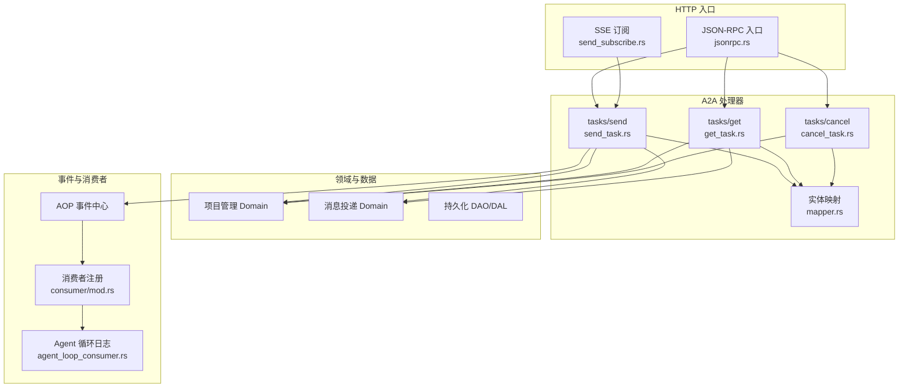
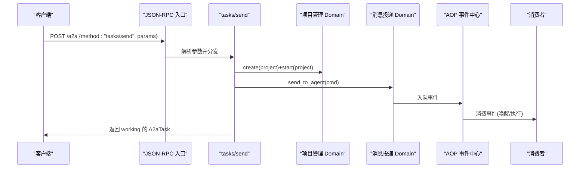
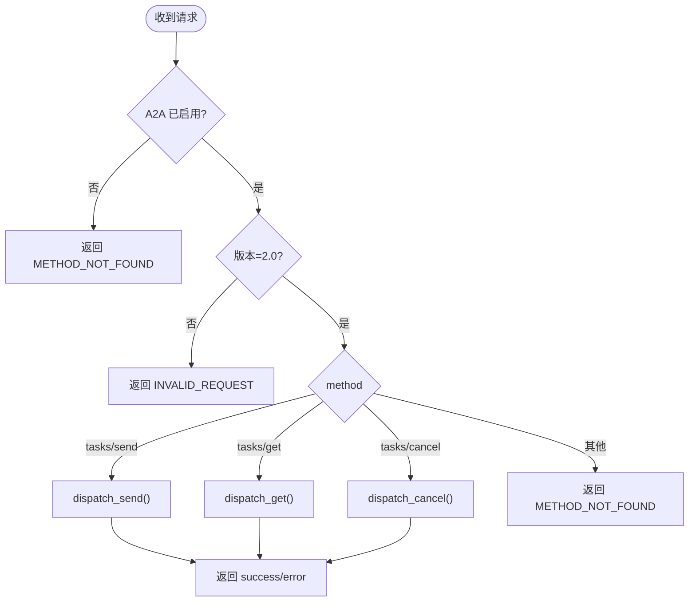
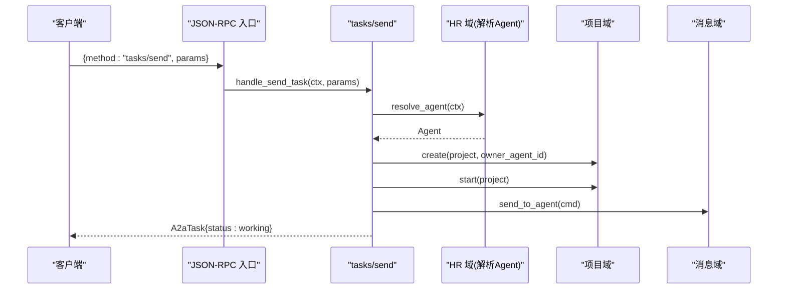
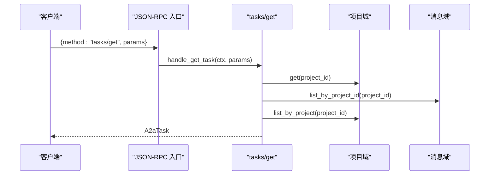
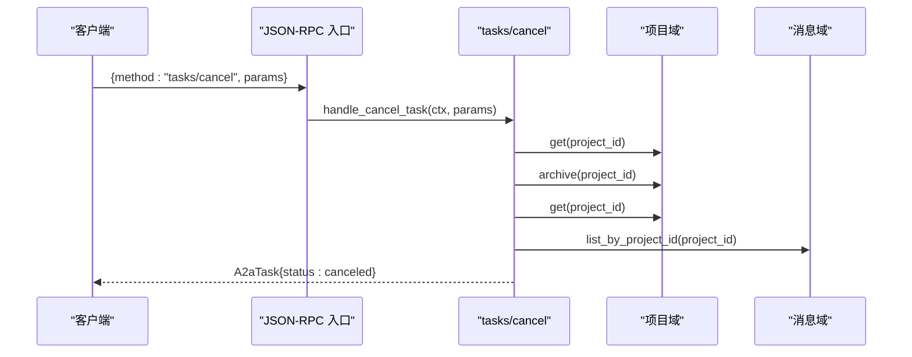
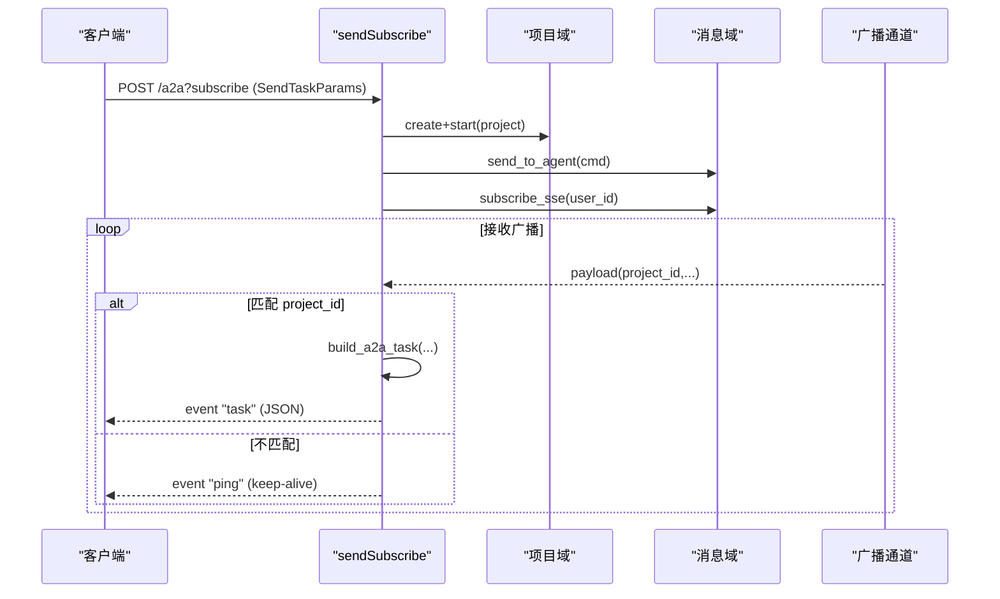
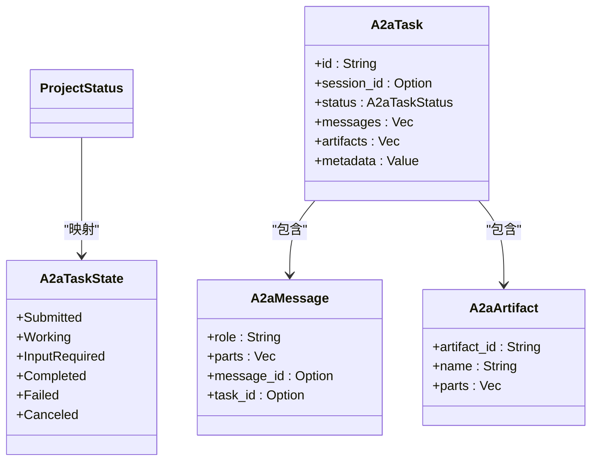
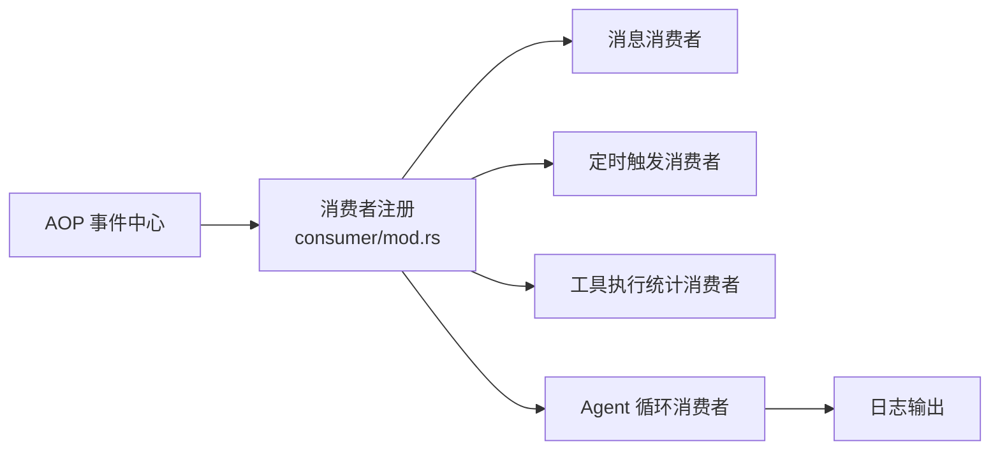
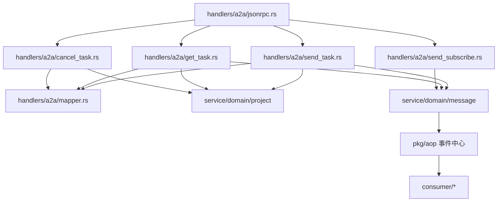

# 任务管理（代码落地层）

<cite>
**本文引用的文件**
- [src/handlers/a2a/mod.rs](src/handlers/a2a/mod.rs)
- [src/handlers/a2a/jsonrpc.rs](src/handlers/a2a/jsonrpc.rs)
- [src/handlers/a2a/send_task.rs](src/handlers/a2a/send_task.rs)
- [src/handlers/a2a/get_task.rs](src/handlers/a2a/get_task.rs)
- [src/handlers/a2a/cancel_task.rs](src/handlers/a2a/cancel_task.rs)
- [src/handlers/a2a/send_subscribe.rs](src/handlers/a2a/send_subscribe.rs)
- [src/handlers/a2a/mapper.rs](src/handlers/a2a/mapper.rs)
- [common/src/api/a2a.rs](common/src/api/a2a.rs)
- [src/consumer/mod.rs](src/consumer/mod.rs)
- [src/consumer/agent_loop_consumer.rs](src/consumer/agent_loop_consumer.rs)
</cite>

## 目录
1. [简介](#简介)
2. [项目结构](#项目结构)
3. [核心组件](#核心组件)
4. [架构总览](#架构总览)
5. [详细组件分析](#详细组件分析)
6. [依赖关系分析](#依赖关系分析)
7. [性能与并发](#性能与并发)
8. [故障排查指南](#故障排查指南)
9. [结论](#结论)
10. [附录：API 参考与示例](#附录api-参考与示例)

## 简介
本章节面向 A2A 协议的任务管理能力，围绕任务的创建、查询、取消与订阅四大核心操作展开。文档说明异步任务提交机制、任务状态流转与进度跟踪，并逐一文档化 JSON-RPC 方法 tasks/send、tasks/get、tasks/cancel 以及 SSE 流式接口 tasks/sendSubscribe 的实现要点。同时给出任务生命周期管理、错误处理策略、SSE 推送与轮询结合的最佳实践。

> 📌 视角说明（AGENTS §2.1.3 Level 3 互补视角平行卡）：
> 本长文是「任务管理」主题的 **代码落地层** 视角。同主题还有以下平行视角卡，请按需交叉阅读：
> - [任务管理（业务功能层）](docs/wiki/zh/content/功能模块/项目管理/任务管理.md)

## 项目结构
A2A 任务管理位于 handlers/a2a 模块下，采用“按功能拆分”的组织方式：入口路由与分发在 jsonrpc.rs；具体方法实现分别位于 send_task.rs、get_task.rs、cancel_task.rs；SSE 流式订阅在 send_subscribe.rs；实体映射集中在 mapper.rs；公共类型定义在 common/src/api/a2a.rs。

图表来源
- [src/handlers/a2a/jsonrpc.rs:22-94](src/handlers/a2a/jsonrpc.rs#L22-L94)
- [src/handlers/a2a/send_task.rs:32-127](src/handlers/a2a/send_task.rs#L32-L127)
- [src/handlers/a2a/get_task.rs:18-48](src/handlers/a2a/get_task.rs#L18-L48)
- [src/handlers/a2a/cancel_task.rs:18-53](src/handlers/a2a/cancel_task.rs#L18-L53)
- [src/handlers/a2a/send_subscribe.rs:36-124](src/handlers/a2a/send_subscribe.rs#L36-L124)
- [src/handlers/a2a/mapper.rs:14-84](src/handlers/a2a/mapper.rs#L14-L84)
- [src/consumer/mod.rs:16-36](src/consumer/mod.rs#L16-L36)
- [src/consumer/agent_loop_consumer.rs:26-41](src/consumer/agent_loop_consumer.rs#L26-L41)

章节来源
- [src/handlers/a2a/mod.rs:1-28](src/handlers/a2a/mod.rs#L1-L28)

## 核心组件
- JSON-RPC 入口与分发：负责校验请求版本、启用开关与方法路由，统一封装成功/失败响应。
- tasks/send：异步提交任务，创建 Project（即 Task）、启动项目、发送消息到 Agent，立即返回 working 状态。
- tasks/get：根据 task_id 查询 Project、消息与产物，转换为 A2A Task 返回。
- tasks/cancel：归档 Project（对应 canceled），返回最新任务视图。
- tasks/sendSubscribe：复用现有 SSE 基础设施，创建任务后订阅用户级广播通道，按项目过滤推送完整 A2A Task。
- 实体映射：ProjectStatus ↔ A2aTaskState、Message/Artifact ↔ A2A 消息/产物。
- 消费者与事件：通过 AOP 事件中心注册消费者，记录 Agent 循环与思考轮次等运行时信息。

章节来源
- [src/handlers/a2a/jsonrpc.rs:22-94](src/handlers/a2a/jsonrpc.rs#L22-L94)
- [src/handlers/a2a/send_task.rs:32-127](src/handlers/a2a/send_task.rs#L32-L127)
- [src/handlers/a2a/get_task.rs:18-48](src/handlers/a2a/get_task.rs#L18-L48)
- [src/handlers/a2a/cancel_task.rs:18-53](src/handlers/a2a/cancel_task.rs#L18-L53)
- [src/handlers/a2a/send_subscribe.rs:36-124](src/handlers/a2a/send_subscribe.rs#L36-L124)
- [src/handlers/a2a/mapper.rs:14-84](src/handlers/a2a/mapper.rs#L14-L84)
- [src/consumer/mod.rs:16-36](src/consumer/mod.rs#L16-L36)
- [src/consumer/agent_loop_consumer.rs:26-41](src/consumer/agent_loop_consumer.rs#L26-L41)

## 架构总览
A2A 任务管理遵循四层单向调用：Adapter（HTTP Handler）→ Domain → DAL → DAO。Handler 层组合 agent 与 project 两个维度，不直接唤醒 Agent；唤醒由 consumer 异步闭环。SSE 流式推送复用 message_push_dal 的用户级广播通道，按 project_id 过滤推送。

图表来源
- [src/handlers/a2a/jsonrpc.rs:47-80](src/handlers/a2a/jsonrpc.rs#L47-L80)
- [src/handlers/a2a/send_task.rs:53-91](src/handlers/a2a/send_task.rs#L53-L91)
- [src/consumer/mod.rs:16-36](src/consumer/mod.rs#L16-L36)

## 详细组件分析

### JSON-RPC 入口与分发
- 职责：校验 A2A Server 开关、JSON-RPC 版本、按 method 分发到具体处理器；统一封装成功/错误响应。
- 关键点：未启用时返回 METHOD_NOT_FOUND；未知方法返回 METHOD_NOT_FOUND；异常统一转为 INTERNAL_ERROR。

图表来源
- [src/handlers/a2a/jsonrpc.rs:22-94](src/handlers/a2a/jsonrpc.rs#L22-L94)

章节来源
- [src/handlers/a2a/jsonrpc.rs:22-94](src/handlers/a2a/jsonrpc.rs#L22-L94)

### tasks/send：异步提交任务
- 流程：
  - 从 RequestContext 提取 user_id。
  - 解析前台 Agent（与 project 解耦）。
  - 创建 Project（名称截断避免过长），绑定 owner_agent_id。
  - 启动项目（进入 InProgress）。
  - 构造 SendToAgentCommand 并投递消息，自动入队 event_queue。
  - 若提供 notification_url，创建 A2aCallback 渠道用于后续推送。
  - 立即返回 working 状态的 A2aTask。
- 关键点：handler 不调用唤醒逻辑，唤醒由 consumer 异步完成；消息投递后通过轮询或 SSE 获取结果。

图表来源
- [src/handlers/a2a/send_task.rs:32-127](src/handlers/a2a/send_task.rs#L32-L127)

章节来源
- [src/handlers/a2a/send_task.rs:32-127](src/handlers/a2a/send_task.rs#L32-L127)

### tasks/get：查询任务状态
- 流程：
  - 根据 id 查询 Project。
  - 查询关联 messages。
  - 查询 artifacts。
  - 使用 mapper 构建 A2aTask 返回。
- 关键点：session_id 不持久化，get 时不返回。

图表来源
- [src/handlers/a2a/get_task.rs:18-48](src/handlers/a2a/get_task.rs#L18-L48)

章节来源
- [src/handlers/a2a/get_task.rs:18-48](src/handlers/a2a/get_task.rs#L18-L48)

### tasks/cancel：取消任务
- 流程：
  - 查询 Project 确保存在。
  - 归档 Project（对应 A2A canceled）。
  - 重新查询 Project 获取最新状态。
  - 查询 messages + artifacts。
  - 构建并返回 A2aTask。
- 关键点：取消即归档，后续仍可查询历史。

图表来源
- [src/handlers/a2a/cancel_task.rs:18-53](src/handlers/a2a/cancel_task.rs#L18-L53)

章节来源
- [src/handlers/a2a/cancel_task.rs:18-53](src/handlers/a2a/cancel_task.rs#L18-L53)

### tasks/sendSubscribe：SSE 流式提交与推送
- 流程：
  - 创建 Project + 投递消息（同 tasks/send）。
  - 订阅用户级 SSE channel（复用 message_push_dal）。
  - 监听广播消息，过滤 project_id 匹配项。
  - 每次匹配则构建完整 A2aTask 并通过 SSE event "task" 推送；无匹配时发送 "ping" 保活。
  - 进程退出时清理订阅。
- 关键点：当前推送粒度为完整 A2A Task（仅包含 messages，artifacts 为空）；未来将接入统一事件系统扩展推送内容。

图表来源
- [src/handlers/a2a/send_subscribe.rs:36-124](src/handlers/a2a/send_subscribe.rs#L36-L124)
- [src/handlers/a2a/send_subscribe.rs:126-212](src/handlers/a2a/send_subscribe.rs#L126-L212)

章节来源
- [src/handlers/a2a/send_subscribe.rs:36-124](src/handlers/a2a/send_subscribe.rs#L36-L124)
- [src/handlers/a2a/send_subscribe.rs:126-212](src/handlers/a2a/send_subscribe.rs#L126-L212)

### 实体映射与状态转换
- ProjectStatus 到 A2aTaskState 的映射：Active/PendingReview → Submitted；InProgress → Working；Completed → Completed；Archived → Canceled；Deleted → Failed。
- Message 到 A2aMessage：User 角色映射为 "user"，其余为 "agent"。
- Artifact 到 A2aArtifact：以描述作为文本部分。
- 构建 A2aTask：聚合状态、时间戳、消息与产物。

图表来源
- [src/handlers/a2a/mapper.rs:14-84](src/handlers/a2a/mapper.rs#L14-L84)
- [common/src/api/a2a.rs:149-198](common/src/api/a2a.rs#L149-L198)

章节来源
- [src/handlers/a2a/mapper.rs:14-84](src/handlers/a2a/mapper.rs#L14-L84)
- [common/src/api/a2a.rs:149-198](common/src/api/a2a.rs#L149-L198)

### 消费者与事件链路
- 消费者注册：在初始化阶段注册消息、调度、工具执行统计、Agent 循环、思考轮次、任务事件等消费者。
- Agent 循环消费者：订阅 agent.loop 与 agent.think.round 事件，记录开始/结束与每轮思考指标。

图表来源
- [src/consumer/mod.rs:16-36](src/consumer/mod.rs#L16-L36)
- [src/consumer/agent_loop_consumer.rs:26-41](src/consumer/agent_loop_consumer.rs#L26-L41)

章节来源
- [src/consumer/mod.rs:16-36](src/consumer/mod.rs#L16-L36)
- [src/consumer/agent_loop_consumer.rs:26-41](src/consumer/agent_loop_consumer.rs#L26-L41)

## 依赖关系分析
- Handler 层依赖 Domain 层进行业务编排，Domain 层再调用 DAL/DAO 进行数据访问。
- A2A 处理器通过 mapper 与 common::api::a2a 类型交互，保持领域模型与协议模型解耦。
- SSE 推送依赖 message_push_dal 的用户级广播通道，按 project_id 过滤。
- 消费者通过 AOP 事件中心解耦地消费运行时事件。

图表来源
- [src/handlers/a2a/jsonrpc.rs:47-94](src/handlers/a2a/jsonrpc.rs#L47-L94)
- [src/handlers/a2a/send_task.rs:53-91](src/handlers/a2a/send_task.rs#L53-L91)
- [src/handlers/a2a/get_task.rs:20-36](src/handlers/a2a/get_task.rs#L20-L36)
- [src/handlers/a2a/cancel_task.rs:20-48](src/handlers/a2a/cancel_task.rs#L20-L48)
- [src/handlers/a2a/send_subscribe.rs:62-79](src/handlers/a2a/send_subscribe.rs#L62-L79)
- [src/consumer/mod.rs:16-36](src/consumer/mod.rs#L16-L36)

## 性能与并发
- 异步提交：tasks/send 不阻塞等待 Agent 回复，立即返回 working，降低请求延迟。
- SSE 推送：基于用户级广播通道，同一条消息自动推送给所有订阅者，减少重复计算。
- 资源分配：Project 默认优先级为 0，可按需调整；消息投递走队列，避免瞬时峰值冲击。
- 并发控制：SSE 连接在进程退出时清理订阅，防止资源泄漏；消息过滤按 project_id 精确匹配，降低无效处理。
- 超时与重试：当前实现未显式配置超时与重试；建议在外部网关或客户端侧实现重试与退避策略。

[本节为通用指导，不涉及具体文件分析]

## 故障排查指南
- 常见错误码：
  - METHOD_NOT_FOUND：A2A Server 未启用或未支持的方法。
  - INVALID_REQUEST：非 JSON-RPC 2.0 版本。
  - INTERNAL_ERROR：内部异常统一包装。
- 排查步骤：
  - 确认 A2A Server 已启用。
  - 检查 JSON-RPC 版本与方法名。
  - 查看任务是否存在（tasks/get）。
  - 检查 SSE 是否收到 ping 保活与 task 事件。
  - 查看消费者日志确认 Agent 循环是否开始/结束。

章节来源
- [src/handlers/a2a/jsonrpc.rs:28-73](src/handlers/a2a/jsonrpc.rs#L28-L73)
- [src/handlers/a2a/send_subscribe.rs:41-75](src/handlers/a2a/send_subscribe.rs#L41-L75)
- [src/consumer/agent_loop_consumer.rs:43-94](src/consumer/agent_loop_consumer.rs#L43-L94)

## 结论
A2A 任务管理通过清晰的 Handler→Domain→DAL→DAO 分层与 AOP 事件驱动，实现了高内聚、低耦合的任务生命周期管理。tasks/send 提供异步提交能力，tasks/get 支持轮询查询，tasks/cancel 提供取消归档，tasks/sendSubscribe 提供实时推送。配合统一的实体映射与错误处理，形成稳定可靠的对外协议能力。

[本节为总结性内容，不涉及具体文件分析]

## 附录：API 参考与示例

### JSON-RPC 方法与参数
- tasks/send
  - 参数：SendTaskParams（id、message、session_id、metadata、notification_url）
  - 行为：创建 Project、启动、投递消息，返回 working 的 A2aTask
- tasks/get
  - 参数：GetTaskParams（id、history_length）
  - 行为：查询 Project、消息、产物，返回 A2aTask
- tasks/cancel
  - 参数：CancelTaskParams（id）
  - 行为：归档 Project，返回 canceled 的 A2aTask
- tasks/sendSubscribe（SSE）
  - 参数：SendTaskParams
  - 行为：创建任务并订阅 SSE，推送 event "task" 与 "ping"

章节来源
- [common/src/api/a2a.rs:269-305](common/src/api/a2a.rs#L269-L305)
- [src/handlers/a2a/jsonrpc.rs:47-94](src/handlers/a2a/jsonrpc.rs#L47-L94)

### 同步与异步调用模式
- 同步模式：tasks/send 后立即 tasks/get 轮询，直到状态变为 completed/canceled/failed。
- 异步模式：tasks/sendSubscribe 建立 SSE 连接，服务端主动推送任务更新。
- 混合模式：先 SSE 实时观察，必要时 fallback 到轮询兜底。

章节来源
- [src/handlers/a2a/send_task.rs:116-127](src/handlers/a2a/send_task.rs#L116-L127)
- [src/handlers/a2a/send_subscribe.rs:85-124](src/handlers/a2a/send_subscribe.rs#L85-L124)

### SSE 流式响应处理
- 事件类型：
  - task：完整的 A2A Task JSON
  - ping：keep-alive 保活
  - error：错误信息
- 处理建议：
  - 维护连接状态，遇到 error 重连
  - 忽略非目标 project_id 的消息
  - 合理设置心跳与超时

章节来源
- [src/handlers/a2a/send_subscribe.rs:85-124](src/handlers/a2a/send_subscribe.rs#L85-L124)

### 错误处理最佳实践
- 客户端侧：
  - 对 METHOD_NOT_FOUND 检查服务开关
  - 对 INVALID_REQUEST 校验版本
  - 对 INTERNAL_ERROR 记录日志并重试
- 服务端侧：
  - 统一错误包装与日志
  - SSE 中区分 error/ping/task 事件
  - 消费者异常不影响主流程

章节来源
- [src/handlers/a2a/jsonrpc.rs:60-73](src/handlers/a2a/jsonrpc.rs#L60-L73)
- [src/handlers/a2a/send_subscribe.rs:41-75](src/handlers/a2a/send_subscribe.rs#L41-L75)