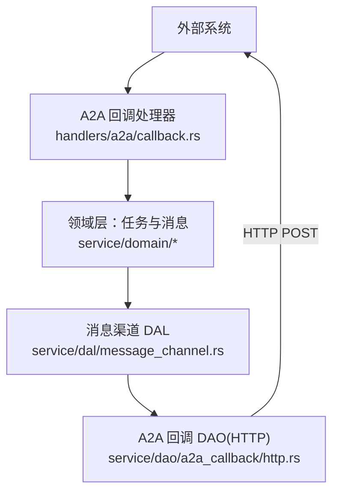
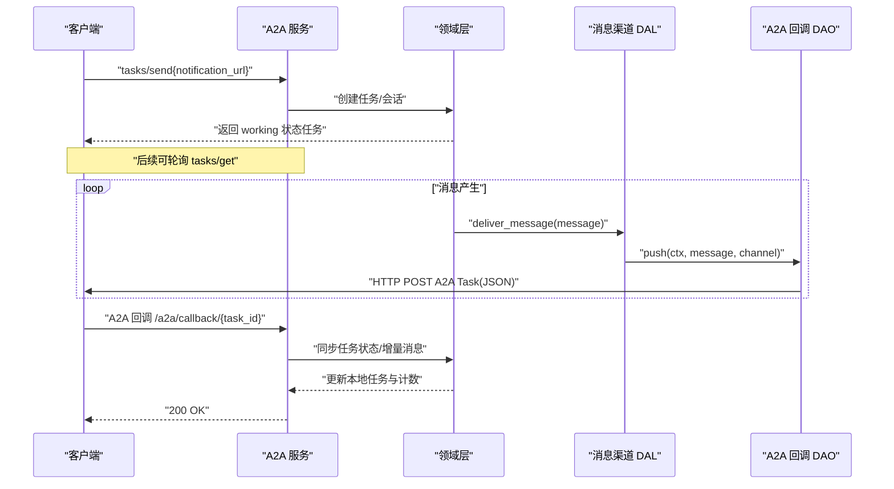
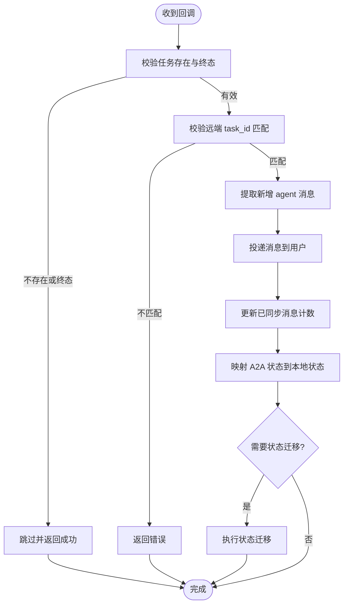
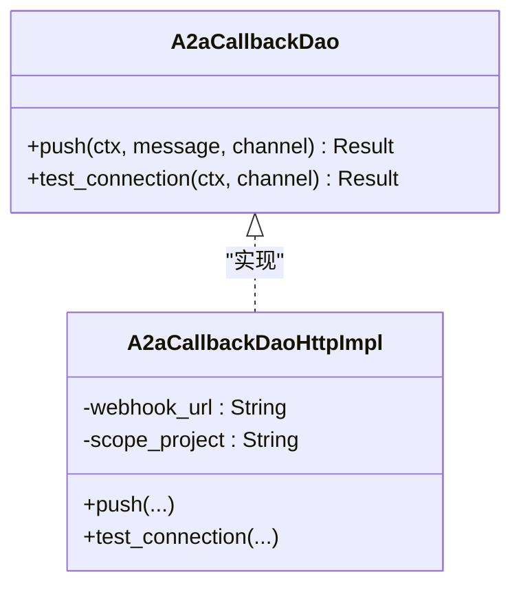
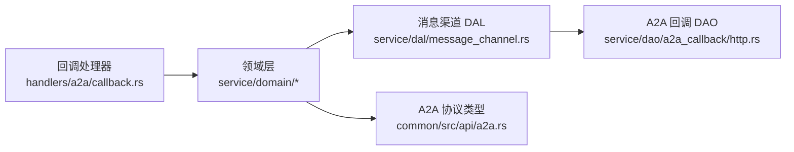

# 回调系统

<cite>
**本文引用的文件**
- [src/handlers/a2a/callback.rs](src/handlers/a2a/callback.rs)
- [src/service/dao/a2a_callback/mod.rs](src/service/dao/a2a_callback/mod.rs)
- [src/service/dao/a2a_callback/http.rs](src/service/dao/a2a_callback/http.rs)
- [common/src/api/a2a.rs](common/src/api/a2a.rs)
- [src/models/events/a2a_task_update.rs](src/models/events/a2a_task_update.rs)
- [src/handlers/a2a/send_task.rs](src/handlers/a2a/send_task.rs)
- [src/service/dal/message_channel.rs](src/service/dal/message_channel.rs)
- [src/service/domain/message/delivery.rs](src/service/domain/message/delivery.rs)
- [docs/message_channel_design.md](docs/message_channel_design.md)
- [src/consumer/message.rs](src/consumer/message.rs)
- [src/pkg/aop/core/registry.rs](src/pkg/aop/core/registry.rs)
</cite>

## 目录
1. [简介](#简介)
2. [项目结构](#项目结构)
3. [核心组件](#核心组件)
4. [架构总览](#架构总览)
5. [详细组件分析](#详细组件分析)
6. [依赖关系分析](#依赖关系分析)
7. [性能与可靠性](#性能与可靠性)
8. [故障排查指南](#故障排查指南)
9. [结论](#结论)
10. [附录：集成示例与最佳实践](#附录：集成示例与最佳实践)

## 简介
本文件面向 A2A 协议的回调系统，系统性说明事件驱动与异步通知处理、回调 URL 注册、回调消息格式、重试策略、安全性验证、队列管理、失败处理与监控告警，并给出回调事件的类型定义、数据结构和业务语义。文档严格遵循项目的四层单向调用规范（Adapter → Domain → DAL → DAO），所有公共方法首参为 RequestContext，跨层传递使用 ctx.clone()。

## 项目结构
A2A 回调系统涉及以下关键层次与模块：
- Adapter 层（HTTP Handler）
  - 接收外部 A2A 任务回调请求，解析并路由到领域逻辑。
- Domain 层
  - 负责任务状态同步、消息投递编排、渠道分发决策。
- DAL 层
  - 封装消息渠道的测试与投递能力，按 ChannelType 分派到具体实现。
- DAO 层
  - A2A Callback 渠道的具体 HTTP 推送实现，构造 A2A Task JSON 并 POST 到客户端 webhook_url。

图表来源
- [src/handlers/a2a/callback.rs:17-198](src/handlers/a2a/callback.rs#L17-L198)
- [src/service/dal/message_channel.rs:208-241](src/service/dal/message_channel.rs#L208-L241)
- [src/service/dao/a2a_callback/http.rs:43-145](src/service/dao/a2a_callback/http.rs#L43-L145)

章节来源
- [src/handlers/a2a/callback.rs:17-198](src/handlers/a2a/callback.rs#L17-L198)
- [src/service/dal/message_channel.rs:208-241](src/service/dal/message_channel.rs#L208-L241)
- [src/service/dao/a2a_callback/http.rs:43-145](src/service/dao/a2a_callback/http.rs#L43-L145)

## 核心组件
- A2A 回调处理器（Adapter）
  - 职责：校验任务存在性与终态、校验远端 task_id、提取新消息、更新本地任务状态与同步计数。
  - 入口：handle_a2a_callback(task_id, A2aTask)。
- A2A 回调 DAO（DAO）
  - 职责：将消息变更构建为完整 A2A Task JSON，POST 到客户端注册的 webhook_url；提供连接测试能力。
  - 接口：push(ctx, message, channel)、test_connection(ctx, channel)。
- 消息渠道 DAL（DAL）
  - 职责：根据用户活跃渠道进行分发；对 A2aCallback 类型走专用 DAO。
- 领域层（Domain）
  - 职责：任务状态转换、消息投递编排、SSE 与多渠道聚合结果判定。
- A2A 协议类型（Common）
  - 职责：定义 A2aTask、A2aMessage、A2aTaskState 等共享数据结构。

章节来源
- [src/handlers/a2a/callback.rs:17-198](src/handlers/a2a/callback.rs#L17-L198)
- [src/service/dao/a2a_callback/mod.rs:10-49](src/service/dao/a2a_callback/mod.rs#L10-L49)
- [src/service/dal/message_channel.rs:208-241](src/service/dal/message_channel.rs#L208-L241)
- [common/src/api/a2a.rs:147-265](common/src/api/a2a.rs#L147-L265)

## 架构总览
A2A 回调系统采用事件驱动与异步通知相结合的模式：
- 服务端通过 tasks/send 创建任务时，若携带 notification_url，则自动创建 A2aCallback 渠道（PushNotifications）。
- 任务运行过程中产生的消息变更，会通过消息渠道 DAL 分发到各渠道；A2aCallback 渠道会构造完整 A2A Task 并 POST 到客户端 webhook_url。
- 同时，系统支持两种“拉取”模式：
  - 客户端轮询 tasks/get 获取任务最新状态与消息历史。
  - 外部系统通过 A2A 回调接口将任务状态与消息推送到本系统的回调处理器，用于反向同步。

图表来源
- [src/handlers/a2a/send_task.rs:93-127](src/handlers/a2a/send_task.rs#L93-L127)
- [src/service/dal/message_channel.rs:224-241](src/service/dal/message_channel.rs#L224-L241)
- [src/service/dao/a2a_callback/http.rs:43-145](src/service/dao/a2a_callback/http.rs#L43-L145)
- [src/handlers/a2a/callback.rs:17-198](src/handlers/a2a/callback.rs#L17-L198)

## 详细组件分析

### 回调处理器（Adapter）
- 输入：task_id、A2aTask（包含 messages、status）。
- 校验：
  - 任务存在且非终态（Completed/Cancelled/Archived）。
  - 任务标签中必须包含远端 task_id，并与回调中的 id 一致。
- 处理：
  - 提取新增 agent/assistant 消息，转换为本地消息并投递给用户。
  - 更新任务标签中的已同步消息计数。
  - 根据 A2aTaskState 映射到本地 TaskStatus 并尝试状态迁移。
- 输出：统一返回 {ok: true}。

图表来源
- [src/handlers/a2a/callback.rs:17-198](src/handlers/a2a/callback.rs#L17-L198)
- [src/models/events/a2a_task_update.rs:1-36](src/models/events/a2a_task_update.rs#L1-L36)

章节来源
- [src/handlers/a2a/callback.rs:17-198](src/handlers/a2a/callback.rs#L17-L198)
- [src/models/events/a2a_task_update.rs:1-36](src/models/events/a2a_task_update.rs#L1-L36)

### A2A 回调 DAO（HTTP 推送）
- 输入：ctx、message、channel（含 webhook_url、scope_project）。
- 处理：
  - 校验 webhook_url 与 scope_project。
  - 查询项目与该项目下的全部消息，映射为 A2A 消息列表。
  - 构造 A2aTask（id=project_id，status 映射自项目状态，messages 为全量历史）。
  - 序列化后以 application/json 发送 POST 请求，超时 10 秒。
  - 非 2xx 响应视为失败，记录错误信息。
- 测试连接：使用空消息执行一次 push。

图表来源
- [src/service/dao/a2a_callback/mod.rs:10-49](src/service/dao/a2a_callback/mod.rs#L10-L49)
- [src/service/dao/a2a_callback/http.rs:43-157](src/service/dao/a2a_callback/http.rs#L43-L157)

章节来源
- [src/service/dao/a2a_callback/mod.rs:10-49](src/service/dao/a2a_callback/mod.rs#L10-L49)
- [src/service/dao/a2a_callback/http.rs:43-157](src/service/dao/a2a_callback/http.rs#L43-L157)

### 消息渠道 DAL（分发与测试）
- 测试连接：按 ChannelType 分派到对应 DAO；A2aCallback 类型直接调用其 test_connection。
- 消息分发：
  - 查询用户活跃渠道。
  - 对每个渠道调用 deliver_message；A2aCallback 走专用 DAO。
  - 聚合成功/失败统计，供上层重试与告警。

章节来源
- [src/service/dal/message_channel.rs:208-241](src/service/dal/message_channel.rs#L208-L241)
- [docs/message_channel_design.md:23-37](docs/message_channel_design.md#L23-L37)

### 领域层（消息投递编排）
- 投递流程：
  - 先投递到消息渠道（飞书/A2A 回调等）。
  - 再投递到 SSE（实时推送给前端）。
  - 当所有渠道均失败且无 SSE 投递时，返回错误以触发重试。
- 重试策略：
  - 由 AOP 消费者在 worker 循环中调用 queue.ack/nack，确保失败事件重新入队等待重试。

章节来源
- [src/service/domain/message/delivery.rs:381-390](src/service/domain/message/delivery.rs#L381-L390)
- [src/pkg/aop/core/registry.rs:94-120](src/pkg/aop/core/registry.rs#L94-L120)

### A2A 协议类型与消息格式
- A2aTask：包含 id、session_id、status、messages、artifacts、metadata。
- A2aTaskStatus：state（Submitted/Working/InputRequired/Completed/Failed/Canceled）、timestamp、message。
- A2aMessage：role（user/agent/system）、parts（Text/File/Data）、message_id、task_id。
- SendTaskParams：支持 notification_url 字段，开启 PushNotifications。

章节来源
- [common/src/api/a2a.rs:147-265](common/src/api/a2a.rs#L147-L265)
- [common/src/api/a2a.rs:267-288](common/src/api/a2a.rs#L267-L288)

## 依赖关系分析
- Adapter 仅依赖 Domain 与 Common 类型，不直接访问 DAO。
- Domain 通过 DAL 抽象渠道能力，避免与具体 DAO 耦合。
- DAL 通过 match 分派到具体 DAO，保持扩展性。
- DAO 仅关注 HTTP 推送与数据序列化，无业务判断。

图表来源
- [src/handlers/a2a/callback.rs:17-198](src/handlers/a2a/callback.rs#L17-L198)
- [src/service/dal/message_channel.rs:208-241](src/service/dal/message_channel.rs#L208-L241)
- [src/service/dao/a2a_callback/http.rs:43-145](src/service/dao/a2a_callback/http.rs#L43-L145)
- [common/src/api/a2a.rs:147-265](common/src/api/a2a.rs#L147-L265)

章节来源
- [src/handlers/a2a/callback.rs:17-198](src/handlers/a2a/callback.rs#L17-L198)
- [src/service/dal/message_channel.rs:208-241](src/service/dal/message_channel.rs#L208-L241)
- [src/service/dao/a2a_callback/http.rs:43-145](src/service/dao/a2a_callback/http.rs#L43-L145)
- [common/src/api/a2a.rs:147-265](common/src/api/a2a.rs#L147-L265)

## 性能与可靠性
- 推送性能
  - 每次推送都会查询项目下全部消息并构造完整 A2A Task，适合中小规模项目；大规模场景建议分页或增量推送。
  - HTTP 请求设置 10 秒超时，避免阻塞。
- 可靠性
  - 所有渠道投递失败且无 SSE 投递时返回错误，触发 AOP 重试机制。
  - 回调处理器幂等：基于已同步消息计数与终态检查，避免重复处理。
- 监控告警
  - 日志记录回调处理、状态迁移、推送失败等关键路径。
  - 可通过 AOP 指标收集与队列积压统计进行监控。

[本节为通用指导，无需特定文件引用]

## 故障排查指南
- 常见问题
  - 回调任务 ID 不匹配：检查任务标签中的远端 task_id 是否与回调 id 一致。
  - 缺少 webhook_url 或 scope_project：确认 A2aCallback 渠道配置是否完整。
  - 推送失败：检查目标服务器返回状态码与响应体，定位网络或认证问题。
  - 消息未同步：检查已同步消息计数标签是否更新，确认消费端 ack/nack 是否正确。
- 定位步骤
  - 查看回调处理器日志，确认任务状态与消息数量变化。
  - 查看 DAL 分发结果，确认 A2aCallback 渠道是否被命中。
  - 查看 DAO 推送日志，确认 HTTP 请求与响应。
  - 检查 AOP 队列状态，确认失败事件是否重试。

章节来源
- [src/handlers/a2a/callback.rs:17-198](src/handlers/a2a/callback.rs#L17-L198)
- [src/service/dao/a2a_callback/http.rs:43-145](src/service/dao/a2a_callback/http.rs#L43-L145)
- [src/pkg/aop/core/registry.rs:94-120](src/pkg/aop/core/registry.rs#L94-L120)

## 结论
A2A 回调系统通过清晰的层次划分与事件驱动模型，实现了可靠的任务状态同步与消息推送。回调处理器保证幂等与一致性，DAO 层专注 HTTP 推送，DAL 层提供可扩展的渠道分发能力。结合 AOP 重试与日志监控，系统在稳定性与可观测性方面具备良好基础。

[本节为总结，无需特定文件引用]

## 附录：集成示例与最佳实践

### 服务端回调配置
- 在 tasks/send 中提供 notification_url，系统将自动创建 A2aCallback 渠道并绑定项目范围。
- 确保 webhook_url 可达且能正确处理 application/json 的 A2A Task 请求。

章节来源
- [src/handlers/a2a/send_task.rs:93-127](src/handlers/a2a/send_task.rs#L93-L127)

### 客户端回调接收
- 暴露回调接口，接收 POST 请求，解析 A2aTask。
- 校验任务存在性与远端 task_id 匹配。
- 增量处理新增 agent 消息，更新本地同步计数。
- 根据 A2aTaskState 映射到本地状态并迁移。

章节来源
- [src/handlers/a2a/callback.rs:17-198](src/handlers/a2a/callback.rs#L17-L198)
- [src/models/events/a2a_task_update.rs:1-36](src/models/events/a2a_task_update.rs#L1-L36)

### 错误处理最佳实践
- 回调处理器对非终态任务进行幂等处理，避免重复同步。
- DAO 层对 HTTP 失败进行明确错误分类，便于上层重试与告警。
- 领域层在所有渠道失败时返回错误，触发 AOP 重试机制。

章节来源
- [src/handlers/a2a/callback.rs:17-198](src/handlers/a2a/callback.rs#L17-L198)
- [src/service/dao/a2a_callback/http.rs:43-145](src/service/dao/a2a_callback/http.rs#L43-L145)
- [src/service/domain/message/delivery.rs:381-390](src/service/domain/message/delivery.rs#L381-L390)
- [src/pkg/aop/core/registry.rs:94-120](src/pkg/aop/core/registry.rs#L94-L120)

### 回调事件类型定义与业务语义
- A2aTask：表示一个任务的全量视图，包含状态、消息与产物。
- A2aTaskState：描述任务生命周期阶段，映射到本地任务状态。
- A2aMessage：描述单条消息的角色与内容，支持文本、文件与结构化数据。
- 业务语义：回调用于双向同步，既可由服务端主动推送，也可由外部系统回调更新本地状态。

章节来源
- [common/src/api/a2a.rs:147-265](common/src/api/a2a.rs#L147-L265)

### 安全性与防重放
- 当前回调处理器通过远端 task_id 与本地标签匹配进行基本校验。
- 建议在客户端与服务端之间引入签名机制（如 HMAC-SHA256）与时间戳校验，防止重放攻击。
- 可在 DAO 层增加请求头白名单与 IP 限制，增强接入安全。

[本节为通用建议，无需特定文件引用]

### 回调队列管理与监控告警
- 队列管理：AOP 消费者在 worker 循环中正确调用 queue.ack/nack，确保失败事件重试与内存清理。
- 监控告警：记录回调处理、推送失败、状态迁移等关键日志；结合 AOP 指标收集队列积压与最老事件年龄。

章节来源
- [src/pkg/aop/core/registry.rs:94-120](src/pkg/aop/core/registry.rs#L94-L120)
- （2026-09-04 清理：superpowers 目录已归档，待 doc-maintainer 跟进）