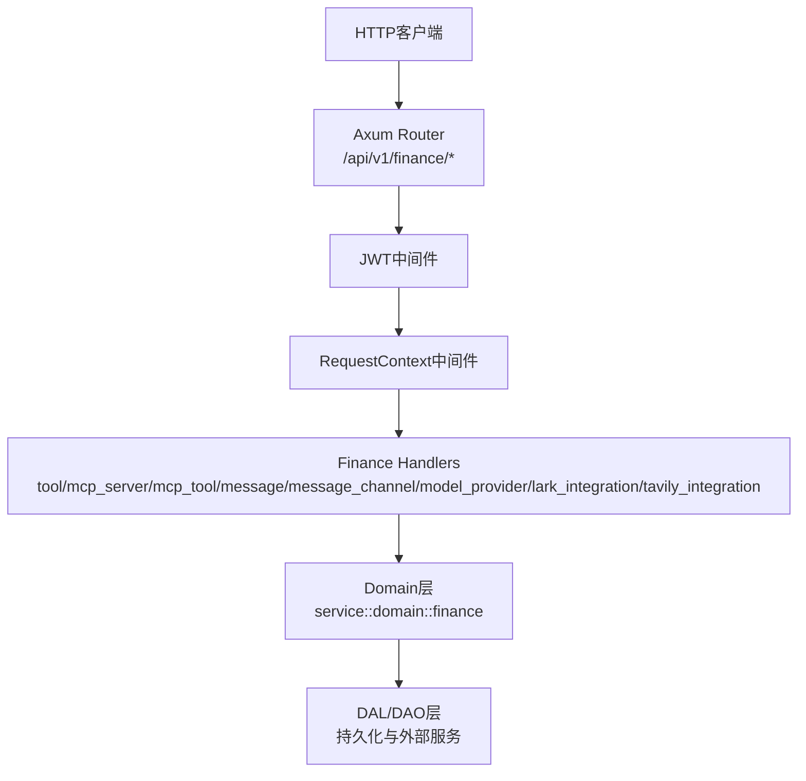
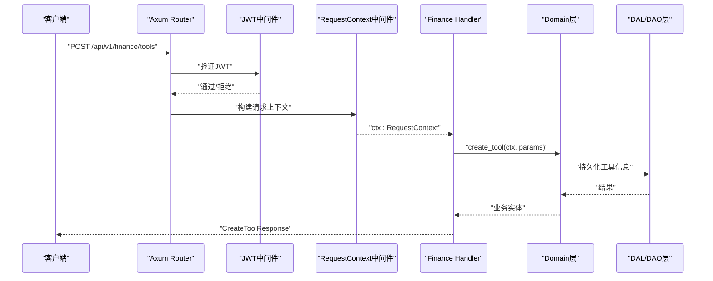
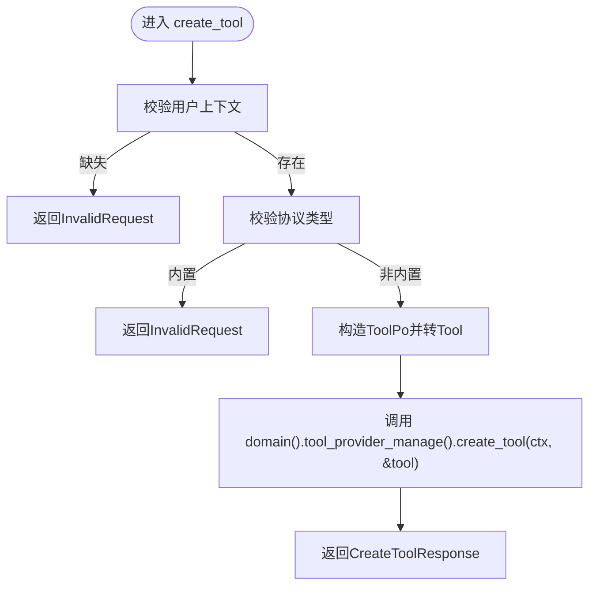
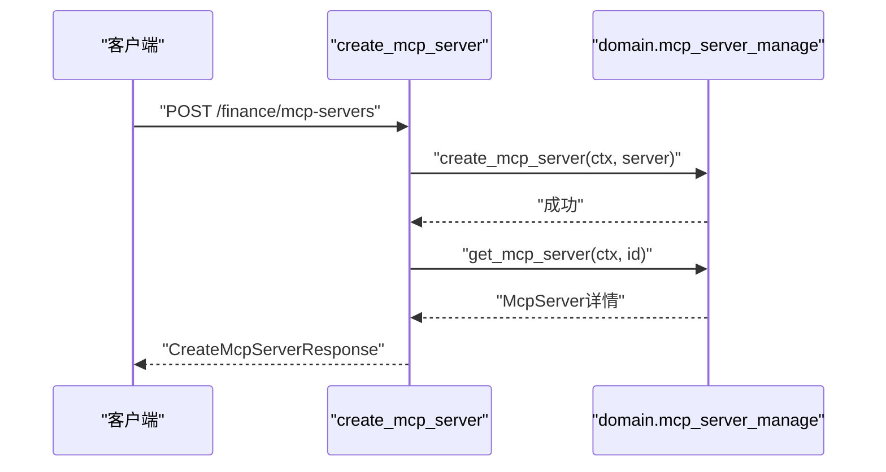
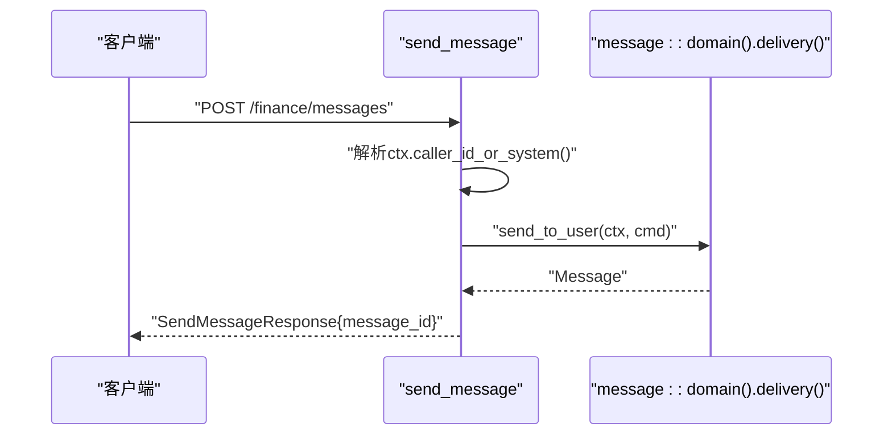
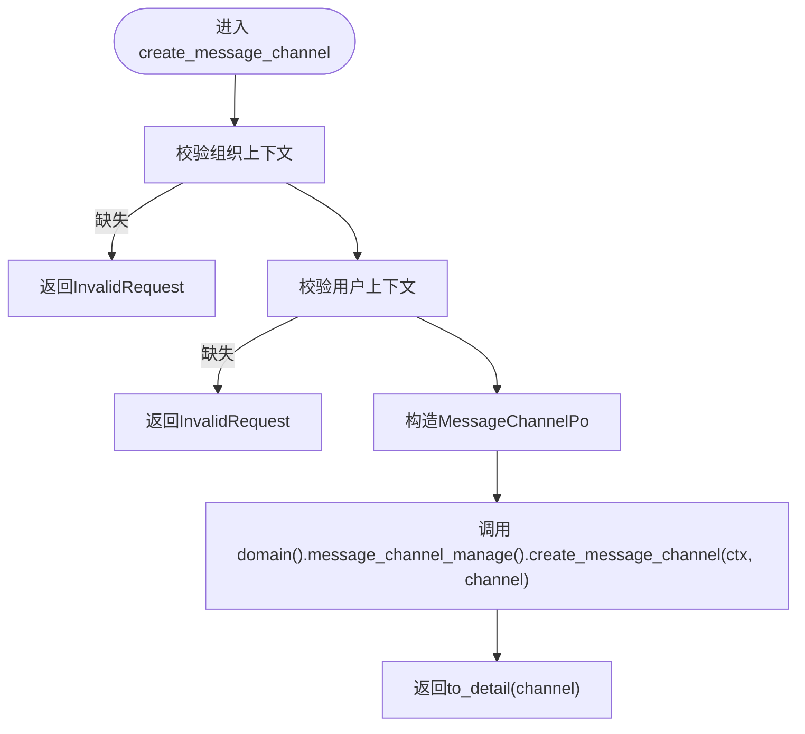
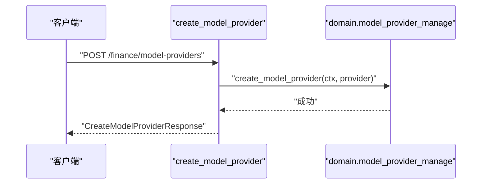
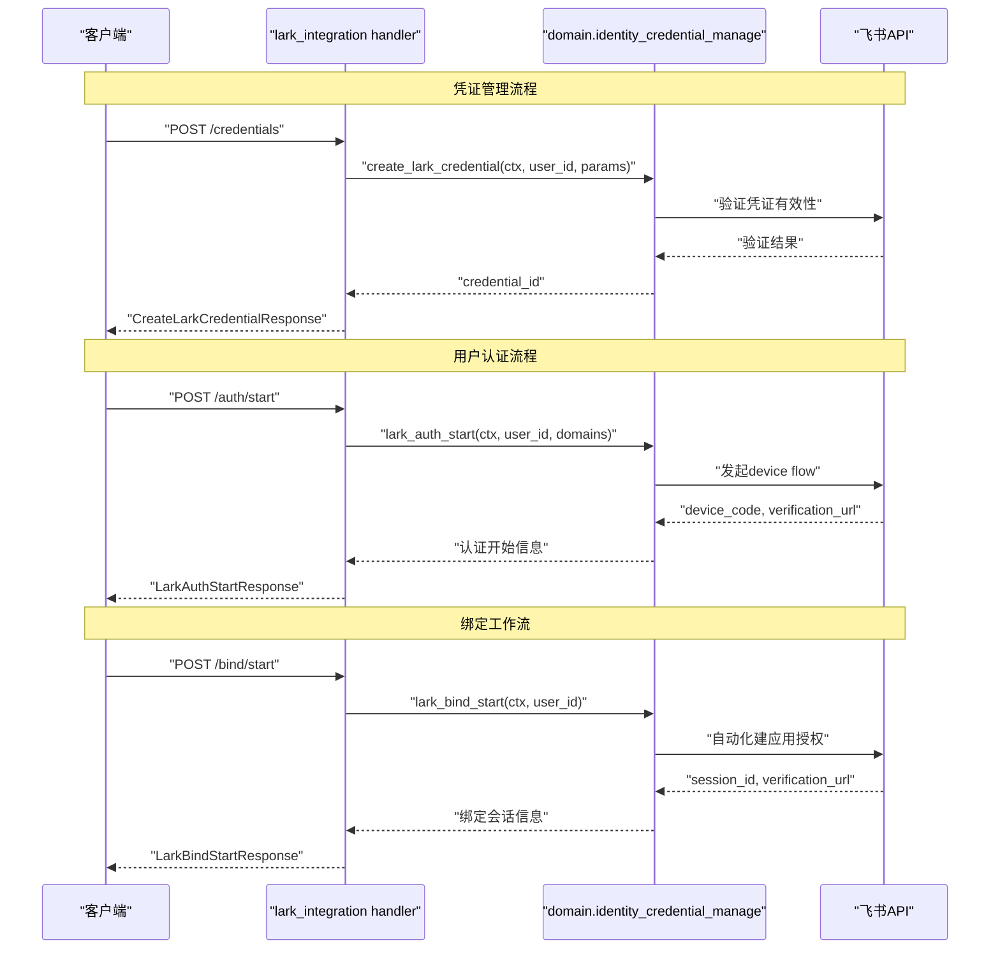
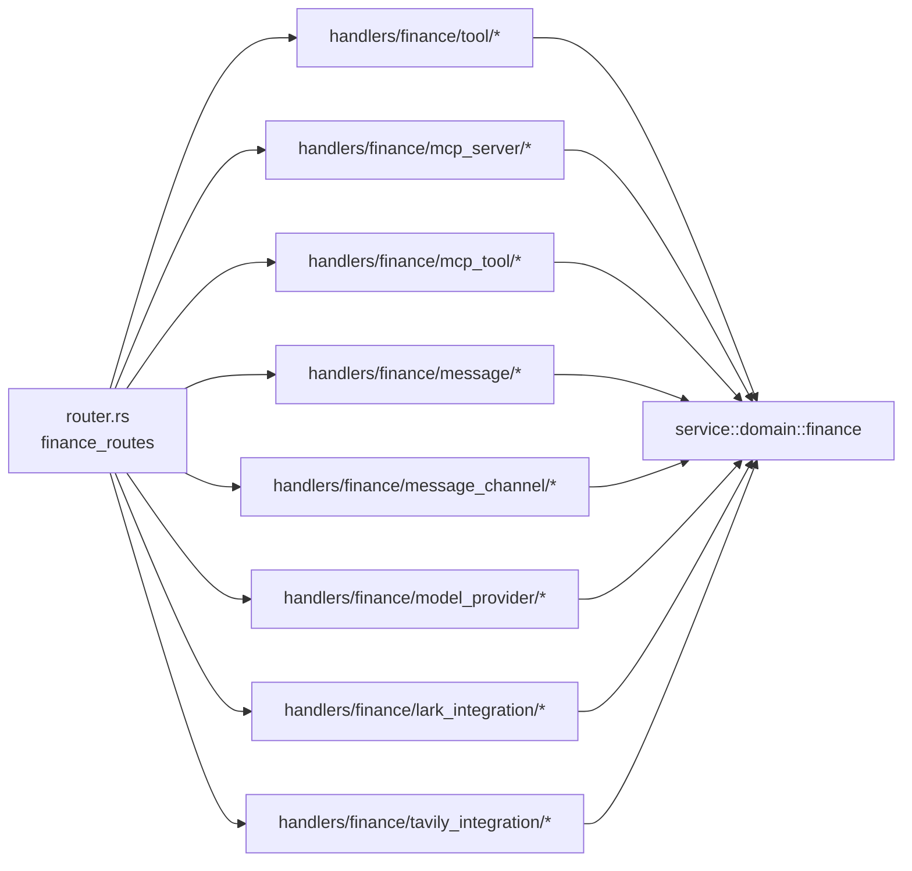

# Finance模块处理器

<cite>
**本文引用的文件**
- [src/handlers/finance/mod.rs](src/handlers/finance/mod.rs)
- [src/router.rs](src/router.rs)
- [common/src/api/mod.rs](common/src/api/mod.rs)
- [common/src/api/lark_integration.rs](common/src/api/lark_integration.rs)
- [src/handlers/finance/tool/mod.rs](src/handlers/finance/tool/mod.rs)
- [src/handlers/finance/mcp_server/mod.rs](src/handlers/finance/mcp_server/mod.rs)
- [src/handlers/finance/message/mod.rs](src/handlers/finance/message/mod.rs)
- [src/handlers/finance/model_provider/mod.rs](src/handlers/finance/model_provider/mod.rs)
- [src/handlers/finance/message_channel/mod.rs](src/handlers/finance/message_channel/mod.rs)
- [src/handlers/finance/lark_integration/mod.rs](src/handlers/finance/lark_integration/mod.rs)
- [src/handlers/finance/lark_integration/create_credential.rs](src/handlers/finance/lark_integration/create_credential.rs)
- [src/handlers/finance/lark_integration/update_credential.rs](src/handlers/finance/lark_integration/update_credential.rs)
- [src/handlers/finance/lark_integration/delete_credential.rs](src/handlers/finance/lark_integration/delete_credential.rs)
- [src/handlers/finance/lark_integration/set_default_credential.rs](src/handlers/finance/lark_integration/set_default_credential.rs)
- [src/handlers/finance/lark_integration/auth_start.rs](src/handlers/finance/lark_integration/auth_start.rs)
- [src/handlers/finance/lark_integration/bind_start.rs](src/handlers/finance/lark_integration/bind_start.rs)
- [src/handlers/finance/lark_integration/get_status.rs](src/handlers/finance/lark_integration/get_status.rs)
- [src/handlers/finance/github_integration/create_credential.rs](src/handlers/finance/github_integration/create_credential.rs)
- [src/handlers/finance/github_integration/update_credential.rs](src/handlers/finance/github_integration/update_credential.rs)
- [src/handlers/finance/github_integration/delete_credential.rs](src/handlers/finance/github_integration/delete_credential.rs)
- [src/handlers/finance/github_integration/set_default_credential.rs](src/handlers/finance/github_integration/set_default_credential.rs)
- [src/service/domain/finance/identity_credential.rs](src/service/domain/finance/identity_credential.rs)
- [src/models/user_credential.rs](src/models/user_credential.rs)
- [src/service/dao/user_credential/mod.rs](src/service/dao/user_credential/mod.rs)
- [src/service/dao/user_credential/sqlite.rs](src/service/dao/user_credential/sqlite.rs)
- [migrations/20260420000000_initial.sql](migrations/20260420000000_initial.sql)
- [docs/plan/用户身份凭证独立表落地.md](docs/plan/用户身份凭证独立表落地.md)
- [src/handlers/finance/tool/create_tool.rs](src/handlers/finance/tool/create_tool.rs)
- [src/handlers/finance/mcp_server/create_mcp_server.rs](src/handlers/finance/mcp_server/create_mcp_server.rs)
- [src/handlers/finance/message/send_message.rs](src/handlers/finance/message/send_message.rs)
- [src/handlers/finance/model_provider/create_model_provider.rs](src/handlers/finance/model_provider/create_model_provider.rs)
- [src/handlers/finance/message_channel/create_message_channel.rs](src/handlers/finance/message_channel/create_message_channel.rs)
- [src/handlers/finance/tavily_integration/mod.rs](src/handlers/finance/tavily_integration/mod.rs)
- [src/handlers/finance/tavily_integration/create_credential.rs](src/handlers/finance/tavily_integration/create_credential.rs)
- [src/handlers/finance/tavily_integration/update_credential.rs](src/handlers/finance/tavily_integration/update_credential.rs)
- [src/handlers/finance/tavily_integration/delete_credential.rs](src/handlers/finance/tavily_integration/delete_credential.rs)
- [src/handlers/finance/tavily_integration/set_default_credential.rs](src/handlers/finance/tavily_integration/set_default_credential.rs)
- [src/handlers/finance/tavily_integration/get_status.rs](src/handlers/finance/tavily_integration/get_status.rs)
- [src/handlers/finance/mcp_tool/list_mcp_tools_by_server.rs](src/handlers/finance/mcp_tool/list_mcp_tools_by_server.rs)
- [src/handlers/finance/mcp_tool/sync_mcp_tools.rs](src/handlers/finance/mcp_tool/sync_mcp_tools.rs)
- [src/handlers/finance/tool/search_tools.rs](src/handlers/finance/tool/search_tools.rs)
- [src/handlers/finance/tool/query_tools.rs](src/handlers/finance/tool/query_tools.rs)
- [src/handlers/finance/tool/list_tools.rs](src/handlers/finance/tool/list_tools.rs)
- [common/src/api/tavily_integration.rs](common/src/api/tavily_integration.rs)
- [frontend/src/pages/finance/identity_tavily.rs](frontend/src/pages/finance/identity_tavily.rs)
- [frontend/src/api/tavily_integration.rs](frontend/src/api/tavily_integration.rs)
</cite>

## 更新摘要
**变更内容（2026-08-19 增量更新）**
- **新增 Tavily 集成（tavily_integration）子模块**：凭证 CRUD、默认凭证设置、集成状态聚合
- **新增 MCP 工具列表处理器**：list_mcp_tools_by_server、sync_mcp_tools 完整引用
- **补充工具搜索/查询/列表处理器**：search_tools、query_tools、list_tools 详细引用
- 新增 Tavily 集成前端页面与 API 客户端引用
- 路由新增 `/api/v1/finance/identity/tavily/*` 路由组
- 更新 Finance 模块架构图与核心组件列表

## 目录
1. [简介](#简介)
2. [项目结构](#项目结构)
3. [核心组件](#核心组件)
4. [架构总览](#架构总览)
5. [详细组件分析](#详细组件分析)
6. [依赖分析](#依赖分析)
7. [性能考虑](#性能考虑)
8. [故障排查指南](#故障排查指南)
9. [结论](#结论)
10. [附录：API调用示例与集成指南](#附录api调用示例与集成指南)

## 简介
本文件面向 Finance（财务管理）模块的 HTTP 处理器，覆盖工具管理、MCP服务器管理、消息系统、模型提供商管理以及新增的飞书集成功能。文档聚焦于各子模块处理器的职责分工、接口设计、参数绑定与响应格式；并梳理工具注册、执行与调试流程，MCP服务器连接管理，消息发送接收机制，模型提供商配置与测试能力，以及飞书集成的完整工作流程。同时提供复杂业务场景的处理思路、错误处理策略、性能优化建议与集成指南。

## 项目结构
Finance 模块位于 handlers/finance，按功能域划分为多个子模块：
- tool：工具生命周期管理与调用调试
- mcp_server：MCP服务器配置与状态管理
- mcp_tool：MCP 工具同步（sync_mcp_tools）与列表查询（list_mcp_tools_by_server）
- message：消息发送、列表、搜索与SSE订阅
- message_channel：消息通道（如飞书、微信、邮件、Slack等）配置与管理
- model_provider：模型提供商配置、切换、测试与向量重建任务
- **lark_integration**：**新增** 飞书集成管理，包括凭证CRUD、用户认证、绑定工作流
- **tavily_integration**：**新增** Tavily 搜索集成，包括凭证 CRUD、默认凭证、集成状态聚合

路由统一在 router.rs 中注册到 /api/v1/finance 下，受 JWT 认证保护，部分端点额外要求管理员角色。

**图表来源**
- [src/router.rs:104-136](src/router.rs#L104-L136)
- [src/router.rs:217-247](src/router.rs#L217-L247)

**章节来源**
- [src/handlers/finance/mod.rs:1-16](src/handlers/finance/mod.rs#L1-L16)
- [src/router.rs:217-247](src/router.rs#L217-L247)

## 核心组件
- 工具管理（tool）
  - 职责：创建、查询、更新、删除工具；绑定/解绑至Agent；工具标签管理；工具调用入口与调试；工具调用记录查询。
  - 关键处理器：create_tool、list_tools、query_tools、search_tools、get_tool、update_tool、update_tool_status、delete_tool、bind_tool_to_agent、unbind_tool_from_agent、debug_call_tool、request_tool_call、send_tool_call_message、list_tool_tags、query_tool_call_entries、get_tool_call_entry。
- MCP服务器管理（mcp_server）
  - 职责：创建、查询、更新、删除MCP服务器；状态变更；用于后续工具发现与调用。
  - 关键处理器：create_mcp_server、list_mcp_servers、get_mcp_server、update_mcp_server、update_mcp_server_status、delete_mcp_server。
- MCP工具（mcp_tool）
  - 职责：按服务器同步工具清单；按服务器列出工具。
  - 关键处理器：sync_mcp_tools、list_mcp_tools_by_server。
- 消息系统（message）
  - 职责：向用户或Agent发送消息；消息列表与搜索；SSE订阅实时推送。
  - 关键处理器：send_message、send_message_to_agent、send_task_assignment_message、list_messages、search_messages、subscribe_sse。
- 消息通道（message_channel）
  - 职责：创建、查询、更新、删除消息通道；测试通道连通性；状态管理。
  - 关键处理器：create_message_channel、list_message_channels、get_message_channel、update_message_channel、update_message_channel_status、test_message_channel_connection、delete_message_channel。
- 模型提供商（model_provider）
  - 职责：创建、查询、更新、删除模型提供商；测试连接；切换嵌入模型；向量重建任务与进度查询；直接调用模型。
  - 关键处理器：create_model_provider、list_model_providers、get_model_provider、update_model_provider、delete_model_provider、test_connection、switch_embedding、rebuild_vectors_task、rebuild_progress、call_model。
- **飞书集成（lark_integration）**：**新增**
  - 职责：管理飞书应用凭证、用户OAuth认证、绑定工作流、状态聚合查询。
  - 关键处理器：create_credential、update_credential、delete_credential、set_default_credential、auth_start、auth_complete、auth_status、auth_logout、bind_start、bind_status、bind_cancel、get_status。
- **Tavily 集成（tavily_integration）**：**新增**
  - 职责：管理 Tavily 搜索 API Key 凭证、默认凭证设置、集成状态聚合（个人凭证快照 + 实例共享 key 配置状态）。
  - 关键处理器：create_credential、update_credential、delete_credential、set_default_credential、get_status。
  - 路由：`/api/v1/finance/identity/tavily/*`（status、credentials CRUD、credentials/default）
  - 前端页面：`identity_tavily.rs`（凭证列表/创建/编辑/设默认/删除）

**章节来源**
- [src/handlers/finance/tool/mod.rs:1-46](src/handlers/finance/tool/mod.rs#L1-L46)
- [src/handlers/finance/mcp_server/mod.rs:1-24](src/handlers/finance/mcp_server/mod.rs#L1-L24)
- [src/handlers/finance/mcp_tool/mod.rs:1-20](src/handlers/finance/mcp_tool/mod.rs#L1-L20)
- [src/handlers/finance/message/mod.rs:1-17](src/handlers/finance/message/mod.rs#L1-L17)
- [src/handlers/finance/message_channel/mod.rs:1-22](src/handlers/finance/message_channel/mod.rs#L1-L22)
- [src/handlers/finance/model_provider/mod.rs:1-25](src/handlers/finance/model_provider/mod.rs#L1-L25)
- [src/handlers/finance/lark_integration/mod.rs:1-18](src/handlers/finance/lark_integration/mod.rs#L1-L18)
- [src/handlers/finance/tavily_integration/mod.rs:1-12](src/handlers/finance/tavily_integration/mod.rs#L1-L12)

## 架构总览
Finance 模块遵循四层单向调用：Adapter（HTTP Handler）→ Domain → DAL → DAO。Handler 仅负责参数校验、上下文提取与响应组装；业务逻辑下沉至 Domain，数据访问通过 DAL/DAO。所有公共方法首参为 ctx: RequestContext，跨层传递使用 ctx.clone()。

**图表来源**
- [src/router.rs:104-136](src/router.rs#L104-L136)
- [src/handlers/finance/tool/create_tool.rs:1-72](src/handlers/finance/tool/create_tool.rs#L1-L72)

**章节来源**
- [src/router.rs:104-136](src/router.rs#L104-L136)

## 详细组件分析

### 工具管理（tool）
- 职责与边界
  - 工具CRUD、标签管理、Agent绑定/解绑、调用调试、调用记录查询。
  - 内置工具由系统同步，管理接口禁止创建。
- 参数绑定与响应
  - 请求体使用 common::api::* 中的统一DTO；响应遵循 ApiResponse<T> 包装。
  - 分页查询返回 PagedResult<T>。
- 典型流程
  - 创建工具：校验用户上下文与协议类型，构造 ToolPo，转换为 Tool 后调用 domain().tool_provider_manage().create_tool(ctx, &tool)。
  - 调试调用：需管理员角色，便于安全隔离。
- 错误处理
  - 缺少用户上下文或非法协议时返回 InvalidRequest。
  - 权限不足时由 require_role_middleware 拦截。

**图表来源**
- [src/handlers/finance/tool/create_tool.rs:1-72](src/handlers/finance/tool/create_tool.rs#L1-L72)

**章节来源**
- [src/handlers/finance/tool/mod.rs:1-46](src/handlers/finance/tool/mod.rs#L1-L46)
- [src/handlers/finance/tool/create_tool.rs:1-72](src/handlers/finance/tool/create_tool.rs#L1-L72)
- [src/router.rs:557-601](src/router.rs#L557-L601)

### MCP服务器管理（mcp_server）
- 职责与边界
  - 管理MCP服务器配置（名称、传输方式、配置），支持启用/禁用与删除。
- 参数绑定与响应
  - 请求体使用 CreateMcpServerRequest；响应使用 to_detail 转换后的详情。
- 典型流程
  - 创建服务器：生成ID，构造 McpServer，调用 domain().mcp_server_manage().create_mcp_server(ctx, &server)，再获取详情返回。

**图表来源**
- [src/handlers/finance/mcp_server/create_mcp_server.rs:1-48](src/handlers/finance/mcp_server/create_mcp_server.rs#L1-L48)

**章节来源**
- [src/handlers/finance/mcp_server/mod.rs:1-24](src/handlers/finance/mcp_server/mod.rs#L1-L24)
- [src/handlers/finance/mcp_server/create_mcp_server.rs:1-48](src/handlers/finance/mcp_server/create_mcp_server.rs#L1-L48)
- [src/router.rs:525-548](src/router.rs#L525-L548)

### 消息系统（message）
- 职责与边界
  - 支持向用户、Agent发送消息；支持任务指派消息；提供消息列表、搜索与SSE订阅。
- 参数绑定与响应
  - 发送消息使用 SendMessageParams；响应包含 message_id。
- 典型流程
  - 发送消息：从 ctx 获取 from_agent_id_or_system，构造 SendToUserCommand，调用 message::domain().delivery().send_to_user(ctx, cmd)。

**图表来源**
- [src/handlers/finance/message/send_message.rs:1-41](src/handlers/finance/message/send_message.rs#L1-L41)

**章节来源**
- [src/handlers/finance/message/mod.rs:1-17](src/handlers/finance/message/mod.rs#L1-L17)
- [src/handlers/finance/message/send_message.rs:1-41](src/handlers/finance/message/send_message.rs#L1-L41)
- [src/router.rs:482-496](src/router.rs#L482-L496)

### 消息通道（message_channel）
- 职责与边界
  - 管理通知通道（飞书、微信、邮件、Slack、Webhook等），支持测试连通性与状态管理。
- 参数绑定与响应
  - 创建通道需要组织上下文；请求体包含多种通道特定字段；响应使用 to_detail。
- 典型流程
  - 创建通道：校验组织与用户上下文，构造 MessageChannelPo，调用 domain().message_channel_manage().create_message_channel(ctx, &channel)。

**图表来源**
- [src/handlers/finance/message_channel/create_message_channel.rs:1-79](src/handlers/finance/message_channel/create_message_channel.rs#L1-L79)

**章节来源**
- [src/handlers/finance/message_channel/mod.rs:1-22](src/handlers/finance/message_channel/mod.rs#L1-L22)
- [src/handlers/finance/message_channel/create_message_channel.rs:1-79](src/handlers/finance/message_channel/create_message_channel.rs#L1-L79)
- [src/router.rs:498-524](src/router.rs#L498-L524)

### 模型提供商（model_provider）
- 职责与边界
  - 管理AI推理提供商配置（名称、类型、能力、模型名、密钥、基础URL、描述、上下文长度等）；支持测试连接、切换嵌入模型、向量重建任务与进度查询、直接调用模型。
- 参数绑定与响应
  - 创建请求包含 provider_type、capability、max_context_length、recommended_context_length 等；响应封装配置脱敏后的字段。
- 典型流程
  - 创建提供商：构造 ModelProviderPo，设置配置，调用 domain().model_provider_manage().create_model_provider(ctx, &provider)。

**图表来源**
- [src/handlers/finance/model_provider/create_model_provider.rs:1-69](src/handlers/finance/model_provider/create_model_provider.rs#L1-L69)

**章节来源**
- [src/handlers/finance/model_provider/mod.rs:1-25](src/handlers/finance/model_provider/mod.rs#L1-L25)
- [src/handlers/finance/model_provider/create_model_provider.rs:1-69](src/handlers/finance/model_provider/create_model_provider.rs#L1-L69)
- [src/router.rs:446-480](src/router.rs#L446-L480)

### 飞书集成（lark_integration）
**新增功能**

- 职责与边界
  - 管理飞书应用凭证（CRUD）、用户OAuth device flow认证、绑定工作流、状态聚合查询。
  - 支持手动录入凭证和自动化绑定两种模式。
- 参数绑定与响应
  - 使用统一的 LarkIntegration DTOs，支持完整的认证和绑定流程。
- 核心流程
  - 凭证管理：创建、更新、删除、设置默认凭证
  - 用户认证：发起device flow、完成认证、查询状态、登出
  - 绑定工作流：启动自动绑定、查询绑定状态、取消绑定
  - 状态聚合：获取当前用户的完整绑定快照

**图表来源**
- [src/handlers/finance/lark_integration/create_credential.rs:1-34](src/handlers/finance/lark_integration/create_credential.rs#L1-L34)
- [src/handlers/finance/lark_integration/auth_start.rs:1-28](src/handlers/finance/lark_integration/auth_start.rs#L1-L28)
- [src/handlers/finance/lark_integration/bind_start.rs:1-27](src/handlers/finance/lark_integration/bind_start.rs#L1-L27)

**章节来源**
- [src/handlers/finance/lark_integration/mod.rs:1-18](src/handlers/finance/lark_integration/mod.rs#L1-L18)
- [src/handlers/finance/lark_integration/create_credential.rs:1-34](src/handlers/finance/lark_integration/create_credential.rs#L1-L34)
- [src/handlers/finance/lark_integration/auth_start.rs:1-28](src/handlers/finance/lark_integration/auth_start.rs#L1-L28)
- [src/handlers/finance/lark_integration/bind_start.rs:1-27](src/handlers/finance/lark_integration/bind_start.rs#L1-L27)
- [src/handlers/finance/lark_integration/get_status.rs:1-102](src/handlers/finance/lark_integration/get_status.rs#L1-L102)

## 依赖分析
- 路由依赖
  - finance_routes 将各处理器挂载到 /api/v1/finance/*，统一受 JWT 保护，部分端点附加 require_role_middleware（如 debug_call_tool）。
  - **新增** lark_integration_routes 专门处理飞书集成相关路由，挂载到 /api/v1/finance/identity/lark/*。
  - **新增** tavily_integration_routes 专门处理 Tavily 集成相关路由，挂载到 /api/v1/finance/identity/tavily/*。
  - mcp_tool 路由挂载到 /api/v1/finance/mcp-servers/{server_id}/tools/sync 与 /{server_id}/tools。
  - 工具搜索/查询/列表路由：/tools（GET/POST）、/tools/query（POST）、/tools/search（POST）。
- 处理器依赖
  - 各处理器依赖 common::api 中的请求/响应DTO；依赖 service::domain::finance 提供的领域服务；依赖 crate::models 中的实体对象进行转换。
- 上下文与认证
  - 中间件顺序：jwt_auth → request_context → handler；确保 ctx 中包含用户与组织信息。

**图表来源**
- [src/router.rs:415-601](src/router.rs#L415-L601)
- [src/router.rs:217-247](src/router.rs#L217-L247)

**章节来源**
- [src/router.rs:415-601](src/router.rs#L415-L601)
- [src/router.rs:217-247](src/router.rs#L217-L247)
- [common/src/api/mod.rs:1-156](common/src/api/mod.rs#L1-L156)

## 性能考虑
- 批量操作与分页
  - 列表与查询接口建议使用分页参数 limit/offset，避免一次性返回大量数据。
- 异步与后台任务
  - 向量重建等耗时操作应通过后台任务提交，并提供进度查询接口（rebuild_progress）。
- SSE流式推送
  - 消息订阅使用 SSE，减少轮询开销，提升实时性。
- 缓存与降级
  - 工具与MCP工具清单可考虑缓存；向量检索支持多后端降级（LanceDB/HNSW/InMemory/SqliteVss）。
  - **新增** 飞书集成状态查询采用三源聚合（凭证库、渠道引用、用户授权），失败时优雅降级。
- 鉴权与限流
  - 敏感操作（如 debug_call_tool）限制管理员角色；必要时结合网关层限流。
- **新增** 飞书集成优化
  - 凭证存储迁移至独立表 user_credentials（行级 CRUD，天然消解并发丢更新）
  - 默认标记作用域由 visibility 派生（private=个人默认 / public=组织默认），双部分唯一索引兜底
  - 绑定会话内存态管理，完成后清理
  - OAuth token文件系统缓存，避免重复认证
- **新增** Tavily 集成优化
  - 凭证加密存储（AES-256-GCM），API key 永不回显，仅展示尾号
  - 集成状态聚合采用双轨授权（个人凭证 + 实例共享 key），按优先级 fallback
  - 默认凭证槽位支持多条 key 时的快速切换

[本节为通用指导，不直接分析具体文件]

## 故障排查指南
- 常见错误
  - 缺少用户/组织上下文：检查JWT与中间件链是否正确注入 ctx。
  - 内置工具创建失败：确认协议类型与权限控制。
  - 模型提供商测试失败：检查密钥、基础URL与网络可达性。
  - 消息通道测试失败：核对通道配置（如飞书/微信/邮件/Slack/Webhook）与凭据。
  - **新增** 飞书集成错误：检查凭证有效性、OAuth配置、网络连接。
  - **新增** Tavily 集成错误：检查 API Key 是否有效、实例共享 key 是否已配置、用户凭证是否加密存储。
- 定位步骤
  - 查看日志ID（来自 RequestContext）追踪请求链路。
  - 检查 Domain/DAL 层抛出的错误码与消息。
  - 对敏感调试接口（如 debug_call_tool）确认管理员权限。
  - **新增** 飞书集成问题：检查设备码有效期、浏览器授权流程、配置文件路径。
  - **新增** Tavily 集成问题：检查加密通道是否可用、默认凭证是否正确设置、共享 key 配置状态。

**章节来源**
- [src/handlers/finance/tool/create_tool.rs:1-72](src/handlers/finance/tool/create_tool.rs#L1-L72)
- [src/handlers/finance/model_provider/create_model_provider.rs:1-69](src/handlers/finance/model_provider/create_model_provider.rs#L1-L69)
- [src/handlers/finance/message_channel/create_message_channel.rs:1-79](src/handlers/finance/message_channel/create_message_channel.rs#L1-L79)
- [src/handlers/finance/lark_integration/get_status.rs:1-102](src/handlers/finance/lark_integration/get_status.rs#L1-L102)

## 结论
Finance 模块以清晰的处理器分层与统一的中间件链，提供了工具、MCP服务器、消息系统、模型提供商、**MCP工具**与**身份凭证集成**的全生命周期管理能力。**新增的飞书集成与 Tavily 集成**进一步完善了身份认证和第三方集成能力，支持完整的凭证管理、用户认证、绑定工作流与网络搜索集成。通过 Domain 层抽象与 DAL/DAO 的数据访问分离，保证了可扩展性与可维护性。建议在集成时严格遵循参数校验、权限控制与错误处理规范，并结合分页、SSE与后台任务优化性能与用户体验。

[本节为总结，不直接分析具体文件]

## 附录：API调用示例与集成指南
- 工具管理
  - 创建工具：POST /api/v1/finance/tools
    - 请求体：参考 common::api::CreateToolRequest
    - 响应：ApiResponse<CreateToolResponse>
  - 调试调用：POST /api/v1/finance/tools/{id}/debug-call（需管理员）
- MCP服务器管理
  - 创建服务器：POST /api/v1/finance/mcp-servers
    - 请求体：参考 common::api::CreateMcpServerRequest
    - 响应：ApiResponse<CreateMcpServerResponse>
  - 同步工具：POST /api/v1/finance/mcp-servers/{server_id}/tools/sync
- MCP工具
  - 同步远端工具：POST /api/v1/finance/mcp-servers/{server_id}/tools/sync
    - 处理器：sync_mcp_tools
  - 列出服务器工具：GET /api/v1/finance/mcp-servers/{server_id}/tools
    - 处理器：list_mcp_tools_by_server
- 工具管理
  - 创建工具：POST /api/v1/finance/tools
  - 列出工具：GET /api/v1/finance/tools
  - 查询工具：POST /api/v1/finance/tools/query
  - 搜索工具：POST /api/v1/finance/tools/search
- 消息系统
  - 发送消息：POST /api/v1/finance/messages
    - 请求体：参考 common::api::SendMessageParams
    - 响应：ApiResponse<SendMessageResponse>
  - 订阅SSE：GET /api/v1/finance/messages/sse
- 消息通道
  - 创建通道：POST /api/v1/finance/message-channels
    - 请求体：参考 common::api::CreateMessageChannelRequest
    - 响应：ApiResponse<CreateMessageChannelResponse>
  - 测试通道：POST /api/v1/finance/message-channels/{id}/test
- 模型提供商
  - 创建提供商：POST /api/v1/finance/model-providers
    - 请求体：参考 common::api::CreateModelProviderRequest
    - 响应：ApiResponse<CreateModelProviderResponse>
  - 测试连接：POST /api/v1/finance/model-providers/{id}/test
  - 切换嵌入：POST /api/v1/finance/model-providers/{id}/switch
  - 向量重建任务：POST /api/v1/finance/model-providers/{id}/rebuild-task
  - 重建进度：GET /api/v1/finance/model-providers/rebuild-progress
  - 直接调用模型：POST /api/v1/finance/model-providers/{id}/call
- **飞书集成（新增）**
  - 凭证管理：
    - 创建凭证：POST /api/v1/finance/identity/lark/credentials
      - 请求体：参考 common::api::CreateLarkCredentialRequest
      - 响应：ApiResponse<CreateLarkCredentialResponse>
    - 更新凭证：PUT /api/v1/finance/identity/lark/credentials/{id}
      - 请求体：参考 common::api::UpdateLarkCredentialRequest
      - 响应：ApiResponse<UpdateLarkCredentialResponse>
    - 删除凭证：DELETE /api/v1/finance/identity/lark/credentials/{id}
      - 请求体：参考 common::api::DeleteLarkCredentialRequest
      - 响应：ApiResponse<DeleteLarkCredentialResponse>
    - 设置默认凭证：POST /api/v1/finance/identity/lark/credentials/default
      - 请求体：参考 common::api::SetDefaultLarkCredentialRequest
      - 响应：ApiResponse<SetDefaultLarkCredentialResponse>
  - 用户认证：
    - 发起认证：POST /api/v1/finance/identity/lark/auth/start
      - 请求体：参考 common::api::LarkAuthStartRequest
      - 响应：ApiResponse<LarkAuthStartResponse>
    - 完成认证：POST /api/v1/finance/identity/lark/auth/complete
      - 请求体：参考 common::api::LarkAuthCompleteRequest
      - 响应：ApiResponse<LarkAuthCompleteResponse>
    - 查询状态：GET /api/v1/finance/identity/lark/auth/status
      - 响应：ApiResponse<LarkAuthStatusResponse>
    - 登出：POST /api/v1/finance/identity/lark/auth/logout
      - 响应：ApiResponse<LarkAuthLogoutResponse>
  - 绑定工作流：
    - 启动绑定：POST /api/v1/finance/identity/lark/bind/start
      - 响应：ApiResponse<LarkBindStartResponse>
    - 查询状态：GET /api/v1/finance/identity/lark/bind/status?session_id={id}
      - 响应：ApiResponse<LarkBindStatusResponse>
    - 取消绑定：POST /api/v1/finance/identity/lark/bind/cancel
      - 请求体：参考 common::api::LarkBindCancelRequest
      - 响应：ApiResponse<LarkBindCancelResponse>
  - 状态聚合：
    - 获取状态：GET /api/v1/finance/identity/lark/status
      - 响应：ApiResponse<LarkIntegrationStatusResponse>
- **Tavily 集成（新增）**
  - 集成状态：
    - 获取状态：GET /api/v1/finance/identity/tavily/status
      - 响应：ApiResponse<TavilyIntegrationStatusResponse>
      - 说明：返回个人凭证快照（key 尾号 + 默认标记）+ 实例共享 key 配置状态
  - 凭证管理：
    - 创建凭证：POST /api/v1/finance/identity/tavily/credentials
      - 请求体：参考 common::api::CreateTavilyCredentialRequest
      - 响应：ApiResponse<CreateTavilyCredentialResponse>
    - 更新凭证：PUT /api/v1/finance/identity/tavily/credentials/{id}
      - 请求体：参考 common::api::UpdateTavilyCredentialRequest
      - 响应：ApiResponse<UpdateTavilyCredentialResponse>
    - 删除凭证：DELETE /api/v1/finance/identity/tavily/credentials/{id}
      - 请求体：参考 common::api::DeleteTavilyCredentialRequest
      - 响应：ApiResponse<DeleteTavilyCredentialResponse>
    - 设置默认凭证：POST /api/v1/finance/identity/tavily/credentials/default
      - 请求体：参考 common::api::SetDefaultTavilyCredentialRequest
      - 响应：ApiResponse<SetDefaultTavilyCredentialResponse>

**章节来源**
- [src/router.rs:574-770](src/router.rs#L574-L770)
- [src/router.rs:217-291](src/router.rs#L217-L291)
- [common/src/api/mod.rs:1-156](common/src/api/mod.rs#L1-L156)
- [common/src/api/lark_integration.rs:1-294](common/src/api/lark_integration.rs#L1-L294)
- [common/src/api/tavily_integration.rs:1-107](common/src/api/tavily_integration.rs#L1-L107)
- [src/handlers/finance/tavily_integration/mod.rs:1-12](src/handlers/finance/tavily_integration/mod.rs#L1-L12)
- [src/handlers/finance/mcp_tool/sync_mcp_tools.rs:1-28](src/handlers/finance/mcp_tool/sync_mcp_tools.rs#L1-L28)
- [src/handlers/finance/mcp_tool/list_mcp_tools_by_server.rs:1-30](src/handlers/finance/mcp_tool/list_mcp_tools_by_server.rs#L1-L30)
- [src/handlers/finance/tool/search_tools.rs](src/handlers/finance/tool/search_tools.rs)
- [src/handlers/finance/tool/query_tools.rs](src/handlers/finance/tool/query_tools.rs)
- [src/handlers/finance/tool/list_tools.rs](src/handlers/finance/tool/list_tools.rs)