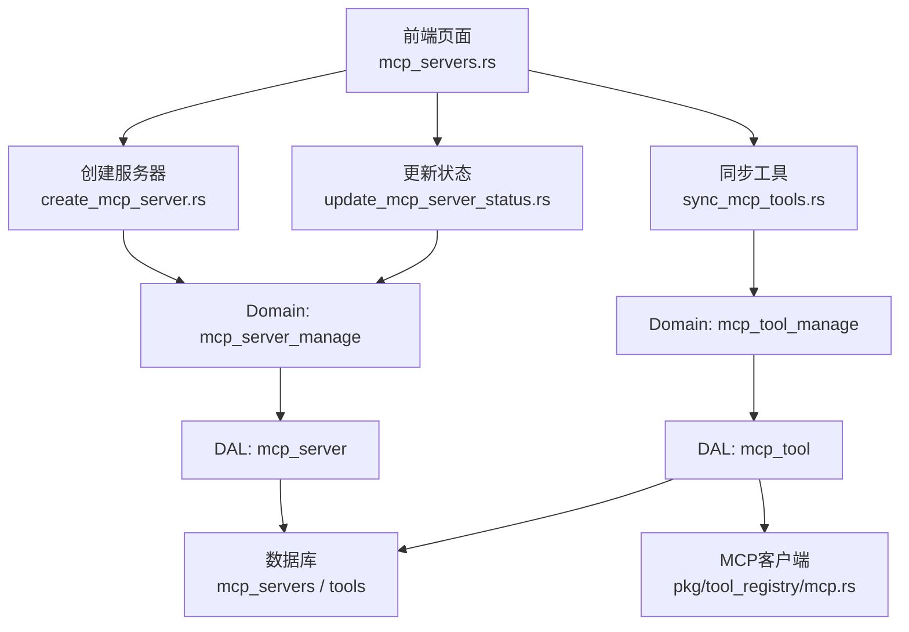
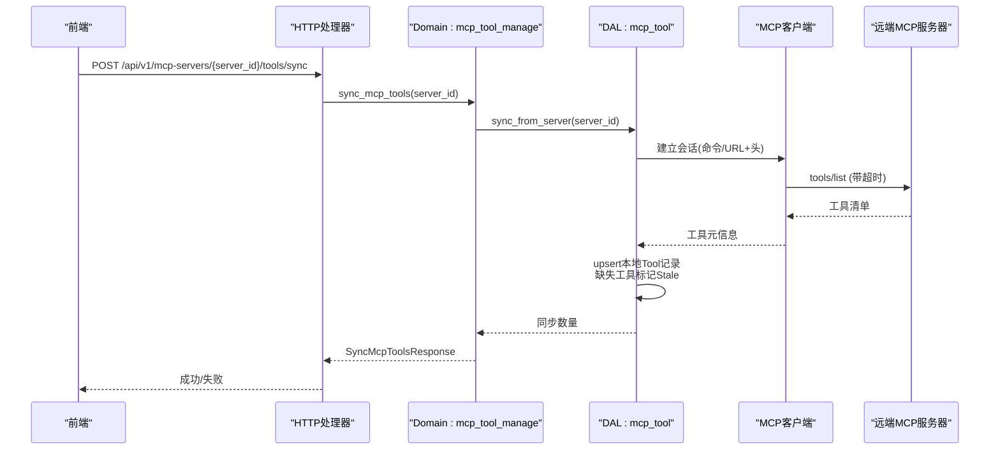
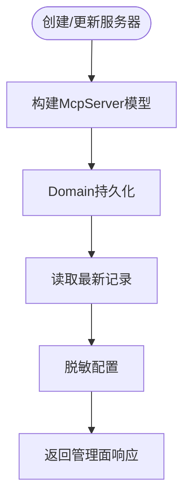
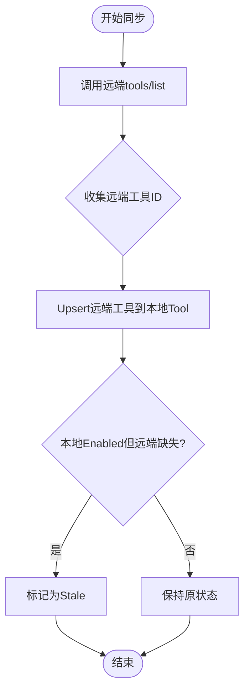
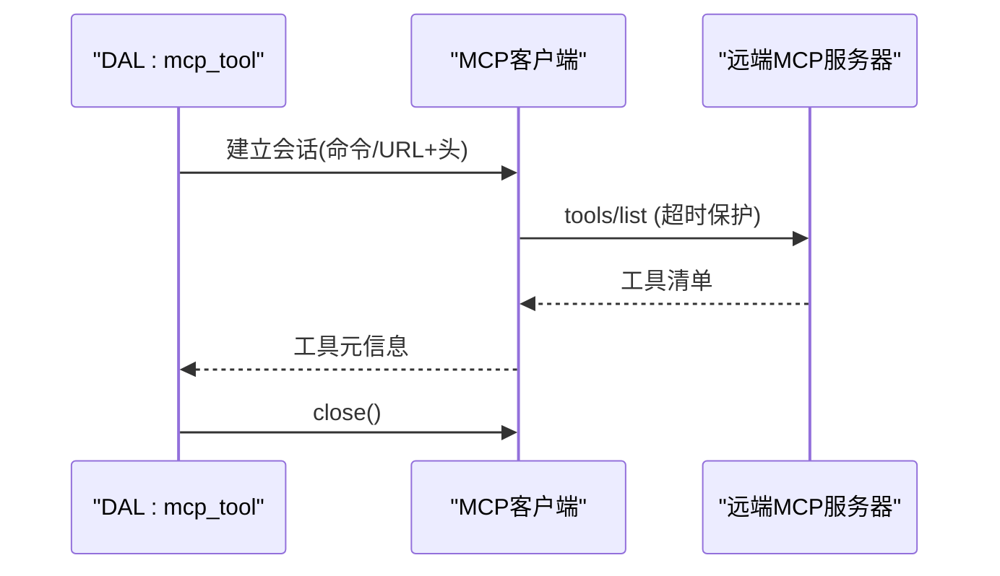
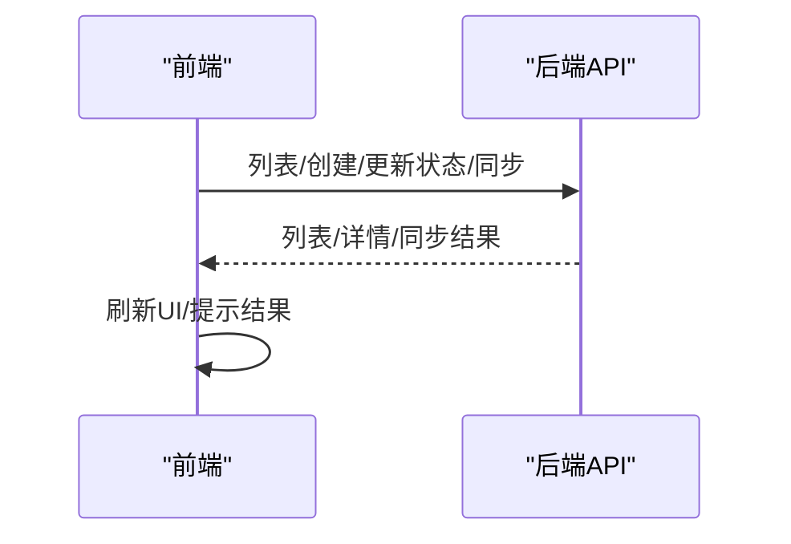
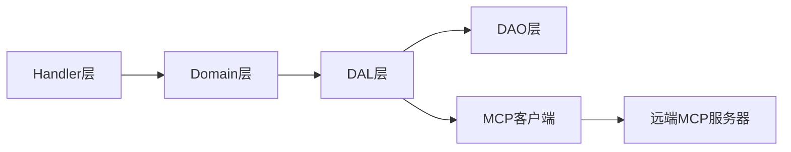

# MCP服务器管理处理器

<cite>
**本文引用的文件**
- [src/handlers/finance/mcp_server/mod.rs](src/handlers/finance/mcp_server/mod.rs)
- [src/handlers/finance/mcp_server/create_mcp_server.rs](src/handlers/finance/mcp_server/create_mcp_server.rs)
- [src/handlers/finance/mcp_server/update_mcp_server_status.rs](src/handlers/finance/mcp_server/update_mcp_server_status.rs)
- [src/handlers/finance/mcp_tool/sync_mcp_tools.rs](src/handlers/finance/mcp_tool/sync_mcp_tools.rs)
- [src/models/mcp_server.rs](src/models/mcp_server.rs)
- [common/src/enums/mcp_server.rs](common/src/enums/mcp_server.rs)
- [src/pkg/tool_registry/mcp.rs](src/pkg/tool_registry/mcp.rs)
- [src/service/dal/mcp_tool.rs](src/service/dal/mcp_tool.rs)
- [docs/mcp_tool_design.md](docs/mcp_tool_design.md)
- [frontend/src/pages/finance/mcp_servers.rs](frontend/src/pages/finance/mcp_servers.rs)
</cite>

## 目录
1. [简介](#简介)
2. [项目结构](#项目结构)
3. [核心组件](#核心组件)
4. [架构总览](#架构总览)
5. [详细组件分析](#详细组件分析)
6. [依赖关系分析](#依赖关系分析)
7. [性能与可靠性](#性能与可靠性)
8. [故障排查指南](#故障排查指南)
9. [结论](#结论)
10. [附录：配置示例与测试方法](#附录：配置示例与测试方法)

## 简介
本文件面向MCP服务器管理处理器，覆盖以下目标：
- 配置管理：创建、更新、启用/禁用、删除MCP服务器；配置项脱敏展示。
- 连接测试与状态监控：通过同步工具流程验证远端可用性，结合工具状态（Enabled/Disabled/Stale）进行健康观察。
- MCP协议握手与发现：基于每操作会话的stdio或HTTP调用远端MCP server，执行tools/list获取工具清单。
- 工具同步流程：将远端工具映射为本地标准Tool记录，支持upsert、冲突校验、Stale标记与恢复。
- 连接池、超时、重试与错误恢复：当前实现采用“每次调用建立并关闭会话”的策略，具备超时保护与失败脱敏；连接池/重连/健康检查在规划中。
- 健康检查、性能监控、日志记录：通过工具调用追踪与审计日志记录关键路径；管理面返回脱敏配置。
- 配置示例、连接测试方法与故障排查：提供可操作的步骤与常见问题定位建议。

## 项目结构
MCP服务器管理相关代码按四层单向调用组织：Adapter（HTTP Handler）→ Domain → DAL → DAO。Handler仅负责参数解析、鉴权上下文传递与响应组装；Domain编排业务；DAL封装跨表聚合与外部MCP交互；DAO负责持久化。

图表来源
- [src/handlers/finance/mcp_server/create_mcp_server.rs:1-48](src/handlers/finance/mcp_server/create_mcp_server.rs#L1-L48)
- [src/handlers/finance/mcp_server/update_mcp_server_status.rs:1-37](src/handlers/finance/mcp_server/update_mcp_server_status.rs#L1-L37)
- [src/handlers/finance/mcp_tool/sync_mcp_tools.rs:1-28](src/handlers/finance/mcp_tool/sync_mcp_tools.rs#L1-L28)
- [src/service/dal/mcp_tool.rs:143-185](src/service/dal/mcp_tool.rs#L143-L185)
- [src/pkg/tool_registry/mcp.rs:107-140](src/pkg/tool_registry/mcp.rs#L107-L140)

章节来源
- [src/handlers/finance/mcp_server/mod.rs:1-24](src/handlers/finance/mcp_server/mod.rs#L1-L24)
- [src/handlers/finance/mcp_server/create_mcp_server.rs:1-48](src/handlers/finance/mcp_server/create_mcp_server.rs#L1-L48)
- [src/handlers/finance/mcp_server/update_mcp_server_status.rs:1-37](src/handlers/finance/mcp_server/update_mcp_server_status.rs#L1-L37)
- [src/handlers/finance/mcp_tool/sync_mcp_tools.rs:1-28](src/handlers/finance/mcp_tool/sync_mcp_tools.rs#L1-L28)

## 核心组件
- HTTP适配器层
  - 创建MCP服务器：接收请求，构造模型对象，调用Domain创建并返回脱敏详情。
  - 更新服务器状态：切换启用/禁用，随后读取最新详情返回。
  - 同步工具：触发从远端MCP服务器拉取工具列表并同步到本地Tool记录。
- 领域层（Domain）
  - mcp_server_manage：服务器CRUD与状态变更。
  - mcp_tool_manage：工具同步、查询、状态协调。
- 数据访问层（DAL）
  - mcp_server：服务器配置的持久化与查询。
  - mcp_tool：远端工具同步、本地工具upsert、冲突校验、Stale标记与恢复。
- 工具注册与运行时（pkg/tool_registry/mcp.rs）
  - 通过MCP客户端执行tools/list，带超时控制，关闭会话，返回工具元信息。
- 模型与枚举（models/common enums）
  - McpTransport、McpServerStatus、McpServerConfig等类型定义与脱敏能力。

章节来源
- [src/handlers/finance/mcp_server/create_mcp_server.rs:1-48](src/handlers/finance/mcp_server/create_mcp_server.rs#L1-L48)
- [src/handlers/finance/mcp_server/update_mcp_server_status.rs:1-37](src/handlers/finance/mcp_server/update_mcp_server_status.rs#L1-L37)
- [src/handlers/finance/mcp_tool/sync_mcp_tools.rs:1-28](src/handlers/finance/mcp_tool/sync_mcp_tools.rs#L1-L28)
- [src/models/mcp_server.rs:1-322](src/models/mcp_server.rs#L1-L322)
- [common/src/enums/mcp_server.rs:1-49](common/src/enums/mcp_server.rs#L1-L49)
- [src/pkg/tool_registry/mcp.rs:107-140](src/pkg/tool_registry/mcp.rs#L107-L140)

## 架构总览
下图展示了从前端到后端再到远端MCP服务器的完整调用链，包括工具同步的关键时序。

图表来源
- [src/handlers/finance/mcp_tool/sync_mcp_tools.rs:1-28](src/handlers/finance/mcp_tool/sync_mcp_tools.rs#L1-L28)
- [src/service/dal/mcp_tool.rs:143-185](src/service/dal/mcp_tool.rs#L143-L185)
- [src/pkg/tool_registry/mcp.rs:107-140](src/pkg/tool_registry/mcp.rs#L107-L140)

## 详细组件分析

### 组件A：MCP服务器配置管理
职责
- 创建服务器：生成唯一ID，组装传输方式与配置，持久化后返回脱敏详情。
- 更新状态：切换Enabled/Disabled，便于后续同步与调用时过滤。
- 查询与列表：由其他模块组合使用，返回列表与分页。

关键点
- 配置项包含command/args/env/url/headers/timeout/connect_timeout/response_max_bytes。
- 管理面输出必须脱敏：env值、headers值、URL中的用户信息与query均被替换为占位符。
- 状态机：Enabled/Disabled/Deleted（软删除）。

图表来源
- [src/handlers/finance/mcp_server/create_mcp_server.rs:1-48](src/handlers/finance/mcp_server/create_mcp_server.rs#L1-L48)
- [src/handlers/finance/mcp_server/update_mcp_server_status.rs:1-37](src/handlers/finance/mcp_server/update_mcp_server_status.rs#L1-L37)
- [src/models/mcp_server.rs:97-167](src/models/mcp_server.rs#L97-L167)

章节来源
- [src/handlers/finance/mcp_server/create_mcp_server.rs:1-48](src/handlers/finance/mcp_server/create_mcp_server.rs#L1-L48)
- [src/handlers/finance/mcp_server/update_mcp_server_status.rs:1-37](src/handlers/finance/mcp_server/update_mcp_server_status.rs#L1-L37)
- [src/models/mcp_server.rs:60-95](src/models/mcp_server.rs#L60-L95)
- [src/models/mcp_server.rs:97-167](src/models/mcp_server.rs#L97-L167)
- [common/src/enums/mcp_server.rs:7-38](common/src/enums/mcp_server.rs#L7-L38)

### 组件B：MCP工具同步与状态协调
职责
- 从远端MCP服务器拉取工具清单，转换为本地Tool记录。
- 对已存在记录进行upsert，严格校验协议与绑定一致性。
- 对本地存在但远端缺失的Enabled工具标记为Stale；当远端重新出现且本地为Stale时自动恢复为Enabled。
- 默认控制模式为Manual，避免进入自动调用链路。

同步算法要点
- 一次tools/list后生成远端ID集合。
- 对远端返回的工具做upsert，保留created_at/created_by/status，更新updated_by。
- 对本地已存在但未出现在本次远端列表的Enabled工具标记Stale。
- 非MCP协议或绑定冲突直接拒绝并报错。

图表来源
- [src/service/dal/mcp_tool.rs:143-185](src/service/dal/mcp_tool.rs#L143-L185)
- [docs/mcp_tool_design.md:341-349](docs/mcp_tool_design.md#L341-L349)
- [docs/mcp_tool_design.md:1312-1327](docs/mcp_tool_design.md#L1312-L1327)

章节来源
- [src/handlers/finance/mcp_tool/sync_mcp_tools.rs:1-28](src/handlers/finance/mcp_tool/sync_mcp_tools.rs#L1-L28)
- [src/service/dal/mcp_tool.rs:143-185](src/service/dal/mcp_tool.rs#L143-L185)
- [docs/mcp_tool_design.md:341-349](docs/mcp_tool_design.md#L341-L349)
- [docs/mcp_tool_design.md:1312-1327](docs/mcp_tool_design.md#L1312-L1327)

### 组件C：MCP协议握手与工具发现
职责
- 通过MCP客户端发起tools/list，完成握手与工具发现。
- 每次调用建立会话并在完成后关闭，避免长连接占用资源。
- 超时保护：对list_all_tools设置超时，超时则返回明确错误。

图表来源
- [src/pkg/tool_registry/mcp.rs:107-140](src/pkg/tool_registry/mcp.rs#L107-L140)

章节来源
- [src/pkg/tool_registry/mcp.rs:107-140](src/pkg/tool_registry/mcp.rs#L107-L140)

### 组件D：前端管理与交互
职责
- 列出MCP服务器、创建、删除、启用/禁用、触发工具同步。
- 同步成功后刷新列表，展示状态变化。

图表来源
- [frontend/src/pages/finance/mcp_servers.rs:1-46](frontend/src/pages/finance/mcp_servers.rs#L1-L46)
- [frontend/src/pages/finance/mcp_servers.rs:202-218](frontend/src/pages/finance/mcp_servers.rs#L202-L218)

章节来源
- [frontend/src/pages/finance/mcp_servers.rs:1-46](frontend/src/pages/finance/mcp_servers.rs#L1-L46)
- [frontend/src/pages/finance/mcp_servers.rs:202-218](frontend/src/pages/finance/mcp_servers.rs#L202-L218)

## 依赖关系分析
- Handler依赖Domain暴露的管理接口，不直接访问DAL/DAO。
- Domain编排DAL，DAL再调用DAO与外部MCP客户端。
- 模型与枚举在common与models之间共享，确保前后端一致。
- 工具注册模块提供MCP客户端能力，供DAL在同步与调用时使用。

图表来源
- [src/handlers/finance/mcp_server/create_mcp_server.rs:1-48](src/handlers/finance/mcp_server/create_mcp_server.rs#L1-L48)
- [src/handlers/finance/mcp_tool/sync_mcp_tools.rs:1-28](src/handlers/finance/mcp_tool/sync_mcp_tools.rs#L1-L28)
- [src/pkg/tool_registry/mcp.rs:107-140](src/pkg/tool_registry/mcp.rs#L107-L140)

章节来源
- [src/handlers/finance/mcp_server/mod.rs:1-24](src/handlers/finance/mcp_server/mod.rs#L1-L24)
- [src/handlers/finance/mcp_tool/sync_mcp_tools.rs:1-28](src/handlers/finance/mcp_tool/sync_mcp_tools.rs#L1-L28)

## 性能与可靠性
- 会话策略：当前实现为“每次操作建立并关闭会话”，避免长连接带来的资源占用与状态复杂化。适合中小规模场景。
- 超时保护：tools/list等操作设置超时，防止阻塞；超时错误会包装为可读消息。
- 错误脱敏：管理面与错误消息对敏感信息进行脱敏，避免泄露凭据。
- 连接池与重连：尚未实现连接池与自动重连；若未来需要高并发复用会话，可在DAL层引入session缓存与失效机制。
- 健康检查：通过工具同步流程间接验证远端可用性；未来可扩展独立健康检查任务。
- 监控与日志：工具调用追踪与审计日志记录关键路径，便于问题定位。

[本节为通用指导，不直接分析具体文件]

## 故障排查指南
常见问题与定位步骤
- 无法同步工具
  - 检查服务器状态是否为Enabled；Disabled不会参与同步。
  - 检查传输方式与配置是否正确（stdio命令/参数或HTTP URL/Headers）。
  - 查看工具同步返回的错误信息，确认是否超时或远端不可达。
- 工具被标记为Stale
  - 表示本地存在但远端缺失；等待远端重新出现后会自动恢复为Enabled。
  - 若管理员手动禁用了该工具，即使远端重新出现也不会覆盖禁用状态。
- 配置泄露风险
  - 管理面应始终使用脱敏后的配置；如需查看原始配置，请在安全环境中直接访问数据库。
- 超时与慢响应
  - 调整timeout_ms/connect_timeout_ms；对于大响应体，适当增大response_max_bytes。
- 权限与上下文
  - 所有公共方法需携带RequestContext；跨层调用使用ctx.clone()。

章节来源
- [src/models/mcp_server.rs:97-167](src/models/mcp_server.rs#L97-L167)
- [src/pkg/tool_registry/mcp.rs:107-140](src/pkg/tool_registry/mcp.rs#L107-L140)
- [docs/mcp_tool_design.md:1312-1327](docs/mcp_tool_design.md#L1312-L1327)

## 结论
MCP服务器管理处理器以清晰的四层架构实现了配置管理、工具同步与健康观察。当前实现强调安全性（脱敏）、稳定性（超时保护）与一致性（Stale/恢复策略）。未来可根据性能需求引入连接池、重连与健康检查，进一步提升大规模场景下的可用性与效率。

[本节为总结性内容，不直接分析具体文件]

## 附录：配置示例与测试方法
- 配置示例
  - stdio传输：command为可执行文件路径，args为参数数组，env为环境变量键值对。
  - streamable_http传输：url为目标地址，headers为认证头集合。
  - 超时与大小限制：timeout_ms、connect_timeout_ms、response_max_bytes按需调整。
- 连接测试方法
  - 创建服务器后，调用工具同步接口，观察是否成功拉取工具清单。
  - 若失败，检查网络连通性、命令执行环境、URL可达性与认证头。
- 管理面操作
  - 启用/禁用服务器，观察工具列表与同步行为。
  - 删除服务器后，关联工具将被清理或标记异常。

章节来源
- [src/models/mcp_server.rs:97-167](src/models/mcp_server.rs#L97-L167)
- [src/handlers/finance/mcp_tool/sync_mcp_tools.rs:1-28](src/handlers/finance/mcp_tool/sync_mcp_tools.rs#L1-L28)
- [frontend/src/pages/finance/mcp_servers.rs:1-46](frontend/src/pages/finance/mcp_servers.rs#L1-L46)