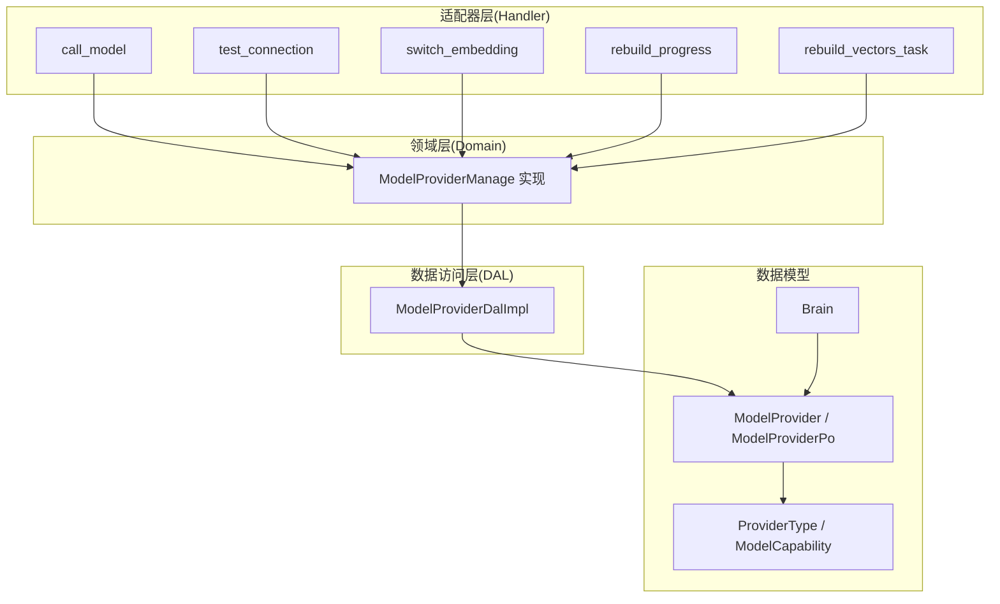
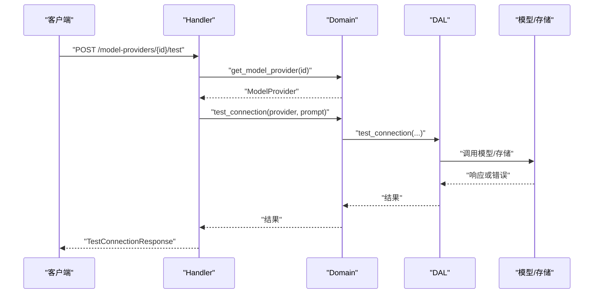
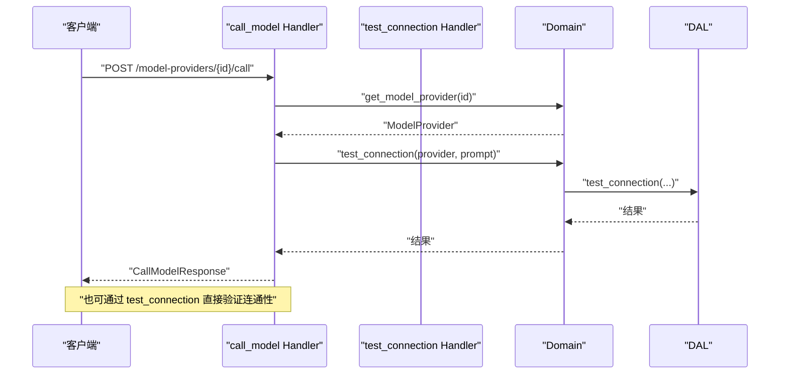
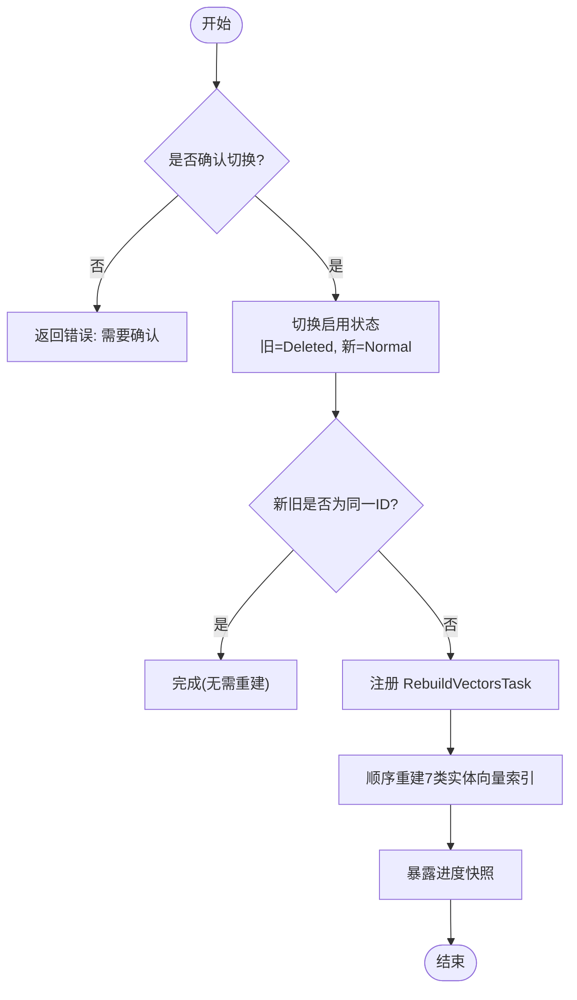
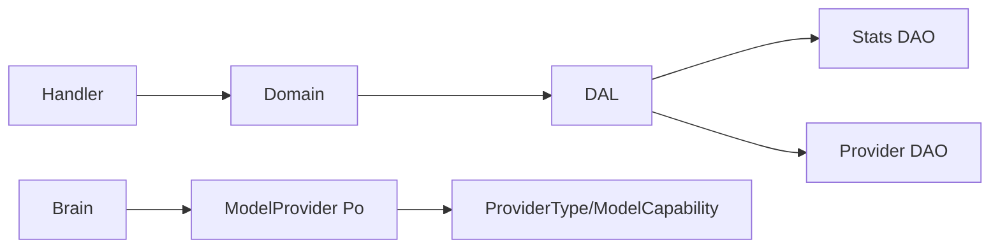

# 模型提供商管理处理器

<cite>
**本文引用的文件**
- [src/handlers/finance/model_provider/mod.rs](src/handlers/finance/model_provider/mod.rs)
- [src/handlers/finance/model_provider/call_model.rs](src/handlers/finance/model_provider/call_model.rs)
- [src/handlers/finance/model_provider/test_connection.rs](src/handlers/finance/model_provider/test_connection.rs)
- [src/handlers/finance/model_provider/rebuild_vectors_task.rs](src/handlers/finance/model_provider/rebuild_vectors_task.rs)
- [src/handlers/finance/model_provider/rebuild_progress.rs](src/handlers/finance/model_provider/rebuild_progress.rs)
- [src/handlers/finance/model_provider/switch_embedding.rs](src/handlers/finance/model_provider/switch_embedding.rs)
- [src/models/model_provider.rs](src/models/model_provider.rs)
- [src/service/domain/finance/model_provider.rs](src/service/domain/finance/model_provider.rs)
- [src/service/dal/model_provider.rs](src/service/dal/model_provider.rs)
- [common/src/enums/provider.rs](common/src/enums/provider.rs)
- [src/models/brain.rs](src/models/brain.rs)
</cite>

## 目录
1. [简介](#简介)
2. [项目结构](#项目结构)
3. [核心组件](#核心组件)
4. [架构总览](#架构总览)
5. [详细组件分析](#详细组件分析)
6. [依赖关系分析](#依赖关系分析)
7. [性能与成本](#性能与成本)
8. [故障排查指南](#故障排查指南)
9. [结论](#结论)
10. [附录：配置示例与接口说明](#附录：配置示例与接口说明)

## 简介
本文件面向“模型提供商管理处理器”，系统性梳理多模型提供商的配置管理、连接测试、模型调用、向量重建任务、进度跟踪与错误恢复，以及模型能力检测、性能监控与成本统计的实现细节。文档严格遵循四层单向调用（Adapter → Domain → DAL → DAO），并基于仓库中实际代码进行说明。

## 项目结构
围绕模型提供商的 HTTP 接口集中在 finance 域下的 model_provider 模块，按方法粒度拆分；领域层实现业务规则（如唯一启用 Embedding Provider）；数据访问层封装持久化与统计查询；数据模型定义实体与配置；枚举定义提供商类型与能力。

图示来源
- [src/handlers/finance/model_provider/mod.rs:1-25](src/handlers/finance/model_provider/mod.rs#L1-L25)
- [src/handlers/finance/model_provider/call_model.rs:1-42](src/handlers/finance/model_provider/call_model.rs#L1-L42)
- [src/handlers/finance/model_provider/test_connection.rs:1-68](src/handlers/finance/model_provider/test_connection.rs#L1-L68)
- [src/handlers/finance/model_provider/switch_embedding.rs:1-55](src/handlers/finance/model_provider/switch_embedding.rs#L1-L55)
- [src/handlers/finance/model_provider/rebuild_progress.rs:1-50](src/handlers/finance/model_provider/rebuild_progress.rs#L1-L50)
- [src/handlers/finance/model_provider/rebuild_vectors_task.rs:1-194](src/handlers/finance/model_provider/rebuild_vectors_task.rs#L1-L194)
- [src/service/domain/finance/model_provider.rs:1-149](src/service/domain/finance/model_provider.rs#L1-L149)
- [src/service/dal/model_provider.rs:1-223](src/service/dal/model_provider.rs#L1-L223)
- [src/models/model_provider.rs:1-248](src/models/model_provider.rs#L1-L248)
- [common/src/enums/provider.rs:1-154](common/src/enums/provider.rs#L1-L154)
- [src/models/brain.rs:1-86](src/models/brain.rs#L1-L86)

章节来源
- [src/handlers/finance/model_provider/mod.rs:1-25](src/handlers/finance/model_provider/mod.rs#L1-L25)

## 核心组件
- 模型提供商实体与配置
  - 持久化对象包含提供商类型、模型名称、能力、API Key、基础 URL、描述、JSON 配置、状态等。
  - 业务对象在持久化对象基础上可选附加模型调用统计。
  - 配置项包括上下文窗口、推荐上下文长度、最大输出 token、温度默认值、RPM/TPM 限制、每日配额等。
- 领域规则
  - 更新时若目标为 Embedding 且当前已有启用的 Embedding Provider，则拒绝并提示需切换。
  - 切换 Embedding Provider 会禁用旧提供者并启用新提供者，随后触发向量索引重建。
- 数据访问
  - 提供创建、查询、分页、更新、删除、获取已启用 Embedding Provider、统计注入等能力。
  - 支持按选项加载模型调用统计（汇总、token 汇总、时序）。
- 枚举与能力
  - 提供商类型涵盖 OpenAI、DeepSeek、Qwen、Doubao、Ollama、Custom、FastEmbed、DoubaoVision。
  - 能力分为 Agent 与 Embedding。
- Brain 集成
  - Local Agent 持有 ModelProviderPo，用于推理与向量化执行环境。

章节来源
- [src/models/model_provider.rs:1-248](src/models/model_provider.rs#L1-L248)
- [src/service/domain/finance/model_provider.rs:1-149](src/service/domain/finance/model_provider.rs#L1-L149)
- [src/service/dal/model_provider.rs:1-223](src/service/dal/model_provider.rs#L1-L223)
- [common/src/enums/provider.rs:1-154](common/src/enums/provider.rs#L1-L154)
- [src/models/brain.rs:1-86](src/models/brain.rs#L1-L86)

## 架构总览
系统采用 Adapter → Domain → DAL → DAO 的单向调用链。HTTP Handler 仅负责参数校验与上下文增强，领域层执行业务规则，DAL 聚合 DAO 与统计，数据模型承载实体与配置。

图示来源
- [src/handlers/finance/model_provider/test_connection.rs:1-68](src/handlers/finance/model_provider/test_connection.rs#L1-L68)
- [src/service/domain/finance/model_provider.rs:1-149](src/service/domain/finance/model_provider.rs#L1-L149)
- [src/service/dal/model_provider.rs:1-223](src/service/dal/model_provider.rs#L1-L223)

## 详细组件分析

### 连接测试与模型调用
- 连接测试
  - Handler 根据 id 获取 ModelProvider，增强上下文后调用领域层的 test_connection。
  - 若返回空响应视为失败，否则成功并返回响应内容。
- 模型调用
  - Handler 通过 get_model_provider 获取 provider，再复用 test_connection 流程生成文本补全。
  - 该路径体现了“最小可用”的调用方式，便于快速验证连通性与基本能力。

图示来源
- [src/handlers/finance/model_provider/call_model.rs:1-42](src/handlers/finance/model_provider/call_model.rs#L1-L42)
- [src/handlers/finance/model_provider/test_connection.rs:1-68](src/handlers/finance/model_provider/test_connection.rs#L1-L68)
- [src/service/domain/finance/model_provider.rs:1-149](src/service/domain/finance/model_provider.rs#L1-L149)
- [src/service/dal/model_provider.rs:1-223](src/service/dal/model_provider.rs#L1-L223)

章节来源
- [src/handlers/finance/model_provider/call_model.rs:1-42](src/handlers/finance/model_provider/call_model.rs#L1-L42)
- [src/handlers/finance/model_provider/test_connection.rs:1-68](src/handlers/finance/model_provider/test_connection.rs#L1-L68)
- [src/service/domain/finance/model_provider.rs:1-149](src/service/domain/finance/model_provider.rs#L1-L149)
- [src/service/dal/model_provider.rs:1-223](src/service/dal/model_provider.rs#L1-L223)

### 模型切换机制与向量重建
- 切换策略
  - 仅允许一个 Embedding Provider 处于启用状态。
  - 切换时将旧提供者置为 Deleted，新提供者置为 Normal。
  - 若新旧相同则无需重建。
- 向量重建
  - 切换后注册 RebuildVectorsTask 到全局后台任务注册中心。
  - 任务串行执行，遍历 agent/memory/skill/task/project/message/tool 七类实体逐一重建向量索引。
  - 同一时刻只允许一个 RebuildVectors 任务运行，冲突时返回冲突错误。
- 进度查询
  - 通过系统后台任务注册中心查询最近一个 RebuildVectors 任务的进度快照。
  - 将内部 TaskStatus 映射为 RebuildStatus 返回给前端。

图示来源
- [src/handlers/finance/model_provider/switch_embedding.rs:1-55](src/handlers/finance/model_provider/switch_embedding.rs#L1-L55)
- [src/handlers/finance/model_provider/rebuild_vectors_task.rs:1-194](src/handlers/finance/model_provider/rebuild_vectors_task.rs#L1-L194)
- [src/handlers/finance/model_provider/rebuild_progress.rs:1-50](src/handlers/finance/model_provider/rebuild_progress.rs#L1-L50)
- [src/service/domain/finance/model_provider.rs:1-149](src/service/domain/finance/model_provider.rs#L1-L149)

章节来源
- [src/handlers/finance/model_provider/switch_embedding.rs:1-55](src/handlers/finance/model_provider/switch_embedding.rs#L1-L55)
- [src/handlers/finance/model_provider/rebuild_vectors_task.rs:1-194](src/handlers/finance/model_provider/rebuild_vectors_task.rs#L1-L194)
- [src/handlers/finance/model_provider/rebuild_progress.rs:1-50](src/handlers/finance/model_provider/rebuild_progress.rs#L1-L50)
- [src/service/domain/finance/model_provider.rs:1-149](src/service/domain/finance/model_provider.rs#L1-L149)

### 模型能力检测与配置管理
- 能力检测
  - 通过 ProviderType 与 ModelCapability 区分 Agent 与 Embedding。
  - 领域层在更新时校验目标是否为 Embedding 且存在冲突的启用者。
- 配置管理
  - ModelProviderConfig 支持上下文窗口、推荐上下文长度、最大输出、温度默认、RPM/TPM、每日配额等。
  - 通过 PO 的 config() 与 update_config() 进行解析与部分更新。
- 上下文增强
  - 通过 RequestContextBuilder 注入 model_provider_id 与 model_name，便于日志与审计。

章节来源
- [common/src/enums/provider.rs:1-154](common/src/enums/provider.rs#L1-L154)
- [src/models/model_provider.rs:1-248](src/models/model_provider.rs#L1-L248)
- [src/service/domain/finance/model_provider.rs:1-149](src/service/domain/finance/model_provider.rs#L1-L149)

### 性能监控与成本统计
- 统计注入
  - DAL 支持在获取 ModelProvider 时按需注入 ModelCallStats（调用汇总、token 汇总、时序）。
  - 统计注入失败会降级记录警告，不影响主流程。
- 事件采集
  - 使用 pkg/stats 中的 ModelCallEvent 作为统计事件载体，由 DAL 层统一组装查询。
- 成本估算
  - 可通过 RPM/TPM 与 daily_quota 配置进行限流与配额控制，结合统计数据进行成本评估。

章节来源
- [src/service/dal/model_provider.rs:1-223](src/service/dal/model_provider.rs#L1-L223)
- [src/models/model_provider.rs:1-248](src/models/model_provider.rs#L1-L248)

### 错误处理与恢复
- 连接测试
  - 空响应视为失败；网络或鉴权错误以错误字符串返回。
- 切换冲突
  - 重复启用 Embedding Provider 时返回冲突错误，提示当前启用者信息。
- 重建任务
  - 并发检查防止同时运行多个重建任务；失败时记录错误并标记任务失败。
- 统计降级
  - 统计注入失败不阻断主流程，仅记录警告。

章节来源
- [src/handlers/finance/model_provider/test_connection.rs:1-68](src/handlers/finance/model_provider/test_connection.rs#L1-L68)
- [src/service/domain/finance/model_provider.rs:1-149](src/service/domain/finance/model_provider.rs#L1-L149)
- [src/handlers/finance/model_provider/rebuild_vectors_task.rs:1-194](src/handlers/finance/model_provider/rebuild_vectors_task.rs#L1-L194)
- [src/service/dal/model_provider.rs:1-223](src/service/dal/model_provider.rs#L1-L223)

## 依赖关系分析
- 耦合与内聚
  - Handler 仅依赖 Domain；Domain 仅依赖 DAL；DAL 组合 DAO 与 Stats DAO；数据模型与枚举被多处引用但无循环依赖。
- 外部依赖
  - 统计事件与后台任务注册中心位于 pkg 层，保持无业务感知。
- 接口契约
  - Domain 的 ModelProviderManage 定义了统一的 CRUD、连接测试与切换接口。
  - DAL 的 ModelProviderDal 抽象了持久化与统计注入。

图示来源
- [src/handlers/finance/model_provider/mod.rs:1-25](src/handlers/finance/model_provider/mod.rs#L1-L25)
- [src/service/domain/finance/model_provider.rs:1-149](src/service/domain/finance/model_provider.rs#L1-L149)
- [src/service/dal/model_provider.rs:1-223](src/service/dal/model_provider.rs#L1-L223)
- [src/models/model_provider.rs:1-248](src/models/model_provider.rs#L1-L248)
- [common/src/enums/provider.rs:1-154](common/src/enums/provider.rs#L1-L154)
- [src/models/brain.rs:1-86](src/models/brain.rs#L1-L86)

章节来源
- [src/service/domain/finance/model_provider.rs:1-149](src/service/domain/finance/model_provider.rs#L1-L149)
- [src/service/dal/model_provider.rs:1-223](src/service/dal/model_provider.rs#L1-L223)

## 性能与成本
- 向量重建
  - 顺序重建七类实体，避免并发竞争；任务级别互斥保证一致性。
- 统计注入
  - 可选加载统计，失败降级，减少主链路开销。
- 限流与配额
  - 通过 RPM/TPM/daily_quota 控制请求速率与用量，结合统计进行成本评估。
- 上下文优化
  - 推荐上下文长度可用作压缩阈值，降低长上下文带来的成本与延迟。

[本节为通用指导，不直接分析具体文件]

## 故障排查指南
- 连接测试失败
  - 检查 API Key、Base URL、网络可达性；关注空响应与错误消息。
- 切换失败
  - 确认目标为 Embedding 能力；查看是否存在其他启用的 Embedding Provider。
- 重建任务冲突
  - 等待现有任务完成；或通过进度接口查看任务状态。
- 统计缺失
  - 检查统计注入是否开启；关注警告日志定位问题。

章节来源
- [src/handlers/finance/model_provider/test_connection.rs:1-68](src/handlers/finance/model_provider/test_connection.rs#L1-L68)
- [src/handlers/finance/model_provider/rebuild_vectors_task.rs:1-194](src/handlers/finance/model_provider/rebuild_vectors_task.rs#L1-L194)
- [src/service/dal/model_provider.rs:1-223](src/service/dal/model_provider.rs#L1-L223)

## 结论
本处理器以清晰的层次划分实现了多模型提供商的配置管理、连接测试、模型调用、向量重建与进度跟踪。通过领域规则确保 Embedding Provider 的唯一启用，借助后台任务实现幂等重建，并通过统计注入与限流配置支撑性能监控与成本控制。整体设计符合四层单向调用规范，具备可扩展性与健壮性。

[本节为总结，不直接分析具体文件]

## 附录：配置示例与接口说明
- 配置字段
  - max_context_length：上下文窗口长度
  - recommended_context_length：推荐上下文长度（未设置时按 60% 自动计算）
  - max_output_tokens：最大输出 token
  - temperature_default：默认温度
  - rpm_limit：每分钟请求数限制
  - tpm_limit：每分钟 token 数限制
  - daily_quota：每日配额
- 提供商类型
  - OpenAI、DeepSeek、Qwen、Doubao、Ollama、Custom、FastEmbed、DoubaoVision
- 能力类型
  - Agent：对话、思考、工具调用
  - Embedding：向量化
- 主要接口
  - 连接测试：POST /api/v1/model-providers/{id}/test
  - 模型调用：POST /api/v1/model-providers/{id}/call
  - 切换 Embedding：POST /api/v1/finance/model-providers/:id/switch（需 confirm=true）
  - 重建进度：GET /api/v1/finance/model-providers/rebuild-progress

章节来源
- [src/models/model_provider.rs:1-248](src/models/model_provider.rs#L1-L248)
- [common/src/enums/provider.rs:1-154](common/src/enums/provider.rs#L1-L154)
- [src/handlers/finance/model_provider/test_connection.rs:1-68](src/handlers/finance/model_provider/test_connection.rs#L1-L68)
- [src/handlers/finance/model_provider/call_model.rs:1-42](src/handlers/finance/model_provider/call_model.rs#L1-L42)
- [src/handlers/finance/model_provider/switch_embedding.rs:1-55](src/handlers/finance/model_provider/switch_embedding.rs#L1-L55)
- [src/handlers/finance/model_provider/rebuild_progress.rs:1-50](src/handlers/finance/model_provider/rebuild_progress.rs#L1-L50)