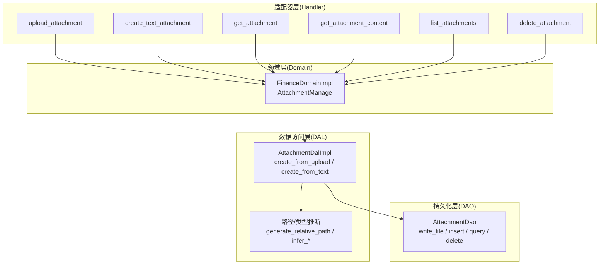
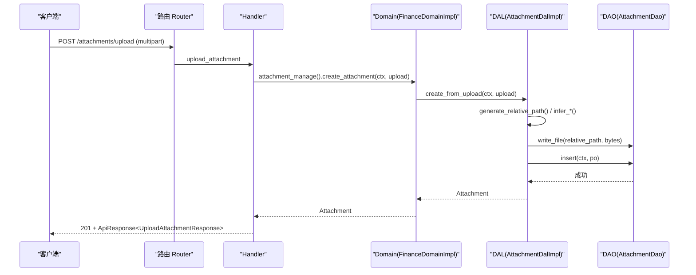
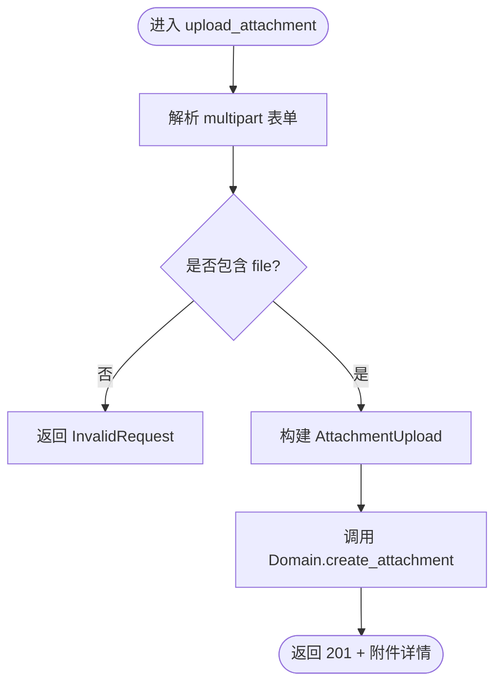
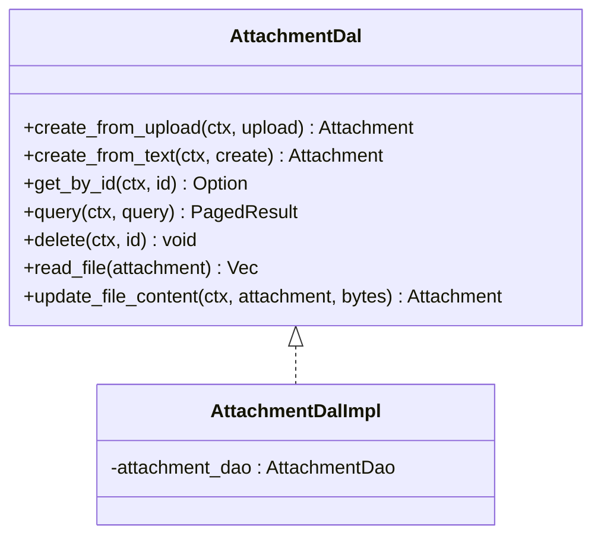

# 附件管理处理器

<cite>
**本文引用的文件**
- [src/handlers/finance/attachment/mod.rs](src/handlers/finance/attachment/mod.rs)
- [src/handlers/finance/attachment/upload_attachment.rs](src/handlers/finance/attachment/upload_attachment.rs)
- [src/handlers/finance/attachment/create_text_attachment.rs](src/handlers/finance/attachment/create_text_attachment.rs)
- [src/handlers/finance/attachment/get_attachment.rs](src/handlers/finance/attachment/get_attachment.rs)
- [src/handlers/finance/attachment/get_attachment_content.rs](src/handlers/finance/attachment/get_attachment_content.rs)
- [src/handlers/finance/attachment/list_attachments.rs](src/handlers/finance/attachment/list_attachments.rs)
- [src/handlers/finance/attachment/delete_attachment.rs](src/handlers/finance/attachment/delete_attachment.rs)
- [src/service/domain/finance/mod.rs](src/service/domain/finance/mod.rs)
- [src/service/domain/finance/attachment.rs](src/service/domain/finance/attachment.rs)
- [src/service/dal/attachment.rs](src/service/dal/attachment.rs)
- [src/models/attachment.rs](src/models/attachment.rs)
- [src/router.rs](src/router.rs)
</cite>

## 目录
1. [简介](#简介)
2. [项目结构](#项目结构)
3. [核心组件](#核心组件)
4. [架构总览](#架构总览)
5. [详细组件分析](#详细组件分析)
6. [依赖关系分析](#依赖关系分析)
7. [性能与扩展性](#性能与扩展性)
8. [故障排查指南](#故障排查指南)
9. [结论](#结论)
10. [附录：API 与配置要点](#附录api-与配置要点)

## 简介
本文件为“附件管理处理器”的权威技术文档，覆盖上传、下载、预览、删除、文本附件创建与更新、查询等能力。当前实现聚焦于通用附件资产（Finance Domain）的 HTTP 接口、领域层校验与编排、数据访问层（DAL）的文件写入与元数据持久化。对于大文件分片上传、断点续传、并发控制、病毒检测与安全扫描等高级特性，当前代码库未提供现成实现；本文在相应章节给出基于现有结构的扩展建议与集成路径。

## 项目结构
附件管理采用四层单向调用：Adapter（HTTP Handler）→ Domain → DAL → DAO。Handler 负责解析请求与响应；Domain 负责业务规则与校验；DAL 负责上传编排、文件名/路径生成、类型推断、元数据与文件写入组合；DAO 负责具体存储读写。

图表来源
- [src/router.rs:415-444](src/router.rs#L415-L444)
- [src/handlers/finance/attachment/mod.rs:1-21](src/handlers/finance/attachment/mod.rs#L1-L21)
- [src/service/domain/finance/mod.rs:92-115](src/service/domain/finance/mod.rs#L92-L115)
- [src/service/dal/attachment.rs:43-85](src/service/dal/attachment.rs#L43-L85)

章节来源
- [src/router.rs:415-444](src/router.rs#L415-L444)
- [src/handlers/finance/attachment/mod.rs:1-21](src/handlers/finance/attachment/mod.rs#L1-L21)

## 核心组件
- 模型与实体
  - AttachmentPo：持久化对象，包含 ID、原始名、存储名、相对路径、MIME、文件类型、大小、用途、状态、归属用户、创建/修改人及时间戳。
  - Attachment：业务实体，封装 PO 与可选的文件读取结果。
  - AttachmentUpload / TextAttachmentCreate / TextContentUpdate：上传与文本内容更新命令。
  - AttachmentTextContent：文本内容返回体，含元数据、编码、大小与更新时间。
- 领域接口
  - AttachmentManage：定义创建、获取、查询、删除、文本内容读取与更新等能力。
- 数据访问接口
  - AttachmentDal：封装上传编排、路径/类型推断、元数据与文件写入、读取与更新。
- HTTP 处理器
  - 上传、文本创建、详情获取、内容读取、列表查询、删除等独立处理器，均通过 Domain 暴露的统一入口调用。

章节来源
- [src/models/attachment.rs:9-186](src/models/attachment.rs#L9-L186)
- [src/service/domain/finance/mod.rs:240-291](src/service/domain/finance/mod.rs#L240-L291)
- [src/service/dal/attachment.rs:43-85](src/service/dal/attachment.rs#L43-L85)

## 架构总览
附件管理的端到端流程如下：

图表来源
- [src/router.rs:415-444](src/router.rs#L415-L444)
- [src/handlers/finance/attachment/upload_attachment.rs:17-82](src/handlers/finance/attachment/upload_attachment.rs#L17-L82)
- [src/service/domain/finance/mod.rs:113-115](src/service/domain/finance/mod.rs#L113-L115)
- [src/service/dal/attachment.rs:96-134](src/service/dal/attachment.rs#L96-L134)

## 详细组件分析

### 上传处理器（POST /attachments/upload）
- 功能：解析 multipart 表单，提取 file 与 purpose，构造 AttachmentUpload，交由 Domain 处理。
- 安全与校验：
  - 必须携带 RequestContext 中的用户上下文，否则拒绝。
  - 缺失 file 字段将返回错误。
- 后续流程：Domain → DAL 生成唯一 ID、扩展名、相对路径、推断 MIME 与 FileType，写入文件并插入元数据。

图表来源
- [src/handlers/finance/attachment/upload_attachment.rs:17-82](src/handlers/finance/attachment/upload_attachment.rs#L17-L82)

章节来源
- [src/handlers/finance/attachment/upload_attachment.rs:17-82](src/handlers/finance/attachment/upload_attachment.rs#L17-L82)

### 文本附件创建（POST /attachments/text）
- 功能：以 JSON 形式创建小型 UTF-8 文本附件，支持可选 mime_type 与 purpose。
- 领域校验：
  - 文件名合法性校验。
  - 文本内容与大小限制（当前常量上限为 64KB）。
  - 文本 MIME 类型白名单校验。
- 后续流程：转换为 AttachmentUpload 后复用上传流程。

章节来源
- [src/handlers/finance/attachment/create_text_attachment.rs:13-45](src/handlers/finance/attachment/create_text_attachment.rs#L13-L45)
- [src/service/domain/finance/attachment.rs:15-39](src/service/domain/finance/attachment.rs#L15-L39)

### 获取详情（GET /attachments/{id}）
- 功能：按 ID 获取附件元数据，仅允许所有者（root_user_id）访问。
- 权限：比对 root_user_id 与当前用户，不匹配视为未找到。

章节来源
- [src/handlers/finance/attachment/get_attachment.rs:13-42](src/handlers/finance/attachment/get_attachment.rs#L13-L42)

### 读取文本内容（GET /attachments/{id}/content）
- 功能：读取附件的 UTF-8 文本内容，返回附件元数据与文本内容。
- 错误：不存在时返回未找到。

章节来源
- [src/handlers/finance/attachment/get_attachment_content.rs:12-37](src/handlers/finance/attachment/get_attachment_content.rs#L12-L37)

### 更新文本内容（PUT /attachments/{id}/content）
- 功能：全量替换附件的 UTF-8 文本内容，支持可选乐观锁（expected_updated_at）。
- 行为：DAL 重写文件并刷新元数据，再返回最新内容。

章节来源
- [src/handlers/finance/attachment/update_attachment_content.rs:13-45](src/handlers/finance/attachment/update_attachment_content.rs#L13-L45)

### 列出附件（GET /attachments）
- 功能：分页列出当前用户的附件，支持按用途与文件类型过滤。
- 参数：purpose、file_type、pagination。

章节来源
- [src/handlers/finance/attachment/list_attachments.rs:13-45](src/handlers/finance/attachment/list_attachments.rs#L13-L45)

### 删除附件（DELETE /attachments/{id}）
- 功能：软删除附件元数据（status=0），保留审计数据。
- 权限：仅所有者可删除。

章节来源
- [src/handlers/finance/attachment/delete_attachment.rs:11-45](src/handlers/finance/attachment/delete_attachment.rs#L11-L45)

### 领域层（AttachmentManage）
- 职责：统一入口、业务校验（文本大小、MIME、文件名）、委派 DAL。
- 关键点：文本附件创建前进行多重校验；其他操作直接委托 DAL。

章节来源
- [src/service/domain/finance/mod.rs:240-291](src/service/domain/finance/mod.rs#L240-L291)
- [src/service/domain/finance/attachment.rs:15-39](src/service/domain/finance/attachment.rs#L15-L39)

### 数据访问层（AttachmentDal）
- 职责：上传编排、ID/路径/扩展名/MIME/FileType 推断、文件写入与元数据持久化、读取与更新。
- 关键逻辑：
  - create_from_upload：生成 v7 UUID、推断扩展名与类型、写入文件、插入元数据。
  - create_from_text：将文本转为字节流，复用上传流程。
  - update_file_content：重写文件并更新元数据。
  - 路径策略：按日期子目录组织，格式 YYYYMMDD/{id}{ext}。
  - 类型推断：优先 MIME 前缀，其次扩展名映射。

图表来源
- [src/service/dal/attachment.rs:43-85](src/service/dal/attachment.rs#L43-L85)
- [src/service/dal/attachment.rs:89-190](src/service/dal/attachment.rs#L89-L190)

章节来源
- [src/service/dal/attachment.rs:96-190](src/service/dal/attachment.rs#L96-L190)
- [src/service/dal/attachment.rs:192-277](src/service/dal/attachment.rs#L192-L277)

### 模型与数据结构
- AttachmentPo：持久化字段完整，包含软删除状态与审计字段。
- Attachment：业务实体，附加按需装配的读取结果。
- 文本相关：TextAttachmentCreate、TextContentUpdate、AttachmentTextContent。

章节来源
- [src/models/attachment.rs:9-186](src/models/attachment.rs#L9-L186)

## 依赖关系分析
- 路由到处理器：Router 将 /attachments/* 路由到对应 Handler。
- 处理器到领域：所有 Handler 通过 FinanceDomain::attachment_manage() 调用统一入口。
- 领域到 DAL：Domain 仅做校验与编排，具体 IO 由 DAL 完成。
- DAL 到 DAO：DAL 调用 DAO 进行文件写入与数据库操作。

图表来源
- [src/router.rs:415-444](src/router.rs#L415-L444)
- [src/service/domain/finance/mod.rs:113-115](src/service/domain/finance/mod.rs#L113-L115)
- [src/service/dal/attachment.rs:43-85](src/service/dal/attachment.rs#L43-L85)

章节来源
- [src/router.rs:415-444](src/router.rs#L415-L444)
- [src/service/domain/finance/mod.rs:113-115](src/service/domain/finance/mod.rs#L113-L115)

## 性能与扩展性
- 当前实现特点
  - 内存中整块读取 multipart 字段，适合中小文件；对超大文件需引入流式处理。
  - 文件写入与元数据插入顺序：先写文件，再插入记录，便于失败回滚。
  - 路径按日期分片，利于文件系统管理与备份。
- 可扩展方向（基于现有结构）
  - 大文件分片上传与断点续传：可在 Handler 层增加分片接口（如 /attachments/chunks），在 DAL 层维护分片索引与合并任务；结合后台任务队列（AOP producer/consumer）异步合并。
  - 并发控制：在 DAL 层对同一文件的写入加锁或基于分片 ID 的并发控制；列表/查询走 DAO 分页，避免一次性加载全部。
  - 安全扫描与病毒检测：在 Domain 层新增钩子，在 create_from_upload 成功后、返回前执行扫描；失败则标记或删除。
  - 存储策略：DAO 抽象存储后端，可切换本地磁盘、对象存储（S3/OSS）等；DAL 保持路径与元数据不变。
  - 版本管理：在 AttachmentPo 上增加版本号字段，更新时递增；读取时可指定版本；历史版本归档至独立目录。

[本节为通用指导，不直接分析具体文件]

## 故障排查指南
- 常见错误与定位
  - 缺少用户上下文：Handler 会立即返回 InvalidRequest，检查认证中间件与 RequestContext。
  - 缺少 file 字段：上传处理器会报错，确认 multipart 字段名是否为 file。
  - 文本内容过大：Domain 层对文本大小有限制（当前 64KB），如需更大请调整常量或改用二进制上传。
  - 未找到资源：获取/更新/删除时若 ID 不存在或无权限，返回 NotFound。
- 日志与调试
  - 关注 DAL 的文件写入与元数据插入步骤，确认路径与权限。
  - 使用测试环境临时目录验证路径生成与类型推断是否正确。

章节来源
- [src/handlers/finance/attachment/upload_attachment.rs:26-71](src/handlers/finance/attachment/upload_attachment.rs#L26-L71)
- [src/service/domain/finance/attachment.rs:15-39](src/service/domain/finance/attachment.rs#L15-L39)
- [src/handlers/finance/attachment/get_attachment.rs:31-42](src/handlers/finance/attachment/get_attachment.rs#L31-L42)
- [src/handlers/finance/attachment/delete_attachment.rs:29-45](src/handlers/finance/attachment/delete_attachment.rs#L29-L45)

## 结论
当前附件管理处理器提供了完整的上传、文本创建、详情获取、内容读取、列表查询与软删除能力，遵循清晰的四层架构与单向依赖。针对大文件、断点续传、并发控制、安全扫描与版本管理等高级需求，建议在现有 Domain/DAL/DAO 抽象基础上逐步扩展，保持 Handler 薄、Domain 强、DAL 稳、DAO 专的职责划分。

[本节为总结，不直接分析具体文件]

## 附录：API 与配置要点
- 路由与端点
  - POST /attachments/upload：上传附件（multipart，字段 file、purpose）。
  - POST /attachments/text：创建小型文本附件（JSON）。
  - GET /attachments：分页列出当前用户附件（purpose、file_type、pagination）。
  - GET /attachments/{id}：获取附件详情（仅所有者）。
  - GET /attachments/{id}/content：读取文本内容。
  - PUT /attachments/{id}/content：全量替换文本内容（可选 expected_updated_at）。
  - DELETE /attachments/{id}：软删除（仅所有者）。
- 模型与约束
  - 文本附件最大内容：64KB（可通过领域常量调整）。
  - 文件类型推断：优先 MIME 前缀，其次扩展名映射。
  - 路径策略：YYYYMMDD/{id}{ext}。
- 示例用法（概念性）
  - 上传：构造 multipart 表单，包含 file 与可选 purpose，调用 POST /attachments/upload。
  - 文本创建：发送 JSON，包含 file_name、content、可选 mime_type 与 purpose，调用 POST /attachments/text。
  - 读取内容：GET /attachments/{id}/content，返回附件元数据与文本。
  - 更新内容：PUT /attachments/{id}/content，传入新 content 与可选 expected_updated_at。
  - 删除：DELETE /attachments/{id}，仅所有者可操作。

章节来源
- [src/router.rs:415-444](src/router.rs#L415-L444)
- [src/handlers/finance/attachment/upload_attachment.rs:17-82](src/handlers/finance/attachment/upload_attachment.rs#L17-L82)
- [src/handlers/finance/attachment/create_text_attachment.rs:13-45](src/handlers/finance/attachment/create_text_attachment.rs#L13-L45)
- [src/handlers/finance/attachment/get_attachment_content.rs:12-37](src/handlers/finance/attachment/get_attachment_content.rs#L12-L37)
- [src/handlers/finance/attachment/update_attachment_content.rs:13-45](src/handlers/finance/attachment/update_attachment_content.rs#L13-L45)
- [src/handlers/finance/attachment/list_attachments.rs:13-45](src/handlers/finance/attachment/list_attachments.rs#L13-L45)
- [src/handlers/finance/attachment/delete_attachment.rs:11-45](src/handlers/finance/attachment/delete_attachment.rs#L11-L45)
- [src/service/domain/finance/attachment.rs:15-39](src/service/domain/finance/attachment.rs#L15-L39)
- [src/service/dal/attachment.rs:192-277](src/service/dal/attachment.rs#L192-L277)