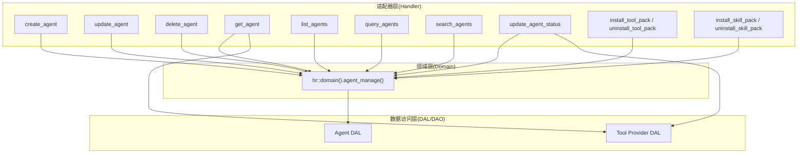
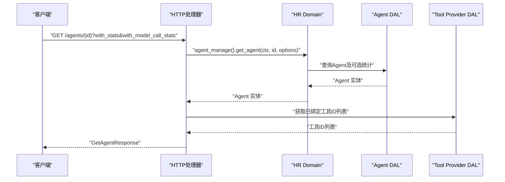
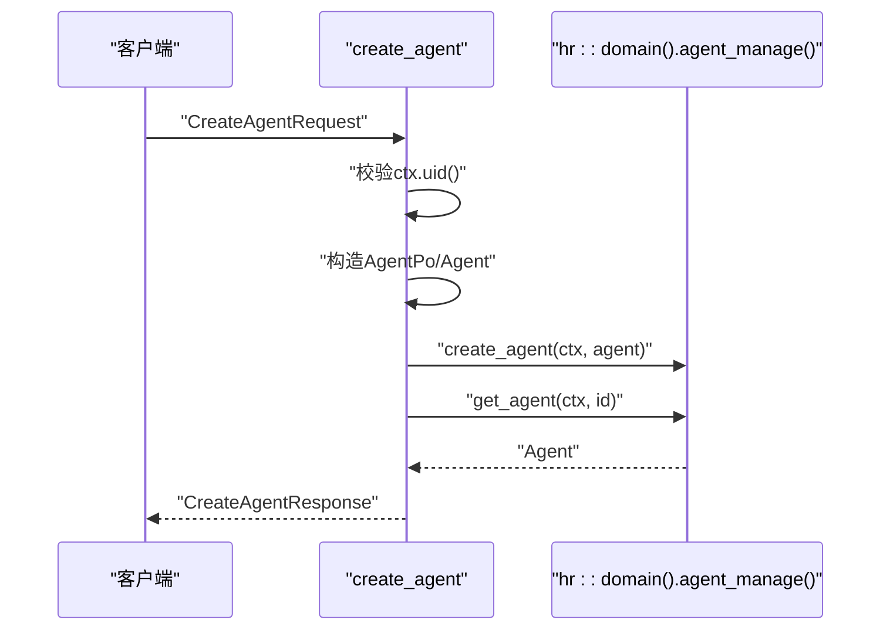
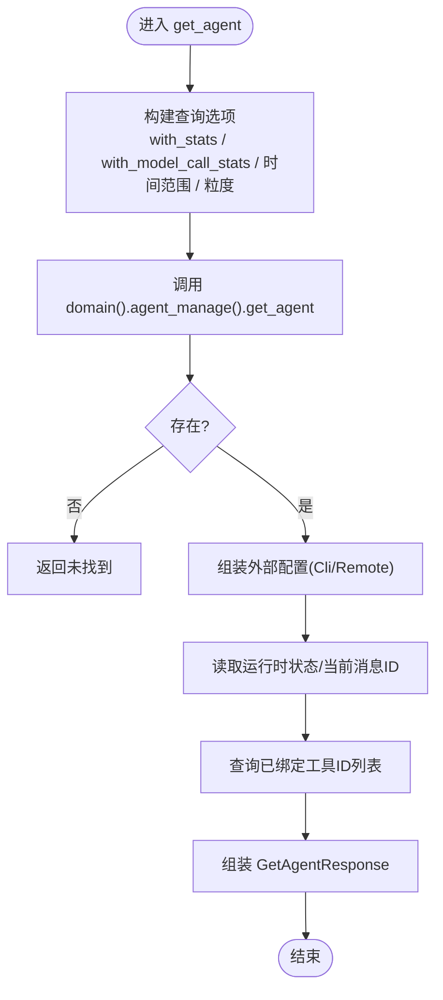
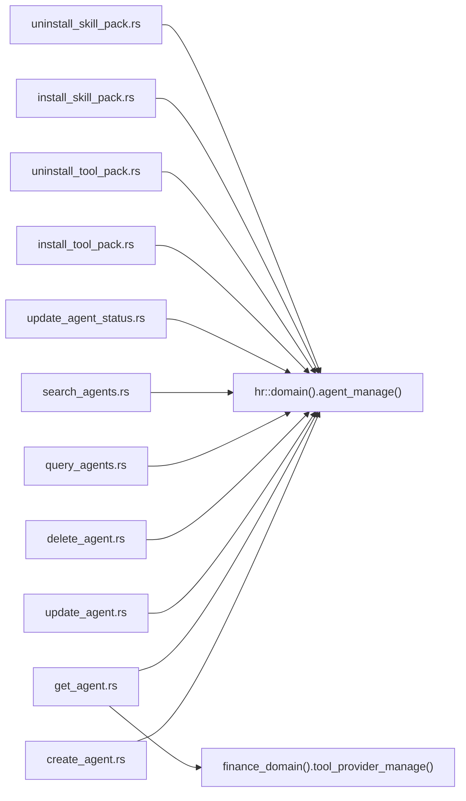

# Agent处理器

<cite>
**本文引用的文件**
- [src/handlers/hr/agent/mod.rs](src/handlers/hr/agent/mod.rs)
- [src/handlers/hr/agent/create_agent.rs](src/handlers/hr/agent/create_agent.rs)
- [src/handlers/hr/agent/update_agent.rs](src/handlers/hr/agent/update_agent.rs)
- [src/handlers/hr/agent/delete_agent.rs](src/handlers/hr/agent/delete_agent.rs)
- [src/handlers/hr/agent/get_agent.rs](src/handlers/hr/agent/get_agent.rs)
- [src/handlers/hr/agent/list_agents.rs](src/handlers/hr/agent/list_agents.rs)
- [src/handlers/hr/agent/query_agents.rs](src/handlers/hr/agent/query_agents.rs)
- [src/handlers/hr/agent/search_agents.rs](src/handlers/hr/agent/search_agents.rs)
- [src/handlers/hr/agent/update_agent_status.rs](src/handlers/hr/agent/update_agent_status.rs)
- [src/handlers/hr/agent/install_tool_pack.rs](src/handlers/hr/agent/install_tool_pack.rs)
- [src/handlers/hr/agent/uninstall_tool_pack.rs](src/handlers/hr/agent/uninstall_tool_pack.rs)
- [src/handlers/hr/agent/install_skill_pack.rs](src/handlers/hr/agent/install_skill_pack.rs)
- [src/handlers/hr/agent/uninstall_skill_pack.rs](src/handlers/hr/agent/uninstall_skill_pack.rs)
- [src/handlers/hr/agent/list_installed_tool_packs.rs](src/handlers/hr/agent/list_installed_tool_packs.rs)
- [src/handlers/hr/agent/list_installed_skill_packs.rs](src/handlers/hr/agent/list_installed_skill_packs.rs)
- [common/src/api/agent.rs](common/src/api/agent.rs)
- [src/models/agent.rs](src/models/agent.rs)
</cite>

## 目录
1. [简介](#简介)
2. [项目结构](#项目结构)
3. [核心组件](#核心组件)
4. [架构总览](#架构总览)
5. [详细组件分析](#详细组件分析)
6. [依赖关系分析](#依赖关系分析)
7. [性能考量](#性能考量)
8. [故障排查指南](#故障排查指南)
9. [结论](#结论)
10. [附录：API与错误码](#附录api与错误码)

## 简介
本文件面向“Agent 生命周期管理”的 HTTP 处理器，覆盖创建、更新、删除、查询、状态切换、技能包与工具包的安装卸载等核心能力。文档基于四层单向调用规范（Adapter → Domain → DAL → DAO）进行说明，明确各处理器的职责边界、参数校验、业务调用链、错误处理与响应格式，并提供可操作的 API 示例与最佳实践。

## 项目结构
Agent 处理器位于 HR 域下的 handlers 模块，按方法粒度拆分到独立文件，并通过 mod.rs 统一导出。请求/响应 DTO 定义在 common 层，领域模型在 models 层，处理器通过 domain() 访问 HR 域服务，DAL/DAO 由领域层内部封装。

图表来源
- [src/handlers/hr/agent/mod.rs:1-55](src/handlers/hr/agent/mod.rs#L1-L55)
- [src/handlers/hr/agent/get_agent.rs:1-138](src/handlers/hr/agent/get_agent.rs#L1-L138)
- [src/handlers/hr/agent/update_agent_status.rs:1-129](src/handlers/hr/agent/update_agent_status.rs#L1-L129)

章节来源
- [src/handlers/hr/agent/mod.rs:1-55](src/handlers/hr/agent/mod.rs#L1-L55)

## 核心组件
- 请求/响应 DTO：集中在 common 层，包含创建、更新、查询、搜索、分页、统计开关、工具包/技能包安装卸载等类型。
- 领域模型：Agent/AgentPo/AgentRuntimeConfig 等，承载运行时配置、外部执行器配置、标签安装状态等。
- 处理器：每个 HTTP 端点一个函数，使用宏注册为 Handler Tool，并调用 hr::domain().agent_manage() 完成业务。

章节来源
- [common/src/api/agent.rs:1-394](common/src/api/agent.rs#L1-L394)
- [src/models/agent.rs:15-167](src/models/agent.rs#L15-L167)
- [src/models/agent.rs:186-328](src/models/agent.rs#L186-L328)
- [src/models/agent.rs:330-553](src/models/agent.rs#L330-L553)

## 架构总览
所有处理器遵循 Adapter → Domain → DAL → DAO 的单向调用链。处理器只做参数解析、上下文增强、调用领域服务、组装响应；不直接访问数据库或跨层调用。

图表来源
- [src/handlers/hr/agent/get_agent.rs:24-137](src/handlers/hr/agent/get_agent.rs#L24-L137)

章节来源
- [src/handlers/hr/agent/get_agent.rs:1-138](src/handlers/hr/agent/get_agent.rs#L1-L138)

## 详细组件分析

### 创建 Agent（POST /api/v1/agents）
- 功能：根据请求体创建本地 Agent，设置默认运行时配置与初始状态，持久化后返回基本信息。
- 参数校验：从 RequestContext 提取用户 ID，为空则拒绝。
- 业务调用：构造 AgentPo → Agent → 调用 hr::domain().agent_manage().create_agent → 再 get_agent 回读。
- 响应：CreateAgentResponse（id、name、description、created_at）。

图表来源
- [src/handlers/hr/agent/create_agent.rs:18-59](src/handlers/hr/agent/create_agent.rs#L18-L59)

章节来源
- [src/handlers/hr/agent/create_agent.rs:1-60](src/handlers/hr/agent/create_agent.rs#L1-L60)
- [common/src/api/agent.rs:10-38](common/src/api/agent.rs#L10-L38)

### 更新 Agent（PUT /api/v1/agents/{id}）
- 功能：增量更新名称、描述、能力、灵魂、模型提供商等元信息，并记录修改人与时间。
- 参数校验：先读取 Agent，不存在则返回未找到。
- 业务调用：更新 po 字段 → 调用 update_agent → 组装响应。
- 响应：UpdateAgentResponse（id、name、description、capabilities、soul、kind、model_provider_id、updated_at）。

章节来源
- [src/handlers/hr/agent/update_agent.rs:1-87](src/handlers/hr/agent/update_agent.rs#L1-L87)
- [common/src/api/agent.rs:184-245](common/src/api/agent.rs#L184-L245)

### 删除 Agent（DELETE /api/v1/agents/{id}）
- 功能：逻辑删除 Agent。
- 参数校验：先读取 Agent，不存在则返回未找到。
- 业务调用：调用 delete_agent。
- 响应：DeleteAgentResponse（success）。

章节来源
- [src/handlers/hr/agent/delete_agent.rs:1-35](src/handlers/hr/agent/delete_agent.rs#L1-L35)
- [common/src/api/agent.rs:218-252](common/src/api/agent.rs#L218-L252)

### 获取 Agent 详情（GET /api/v1/agents/{id}）
- 功能：返回 Agent 详细信息，支持按需加载统计与模型调用统计，并附带外部执行器配置（CLI/Remote）、运行时状态、当前消息 ID、已绑定工具 ID 列表。
- 参数：
  - with_stats：是否加载唤醒次数汇总
  - with_model_call_stats：是否加载模型调用统计
  - stats_time_start/stats_time_end：统计时间范围
  - stats_interval：hourly/daily
- 业务调用：构建 AgentFetchOptions → 调用 get_agent → 读取 runtime_info → 查询工具绑定列表。
- 响应：GetAgentResponse（含 external_config、runtime_state、current_message_id、tools、stats、model_call_stats）。

图表来源
- [src/handlers/hr/agent/get_agent.rs:24-137](src/handlers/hr/agent/get_agent.rs#L24-L137)

章节来源
- [src/handlers/hr/agent/get_agent.rs:1-138](src/handlers/hr/agent/get_agent.rs#L1-L138)
- [common/src/api/agent.rs:80-182](common/src/api/agent.rs#L80-L182)

### 列出 Agent（GET /api/v1/hr/agents）
- 功能：分页列出 Agent，默认排除 Deleted，按 created_at 降序。
- 参数：分页参数（limit、offset）。
- 业务调用：调用 query(AgentQuery{exclude_status=Deleted})。
- 响应：PagedResult<AgentListItem>。

章节来源
- [src/handlers/hr/agent/list_agents.rs:1-62](src/handlers/hr/agent/list_agents.rs#L1-L62)
- [common/src/api/agent.rs:254-268](common/src/api/agent.rs#L254-L268)

### 通用查询 Agent（POST /api/v1/hr/agents/query）
- 功能：完整条件过滤查询（ids、keyword、status、roles、model_provider_id、runtime_state、分页）。
- 业务调用：构造 AgentQuery → 调用 query。
- 响应：PagedResult<AgentListItem>。

章节来源
- [src/handlers/hr/agent/query_agents.rs:1-69](src/handlers/hr/agent/query_agents.rs#L1-L69)
- [common/src/api/agent.rs:270-293](common/src/api/agent.rs#L270-L293)

### 搜索 Agent（POST /api/v1/hr/agents/search）
- 功能：FTS5 + 向量语义混合搜索，同时支持完整过滤条件与分页。
- 业务调用：构造 AgentSearch → 调用 search_agents。
- 响应：PagedResult<AgentListItem>。

章节来源
- [src/handlers/hr/agent/search_agents.rs:1-68](src/handlers/hr/agent/search_agents.rs#L1-L68)
- [common/src/api/agent.rs:295-316](common/src/api/agent.rs#L295-L316)

### 更新 Agent 状态（PUT /api/v1/agents/{id}/status）
- 功能：切换 Agent 生命周期状态（如启用/禁用），并返回最新详情。
- 业务调用：transition_status → 组装响应（含外部配置、运行时状态、工具列表）。
- 响应：UpdateAgentStatusResponse（同 GetAgentResponse 结构）。

章节来源
- [src/handlers/hr/agent/update_agent_status.rs:1-129](src/handlers/hr/agent/update_agent_status.rs#L1-L129)
- [common/src/api/agent.rs:205-216](common/src/api/agent.rs#L205-L216)
- [common/src/api/agent.rs:318-319](common/src/api/agent.rs#L318-L319)

### 工具包安装/卸载/查询
- 安装工具包（POST /api/v1/agents/{agent_id}/tool-packs/{tag}）
  - 将 tag 写入 runtime_config.installed_tags，唤醒时自动注入对应工具。幂等操作。
  - 响应：InstallToolPackResponse（agent_id、installed_tags）。
- 卸载工具包（DELETE /api/v1/agents/{agent_id}/tool-packs/{tag}）
  - 移除 tag，不再自动注入。幂等。
  - 响应：UninstallToolPackResponse（agent_id、installed_tags）。
- 列出已安装工具包（GET /api/v1/agents/{agent_id}/tool-packs）
  - 返回 runtime_config.installed_tags。
  - 响应：ListInstalledToolPacksResponse（agent_id、installed_tags）。

章节来源
- [src/handlers/hr/agent/install_tool_pack.rs:1-41](src/handlers/hr/agent/install_tool_pack.rs#L1-L41)
- [src/handlers/hr/agent/uninstall_tool_pack.rs:1-41](src/handlers/hr/agent/uninstall_tool_pack.rs#L1-L41)
- [src/handlers/hr/agent/list_installed_tool_packs.rs:1-32](src/handlers/hr/agent/list_installed_tool_packs.rs#L1-L32)
- [common/src/api/agent.rs:321-378](common/src/api/agent.rs#L321-L378)

### 技能包安装/卸载/查询
- 安装技能包（POST /api/v1/agents/{agent_id}/skill-packs/{tag}）
  - 查找该 tag 下 Published 技能，复制为 Draft 副本至 Agent 目录，记录 tag 到 installed_skill_packs。幂等。
  - 响应：InstallSkillPackResponse（installed_count）。
- 卸载技能包（DELETE /api/v1/agents/{agent_id}/skill-packs/{tag}）
  - 移除 tag；若携带 delete_copies=true，则删除该 tag 下的副本，否则保留副本。幂等。
  - 响应：UninstallSkillPackResponse。
- 列出已安装技能包（GET /api/v1/agents/{agent_id}/skill-packs）
  - 返回 installed_skill_packs。
  - 响应：ListSkillPacksResponse。

章节来源
- [src/handlers/hr/agent/install_skill_pack.rs:1-34](src/handlers/hr/agent/install_skill_pack.rs#L1-L34)
- [src/handlers/hr/agent/uninstall_skill_pack.rs:1-35](src/handlers/hr/agent/uninstall_skill_pack.rs#L1-L35)
- [src/handlers/hr/agent/list_installed_skill_packs.rs:1-29](src/handlers/hr/agent/list_installed_skill_packs.rs#L1-L29)

### 运行时配置与状态管理
- 运行时配置（AgentRuntimeConfig）
  - 最大思考深度、单次唤醒最大思考轮次、思考间隔、单步最大工具调用次数、反思模式、用户确认机制、已安装工具包/技能包 tags、外部执行器配置（CLI/Remote）。
  - 提供安装/卸载 tag 的幂等方法，以及 CLI/Remote 配置的读写。
- 运行时状态
  - 处理器从 runtime_info 读取 state 与 current_message_id，用于列表/详情展示。
  - 状态流转合法性由 Domain 层校验。

章节来源
- [src/models/agent.rs:15-167](src/models/agent.rs#L15-L167)
- [src/models/agent.rs:330-553](src/models/agent.rs#L330-L553)
- [src/handlers/hr/agent/get_agent.rs:93-104](src/handlers/hr/agent/get_agent.rs#L93-L104)
- [src/handlers/hr/agent/list_agents.rs:39-43](src/handlers/hr/agent/list_agents.rs#L39-L43)

## 依赖关系分析
- 处理器仅依赖 hr::domain().agent_manage() 与必要的 finance_domain().tool_provider_manage()（用于工具绑定列表）。
- 领域层负责组合 DAL/DAO，对外暴露统一的业务接口。
- DTO 与模型解耦：DTO 用于 HTTP 契约，模型用于领域与数据层。

图表来源
- [src/handlers/hr/agent/get_agent.rs:99-104](src/handlers/hr/agent/get_agent.rs#L99-L104)
- [src/handlers/hr/agent/update_agent_status.rs:91-95](src/handlers/hr/agent/update_agent_status.rs#L91-L95)

章节来源
- [src/handlers/hr/agent/get_agent.rs:1-138](src/handlers/hr/agent/get_agent.rs#L1-L138)
- [src/handlers/hr/agent/update_agent_status.rs:1-129](src/handlers/hr/agent/update_agent_status.rs#L1-L129)

## 性能考量
- 列表与查询默认排除 Deleted，减少无效数据扫描。
- 详情接口支持按需加载统计与模型调用统计，避免不必要开销。
- 搜索接口结合 FTS5 与向量语义，适合关键词+语义混合场景。
- 工具包/技能包以 tag 维度管理，唤醒时批量注入，降低逐条绑定成本。

[本节为通用指导，无需特定文件引用]

## 故障排查指南
- 常见错误
  - 缺少用户上下文：创建处理器会校验 ctx.uid()，为空则返回 InvalidRequest。
  - 资源不存在：更新/删除/状态切换前均会读取 Agent，不存在返回未找到。
  - 统计参数非法：get_agent 中 stats_interval 非 hourly/daily 将被忽略。
- 定位建议
  - 检查请求路径与查询参数是否与 DTO 定义一致。
  - 查看 Domain 层返回的错误类型，结合日志定位具体失败点。
  - 对工具包/技能包操作，确认 tag 是否存在且权限正确。

章节来源
- [src/handlers/hr/agent/create_agent.rs:22-25](src/handlers/hr/agent/create_agent.rs#L22-L25)
- [src/handlers/hr/agent/update_agent.rs:31-35](src/handlers/hr/agent/update_agent.rs#L31-L35)
- [src/handlers/hr/agent/delete_agent.rs:23-27](src/handlers/hr/agent/delete_agent.rs#L23-L27)
- [src/handlers/hr/agent/get_agent.rs:28-38](src/handlers/hr/agent/get_agent.rs#L28-L38)

## 结论
Agent 处理器以清晰的职责边界与严格的分层调用实现 Agent 全生命周期管理。通过 DTO 与领域模型的解耦、运行时配置与状态的可观测性、以及工具包/技能包的 tag 化管理，既保证了扩展性，也提升了运维效率。建议在新增处理器时严格遵循现有模式：仅做参数解析与上下文增强，业务逻辑下沉至 Domain/DAL/DAO。

[本节为总结性内容，无需特定文件引用]

## 附录：API与错误码

### 主要端点与用途
- POST /api/v1/agents：创建 Agent
- PUT /api/v1/agents/{id}：更新 Agent 元信息
- DELETE /api/v1/agents/{id}：删除 Agent
- GET /api/v1/agents/{id}：获取 Agent 详情（支持统计开关）
- GET /api/v1/hr/agents：列出 Agent（分页，默认排除 Deleted）
- POST /api/v1/hr/agents/query：通用查询（完整过滤）
- POST /api/v1/hr/agents/search：搜索（FTS5 + 向量语义）
- PUT /api/v1/agents/{id}/status：切换生命周期状态
- POST /api/v1/agents/{agent_id}/tool-packs/{tag}：安装工具包
- DELETE /api/v1/agents/{agent_id}/tool-packs/{tag}：卸载工具包
- GET /api/v1/agents/{agent_id}/tool-packs：列出已安装工具包
- POST /api/v1/agents/{agent_id}/skill-packs/{tag}：安装技能包
- DELETE /api/v1/agents/{agent_id}/skill-packs/{tag}：卸载技能包
- GET /api/v1/agents/{agent_id}/skill-packs：列出已安装技能包

章节来源
- [src/handlers/hr/agent/mod.rs:1-55](src/handlers/hr/agent/mod.rs#L1-L55)
- [common/src/api/agent.rs:10-394](common/src/api/agent.rs#L10-L394)

### 关键请求/响应字段说明
- CreateAgentRequest：name、roles、description、capabilities、soul、model_provider_id
- GetAgentRequest：with_stats、with_model_call_stats、stats_time_start、stats_time_end、stats_interval
- UpdateAgentRequest：id（路径）、name、description、capabilities、soul、model_provider_id
- UpdateAgentStatusRequest：id（路径）、status
- SearchAgentsRequest：keyword、status、created_by、model_provider_id、roles、runtime_state、分页
- InstallToolPackRequest：agent_id（路径）、tag（路径）
- UninstallToolPackRequest：agent_id（路径）、tag（路径）
- ListInstalledToolPacksRequest：agent_id（路径）
- InstallSkillPackRequest：agent_id（路径）、tag（路径）
- UninstallSkillPackRequest：agent_id（路径）、tag（路径）、delete_copies（可选）
- ListInstalledSkillPacksRequest：agent_id（路径）

章节来源
- [common/src/api/agent.rs:10-394](common/src/api/agent.rs#L10-L394)

### 错误码与处理约定
- InvalidRequest：当请求缺少必要上下文（如用户 ID）时返回。
- NotFound：当目标 Agent 不存在时返回。
- 其他错误：由 Domain/DAL/DAO 抛出，统一经错误体系转换为 HTTP 响应。

章节来源
- [src/handlers/hr/agent/create_agent.rs:22-25](src/handlers/hr/agent/create_agent.rs#L22-L25)
- [src/handlers/hr/agent/update_agent.rs:31-35](src/handlers/hr/agent/update_agent.rs#L31-L35)
- [src/handlers/hr/agent/delete_agent.rs:23-27](src/handlers/hr/agent/delete_agent.rs#L23-L27)

### 开发规范与最佳实践
- 严格分层：处理器只负责参数解析与调用领域服务，禁止跨层调用。
- 上下文传递：所有公共方法首参为 ctx: RequestContext，跨层使用 ctx.clone()。
- 命名规范：snake_case；Trait 不加后缀，实现类加 Impl 后缀。
- 幂等设计：工具包/技能包安装卸载均为幂等，重复操作不改变结果。
- 安全与校验：入口处校验必要上下文与参数，缺失即快速失败。
- 可扩展性：运行时配置以 JSON 存储，便于后续扩展；外部执行器配置区分 CLI/Remote。
- 可观测性：详情接口支持按需加载统计，列表/详情均暴露运行时状态以便前端展示。

章节来源
- [src/models/agent.rs:15-167](src/models/agent.rs#L15-L167)
- [src/handlers/hr/agent/get_agent.rs:24-40](src/handlers/hr/agent/get_agent.rs#L24-L40)
- [src/handlers/hr/agent/install_tool_pack.rs:9-13](src/handlers/hr/agent/install_tool_pack.rs#L9-L13)
- [src/handlers/hr/agent/uninstall_tool_pack.rs:9-13](src/handlers/hr/agent/uninstall_tool_pack.rs#L9-L13)
- [src/handlers/hr/agent/install_skill_pack.rs:9-14](src/handlers/hr/agent/install_skill_pack.rs#L9-L14)
- [src/handlers/hr/agent/uninstall_skill_pack.rs:9-14](src/handlers/hr/agent/uninstall_skill_pack.rs#L9-L14)