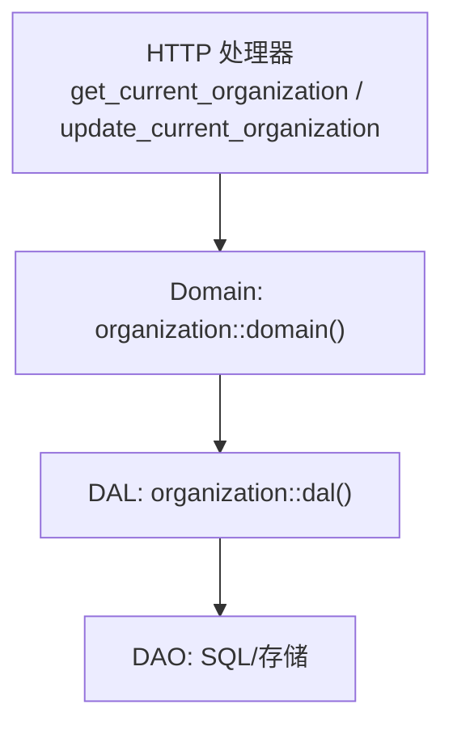
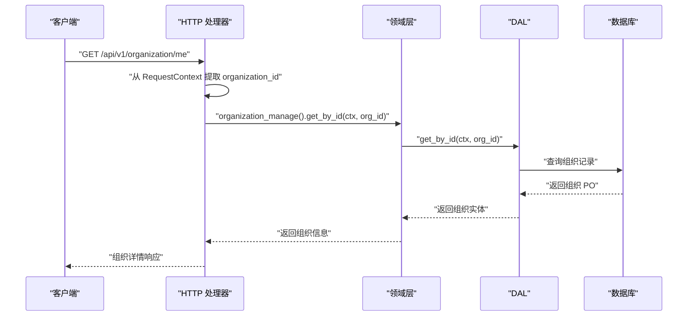
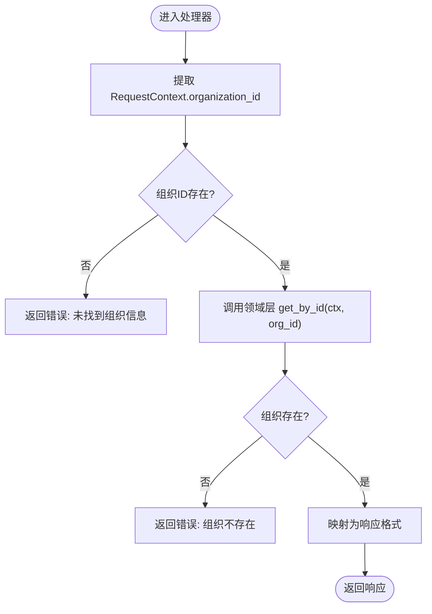
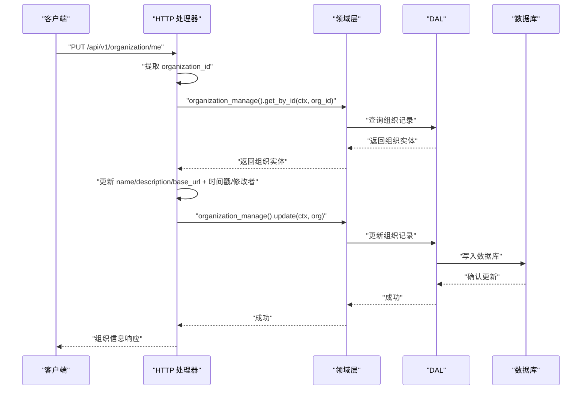
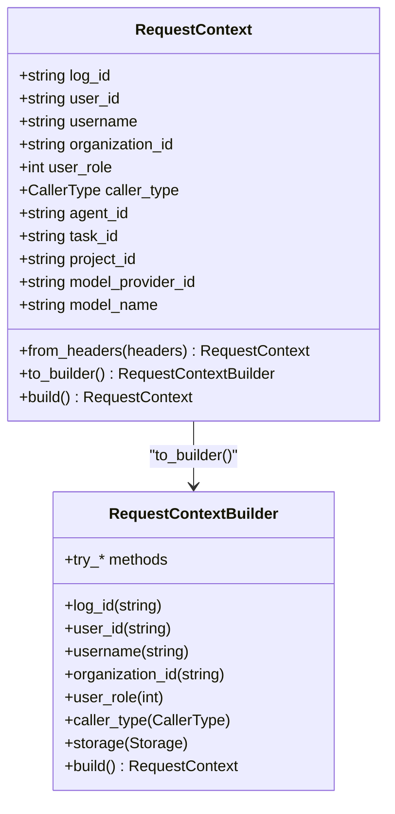
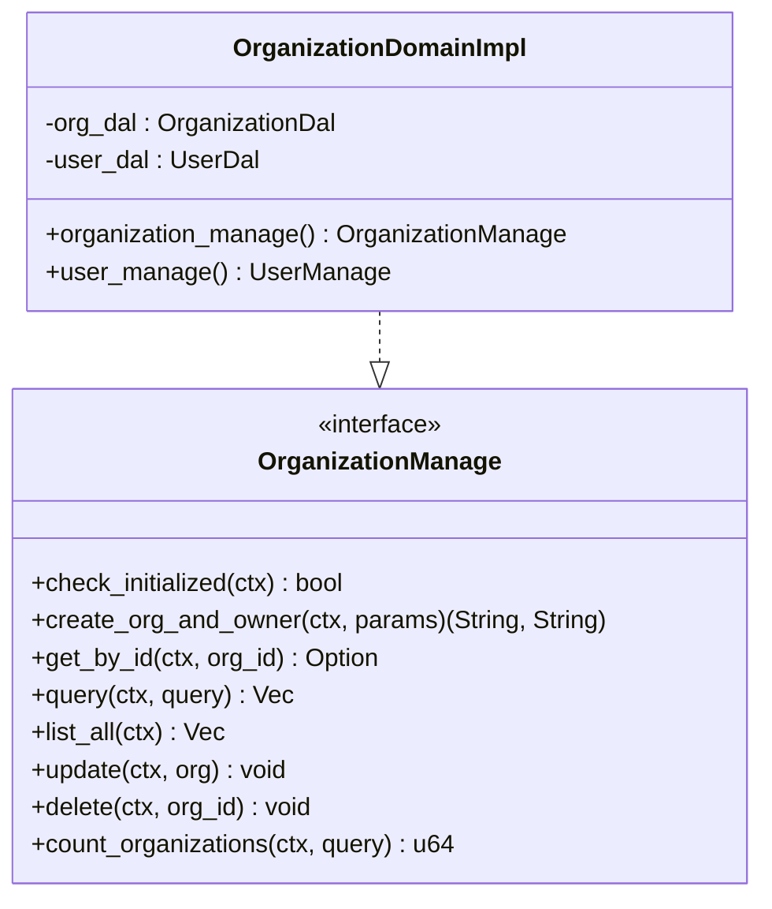
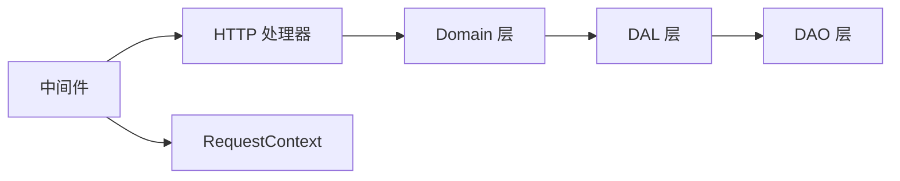

# 当前组织信息处理器

<cite>
**本文引用的文件**
- [src/handlers/organization/mod.rs](src/handlers/organization/mod.rs)
- [src/handlers/organization/organization_me/mod.rs](src/handlers/organization/organization_me/mod.rs)
- [src/handlers/organization/organization_me/get_current_organization.rs](src/handlers/organization/organization_me/get_current_organization.rs)
- [src/handlers/organization/organization_me/update_current_organization.rs](src/handlers/organization/organization_me/update_current_organization.rs)
- [src/pkg/request_context.rs](src/pkg/request_context.rs)
- [src/service/domain/organization/mod.rs](src/service/domain/organization/mod.rs)
- [src/service/domain/organization/org.rs](src/service/domain/organization/org.rs)
</cite>

## 目录
1. [简介](#简介)
2. [项目结构](#项目结构)
3. [核心组件](#核心组件)
4. [架构总览](#架构总览)
5. [详细组件分析](#详细组件分析)
6. [依赖分析](#依赖分析)
7. [性能考虑](#性能考虑)
8. [故障排查指南](#故障排查指南)
9. [结论](#结论)
10. [附录](#附录)

## 简介
本文件面向 Organization 模块的“当前组织信息处理器”，聚焦于获取与更新当前用户所在组织信息的 HTTP 处理器实现。文档覆盖以下主题：
- 上下文组织识别：从请求头到 RequestContext 的组织 ID 注入与传递
- 组织切换机制：如何基于当前上下文进行组织维度的数据访问
- 权限验证流程：结合中间件与领域层对组织数据的访问控制
- 会话组织状态管理：跨请求的组织上下文保持与扩展
- 组织边界数据过滤与跨组织访问控制：DAL/DAO 层的组织隔离策略
- 缓存策略与实时更新：领域层与 DAL 层的读取路径、更新落库与一致性
- 多组织切换最佳实践：前端与后端的协作模式
- API 示例与常见使用场景：以调用序列图展示典型流程

## 项目结构
Organization 模块按四层单向调用组织：Adapter（HTTP Handler）→ Domain → DAL → DAO。当前组织信息处理器位于 Adapter 层，通过宏注册为 HTTP 接口，并委托给 Domain 层完成业务编排。

图表来源
- [src/handlers/organization/organization_me/get_current_organization.rs:1-57](src/handlers/organization/organization_me/get_current_organization.rs#L1-L57)
- [src/handlers/organization/organization_me/update_current_organization.rs:1-77](src/handlers/organization/organization_me/update_current_organization.rs#L1-L77)
- [src/service/domain/organization/mod.rs:1-200](src/service/domain/organization/mod.rs#L1-L200)
- [src/service/domain/organization/org.rs:1-134](src/service/domain/organization/org.rs#L1-L134)

章节来源
- [src/handlers/organization/mod.rs:1-15](src/handlers/organization/mod.rs#L1-L15)
- [src/handlers/organization/organization_me/mod.rs:1-8](src/handlers/organization/organization_me/mod.rs#L1-L8)

## 核心组件
- 当前组织信息查询处理器：从 RequestContext 中解析当前组织 ID，调用领域层获取组织详情并返回响应。
- 当前组织信息更新处理器：在 RequestContext 组织边界内，读取现有组织记录，更新允许字段，持久化变更并返回最新信息。
- 请求上下文 RequestContext：贯穿请求生命周期的不可变对象，承载用户身份、组织维度、业务维度等上下文信息，并提供构建器用于上下文扩展。
- 领域层 Organization Domain：聚合组织管理与用户管理能力，提供 get_by_id、update 等接口，作为 Adapter 与 DAL 之间的业务编排点。

章节来源
- [src/handlers/organization/organization_me/get_current_organization.rs:1-57](src/handlers/organization/organization_me/get_current_organization.rs#L1-L57)
- [src/handlers/organization/organization_me/update_current_organization.rs:1-77](src/handlers/organization/organization_me/update_current_organization.rs#L1-L77)
- [src/pkg/request_context.rs:1-632](src/pkg/request_context.rs#L1-L632)
- [src/service/domain/organization/mod.rs:1-200](src/service/domain/organization/mod.rs#L1-L200)
- [src/service/domain/organization/org.rs:1-134](src/service/domain/organization/org.rs#L1-L134)

## 架构总览
当前组织信息处理器的调用链遵循严格的分层：
- Adapter 层：HTTP 处理器负责参数校验、错误转换、响应封装。
- Domain 层：组织管理接口提供业务语义方法，如 get_by_id、update。
- DAL/DAO 层：负责数据访问与持久化。

图表来源
- [src/handlers/organization/organization_me/get_current_organization.rs:1-57](src/handlers/organization/organization_me/get_current_organization.rs#L1-L57)
- [src/service/domain/organization/mod.rs:1-200](src/service/domain/organization/mod.rs#L1-L200)
- [src/service/domain/organization/org.rs:1-134](src/service/domain/organization/org.rs#L1-L134)

## 详细组件分析

### 获取当前组织信息处理器
职责与流程
- 从 RequestContext.organization_id 获取当前组织 ID；若缺失则返回错误。
- 调用领域层 organization_manage().get_by_id(ctx, org_id) 获取组织完整信息。
- 将领域实体转换为响应格式，空字符串字段转为 None，枚举状态转整型。
- 返回 GetCurrentOrganizationResponse。

关键要点
- 组织边界由 RequestContext 决定，确保后续查询仅在当前组织范围内执行。
- 错误处理采用统一 Result 类型，缺失组织或不存在时返回明确错误码。

图表来源
- [src/handlers/organization/organization_me/get_current_organization.rs:1-57](src/handlers/organization/organization_me/get_current_organization.rs#L1-L57)

章节来源
- [src/handlers/organization/organization_me/get_current_organization.rs:1-57](src/handlers/organization/organization_me/get_current_organization.rs#L1-L57)

### 更新当前组织信息处理器
职责与流程
- 从 RequestContext.organization_id 获取当前组织 ID；若缺失则返回错误。
- 调用领域层 organization_manage().get_by_id(ctx.clone(), org_id) 获取组织记录。
- 更新允许字段：name、description、base_url；设置 updated_at 与 modified_by。
- 调用领域层 organization_manage().update(ctx, &org) 持久化变更。
- 返回 UpdateCurrentOrganizationResponse。

权限与边界
- 所有写操作均在 RequestContext 指定的组织边界内进行，避免跨组织写入。
- 修改者标识来自 ctx.user_id，保证审计可追溯。

图表来源
- [src/handlers/organization/organization_me/update_current_organization.rs:1-77](src/handlers/organization/organization_me/update_current_organization.rs#L1-L77)
- [src/service/domain/organization/mod.rs:1-200](src/service/domain/organization/mod.rs#L1-L200)
- [src/service/domain/organization/org.rs:1-134](src/service/domain/organization/org.rs#L1-L134)

章节来源
- [src/handlers/organization/organization_me/update_current_organization.rs:1-77](src/handlers/organization/organization_me/update_current_organization.rs#L1-L77)

### 上下文组织识别与会话状态管理
- 组织识别来源：RequestContext.from_headers 从请求头中提取 ORGANIZATION_ID，并在 JWT 中间件后可被覆盖。
- 不可变约定：RequestContext 构建完成后不可变，如需扩展使用 to_builder() 克隆并重建。
- 上下文增强：通过 EnrichContext trait 与 enrich_ctx! 宏，将实体字段注入 builder，形成新的 RequestContext。
- 会话保持：每个请求独立构建 RequestContext，组织维度随请求生命周期传播至 Handler → Domain → DAL → DAO。

图表来源
- [src/pkg/request_context.rs:1-632](src/pkg/request_context.rs#L1-L632)

章节来源
- [src/pkg/request_context.rs:1-632](src/pkg/request_context.rs#L1-L632)

### 领域层组织管理接口
- 单例模式：domain() 提供全局唯一的 OrganizationDomain 实例，便于初始化与复用。
- 能力聚合：organization_manage() 暴露组织管理能力，包括 check_initialized、create_org_and_owner、get_by_id、query、list_all、update、delete、count_organizations。
- 实现细节：get_by_id 与 update 直接委托 DAL 层，保持 Domain 层无副作用的业务编排。

图表来源
- [src/service/domain/organization/mod.rs:1-200](src/service/domain/organization/mod.rs#L1-L200)
- [src/service/domain/organization/org.rs:1-134](src/service/domain/organization/org.rs#L1-L134)

章节来源
- [src/service/domain/organization/mod.rs:1-200](src/service/domain/organization/mod.rs#L1-L200)
- [src/service/domain/organization/org.rs:1-134](src/service/domain/organization/org.rs#L1-L134)

### 组织边界数据过滤与跨组织访问控制
- 组织边界：所有 DAL/DAO 查询均接收 RequestContext，组织 ID 作为过滤条件，确保数据仅在所属组织内可见。
- 跨组织访问：除非显式传入目标组织 ID 且具备相应权限，否则无法访问其他组织数据。
- 审计追踪：写操作记录 modified_by 与 updated_at，便于审计与问题定位。

章节来源
- [src/handlers/organization/organization_me/update_current_organization.rs:1-77](src/handlers/organization/organization_me/update_current_organization.rs#L1-L77)
- [src/service/domain/organization/mod.rs:1-200](src/service/domain/organization/mod.rs#L1-L200)

### 缓存策略与实时更新
- 读取路径：处理器 → 领域层 → DAL → DAO → 数据库。当前实现未引入应用级缓存，每次读取走数据库。
- 更新路径：处理器更新组织字段后，立即持久化到数据库，返回最新数据。
- 一致性：由于无缓存，读路径始终反映最新写入，适合强一致场景。
- 优化建议：在高并发读场景可引入只读副本或本地缓存（需考虑失效策略与一致性）。

章节来源
- [src/handlers/organization/organization_me/get_current_organization.rs:1-57](src/handlers/organization/organization_me/get_current_organization.rs#L1-L57)
- [src/handlers/organization/organization_me/update_current_organization.rs:1-77](src/handlers/organization/organization_me/update_current_organization.rs#L1-L77)

### 多组织切换最佳实践
- 前端：在用户切换组织时，更新请求头中的 ORGANIZATION_ID，确保后续请求携带新组织上下文。
- 后端：中间件解析 header 并注入 RequestContext，处理器无需关心切换逻辑，仅消费上下文。
- 权限：切换组织前需校验用户是否属于该组织或具备跨组织权限，避免越权访问。
- 会话：组织上下文随请求传播，不持久化到服务端会话，降低状态复杂度。

章节来源
- [src/pkg/request_context.rs:1-632](src/pkg/request_context.rs#L1-L632)

## 依赖分析
当前组织信息处理器依赖关系如下：
- HTTP 处理器依赖 RequestContext 与 Domain 层。
- Domain 层依赖 DAL 层，DAL 层依赖 DAO 层。
- 中间件负责认证与上下文注入，确保 RequestContext 正确构建。

图表来源
- [src/handlers/organization/organization_me/get_current_organization.rs:1-57](src/handlers/organization/organization_me/get_current_organization.rs#L1-L57)
- [src/handlers/organization/organization_me/update_current_organization.rs:1-77](src/handlers/organization/organization_me/update_current_organization.rs#L1-L77)
- [src/pkg/request_context.rs:1-632](src/pkg/request_context.rs#L1-L632)
- [src/service/domain/organization/mod.rs:1-200](src/service/domain/organization/mod.rs#L1-L200)

章节来源
- [src/handlers/organization/organization_me/get_current_organization.rs:1-57](src/handlers/organization/organization_me/get_current_organization.rs#L1-L57)
- [src/handlers/organization/organization_me/update_current_organization.rs:1-77](src/handlers/organization/organization_me/update_current_organization.rs#L1-L77)
- [src/pkg/request_context.rs:1-632](src/pkg/request_context.rs#L1-L632)
- [src/service/domain/organization/mod.rs:1-200](src/service/domain/organization/mod.rs#L1-L200)

## 性能考虑
- 无应用级缓存：每次读取走数据库，延迟受数据库性能影响。
- 组织边界过滤：在 DAL/DAO 层添加 WHERE organization_id = ?，减少不必要的数据扫描。
- 更新幂等：更新处理器仅修改允许字段，避免全量覆盖导致额外开销。
- 连接池：DAL 层使用 SqlitePool，合理配置连接数与超时。
- 监控：利用 RequestContext.stats() 记录统计指标，辅助性能分析。

[本节为通用指导，不直接分析具体文件]

## 故障排查指南
常见问题与处理
- 未找到组织信息：当 RequestContext.organization_id 为空时，处理器返回错误。检查中间件是否正确注入 ORGANIZATION_ID。
- 组织不存在：领域层 get_by_id 返回 None 时，处理器返回未找到错误。检查组织 ID 是否正确及数据是否存在。
- 权限不足：若需跨组织访问，需在中间件或领域层增加权限校验逻辑。
- 更新失败：检查 modified_by 与 updated_at 是否正确设置，以及数据库约束是否满足。

章节来源
- [src/handlers/organization/organization_me/get_current_organization.rs:1-57](src/handlers/organization/organization_me/get_current_organization.rs#L1-L57)
- [src/handlers/organization/organization_me/update_current_organization.rs:1-77](src/handlers/organization/organization_me/update_current_organization.rs#L1-L77)

## 结论
当前组织信息处理器通过 RequestContext 实现组织边界的清晰隔离，结合领域层与 DAL/DAO 层的严格分层，确保了数据访问的安全性与一致性。在多租户场景中，建议前端通过请求头传递组织上下文，后端通过中间件注入并传播，从而实现无状态的组织切换。未来可在高并发读场景引入缓存层以提升性能，同时保持更新路径的强一致性。

[本节为总结性内容，不直接分析具体文件]

## 附录
API 示例与使用场景
- 获取当前组织信息：GET /api/v1/organization/me，返回组织详情。
- 更新当前组织信息：PUT /api/v1/organization/me，支持更新名称、描述、基础 URL。
- 上下文管理：在请求头中设置 ORGANIZATION_ID，确保处理器能识别当前组织。
- 多组织切换：前端在切换组织时更新请求头，后端自动在新上下文中处理请求。

[本节为概念性说明，不直接分析具体文件]