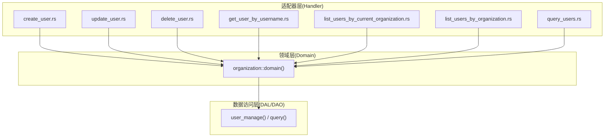
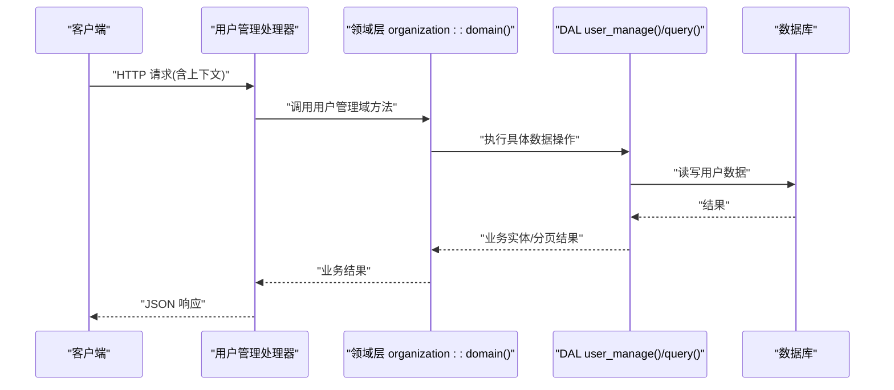
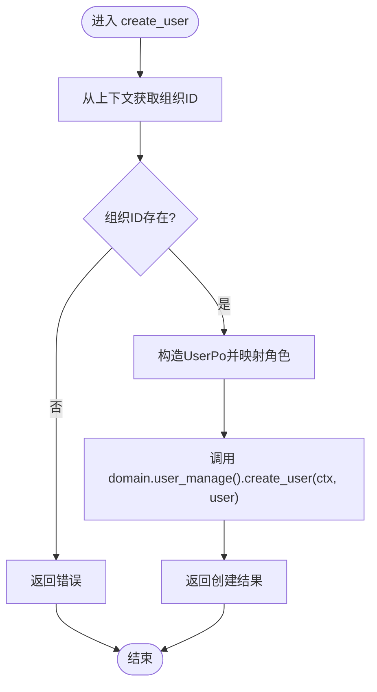
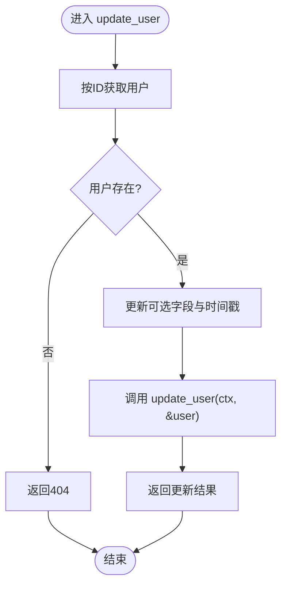
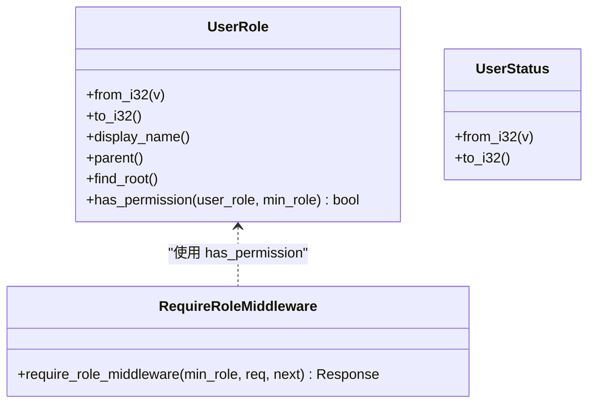
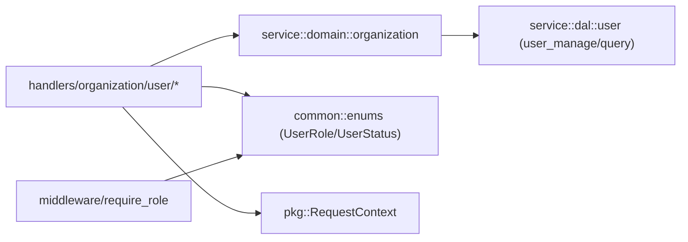

# 用户管理处理器

<cite>
**本文引用的文件**
- [src/handlers/organization/user/mod.rs](src/handlers/organization/user/mod.rs)
- [src/handlers/organization/user/create_user.rs](src/handlers/organization/user/create_user.rs)
- [src/handlers/organization/user/update_user.rs](src/handlers/organization/user/update_user.rs)
- [src/handlers/organization/user/delete_user.rs](src/handlers/organization/user/delete_user.rs)
- [src/handlers/organization/user/get_user_by_username.rs](src/handlers/organization/user/get_user_by_username.rs)
- [src/handlers/organization/user/list_users_by_current_organization.rs](src/handlers/organization/user/list_users_by_current_organization.rs)
- [src/handlers/organization/user/list_users_by_organization.rs](src/handlers/organization/user/list_users_by_organization.rs)
- [src/handlers/organization/user/query_users.rs](src/handlers/organization/user/query_users.rs)
- [common/src/enums/user.rs](common/src/enums/user.rs)
- [src/models/user.rs](src/models/user.rs)
- [src/middleware/require_role.rs](src/middleware/require_role.rs)
</cite>

## 目录
1. [简介](#简介)
2. [项目结构](#项目结构)
3. [核心组件](#核心组件)
4. [架构总览](#架构总览)
5. [详细组件分析](#详细组件分析)
6. [依赖关系分析](#依赖关系分析)
7. [性能考虑](#性能考虑)
8. [故障排查指南](#故障排查指南)
9. [结论](#结论)
10. [附录：API 示例与最佳实践](#附录api-示例与最佳实践)

## 简介
本文件聚焦 Organization 模块的用户管理 HTTP 处理器，系统性说明用户在组织内的创建、更新、删除、查询等 CRUD 能力，以及 RBAC 权限模型、角色继承、状态管理与数据验证规则。文档同时覆盖用户在组织中的权限继承、角色层次结构与访问控制策略，并提供 API 调用示例、权限验证流程与用户生命周期管理方案，最后给出企业级用户管理的最佳实践与安全配置建议。

## 项目结构
用户管理处理器位于 handlers/organization/user 下，按功能拆分为独立文件，并通过 mod.rs 统一导出。各处理器遵循四层单向调用：Adapter（HTTP Handler）→ Domain → DAL → DAO，禁止跨层调用与同层互调。

图表来源
- [src/handlers/organization/user/create_user.rs:1-72](src/handlers/organization/user/create_user.rs#L1-L72)
- [src/handlers/organization/user/update_user.rs:1-83](src/handlers/organization/user/update_user.rs#L1-L83)
- [src/handlers/organization/user/delete_user.rs:1-24](src/handlers/organization/user/delete_user.rs#L1-L24)
- [src/handlers/organization/user/get_user_by_username.rs:1-55](src/handlers/organization/user/get_user_by_username.rs#L1-L55)
- [src/handlers/organization/user/list_users_by_current_organization.rs:1-60](src/handlers/organization/user/list_users_by_current_organization.rs#L1-L60)
- [src/handlers/organization/user/list_users_by_organization.rs:1-53](src/handlers/organization/user/list_users_by_organization.rs#L1-L53)
- [src/handlers/organization/user/query_users.rs:1-62](src/handlers/organization/user/query_users.rs#L1-L62)

章节来源
- [src/handlers/organization/user/mod.rs:1-17](src/handlers/organization/user/mod.rs#L1-L17)

## 核心组件
- 用户持久化对象 UserPo：包含用户 ID、组织 ID、用户名、显示名、邮箱、密码哈希、角色、状态、审计字段与时间戳。提供基础信息提示生成与构造方法。
- 用户角色与状态枚举：UserRole（超级管理员、管理员、成员）与 UserStatus（启用、禁用），支持 i32 转换、显示名、父角色查找与权限判定。
- 角色权限中间件：基于并查集角色继承体系，校验当前用户角色是否满足最低要求，不满足返回 403。

章节来源
- [src/models/user.rs:1-98](src/models/user.rs#L1-L98)
- [common/src/enums/user.rs:1-212](common/src/enums/user.rs#L1-L212)
- [src/middleware/require_role.rs:1-39](src/middleware/require_role.rs#L1-L39)

## 架构总览
用户管理处理器的请求路径与职责如下：
- POST /api/v1/organizations/users：在当前组织内创建用户
- PUT /api/v1/organizations/users/{id}：更新用户信息
- DELETE /api/v1/organizations/users/{id}：删除用户
- GET /api/v1/organizations/users/by-username/{username}：按用户名查询用户（用于认证）
- GET /api/v1/organizations/users：列出当前组织下的所有用户
- GET /api/v1/organizations/{id}/users：按组织 ID 列出用户
- POST /api/v1/users/query：通用分页查询用户（支持更多过滤条件）

图表来源
- [src/handlers/organization/user/create_user.rs:1-72](src/handlers/organization/user/create_user.rs#L1-L72)
- [src/handlers/organization/user/update_user.rs:1-83](src/handlers/organization/user/update_user.rs#L1-L83)
- [src/handlers/organization/user/delete_user.rs:1-24](src/handlers/organization/user/delete_user.rs#L1-L24)
- [src/handlers/organization/user/get_user_by_username.rs:1-55](src/handlers/organization/user/get_user_by_username.rs#L1-L55)
- [src/handlers/organization/user/list_users_by_current_organization.rs:1-60](src/handlers/organization/user/list_users_by_current_organization.rs#L1-L60)
- [src/handlers/organization/user/list_users_by_organization.rs:1-53](src/handlers/organization/user/list_users_by_organization.rs#L1-L53)
- [src/handlers/organization/user/query_users.rs:1-62](src/handlers/organization/user/query_users.rs#L1-L62)

## 详细组件分析

### 创建用户处理器
- 路径与方法：POST /api/v1/organizations/users
- 输入：CreateUserRequest（用户名、显示名、邮箱、密码哈希、角色等）
- 行为：
  - 从 RequestContext 获取当前组织 ID
  - 生成随机用户 ID
  - 将请求角色映射为 UserRole
  - 构造 UserPo 并调用 domain.user_manage().create_user(ctx, user)
  - 返回 CreateUserResponse
- 安全与验证：
  - 未找到组织信息时返回错误
  - 该接口不注册为 Agent 工具，避免敏感字段暴露
- 复杂度：O(1) 构造 + O(1) 映射 + 下游 I/O

图表来源
- [src/handlers/organization/user/create_user.rs:1-72](src/handlers/organization/user/create_user.rs#L1-L72)

章节来源
- [src/handlers/organization/user/create_user.rs:1-72](src/handlers/organization/user/create_user.rs#L1-L72)

### 更新用户处理器
- 路径与方法：PUT /api/v1/organizations/users/{id}
- 输入：UpdateUserRequest（用户ID、可选的显示名、邮箱、角色、状态、密码哈希）
- 行为：
  - 通过 domain.user_manage().get_user_by_id(ctx, id) 获取用户
  - 根据请求参数选择性更新字段
  - 更新 updated_at 时间戳
  - 调用 domain.user_manage().update_user(ctx, &user)
  - 返回 UpdateUserResponse
- 安全与验证：
  - 用户不存在返回 404
  - 角色与状态进行 i32 到枚举的安全转换
  - 该接口不注册为 Agent 工具

图表来源
- [src/handlers/organization/user/update_user.rs:1-83](src/handlers/organization/user/update_user.rs#L1-L83)

章节来源
- [src/handlers/organization/user/update_user.rs:1-83](src/handlers/organization/user/update_user.rs#L1-L83)

### 删除用户处理器
- 路径与方法：DELETE /api/v1/organizations/users/{id}
- 输入：DeleteUserRequest（用户ID）
- 行为：调用 domain.user_manage().delete_user(ctx, id)，返回成功响应
- 安全与验证：高危操作，不注册为 Agent 工具

章节来源
- [src/handlers/organization/user/delete_user.rs:1-24](src/handlers/organization/user/delete_user.rs#L1-L24)

### 按用户名查询用户（认证用途）
- 路径与方法：GET /api/v1/organizations/users/by-username/{username}
- 输入：GetUserByUsernameRequest（用户名）
- 行为：
  - 调用 domain.user_manage().find_by_username(ctx, username)
  - 将用户转换为 UserInfoResponse（包含角色名称、状态等）
  - 返回 GetUserByUsernameResponse
- 安全与验证：仅用于认证，避免用户枚举风险；不注册为 Agent 工具

章节来源
- [src/handlers/organization/user/get_user_by_username.rs:1-55](src/handlers/organization/user/get_user_by_username.rs#L1-L55)

### 列出当前组织下的所有用户
- 路径与方法：GET /api/v1/organizations/users
- 输入：ListUsersByCurrentOrganizationRequest（无参或空体）
- 行为：
  - 从 RequestContext 获取当前组织 ID
  - 调用 domain.user_manage().find_by_organization_id(ctx, org_id)
  - 转换为 ListUsersResponse（包含用户列表与总数）
- 特性：注册为 Agent 工具，便于内部编排调用

章节来源
- [src/handlers/organization/user/list_users_by_current_organization.rs:1-60](src/handlers/organization/user/list_users_by_current_organization.rs#L1-L60)

### 按组织 ID 列出用户
- 路径与方法：GET /api/v1/organizations/{id}/users
- 输入：ListUsersByOrganizationRequest（组织ID）
- 行为：调用 domain.user_manage().find_by_organization_id(ctx, organization_id)，返回 ListUsersResponse
- 特性：注册为 Agent 工具

章节来源
- [src/handlers/organization/user/list_users_by_organization.rs:1-53](src/handlers/organization/user/list_users_by_organization.rs#L1-L53)

### 通用用户查询（分页与多条件）
- 路径与方法：POST /api/v1/users/query
- 输入：UserQueryRequest（支持 organization_id、分页等）
- 行为：
  - 优先使用请求中的 organization_id，否则回退到上下文中的组织 ID
  - 调用 domain.user_manage().query(ctx, UserQuery{...})
  - 返回 PagedResult<UserListItem>
- 特性：注册为 Agent 工具，并支持神经调用标记

章节来源
- [src/handlers/organization/user/query_users.rs:1-62](src/handlers/organization/user/query_users.rs#L1-L62)

### RBAC 权限模型与角色继承
- 角色层次：SuperAdmin（根）→ Admin → Member
- 继承规则：上级角色拥有下级角色的全部权限；判断逻辑沿 min_role 向上遍历祖先链，若包含当前用户角色则通过
- 中间件实现：require_role_middleware 读取 RequestContext 中的用户角色，调用 UserRole::has_permission 校验，失败返回 403

图表来源
- [common/src/enums/user.rs:1-212](common/src/enums/user.rs#L1-L212)
- [src/middleware/require_role.rs:1-39](src/middleware/require_role.rs#L1-L39)

章节来源
- [common/src/enums/user.rs:1-212](common/src/enums/user.rs#L1-L212)
- [src/middleware/require_role.rs:1-39](src/middleware/require_role.rs#L1-L39)

### 用户状态管理与数据验证
- 用户状态：Active（启用）、Disabled（禁用），默认 Active
- 数据验证要点：
  - 创建用户时必须提供组织 ID（来自上下文），否则返回错误
  - 更新用户时，对可选字段进行安全转换与赋值，并更新时间戳
  - 查询接口对缺失组织信息进行兜底或报错
- 审计字段：created_by、modified_by、created_at、updated_at 在 UserPo 中维护

章节来源
- [src/models/user.rs:1-98](src/models/user.rs#L1-L98)
- [src/handlers/organization/user/create_user.rs:1-72](src/handlers/organization/user/create_user.rs#L1-L72)
- [src/handlers/organization/user/update_user.rs:1-83](src/handlers/organization/user/update_user.rs#L1-L83)

## 依赖关系分析
- Handler 依赖：
  - common::api 请求/响应类型
  - common::enums 角色与状态枚举
  - crate::pkg::RequestContext 上下文
  - crate::service::domain::organization 领域入口
- 领域层依赖：
  - user_manage() 与 query() 等 DAL 接口
- 中间件依赖：
  - require_role_middleware 依赖 RequestContext 与 UserRole 权限判定

图表来源
- [src/handlers/organization/user/create_user.rs:1-72](src/handlers/organization/user/create_user.rs#L1-L72)
- [src/handlers/organization/user/query_users.rs:1-62](src/handlers/organization/user/query_users.rs#L1-L62)
- [src/middleware/require_role.rs:1-39](src/middleware/require_role.rs#L1-L39)
- [common/src/enums/user.rs:1-212](common/src/enums/user.rs#L1-L212)

章节来源
- [src/handlers/organization/user/mod.rs:1-17](src/handlers/organization/user/mod.rs#L1-L17)
- [src/middleware/require_role.rs:1-39](src/middleware/require_role.rs#L1-L39)

## 性能考虑
- 列表与查询：
  - list_* 接口直接返回组织下用户集合，适合小规模组织；大数据量建议使用 query 接口进行分页
  - query 接口支持分页参数，减少单次响应体积与内存占用
- 角色判定：
  - has_permission 沿祖先链遍历，角色层级固定且浅，开销可忽略
- I/O 优化：
  - 尽量复用 RequestContext 与 domain 实例，避免重复初始化
  - 批量操作建议在 Domain/DAL 层聚合后一次性写入

[本节为通用指导，无需特定文件引用]

## 故障排查指南
- 403 权限不足：
  - 检查当前用户角色是否满足接口要求的最低角色
  - 确认 RequestContext 中已正确注入用户角色
- 404 用户不存在：
  - 更新或删除前需确保用户存在
- 400 未找到组织信息：
  - 创建/查询接口依赖上下文中的组织 ID，请确认前置鉴权与上下文设置
- 角色映射异常：
  - 更新接口中角色与状态为 i32 到枚举的转换，确保传入值在合法范围内

章节来源
- [src/middleware/require_role.rs:1-39](src/middleware/require_role.rs#L1-L39)
- [src/handlers/organization/user/update_user.rs:1-83](src/handlers/organization/user/update_user.rs#L1-L83)
- [src/handlers/organization/user/create_user.rs:1-72](src/handlers/organization/user/create_user.rs#L1-L72)
- [src/handlers/organization/user/query_users.rs:1-62](src/handlers/organization/user/query_users.rs#L1-L62)

## 结论
用户管理处理器以清晰的 Adapter→Domain→DAL→DAO 分层实现了组织内用户的完整 CRUD 能力。RBAC 采用并查集角色继承模型，结合中间件实现统一的权限校验。通过区分 list 与 query 接口，兼顾易用性与可扩展性。建议在生产环境中严格限制敏感接口的工具注册，并结合分页与最小权限原则提升安全性与性能。

[本节为总结，无需特定文件引用]

## 附录：API 示例与最佳实践

### API 示例
- 创建用户
  - 方法：POST
  - 路径：/api/v1/organizations/users
  - 主体：CreateUserRequest（用户名、显示名、邮箱、密码哈希、角色）
  - 响应：CreateUserResponse
- 更新用户
  - 方法：PUT
  - 路径：/api/v1/organizations/users/{id}
  - 主体：UpdateUserRequest（用户ID、可选字段）
  - 响应：UpdateUserResponse
- 删除用户
  - 方法：DELETE
  - 路径：/api/v1/organizations/users/{id}
  - 响应：DeleteUserResponse
- 按用户名查询用户
  - 方法：GET
  - 路径：/api/v1/organizations/users/by-username/{username}
  - 响应：GetUserByUsernameResponse
- 列出当前组织用户
  - 方法：GET
  - 路径：/api/v1/organizations/users
  - 响应：ListUsersResponse
- 按组织 ID 列出用户
  - 方法：GET
  - 路径：/api/v1/organizations/{id}/users
  - 响应：ListUsersResponse
- 通用查询用户
  - 方法：POST
  - 路径：/api/v1/users/query
  - 主体：UserQueryRequest（organization_id、分页等）
  - 响应：PagedResult<UserListItem>

章节来源
- [src/handlers/organization/user/create_user.rs:1-72](src/handlers/organization/user/create_user.rs#L1-L72)
- [src/handlers/organization/user/update_user.rs:1-83](src/handlers/organization/user/update_user.rs#L1-L83)
- [src/handlers/organization/user/delete_user.rs:1-24](src/handlers/organization/user/delete_user.rs#L1-L24)
- [src/handlers/organization/user/get_user_by_username.rs:1-55](src/handlers/organization/user/get_user_by_username.rs#L1-L55)
- [src/handlers/organization/user/list_users_by_current_organization.rs:1-60](src/handlers/organization/user/list_users_by_current_organization.rs#L1-L60)
- [src/handlers/organization/user/list_users_by_organization.rs:1-53](src/handlers/organization/user/list_users_by_organization.rs#L1-L53)
- [src/handlers/organization/user/query_users.rs:1-62](src/handlers/organization/user/query_users.rs#L1-L62)

### 权限验证代码与角色分配机制
- 权限验证：
  - 中间件 require_role_middleware 读取 RequestContext 中的用户角色，调用 UserRole::has_permission 校验是否满足最低角色要求
- 角色分配：
  - 创建用户时，将请求中的角色映射为 UserRole（SuperAdmin/Admin/Member）
  - 更新用户时，允许调整角色与状态，并进行安全转换

章节来源
- [src/middleware/require_role.rs:1-39](src/middleware/require_role.rs#L1-L39)
- [src/handlers/organization/user/create_user.rs:1-72](src/handlers/organization/user/create_user.rs#L1-L72)
- [src/handlers/organization/user/update_user.rs:1-83](src/handlers/organization/user/update_user.rs#L1-L83)
- [common/src/enums/user.rs:1-212](common/src/enums/user.rs#L1-L212)

### 用户生命周期管理方案
- 创建：生成唯一 ID，设置组织归属与初始角色，记录审计信息
- 更新：支持修改显示名、邮箱、角色、状态与密码哈希，更新时间戳
- 删除：按用户 ID 删除，注意高权限保护
- 查询：支持按用户名、组织维度与通用分页查询
- 状态：启用/禁用状态控制用户可用性

章节来源
- [src/models/user.rs:1-98](src/models/user.rs#L1-L98)
- [src/handlers/organization/user/create_user.rs:1-72](src/handlers/organization/user/create_user.rs#L1-L72)
- [src/handlers/organization/user/update_user.rs:1-83](src/handlers/organization/user/update_user.rs#L1-L83)
- [src/handlers/organization/user/delete_user.rs:1-24](src/handlers/organization/user/delete_user.rs#L1-L24)
- [src/handlers/organization/user/get_user_by_username.rs:1-55](src/handlers/organization/user/get_user_by_username.rs#L1-L55)
- [src/handlers/organization/user/list_users_by_current_organization.rs:1-60](src/handlers/organization/user/list_users_by_current_organization.rs#L1-L60)
- [src/handlers/organization/user/list_users_by_organization.rs:1-53](src/handlers/organization/user/list_users_by_organization.rs#L1-L53)
- [src/handlers/organization/user/query_users.rs:1-62](src/handlers/organization/user/query_users.rs#L1-L62)

### 企业级最佳实践与安全配置建议
- 最小权限原则：为不同角色授予最小必要权限，避免过度授权
- 敏感接口保护：涉及密码哈希与删除操作的接口不注册为 Agent 工具，限制手动调用
- 上下文完整性：确保 RequestContext 中组织 ID 与用户角色正确注入
- 分页与限流：大数据量场景使用 query 接口分页；对高频接口实施限流
- 审计与追踪：利用 created_by/modified_by/时间戳进行审计；结合 AOP 记录关键操作
- 安全加固：密码哈希使用强算法；传输层启用 HTTPS；定期轮换密钥与令牌

[本节为通用指导，无需特定文件引用]