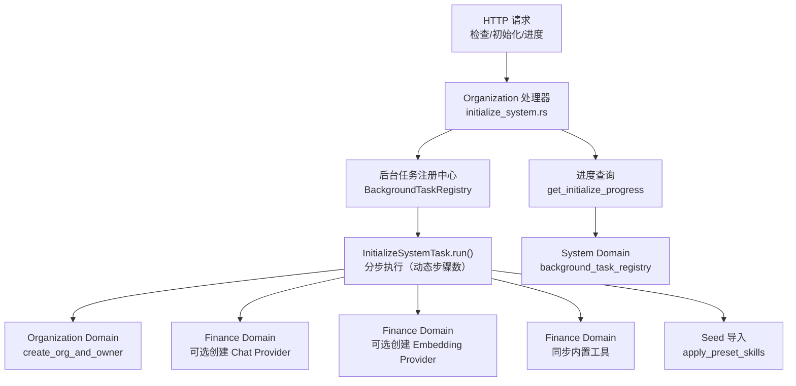
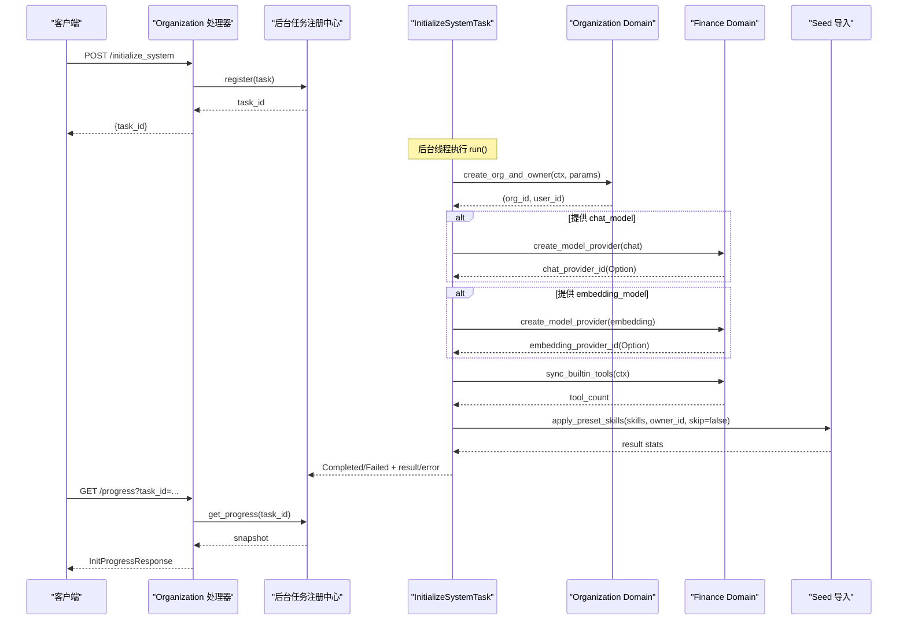
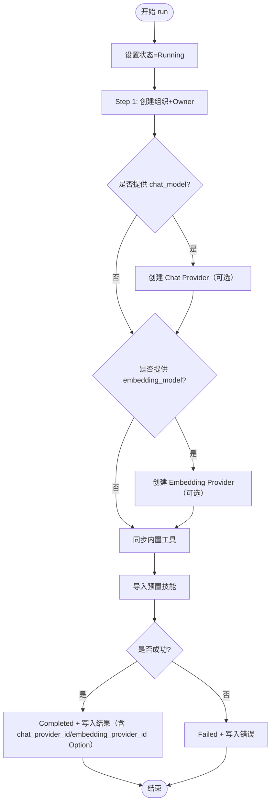
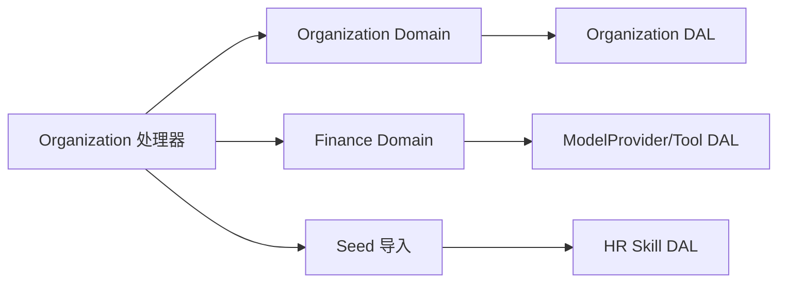

# 系统初始化处理器

<cite>
**本文引用的文件**
- [initialize_system.rs](src/handlers/organization/initialize_system.rs)
- [mod.rs（组织模块）](src/handlers/organization/mod.rs)
- [organization.rs（API DTO）](common/src/api/organization.rs)
- [mod.rs（组织 Domain）](src/service/domain/organization/mod.rs)
- [org.rs（组织 Domain 实现）](src/service/domain/organization/org.rs)
- [mod.rs（财务 Domain）](src/service/domain/finance/mod.rs)
- [mod.rs（系统 Domain）](src/service/domain/system/mod.rs)
- [seed/mod.rs（种子与预置技能导入）](src/handlers/system/seed/mod.rs)
- [20260420000000_initial.sql（数据库初始迁移）](migrations/20260420000000_initial.sql)
</cite>

## 目录
1. [简介](#简介)
2. [项目结构](#项目结构)
3. [核心组件](#核心组件)
4. [架构总览](#架构总览)
5. [详细组件分析](#详细组件分析)
6. [依赖关系分析](#依赖关系分析)
7. [性能考虑](#性能考虑)
8. [故障排除指南](#故障排除指南)
9. [结论](#结论)
10. [附录](#附录)

## 简介
本文件聚焦 Organization 模块的系统初始化 HTTP 处理器，系统化说明首次启动检测、默认数据加载、管理员账户创建和系统配置设置。文档覆盖：
- 初始化流程控制与幂等性保证
- 数据完整性验证与错误恢复机制
- 依赖检查、版本兼容性验证与回滚策略
- 系统初始化 API 示例、配置模板与部署脚本建议
- 生产环境最佳实践与排障指引

## 项目结构
系统初始化由 Handler 层编排跨 Domain 的初始化步骤，使用通用后台任务注册中心异步执行，并通过进度查询接口暴露状态。

图表来源
- [initialize_system.rs:24-284](src/handlers/organization/initialize_system.rs#L24-L284)
- [mod.rs（系统 Domain）:102-113](src/service/domain/system/mod.rs#L102-L113)

章节来源
- [initialize_system.rs:1-284](src/handlers/organization/initialize_system.rs#L1-L284)
- [mod.rs（组织模块）:1-15](src/handlers/organization/mod.rs#L1-L15)

## 核心组件
- InitializeSystemTask：自包含进度的后台任务，封装上下文、参数与状态，按步骤推进并记录结果或错误。
- check_initialized：检查系统是否已初始化（是否存在组织）。
- initialize_system：提交异步初始化任务，返回 task_id。
- get_initialize_progress：查询任务进度，映射为 InitStatus 并解析最终结果。
- Organization Domain：提供 create_org_and_owner 与 check_initialized。
- Finance Domain：提供 ModelProvider 创建、ToolProvider 内置工具同步。
- Seed 导入：应用预置技能到共享库，支持 skip_existing 语义。

章节来源
- [initialize_system.rs:24-284](src/handlers/organization/initialize_system.rs#L24-L284)
- [organization.rs（API DTO）:7-120](common/src/api/organization.rs#L7-L120)
- [mod.rs（组织 Domain）:19-123](src/service/domain/organization/mod.rs#L19-L123)
- [org.rs（组织 Domain 实现）:38-90](src/service/domain/organization/org.rs#L38-L90)
- [mod.rs（财务 Domain）:97-184, 360-457:97-184](src/service/domain/finance/mod.rs#L97-L184)
- [seed/mod.rs:130-235](src/handlers/system/seed/mod.rs#L130-L235)

## 架构总览
初始化采用“Handler 编排 + Domain 能力 + DAL/DAO 持久化”的单向调用链，严格遵循 Adapter → Domain → DAL → DAO 的分层原则。初始化是异步任务，通过 BackgroundTaskRegistry 调度，前端轮询进度接口获取执行状态。

图表来源
- [initialize_system.rs:114-224](src/handlers/organization/initialize_system.rs#L114-L224)
- [initialize_system.rs:257-283](src/handlers/organization/initialize_system.rs#L257-L283)
- [mod.rs（系统 Domain）:108-113](src/service/domain/system/mod.rs#L108-L113)

## 详细组件分析

### 初始化任务 InitializeSystemTask
- 任务生命周期：Pending → Running → Completed/Failed；每步更新 current_step 与 step_message。
- **动态步骤数**：`total_steps = 3 + usize::from(chat_model.is_some()) + usize::from(embedding_model.is_some())`。基础 3 步：创建组织 + 同步内置工具 + 导入预置技能；对话模型和向量模型步骤按请求是否提供条件化出现。
- 步骤设计：
  - Step 1：创建组织与超级管理员（Organization Domain）。
  - Step 2（可选）：创建对话模型 Provider（Finance Domain）。
  - Step 3（可选）：创建向量模型 Provider（Finance Domain）。
  - 最后：同步内置工具 + 导入预置技能（Seed 导入）。
- **前端分两步表单**：Step 1 基础信息（组织名/用户名/密码）；Step 2 模型配置（对话/向量模型均可选，未配置时跳过并提示后果）。
- 进度快照：progress() 返回 TaskProgressSnapshot，包含时间戳、错误与结果 JSON。
- 错误处理：run_steps 失败时 set_failed 并记录 error；成功则序列化结果并 set_completed。

图表来源
- [initialize_system.rs:114-224](src/handlers/organization/initialize_system.rs#L114-L224)

章节来源
- [initialize_system.rs:24-224](src/handlers/organization/initialize_system.rs#L24-L224)

### 检查初始化状态 check_initialized
- 通过 Organization Domain 的 count 查询判断是否存在组织，返回布尔值。
- 用于前端在启动时决定是否引导用户进行初始化。

章节来源
- [org.rs（组织 Domain 实现）:38-51](src/service/domain/organization/org.rs#L38-L51)
- [initialize_system.rs:227-236](src/handlers/organization/initialize_system.rs#L227-L236)

### 提交初始化 initialize_system
- 构造 InitializeSystemTask，注册到 BackgroundTaskRegistry，立即返回 task_id。
- 不阻塞 HTTP 响应，适合长耗时初始化流程。

章节来源
- [initialize_system.rs:238-249](src/handlers/organization/initialize_system.rs#L238-L249)

### 查询进度 get_initialize_progress
- 从 System Domain 的 background_task_registry 获取进度快照。
- 将 TaskStatus 映射为 InitStatus，并将 result JSON 反序列化为 InitializeSystemResponse。

章节来源
- [initialize_system.rs:251-283](src/handlers/organization/initialize_system.rs#L251-L283)
- [mod.rs（系统 Domain）:108-113](src/service/domain/system/mod.rs#L108-L113)

### Organization Domain 与实现
- create_org_and_owner：生成 org_id/user_id，创建组织和超级管理员用户，角色为 SuperAdmin。
- check_initialized：基于 count 判断是否已有组织。
- 其他 CRUD 方法透传至 DAL。

章节来源
- [mod.rs（组织 Domain）:19-123](src/service/domain/organization/mod.rs#L19-L123)
- [org.rs（组织 Domain 实现）:38-90](src/service/domain/organization/org.rs#L38-L90)

### Finance Domain 能力
- ModelProviderManage：创建/查询/更新/删除 ModelProvider，测试连接，切换 Embedding Provider。
- ToolProviderManage：内置工具同步（sync_builtin_tools），绑定/解绑工具，搜索工具等。
- 初始化中按请求选择性创建 Chat/Embedding Provider（均可选，未配置跳过），并同步内置工具。

章节来源
- [mod.rs（财务 Domain）:97-184](src/service/domain/finance/mod.rs#L97-L184)
- [mod.rs（财务 Domain）:360-457](src/service/domain/finance/mod.rs#L360-L457)

### Seed 导入与预置技能
- apply_preset_skills：从 SeedSnapshot.skills 读取定义，动态解析文件内容（content > ref_path > url），写入 DB 与文件系统。
- 支持 skip_existing 语义，避免重复导入。
- 初始化时将 author_id 替换为 Owner 用户 ID，确保资源归属正确。

章节来源
- [seed/mod.rs:130-235](src/handlers/system/seed/mod.rs#L130-L235)

## 依赖关系分析
初始化流程涉及多个 Domain 协作，依赖方向清晰且单向：
- Handler 仅负责编排与协议适配，不直接操作 DAL/DAO。
- Domain 聚合子功能 trait，对外暴露业务接口。
- DAL/DAO 负责持久化细节，PO 对象仅在 DAL/DAO 内部使用。

图表来源
- [initialize_system.rs:114-224](src/handlers/organization/initialize_system.rs#L114-L224)
- [mod.rs（组织 Domain）:19-123](src/service/domain/organization/mod.rs#L19-L123)
- [mod.rs（财务 Domain）:97-184](src/service/domain/finance/mod.rs#L97-L184)
- [seed/mod.rs:130-235](src/handlers/system/seed/mod.rs#L130-L235)

章节来源
- [initialize_system.rs:114-224](src/handlers/organization/initialize_system.rs#L114-L224)
- [mod.rs（组织 Domain）:19-123](src/service/domain/organization/mod.rs#L19-L123)
- [mod.rs（财务 Domain）:97-184](src/service/domain/finance/mod.rs#L97-L184)
- [seed/mod.rs:130-235](src/handlers/system/seed/mod.rs#L130-L235)

## 性能考虑
- 异步任务：初始化作为后台任务执行，避免阻塞 HTTP 请求。
- 步骤粒度：每步独立更新进度，便于前端展示与问题定位。
- 可选步骤：Embedding Provider 可跳过，减少不必要 IO。
- 内置工具同步：一次性写入 DB，后续 Agent 可直接使用。
- 预置技能导入：支持 skip_existing，避免重复计算与写入。

[本节为通用指导，无需具体文件引用]

## 故障排除指南
- 检查初始化状态：调用 check_initialized，若返回 false，需先执行初始化。
- 进度查询：通过 task_id 查询进度，关注 status、step_message、error 字段。
- 常见错误：
  - 网络超时：Embedding Provider 或 URL 抓取失败，检查网络与超时配置。
  - 权限不足：Seed 导入需要 SuperAdmin 权限，确认当前用户角色。
  - 数据冲突：用户名唯一约束，确保 admin_username 不重复。
- 回滚策略：
  - 单步失败会标记任务为 Failed 并记录错误，未完成的后续步骤不会执行。
  - 对于已写入的数据，建议在外部备份后重试；必要时通过备份/恢复机制回滚。
- 日志与审计：
  - 初始化过程记录关键步骤日志，便于排查。
  - 可通过系统日志查询接口查看相关日志条目。

章节来源
- [initialize_system.rs:114-224](src/handlers/organization/initialize_system.rs#L114-L224)
- [initialize_system.rs:257-283](src/handlers/organization/initialize_system.rs#L257-L283)
- [seed/mod.rs:36-46](src/handlers/system/seed/mod.rs#L36-L46)

## 结论
Organization 模块的系统初始化处理器通过异步任务与多 Domain 协作，实现了安全、可控、可观测的首次启动流程。其幂等性、进度追踪与错误恢复机制为生产环境提供了可靠保障。结合备份与恢复策略，可在复杂场景下实现稳健的部署与运维。

[本节为总结，无需具体文件引用]

## 附录

### 系统初始化 API 示例
- 检查初始化状态
  - 请求：GET /api/organization/check-initialized
  - 响应：{ initialized: bool }
- 提交初始化
  - 请求：POST /api/organization/initialize-system
  - 请求体：InitializeSystemRequest（`chat_model`/`embedding_model` 均为 Option）
  - 响应：{ task_id: string }
- 查询进度
  - 请求：GET /api/organization/init-progress?task_id={task_id}
  - 响应：InitProgressResponse；完成时 `result` 为 `InitializeSystemResponse { organization_id, user_id, chat_provider_id: Option<String>, embedding_provider_id: Option<String> }`

章节来源
- [organization.rs（API DTO）:7-120](common/src/api/organization.rs#L7-L120)
- [initialize_system.rs:227-283](src/handlers/organization/initialize_system.rs#L227-L283)

### 配置模板（InitializeSystemRequest）
- organization_name：必填，组织名称
- admin_username：必填，超级管理员用户名
- admin_password_hash：必填，前端哈希后的密码
- description：可选，组织描述
- admin_display_name：可选，显示名称
- admin_email：可选，邮箱
- chat_model：**可选**（`Option<ModelProviderInitConfig>`，`#[serde(default)]`），未配置时后端跳过创建；创建 Agent 前需在模型管理中补配
  - name：Provider 名称
  - provider_type：服务商类型（整数）
  - model_name：模型名称
  - api_key：API Key
  - base_url：可选 Base URL
  - description：可选描述
- embedding_model：**可选**（`Option<ModelProviderInitConfig>`），未配置时跳过向量索引；后续补配会自动触发全量重建

章节来源
- [organization.rs（API DTO）:7-62](common/src/api/organization.rs#L7-L62)

### 数据库表结构（初始化相关）
- organizations：组织表，包含 id、name、description、status 等
- users：用户表，包含 id、organization_id、username、password_hash、role 等
- model_providers：模型提供商表，包含 id、name、provider_type、model_name、api_key 等
- tools：工具表，包含 id、name、protocol、status 等
- skills：技能表，包含 id、name、category、author_id、status 等

章节来源
- [20260420000000_initial.sql:9-71](migrations/20260420000000_initial.sql#L9-L71)
- [20260420000000_initial.sql:202-244](migrations/20260420000000_initial.sql#L202-L244)

### 部署脚本建议
- 启动前准备
  - 确保数据库已迁移至最新版本
  - 配置环境变量（如数据库连接、外部服务地址）
- 启动服务
  - 运行后端服务，等待健康检查通过
- 执行初始化
  - 调用 check-initialized，若返回 false，调用 initialize-system
  - 轮询 init-progress，直到 completed 或 failed
- 验证
  - 登录超级管理员账户，检查组织、模型提供商、工具、技能是否就绪
- 备份
  - 初始化完成后立即执行备份，以便后续恢复

[本节为通用指导，无需具体文件引用]

### 生产环境最佳实践
- 幂等性：确保初始化可重复执行而不产生副作用（如 skip_existing）
- 权限控制：仅允许 SuperAdmin 执行高危操作
- 错误恢复：记录详细错误信息，支持重试与回滚
- 监控与告警：对初始化失败进行告警，及时通知运维
- 数据备份：初始化前后执行备份，确保数据安全

[本节为通用指导，无需具体文件引用]