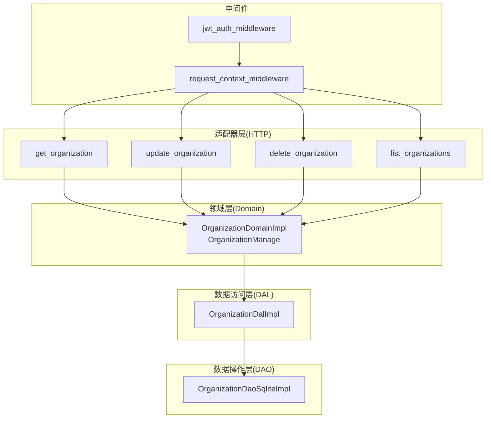
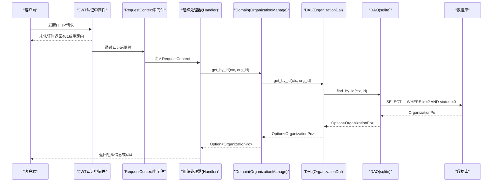
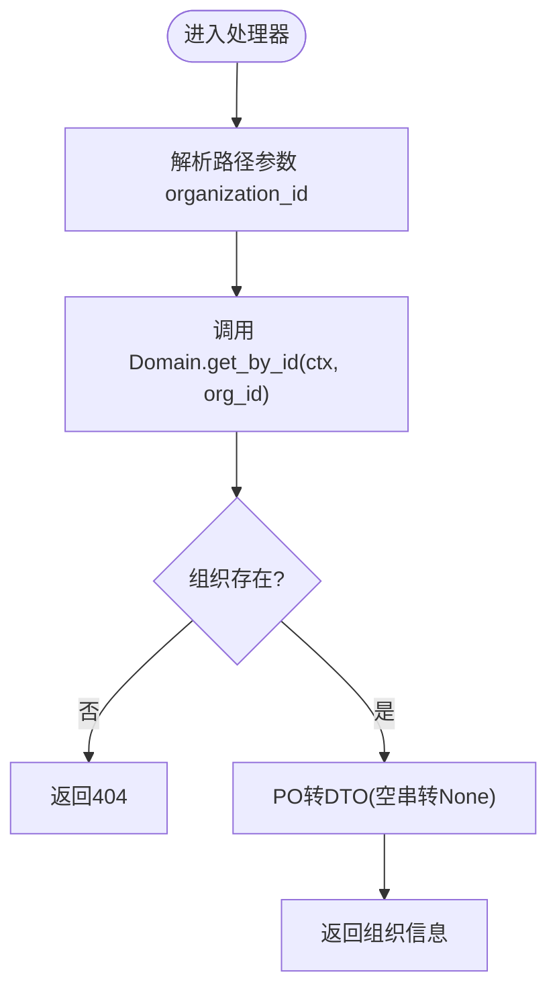
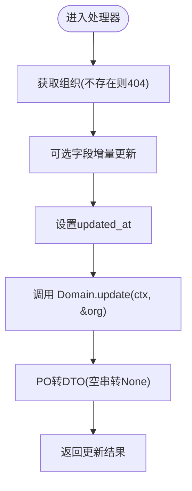
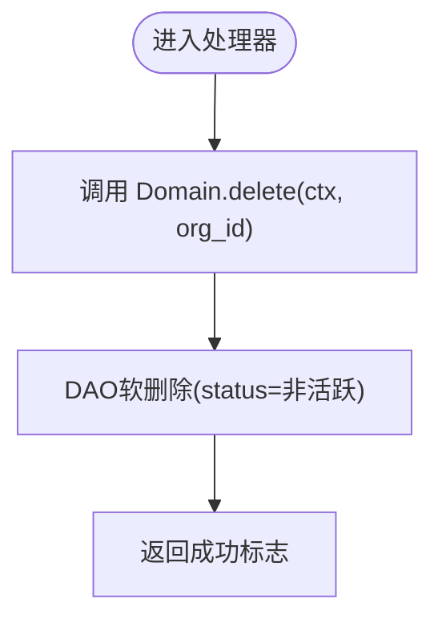
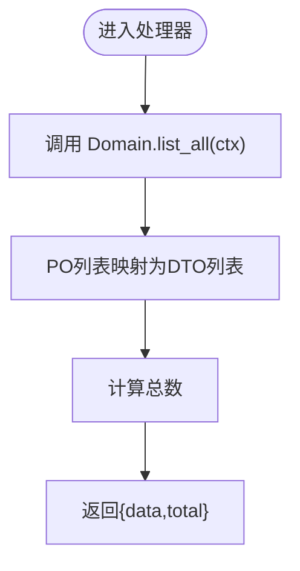
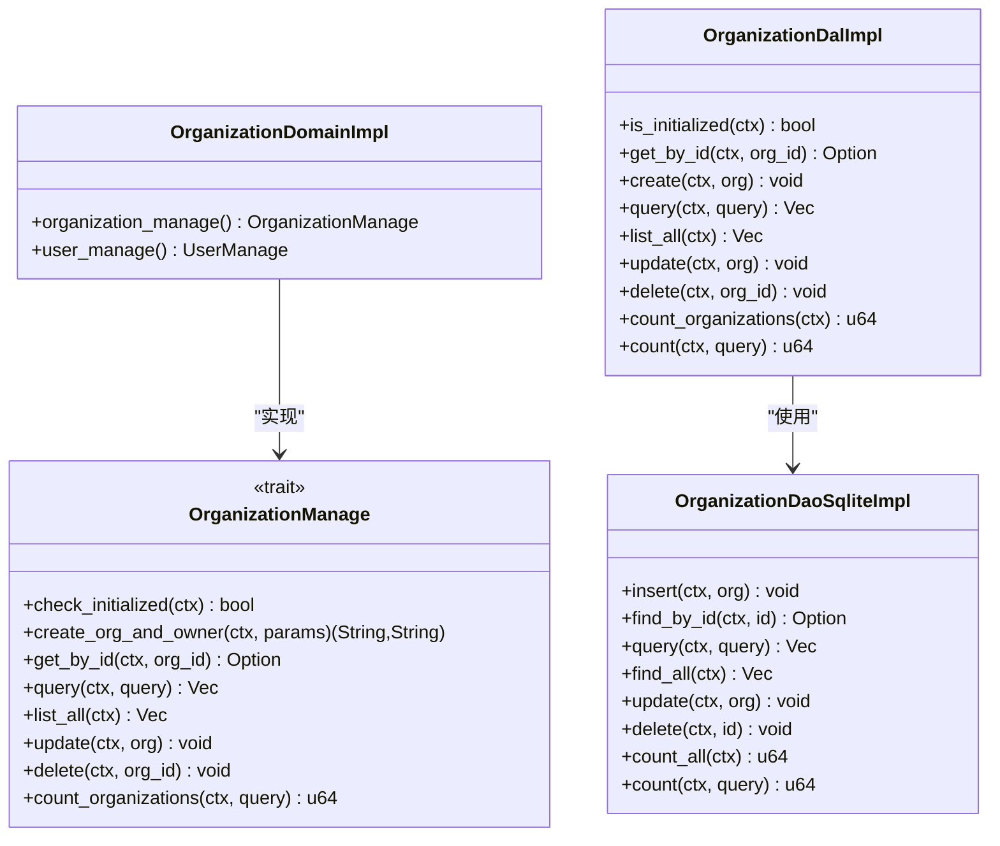
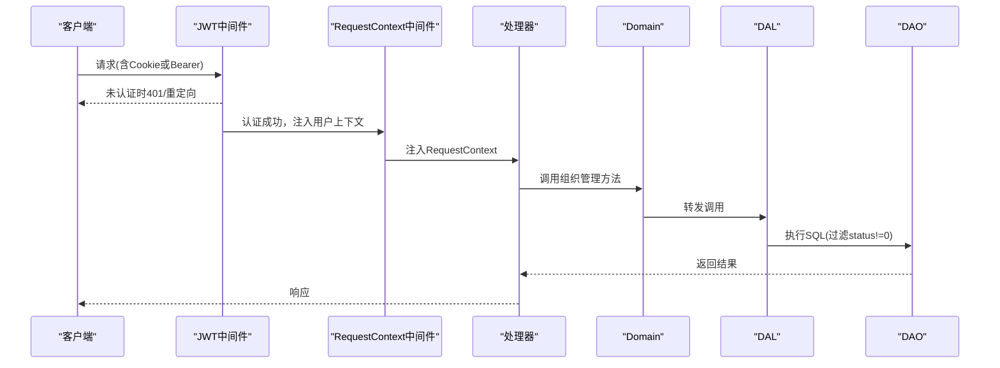
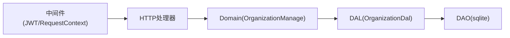

# 组织管理处理器

<cite>
**本文引用的文件**
- [src/handlers/organization/mod.rs](src/handlers/organization/mod.rs)
- [src/handlers/organization/organizations/get_organization.rs](src/handlers/organization/organizations/get_organization.rs)
- [src/handlers/organization/organizations/update_organization.rs](src/handlers/organization/organizations/update_organization.rs)
- [src/handlers/organization/organizations/delete_organization.rs](src/handlers/organization/organizations/delete_organization.rs)
- [src/handlers/organization/organizations/list_organizations.rs](src/handlers/organization/organizations/list_organizations.rs)
- [common/src/api/organization.rs](common/src/api/organization.rs)
- [src/models/organization.rs](src/models/organization.rs)
- [src/service/domain/organization/mod.rs](src/service/domain/organization/mod.rs)
- [src/service/dal/organization.rs](src/service/dal/organization.rs)
- [src/service/dao/organization/mod.rs](src/service/dao/organization/mod.rs)
- [src/service/dao/organization/sqlite.rs](src/service/dao/organization/sqlite.rs)
- [src/middleware/jwt_auth.rs](src/middleware/jwt_auth.rs)
- [src/middleware/request_context.rs](src/middleware/request_context.rs)
</cite>

## 目录
1. [简介](#简介)
2. [项目结构](#项目结构)
3. [核心组件](#核心组件)
4. [架构总览](#架构总览)
5. [详细组件分析](#详细组件分析)
6. [依赖关系分析](#依赖关系分析)
7. [性能考虑](#性能考虑)
8. [故障排查指南](#故障排查指南)
9. [结论](#结论)
10. [附录](#附录)

## 简介
本文件面向 Organization 模块的组织管理 HTTP 处理器，系统性说明组织的 CRUD（创建、查询、更新、删除、列表）实现与多租户数据隔离机制。文档覆盖：
- 四层单向调用：Adapter（HTTP Handler）→ Domain → DAL → DAO
- 多租户边界：基于 RequestContext 的 organization_id 进行数据隔离
- 权限验证流程：JWT 认证中间件 + 请求上下文注入
- 业务规则：软删除、状态枚举、字段可选更新
- 层级结构与继承：Domain Trait 聚合子能力，DAL/DAO 分层封装
- API 示例、数据校验、常见业务场景方案
- 企业级最佳实践与性能优化建议

## 项目结构
Organization 管理相关代码按职责分层组织：
- Adapter 层：HTTP 处理器位于 src/handlers/organization/organizations/*，负责参数解析、调用 Domain、转换响应 DTO
- Domain 层：src/service/domain/organization/mod.rs，定义组织管理能力 trait 并编排 DAL
- DAL 层：src/service/dal/organization.rs，统一 DAO 接口封装
- DAO 层：src/service/dao/organization/sqlite.rs，SQLite 具体实现
- 公共 DTO：common/src/api/organization.rs
- 持久化对象：src/models/organization.rs
- 中间件：src/middleware/jwt_auth.rs、request_context.rs

图表来源
- [src/handlers/organization/organizations/get_organization.rs:1-48](src/handlers/organization/organizations/get_organization.rs#L1-L48)
- [src/handlers/organization/organizations/update_organization.rs:1-68](src/handlers/organization/organizations/update_organization.rs#L1-L68)
- [src/handlers/organization/organizations/delete_organization.rs:1-24](src/handlers/organization/organizations/delete_organization.rs#L1-L24)
- [src/handlers/organization/organizations/list_organizations.rs:1-40](src/handlers/organization/organizations/list_organizations.rs#L1-L40)
- [src/service/domain/organization/mod.rs:1-200](src/service/domain/organization/mod.rs#L1-L200)
- [src/service/dal/organization.rs:1-126](src/service/dal/organization.rs#L1-L126)
- [src/service/dao/organization/sqlite.rs:1-165](src/service/dao/organization/sqlite.rs#L1-L165)
- [src/middleware/jwt_auth.rs:1-156](src/middleware/jwt_auth.rs#L1-L156)
- [src/middleware/request_context.rs:1-41](src/middleware/request_context.rs#L1-L41)

章节来源
- [src/handlers/organization/mod.rs:1-15](src/handlers/organization/mod.rs#L1-L15)
- [common/src/api/organization.rs:1-244](common/src/api/organization.rs#L1-L244)

## 核心组件
- HTTP 处理器（Adapter）
  - GET /api/v1/organizations/{id}：获取组织基本信息
  - PUT /api/v1/organizations/{id}：管理员更新组织信息
  - DELETE /api/v1/organizations/{id}：管理员删除组织（软删除）
  - GET /api/v1/organizations：列出当前用户可访问的所有组织
- 领域服务（Domain）
  - OrganizationManage trait：提供 check_initialized、create_org_and_owner、get_by_id、query、list_all、update、delete、count_organizations
- 数据访问层（DAL）
  - OrganizationDal trait：封装 DAO 并提供 list_all、is_initialized、count 等便捷方法
- 数据操作层（DAO）
  - OrganizationDao trait + sqlite 实现：SQL 语句执行、软删除、统计
- 中间件
  - JWT 认证：从 Cookie/Bearer 提取 token，验证后将 user_id、username、organization_id、role 写入请求头
  - RequestContext 提取：从请求头构建 RequestContext，注入到请求扩展

章节来源
- [src/handlers/organization/organizations/get_organization.rs:1-48](src/handlers/organization/organizations/get_organization.rs#L1-L48)
- [src/handlers/organization/organizations/update_organization.rs:1-68](src/handlers/organization/organizations/update_organization.rs#L1-L68)
- [src/handlers/organization/organizations/delete_organization.rs:1-24](src/handlers/organization/organizations/delete_organization.rs#L1-L24)
- [src/handlers/organization/organizations/list_organizations.rs:1-40](src/handlers/organization/organizations/list_organizations.rs#L1-L40)
- [src/service/domain/organization/mod.rs:1-200](src/service/domain/organization/mod.rs#L1-L200)
- [src/service/dal/organization.rs:1-126](src/service/dal/organization.rs#L1-L126)
- [src/service/dao/organization/sqlite.rs:1-165](src/service/dao/organization/sqlite.rs#L1-L165)
- [src/middleware/jwt_auth.rs:1-156](src/middleware/jwt_auth.rs#L1-L156)
- [src/middleware/request_context.rs:1-41](src/middleware/request_context.rs#L1-L41)

## 架构总览
组织管理遵循严格四层单向调用：Adapter → Domain → DAL → DAO。所有跨层传递使用 RequestContext.clone()，确保多租户上下文一致。DTO 在 Adapter 层与 Domain/DAL/DAO 之间解耦；PO 仅在 DAO/DAL 内部使用，不暴露到 Domain 及以上。

图表来源
- [src/middleware/jwt_auth.rs:1-156](src/middleware/jwt_auth.rs#L1-L156)
- [src/middleware/request_context.rs:1-41](src/middleware/request_context.rs#L1-L41)
- [src/handlers/organization/organizations/get_organization.rs:1-48](src/handlers/organization/organizations/get_organization.rs#L1-L48)
- [src/service/domain/organization/mod.rs:1-200](src/service/domain/organization/mod.rs#L1-L200)
- [src/service/dal/organization.rs:1-126](src/service/dal/organization.rs#L1-L126)
- [src/service/dao/organization/sqlite.rs:1-165](src/service/dao/organization/sqlite.rs#L1-L165)

## 详细组件分析

### 获取组织信息处理器（GET /api/v1/organizations/{id}）
- 功能：根据组织 ID 获取组织基本信息
- 流程：
  - 解析路径参数 organization_id
  - 调用 Domain.organization_manage().get_by_id(ctx, org_id)
  - 若不存在则返回 404
  - 将 PO 转换为 DTO，空字符串转为 None
- 多租户隔离：ctx 携带 organization_id，DAO 查询默认过滤非活跃记录（status != 0），结合上层权限控制确保仅能访问授权组织
- 错误处理：not_found 错误类型

图表来源
- [src/handlers/organization/organizations/get_organization.rs:1-48](src/handlers/organization/organizations/get_organization.rs#L1-L48)
- [src/service/domain/organization/mod.rs:1-200](src/service/domain/organization/mod.rs#L1-L200)
- [src/service/dao/organization/sqlite.rs:1-165](src/service/dao/organization/sqlite.rs#L1-L165)

章节来源
- [src/handlers/organization/organizations/get_organization.rs:1-48](src/handlers/organization/organizations/get_organization.rs#L1-L48)
- [common/src/api/organization.rs:188-201](common/src/api/organization.rs#L188-L201)

### 更新组织信息处理器（PUT /api/v1/organizations/{id}）
- 功能：管理员更新组织名称、描述、外部访问 Base URL、状态
- 流程：
  - 先获取现有组织，不存在则 404
  - 对可选字段进行增量更新
  - 设置 updated_at 时间戳
  - 调用 Domain.update(ctx, &org)
  - 返回更新后的 DTO
- 权限：此接口为管理员操作，需结合角色校验（由上层鉴权策略保障）
- 数据一致性：DAO update 会记录 modified_by 和 updated_at

图表来源
- [src/handlers/organization/organizations/update_organization.rs:1-68](src/handlers/organization/organizations/update_organization.rs#L1-L68)
- [src/service/dal/organization.rs:1-126](src/service/dal/organization.rs#L1-L126)
- [src/service/dao/organization/sqlite.rs:1-165](src/service/dao/organization/sqlite.rs#L1-L165)

章节来源
- [src/handlers/organization/organizations/update_organization.rs:1-68](src/handlers/organization/organizations/update_organization.rs#L1-L68)
- [common/src/api/organization.rs:203-224](common/src/api/organization.rs#L203-L224)

### 删除组织处理器（DELETE /api/v1/organizations/{id}）
- 功能：管理员删除组织（软删除）
- 流程：
  - 调用 Domain.delete(ctx, org_id)
  - DAO 将 status 置为非活跃，记录 modified_by 和 updated_at
- 安全注意：高危操作，不注册为 Agent 工具，仅限管理员手动调用

图表来源
- [src/handlers/organization/organizations/delete_organization.rs:1-24](src/handlers/organization/organizations/delete_organization.rs#L1-L24)
- [src/service/dao/organization/sqlite.rs:1-165](src/service/dao/organization/sqlite.rs#L1-L165)

章节来源
- [src/handlers/organization/organizations/delete_organization.rs:1-24](src/handlers/organization/organizations/delete_organization.rs#L1-L24)
- [common/src/api/organization.rs:226-239](common/src/api/organization.rs#L226-L239)

### 列出组织处理器（GET /api/v1/organizations）
- 功能：列出当前用户可访问的所有组织
- 流程：
  - 调用 Domain.list_all(ctx)
  - 将 PO 列表映射为 DTO 列表，空描述转为 None
  - 返回 data 与 total
- 多租户：ctx 中的 organization_id 用于后续权限判断与数据隔离

图表来源
- [src/handlers/organization/organizations/list_organizations.rs:1-40](src/handlers/organization/organizations/list_organizations.rs#L1-L40)
- [src/service/dal/organization.rs:1-126](src/service/dal/organization.rs#L1-L126)

章节来源
- [src/handlers/organization/organizations/list_organizations.rs:1-40](src/handlers/organization/organizations/list_organizations.rs#L1-L40)
- [common/src/api/organization.rs:122-140](common/src/api/organization.rs#L122-L140)

### 领域层与数据访问层设计
- Domain 层通过 trait 聚合组织管理与用户管理能力，提供统一的 create_org_and_owner、get_by_id、query、list_all、update、delete、count_organizations 等方法
- DAL 层封装 DAO 并提供 is_initialized、list_all、count 等便捷方法，保持 Domain 无感知底层存储细节
- DAO 层使用 sqlx 直接执行 SQL，支持通用查询构建器与软删除逻辑

图表来源
- [src/service/domain/organization/mod.rs:1-200](src/service/domain/organization/mod.rs#L1-L200)
- [src/service/dal/organization.rs:1-126](src/service/dal/organization.rs#L1-L126)
- [src/service/dao/organization/sqlite.rs:1-165](src/service/dao/organization/sqlite.rs#L1-L165)

章节来源
- [src/service/domain/organization/mod.rs:1-200](src/service/domain/organization/mod.rs#L1-L200)
- [src/service/dal/organization.rs:1-126](src/service/dal/organization.rs#L1-L126)
- [src/service/dao/organization/mod.rs:1-40](src/service/dao/organization/mod.rs#L1-L40)

### 多租户数据隔离与权限验证流程
- 认证：JWT 中间件优先从 Cookie 提取 token，其次从 Authorization: Bearer 提取；验证失败时浏览器请求重定向，API 请求返回 401
- 上下文：认证通过后，将 user_id、username、organization_id、role 写入请求头；RequestContext 中间件从请求头构建 RequestContext 并注入到请求扩展
- 隔离：DAO 查询默认过滤非活跃记录（status != 0），结合上层权限控制确保仅能访问授权组织；更新/删除操作记录 modified_by 与 updated_at
- 边界：处理器不直接访问数据库，全部通过 Domain → DAL → DAO 调用，保证多租户上下文一致传递

图表来源
- [src/middleware/jwt_auth.rs:1-156](src/middleware/jwt_auth.rs#L1-L156)
- [src/middleware/request_context.rs:1-41](src/middleware/request_context.rs#L1-L41)
- [src/service/dao/organization/sqlite.rs:1-165](src/service/dao/organization/sqlite.rs#L1-L165)

章节来源
- [src/middleware/jwt_auth.rs:1-156](src/middleware/jwt_auth.rs#L1-L156)
- [src/middleware/request_context.rs:1-41](src/middleware/request_context.rs#L1-L41)
- [src/service/dao/organization/sqlite.rs:1-165](src/service/dao/organization/sqlite.rs#L1-L165)

### 组织层级结构、继承关系与数据共享策略
- 层级结构：组织作为多租户根实体，用户与项目等实体通过 organization_id 归属到特定组织
- 继承关系：Domain trait 聚合子能力（组织管理、用户管理），DAL 封装 DAO，DAO 提供具体存储实现
- 数据共享策略：
  - 查询默认过滤非活跃组织（status != 0）
  - 更新/删除记录修改人与时间戳，便于审计
  - 列表接口返回当前用户可访问的组织集合，结合权限控制实现细粒度隔离

章节来源
- [src/models/organization.rs:1-62](src/models/organization.rs#L1-L62)
- [src/service/domain/organization/mod.rs:1-200](src/service/domain/organization/mod.rs#L1-L200)
- [src/service/dao/organization/sqlite.rs:1-165](src/service/dao/organization/sqlite.rs#L1-L165)

### API 示例与数据验证
- 获取组织信息
  - 请求：GET /api/v1/organizations/{organization_id}
  - 响应：包含 organization_id、name、description、base_url、status、created_at
- 更新组织信息
  - 请求：PUT /api/v1/organizations/{organization_id}，可选字段 name、description、base_url、status
  - 响应：更新后的组织信息
- 删除组织
  - 请求：DELETE /api/v1/organizations/{organization_id}
  - 响应：success 标志
- 列出组织
  - 请求：GET /api/v1/organizations
  - 响应：data 列表与 total 总数
- 数据验证：
  - 路径参数 organization_id 必填
  - 更新请求中各字段为可选，未提供则不修改
  - 空字符串在响应中转为 None，提升前端友好性

章节来源
- [common/src/api/organization.rs:122-244](common/src/api/organization.rs#L122-L244)
- [src/handlers/organization/organizations/get_organization.rs:1-48](src/handlers/organization/organizations/get_organization.rs#L1-L48)
- [src/handlers/organization/organizations/update_organization.rs:1-68](src/handlers/organization/organizations/update_organization.rs#L1-L68)
- [src/handlers/organization/organizations/delete_organization.rs:1-24](src/handlers/organization/organizations/delete_organization.rs#L1-L24)
- [src/handlers/organization/organizations/list_organizations.rs:1-40](src/handlers/organization/organizations/list_organizations.rs#L1-L40)

### 常见业务场景实现方案
- 系统初始化：创建第一个组织与超级管理员，同时配置对话模型与向量模型 Provider（由 finance domain 编排）
- 多组织切换：当前用户所在组织信息管理（获取与更新）
- 用户管理：按组织查询用户、创建/更新/删除用户、用户名唯一性检查
- 软删除与恢复：通过 status 字段控制组织活跃状态，便于审计与恢复

章节来源
- [src/service/domain/organization/mod.rs:1-200](src/service/domain/organization/mod.rs#L1-L200)
- [common/src/api/organization.rs:7-120](common/src/api/organization.rs#L7-L120)

## 依赖关系分析
- 处理器依赖 Domain 抽象，避免直接耦合 DAL/DAO
- Domain 依赖 DAL 抽象，避免直接耦合 DAO
- DAL 依赖 DAO 抽象，避免直接耦合 SQLite 实现
- 中间件为横切关注点，独立于业务逻辑

图表来源
- [src/handlers/organization/organizations/get_organization.rs:1-48](src/handlers/organization/organizations/get_organization.rs#L1-L48)
- [src/service/domain/organization/mod.rs:1-200](src/service/domain/organization/mod.rs#L1-L200)
- [src/service/dal/organization.rs:1-126](src/service/dal/organization.rs#L1-L126)
- [src/service/dao/organization/sqlite.rs:1-165](src/service/dao/organization/sqlite.rs#L1-L165)
- [src/middleware/jwt_auth.rs:1-156](src/middleware/jwt_auth.rs#L1-L156)
- [src/middleware/request_context.rs:1-41](src/middleware/request_context.rs#L1-L41)

章节来源
- [src/service/dao/organization/mod.rs:1-40](src/service/dao/organization/mod.rs#L1-L40)
- [src/service/dal/organization.rs:1-126](src/service/dal/organization.rs#L1-L126)

## 性能考虑
- 查询优化：
  - 使用 QueryBuilder 动态拼接 LIMIT，避免全表扫描
  - 默认过滤非活跃记录（status != 0），减少无效数据
- 索引建议：
  - organizations.id 主键索引
  - organizations.status 索引以加速活跃过滤
  - 如需按名称搜索，可增加 name 索引
- 连接池：
  - 复用 ctx.db_pool()，避免频繁创建连接
- 缓存策略：
  - 对热点组织信息可引入内存缓存（如 Redis），注意过期与一致性
- 批量操作：
  - 列表接口支持分页与限制数量，避免一次性返回大量数据

[本节为通用性能指导，无需特定文件引用]

## 故障排查指南
- 401 未认证：
  - 检查 Cookie 是否包含 ai_orz_jwt
  - 检查 Authorization: Bearer 是否正确
  - 确认 JWT 签名与过期时间
- 404 组织不存在：
  - 确认 organization_id 有效
  - 检查组织状态是否为非活跃（status != 0）
- 更新失败：
  - 检查字段类型与长度限制
  - 确认 modified_by 与 updated_at 正确写入
- 软删除问题：
  - 确认 delete 操作将 status 设置为非活跃
  - 查询时需过滤 status != 0

章节来源
- [src/middleware/jwt_auth.rs:1-156](src/middleware/jwt_auth.rs#L1-L156)
- [src/service/dao/organization/sqlite.rs:1-165](src/service/dao/organization/sqlite.rs#L1-L165)

## 结论
Organization 模块的组织管理处理器实现了标准的 CRUD 操作，并通过严格的四层架构与中间件机制保障了多租户数据隔离与权限控制。Domain 层提供清晰的业务能力抽象，DAL/DAO 层封装存储细节，确保可扩展性与可维护性。结合软删除、状态枚举与可选字段更新，满足企业级组织管理的常见需求。建议在生产环境中结合索引优化、连接池管理与缓存策略进一步提升性能。

[本节为总结性内容，无需特定文件引用]

## 附录
- 技术栈版本：Axum 0.8 + sqlx 0.8（SQLite）+ DuckDB 统计
- 启动流程：两阶段初始化，同步 service::init() 注册单例与 AOP producer/consumer，异步 service::init_base_data() 幂等注入默认基础数据
- 质量门槛：clippy -D warnings 零容忍，覆盖率门槛 PR 38% / main 45%，集成测试覆盖 Auth/CRUD/消息投递/向量降级/A2A/预置技能/Cron

[本节为补充信息，无需特定文件引用]