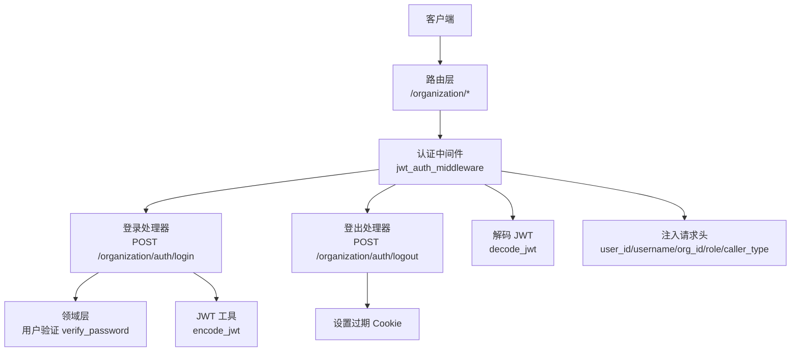
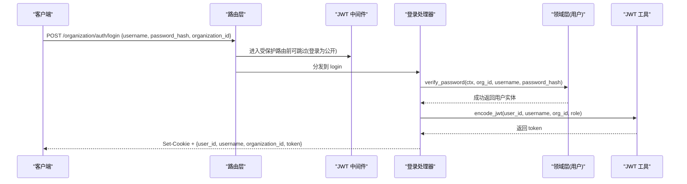
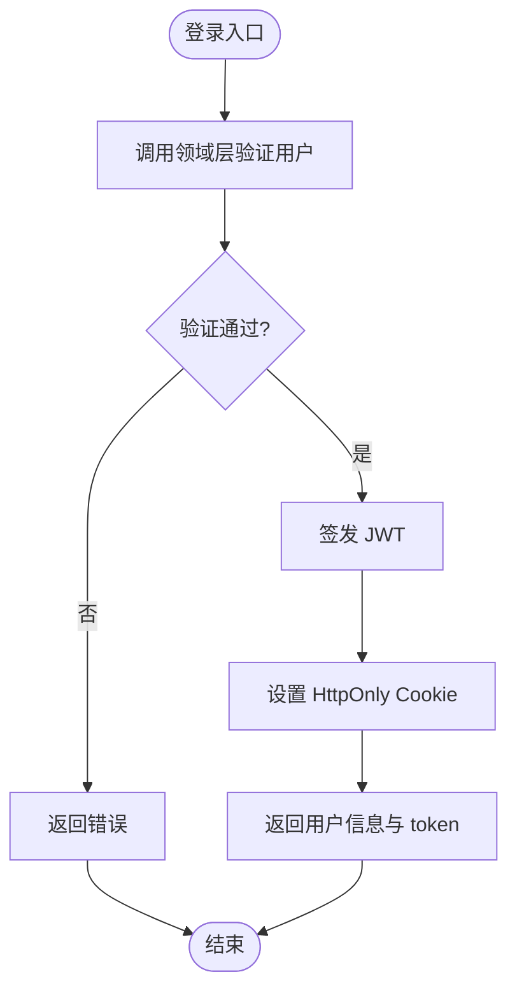
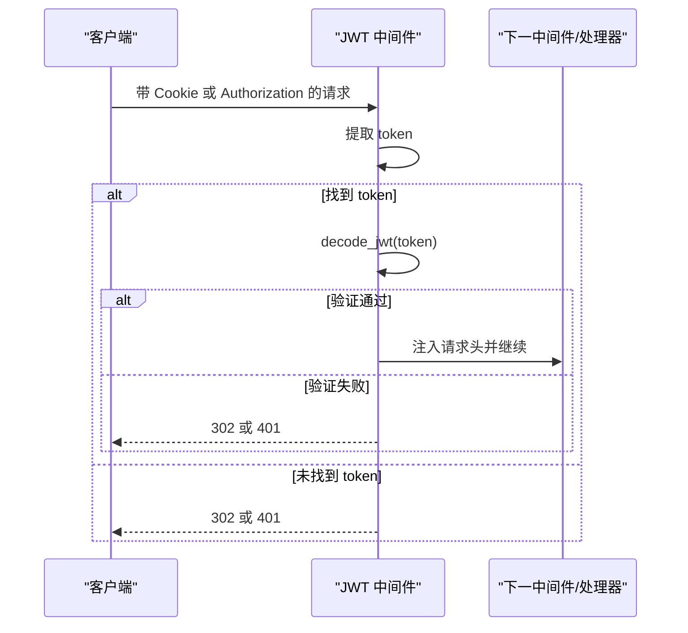
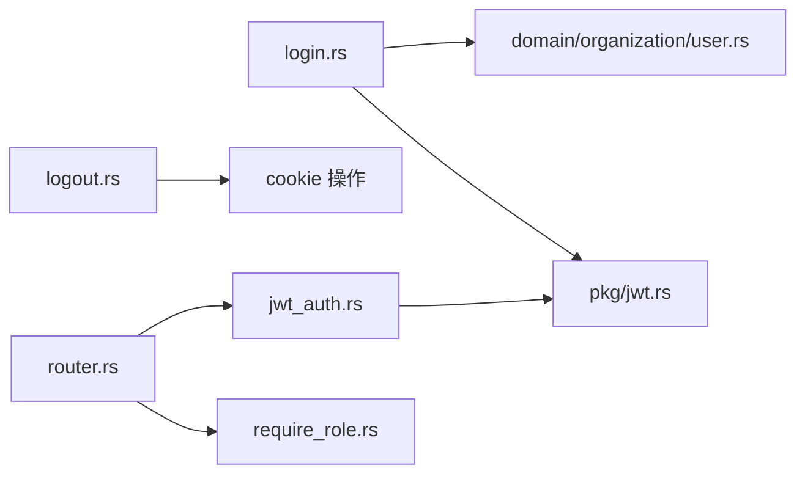

# 认证处理器

<cite>
**本文引用的文件**
- [src/handlers/organization/auth/login.rs](src/handlers/organization/auth/login.rs)
- [src/handlers/organization/auth/logout.rs](src/handlers/organization/auth/logout.rs)
- [src/middleware/jwt_auth.rs](src/middleware/jwt_auth.rs)
- [src/pkg/jwt.rs](src/pkg/jwt.rs)
- [src/service/domain/organization/user.rs](src/service/domain/organization/user.rs)
- [src/service/domain/organization/mod.rs](src/service/domain/organization/mod.rs)
- [common/src/api/auth.rs](common/src/api/auth.rs)
- [src/router.rs](src/router.rs)
- [src/middleware/require_role.rs](src/middleware/require_role.rs)
</cite>

## 目录
1. [简介](#简介)
2. [项目结构](#项目结构)
3. [核心组件](#核心组件)
4. [架构总览](#架构总览)
5. [详细组件分析](#详细组件分析)
6. [依赖关系分析](#依赖关系分析)
7. [性能与安全考量](#性能与安全考量)
8. [故障排查指南](#故障排查指南)
9. [结论](#结论)
10. [附录：API 示例与最佳实践](#附录api-示例与最佳实践)

## 简介
本文件聚焦 Organization 模块的认证处理器，系统说明用户登录、登出与 JWT 令牌管理的 HTTP 处理器实现。内容涵盖身份验证流程、JWT 签发与校验、Cookie/Bearer 双模式认证、会话管理、安全策略、权限中间件集成、密码存储与校验、多因素认证扩展点、防暴力破解机制，以及多租户环境下的认证隔离与权限控制方案。文档同时给出 API 调用示例、错误处理建议与安全最佳实践。

## 项目结构
Organization 认证相关代码位于 handlers/organization/auth，配合 middleware/jwt_auth 完成请求级鉴权，pkg/jwt 提供 JWT 工具能力，service/domain/organization 负责业务侧的用户验证逻辑，router 将受保护路由统一挂载在 /organization 下并应用认证中间件。

图表来源
- [src/router.rs:96-126](src/router.rs#L96-L126)
- [src/middleware/jwt_auth.rs:25-87](src/middleware/jwt_auth.rs#L25-L87)
- [src/handlers/organization/auth/login.rs:18-68](src/handlers/organization/auth/login.rs#L18-L68)
- [src/handlers/organization/auth/logout.rs:15-39](src/handlers/organization/auth/logout.rs#L15-L39)
- [src/pkg/jwt.rs:70-136](src/pkg/jwt.rs#L70-L136)
- [src/service/domain/organization/user.rs:85-117](src/service/domain/organization/user.rs#L85-L117)

章节来源
- [src/router.rs:96-126](src/router.rs#L96-L126)
- [src/middleware/jwt_auth.rs:25-87](src/middleware/jwt_auth.rs#L25-L87)
- [src/handlers/organization/auth/login.rs:18-68](src/handlers/organization/auth/login.rs#L18-L68)
- [src/handlers/organization/auth/logout.rs:15-39](src/handlers/organization/auth/logout.rs#L15-L39)
- [src/pkg/jwt.rs:70-136](src/pkg/jwt.rs#L70-L136)
- [src/service/domain/organization/user.rs:85-117](src/service/domain/organization/user.rs#L85-L117)

## 核心组件
- 登录处理器：接收组织 ID、用户名与密码哈希，调用领域层验证用户，成功后签发 JWT 并通过 Set-Cookie 返回；响应体包含 token 供 API 调用使用。
- 登出处理器：通过设置空值且立即过期的 Cookie 清除浏览器端会话。
- JWT 中间件：优先从 Cookie 提取 token，否则回退到 Authorization: Bearer；验证后将用户信息写入请求头，供后续 RequestContext 中间件使用。
- JWT 工具：封装 Claims、编码/解码、全局配置与默认过期时间。
- 领域用户验证：按组织隔离校验用户名、密码哈希与用户状态。
- 路由与权限：/organization 路由整体受 JWT 保护；/system 路由额外要求 Admin 角色。

章节来源
- [src/handlers/organization/auth/login.rs:18-68](src/handlers/organization/auth/login.rs#L18-L68)
- [src/handlers/organization/auth/logout.rs:15-39](src/handlers/organization/auth/logout.rs#L15-L39)
- [src/middleware/jwt_auth.rs:25-87](src/middleware/jwt_auth.rs#L25-L87)
- [src/pkg/jwt.rs:70-136](src/pkg/jwt.rs#L70-L136)
- [src/service/domain/organization/user.rs:85-117](src/service/domain/organization/user.rs#L85-L117)
- [src/router.rs:96-126](src/router.rs#L96-L126)
- [src/middleware/require_role.rs:16-38](src/middleware/require_role.rs#L16-L38)

## 架构总览
认证链路遵循四层单向调用：Adapter（HTTP Handler）→ Domain → DAL → DAO。认证处理器作为 Adapter 层，仅调用 Domain 暴露的业务接口，不直接访问数据库。JWT 工具位于 pkg 层，无业务感知。

图表来源
- [src/handlers/organization/auth/login.rs:18-68](src/handlers/organization/auth/login.rs#L18-L68)
- [src/service/domain/organization/user.rs:85-117](src/service/domain/organization/user.rs#L85-L117)
- [src/pkg/jwt.rs:70-136](src/pkg/jwt.rs#L70-L136)

## 详细组件分析

### 登录处理器
- 输入：组织 ID、用户名、密码哈希（前端已做哈希）。
- 流程：
  - 调用领域层 verify_password 进行组织隔离校验与状态检查。
  - 签发 JWT，设置 HttpOnly Cookie，并在响应体中返回 token。
- 输出：Set-Cookie 与 JSON 响应。

图表来源
- [src/handlers/organization/auth/login.rs:18-68](src/handlers/organization/auth/login.rs#L18-L68)
- [src/service/domain/organization/user.rs:85-117](src/service/domain/organization/user.rs#L85-L117)
- [src/pkg/jwt.rs:70-136](src/pkg/jwt.rs#L70-L136)

章节来源
- [src/handlers/organization/auth/login.rs:18-68](src/handlers/organization/auth/login.rs#L18-L68)
- [src/service/domain/organization/user.rs:85-117](src/service/domain/organization/user.rs#L85-L117)
- [common/src/api/auth.rs:5-27](common/src/api/auth.rs#L5-L27)

### 登出处理器
- 行为：设置同名 Cookie 为空且立即过期，使浏览器丢弃会话。
- 输出：JSON 响应表示成功。

章节来源
- [src/handlers/organization/auth/logout.rs:15-39](src/handlers/organization/auth/logout.rs#L15-L39)
- [common/src/api/auth.rs:29-38](common/src/api/auth.rs#L29-L38)

### JWT 中间件
- 双模式认证：优先 Cookie，其次 Authorization: Bearer。
- 失败响应：浏览器请求 302 重定向到登录页；API 请求返回 401 JSON。
- 通过后：将 user_id、username、organization_id、role、caller_type 注入请求头，供后续 RequestContext 中间件使用。

图表来源
- [src/middleware/jwt_auth.rs:25-87](src/middleware/jwt_auth.rs#L25-L87)
- [src/pkg/jwt.rs:94-136](src/pkg/jwt.rs#L94-L136)

章节来源
- [src/middleware/jwt_auth.rs:25-87](src/middleware/jwt_auth.rs#L25-L87)
- [src/pkg/jwt.rs:94-136](src/pkg/jwt.rs#L94-L136)

### JWT 工具与配置
- Claims：包含 user_id、username、organization_id、role、exp、iat。
- 编码：HS256 签名，基于全局配置的密钥与默认过期时间。
- 解码：校验签名与过期时间，返回 Claims。
- 配置：全局单例，支持初始化密钥与默认过期时长。

章节来源
- [src/pkg/jwt.rs:11-136](src/pkg/jwt.rs#L11-L136)

### 领域用户验证
- 组织隔离：根据 organization_id 匹配用户所属组织。
- 密码校验：比对存储的密码哈希。
- 状态检查：仅 Active 用户可登录。

章节来源
- [src/service/domain/organization/user.rs:85-117](src/service/domain/organization/user.rs#L85-L117)
- [src/service/domain/organization/mod.rs:125-199](src/service/domain/organization/mod.rs#L125-L199)

### 路由与权限中间件
- 受保护路由：/organization 整体需要有效 JWT。
- 角色权限：/system 路由要求 Admin 及以上角色。
- 执行顺序：jwt_auth_middleware（外层）→ request_context_middleware（内层）。

章节来源
- [src/router.rs:96-126](src/router.rs#L96-L126)
- [src/middleware/require_role.rs:16-38](src/middleware/require_role.rs#L16-L38)

## 依赖关系分析
- 处理器依赖领域层接口，不直接访问数据层。
- 中间件依赖 JWT 工具与常量定义。
- 路由层组合多个子路由并应用中间件。

图表来源
- [src/handlers/organization/auth/login.rs:18-68](src/handlers/organization/auth/login.rs#L18-L68)
- [src/handlers/organization/auth/logout.rs:15-39](src/handlers/organization/auth/logout.rs#L15-L39)
- [src/middleware/jwt_auth.rs:25-87](src/middleware/jwt_auth.rs#L25-L87)
- [src/pkg/jwt.rs:70-136](src/pkg/jwt.rs#L70-L136)
- [src/router.rs:96-126](src/router.rs#L96-L126)
- [src/middleware/require_role.rs:16-38](src/middleware/require_role.rs#L16-L38)

章节来源
- [src/handlers/organization/auth/login.rs:18-68](src/handlers/organization/auth/login.rs#L18-L68)
- [src/handlers/organization/auth/logout.rs:15-39](src/handlers/organization/auth/logout.rs#L15-L39)
- [src/middleware/jwt_auth.rs:25-87](src/middleware/jwt_auth.rs#L25-L87)
- [src/pkg/jwt.rs:70-136](src/pkg/jwt.rs#L70-L136)
- [src/router.rs:96-126](src/router.rs#L96-L126)
- [src/middleware/require_role.rs:16-38](src/middleware/require_role.rs#L16-L38)

## 性能与安全考量
- 性能
  - 登录路径仅一次领域查询与一次 JWT 编码，开销低。
  - 中间件解码 JWT 为轻量计算，适合高并发。
  - Cookie 模式减少前端维护 token 的复杂度。
- 安全
  - 密码以哈希形式传输与存储，避免明文泄露。
  - 组织隔离校验防止跨组织越权。
  - HttpOnly Cookie 降低 XSS 窃取风险。
  - 双模式认证兼顾浏览器与 API 场景。
  - 角色中间件对敏感路由进行最小权限控制。
- 可扩展性
  - 多因素认证：可在 verify_password 后增加二次校验步骤（如 TOTP），再签发 JWT。
  - 令牌撤销：可通过黑名单或短有效期 + 刷新令牌机制实现；当前实现未内置撤销表，建议在 Domain 层扩展。
  - 防暴力破解：建议在网关或 handler 层增加速率限制与账户锁定策略（例如同一 IP/用户短时间多次失败后延迟或锁定）。

[本节为通用指导，不直接分析具体文件]

## 故障排查指南
- 登录失败
  - 检查 verify_password 是否返回“用户名或密码错误”或“用户已被禁用”。
  - 确认前端已对密码进行哈希后再发送。
- 认证失败（401/302）
  - 检查 Cookie 是否存在且未过期。
  - 检查 Authorization: Bearer 是否正确携带。
  - 查看 JWT 解码错误日志。
- 权限不足（403）
  - 检查 require_role 中间件要求的最低角色是否满足。
- 登出不生效
  - 确认响应中包含 Set-Cookie 且 max_age=0。
  - 检查浏览器是否允许第三方 Cookie（若跨域）。

章节来源
- [src/service/domain/organization/user.rs:85-117](src/service/domain/organization/user.rs#L85-L117)
- [src/middleware/jwt_auth.rs:139-155](src/middleware/jwt_auth.rs#L139-L155)
- [src/middleware/require_role.rs:16-38](src/middleware/require_role.rs#L16-L38)
- [src/handlers/organization/auth/logout.rs:15-39](src/handlers/organization/auth/logout.rs#L15-L39)

## 结论
Organization 认证处理器采用清晰的 Adapter→Domain 分层，结合 JWT 中间件实现 Cookie/Bearer 双模式认证，配合角色中间件完成细粒度权限控制。当前实现覆盖登录、登出、JWT 签发与校验、组织隔离与状态检查。建议在生产环境中补充多因素认证、令牌撤销与防暴力破解等增强措施，以满足更高安全要求。

[本节为总结，不直接分析具体文件]

## 附录：API 示例与最佳实践

- 登录
  - 方法：POST
  - 路径：/organization/auth/login
  - 请求体字段：username、password_hash、organization_id
  - 响应：包含 user_id、username、organization_id、token；同时设置 HttpOnly Cookie
  - 参考：[common/src/api/auth.rs:5-27](common/src/api/auth.rs#L5-L27)、[src/handlers/organization/auth/login.rs:18-68](src/handlers/organization/auth/login.rs#L18-L68)

- 登出
  - 方法：POST
  - 路径：/organization/auth/logout
  - 响应：success=true；同时清除 Cookie
  - 参考：[src/handlers/organization/auth/logout.rs:15-39](src/handlers/organization/auth/logout.rs#L15-L39)、[common/src/api/auth.rs:29-38](common/src/api/auth.rs#L29-L38)

- 受保护资源访问
  - 路径：/organization/*
  - 要求：有效的 JWT（Cookie 或 Authorization: Bearer）
  - 参考：[src/router.rs:96-126](src/router.rs#L96-L126)、[src/middleware/jwt_auth.rs:25-87](src/middleware/jwt_auth.rs#L25-L87)

- 管理员路由
  - 路径：/system/*
  - 要求：Admin 及以上角色
  - 参考：[src/router.rs:110-117](src/router.rs#L110-L117)、[src/middleware/require_role.rs:16-38](src/middleware/require_role.rs#L16-L38)

- 安全最佳实践
  - 始终使用 HTTPS，并将 Cookie secure 标志设置为 true。
  - 前端对密码进行哈希后再发送，避免明文传输。
  - 为登录接口增加速率限制与账户锁定策略，防止暴力破解。
  - 定期轮换 JWT 密钥，缩短默认过期时间并结合刷新令牌机制。
  - 对敏感路由实施最小权限原则，结合角色中间件控制访问。

[本节为通用指导，不直接分析具体文件]