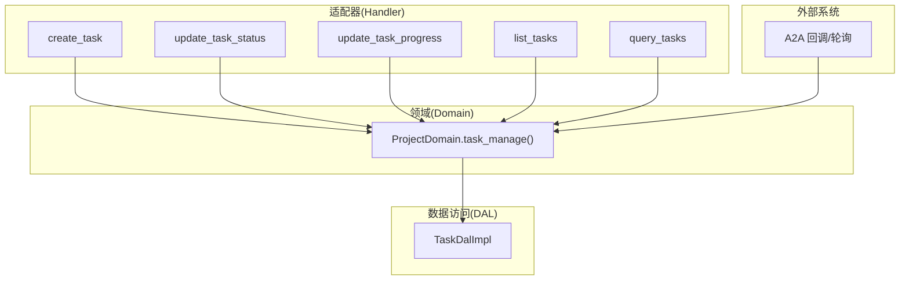
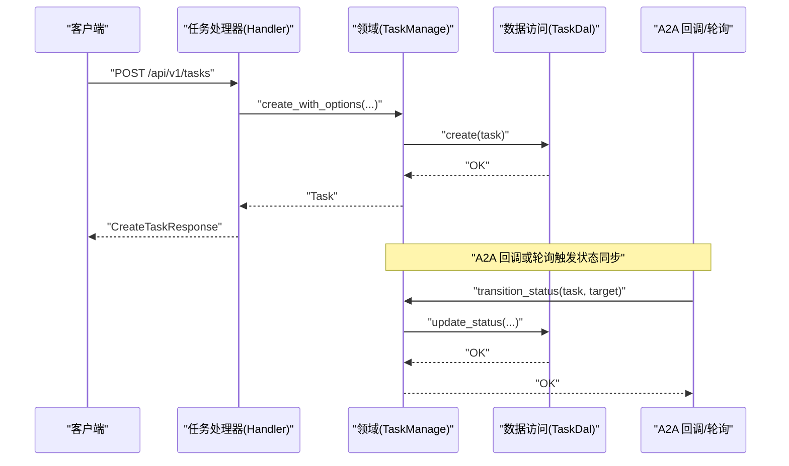
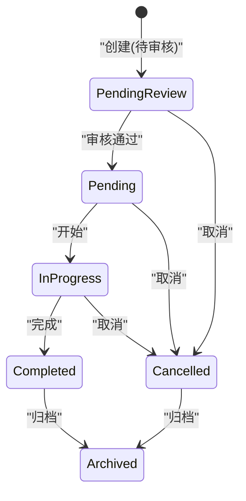
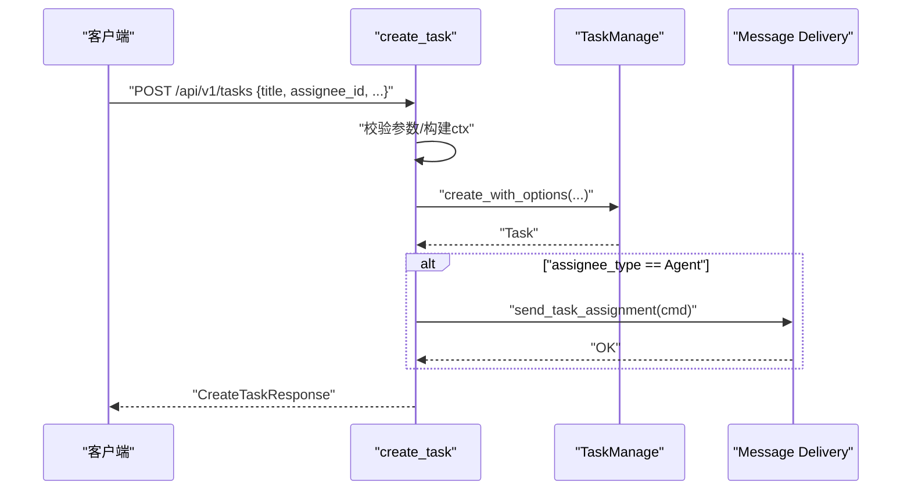
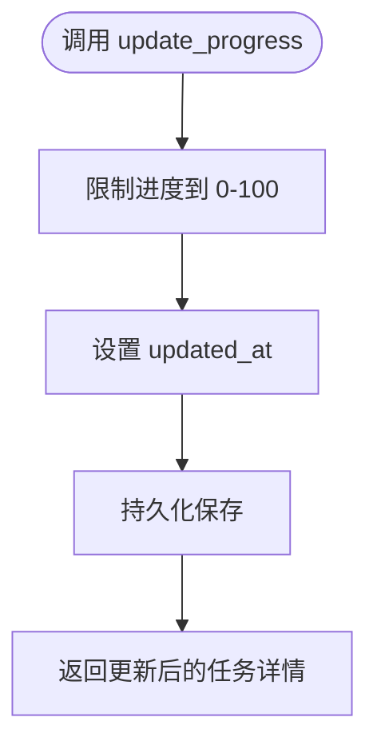
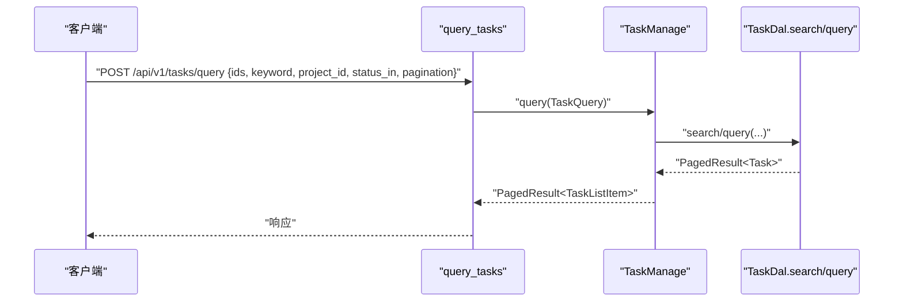
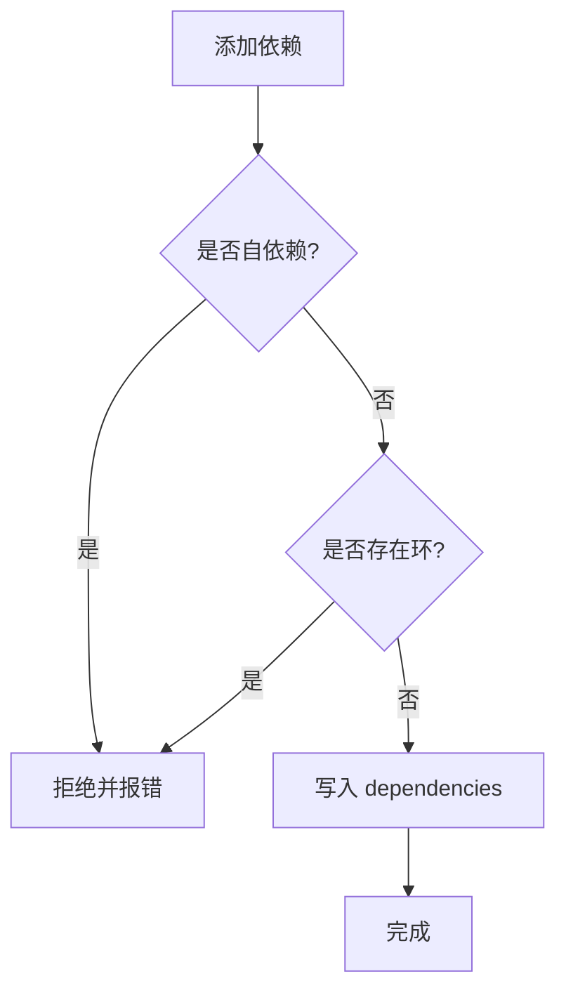
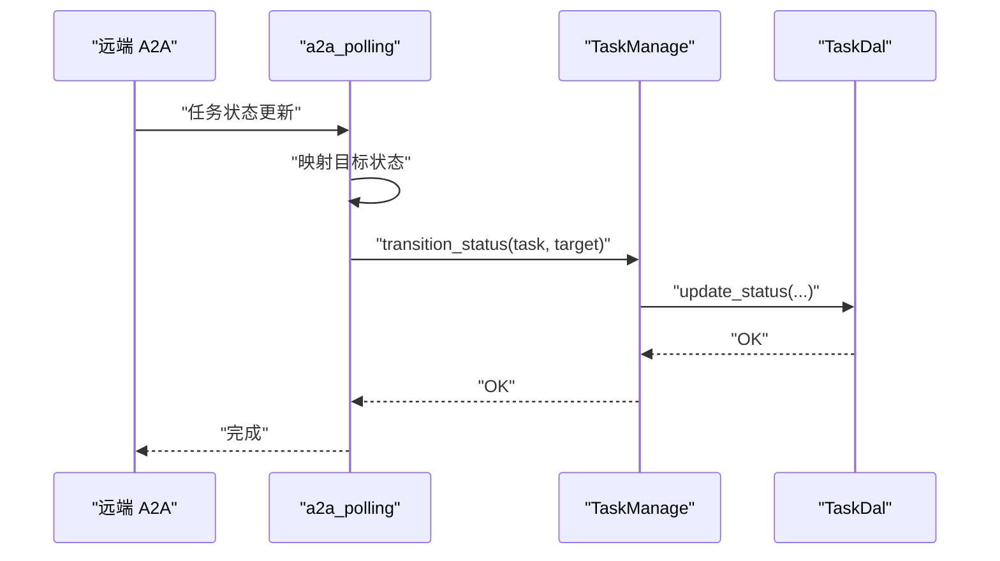
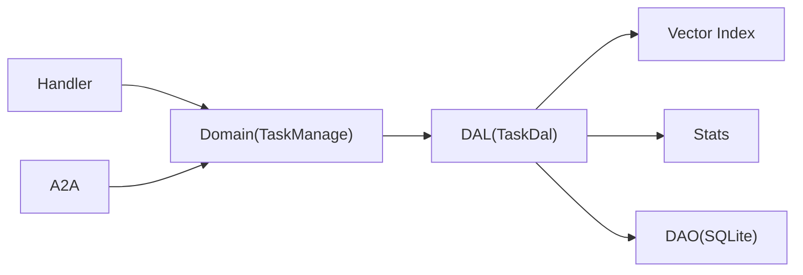

# 任务处理器

<cite>
**本文引用的文件**
- [src/models/task.rs](src/models/task.rs)
- [common/src/enums/task.rs](common/src/enums/task.rs)
- [src/service/domain/project/mod.rs](src/service/domain/project/mod.rs)
- [src/service/dal/task.rs](src/service/dal/task.rs)
- [src/handlers/project/task/create_task.rs](src/handlers/project/task/create_task.rs)
- [src/handlers/project/task/update_task_status.rs](src/handlers/project/task/update_task_status.rs)
- [src/handlers/project/task/update_task_progress.rs](src/handlers/project/task/update_task_progress.rs)
- [src/handlers/project/task/list_tasks.rs](src/handlers/project/task/list_tasks.rs)
- [src/handlers/project/task/query_tasks.rs](src/handlers/project/task/query_tasks.rs)
- [src/producer/a2a_polling.rs](src/producer/a2a_polling.rs)
- [src/handlers/a2a/callback.rs](src/handlers/a2a/callback.rs)
- [migrations/20260712000002_task_progress.sql](migrations/20260712000002_task_progress.sql)
</cite>

## 目录
1. [简介](#简介)
2. [项目结构](#项目结构)
3. [核心组件](#核心组件)
4. [架构总览](#架构总览)
5. [详细组件分析](#详细组件分析)
6. [依赖关系分析](#依赖关系分析)
7. [性能考虑](#性能考虑)
8. [故障排查指南](#故障排查指南)
9. [结论](#结论)
10. [附录](#附录)

## 简介
本章节面向“任务处理器”模块，系统化阐述任务的完整生命周期管理：创建、分配、进度跟踪、状态管理与完成标记；说明任务与项目、Agent 的关联关系，任务依赖（DAG）处理，以及任务查询与搜索、分页、状态流转逻辑。同时给出 API 调用示例、状态机设计、并发安全与错误恢复策略，并提供最佳实践与性能优化建议。

## 项目结构
任务处理器遵循严格四层单向调用：Adapter（HTTP Handler / AOP Producer）→ Domain → DAL → DAO。任务相关代码主要分布在以下位置：
- Adapter 层：HTTP 处理器位于 handlers/project/task/*，负责参数校验、上下文构建与调用 Domain。
- Domain 层：project::TaskManage trait 定义任务业务能力（创建、查询、更新、状态流转等）。
- DAL 层：dal::task 提供混合搜索、统计加载、向量索引维护等数据访问能力。
- 模型与枚举：models::task 定义 TaskPo/Task，enums::task 定义 TaskStatus、AssigneeType。

图表来源
- [src/handlers/project/task/create_task.rs:1-86](src/handlers/project/task/create_task.rs#L1-L86)
- [src/handlers/project/task/update_task_status.rs:1-41](src/handlers/project/task/update_task_status.rs#L1-L41)
- [src/handlers/project/task/update_task_progress.rs:1-30](src/handlers/project/task/update_task_progress.rs#L1-L30)
- [src/handlers/project/task/list_tasks.rs:1-37](src/handlers/project/task/list_tasks.rs#L1-L37)
- [src/handlers/project/task/query_tasks.rs:1-44](src/handlers/project/task/query_tasks.rs#L1-L44)
- [src/service/domain/project/mod.rs:91-359](src/service/domain/project/mod.rs#L91-L359)
- [src/service/dal/task.rs:72-207](src/service/dal/task.rs#L72-L207)
- [src/producer/a2a_polling.rs:218-271](src/producer/a2a_polling.rs#L218-L271)
- [src/handlers/a2a/callback.rs:160-197](src/handlers/a2a/callback.rs#L160-L197)

章节来源
- [src/handlers/project/task/create_task.rs:1-86](src/handlers/project/task/create_task.rs#L1-L86)
- [src/handlers/project/task/update_task_status.rs:1-41](src/handlers/project/task/update_task_status.rs#L1-L41)
- [src/handlers/project/task/update_task_progress.rs:1-30](src/handlers/project/task/update_task_progress.rs#L1-L30)
- [src/handlers/project/task/list_tasks.rs:1-37](src/handlers/project/task/list_tasks.rs#L1-L37)
- [src/handlers/project/task/query_tasks.rs:1-44](src/handlers/project/task/query_tasks.rs#L1-L44)
- [src/service/domain/project/mod.rs:91-359](src/service/domain/project/mod.rs#L91-L359)
- [src/service/dal/task.rs:72-207](src/service/dal/task.rs#L72-L207)
- [src/producer/a2a_polling.rs:218-271](src/producer/a2a_polling.rs#L218-L271)
- [src/handlers/a2a/callback.rs:160-197](src/handlers/a2a/callback.rs#L160-L197)

## 核心组件
- 任务模型与状态
  - TaskPo：持久化对象，包含标题、描述、状态、优先级、标签、截止时间、起止时间、依赖、根用户、分配对象、项目、思考深度、进度、执行计划/结果等字段。
  - Task：业务实体，聚合 TaskPo 及可选的搜索匹配信息、统计数据、模型调用统计、产物列表。
  - TaskStatus：任务状态枚举，包括已取消、待审核、待处理、进行中、已完成、已归档。
  - AssigneeType：分配对象类型，支持 User/Agent。

- 领域接口（TaskManage）
  - 创建：create / create_with_options
  - 读取：get / get_task / list_by_project / list_by_agent / list / query / search / count_tasks
  - 更新：update_basic / update_progress
  - 状态流转：start / complete / cancel / transition_status

- 数据访问（DAL）
  - 混合搜索：FTS5 关键词 + 向量语义
  - 统计加载：TaskStats、ModelCallStats
  - 向量索引：自动 upsert 与重建

章节来源
- [src/models/task.rs:16-81](src/models/task.rs#L16-L81)
- [src/models/task.rs:83-235](src/models/task.rs#L83-L235)
- [src/models/task.rs:237-343](src/models/task.rs#L237-L343)
- [common/src/enums/task.rs:8-100](common/src/enums/task.rs#L8-L100)
- [src/service/domain/project/mod.rs:228-359](src/service/domain/project/mod.rs#L228-L359)
- [src/service/dal/task.rs:72-207](src/service/dal/task.rs#L72-L207)

## 架构总览
任务处理器采用分层架构，确保职责清晰与可测试性：
- Adapter（Handler）：接收 HTTP 请求，进行参数校验与上下文构建，调用 Domain 层。
- Domain（TaskManage）：封装任务业务规则（状态机、依赖、权限），组合 DAL 完成数据操作。
- DAL（TaskDal）：统一数据访问入口，协调 DAO、向量索引、统计、模型调用统计等。
- 外部集成：A2A 回调与轮询通过 Domain 的状态流转接口同步任务状态。

图表来源
- [src/handlers/project/task/create_task.rs:21-84](src/handlers/project/task/create_task.rs#L21-L84)
- [src/service/domain/project/mod.rs:249-265](src/service/domain/project/mod.rs#L249-L265)
- [src/service/dal/task.rs:221-255](src/service/dal/task.rs#L221-L255)
- [src/producer/a2a_polling.rs:218-271](src/producer/a2a_polling.rs#L218-L271)
- [src/handlers/a2a/callback.rs:160-197](src/handlers/a2a/callback.rs#L160-L197)

## 详细组件分析

### 任务状态机与流转
- 状态集合：Cancelled、PendingReview、Pending、InProgress、Completed、Archived。
- 关键流转点：
  - 创建后默认进入 PendingReview/Pending（由创建选项决定）。
  - 启动：Pending → InProgress（设置 start_at）。
  - 完成：InProgress → Completed（设置 progress=100、end_at）。
  - 取消：任意可取消态 → Cancelled。
  - 归档：用于历史归档（如项目归档级联）。
- 统一入口：transition_status，所有状态变更必须经过该函数，保证一致性。

图表来源
- [common/src/enums/task.rs:8-27](common/src/enums/task.rs#L8-L27)
- [src/service/domain/project/mod.rs:334-359](src/service/domain/project/mod.rs#L334-L359)
- [src/handlers/project/task/update_task_status.rs:21-40](src/handlers/project/task/update_task_status.rs#L21-L40)

章节来源
- [common/src/enums/task.rs:8-27](common/src/enums/task.rs#L8-L27)
- [src/service/domain/project/mod.rs:334-359](src/service/domain/project/mod.rs#L334-L359)
- [src/handlers/project/task/update_task_status.rs:21-40](src/handlers/project/task/update_task_status.rs#L21-L40)

### 任务创建与分配通知
- 创建流程：
  - Handler 校验必填字段（title、assignee_id）。
  - 构建 RequestContext（携带 project_id）。
  - 调用 Domain.create_with_options 创建任务。
  - 若分配给 Agent，发送任务分配通知消息（Message Domain）。
- 关键点：
  - 创建时记录 root_user_id、assignee_type、assignee_id、project_id。
  - 通知由 Message Domain 负责，避免 Project Domain 感知消息细节。

图表来源
- [src/handlers/project/task/create_task.rs:21-84](src/handlers/project/task/create_task.rs#L21-L84)

章节来源
- [src/handlers/project/task/create_task.rs:21-84](src/handlers/project/task/create_task.rs#L21-L84)

### 任务进度更新机制
- 进度范围：0-100，超出会被截断。
- 更新入口：update_progress，内部会设置 updated_at。
- 前端交互：任务详情页通过更新进度接口刷新 UI。

图表来源
- [src/models/task.rs:205-214](src/models/task.rs#L205-L214)
- [src/handlers/project/task/update_task_progress.rs:19-29](src/handlers/project/task/update_task_progress.rs#L19-L29)

章节来源
- [src/models/task.rs:205-214](src/models/task.rs#L205-L214)
- [src/handlers/project/task/update_task_progress.rs:19-29](src/handlers/project/task/update_task_progress.rs#L19-L29)

### 任务查询与搜索
- 列表查询：list_tasks（GET，轻量过滤，排除已删除）。
- 通用查询：query_tasks（POST body，支持 ids、keyword、project_id、assignee、status_in、分页）。
- 搜索：search_tasks（FTS5 关键词 + 向量语义混合搜索，支持分页）。
- 分页：统一使用 PagedResult，支持 limit/offset。

图表来源
- [src/handlers/project/task/query_tasks.rs:14-44](src/handlers/project/task/query_tasks.rs#L14-L44)
- [src/service/dal/task.rs:133-153](src/service/dal/task.rs#L133-L153)

章节来源
- [src/handlers/project/task/list_tasks.rs:11-37](src/handlers/project/task/list_tasks.rs#L11-L37)
- [src/handlers/project/task/query_tasks.rs:14-44](src/handlers/project/task/query_tasks.rs#L14-L44)
- [src/service/dal/task.rs:133-153](src/service/dal/task.rs#L133-L153)

### 任务依赖关系处理（DAG）
- 依赖存储：dependencies 字段为 JSON 数组字符串，支持多对多依赖。
- 约束：禁止自依赖与环形依赖；支持复杂 DAG 可视化与展示。
- 实现要点：添加依赖前需检测环（DFS），成功后写入 dependencies。

图表来源
- [src/models/task.rs:296-302](src/models/task.rs#L296-L302)
- [docs/project_management_design.md:250-308](docs/project_management_design.md#L250-L308)

章节来源
- [src/models/task.rs:296-302](src/models/task.rs#L296-L302)
- [docs/project_management_design.md:250-308](docs/project_management_design.md#L250-L308)

### 任务与项目和 Agent 的关联
- 项目关联：task.project_id 指向所属项目，便于按项目维度查询与展示。
- Agent 关联：assignee_type=Agent 且 assignee_id 指定目标 Agent，用于任务分配与调度。
- 视图展示：前端根据 project_id 与 dependencies 渲染工作区图与依赖边。

章节来源
- [src/models/task.rs:37-46](src/models/task.rs#L37-L46)
- [frontend/src/components/workspace_graph.rs:215-248](frontend/src/components/workspace_graph.rs#L215-L248)

### 外部系统集成（A2A 回调与轮询）
- A2A 回调：将远程任务状态映射为本地 TaskStatus，调用 transition_status 同步。
- A2A 轮询：周期性拉取远程任务状态，必要时触发状态转换。
- 错误处理：转换失败记录警告日志，不影响整体流程。

图表来源
- [src/producer/a2a_polling.rs:218-271](src/producer/a2a_polling.rs#L218-L271)
- [src/handlers/a2a/callback.rs:160-197](src/handlers/a2a/callback.rs#L160-L197)

章节来源
- [src/producer/a2a_polling.rs:218-271](src/producer/a2a_polling.rs#L218-L271)
- [src/handlers/a2a/callback.rs:160-197](src/handlers/a2a/callback.rs#L160-L197)

## 依赖关系分析
- Handler 仅依赖 Domain 暴露的 TaskManage 接口，不直接访问 DAL/DAO。
- Domain 组合 DAL，DAL 再协调 DAO、向量索引、统计等子系统。
- 外部系统（A2A）通过 Domain 的状态流转接口与系统解耦。

图表来源
- [src/service/domain/project/mod.rs:91-359](src/service/domain/project/mod.rs#L91-L359)
- [src/service/dal/task.rs:72-207](src/service/dal/task.rs#L72-L207)

章节来源
- [src/service/domain/project/mod.rs:91-359](src/service/domain/project/mod.rs#L91-L359)
- [src/service/dal/task.rs:72-207](src/service/dal/task.rs#L72-L207)

## 性能考虑
- 混合搜索：优先使用 FTS5 关键词检索，结合向量语义提升相关性；无 Embedding Provider 时降级为纯关键词。
- 向量索引：创建任务时异步 upsert 向量索引，失败仅 warn 降级，不影响主流程；支持全量重建。
- 分页查询：统一使用 PagedResult，避免一次性加载大量数据。
- 统计加载：按需加载 TaskStats 与 ModelCallStats，减少不必要 IO。
- 并发安全：所有状态变更通过 transition_status 统一入口，避免竞态；DAL 层方法以 ctx 传递上下文，保证隔离。

章节来源
- [src/service/dal/task.rs:221-255](src/service/dal/task.rs#L221-L255)
- [src/service/dal/task.rs:143-153](src/service/dal/task.rs#L143-L153)
- [src/service/dal/task.rs:181-206](src/service/dal/task.rs#L181-L206)

## 故障排查指南
- 状态转换失败：检查当前状态与目标状态是否符合规则；查看 A2A 回调/轮询日志中的警告信息。
- 向量索引失败：确认 Embedding Provider 可用；关注 vector_index 相关 warn 日志。
- 进度更新无效：确认传入进度在 0-100 范围内；检查 updated_at 是否更新。
- 依赖环检测：新增依赖时报错通常因存在环；检查 dependencies 字段与依赖图。

章节来源
- [src/producer/a2a_polling.rs:234-259](src/producer/a2a_polling.rs#L234-L259)
- [src/handlers/a2a/callback.rs:160-197](src/handlers/a2a/callback.rs#L160-L197)
- [src/service/dal/task.rs:221-255](src/service/dal/task.rs#L221-L255)
- [src/models/task.rs:205-214](src/models/task.rs#L205-L214)

## 结论
任务处理器通过清晰的层次划分与统一的领域接口，实现了任务从创建到归档的全生命周期管理。状态机、依赖 DAG、混合搜索与统计加载共同构成了稳定可扩展的任务管理能力。配合 A2A 集成与分页查询，满足多 Agent 协作场景下的复杂任务编排与监控需求。

## 附录

### API 调用示例（路径参考）
- 创建任务：POST /api/v1/tasks
  - 参考：[src/handlers/project/task/create_task.rs:21-84](src/handlers/project/task/create_task.rs#L21-L84)
- 更新任务状态：PUT /api/v1/tasks/{id}/status
  - 参考：[src/handlers/project/task/update_task_status.rs:21-40](src/handlers/project/task/update_task_status.rs#L21-L40)
- 更新任务进度：PUT /api/v1/tasks/{id}/progress
  - 参考：[src/handlers/project/task/update_task_progress.rs:19-29](src/handlers/project/task/update_task_progress.rs#L19-L29)
- 列出任务：GET /api/v1/tasks
  - 参考：[src/handlers/project/task/list_tasks.rs:11-37](src/handlers/project/task/list_tasks.rs#L11-L37)
- 通用查询任务：POST /api/v1/tasks/query
  - 参考：[src/handlers/project/task/query_tasks.rs:14-44](src/handlers/project/task/query_tasks.rs#L14-L44)

### 数据库迁移（任务进度）
- 任务进度字段与索引：
  - 参考：[migrations/20260712000002_task_progress.sql](migrations/20260712000002_task_progress.sql)