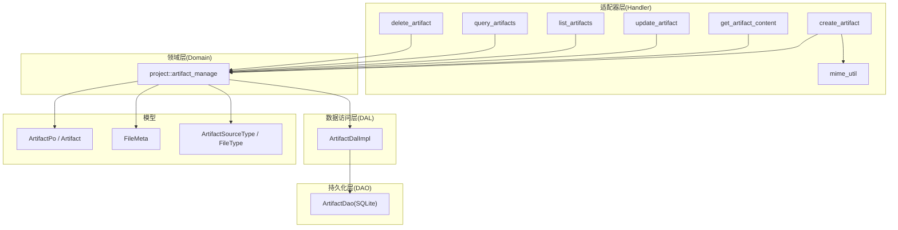
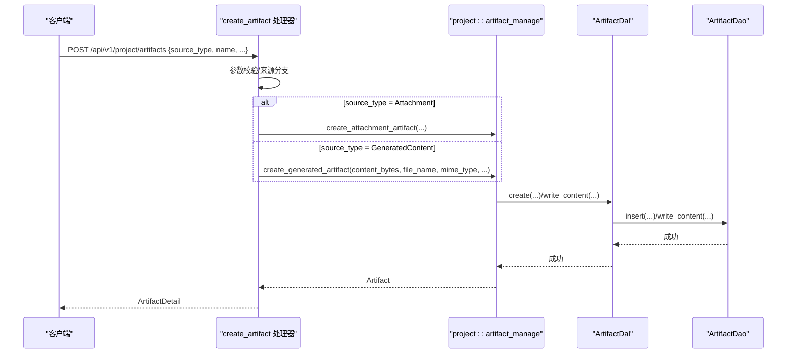
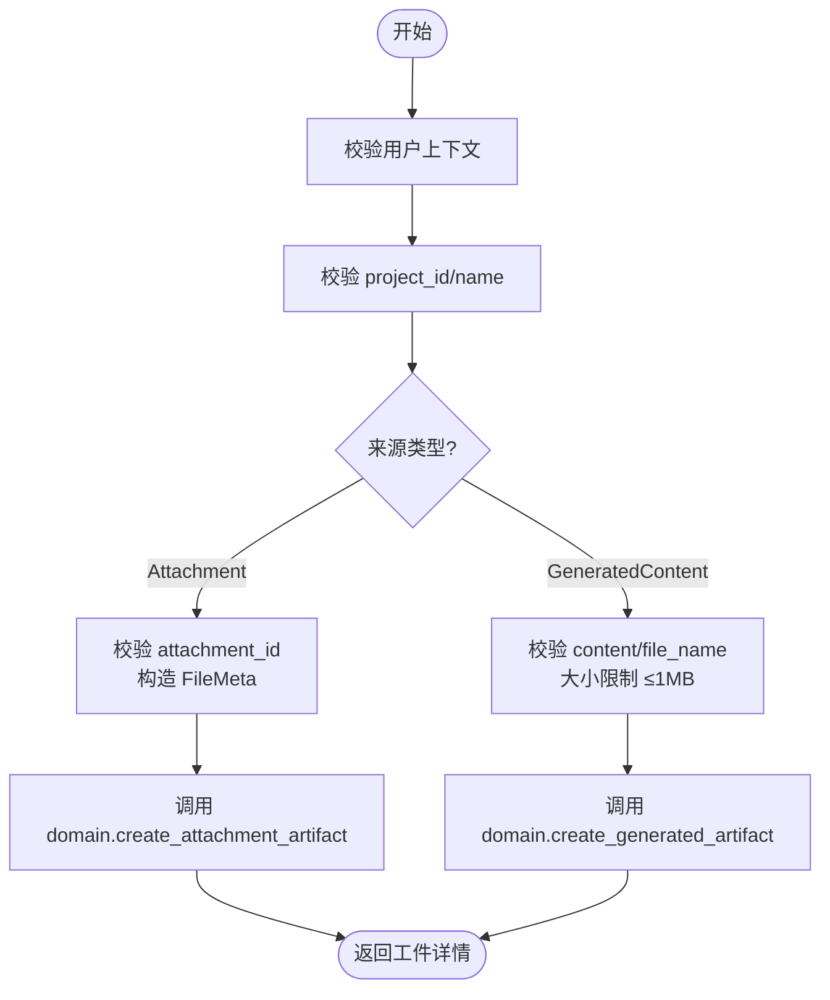
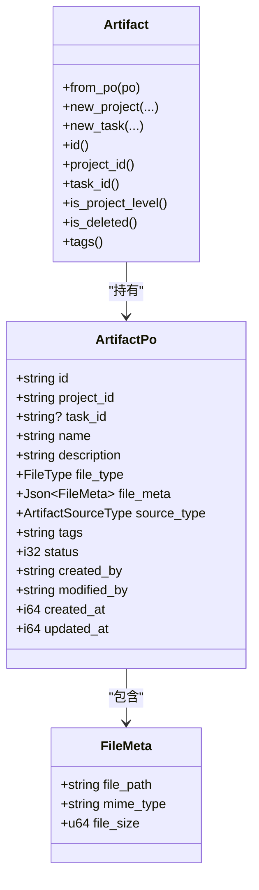
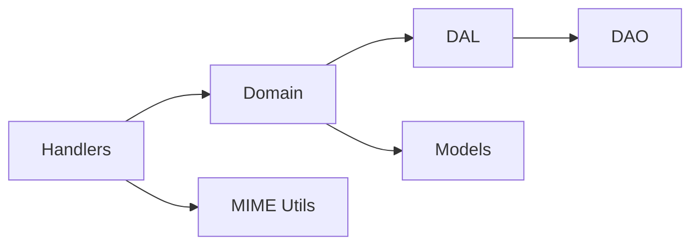

# 工件处理器

<cite>
**本文引用的文件**
- [common/src/api/artifact.rs](common/src/api/artifact.rs)
- [src/models/artifact.rs](src/models/artifact.rs)
- [src/models/file.rs](src/models/file.rs)
- [src/handlers/project/artifact/mod.rs](src/handlers/project/artifact/mod.rs)
- [src/handlers/project/artifact/create_artifact.rs](src/handlers/project/artifact/create_artifact.rs)
- [src/handlers/project/artifact/get_artifact_content.rs](src/handlers/project/artifact/get_artifact_content.rs)
- [src/handlers/project/artifact/update_artifact.rs](src/handlers/project/artifact/update_artifact.rs)
- [src/handlers/project/artifact/list_artifacts.rs](src/handlers/project/artifact/list_artifacts.rs)
- [src/handlers/project/artifact/query_artifacts.rs](src/handlers/project/artifact/query_artifacts.rs)
- [src/handlers/project/artifact/delete_artifact.rs](src/handlers/project/artifact/delete_artifact.rs)
- [src/handlers/project/artifact/mime_util.rs](src/handlers/project/artifact/mime_util.rs)
- [src/service/dal/artifact.rs](src/service/dal/artifact.rs)
- [common/src/enums/artifact.rs](common/src/enums/artifact.rs)
</cite>

## 目录
1. [简介](#简介)
2. [项目结构](#项目结构)
3. [核心组件](#核心组件)
4. [架构总览](#架构总览)
5. [详细组件分析](#详细组件分析)
6. [依赖关系分析](#依赖关系分析)
7. [性能与存储策略](#性能与存储策略)
8. [故障排查指南](#故障排查指南)
9. [结论](#结论)
10. [附录：API 参考与调用示例](#附录api-参考与调用示例)

## 简介
本模块提供“工件（Artifact）”的版本化内容管理能力，支持文本工件与二进制工件的创建、获取、更新与删除。通过统一的领域模型与 DAL/DAO 分层，实现：
- 工件来源类型管理：附件引用、生成内容、预留远程 URL
- 文件类型检测与 MIME 类型推断
- 大文件上传下载能力（基于相对路径与元数据）
- 工件注册机制、内容检索、列表查询与通用查询
- 乐观锁更新、软删除、标签与分页
- 安全校验与大小限制（文本内容上限）

## 项目结构
工件处理采用四层单向调用：Adapter（HTTP Handler）→ Domain → DAL → DAO。DTO 定义在 common 层，业务实体与持久化对象在 src/models，Handler 按方法粒度拆分，DAL 封装 DAO 并提供统一查询接口。

图表来源
- [src/handlers/project/artifact/mod.rs:1-24](src/handlers/project/artifact/mod.rs#L1-L24)
- [src/service/dal/artifact.rs:15-91](src/service/dal/artifact.rs#L15-L91)
- [src/models/artifact.rs:17-57](src/models/artifact.rs#L17-L57)
- [src/models/file.rs:6-16](src/models/file.rs#L6-L16)
- [common/src/enums/artifact.rs:8-26](common/src/enums/artifact.rs#L8-L26)

章节来源
- [src/handlers/project/artifact/mod.rs:1-24](src/handlers/project/artifact/mod.rs#L1-L24)
- [src/service/dal/artifact.rs:15-91](src/service/dal/artifact.rs#L15-L91)
- [src/models/artifact.rs:17-57](src/models/artifact.rs#L17-L57)
- [src/models/file.rs:6-16](src/models/file.rs#L6-L16)
- [common/src/enums/artifact.rs:8-26](common/src/enums/artifact.rs#L8-L26)

## 核心组件
- API DTO 与枚举
  - 请求/响应：CreateArtifactRequest、GetArtifactContentRequest、UpdateArtifactRequest、ListArtifactsRequest、ArtifactQueryRequest、ArtifactDetail 等
  - 来源类型：Attachment、GeneratedContent、RemoteUrl（预留）
- 领域模型
  - ArtifactPo：持久化对象（仅在 DAO/DAL 内部使用）
  - Artifact：业务实体（Domain 层对外暴露）
  - FileMeta：文件元信息（相对路径、MIME、大小）
- Handler 层
  - 创建、读取内容、更新、列表、通用查询、删除
  - MIME 工具：扩展名到 MIME、MIME 到 FileType、文件名提取
- DAL 层
  - ArtifactDal 接口：创建、查询、更新、删除、计数、读写内容
  - 单例管理与上下文增强（enrich_ctx）

章节来源
- [common/src/api/artifact.rs:9-269](common/src/api/artifact.rs#L9-L269)
- [src/models/artifact.rs:17-338](src/models/artifact.rs#L17-L338)
- [src/models/file.rs:6-28](src/models/file.rs#L6-L28)
- [src/handlers/project/artifact/mime_util.rs:1-111](src/handlers/project/artifact/mime_util.rs#L1-L111)
- [src/service/dal/artifact.rs:15-196](src/service/dal/artifact.rs#L15-L196)

## 架构总览
工件处理遵循严格分层：
- Adapter（Handler）：接收 HTTP 请求，参数校验，调用 Domain
- Domain：业务编排（如从附件创建工件、写入生成内容、更新元数据）
- DAL：统一数据访问抽象，转换 PO↔Entity，透传 RequestContext
- DAO：具体 SQL 实现（SQLite），负责持久化与内容读写

图表来源
- [src/handlers/project/artifact/create_artifact.rs:13-53](src/handlers/project/artifact/create_artifact.rs#L13-L53)
- [src/service/dal/artifact.rs:38-91](src/service/dal/artifact.rs#L38-L91)

章节来源
- [src/handlers/project/artifact/create_artifact.rs:13-53](src/handlers/project/artifact/create_artifact.rs#L13-L53)
- [src/service/dal/artifact.rs:38-91](src/service/dal/artifact.rs#L38-L91)

## 详细组件分析

### 工件来源类型与版本控制
- 来源类型
  - Attachment：引用财务附件，复用其相对路径、MIME、大小
  - GeneratedContent：Agent 生成的文本内容，直接写入工件文件
  - RemoteUrl：预留，当前未启用
- 版本控制
  - 通过 updated_at 字段配合 expected_updated_at 实现乐观锁更新
  - 软删除：status=0 标记删除，查询时过滤
- 标签与元数据
  - tags 以 JSON 数组存储，提供 set_tags/tags 方法
  - FileMeta 记录 file_path、mime_type、file_size

章节来源
- [common/src/enums/artifact.rs:8-62](common/src/enums/artifact.rs#L8-L62)
- [src/models/artifact.rs:17-338](src/models/artifact.rs#L17-L338)
- [src/models/file.rs:6-28](src/models/file.rs#L6-L28)

### 文件类型检测与 MIME 处理
- 扩展名到 MIME：infer_mime_type
- MIME 到 FileType：infer_file_type
- 文件名提取：basename
- 默认值策略：未知扩展返回 application/octet-stream；未知 MIME 返回 Document

章节来源
- [src/handlers/project/artifact/mime_util.rs:1-111](src/handlers/project/artifact/mime_util.rs#L1-L111)

### 创建工件（附件与生成内容）
- 附件来源：校验 attachment_id，构造 FileMeta，调用 domain 创建
- 生成内容：校验 content 非空与大小限制（≤1MB），设置默认 MIME 与 FileType，写入内容并注册工件

图表来源
- [src/handlers/project/artifact/create_artifact.rs:13-146](src/handlers/project/artifact/create_artifact.rs#L13-L146)

章节来源
- [src/handlers/project/artifact/create_artifact.rs:13-146](src/handlers/project/artifact/create_artifact.rs#L13-L146)

### 获取工件文本内容
- 仅适用于 GeneratedContent 工件
- 读取内容后校验 UTF-8，返回包含 artifact 与 content 的结构体

章节来源
- [src/handlers/project/artifact/get_artifact_content.rs:11-68](src/handlers/project/artifact/get_artifact_content.rs#L11-L68)

### 更新工件（部分更新与乐观锁）
- 支持更新 content（仅限 GeneratedContent）、name、description、tags
- 可选 expected_updated_at 进行乐观锁冲突检测
- 文本内容同样受 1MB 限制

章节来源
- [src/handlers/project/artifact/update_artifact.rs:9-54](src/handlers/project/artifact/update_artifact.rs#L9-L54)

### 列表与通用查询
- list_artifacts：按项目维度列表，支持 task_id、file_type、source_type 过滤与分页
- query_artifacts：POST body 完整查询，支持跨项目复杂条件与分页

章节来源
- [src/handlers/project/artifact/list_artifacts.rs:1-52](src/handlers/project/artifact/list_artifacts.rs#L1-L52)
- [src/handlers/project/artifact/query_artifacts.rs:1-43](src/handlers/project/artifact/query_artifacts.rs#L1-L43)
- [common/src/api/artifact.rs:76-122](common/src/api/artifact.rs#L76-L122)

### 删除工件
- 先校验存在性，再执行软删除

章节来源
- [src/handlers/project/artifact/delete_artifact.rs:1-36](src/handlers/project/artifact/delete_artifact.rs#L1-L36)

### 领域模型与 DAL
- ArtifactPo：持久化对象，包含 id、project_id、task_id、name、description、file_type、file_meta、source_type、tags、status、created_by、modified_by、created_at、updated_at
- Artifact：业务实体，封装 PO 并提供便捷方法
- DAL：统一接口，封装 DAO，提供 read/write_content、count、query、update、delete 等

图表来源
- [src/models/artifact.rs:17-57](src/models/artifact.rs#L17-L57)
- [src/models/file.rs:6-16](src/models/file.rs#L6-L16)

章节来源
- [src/models/artifact.rs:17-338](src/models/artifact.rs#L17-L338)
- [src/service/dal/artifact.rs:38-91](src/service/dal/artifact.rs#L38-L91)

## 依赖关系分析
- Handler 依赖 Domain 的 artifact_manage 接口
- Domain 依赖 DAL 的 ArtifactDal 接口
- DAL 依赖 DAO 的具体实现（SQLite）
- 模型层共享 FileMeta 与枚举类型
- MIME 工具为 Handler 提供辅助能力

图表来源
- [src/handlers/project/artifact/mod.rs:1-24](src/handlers/project/artifact/mod.rs#L1-L24)
- [src/service/dal/artifact.rs:15-91](src/service/dal/artifact.rs#L15-L91)

章节来源
- [src/handlers/project/artifact/mod.rs:1-24](src/handlers/project/artifact/mod.rs#L1-L24)
- [src/service/dal/artifact.rs:15-91](src/service/dal/artifact.rs#L15-L91)

## 性能与存储策略
- 文本内容大小限制：创建与更新时对文本内容实施 1MB 限制，避免过大负载
- 流式/分块建议：对于二进制大文件，建议在更上层或网关层实现分块上传与断点续传；当前实现通过 FileMeta 记录相对路径与大小，便于后续扩展
- 查询优化：
  - 列表与通用查询支持分页（limit/offset），默认 limit 上限保护
  - 通过 source_type、file_type、task_id 等条件缩小结果集
- 缓存机制：
  - 当前代码未内置内存缓存；可在 DAL 层引入读多写少的缓存（如 LRU）以提升热点工件读取性能
  - 注意缓存失效策略与一致性（更新/删除时失效）
- 存储策略：
  - 工件内容以相对路径存储在 attachments 目录下，结合 FileMeta 管理
  - 附件来源复用已有相对路径，减少重复存储
- 并发与一致性：
  - 更新操作支持 expected_updated_at 乐观锁，防止覆盖更新
  - 软删除避免物理删除带来的数据丢失风险

[本节为通用指导，不直接分析具体文件]

## 故障排查指南
- 常见错误
  - 缺少用户上下文：检查认证中间件与 RequestContext
  - 参数为空：project_id、name、content/file_name 等必填项校验失败
  - 文本内容超限：超过 1MB 将拒绝
  - 非 UTF-8 文本：读取内容时校验失败
  - 工件不存在：删除/更新前需确保工件存在
- 定位步骤
  - 查看 Handler 中的参数校验与错误返回
  - 检查 Domain/DAL 是否成功写入/读取
  - 确认 FileMeta 中 file_path 是否正确指向实际文件
  - 验证数据库状态（status 是否为软删除）

章节来源
- [src/handlers/project/artifact/create_artifact.rs:22-53](src/handlers/project/artifact/create_artifact.rs#L22-L53)
- [src/handlers/project/artifact/get_artifact_content.rs:19-68](src/handlers/project/artifact/get_artifact_content.rs#L19-L68)
- [src/handlers/project/artifact/update_artifact.rs:21-54](src/handlers/project/artifact/update_artifact.rs#L21-L54)
- [src/handlers/project/artifact/delete_artifact.rs:17-36](src/handlers/project/artifact/delete_artifact.rs#L17-L36)

## 结论
工件处理器模块通过清晰的层次划分与严格的参数校验，提供了健壮的工件管理能力。支持多种来源类型、文件类型检测、MIME 处理、分页查询与乐观锁更新。未来可扩展远程 URL 来源、分块上传下载、缓存层与更丰富的搜索能力。

[本节为总结，不直接分析具体文件]

## 附录：API 参考与调用示例
以下为常用接口的说明与示例（以路径与参数为主，不包含具体代码内容）。

- 创建工件（POST /api/v1/project/artifacts）
  - 请求体关键字段：project_id、task_id（可选）、name、description（可选）、source_type、attachment_id（当 source_type=attachment 时必需）、content/file_name/mime_type/file_type/tags（当 source_type=generated_content 时使用）
  - 示例：
    - 附件来源：{ "project_id": "...", "name": "报告", "source_type": "attachment", "attachment_id": "..." }
    - 生成内容：{ "project_id": "...", "name": "日志", "source_type": "generated_content", "content": "...", "file_name": "log.txt", "mime_type": "text/plain", "file_type": "Document", "tags": ["log"] }

- 获取工件文本内容（GET /api/v1/project/artifacts/{id}/content）
  - 适用：source_type=generated_content
  - 返回：artifact 详情与 content（UTF-8 文本）

- 更新工件（PUT /api/v1/project/artifacts/{id}）
  - 支持部分更新：content（仅限 generated_content）、name、description、tags
  - 可选 expected_updated_at 用于乐观锁

- 列出工件（GET /api/v1/projects/{project_id}/artifacts）
  - 查询参数：project_id（必需）、task_id（可选）、file_type（可选）、source_type（可选）、limit（默认上限）、offset（可选）

- 通用查询（POST /api/v1/artifacts/query）
  - 请求体：project_id（可选）、task_id（可选）、file_type（可选）、source_type（可选）、pagination（limit+offset）

- 删除工件（DELETE /api/v1/project/artifacts/{id}）
  - 软删除，返回 success=true

章节来源
- [common/src/api/artifact.rs:9-269](common/src/api/artifact.rs#L9-L269)
- [src/handlers/project/artifact/create_artifact.rs:13-146](src/handlers/project/artifact/create_artifact.rs#L13-L146)
- [src/handlers/project/artifact/get_artifact_content.rs:11-68](src/handlers/project/artifact/get_artifact_content.rs#L11-L68)
- [src/handlers/project/artifact/update_artifact.rs:9-54](src/handlers/project/artifact/update_artifact.rs#L9-L54)
- [src/handlers/project/artifact/list_artifacts.rs:1-52](src/handlers/project/artifact/list_artifacts.rs#L1-L52)
- [src/handlers/project/artifact/query_artifacts.rs:1-43](src/handlers/project/artifact/query_artifacts.rs#L1-L43)
- [src/handlers/project/artifact/delete_artifact.rs:1-36](src/handlers/project/artifact/delete_artifact.rs#L1-L36)