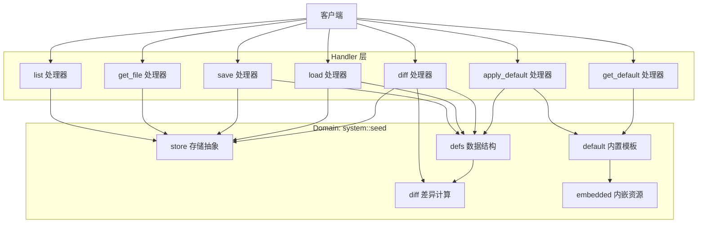
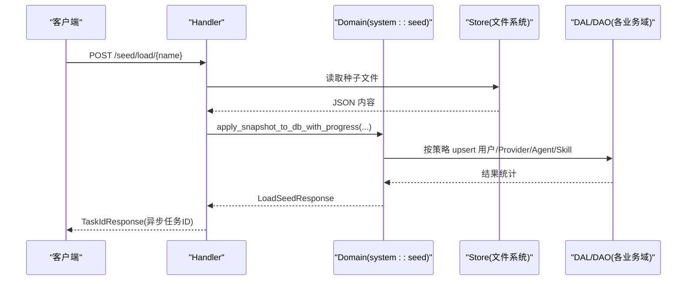
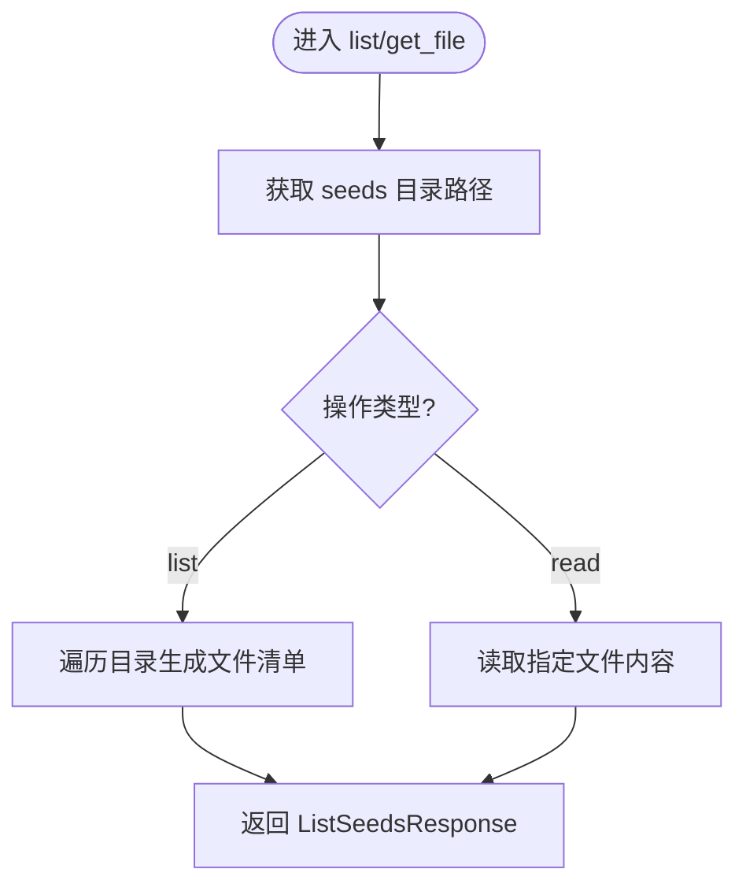
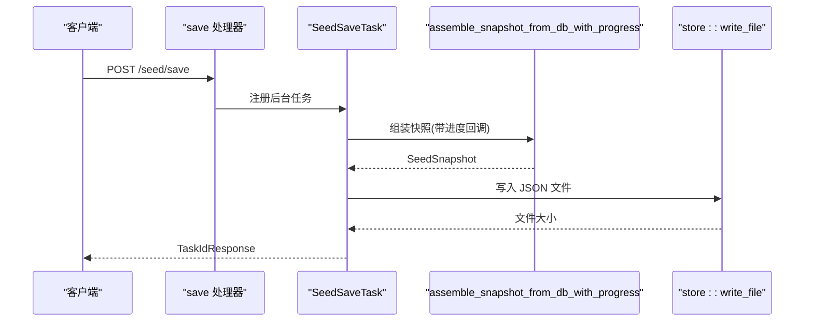
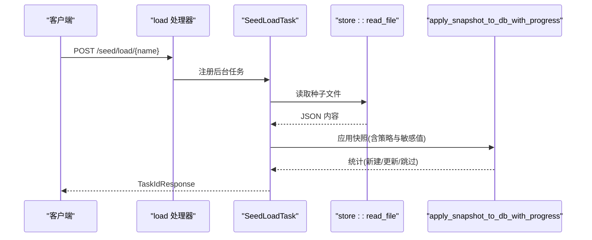
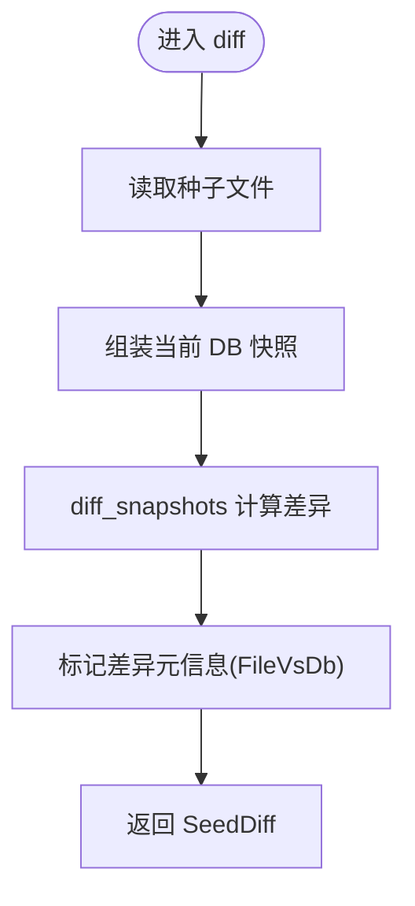
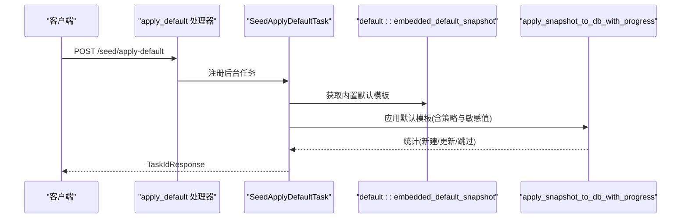
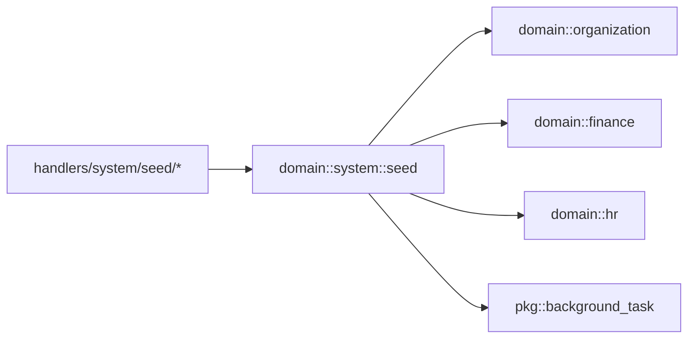

# 种子数据处理器

<cite>
**本文引用的文件**
- [common/src/api/seed.rs](common/src/api/seed.rs)
- [src/handlers/system/seed/mod.rs](src/handlers/system/seed/mod.rs)
- [src/handlers/system/seed/list.rs](src/handlers/system/seed/list.rs)
- [src/handlers/system/seed/get_file.rs](src/handlers/system/seed/get_file.rs)
- [src/handlers/system/seed/save.rs](src/handlers/system/seed/save.rs)
- [src/handlers/system/seed/load.rs](src/handlers/system/seed/load.rs)
- [src/handlers/system/seed/diff.rs](src/handlers/system/seed/diff.rs)
- [src/handlers/system/seed/apply_default.rs](src/handlers/system/seed/apply_default.rs)
- [src/handlers/system/seed/get_default.rs](src/handlers/system/seed/get_default.rs)
- [src/service/domain/system/seed/defs.rs](src/service/domain/system/seed/defs.rs)
- [src/service/domain/system/seed/diff.rs](src/service/domain/system/seed/diff.rs)
- [src/service/domain/system/seed/store.rs](src/service/domain/system/seed/store.rs)
- [src/service/domain/system/seed/default.rs](src/service/domain/system/seed/default.rs)
- [src/service/domain/system/seed/embedded.rs](src/service/domain/system/seed/embedded.rs)
### 本文关联的三类文档（四类互引闭环）
#### ① Design 决策快照
- [seed-config-migration.md](docs/design/seed-config-migration.md) — Handler 跨域编排（Adapter 负责）；9 个 Handler 接口清单（list/get_file/save/load/diff/preview/apply_default/get_default/rollback）；权限 SuperAdmin；多租户 org_id 隔离；敏感字段 AES-256-GCM 加密
#### ② 落地计划
- [Agent管理集成测试.md](docs/plan/Agent管理集成测试.md) — 两阶段启动顺序对齐；Seed Handler 接口集成测试
#### ④ RAG 原子知识卡
- [种子配置与系统两阶段初始化：5 套 TEMPLATE_SKILL 编译期嵌入 + seed diff 增量导入 + 两阶段 init aop 严格分离 + init_all_base_data 域派发](docs/wiki/knowledge/zh/种子配置与系统两阶段初始化：5%20套%20TEMPLATE_SKILL%20编译期嵌入%20+%20seed%20diff%20增量导入%20+%20两阶段%20init%20aop%20严格分离%20+%20init_all_base_data%20域派发/种子配置与系统两阶段初始化：5%20套%20TEMPLATE_SKILL%20编译期嵌入%20+%20seed%20diff%20增量导入%20+%20两阶段%20init%20aop%20严格分离%20+%20init_all_base_data%20域派发.md) — §红线 2 Seed 纯工具箱（Handler 跨域编排各 Domain）；§红线 5 敏感字段必须 AES-256-GCM；§红线 7 Handler 必须显式校验 SuperAdmin 角色
</cite>

## 目录
1. [简介](#简介)
2. [项目结构](#项目结构)
3. [核心组件](#核心组件)
4. [架构总览](#架构总览)
5. [详细组件分析](#详细组件分析)
6. [依赖关系分析](#依赖关系分析)
7. [性能与并发特性](#性能与并发特性)
8. [故障排查指南](#故障排查指南)
9. [结论](#结论)
10. [附录：API 使用示例与最佳实践](#附录api-使用示例与最佳实践)

## 简介
本文件面向“种子数据处理器”，系统化说明系统初始化与配置数据管理的 HTTP 接口实现，覆盖种子数据的加载、保存、列表查询、文件获取、差异比较与应用默认配置等能力。文档同时解释种子数据的文件格式、版本控制与冲突解决机制，并说明默认配置的生成过程、自定义配置的导入导出以及配置变更的追踪管理。最后提供 API 使用示例、批量操作支持与数据验证规则，以及配置模板管理与环境特定配置的最佳实践。

## 项目结构
种子数据处理器位于系统域（system）下，采用四层单向调用：Adapter（HTTP Handler）→ Domain → DAL → DAO。Handler 层负责编排各 Domain 拉取/写入实体、组装/应用 SeedSnapshot，并调用 seed 模块的纯函数完成 diff、validate、resolve 等算法。

图表来源
- [src/handlers/system/seed/mod.rs:1-30](src/handlers/system/seed/mod.rs#L1-L30)
- [src/handlers/system/seed/list.rs:1-20](src/handlers/system/seed/list.rs#L1-L20)
- [src/handlers/system/seed/get_file.rs:1-18](src/handlers/system/seed/get_file.rs#L1-L18)
- [src/handlers/system/seed/save.rs:1-171](src/handlers/system/seed/save.rs#L1-L171)
- [src/handlers/system/seed/load.rs:1-162](src/handlers/system/seed/load.rs#L1-L162)
- [src/handlers/system/seed/diff.rs:1-31](src/handlers/system/seed/diff.rs#L1-L31)
- [src/handlers/system/seed/apply_default.rs:1-160](src/handlers/system/seed/apply_default.rs#L1-L160)
- [src/handlers/system/seed/get_default.rs:1-17](src/handlers/system/seed/get_default.rs#L1-L17)

章节来源
- [src/handlers/system/seed/mod.rs:1-30](src/handlers/system/seed/mod.rs#L1-L30)

## 核心组件
- 请求/响应 DTO：定义在 common 层，统一对外暴露 API 契约（列出、读取、保存、加载、删除、Diff、应用默认模板等）。
- Handler 层：每个功能一个独立文件，职责单一，仅做参数校验、权限检查、任务注册与编排。
- Domain 层（system::seed）：
  - defs：SeedSnapshot、各实体定义、Diff 结构体与版本常量。
  - store：seeds 目录的文件读写与列表。
  - diff：快照差异计算、敏感字段校验与解析（密码、API Key）。
  - default：内置默认模板与内嵌资源读取。
  - embedded：编译期内嵌文件读取（如技能模板内容）。
- 后台任务：save/load/apply-default 均通过通用后台任务注册中心异步执行，支持进度轮询。

章节来源
- [common/src/api/seed.rs:1-163](common/src/api/seed.rs#L1-L163)
- [src/handlers/system/seed/mod.rs:1-675](src/handlers/system/seed/mod.rs#L1-L675)
- [src/service/domain/system/seed/defs.rs](src/service/domain/system/seed/defs.rs)
- [src/service/domain/system/seed/store.rs](src/service/domain/system/seed/store.rs)
- [src/service/domain/system/seed/diff.rs](src/service/domain/system/seed/diff.rs)
- [src/service/domain/system/seed/default.rs](src/service/domain/system/seed/default.rs)
- [src/service/domain/system/seed/embedded.rs](src/service/domain/system/seed/embedded.rs)

## 架构总览
种子数据处理器遵循 Adapter → Domain → DAL → DAO 的单向调用链。Handler 不直接访问数据库，而是通过 Domain 提供的领域服务进行数据装配与持久化；算法部分（diff、validate、resolve）以纯函数形式集中在 domain::seed 中，便于测试与复用。

图表来源
- [src/handlers/system/seed/load.rs:1-162](src/handlers/system/seed/load.rs#L1-L162)
- [src/handlers/system/seed/mod.rs:420-671](src/handlers/system/seed/mod.rs#L420-L671)

## 详细组件分析

### 列表与文件获取
- 列出 seeds 目录：返回文件名、大小、修改时间、是否系统默认模板。
- 读取种子文件：返回完整 JSON 内容与元信息。

图表来源
- [src/handlers/system/seed/list.rs:1-20](src/handlers/system/seed/list.rs#L1-L20)
- [src/handlers/system/seed/get_file.rs:1-18](src/handlers/system/seed/get_file.rs#L1-L18)

章节来源
- [src/handlers/system/seed/list.rs:1-20](src/handlers/system/seed/list.rs#L1-L20)
- [src/handlers/system/seed/get_file.rs:1-18](src/handlers/system/seed/get_file.rs#L1-L18)

### 保存当前组织配置到文件（导出）
- 入口：POST /seed/save
- 行为：创建后台任务，分阶段导出组织、用户、模型 Provider、Agent、Skill，并将快照序列化为 JSON 写入 seeds 目录。
- 进度：通过后台任务进度接口轮询，步骤包含“正在导出组织/用户/Provider/Agent/Skill/写入文件”。

图表来源
- [src/handlers/system/seed/save.rs:1-171](src/handlers/system/seed/save.rs#L1-L171)
- [src/handlers/system/seed/mod.rs:277-409](src/handlers/system/seed/mod.rs#L277-L409)

章节来源
- [src/handlers/system/seed/save.rs:1-171](src/handlers/system/seed/save.rs#L1-L171)
- [src/handlers/system/seed/mod.rs:277-409](src/handlers/system/seed/mod.rs#L277-L409)

### 从文件加载快照（导入）
- 入口：POST /seed/load/{name}
- 行为：读取种子文件，解析为 SeedSnapshot，根据导入策略应用到数据库。
- 策略：
  - PreserveIds：保留快照中的 ID（适合回滚/恢复）。
  - RegenerateIds：生成新 ID（适合跨组织迁移）。
  - DryRun：仅预演，返回 diff 报告，不实际写入。
  - SkipExisting：仅新建不存在的，已存在跳过。
- 敏感字段：若快照含占位符，需前端传入敏感值映射键值对。

图表来源
- [src/handlers/system/seed/load.rs:1-162](src/handlers/system/seed/load.rs#L1-L162)
- [src/handlers/system/seed/mod.rs:420-671](src/handlers/system/seed/mod.rs#L420-L671)

章节来源
- [src/handlers/system/seed/load.rs:1-162](src/handlers/system/seed/load.rs#L1-L162)
- [src/handlers/system/seed/mod.rs:420-671](src/handlers/system/seed/mod.rs#L420-L671)

### 差异比较（文件 vs DB）
- 入口：POST /seed/diff/{name}
- 行为：读取种子文件，组装当前 DB 快照，计算差异并返回结构化 diff。
- 用途：用于 DryRun 或人工审核后再导入。

图表来源
- [src/handlers/system/seed/diff.rs:1-31](src/handlers/system/seed/diff.rs#L1-L31)
- [src/handlers/system/seed/mod.rs:420-479](src/handlers/system/seed/mod.rs#L420-L479)

章节来源
- [src/handlers/system/seed/diff.rs:1-31](src/handlers/system/seed/diff.rs#L1-L31)
- [src/handlers/system/seed/mod.rs:420-479](src/handlers/system/seed/mod.rs#L420-L479)

### 应用默认模板
- 入口：POST /seed/apply-default
- 行为：加载内置默认模板，按策略应用到数据库。
- 默认模板来源：domain::seed::default::embedded_default_snapshot()，可结合内嵌资源。

图表来源
- [src/handlers/system/seed/apply_default.rs:1-160](src/handlers/system/seed/apply_default.rs#L1-L160)
- [src/handlers/system/seed/mod.rs:420-671](src/handlers/system/seed/mod.rs#L420-L671)

章节来源
- [src/handlers/system/seed/apply_default.rs:1-160](src/handlers/system/seed/apply_default.rs#L1-L160)
- [src/handlers/system/seed/mod.rs:420-671](src/handlers/system/seed/mod.rs#L420-L671)

### 获取默认模板
- 入口：GET /seed/default
- 行为：直接返回内置默认模板的 SeedSnapshot，便于前端预览或二次编辑。

章节来源
- [src/handlers/system/seed/get_default.rs:1-17](src/handlers/system/seed/get_default.rs#L1-L17)

### 技能导入与文件解析
- 技能文件来源优先级：content > ref_path（编译期内嵌）> url（运行时抓取，限制 1MB，超时 30s）。
- 导入时动态解析文件内容并写入 DB + 文件系统；导出时将技能文件内容内嵌到 content，保证快照自包含。

章节来源
- [src/handlers/system/seed/mod.rs:72-128](src/handlers/system/seed/mod.rs#L72-L128)
- [src/handlers/system/seed/mod.rs:130-235](src/handlers/system/seed/mod.rs#L130-L235)
- [src/handlers/system/seed/mod.rs:237-271](src/handlers/system/seed/mod.rs#L237-L271)

## 依赖关系分析
- Handler 依赖 Domain 的 seed 模块（defs、store、diff、default），并通过 Domain 聚合其他业务域（organization、finance、hr）完成数据装配与持久化。
- 后台任务通过 pkg::background_task 注册中心统一管理生命周期与进度。
- 敏感字段解析与校验集中在 domain::seed::diff，避免在各处重复实现。

图表来源
- [src/handlers/system/seed/mod.rs:1-30](src/handlers/system/seed/mod.rs#L1-L30)
- [src/handlers/system/seed/save.rs:1-171](src/handlers/system/seed/save.rs#L1-L171)
- [src/handlers/system/seed/load.rs:1-162](src/handlers/system/seed/load.rs#L1-L162)
- [src/handlers/system/seed/apply_default.rs:1-160](src/handlers/system/seed/apply_default.rs#L1-L160)

章节来源
- [src/handlers/system/seed/mod.rs:1-675](src/handlers/system/seed/mod.rs#L1-L675)

## 性能与并发特性
- 大对象导出/导入走后台任务，避免长连接阻塞；进度回调提供细粒度步骤消息。
- URL 抓取限制 1MB 与 30s 超时，防止资源滥用。
- 导出时统一将技能文件内容内嵌到 content，减少外部依赖，提高快照可移植性。
- 导入时按顺序处理用户、Provider、Agent、Skill，每步可单独统计与失败隔离。

[本节为通用性能讨论，无需具体文件引用]

## 故障排查指南
- 权限不足：仅 SuperAdmin 可执行 load/apply-default/delete 等高敏操作；Handler 内部二次校验角色。
- 敏感字段缺失：DryRun 或导入前会校验敏感字段齐备；若存在占位符需前端填写后传入。
- 技能文件未指定来源：content/ref_path/url 均为空时报错。
- URL 抓取失败：网络错误或非成功状态码将返回错误信息。
- 任务失败：后台任务会记录错误信息与完成时间，可通过进度接口查看。

章节来源
- [src/handlers/system/seed/mod.rs:36-46](src/handlers/system/seed/mod.rs#L36-L46)
- [src/handlers/system/seed/mod.rs:72-128](src/handlers/system/seed/mod.rs#L72-L128)
- [src/handlers/system/seed/save.rs:63-77](src/handlers/system/seed/save.rs#L63-L77)
- [src/handlers/system/seed/load.rs:72-78](src/handlers/system/seed/load.rs#L72-L78)
- [src/handlers/system/seed/apply_default.rs:71-77](src/handlers/system/seed/apply_default.rs#L71-L77)

## 结论
种子数据处理器通过清晰的 Handler-Domain 分层与后台任务机制，提供了完整的配置数据生命周期管理能力：导出、导入、差异比较、默认模板应用与文件管理。其设计强调幂等、安全与可观测性，适合在多组织、多环境中进行配置迁移与版本化管理。

[本节为总结性内容，无需具体文件引用]

## 附录：API 使用示例与最佳实践

### API 概览
- 列出种子文件：GET /api/v1/system/seed/list
- 读取种子文件：GET /api/v1/system/seed/file/{name}
- 保存配置到文件：POST /api/v1/system/seed/save
- 从文件加载快照：POST /api/v1/system/seed/load/{name}
- 差异比较：POST /api/v1/system/seed/diff/{name}
- 应用默认模板：POST /api/v1/system/seed/apply-default
- 获取默认模板：GET /api/v1/system/seed/default

章节来源
- [common/src/api/seed.rs:1-163](common/src/api/seed.rs#L1-L163)
- [src/handlers/system/seed/list.rs:1-20](src/handlers/system/seed/list.rs#L1-L20)
- [src/handlers/system/seed/get_file.rs:1-18](src/handlers/system/seed/get_file.rs#L1-L18)
- [src/handlers/system/seed/save.rs:1-171](src/handlers/system/seed/save.rs#L1-L171)
- [src/handlers/system/seed/load.rs:1-162](src/handlers/system/seed/load.rs#L1-L162)
- [src/handlers/system/seed/diff.rs:1-31](src/handlers/system/seed/diff.rs#L1-L31)
- [src/handlers/system/seed/apply_default.rs:1-160](src/handlers/system/seed/apply_default.rs#L1-L160)
- [src/handlers/system/seed/get_default.rs:1-17](src/handlers/system/seed/get_default.rs#L1-L17)

### 导入策略与批量操作
- 策略选择：
  - PreserveIds：同组织回滚/恢复。
  - RegenerateIds：跨组织迁移。
  - DryRun：预演并返回 diff。
  - SkipExisting：增量导入，跳过已有项。
- 批量操作：导入按用户、Provider、Agent、Skill 四阶段顺序执行，每阶段可统计新建/更新/跳过数量；Skill 导入支持批量文件写入。

章节来源
- [common/src/api/seed.rs:70-114](common/src/api/seed.rs#L70-L114)
- [src/handlers/system/seed/mod.rs:420-671](src/handlers/system/seed/mod.rs#L420-L671)

### 数据验证规则
- 敏感字段校验：若快照含占位符，需在导入前提供敏感值映射；否则拒绝导入。
- 技能文件来源校验：必须至少指定 content/ref_path/url 之一。
- URL 抓取限制：最大 1MB，超时 30s。

章节来源
- [src/handlers/system/seed/mod.rs:72-128](src/handlers/system/seed/mod.rs#L72-L128)
- [src/handlers/system/seed/mod.rs:420-487](src/handlers/system/seed/mod.rs#L420-L487)

### 配置文件格式与版本控制
- 文件格式：JSON，包含 version、generated_at、source_organization_id、organization、users、model_providers、agents、skills 等字段。
- 版本控制：SeedSnapshot 维护 CURRENT_VERSION，确保向前兼容。
- 元信息：diff 结果包含 base_source/target_source 与 kind，便于审计。

章节来源
- [src/service/domain/system/seed/defs.rs](src/service/domain/system/seed/defs.rs)
- [src/handlers/system/seed/mod.rs:398-408](src/handlers/system/seed/mod.rs#L398-L408)
- [src/handlers/system/seed/diff.rs:15-30](src/handlers/system/seed/diff.rs#L15-L30)

### 默认配置生成与模板管理
- 默认模板：由 default::embedded_default_snapshot() 提供，可结合 embedded 资源。
- 模板预览：GET /seed/default 可直接获取默认模板内容。
- 模板应用：POST /seed/apply-default 支持策略与敏感值注入。

章节来源
- [src/handlers/system/seed/get_default.rs:1-17](src/handlers/system/seed/get_default.rs#L1-L17)
- [src/handlers/system/seed/apply_default.rs:123-144](src/handlers/system/seed/apply_default.rs#L123-L144)
- [src/service/domain/system/seed/default.rs](src/service/domain/system/seed/default.rs)
- [src/service/domain/system/seed/embedded.rs](src/service/domain/system/seed/embedded.rs)

### 环境特定配置最佳实践
- 使用 DryRun 先评估差异，确认无误后再正式导入。
- 跨组织迁移优先使用 RegenerateIds，避免 ID 冲突。
- 对敏感字段集中管理，通过 sensitive_values 注入，避免硬编码。
- 导出时统一使用 content 内嵌技能文件，提升快照可移植性与可复现性。

[本节为通用最佳实践，无需具体文件引用]