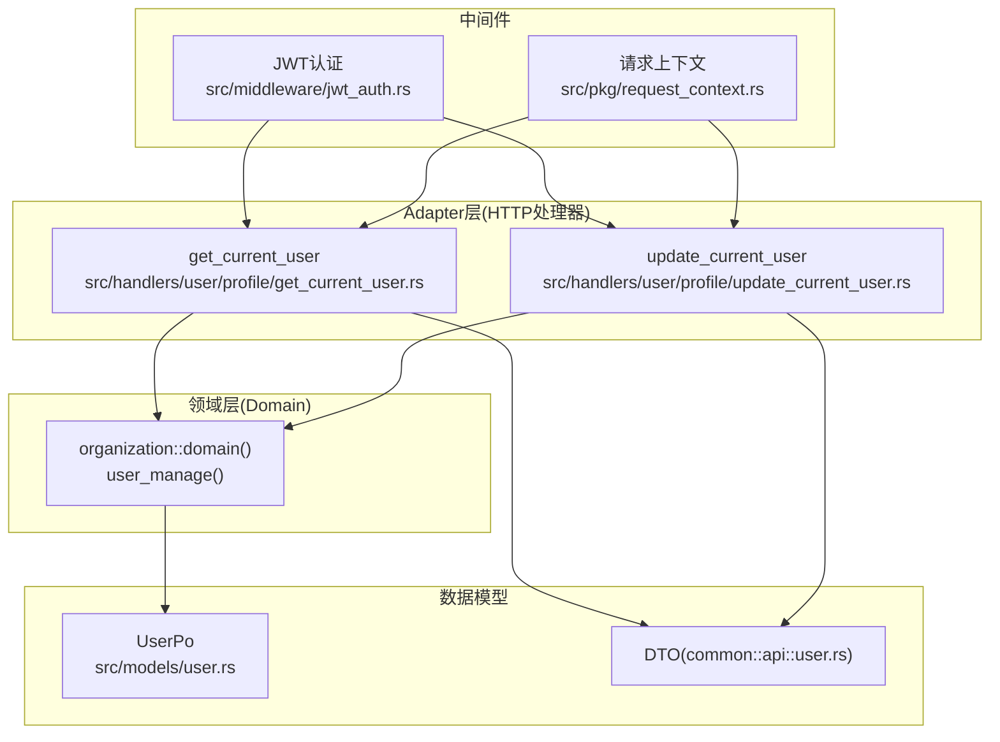
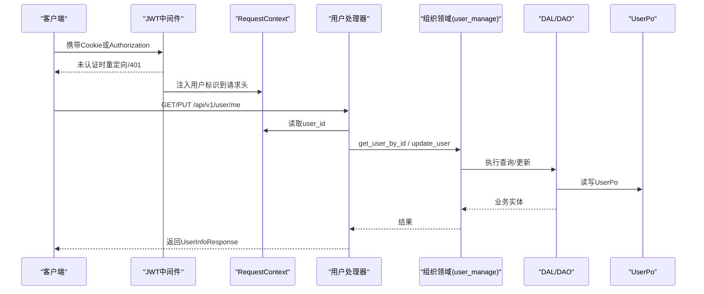
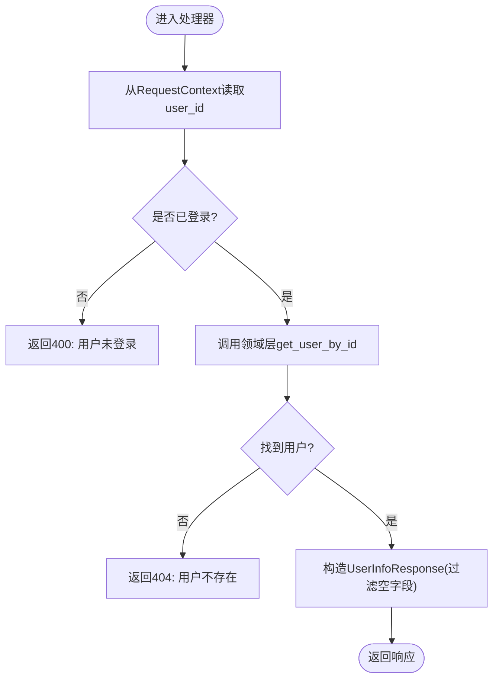
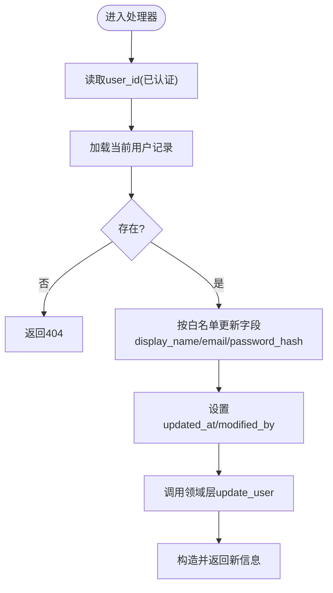
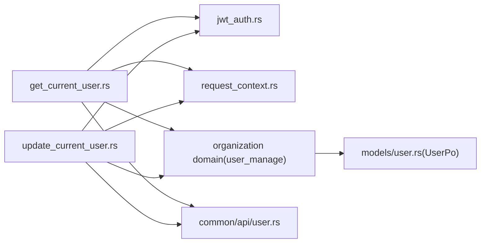

# User模块处理器

<cite>
**本文引用的文件**
- [src/handlers/user/mod.rs](src/handlers/user/mod.rs)
- [src/handlers/user/profile/mod.rs](src/handlers/user/profile/mod.rs)
- [src/handlers/user/profile/get_current_user.rs](src/handlers/user/profile/get_current_user.rs)
- [src/handlers/user/profile/update_current_user.rs](src/handlers/user/profile/update_current_user.rs)
- [common/src/api/user.rs](common/src/api/user.rs)
- [src/middleware/jwt_auth.rs](src/middleware/jwt_auth.rs)
- [src/pkg/request_context.rs](src/pkg/request_context.rs)
- [src/models/user.rs](src/models/user.rs)
</cite>

## 目录
1. [简介](#简介)
2. [项目结构](#项目结构)
3. [核心组件](#核心组件)
4. [架构总览](#架构总览)
5. [详细组件分析](#详细组件分析)
6. [依赖关系分析](#依赖关系分析)
7. [性能考虑](#性能考虑)
8. [故障排查指南](#故障排查指南)
9. [结论](#结论)
10. [附录](#附录)

## 简介
本文件面向 User（用户管理）模块的 HTTP 处理器，聚焦“当前用户信息获取”和“当前用户资料更新”两个接口。文档从四层单向调用视角说明 Adapter（HTTP Handler）→ Domain → DAL → DAO 的调用方向与职责边界；阐述身份认证、数据校验、隐私保护、事务处理策略；并给出数据结构、字段规则、图片上传与存储策略建议、API 调用示例、数据同步与缓存策略，以及安全与隐私实现指南。

## 项目结构
User 模块位于 handlers/user/profile 下，包含：
- get_current_user.rs：GET /api/v1/user/me 获取当前登录用户信息
- update_current_user.rs：PUT /api/v1/user/me 更新当前用户资料（显示名、邮箱、密码哈希）
- mod.rs：聚合导出处理器

DTO 定义在 common/src/api/user.rs，用于前后端共享的请求/响应结构。

图表来源
- [src/handlers/user/profile/get_current_user.rs:1-66](src/handlers/user/profile/get_current_user.rs#L1-L66)
- [src/handlers/user/profile/update_current_user.rs:1-91](src/handlers/user/profile/update_current_user.rs#L1-L91)
- [src/middleware/jwt_auth.rs:1-156](src/middleware/jwt_auth.rs#L1-L156)
- [src/pkg/request_context.rs:1-632](src/pkg/request_context.rs#L1-L632)
- [common/src/api/user.rs:1-233](common/src/api/user.rs#L1-L233)
- [src/models/user.rs:1-98](src/models/user.rs#L1-L98)

章节来源
- [src/handlers/user/mod.rs:1-5](src/handlers/user/mod.rs#L1-L5)
- [src/handlers/user/profile/mod.rs:1-8](src/handlers/user/profile/mod.rs#L1-L8)

## 核心组件
- 身份认证中间件：支持 Cookie 与 Bearer 双模式，验证后将用户标识注入请求头，供后续 RequestContext 构建使用。
- 请求上下文：贯穿请求生命周期，携带 user_id、username、organization_id、caller_type 等，提供 DB/向量存储访问能力。
- HTTP 处理器：
  - 获取当前用户：从 RequestContext 取 user_id，调用领域层查询并转换为 UserInfoResponse。
  - 更新当前用户：仅允许修改 display_name、email、password_hash，自动维护 updated_at 与 modified_by，再调用领域层持久化。
- DTO：统一前后端的数据契约，包括 Get/Update 当前用户的请求与响应结构。

章节来源
- [src/middleware/jwt_auth.rs:1-156](src/middleware/jwt_auth.rs#L1-L156)
- [src/pkg/request_context.rs:1-632](src/pkg/request_context.rs#L1-L632)
- [src/handlers/user/profile/get_current_user.rs:1-66](src/handlers/user/profile/get_current_user.rs#L1-L66)
- [src/handlers/user/profile/update_current_user.rs:1-91](src/handlers/user/profile/update_current_user.rs#L1-L91)
- [common/src/api/user.rs:1-233](common/src/api/user.rs#L1-L233)

## 架构总览
遵循严格四层单向调用：Adapter → Domain → DAL → DAO。处理器不直接操作数据库，而是通过 organization::domain().user_manage() 完成用户相关操作。

图表来源
- [src/middleware/jwt_auth.rs:1-156](src/middleware/jwt_auth.rs#L1-L156)
- [src/pkg/request_context.rs:1-632](src/pkg/request_context.rs#L1-L632)
- [src/handlers/user/profile/get_current_user.rs:1-66](src/handlers/user/profile/get_current_user.rs#L1-L66)
- [src/handlers/user/profile/update_current_user.rs:1-91](src/handlers/user/profile/update_current_user.rs#L1-L91)
- [src/models/user.rs:1-98](src/models/user.rs#L1-L98)

## 详细组件分析

### 获取当前用户信息处理器
- 功能：从 RequestContext 中取出已认证的 user_id，调用领域层获取用户完整信息，并将敏感空值字段过滤后返回。
- 身份验证：由 JWT 中间件前置校验，失败时浏览器重定向、API 返回 401。
- 数据验证：输入为空则返回 bad_request；用户不存在返回 not_found。
- 隐私保护：display_name/email 为空时以 None 返回，避免泄露空串。
- 事务处理：处理器本身不包含显式事务，持久化逻辑委托给领域/DAL/DAO 层统一管理。

图表来源
- [src/handlers/user/profile/get_current_user.rs:1-66](src/handlers/user/profile/get_current_user.rs#L1-L66)
- [src/middleware/jwt_auth.rs:1-156](src/middleware/jwt_auth.rs#L1-L156)

章节来源
- [src/handlers/user/profile/get_current_user.rs:1-66](src/handlers/user/profile/get_current_user.rs#L1-L66)

### 更新当前用户资料处理器
- 功能：仅允许更新显示名称、邮箱、密码哈希；自动维护 updated_at 与 modified_by；调用领域层保存。
- 身份验证：同获取流程，JWT 前置校验。
- 数据验证：
  - 未登录：bad_request
  - 用户不存在：not_found
  - 仅允许白名单字段更新，禁止越权修改角色、状态、组织ID等敏感字段
- 隐私保护：返回时同样过滤空字段，避免暴露空值。
- 事务处理：具体事务边界在领域/DAL/DAO 层实现，处理器只负责参数校验与调用编排。

图表来源
- [src/handlers/user/profile/update_current_user.rs:1-91](src/handlers/user/profile/update_current_user.rs#L1-L91)

章节来源
- [src/handlers/user/profile/update_current_user.rs:1-91](src/handlers/user/profile/update_current_user.rs#L1-L91)

### 数据模型与DTO
- UserPo：持久化对象，包含 id、organization_id、username、display_name、email、password_hash、role、status、created_by、modified_by、created_at、updated_at。
- DTO：
  - GetCurrentUserRequest/Response：无参获取当前用户，返回 UserInfoResponse
  - UpdateCurrentUserRequest/Response：可选字段更新，返回更新后的 UserInfoResponse
  - UserInfoResponse：对外暴露的用户信息视图，隐藏空值与敏感细节

章节来源
- [src/models/user.rs:1-98](src/models/user.rs#L1-L98)
- [common/src/api/user.rs:1-233](common/src/api/user.rs#L1-L233)

### API 调用示例
- 获取当前用户
  - 方法：GET
  - 路径：/api/v1/user/me
  - 认证：Cookie 或 Authorization: Bearer
  - 请求体：无
  - 响应：{ data: { user_id, username, display_name?, email?, organization_id, role, role_name, status } }
- 更新当前用户
  - 方法：PUT
  - 路径：/api/v1/user/me
  - 认证：同上
  - 请求体：{ display_name?: string, email?: string, password_hash?: string }
  - 响应：{ data: UserInfoResponse }

章节来源
- [common/src/api/user.rs:1-233](common/src/api/user.rs#L1-L233)
- [src/handlers/user/profile/get_current_user.rs:1-66](src/handlers/user/profile/get_current_user.rs#L1-L66)
- [src/handlers/user/profile/update_current_user.rs:1-91](src/handlers/user/profile/update_current_user.rs#L1-L91)

### 数据同步机制与缓存策略
- 数据同步：处理器通过领域层进行读写，DAL/DAO 层负责 SQL 执行与一致性保障；如需跨服务同步，建议在领域层触发事件（AOP Producer），由消费者异步处理。
- 缓存策略：
  - 当前用户信息可基于 user_id 做短期缓存（如内存缓存），注意失效策略（密码变更、资料更新时主动失效）。
  - 对于高频读但低频写的场景，可在 DAL 层增加读缓存；写路径需保证强一致或最终一致策略明确。
  - 注意：当前处理器未内置缓存，可按需扩展至领域/DAL 层。

[本节为通用指导，不直接分析具体文件]

### 图片上传与文件存储策略（建议）
- 当前处理器不涉及图片上传。若未来需要头像上传：
  - 建议新增独立上传接口，限制类型、大小、命名规范与存储路径。
  - 存储后端建议使用对象存储（如本地磁盘目录或云存储），URL 作为用户资料字段引用。
  - 鉴权：仅允许本人或管理员访问/更新头像。
  - 安全：对上传内容进行病毒扫描与内容校验，防止恶意文件。
  - 删除：头像替换时清理旧文件，确保资源释放。

[本节为通用指导，不直接分析具体文件]

## 依赖关系分析
- 处理器依赖：
  - 中间件：JWT 认证将用户标识注入请求头
  - 请求上下文：解析并持有用户维度信息
  - 领域层：organization::domain().user_manage() 提供用户管理能力
  - 数据模型：UserPo 作为持久化载体
  - DTO：common::api::user 定义接口契约

图表来源
- [src/handlers/user/profile/get_current_user.rs:1-66](src/handlers/user/profile/get_current_user.rs#L1-L66)
- [src/handlers/user/profile/update_current_user.rs:1-91](src/handlers/user/profile/update_current_user.rs#L1-L91)
- [src/middleware/jwt_auth.rs:1-156](src/middleware/jwt_auth.rs#L1-L156)
- [src/pkg/request_context.rs:1-632](src/pkg/request_context.rs#L1-L632)
- [common/src/api/user.rs:1-233](common/src/api/user.rs#L1-L233)
- [src/models/user.rs:1-98](src/models/user.rs#L1-L98)

章节来源
- [src/handlers/user/profile/get_current_user.rs:1-66](src/handlers/user/profile/get_current_user.rs#L1-L66)
- [src/handlers/user/profile/update_current_user.rs:1-91](src/handlers/user/profile/update_current_user.rs#L1-L91)
- [src/middleware/jwt_auth.rs:1-156](src/middleware/jwt_auth.rs#L1-L156)
- [src/pkg/request_context.rs:1-632](src/pkg/request_context.rs#L1-L632)
- [common/src/api/user.rs:1-233](common/src/api/user.rs#L1-L233)
- [src/models/user.rs:1-98](src/models/user.rs#L1-L98)

## 性能考虑
- 最小化 I/O：处理器只做必要校验与转换，数据库访问交由领域/DAL 层优化。
- 连接池：DAL/DAO 层应复用数据库连接池，避免频繁创建销毁。
- 缓存：对热点用户信息可引入短时效缓存，更新时主动失效。
- 序列化：DTO 按需返回字段，减少网络传输开销。
- 并发：处理器无锁设计，依赖底层并发安全的 DAL/DAO。

[本节为通用指导，不直接分析具体文件]

## 故障排查指南
- 401 未认证：检查 Cookie 或 Authorization: Bearer 是否正确携带；确认 JWT 有效且未过期。
- 400 用户未登录：RequestContext 中 user_id 为空，检查中间件链顺序与请求头注入。
- 404 用户不存在：确认 user_id 对应的用户是否存在于数据库中。
- 更新失败：检查字段白名单与必填项；关注领域/DAL 层错误码与日志。
- 日志追踪：利用 RequestContext 中的 log_id 串联全链路日志，定位问题。

章节来源
- [src/middleware/jwt_auth.rs:1-156](src/middleware/jwt_auth.rs#L1-L156)
- [src/pkg/request_context.rs:1-632](src/pkg/request_context.rs#L1-L632)
- [src/handlers/user/profile/get_current_user.rs:1-66](src/handlers/user/profile/get_current_user.rs#L1-L66)
- [src/handlers/user/profile/update_current_user.rs:1-91](src/handlers/user/profile/update_current_user.rs#L1-L91)

## 结论
User 模块处理器严格遵循四层单向调用，通过 JWT 中间件与 RequestContext 完成身份与上下文传递，处理器专注于参数校验、权限控制与响应组装；敏感字段与空值在响应层进行过滤，保障隐私。事务与持久化由领域/DAL/DAO 层统一管理，便于扩展与测试。建议后续按需引入缓存与文件上传能力，并完善事件驱动的同步机制。

[本节为总结性内容，不直接分析具体文件]

## 附录
- 字段验证规则（更新当前用户）
  - display_name：可选字符串
  - email：可选字符串
  - password_hash：可选字符串
  - 其他字段（角色、状态、组织ID等）不允许通过该接口修改
- 隐私保护
  - 空值字段以 None 返回，避免泄露
  - 不暴露密码哈希等敏感信息
- 安全建议
  - 强制 HTTPS
  - 定期轮换密钥与令牌
  - 对密码哈希采用安全算法（如 bcrypt）
  - 审计关键操作（updated_at、modified_by）

[本节为通用指导，不直接分析具体文件]