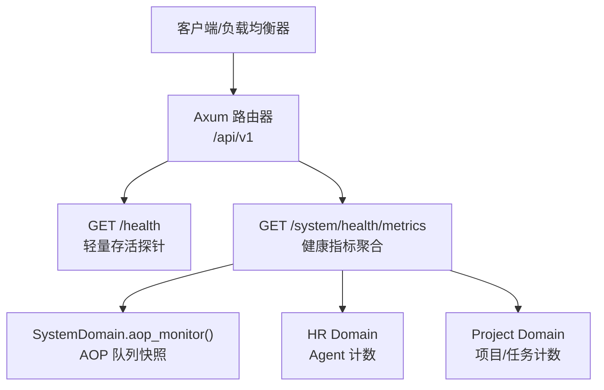
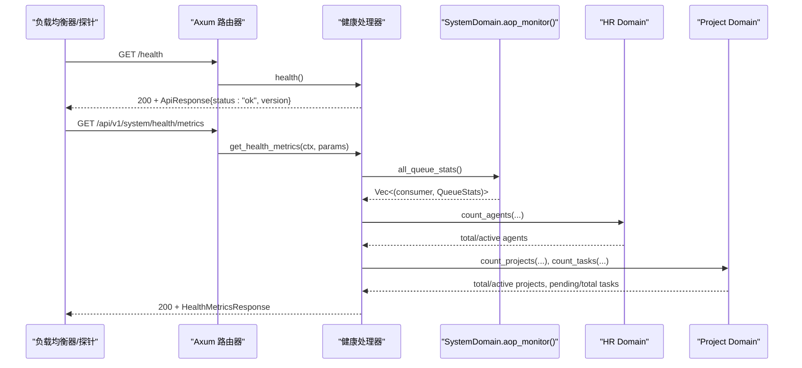
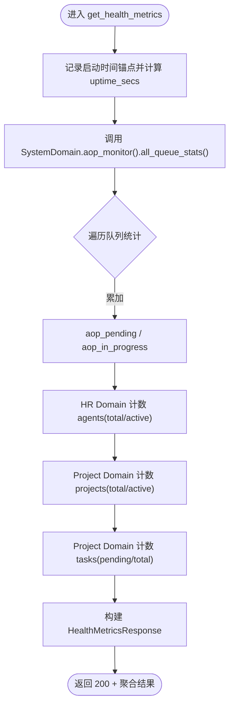
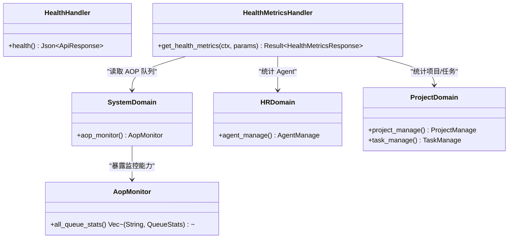

# 健康检查处理器

<cite>
**本文引用的文件**
- [src/handlers/health.rs](src/handlers/health.rs)
- [src/handlers/system/health_metrics.rs](src/handlers/system/health_metrics.rs)
- [src/router.rs](src/router.rs)
- [common/src/api/mod.rs](common/src/api/mod.rs)
- [common/src/api/system.rs](common/src/api/system.rs)
- [src/service/domain/system/mod.rs](src/service/domain/system/mod.rs)
- [src/handlers/system/aop.rs](src/handlers/system/aop.rs)
- [frontend/src/pages/system/health.rs](frontend/src/pages/system/health.rs)
</cite>

## 目录
1. [简介](#简介)
2. [项目结构](#项目结构)
3. [核心组件](#核心组件)
4. [架构总览](#架构总览)
5. [详细组件分析](#详细组件分析)
6. [依赖关系分析](#依赖关系分析)
7. [性能考量](#性能考量)
8. [故障排查指南](#故障排查指南)
9. [结论](#结论)
10. [附录](#附录)

## 简介
本文件系统化说明健康检查处理器的实现与使用，覆盖两类能力：
- 轻量存活探针：用于容器编排、负载均衡器快速判定服务是否可响应。
- 系统健康指标聚合：面向前端 HUD 仪表盘墙，聚合 AOP 队列、Agent/项目/任务等关键业务维度，提供运行时长与在线状态。

该设计遵循四层单向调用（Adapter → Domain → DAL → DAO），健康指标聚合通过 SystemDomain.aop_monitor() 获取 AOP 队列快照，并通过 HR/Project Domain 的计数接口统计业务实体数量；所有跨层调用统一通过 RequestContext 传递上下文。

## 项目结构
健康检查相关代码分布在以下位置：
- 轻量存活端点：src/handlers/health.rs
- 健康指标聚合端点：src/handlers/system/health_metrics.rs
- 路由注册：src/router.rs
- 共享 API DTO：common/src/api/system.rs、common/src/api/mod.rs
- 系统域与 AOP 监控：src/service/domain/system/mod.rs、src/handlers/system/aop.rs
- 前端健康页面：frontend/src/pages/system/health.rs

图表来源
- [src/router.rs:57-58](src/router.rs#L57-L58)
- [src/router.rs:691-695](src/router.rs#L691-L695)
- [src/handlers/system/health_metrics.rs:42-120](src/handlers/system/health_metrics.rs#L42-L120)
- [src/service/domain/system/mod.rs:172-181](src/service/domain/system/mod.rs#L172-L181)

章节来源
- [src/router.rs:12-59](src/router.rs#L12-L59)
- [src/router.rs:603-740](src/router.rs#L603-L740)

## 核心组件
- 轻量存活处理器：返回固定成功响应，包含版本信息，适合 K8s liveness/readiness 探针或 LB 健康检查。
- 健康指标聚合处理器：聚合 AOP 队列待处理/进行中数、活跃 Agent/项目/任务数、进程运行时长，并标记后端在线。
- 系统域 AOP 监控：暴露 all_queue_stats/queue_stats/list_events/get_event 等能力，供健康指标聚合读取。
- 共享 API 类型：HealthMetricsResponse、GetHealthMetricsRequest 等定义前后端一致的数据契约。

章节来源
- [src/handlers/health.rs:1-16](src/handlers/health.rs#L1-L16)
- [src/handlers/system/health_metrics.rs:1-135](src/handlers/system/health_metrics.rs#L1-L135)
- [common/src/api/system.rs:7-33](common/src/api/system.rs#L7-L33)
- [src/service/domain/system/mod.rs:172-204](src/service/domain/system/mod.rs#L172-L204)

## 架构总览
健康检查处理器位于 Adapter 层，仅负责 HTTP 请求解析与响应组装，不直接访问数据库。数据获取通过 Domain 层抽象，DAL/DAO 在更下层实现。

图表来源
- [src/router.rs:57-58](src/router.rs#L57-L58)
- [src/router.rs:691-695](src/router.rs#L691-L695)
- [src/handlers/health.rs:4-9](src/handlers/health.rs#L4-L9)
- [src/handlers/system/health_metrics.rs:35-134](src/handlers/system/health_metrics.rs#L35-L134)
- [src/service/domain/system/mod.rs:172-181](src/service/domain/system/mod.rs#L172-L181)

## 详细组件分析

### 轻量存活处理器（GET /health）
- 职责：快速判断服务进程是否可响应，返回标准 ApiResponse 包装的成功体，包含 status 与版本。
- 路由：挂载于根级 /health，不受 JWT 保护，适合外部探针。
- 响应格式：HTTP 200 + ApiResponse{code:0, message:"success", data:{status:"ok", version}}。
- 适用场景：Kubernetes liveness/readiness、Nginx/Ingress 健康检查、LB 摘除节点。

章节来源
- [src/handlers/health.rs:1-16](src/handlers/health.rs#L1-L16)
- [src/router.rs:57-58](src/router.rs#L57-L58)
- [common/src/api/mod.rs:7-49](common/src/api/mod.rs#L7-L49)

### 健康指标聚合处理器（GET /api/v1/system/health/metrics）
- 职责：为前端 HUD 提供单一聚合端点，避免前端并发请求多个域接口。
- 指标维度：
  - backend_online：handler 能响应即 true。
  - aop_pending/aop_in_progress：遍历所有消费者队列统计累加。
  - active_agents/total_agents：HR Domain 计数，排除 Deleted，active 限定 Onboarded。
  - active_projects/total_projects：Project Domain 计数，默认排除已删除，active 限定 Active/PendingReview/InProgress。
  - pending_tasks/total_tasks：Project Domain 计数，pending 限定 PendingReview/Pending/InProgress。
  - uptime_secs：首次调用时初始化 OnceLock<Instant> 计算运行时长。
- 降级策略：各计数失败时回退为 0，保证整体可用性。
- 权限：受 /api/v1/system 路由保护，需 Admin/SuperAdmin 角色。

图表来源
- [src/handlers/system/health_metrics.rs:35-134](src/handlers/system/health_metrics.rs#L35-L134)
- [src/service/domain/system/mod.rs:172-181](src/service/domain/system/mod.rs#L172-L181)

章节来源
- [src/handlers/system/health_metrics.rs:1-135](src/handlers/system/health_metrics.rs#L1-L135)
- [common/src/api/system.rs:7-33](common/src/api/system.rs#L7-L33)
- [src/router.rs:112-117](src/router.rs#L112-L117)
- [src/router.rs:691-695](src/router.rs#L691-L695)

### AOP 队列监控（辅助健康诊断）
- 作用：提供队列统计、事件列表与详情查询，便于定位健康问题的根因（如队列堆积）。
- 端点：/api/v1/system/aop/stats、/api/v1/system/aop/{consumer}/stats、/api/v1/system/aop/{consumer}/events/{event_id}。
- 数据来源：SystemDomain.aop_monitor() 暴露的 all_queue_stats/queue_stats/list_events/get_event。

章节来源
- [src/handlers/system/aop.rs:1-41](src/handlers/system/aop.rs#L1-L41)
- [src/service/domain/system/mod.rs:172-181](src/service/domain/system/mod.rs#L172-L181)
- [src/router.rs:661-695](src/router.rs#L661-L695)

### 前端健康页面（HUD 仪表盘墙）
- 功能：轮询 /api/v1/system/health/metrics，展示后端在线、AOP 队列深度、活跃 Agent/项目比例、待处理任务数、运行时长。
- 刷新策略：初始加载后每 10 秒自动刷新。
- 颜色规则：根据阈值将指标映射到绿/黄/橙/红，直观呈现健康状态。

章节来源
- [frontend/src/pages/system/health.rs:1-97](frontend/src/pages/system/health.rs#L1-L97)

## 依赖关系分析
- 路由层：/health 与 /api/v1/system/health/metrics 分别由 router.rs 注册。
- Adapter 层：health.rs 与 system/health_metrics.rs 作为 HTTP Handler。
- Domain 层：SystemDomain 暴露 AOP 监控能力；HR/Project Domain 提供计数接口。
- DAL/DAO 层：Domain 内部委托 DAL/DAO 完成持久化查询（对健康指标而言，主要走计数查询）。
- 共享类型：common/src/api/system.rs 定义 HealthMetricsResponse 等 DTO，确保前后端一致。

图表来源
- [src/handlers/health.rs:4-9](src/handlers/health.rs#L4-L9)
- [src/handlers/system/health_metrics.rs:35-134](src/handlers/system/health_metrics.rs#L35-L134)
- [src/service/domain/system/mod.rs:172-204](src/service/domain/system/mod.rs#L172-L204)

章节来源
- [src/router.rs:57-58](src/router.rs#L57-L58)
- [src/router.rs:691-695](src/router.rs#L691-L695)
- [common/src/api/system.rs:7-33](common/src/api/system.rs#L7-L33)

## 性能考量
- 轻量存活端点无 IO，响应极快，适合作为高频探针。
- 健康指标聚合涉及多次 Domain 计数与 AOP 队列快照，采用“失败降级为 0”的策略，避免单点失败影响整体可用性。
- 运行时长通过 OnceLock<Instant> 懒初始化，减少启动侵入。
- 建议：在高负载环境下，可适当降低前端轮询频率或增加缓存层（如网关侧缓存），以减少对 Domain 的压力。

[本节为通用指导，无需特定文件引用]

## 故障排查指南
- 若 /health 返回非 200：检查 Axum 路由注册与中间件链，确认服务进程是否存活。
- 若 /api/v1/system/health/metrics 指标异常：
  - 查看 AOP 队列堆积：调用 /api/v1/system/aop/stats 与 /api/v1/system/aop/{consumer}/stats，结合事件列表定位慢消费或阻塞。
  - 检查 HR/Project Domain 计数是否返回 0：可能是数据库连接问题或权限不足（需 Admin/SuperAdmin）。
  - 观察 uptime_secs 是否合理：若长时间未增长，可能进程重启频繁。
- 前端显示异常：确认轮询逻辑与阈值颜色规则，检查网络错误与 toast 提示。

章节来源
- [src/handlers/system/aop.rs:1-41](src/handlers/system/aop.rs#L1-L41)
- [src/service/domain/system/mod.rs:172-181](src/service/domain/system/mod.rs#L172-L181)
- [frontend/src/pages/system/health.rs:20-48](frontend/src/pages/system/health.rs#L20-L48)

## 结论
健康检查处理器提供了两层能力：轻量存活探针与健康指标聚合。前者用于基础设施层面的快速探测，后者面向运维与前端可视化，聚合 AOP 队列与关键业务指标，支持降级以保证可用性。配合 AOP 队列监控端点，可快速定位瓶颈与异常。建议在容器化部署中同时启用 /health 与 /api/v1/system/health/metrics，并结合前端 HUD 进行持续观测。

[本节为总结性内容，无需特定文件引用]

## 附录

### 健康检查端点与响应格式
- GET /health
  - 状态码：200
  - 响应体：ApiResponse{code:0, message:"success", data:{status:"ok", version}}
- GET /api/v1/system/health/metrics
  - 状态码：200
  - 响应体：HealthMetricsResponse{backend_online, aop_pending, aop_in_progress, active_agents, total_agents, active_projects, total_projects, pending_tasks, total_tasks, uptime_secs}

章节来源
- [src/handlers/health.rs:4-9](src/handlers/health.rs#L4-L9)
- [common/src/api/mod.rs:7-49](common/src/api/mod.rs#L7-L49)
- [common/src/api/system.rs:7-33](common/src/api/system.rs#L7-L33)

### 容器化部署与负载均衡集成建议
- Kubernetes：
  - livenessProbe：GET /health，期望 200。
  - readinessProbe：GET /api/v1/system/health/metrics，期望 200 且 backend_online=true。
- Nginx/Ingress：
  - 健康检查路径指向 /health。
- 告警触发条件（示例）：
  - /health 连续失败 N 次。
  - /api/v1/system/health/metrics 返回 aop_pending > 阈值 或 pending_tasks > 阈值。
  - uptime_secs 异常下降（频繁重启）。
- 自动化脚本（示例思路）：
  - 定时 curl /health 与 /api/v1/system/health/metrics，记录状态与指标，异常时发送告警。
  - 结合 Prometheus/Grafana 采集指标，设置看板与告警规则。

[本节为通用实践指导，无需特定文件引用]

### 监控集成方案
- 指标采集：
  - 从 /api/v1/system/health/metrics 拉取指标，上报至监控系统。
  - 结合 /api/v1/system/aop/stats 与 /api/v1/system/aop/{consumer}/stats 深入诊断。
- 可视化：
  - 前端 HUD 页面已内置健康监控视图，支持 10 秒轮询刷新。
- 日志关联：
  - 通过 SystemDomain.log_query 查询日志级别分布与时序，辅助定位问题。

章节来源
- [src/service/domain/system/mod.rs:151-170](src/service/domain/system/mod.rs#L151-L170)
- [frontend/src/pages/system/health.rs:50-97](frontend/src/pages/system/health.rs#L50-L97)