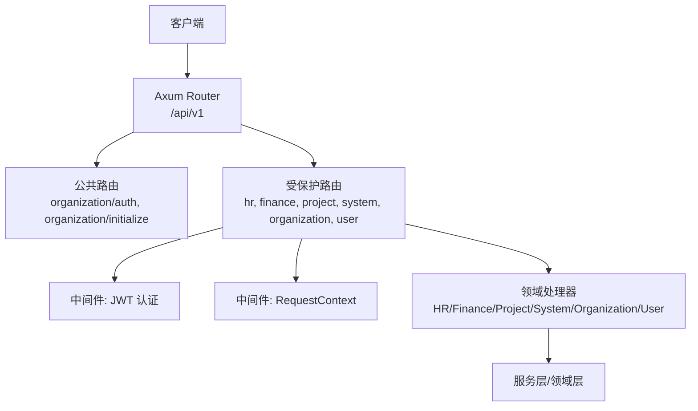
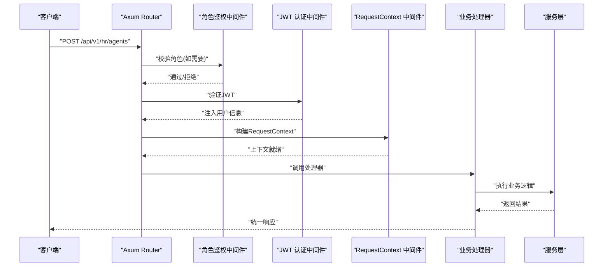
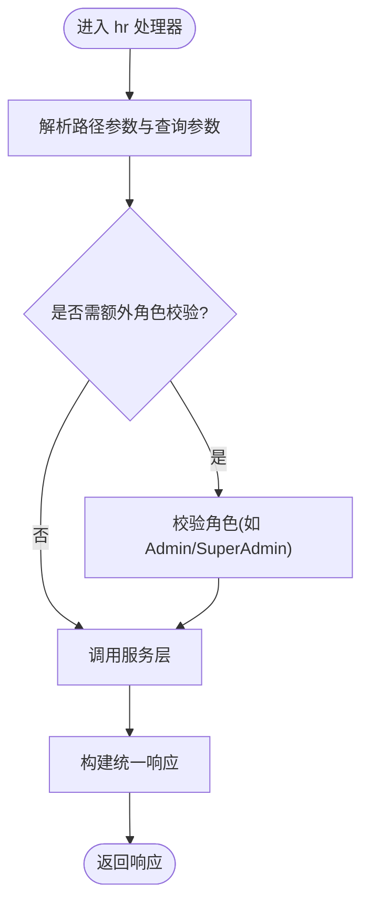
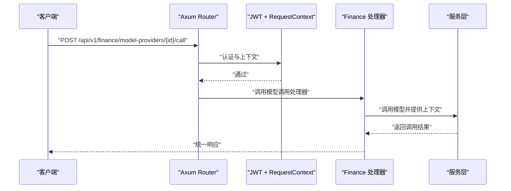
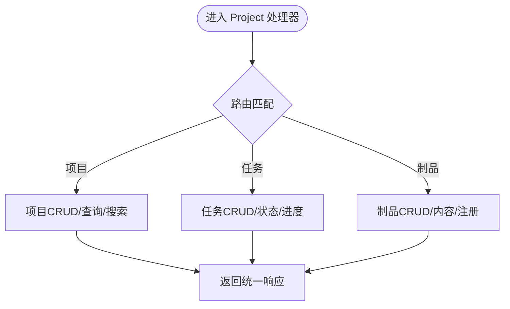
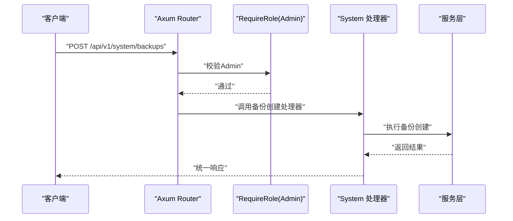
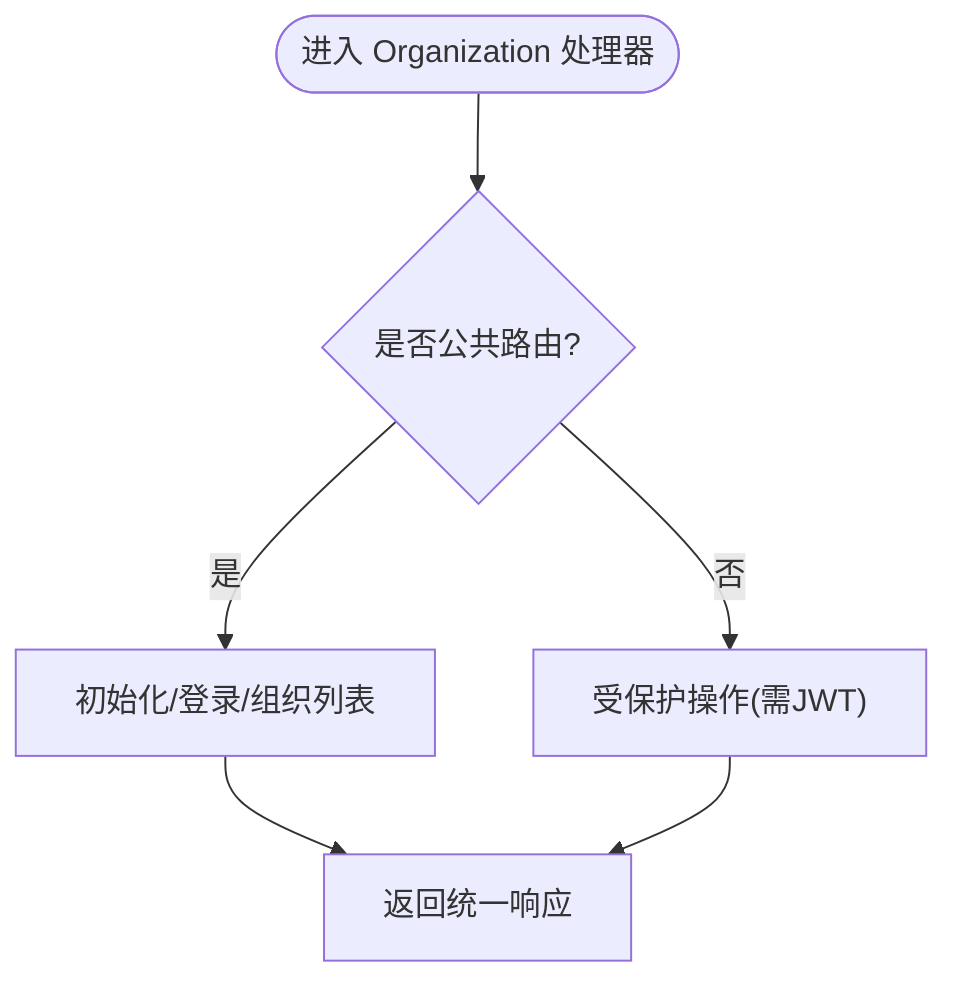
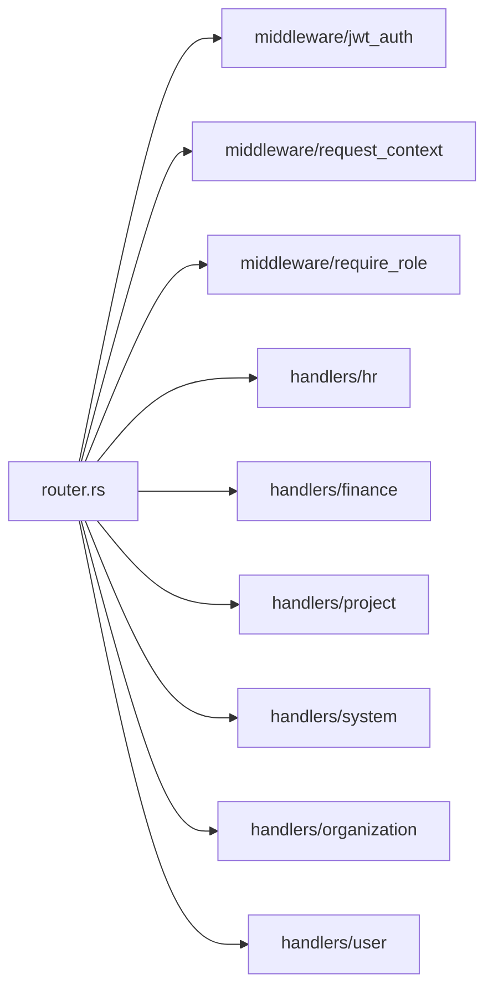

# 处理器层

<cite>
**本文引用的文件**
- [src/router.rs](src/router.rs)
- [src/handlers/mod.rs](src/handlers/mod.rs)
- [src/middleware/mod.rs](src/middleware/mod.rs)
- [src/handlers/hr/agent/mod.rs](src/handlers/hr/agent/mod.rs)
- [src/handlers/finance/mod.rs](src/handlers/finance/mod.rs)
- [src/handlers/project/mod.rs](src/handlers/project/mod.rs)
- [src/handlers/system/mod.rs](src/handlers/system/mod.rs)
- [src/handlers/organization/mod.rs](src/handlers/organization/mod.rs)
- [src/handlers/user/mod.rs](src/handlers/user/mod.rs)
</cite>

## 目录
1. [简介](#简介)
2. [项目结构](#项目结构)
3. [核心组件](#核心组件)
4. [架构总览](#架构总览)
5. [详细组件分析](#详细组件分析)
6. [依赖关系分析](#依赖关系分析)
7. [性能考量](#性能考量)
8. [故障排查指南](#故障排查指南)
9. [结论](#结论)
10. [附录](#附录)

## 简介
本文件面向 AI Orz 的 HTTP 处理器层，系统化梳理 HR（人力资源）、Finance（财务管理）、Project（项目管理）、System（系统管理）、Organization（组织管理）、User（用户管理）等模块的处理器设计。重点说明：
- 处理器的职责分工与路由装配
- 参数绑定、响应格式与错误处理机制
- 处理器与服务层的交互模式、事务与并发控制要点
- 处理器开发规范、测试策略与性能优化建议
- 典型处理器实现示例与最佳实践

## 项目结构
处理器层位于 src/handlers，按业务域划分子模块；路由在 src/router.rs 中集中装配，统一挂载到 /api/v1 下，并通过中间件完成认证、鉴权与请求上下文注入。

**图示来源**
- [src/router.rs:12-136](src/router.rs#L12-L136)
- [src/handlers/mod.rs:1-11](src/handlers/mod.rs#L1-L11)

**章节来源**
- [src/router.rs:12-136](src/router.rs#L12-L136)
- [src/handlers/mod.rs:1-11](src/handlers/mod.rs#L1-L11)

## 核心组件
- 路由装配器：负责将各模块处理器函数注册到具体路径，并应用中间件。
- 中间件：
  - JWT 认证：校验令牌并将用户信息写入请求头。
  - 请求上下文：从请求头提取上下文（如 log_id、用户信息等）注入到后续处理链。
  - 角色鉴权：对特定路由进行角色限制（如 Admin/SuperAdmin）。
- 处理器模块：按业务域拆分，每个处理器方法独立成文件，便于维护与测试。

**章节来源**
- [src/router.rs:61-136](src/router.rs#L61-L136)
- [src/middleware/mod.rs:1-10](src/middleware/mod.rs#L1-L10)

## 架构总览
HTTP 请求进入 Axum Router，先经过公共或受保护路由分支。受保护路由会依次通过角色鉴权、JWT 认证、RequestContext 中间件，最终到达对应业务处理器。处理器负责参数解析、权限校验、调用服务层执行领域逻辑，并返回统一响应。

**图示来源**
- [src/router.rs:96-136](src/router.rs#L96-L136)

## 详细组件分析

### HR（人力资源）处理器
- 路由范围：/api/v1/hr/*，包含 Agent 与 Skill 的 CRUD、查询、搜索、安装/卸载工具包与技能包、记忆体操作等。
- 处理器粒度：每个方法一个文件，便于单独测试与维护。
- 典型能力：
  - Agent 生命周期管理（创建、更新、删除、状态变更）
  - 外部 Agent 接入
  - 工具包/技能包的安装与卸载
  - 记忆体的增删改查与检索
- 安全与上下文：受保护路由，默认需 JWT；部分高危操作可在处理器内二次校验角色。

**图示来源**
- [src/router.rs:292-413](src/router.rs#L292-L413)
- [src/handlers/hr/agent/mod.rs:1-55](src/handlers/hr/agent/mod.rs#L1-L55)

**章节来源**
- [src/router.rs:292-413](src/router.rs#L292-L413)
- [src/handlers/hr/agent/mod.rs:1-55](src/handlers/hr/agent/mod.rs#L1-L55)

### Finance（财务管理）处理器
- 路由范围：/api/v1/finance/*，覆盖附件、模型提供商、消息与消息通道、MCP 服务器与工具、工具调用记录等。
- 典型能力：
  - 附件上传/下载/内容更新
  - 模型提供商配置、连接测试、向量重建进度查询、切换嵌入提供者
  - 消息发送、列表、搜索、SSE 订阅
  - 消息通道与 MCP 服务器的全生命周期管理
  - 工具与工具包的绑定/解绑、调试调用（需管理员）
- 安全与上下文：受保护路由；调试调用等敏感接口额外要求管理员角色。

**图示来源**
- [src/router.rs:415-601](src/router.rs#L415-L601)

**章节来源**
- [src/router.rs:415-601](src/router.rs#L415-L601)
- [src/handlers/finance/mod.rs:1-15](src/handlers/finance/mod.rs#L1-L15)

### Project（项目管理）处理器
- 路由范围：/api/v1/projects/*、/api/v1/tasks/*、/api/v1/artifacts/*
- 典型能力：
  - 项目 CRUD、状态更新、查询与搜索
  - 任务 CRUD、状态与进度更新、按项目/代理筛选
  - 制品（Artifact）创建、获取、更新、删除、内容读取、路径注册
- 安全与上下文：受保护路由，统一由 JWT 与 RequestContext 保障。

**图示来源**
- [src/router.rs:145-240](src/router.rs#L145-L240)
- [src/handlers/project/mod.rs:1-6](src/handlers/project/mod.rs#L1-L6)

**章节来源**
- [src/router.rs:145-240](src/router.rs#L145-L240)
- [src/handlers/project/mod.rs:1-6](src/handlers/project/mod.rs#L1-L6)

### System（系统管理）处理器
- 路由范围：/api/v1/system/*，整体要求 Admin 权限；内部对高危操作二次校验 SuperAdmin。
- 典型能力：
  - 定时任务触发器管理（创建、查询、更新、删除、暂停/恢复）
  - 备份管理（创建、列出、删除、恢复）
  - 日志查询与统计聚合
  - AOP 队列监控与事件查看
  - Seed 配置迁移（导出/导入/diff/应用默认）
  - 后台任务进度查询与管理
- 安全与上下文：全局 Admin 中间件；敏感操作在处理器内二次校验。

**图示来源**
- [src/router.rs:603-739](src/router.rs#L603-L739)

**章节来源**
- [src/router.rs:603-739](src/router.rs#L603-L739)
- [src/handlers/system/mod.rs:1-13](src/handlers/system/mod.rs#L1-L13)

### Organization（组织管理）处理器
- 路由范围：
  - 公共：/api/v1/organization/auth/*、/api/v1/organization/initialize/*、/api/v1/organization/list
  - 受保护：/api/v1/organization/*（当前组织信息、组织 CRUD、用户管理）
- 典型能力：
  - 登录/登出、系统初始化检查与进度
  - 当前用户组织信息查询与更新
  - 组织列表、详情、更新、删除
  - 用户创建、查询、更新、删除（按组织维度）
- 安全与上下文：公共路由仅 RequestContext；受保护路由需 JWT。

**图示来源**
- [src/router.rs:61-94](src/router.rs#L61-L94)
- [src/router.rs:242-290](src/router.rs#L242-L290)
- [src/handlers/organization/mod.rs:1-15](src/handlers/organization/mod.rs#L1-L15)

**章节来源**
- [src/router.rs:61-94](src/router.rs#L61-L94)
- [src/router.rs:242-290](src/router.rs#L242-L290)
- [src/handlers/organization/mod.rs:1-15](src/handlers/organization/mod.rs#L1-L15)

### User（用户管理）处理器
- 路由范围：/api/v1/user/me（GET/PUT），用于当前用户个人信息查询与更新。
- 安全与上下文：受保护路由，需 JWT。

**章节来源**
- [src/router.rs:138-143](src/router.rs#L138-L143)
- [src/handlers/user/mod.rs:1-5](src/handlers/user/mod.rs#L1-L5)

## 依赖关系分析
- 路由与处理器：router.rs 集中声明所有 API 路径与处理器函数映射，保证入口清晰。
- 中间件依赖：jwt_auth_middleware、request_context_middleware、require_role_middleware 在 router 中按需组合，形成“洋葱模型”的执行顺序。
- 处理器与模块：各业务模块通过 mod.rs 汇总导出处理器函数，供 router 引用。

**图示来源**
- [src/router.rs:1-136](src/router.rs#L1-L136)
- [src/middleware/mod.rs:1-10](src/middleware/mod.rs#L1-L10)
- [src/handlers/mod.rs:1-11](src/handlers/mod.rs#L1-L11)

**章节来源**
- [src/router.rs:1-136](src/router.rs#L1-L136)
- [src/middleware/mod.rs:1-10](src/middleware/mod.rs#L1-L10)
- [src/handlers/mod.rs:1-11](src/handlers/mod.rs#L1-L11)

## 性能考量
- 路由匹配与中间件开销：尽量保持路由层级扁平，避免过多嵌套；将通用中间件置于外层以减少重复计算。
- 参数绑定与校验：在处理器入口处尽早校验必要参数，减少无效服务调用。
- 数据库与 I/O：
  - 使用分页与过滤减少大结果集传输。
  - 对读多写少的场景考虑缓存（如模型提供商列表、标签枚举）。
  - 对耗时操作（如向量重建、备份/恢复）采用异步任务+进度查询。
- 并发控制：
  - 长耗时接口（如 SSE 订阅、模型调用）应支持超时与取消。
  - 对写操作加锁或幂等键，防止重复提交。
- 响应体积：对列表接口提供字段选择或摘要模式，降低带宽占用。

[本节为通用指导，不直接分析具体文件]

## 故障排查指南
- 认证失败：检查 JWT 是否有效、是否过期；确认路由是否属于受保护分支且已正确添加 JWT 中间件。
- 鉴权失败：确认 require_role 是否正确应用于路由；必要时在处理器内二次校验角色。
- 上下文缺失：确认 request_context 中间件已添加到路由链；检查请求头是否携带必要字段。
- 处理器未命中：核对 router.rs 中的路径与方法是否与前端一致；注意路径参数命名与占位符。
- 后端异常：查看系统日志与 AOP 统计；对关键路径增加日志埋点，定位问题阶段。

**章节来源**
- [src/router.rs:96-136](src/router.rs#L96-L136)
- [src/router.rs:603-739](src/router.rs#L603-L739)

## 结论
AI Orz 的处理器层以路由为中心、中间件为保障、处理器为职责边界，形成了清晰的 HTTP 接入面。通过按方法拆分的处理器粒度、统一的认证与上下文注入、以及领域化的路由分组，既保证了可维护性，也便于扩展与测试。建议在新增功能时遵循现有规范，确保一致性、安全性与性能。

[本节为总结性内容，不直接分析具体文件]

## 附录

### 处理器开发规范
- 路由定义：在 router.rs 中集中声明，避免分散注册。
- 处理器拆分：每个方法一个文件，mod.rs 统一导出。
- 参数绑定：优先使用结构化请求体与路径参数；对可选参数提供默认值。
- 响应格式：统一封装成功/失败响应，包含状态码、数据与错误信息。
- 错误处理：捕获业务异常并转换为标准错误响应；记录必要上下文。
- 权限控制：路由级角色校验 + 处理器内二次校验（高危操作）。
- 上下文使用：通过 RequestContext 获取用户、租户等信息，避免从请求头手动解析。

**章节来源**
- [src/router.rs:96-136](src/router.rs#L96-L136)
- [src/handlers/hr/agent/mod.rs:1-55](src/handlers/hr/agent/mod.rs#L1-L55)

### 测试策略
- 单元测试：针对处理器内的参数校验、权限判断与响应构造编写用例。
- 集成测试：模拟完整请求链路，验证路由、中间件与处理器协作。
- 端到端测试：覆盖关键业务流程（如 Agent 创建→工具绑定→消息发送）。
- 性能测试：对热点接口进行压测，关注延迟与吞吐。

[本节为通用指导，不直接分析具体文件]

### 性能优化建议
- 批量操作：合并多次小请求为一次批量接口。
- 索引与查询：为常用查询字段建立索引，避免全表扫描。
- 流式输出：对大文件或长列表使用分块或流式传输。
- 缓存策略：对只读数据设置合理 TTL；对热点数据使用内存缓存。
- 资源清理：及时释放数据库连接、文件句柄与临时资源。

[本节为通用指导，不直接分析具体文件]