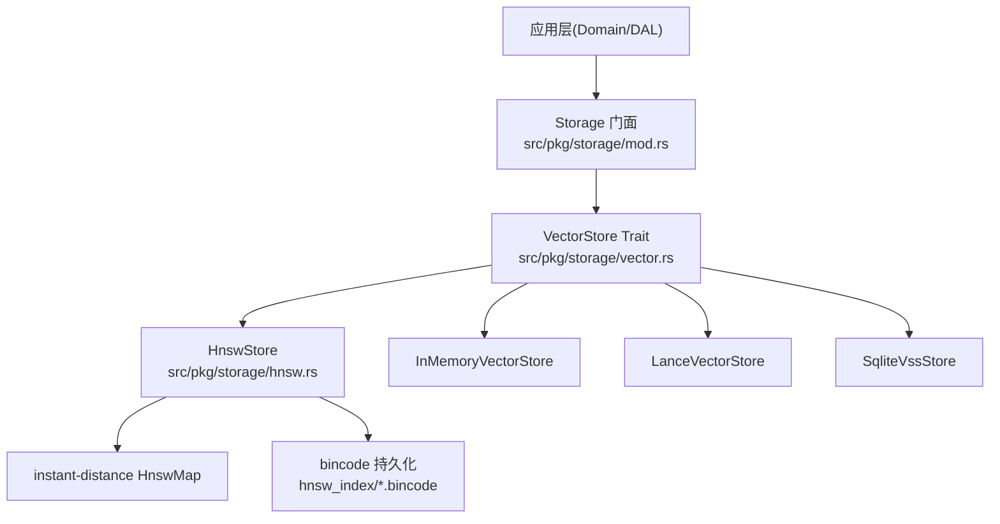
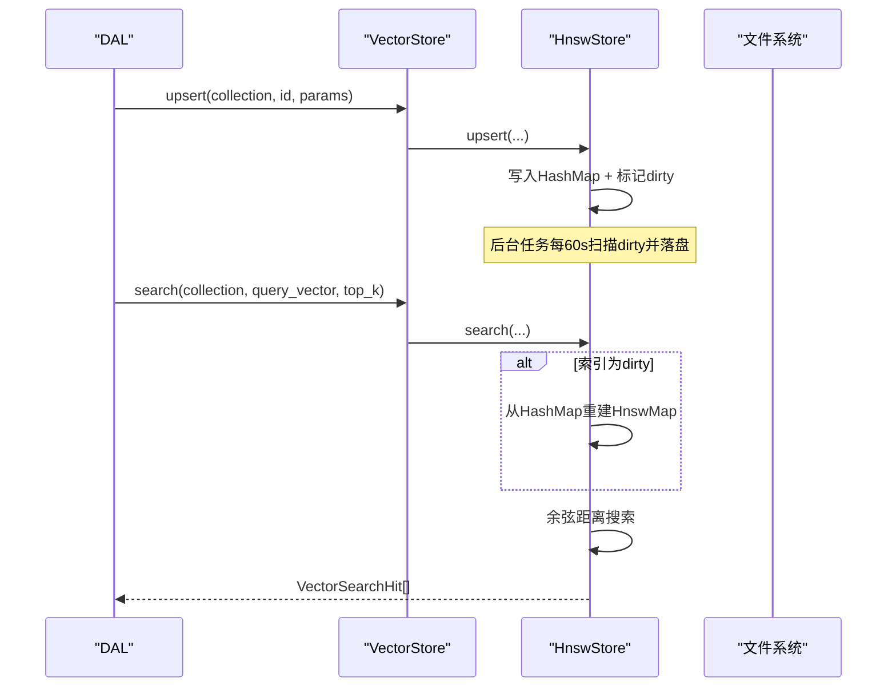
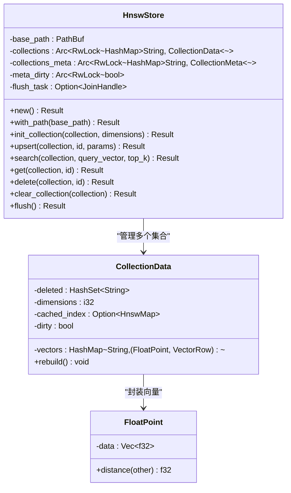
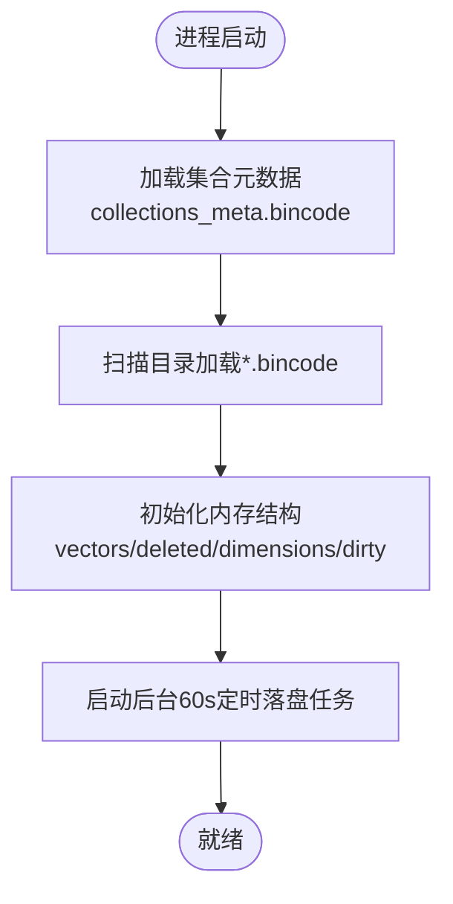
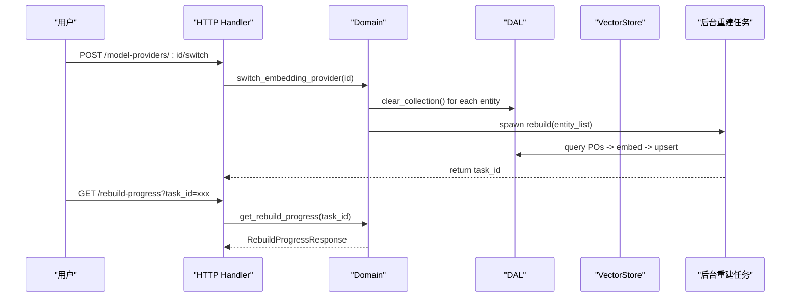
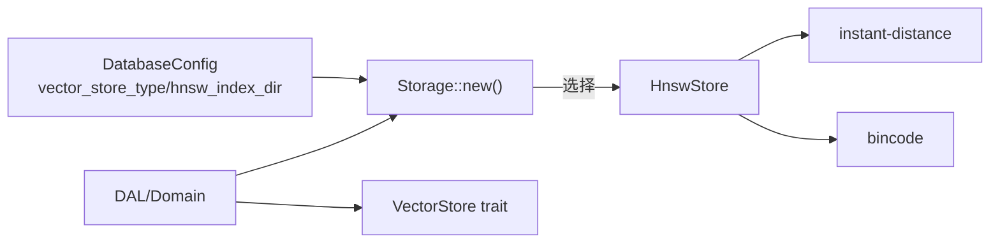

# HNSW向量存储

<cite>
**本文引用的文件**
- [hnsw.rs（HnswStore 实现）](src/pkg/storage/hnsw.rs)
- [vector.rs（VectorStore trait）](src/pkg/storage/vector.rs)
- [mod.rs（Storage 门面）](src/pkg/storage/mod.rs)
- [vector_search_architecture.md](docs/vector_search_architecture.md)
- [2026-07-16-hnsw-persistence-and-async-rebuild.md](docs/superpowers/plans/2026-07-16-hnsw-persistence-and-async-rebuild.md)
- [config.rs](common/src/config.rs)
- [vector.rs（模型定义）](src/models/vector.rs)
- [model_provider.rs（Embedding Provider 切换 Domain）](src/service/domain/finance/model_provider.rs)
- [model_provider.rs（DAL 重建调度）](src/service/dal/model_provider.rs)
- [identity_credential.rs（凭证 Domain）](src/service/domain/finance/identity_credential.rs)
</cite>

## 目录
1. [简介](#简介)
2. [项目结构](#项目结构)
3. [核心组件](#核心组件)
4. [架构总览](#架构总览)
5. [详细组件分析](#详细组件分析)
6. [依赖关系分析](#依赖关系分析)
7. [性能与容量规划](#性能与容量规划)
8. [故障排查指南](#故障排查指南)
9. [结论](#结论)
10. [附录](#附录)

## 更新摘要
**变更内容（2026-08-19 增量更新）**
- 补充 Embedding Provider 切换触发的异步重建引用：model_provider Domain / DAL 重建调度
- 补充向量数据结构元信息（VectorMeta / VectorRow / VectorIndexParams / SearchMatchInfo）行号精确定位
- 统一 cite 条目标注子模块职责（HnswStore 实现 / VectorStore trait / Storage 门面）

## 简介
本文件面向 AI Orz 的 HNSW 向量存储实现，系统性阐述 HNSW（分层可导航小世界图）在本项目中的原理、实现细节与工程化落地。内容覆盖：
- HNSW 图构建、层次化索引机制与近似最近邻搜索流程
- 参数配置对性能与精度的影响（M、efConstruction、efSearch）
- 向量数据的持久化、增量更新与重建机制
- 性能基准与容量规划建议、调优指南
- 与其他向量索引算法的对比分析与使用场景推荐

## 项目结构
HNSW 向量存储位于通用存储层（pkg/storage），通过统一的 VectorStore trait 暴露能力，上层 DAL/Domain 不感知后端差异。关键文件与职责：
- src/pkg/storage/hnsw.rs：HNSW 后端实现（基于 instant-distance），含 lazy rebuild、持久化、后台落盘、Drop 兜底
- src/pkg/storage/vector.rs：VectorStore trait 定义与多后端抽象
- src/pkg/storage/mod.rs：Storage 门面，按配置选择后端（InMemory/LanceDB/Hnsw/SqliteVss）
- docs/vector_search_architecture.md：向量搜索整体架构与设计原则
- common/src/config.rs：数据库与向量存储类型配置，包含 hnsw_index_dir
- src/models/vector.rs：向量行、元数据、索引参数等统一数据结构

图表来源
- [mod.rs:78-93](src/pkg/storage/mod.rs#L78-L93)
- [vector.rs:18-83](src/pkg/storage/vector.rs#L18-L83)
- [hnsw.rs:149-166](src/pkg/storage/hnsw.rs#L149-L166)

章节来源
- [mod.rs:1-212](src/pkg/storage/mod.rs#L1-L212)
- [vector_search_architecture.md:161-206](docs/vector_search_architecture.md#L161-L206)

## 核心组件
- HnswStore：基于 instant-distance 的纯 Rust HNSW 索引实现，支持余弦距离、lazy rebuild、持久化与后台定时落盘
- CollectionData：单集合内存结构，维护向量、删除标记、维度、缓存索引与 dirty 标志
- VectorStore trait：统一接口，屏蔽后端差异，提供 init_collection/upsert/search/delete/clear_collection/flush 等方法
- Storage 门面：根据配置创建具体后端实例，对外暴露 vector() 访问器

章节来源
- [hnsw.rs:20-125](src/pkg/storage/hnsw.rs#L20-L125)
- [hnsw.rs:149-166](src/pkg/storage/hnsw.rs#L149-L166)
- [vector.rs:18-83](src/pkg/storage/vector.rs#L18-L83)
- [mod.rs:36-148](src/pkg/storage/mod.rs#L36-L148)

## 架构总览
HNSW 在系统中的位置与调用链：
- Domain/DAL 通过 Storage.vector() 获取 VectorStore 实例
- 业务 DAO 调用 upsert/search/get/delete/clear_collection
- HnswStore 内部维护每个 collection 的 HashMap + 可选 HnswMap 缓存
- 写入时标记 dirty；首次或脏读时按需重建 HnswMap
- 后台 60s 扫描 dirty 并 bincode 序列化到磁盘；进程退出 Drop 兜底落盘

图表来源
- [hnsw.rs:442-491](src/pkg/storage/hnsw.rs#L442-L491)
- [hnsw.rs:493-543](src/pkg/storage/hnsw.rs#L493-L543)
- [hnsw.rs:377-388](src/pkg/storage/hnsw.rs#L377-L388)

章节来源
- [vector_search_architecture.md:425-463](docs/vector_search_architecture.md#L425-L463)
- [2026-07-16-hnsw-persistence-and-async-rebuild.md:1-12](docs/superpowers/plans/2026-07-16-hnsw-persistence-and-async-rebuild.md#L1-L12)

## 详细组件分析

### HNSW 算法与实现要点
- 图结构与层次化索引：使用 instant-distance 的 Builder 一次性构建 HnswMap，支持余弦距离（1 - cos(θ)）
- Lazy rebuild：由于 instant-distance 0.6.1 不支持增量插入，采用“写入标记 dirty，搜索时按需重建”的策略
- 余弦距离实现：自定义 FloatPoint 实现 Point trait，计算点积与范数得到相似度距离
- 集合隔离：每个 collection 独立维护向量、删除集、维度、缓存索引与 dirty 标志

图表来源
- [hnsw.rs:20-34](src/pkg/storage/hnsw.rs#L20-L34)
- [hnsw.rs:36-125](src/pkg/storage/hnsw.rs#L36-L125)
- [hnsw.rs:149-166](src/pkg/storage/hnsw.rs#L149-L166)

章节来源
- [hnsw.rs:1-125](src/pkg/storage/hnsw.rs#L1-L125)

### 持久化与冷启动
- 持久化格式：bincode 2.0，每个 collection 一个 .bincode 文件，集合元数据集中保存在 collections_meta.bincode
- 落盘策略：后台 60s 定时扫描 dirty flag 落盘；Drop 时同步兜底落盘所有 dirty 集合与元数据
- 冷启动：HnswStore::new() 扫描目录加载已有索引，避免冷启动时的全量重建

图表来源
- [hnsw.rs:189-219](src/pkg/storage/hnsw.rs#L189-L219)
- [hnsw.rs:221-301](src/pkg/storage/hnsw.rs#L221-L301)
- [hnsw.rs:377-388](src/pkg/storage/hnsw.rs#L377-L388)

章节来源
- [hnsw.rs:189-430](src/pkg/storage/hnsw.rs#L189-L430)
- [2026-07-16-hnsw-persistence-and-async-rebuild.md:112-325](docs/superpowers/plans/2026-07-16-hnsw-persistence-and-async-rebuild.md#L112-L325)

### 增量更新与重建机制
- 增量更新：upsert/delete 仅修改内存 HashMap 并标记 dirty，不直接操作图结构
- 重建时机：search 前检查 dirty，若为真则从 HashMap 重建 HnswMap
- 重建范围：过滤 deleted 集合后的活跃向量，构建新的 HnswMap 并清除 dirty
- 异步重建：切换 Embedding Provider 后，Domain 层 spawn 后台任务依次重建各实体索引，前端通过 task_id 轮询进度

图表来源
- [2026-07-16-hnsw-persistence-and-async-rebuild.md:421-624](docs/superpowers/plans/2026-07-16-hnsw-persistence-and-async-rebuild.md#L421-L624)
- [hnsw.rs:565-572](src/pkg/storage/hnsw.rs#L565-L572)

章节来源
- [2026-07-16-hnsw-persistence-and-async-rebuild.md:421-624](docs/superpowers/plans/2026-07-16-hnsw-persistence-and-async-rebuild.md#L421-L624)

### 参数配置与影响（M、efConstruction、efSearch）
- M：每个节点的最大连接数，影响图的连通性与查询速度；值越大搜索越快但内存占用更高
- efConstruction：构建时的候选集大小，影响建图质量与精度；值越大精度越高但构建更慢
- efSearch：搜索时的候选集大小，影响查询精度与延迟；值越大精度越高但延迟增加

当前实现说明：
- 本项目使用 instant-distance 的默认 Builder，未暴露 M/efConstruction/efSearch 配置项
- 因此无法直接调整这些参数；如需精细调优，需扩展 Builder 配置或替换底层库

章节来源
- [hnsw.rs:107-125](src/pkg/storage/hnsw.rs#L107-L125)
- [vector_search_architecture.md:425-463](docs/vector_search_architecture.md#L425-L463)

### 向量数据结构与元信息
- VectorRow：包含 id、vector、meta（content_hash、embedding_model、indexed_at、expire_at）
- VectorIndexParams：upsert 参数，包含向量、哈希、模型 ID、模型名、过期时间
- SearchMatchInfo：混合搜索结果元信息，记录匹配类型、向量距离、关键词字段、BM25 评分等

章节来源
- [vector.rs:9-67](src/models/vector.rs#L9-L67)：VectorMeta / VectorRow / VectorSearchHit / VectorIndexParams
- [vector.rs:94-125](src/models/vector.rs#L94-L125)：MatchType / SearchMatchInfo（混合搜索元信息）

## 依赖关系分析
- Storage 门面根据配置选择后端：InMemory/LanceDB/Hnsw/SqliteVss
- HnswStore 依赖 instant-distance（HnswMap/Builder/Point/Search）与 bincode（序列化）
- 上层 DAL/Domain 仅依赖 VectorStore trait，不感知具体后端
- 配置项 database.hnsw_index_dir 控制持久化路径

图表来源
- [mod.rs:78-93](src/pkg/storage/mod.rs#L78-L93)
- [config.rs:78-114](common/src/config.rs#L78-L114)
- [hnsw.rs:10-18](src/pkg/storage/hnsw.rs#L10-L18)

章节来源
- [mod.rs:78-93](src/pkg/storage/mod.rs#L78-L93)
- [config.rs:78-114](common/src/config.rs#L78-L114)

## 性能与容量规划
- 写入性能：upsert 为 O(1) HashMap 插入，标记 dirty；无即时图构建开销
- 查询性能：首次或 dirty 时重建 HnswMap，后续搜索使用图结构；余弦距离计算开销与向量维度相关
- 持久化开销：后台 60s 扫描 dirty 并 bincode 序列化；Drop 兜底落盘保证数据不丢失
- 内存占用：HashMap + HnswMap 双份存储；collection 数量与向量维度直接影响内存
- 容量规划建议：
  - 预估向量总数 × 维度 × 4字节（f32）× 2（HashMap+HnswMap）作为内存基线
  - 磁盘空间：每个 collection 一个 .bincode 文件，大小约等于向量数据 + 元数据
  - 定期监控 dirty 比例与重建频率，避免频繁重建导致查询抖动

[本节为通用指导，无需特定文件引用]

## 故障排查指南
- 冷启动失败：检查 hnsw_index_dir 是否存在且可读；查看 load_all_collections 日志
- 查询结果为空：确认 collection 已初始化且存在向量；检查 expired_at 是否已过期
- 数据不一致：检查 dirty 标志与后台落盘任务是否正常；确认 Drop 兜底落盘是否执行
- 切换 Provider 冲突：Domain 层校验唯一性，返回 409 并提供当前 Provider 信息

章节来源
- [hnsw.rs:221-301](src/pkg/storage/hnsw.rs#L221-L301)
- [hnsw.rs:493-543](src/pkg/storage/hnsw.rs#L493-L543)
- [vector_search_architecture.md:448-463](docs/vector_search_architecture.md#L448-L463)

## 结论
HNSW 在本项目中以 lazy rebuild 策略实现了高性能近似最近邻搜索，结合 bincode 持久化与后台落盘，兼顾了开发体验与生产可靠性。虽然当前未暴露 M/efConstruction/efSearch 参数，但通过合理的数据规模控制与监控，可满足大多数业务场景。未来如需精细调优，可扩展 Builder 配置或替换底层库。

[本节为总结，无需特定文件引用]

## 附录
- 与其他向量索引算法对比：
  - InMemory：零依赖、适合测试与小数据集
  - LanceDB：生产级高性能，列式存储，适合大数据集
  - SqliteVss：基于 SQLite 扩展，需要系统依赖
  - HNSW：纯 Rust、余弦距离、lazy rebuild，适合中等规模与快速迭代

- 使用场景推荐：
  - 开发/测试：InMemory
  - 生产中小规模：HNSW
  - 生产大规模：LanceDB
  - 已有 SQLite 环境：SqliteVss

[本节为通用指导，无需特定文件引用]