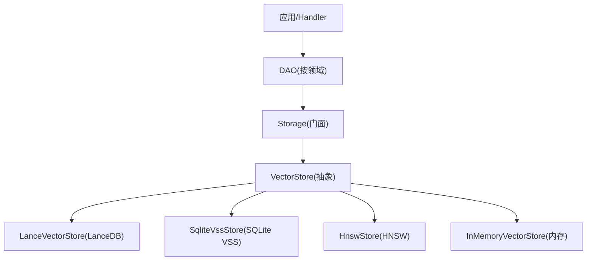
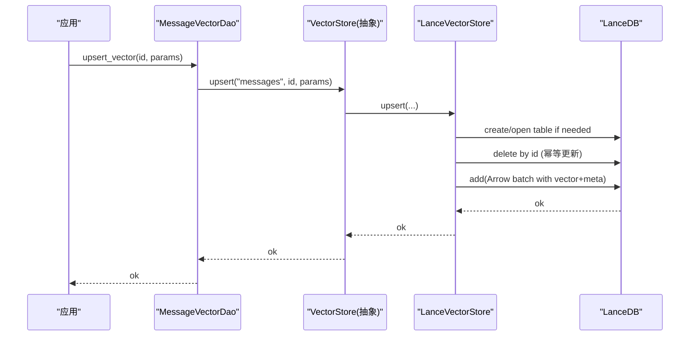
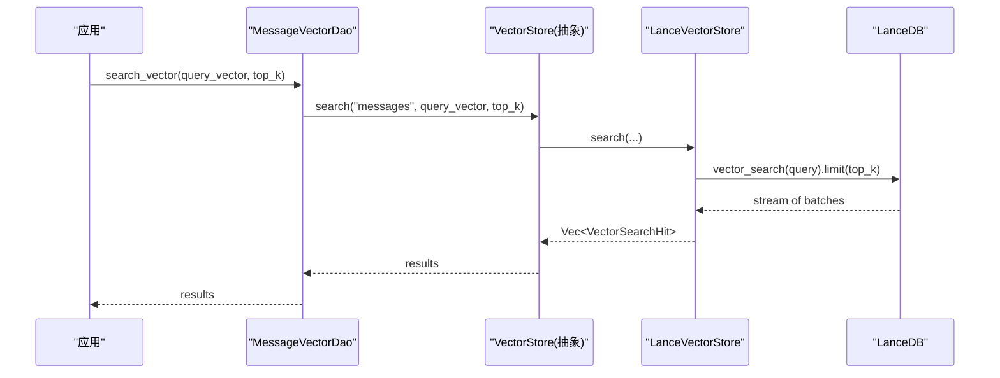
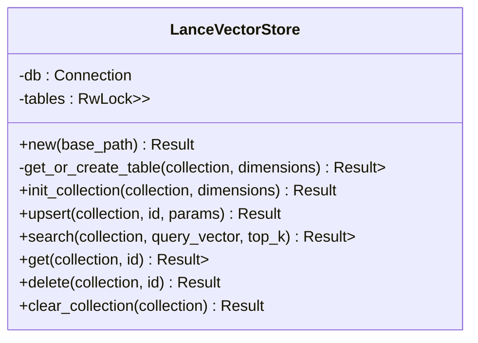
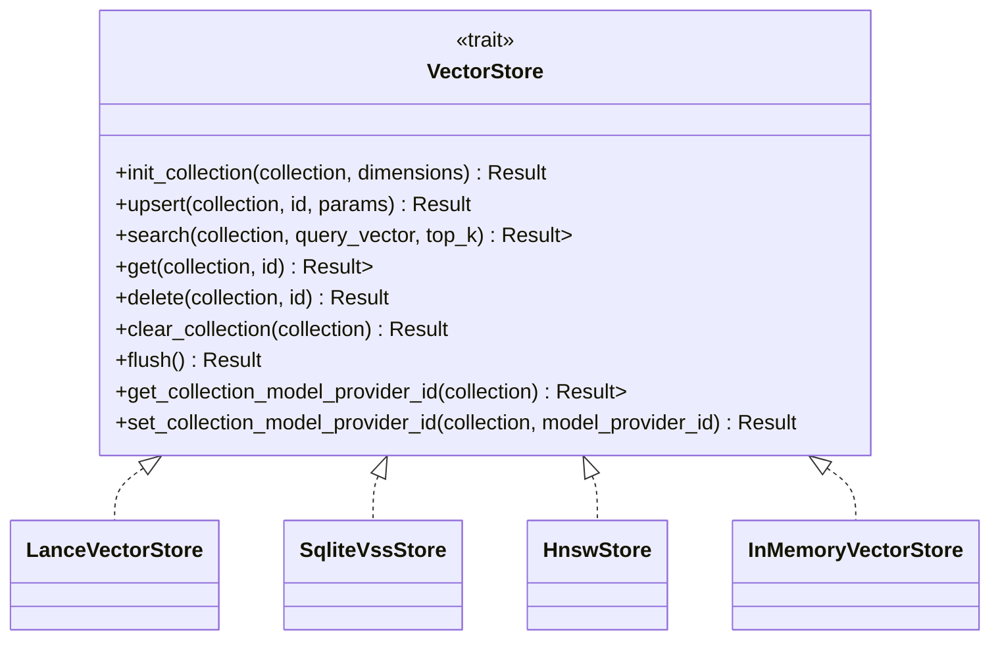
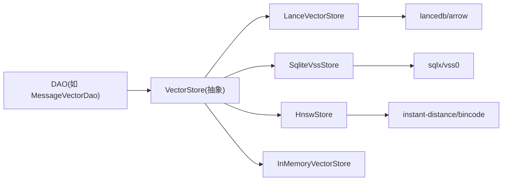

# LanceDB向量存储

<cite>
**本文引用的文件**
- [src/pkg/storage/lance.rs](src/pkg/storage/lance.rs)
- [src/pkg/storage/vector.rs](src/pkg/storage/vector.rs)
- [src/pkg/storage/hnsw.rs](src/pkg/storage/hnsw.rs)
- [src/pkg/storage/mem_vector.rs](src/pkg/storage/mem_vector.rs)
- [src/pkg/storage/mod.rs](src/pkg/storage/mod.rs)
- [src/models/vector.rs](src/models/vector.rs)
- [common/src/config.rs](common/src/config.rs)
- [src/service/dao/message/vector.rs](src/service/dao/message/vector.rs)
</cite>

## 目录
1. [简介](#简介)
2. [项目结构](#项目结构)
3. [核心组件](#核心组件)
4. [架构总览](#架构总览)
5. [详细组件分析](#详细组件分析)
6. [依赖关系分析](#依赖关系分析)
7. [性能与优化](#性能与优化)
8. [故障排查指南](#故障排查指南)
9. [结论](#结论)
10. [附录](#附录)

## 简介
本文件面向 AI Orz 的向量存储子系统，重点阐述 LanceVectorStore 如何集成 LanceDB 嵌入式向量数据库，覆盖数据集创建、索引构建、查询流程、并发访问控制、版本与过期策略、备份恢复思路，以及大规模数据处理的最佳实践。同时对比 SQLite VSS 与其他后端（内存、HNSW），给出选型建议与调优要点。

## 项目结构
向量存储采用“抽象 Trait + 多后端实现”的分层设计：
- 抽象层：定义统一的 VectorStore Trait，屏蔽后端差异
- 后端实现：LanceDB、SQLite VSS、HNSW、内存实现
- 业务 DAO：按领域（消息、技能、任务等）调用统一接口
- 配置与门面：根据配置选择具体后端，提供 Storage 门面

图表来源
- [src/pkg/storage/mod.rs:78-93](src/pkg/storage/mod.rs#L78-L93)
- [src/pkg/storage/vector.rs:18-74](src/pkg/storage/vector.rs#L18-L74)

章节来源
- [src/pkg/storage/mod.rs:1-212](src/pkg/storage/mod.rs#L1-L212)
- [src/pkg/storage/vector.rs:1-74](src/pkg/storage/vector.rs#L1-L74)

## 核心组件
- VectorStore 抽象：定义 init_collection、upsert、search、get、delete、clear_collection、flush 及模型提供者元数据能力
- LanceVectorStore：基于 LanceDB 的高性能嵌入式实现，使用 Arrow Schema 持久化列式数据，支持过滤与过期字段
- SqliteVssStore：基于 SQLite vss0 扩展的虚拟表方案，适合已有 SQLite 生态
- HnswStore：纯 Rust HNSW 近似最近邻索引，支持增量 dirty 重建与定时落盘
- InMemoryVectorStore：零依赖内存实现，适合测试与小规模场景
- 通用数据结构：VectorMeta、VectorRow、VectorSearchHit、VectorIndexParams、SearchResult 等

章节来源
- [src/pkg/storage/vector.rs:18-74](src/pkg/storage/vector.rs#L18-L74)
- [src/models/vector.rs:9-168](src/models/vector.rs#L9-L168)

## 架构总览
LanceVectorStore 通过 LanceDB 连接管理集合（表），懒加载并缓存 Table 引用；写入时构造 Arrow RecordBatch 批量追加；搜索时执行向量检索并映射为标准命中结果。

图表来源
- [src/service/dao/message/vector.rs:38-49](src/service/dao/message/vector.rs#L38-L49)
- [src/pkg/storage/lance.rs:134-199](src/pkg/storage/lance.rs#L134-L199)

图表来源
- [src/service/dao/message/vector.rs:51-59](src/service/dao/message/vector.rs#L51-L59)
- [src/pkg/storage/lance.rs:201-282](src/pkg/storage/lance.rs#L201-L282)

## 详细组件分析

### LanceVectorStore 组件
- 连接与表缓存：维护 Connection 与 HashMap<Arc<Table>> 的读写锁缓存，避免重复打开表
- 懒初始化：首次访问集合时检查是否存在，不存在则按维度创建固定长度列表的 Arrow Schema
- 写入路径：先删除旧记录保证幂等，再构造包含向量与元数据的 RecordBatch 批量追加
- 查询路径：执行向量搜索，收集 RecordBatch 并转换为标准命中结构；不直接返回原始向量以减少传输开销
- 读取与删除：按 id 精确查询或条件删除；清空集合后清理缓存

图表来源
- [src/pkg/storage/lance.rs:26-124](src/pkg/storage/lance.rs#L26-L124)
- [src/pkg/storage/lance.rs:127-365](src/pkg/storage/lance.rs#L127-L365)

章节来源
- [src/pkg/storage/lance.rs:1-365](src/pkg/storage/lance.rs#L1-L365)

### 向量存储抽象与多后端
- VectorStore Trait：统一 CRUD、刷新与模型提供者元数据能力
- SqliteVssStore：使用 SQLite vss0 虚拟表与元数据表，查询时过滤过期时间
- HnswStore：内存 HNSW 索引 + bincode 持久化，后台定时落盘，Drop 兜底
- InMemoryVectorStore：纯内存线性扫描，异步持久化到 .bin 文件

图表来源
- [src/pkg/storage/vector.rs:18-74](src/pkg/storage/vector.rs#L18-L74)
- [src/pkg/storage/lance.rs:127-365](src/pkg/storage/lance.rs#L127-L365)
- [src/pkg/storage/hnsw.rs:432-616](src/pkg/storage/hnsw.rs#L432-L616)
- [src/pkg/storage/mem_vector.rs:119-275](src/pkg/storage/mem_vector.rs#L119-L275)

章节来源
- [src/pkg/storage/vector.rs:1-291](src/pkg/storage/vector.rs#L1-L291)
- [src/pkg/storage/hnsw.rs:1-617](src/pkg/storage/hnsw.rs#L1-L617)
- [src/pkg/storage/mem_vector.rs:1-276](src/pkg/storage/mem_vector.rs#L1-L276)

### 数据模型与索引参数
- VectorMeta：内容哈希、嵌入模型、索引时间、过期时间
- VectorRow：业务 ID、向量、元数据
- VectorSearchHit：行与相似度距离
- VectorIndexParams：向量、内容哈希、模型提供者、嵌入模型、过期时间
- SearchResult<T>：业务实体与匹配元信息包装

章节来源
- [src/models/vector.rs:9-168](src/models/vector.rs#L9-L168)

### 配置与后端选择
- 默认后端为 LanceDb，可通过配置切换为 InMemory、Hnsw、SqliteVss
- 向量数据库文件路径由 base_data_path 派生，HNSW 索引目录独立
- Storage::new 根据配置实例化对应后端

章节来源
- [common/src/config.rs:98-114](common/src/config.rs#L98-L114)
- [common/src/config.rs:178-203](common/src/config.rs#L178-L203)
- [common/src/config.rs:264-278](common/src/config.rs#L264-L278)
- [src/pkg/storage/mod.rs:78-93](src/pkg/storage/mod.rs#L78-L93)

## 依赖关系分析
- DAO 仅依赖 VectorStore 抽象，不感知具体后端
- Storage 门面负责根据配置装配后端
- LanceVectorStore 依赖 lancedb、arrow、tokio 并发原语
- HnswStore 依赖 instant-distance、bincode 进行索引与持久化
- SqliteVssStore 依赖 sqlx 与 vss0 扩展

图表来源
- [src/service/dao/message/vector.rs:38-83](src/service/dao/message/vector.rs#L38-L83)
- [src/pkg/storage/mod.rs:78-93](src/pkg/storage/mod.rs#L78-L93)

章节来源
- [src/service/dao/message/vector.rs:1-84](src/service/dao/message/vector.rs#L1-L84)
- [src/pkg/storage/mod.rs:1-212](src/pkg/storage/mod.rs#L1-L212)

## 性能与优化

### 写入优化
- 批量写入：LanceVectorStore 使用 Arrow RecordBatch 批量追加，减少系统调用与序列化开销
- 幂等更新：upsert 先删除再插入，避免重复键冲突
- 惰性建表：首次访问集合时按需创建，降低冷启动成本

### 查询优化
- 向量检索：LanceDB 内置 HNSW 索引，支持百万级向量快速检索
- 结果裁剪：search 限制 top_k，减少网络与内存压力
- 过滤过期：在查询中结合 expire_at 过滤，避免无效结果

### 并发与一致性
- 表缓存：RwLock<HashMap> 缓存 Table 引用，读多写少场景高效
- 事务与原子性：LanceDB 写入以批为单位；如需跨集合强一致，应在上层编排事务边界
- 过期策略：通过 expire_at 字段配合查询过滤，实现软过期

### 持久化与恢复
- LanceDB：单文件/目录持久化，可直接复制备份；恢复即重新 connect 同一目录
- HNSW：bincode 序列化每个 collection 与元数据，后台定时落盘，Drop 兜底
- SQLite VSS：vss 虚拟表 + 元数据表，随 SQLite 文件整体备份

### 大规模数据处理建议
- 合理分集合：按领域划分集合（如 messages、skills、tasks），控制单集合规模
- 控制维度：确保同集合内向量维度一致，避免频繁重建 schema
- 批量导入：合并小批次为大批次写入，提升吞吐
- 监控指标：关注索引重建耗时、写入延迟、查询延迟与内存占用

[本节为通用指导，无需特定文件引用]

## 故障排查指南
- 连接失败：检查 LanceDB 目录权限与路径；确认 base_data_path 存在且可写
- 表创建失败：确认向量维度与 schema 一致；若维度变化需重建集合
- 查询为空：检查是否已 upsert 数据；确认未过期；核对 top_k 设置
- 删除无效：确认 id 正确；LanceDB 删除基于条件表达式
- 性能退化：检查是否频繁重建索引（HNSW）；评估 top_k 与批量大小

章节来源
- [src/pkg/storage/lance.rs:43-124](src/pkg/storage/lance.rs#L43-L124)
- [src/pkg/storage/lance.rs:134-199](src/pkg/storage/lance.rs#L134-L199)
- [src/pkg/storage/lance.rs:201-282](src/pkg/storage/lance.rs#L201-L282)
- [src/pkg/storage/hnsw.rs:432-616](src/pkg/storage/hnsw.rs#L432-L616)

## 结论
LanceVectorStore 将 LanceDB 的列式存储、内置索引与持久化能力无缝接入 AI Orz 的向量存储抽象层，提供高性能、易扩展的语义检索能力。结合过期策略、批量写入与并发缓存，满足生产级需求。对于不同场景，可选择 LanceDB（默认）、HNSW（纯 Rust）、SQLite VSS（已有 SQLite 生态）或内存实现，灵活权衡性能与依赖。

[本节为总结性内容，无需特定文件引用]

## 附录

### 与 SQLite VSS 及其他后端的对比
- LanceDB vs SQLite VSS
  - 优势：LanceDB 原生列式存储与内置索引，查询性能更优；无需额外扩展
  - 劣势：需要引入 lancedb/arrow 依赖；迁移成本高于 SQLite
- HNSW vs LanceDB
  - 优势：纯 Rust，零系统依赖；可控的索引重建与持久化策略
  - 劣势：大规模下索引重建开销较大；需自行管理持久化
- 内存实现 vs 磁盘后端
  - 优势：零依赖、开发调试友好
  - 劣势：重启丢失；不适合大规模生产

章节来源
- [src/pkg/storage/vector.rs:76-291](src/pkg/storage/vector.rs#L76-L291)
- [src/pkg/storage/hnsw.rs:1-617](src/pkg/storage/hnsw.rs#L1-L617)
- [src/pkg/storage/mem_vector.rs:1-276](src/pkg/storage/mem_vector.rs#L1-L276)

### 版本管理与模型提供者追踪
- HNSW 后端维护集合级元数据（model_provider_id、dimensions、vector_count、updated_at），便于重建与升级
- LanceDB 通过 embedding_model 与 indexed_at 记录模型与时间戳，结合 expire_at 实现生命周期管理

章节来源
- [src/pkg/storage/hnsw.rs:127-147](src/pkg/storage/hnsw.rs#L127-L147)
- [src/pkg/storage/hnsw.rs:473-489](src/pkg/storage/hnsw.rs#L473-L489)
- [src/pkg/storage/lance.rs:90-104](src/pkg/storage/lance.rs#L90-L104)

### 备份与恢复
- LanceDB：直接备份向量数据库目录；恢复时指向同一目录即可
- HNSW：备份 collections_meta.bincode 与各 collection 的 .bincode 文件
- SQLite VSS：备份 SQLite 主库与 vss 虚拟表所在数据库文件

章节来源
- [src/pkg/storage/mod.rs:78-93](src/pkg/storage/mod.rs#L78-L93)
- [src/pkg/storage/hnsw.rs:321-342](src/pkg/storage/hnsw.rs#L321-L342)
- [src/pkg/storage/hnsw.rs:303-319](src/pkg/storage/hnsw.rs#L303-L319)