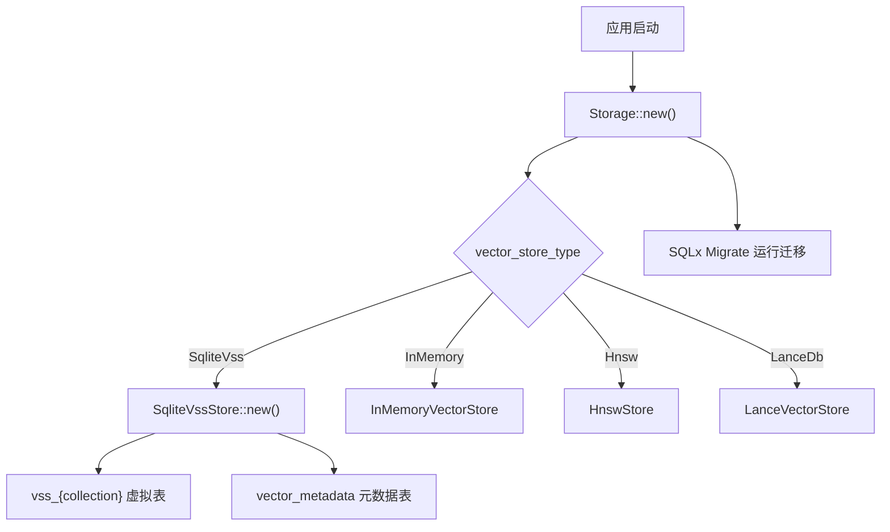
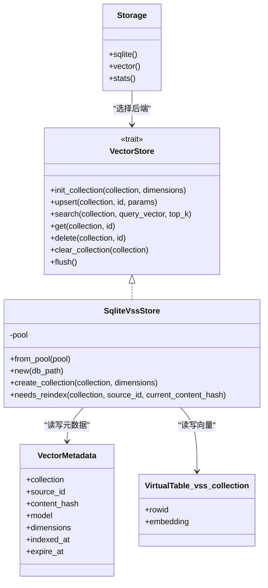
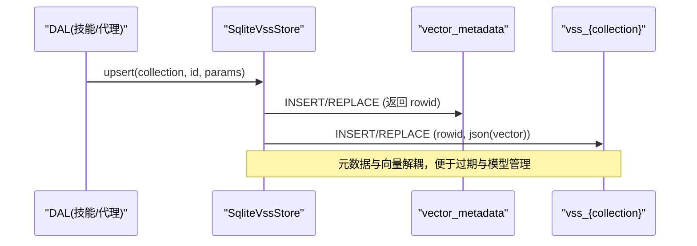
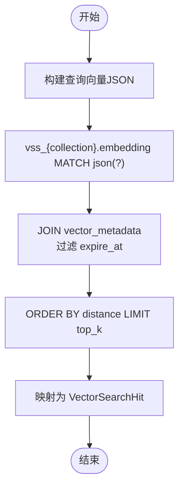
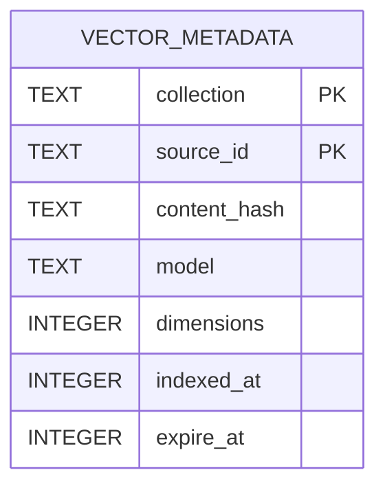
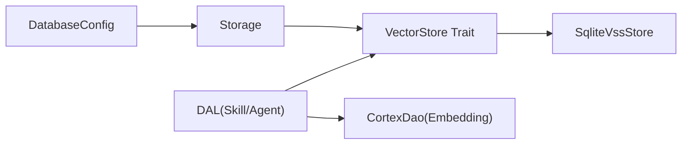

# SQLite VSS向量存储

<cite>
**本文引用的文件**
- [src/pkg/storage/mod.rs](src/pkg/storage/mod.rs)
- [src/pkg/storage/vector.rs](src/pkg/storage/vector.rs)
- [migrations/20260505000000_vector_metadata.sql](migrations/20260505000000_vector_metadata.sql)
- [common/src/config.rs](common/src/config.rs)
- [src/models/vector.rs](src/models/vector.rs)
- [src/service/dal/skill.rs](src/service/dal/skill.rs)
- [src/service/dal/agent.rs](src/service/dal/agent.rs)
- [docs/vector_search_architecture.md](docs/vector_search_architecture.md)
</cite>

## 目录
1. [简介](#简介)
2. [项目结构](#项目结构)
3. [核心组件](#核心组件)
4. [架构总览](#架构总览)
5. [详细组件分析](#详细组件分析)
6. [依赖关系分析](#依赖关系分析)
7. [性能考量](#性能考量)
8. [故障排查指南](#故障排查指南)
9. [结论](#结论)
10. [附录](#附录)

## 简介
本文件聚焦 AI Orz 项目中基于 SQLite vss0 扩展的向量存储实现，围绕 SqliteVssStore 如何创建虚拟表、组织向量数据与元数据、执行相似性搜索以及与其他后端（InMemory/HNSW/LanceDB）的降级策略进行系统化说明。文档同时覆盖数据库迁移脚本、索引机制、配置项、部署要点、监控指标建议、常见问题与基准测试方法，帮助读者在生产环境中正确部署与调优 SQLite VSS 向量能力。

## 项目结构
- 存储门面与后端选择：Storage 在启动时根据配置选择向量后端，默认支持 InMemory、Hnsw、LanceDb、SqliteVss。
- 向量抽象层：VectorStore trait 统一增删改查、集合初始化、清空、刷新等接口。
- SQLite VSS 实现：SqliteVssStore 使用 vss0 虚拟表承载向量，配合 vector_metadata 元数据表维护映射、模型信息、过期时间等。
- 业务 DAL 层：SkillDal、AgentDal 等在创建/更新时触发向量化并写入向量索引；搜索时组合 FTS5 关键词结果与向量结果，按 Hybrid > Vector > Keyword 排序。
- 迁移脚本：vector_metadata 表由 SQL 迁移自动创建。

图表来源
- [src/pkg/storage/mod.rs:56-133](src/pkg/storage/mod.rs#L56-L133)
- [src/pkg/storage/vector.rs:79-92](src/pkg/storage/vector.rs#L79-L92)
- [migrations/20260505000000_vector_metadata.sql:1-16](migrations/20260505000000_vector_metadata.sql#L1-L16)

章节来源
- [src/pkg/storage/mod.rs:1-212](src/pkg/storage/mod.rs#L1-L212)
- [common/src/config.rs:100-203](common/src/config.rs#L100-L203)
- [migrations/20260505000000_vector_metadata.sql:1-16](migrations/20260505000000_vector_metadata.sql#L1-L16)

## 核心组件
- Storage：统一入口，负责连接池、迁移、Stats 初始化与向量后端选择。
- VectorStore trait：定义 init_collection/upsert/search/get/delete/clear_collection/flush 等通用接口。
- SqliteVssStore：基于 SQLite vss0 扩展的向量存储实现，使用 vss_{collection} 虚拟表 + vector_metadata 元数据表。
- 向量数据结构：VectorRow、VectorMeta、VectorIndexParams、VectorSearchHit、MatchType、SearchMatchInfo 等。
- 业务 DAL：SkillDal、AgentDal 等负责向量化时机、内容选择、索引生命周期管理与混合搜索结果聚合排序。

章节来源
- [src/pkg/storage/mod.rs:36-167](src/pkg/storage/mod.rs#L36-L167)
- [src/pkg/storage/vector.rs:18-74](src/pkg/storage/vector.rs#L18-L74)
- [src/models/vector.rs:9-168](src/models/vector.rs#L9-L168)
- [src/service/dal/skill.rs:350-513](src/service/dal/skill.rs#L350-L513)
- [src/service/dal/agent.rs:290-337](src/service/dal/agent.rs#L290-L337)

## 架构总览
SQLite VSS 向量存储采用“元数据表 + 虚拟表”的双表设计：
- 元数据表 vector_metadata：持久化 source_id 到 rowid 的映射、content_hash、embedding_model、dimensions、expire_at 等。
- 虚拟表 vss_{collection}：由 vss0 扩展提供，存储 embedding 列，支持 MATCH 查询与距离计算。

图表来源
- [src/pkg/storage/mod.rs:36-167](src/pkg/storage/mod.rs#L36-L167)
- [src/pkg/storage/vector.rs:76-291](src/pkg/storage/vector.rs#L76-L291)
- [migrations/20260505000000_vector_metadata.sql:1-16](migrations/20260505000000_vector_metadata.sql#L1-L16)

## 详细组件分析

### SqliteVssStore：虚拟表创建与向量写入
- 虚拟表创建：通过 CREATE VIRTUAL TABLE ... USING vss0(embedding({})) 为每个 collection 创建独立虚拟表。
- 元数据写入：upsert 先 INSERT OR REPLACE 到 vector_metadata，获取 rowid，再写入 vss_{collection} 的 embedding 列。
- 查询优化：MATCH json(?) 匹配查询向量，JOIN 元数据表过滤 expire_at，ORDER BY distance LIMIT top_k。
- 删除与清空：先取 rowid 从虚拟表删除，再清理元数据；清空集合则批量删除虚拟表与元数据记录。

图表来源
- [src/pkg/storage/vector.rs:94-124](src/pkg/storage/vector.rs#L94-L124)
- [migrations/20260505000000_vector_metadata.sql:1-16](migrations/20260505000000_vector_metadata.sql#L1-L16)

章节来源
- [src/pkg/storage/vector.rs:83-124](src/pkg/storage/vector.rs#L83-L124)
- [migrations/20260505000000_vector_metadata.sql:1-16](migrations/20260505000000_vector_metadata.sql#L1-L16)

### 向量查询流程与相似度排序
- 查询步骤：将查询向量序列化为 JSON，调用 vss_{collection}.embedding MATCH json(?)，JOIN 元数据表过滤过期项，按 distance 升序取 top_k。
- 结果映射：返回 VectorSearchHit，包含 row（SqliteVSS 不存原始向量，故 vector 为空）与 distance。
- 业务侧处理：DAL 层根据 source_id 回查业务实体，结合 FTS5 结果进行三态匹配与排序。

图表来源
- [src/pkg/storage/vector.rs:126-173](src/pkg/storage/vector.rs#L126-L173)
- [src/models/vector.rs:29-36](src/models/vector.rs#L29-L36)

章节来源
- [src/pkg/storage/vector.rs:126-173](src/pkg/storage/vector.rs#L126-L173)
- [src/models/vector.rs:29-36](src/models/vector.rs#L29-L36)

### 元数据表设计与索引机制
- 表结构：collection、source_id、content_hash、model、dimensions、indexed_at、expire_at，主键为 (collection, source_id)。
- 索引：对 expire_at 建立索引以支持过期清理与快速筛选。
- 用途：
  - 维护 source_id 到 vss rowid 的映射。
  - 记录 content_hash 用于判断是否需要重索引。
  - 记录 embedding_model、dimensions、expire_at 用于模型切换与过期控制。

图表来源
- [migrations/20260505000000_vector_metadata.sql:1-16](migrations/20260505000000_vector_metadata.sql#L1-L16)

章节来源
- [migrations/20260505000000_vector_metadata.sql:1-16](migrations/20260505000000_vector_metadata.sql#L1-L16)

### 系统依赖要求与扩展加载过程
- 系统依赖：需要 SQLite 编译或运行时加载 vss0 扩展（load_extension('vss0')）。
- 加载过程：SqliteVssStore::new 中尝试 load_extension('vss0')，失败不影响实例创建，但后续虚拟表操作会失败。
- 降级策略：
  - 若扩展未安装或加载失败，DAL 层捕获错误并降级到纯关键词搜索（FTS5），仅 warn 日志。
  - 其他后端（InMemory/HNSW/LanceDB）可作为生产推荐方案，避免系统依赖。

章节来源
- [src/pkg/storage/vector.rs:245-262](src/pkg/storage/vector.rs#L245-L262)
- [src/service/dal/skill.rs:350-364](src/service/dal/skill.rs#L350-L364)
- [src/service/dal/agent.rs:290-311](src/service/dal/agent.rs#L290-L311)

### 数据库迁移脚本
- 迁移文件：20260505000000_vector_metadata.sql 创建 vector_metadata 表及 expire_at 索引。
- 执行时机：Storage::new 中通过 sqlx::migrate!("./migrations") 自动运行迁移，确保表结构就绪。

章节来源
- [migrations/20260505000000_vector_metadata.sql:1-16](migrations/20260505000000_vector_metadata.sql#L1-L16)
- [src/pkg/storage/mod.rs:72-76](src/pkg/storage/mod.rs#L72-L76)

### 配置项与后端选择
- VectorStoreType：支持 LanceDb（默认）、InMemory、Hnsw、SqliteVss。
- DatabaseConfig：包含 db_file_name、vector_db_file_name、hnsw_index_dir 等路径配置。
- Storage 构造：根据配置选择对应后端，SqliteVss 使用 vector_db_file_name 作为向量数据库文件路径。

章节来源
- [common/src/config.rs:100-203](common/src/config.rs#L100-L203)
- [src/pkg/storage/mod.rs:78-93](src/pkg/storage/mod.rs#L78-L93)

### 业务 DAL 中的降级与混合搜索
- 降级：向量写入或搜索失败时，DAL 记录 warn 日志并继续主流程（FTS5 仍可用）。
- 混合搜索：组合 FTS5 关键词结果与向量结果，标记 MatchType（Hybrid/Vector/Keyword），按优先级与组内细排输出。

章节来源
- [src/service/dal/skill.rs:350-513](src/service/dal/skill.rs#L350-L513)
- [src/service/dal/agent.rs:290-337](src/service/dal/agent.rs#L290-L337)
- [docs/vector_search_architecture.md:72-131](docs/vector_search_architecture.md#L72-L131)

## 依赖关系分析
- Storage 依赖 common::config::DatabaseConfig 决定后端类型。
- SqliteVssStore 依赖 sqlx 与 SQLite vss0 扩展。
- DAL 层依赖 VectorStore trait 与 CortexDao（生成 Embedding），并通过 RequestContext 传递上下文。
- 测试隔离：Storage::with_sqlite_pool 与 DAO 单例保证测试间数据隔离。

图表来源
- [src/pkg/storage/mod.rs:56-133](src/pkg/storage/mod.rs#L56-L133)
- [src/pkg/storage/vector.rs:18-74](src/pkg/storage/vector.rs#L18-L74)
- [src/service/dal/agent.rs:314-337](src/service/dal/agent.rs#L314-L337)

章节来源
- [src/pkg/storage/mod.rs:56-133](src/pkg/storage/mod.rs#L56-L133)
- [src/pkg/storage/vector.rs:18-74](src/pkg/storage/vector.rs#L18-L74)
- [src/service/dal/agent.rs:314-337](src/service/dal/agent.rs#L314-L337)

## 性能考量
- 连接池大小：SQLite 单文件写并发有限，默认 max_connections=5，适合多数场景。
- 查询优化：
  - 使用 MATCH + ORDER BY distance LIMIT top_k 减少扫描范围。
  - 通过 expire_at 过滤避免无效向量参与计算。
- 元数据索引：idx_vector_metadata_expire 加速过期清理与筛选。
- 降级影响：向量不可用时，FTS5 仍可工作，保障可用性。
- 建议指标：
  - 向量写入成功率、失败率（warn 次数）。
  - 向量查询耗时分布（P50/P95/P99）。
  - 命中率（Top-K 中有效结果占比）。
  - 过期清理任务耗时与清理条数。

[本节为通用指导，无需具体文件引用]

## 故障排查指南
- 扩展未安装：
  - 现象：vss0 扩展加载失败，虚拟表操作报错。
  - 处理：确认 SQLite 已编译/加载 vss0；或在配置中切换到 InMemory/HNSW/LanceDB。
- 向量搜索失败：
  - 现象：DAL 捕获错误并降级到关键词搜索。
  - 处理：检查 vss0 扩展状态、向量维度是否一致、元数据是否存在过期导致无结果。
- 元数据不一致：
  - 现象：source_id 存在但虚拟表无对应行。
  - 处理：清理 vector_metadata 并重新 upsert；或使用 clear_collection 重建。
- 性能问题：
  - 现象：查询慢、CPU 高。
  - 处理：调整 top_k、检查 expire_at 过滤、评估是否切换至 HNSW/LanceDB。

章节来源
- [src/pkg/storage/vector.rs:245-262](src/pkg/storage/vector.rs#L245-L262)
- [src/service/dal/skill.rs:350-364](src/service/dal/skill.rs#L350-L364)
- [src/service/dal/agent.rs:290-311](src/service/dal/agent.rs#L290-L311)

## 结论
SqliteVssStore 通过 vss0 虚拟表与 vector_metadata 元数据表的协同，实现了轻量级、可嵌入的向量相似性搜索能力。其优势在于与 SQLite 生态无缝集成、易于部署；劣势是对系统扩展依赖敏感。建议在无 vss0 环境优先使用 InMemory/HNSW/LanceDB 后端，并在生产环境做好降级与监控。对于已有 SQLite 基础设施且具备 vss0 能力的场景，SqliteVssStore 提供了低成本的向量检索方案。

[本节为总结，无需具体文件引用]

## 附录

### 部署指南
- 环境准备：
  - 确保 SQLite 支持 load_extension('vss0')。
  - 准备 base_data_path 与 vector_db_file_name。
- 启动流程：
  - Storage::new 自动运行迁移，创建 vector_metadata 表。
  - 根据配置选择 SqliteVss 后端并初始化。
- 验证：
  - 调用 init_collection 创建虚拟表。
  - 执行一次 upsert 与 search 验证功能。

章节来源
- [src/pkg/storage/mod.rs:56-133](src/pkg/storage/mod.rs#L56-L133)
- [src/pkg/storage/vector.rs:83-92](src/pkg/storage/vector.rs#L83-L92)
- [migrations/20260505000000_vector_metadata.sql:1-16](migrations/20260505000000_vector_metadata.sql#L1-L16)

### 性能调优参数
- 连接池：max_connections=5（默认，适合 SQLite 单文件写限制）。
- 查询参数：top_k 控制返回数量，避免过大导致内存与排序开销。
- 过期策略：设置 expire_at 并定期清理，减少无效向量参与计算。
- 后端切换：在高并发或大数据集场景考虑 HNSW/LanceDB。

章节来源
- [src/pkg/storage/mod.rs:67-70](src/pkg/storage/mod.rs#L67-L70)
- [src/pkg/storage/vector.rs:126-148](src/pkg/storage/vector.rs#L126-L148)
- [common/src/config.rs:100-203](common/src/config.rs#L100-L203)

### 监控指标建议
- 向量写入：成功率、失败率、平均耗时。
- 向量查询：QPS、延迟分布、命中率。
- 元数据：过期清理条数、清理耗时。
- 后端健康：扩展加载状态、连接池使用率。

[本节为通用指导，无需具体文件引用]

### 基准测试方法
- 数据集：准备不同维度与规模的向量集合。
- 写入压测：批量 upsert，统计吞吐与延迟。
- 查询压测：随机 query_vector，测量 Top-K 召回与延迟。
- 对比实验：切换 InMemory/HNSW/LanceDB，比较性能差异。

[本节为通用指导，无需具体文件引用]