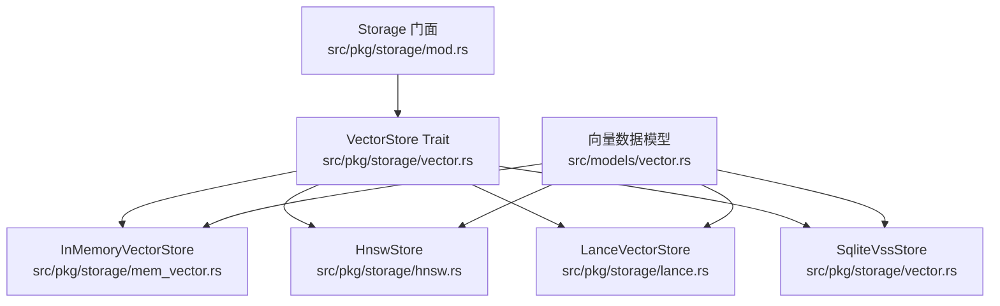
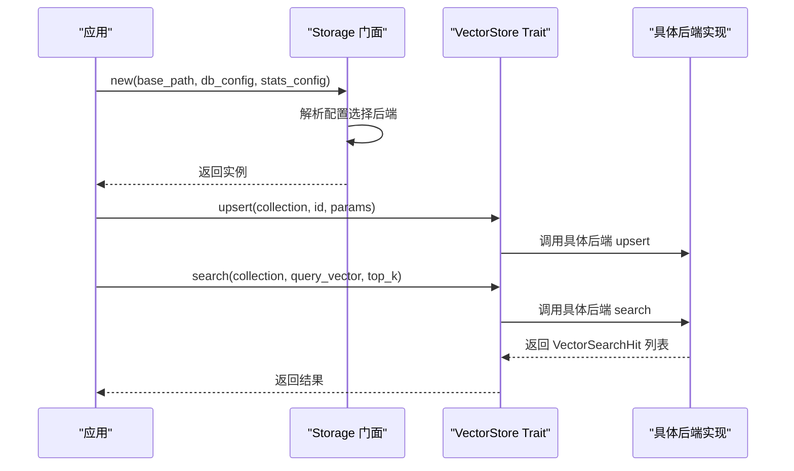
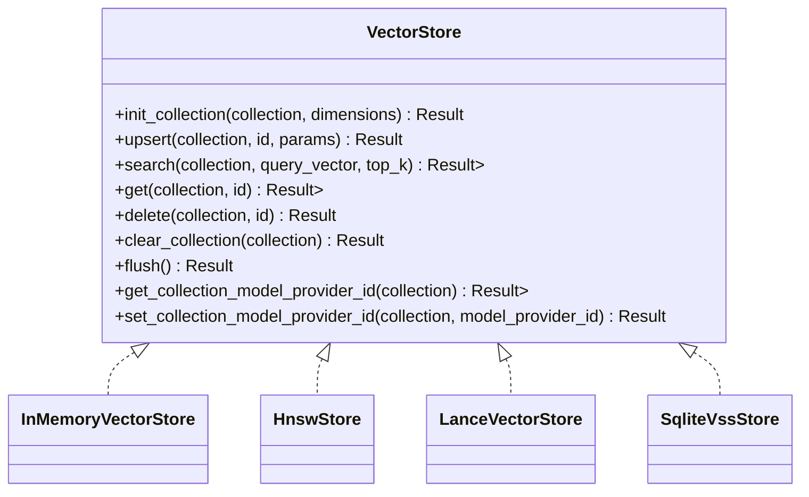
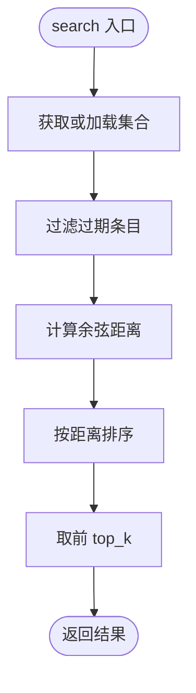
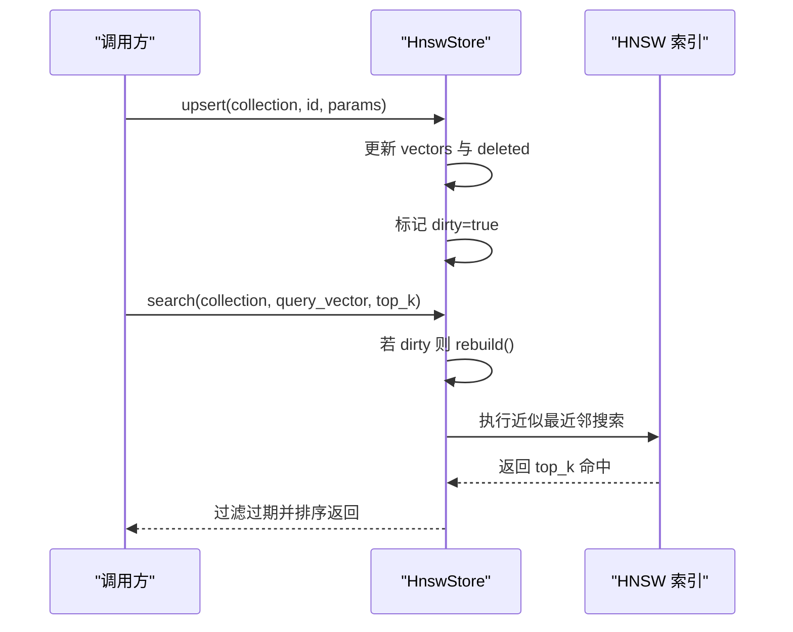
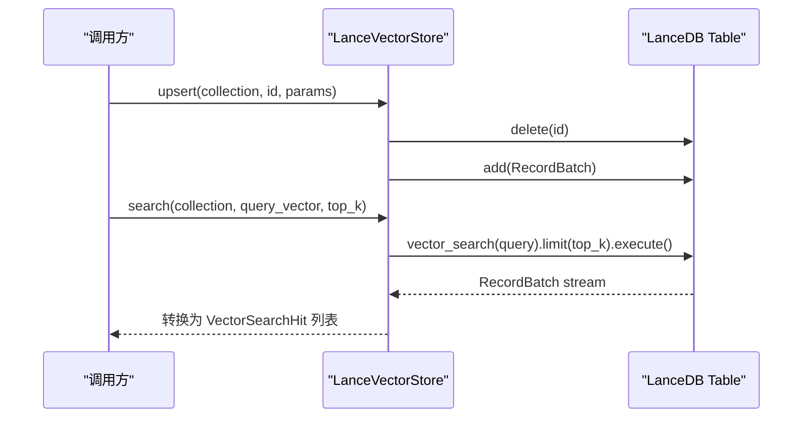
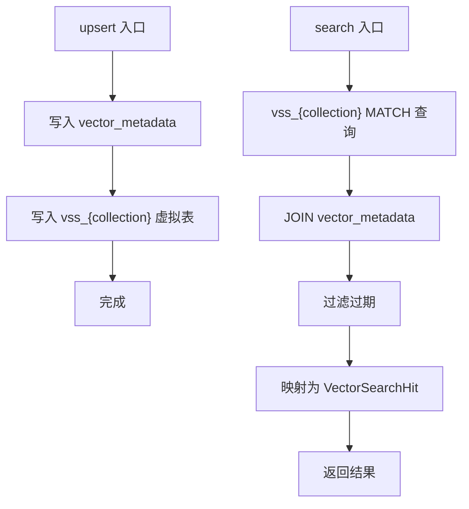
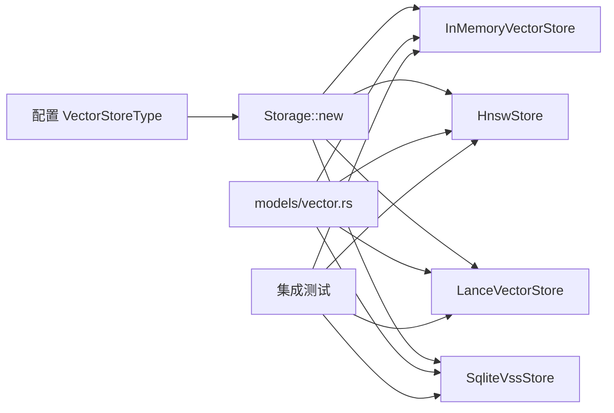

# 向量存储（代码落地层）

<cite>
**本文引用的文件**
- [src/pkg/storage/mod.rs](src/pkg/storage/mod.rs)
- [src/pkg/storage/vector.rs](src/pkg/storage/vector.rs)
- [src/pkg/storage/mem_vector.rs](src/pkg/storage/mem_vector.rs)
- [src/pkg/storage/hnsw.rs](src/pkg/storage/hnsw.rs)
- [src/pkg/storage/lance.rs](src/pkg/storage/lance.rs)
- [src/models/vector.rs](src/models/vector.rs)
- [tests/integration/message_vector_test.rs](tests/integration/message_vector_test.rs)
- [tests/integration/project_task_vector_test.rs](tests/integration/project_task_vector_test.rs)
- [tests/integration/tool_skill_vector_test.rs](tests/integration/tool_skill_vector_test.rs)
</cite>

## 目录
1. [简介](#简介)
2. [项目结构](#项目结构)
3. [核心组件](#核心组件)
4. [架构总览](#架构总览)
5. [详细组件分析](#详细组件分析)
6. [依赖关系分析](#依赖关系分析)
7. [性能与容量规划](#性能与容量规划)
8. [故障排除指南](#故障排除指南)
9. [结论](#结论)
10. [附录](#附录)

## 简介
本文件面向 AI Orz 的向量存储子系统，系统性说明向量存储抽象接口 VectorStore 的设计与多种后端实现：InMemoryVectorStore（纯 Rust 内存实现）、HnswStore（基于 HNSW 的高性能近似最近邻索引）、LanceVectorStore（基于 LanceDB 的嵌入式向量数据库）以及 SqliteVssStore（基于 SQLite VSS 扩展）。文档覆盖向量索引构建、相似度计算、检索优化策略，以及插入、查询、更新、删除等操作的完整流程；并提供性能对比、容量规划建议与故障排除指南。

> 📌 视角说明（AGENTS §2.1.3 Level 3 互补视角平行卡）：
> 本长文是「向量存储」主题的 **代码落地层** 视角。同主题还有以下平行视角卡，请按需交叉阅读：
> - [向量存储（框架层）](docs/wiki/zh/content/基础设施/存储系统/向量存储/向量存储.md)

## 项目结构
向量存储相关代码集中在 src/pkg/storage 模块中，通过统一的 Storage 门面根据配置选择具体后端；向量数据结构定义在 models/vector.rs；集成测试覆盖消息、项目/任务、工具/技能等实体的向量搜索路径。

图表来源
- [src/pkg/storage/mod.rs:20-34](src/pkg/storage/mod.rs#L20-L34)
- [src/pkg/storage/vector.rs:18-74](src/pkg/storage/vector.rs#L18-L74)
- [src/pkg/storage/mem_vector.rs:18-25](src/pkg/storage/mem_vector.rs#L18-L25)
- [src/pkg/storage/hnsw.rs:149-166](src/pkg/storage/hnsw.rs#L149-L166)
- [src/pkg/storage/lance.rs:26-33](src/pkg/storage/lance.rs#L26-L33)
- [src/models/vector.rs:9-67](src/models/vector.rs#L9-L67)

章节来源
- [src/pkg/storage/mod.rs:1-212](src/pkg/storage/mod.rs#L1-L212)
- [src/models/vector.rs:1-192](src/models/vector.rs#L1-L192)

## 核心组件
- VectorStore Trait：统一抽象，提供 init_collection、upsert、search、get、delete、clear_collection、flush、get/set collection model_provider_id 等方法，屏蔽后端差异。
- InMemoryVectorStore：纯 Rust 内存实现，使用余弦距离线性扫描，支持懒加载持久化到 .bin 文件，零系统依赖。
- HnswStore：基于 instant-distance 的 HNSW 索引，支持增量写入、按需重建索引、后台定时落盘与 Drop 兜底持久化。
- LanceVectorStore：基于 LanceDB 的嵌入式向量数据库，内置 HNSW 索引，支持百万级向量快速检索，持久化到磁盘。
- SqliteVssStore：基于 SQLite vss0 扩展，使用虚拟表进行向量相似性搜索，元数据存储在 vector_metadata 表。

章节来源
- [src/pkg/storage/vector.rs:18-74](src/pkg/storage/vector.rs#L18-L74)
- [src/pkg/storage/mem_vector.rs:18-25](src/pkg/storage/mem_vector.rs#L18-L25)
- [src/pkg/storage/hnsw.rs:149-166](src/pkg/storage/hnsw.rs#L149-L166)
- [src/pkg/storage/lance.rs:26-33](src/pkg/storage/lance.rs#L26-L33)
- [src/pkg/storage/vector.rs:76-235](src/pkg/storage/vector.rs#L76-L235)

## 架构总览
Storage 门面根据配置自动选择向量存储后端，并暴露统一的 vector() 访问器。业务 DAO/DAL 层通过 VectorStore Trait 调用具体后端，实现可插拔切换。

图表来源
- [src/pkg/storage/mod.rs:56-93](src/pkg/storage/mod.rs#L56-L93)
- [src/pkg/storage/vector.rs:18-74](src/pkg/storage/vector.rs#L18-L74)

章节来源
- [src/pkg/storage/mod.rs:56-93](src/pkg/storage/mod.rs#L56-L93)

## 详细组件分析

### VectorStore Trait 设计
- 职责：定义跨后端的统一操作集，包括集合初始化、向量增删改查、清空、刷新、集合维度元信息读写。
- 设计要点：
  - 所有方法返回统一行级结构体 VectorRow 与搜索结果 VectorSearchHit，便于上层统一处理。
  - flush 默认空实现，仅 HnswStore 有实际落盘逻辑。
  - get/set collection model_provider_id 用于重建索引时判断是否需要重算。

图表来源
- [src/pkg/storage/vector.rs:18-74](src/pkg/storage/vector.rs#L18-L74)

章节来源
- [src/pkg/storage/vector.rs:18-74](src/pkg/storage/vector.rs#L18-L74)

### InMemoryVectorStore（纯 Rust 内存实现）
- 相似度算法：余弦距离（越小越相似），对零向量做保护返回最大距离。
- 数据组织：按集合名维护 HashMap<String, VectorCollection>，每个集合包含维度与条目列表。
- 持久化：懒加载模式，首次访问集合时从 base_data_path/vectors/{collection}.bin 加载；upsert/delete/clear 后异步保存。
- 复杂度：search 为 O(N)，适合中小规模或开发测试场景。

图表来源
- [src/pkg/storage/mem_vector.rs:103-117](src/pkg/storage/mem_vector.rs#L103-L117)
- [src/pkg/storage/mem_vector.rs:188-228](src/pkg/storage/mem_vector.rs#L188-L228)

章节来源
- [src/pkg/storage/mem_vector.rs:18-276](src/pkg/storage/mem_vector.rs#L18-L276)

### HnswStore（HNSW 高性能近似最近邻索引）
- 索引结构：每个集合独立 HNSW 索引，缓存于内存；写入标记 dirty，搜索时按需重建。
- 相似度算法：自定义 FloatPoint 实现 Point trait，使用余弦距离。
- 持久化：每个集合序列化为独立 .bincode 文件；集合元数据集中持久化；后台 60s 定时落盘；Drop 兜底同步落盘。
- 复杂度：search 近似 O(log N) 级别，适合大规模向量检索。

图表来源
- [src/pkg/storage/hnsw.rs:107-124](src/pkg/storage/hnsw.rs#L107-L124)
- [src/pkg/storage/hnsw.rs:442-491](src/pkg/storage/hnsw.rs#L442-L491)
- [src/pkg/storage/hnsw.rs:493-543](src/pkg/storage/hnsw.rs#L493-L543)

章节来源
- [src/pkg/storage/hnsw.rs:1-617](src/pkg/storage/hnsw.rs#L1-L617)

### LanceVectorStore（LanceDB 嵌入式向量数据库）
- 索引与存储：基于 LanceDB，内置 HNSW 索引，单文件存储，支持元数据过滤。
- Schema：id、vector(FixedSizeList<Float32>)、content_hash、embedding_model、indexed_at、expire_at。
- 操作：upsert 先删除旧记录再追加新批次；search 使用 vector_search 流式获取结果；get 通过条件查询；delete 与 clear 通过 delete 语句。
- 复杂度：search 由 LanceDB 内部索引加速，适合大规模生产环境。

图表来源
- [src/pkg/storage/lance.rs:134-199](src/pkg/storage/lance.rs#L134-L199)
- [src/pkg/storage/lance.rs:201-282](src/pkg/storage/lance.rs#L201-L282)

章节来源
- [src/pkg/storage/lance.rs:1-365](src/pkg/storage/lance.rs#L1-L365)

### SqliteVssStore（SQLite VSS 扩展）
- 存储结构：vss_{collection} 虚拟表存储向量，vector_metadata 表存储元数据（source_id、content_hash、model、dimensions、expire_at）。
- 相似度算法：依赖 vss0 扩展的 MATCH 操作，返回 distance。
- 限制：不存储原始向量，search/get 返回的 VectorRow.vector 为空；业务侧需根据 source_id 重新向量化或额外存储。

图表来源
- [src/pkg/storage/vector.rs:94-124](src/pkg/storage/vector.rs#L94-L124)
- [src/pkg/storage/vector.rs:126-173](src/pkg/storage/vector.rs#L126-L173)

章节来源
- [src/pkg/storage/vector.rs:76-291](src/pkg/storage/vector.rs#L76-L291)

## 依赖关系分析
- Storage 门面依赖配置中的 VectorStoreType 决定后端选择：InMemory、Hnsw、LanceDb、SqliteVss。
- 各后端均依赖 models/vector.rs 的数据结构（VectorRow、VectorMeta、VectorIndexParams、VectorSearchHit）。
- 集成测试验证多实体（Message、Project/Task、Tool/Skill）的向量搜索路径，确保后端在不同业务场景下的可用性。

图表来源
- [src/pkg/storage/mod.rs:78-93](src/pkg/storage/mod.rs#L78-L93)
- [src/models/vector.rs:9-67](src/models/vector.rs#L9-L67)
- [tests/integration/message_vector_test.rs:113-162](tests/integration/message_vector_test.rs#L113-L162)
- [tests/integration/project_task_vector_test.rs:143-195](tests/integration/project_task_vector_test.rs#L143-L195)
- [tests/integration/tool_skill_vector_test.rs:284-316](tests/integration/tool_skill_vector_test.rs#L284-L316)

章节来源
- [src/pkg/storage/mod.rs:78-93](src/pkg/storage/mod.rs#L78-L93)
- [src/models/vector.rs:9-67](src/models/vector.rs#L9-L67)
- [tests/integration/message_vector_test.rs:113-162](tests/integration/message_vector_test.rs#L113-L162)
- [tests/integration/project_task_vector_test.rs:143-195](tests/integration/project_task_vector_test.rs#L143-L195)
- [tests/integration/tool_skill_vector_test.rs:284-316](tests/integration/tool_skill_vector_test.rs#L284-L316)

## 性能与容量规划
- 相似度算法
  - InMemoryVectorStore：余弦距离线性扫描，时间复杂度 O(N)，适合小规模或开发测试。
  - HnswStore：HNSW 近似最近邻，时间复杂度近似 O(log N)，适合大规模检索。
  - LanceVectorStore：内置 HNSW，服务端优化良好，适合生产级大规模向量库。
  - SqliteVssStore：依赖 vss0 扩展，查询由 SQLite 引擎优化，但需注意扩展可用性与性能。
- 持久化与一致性
  - InMemoryVectorStore：异步落盘，可能丢失未刷新的变更。
  - HnswStore：后台 60s 定时落盘 + Drop 兜底，保证崩溃恢复。
  - LanceVectorStore：事务性追加，强一致性好。
  - SqliteVssStore：SQL 事务保障，但 vss 虚拟表行为受扩展影响。
- 容量规划建议
  - 小数据集（<10万向量）：InMemoryVectorStore 足够，启动快、零依赖。
  - 中等数据集（10万~数百万）：HnswStore 平衡性能与资源占用。
  - 大数据集（数百万以上）：LanceVectorStore 推荐，具备成熟索引与查询优化。
  - 已有 SQLite 生态：SqliteVssStore 可复用现有数据库，但需评估 vss0 扩展部署与维护成本。
- 检索优化策略
  - 合理设置 top_k，避免过大导致性能下降。
  - 使用 expire_at 控制向量生命周期，减少无效数据。
  - 对热点集合优先使用 HNSW/LanceDB，冷数据可使用 InMemory。
  - 结合 FTS5 关键词搜索与向量语义搜索，采用混合排序提升召回率与相关性。

[本节为通用指导，无需特定文件引用]

## 故障排除指南
- 后端选择失败
  - 现象：Storage::new 初始化异常。
  - 排查：检查配置 VectorStoreType 与对应依赖（如 vss0 扩展是否加载成功）。
  - 参考：后端初始化与错误处理逻辑。
- HNSW 索引重建缓慢
  - 现象：search 首次调用耗时较长。
  - 原因：dirty 标记触发 rebuild。
  - 解决：批量写入后主动 flush，或等待后台定时落盘。
- LanceDB 表创建失败
  - 现象：create_empty_table 报错。
  - 排查：确认路径权限、Arrow schema 维度匹配。
- SqliteVssStore 扩展加载失败
  - 现象：load_extension('vss0') 失败。
  - 解决：安装 vss0 扩展或降级到 InMemory/Hnsw/Lance。
- 向量过期过滤
  - 现象：search 结果不包含预期条目。
  - 排查：检查 expire_at 是否已过期。

章节来源
- [src/pkg/storage/mod.rs:78-93](src/pkg/storage/mod.rs#L78-L93)
- [src/pkg/storage/hnsw.rs:377-388](src/pkg/storage/hnsw.rs#L377-L388)
- [src/pkg/storage/lance.rs:89-114](src/pkg/storage/lance.rs#L89-L114)
- [src/pkg/storage/vector.rs:245-262](src/pkg/storage/vector.rs#L245-L262)
- [src/pkg/storage/mem_vector.rs:188-228](src/pkg/storage/mem_vector.rs#L188-L228)

## 结论
AI Orz 的向量存储子系统通过 VectorStore Trait 实现了高度解耦的后端抽象，支持 InMemory、Hnsw、LanceDB、SqliteVss 四种后端，满足不同规模与部署环境的性能与可靠性需求。结合 FTS5 关键词搜索与向量语义搜索，形成稳健的混合检索能力。建议在大规模生产环境中优先选用 HnswStore 或 LanceVectorStore，并结合过期策略与批量写入优化性能。

[本节为总结，无需特定文件引用]

## 附录
- 向量数据模型
  - VectorMeta：内容哈希、嵌入模型、索引时间、过期时间。
  - VectorRow：业务 ID、向量、元数据。
  - VectorIndexParams：向量、内容哈希、模型提供者 ID、嵌入模型、过期时间。
  - VectorSearchHit：完整行数据与相似度距离。
  - Vectorizable Trait：实体可向量化，定义 vectorize_text、vector_collection 等。

章节来源
- [src/models/vector.rs:9-67](src/models/vector.rs#L9-L67)
- [src/models/vector.rs:138-168](src/models/vector.rs#L138-L168)