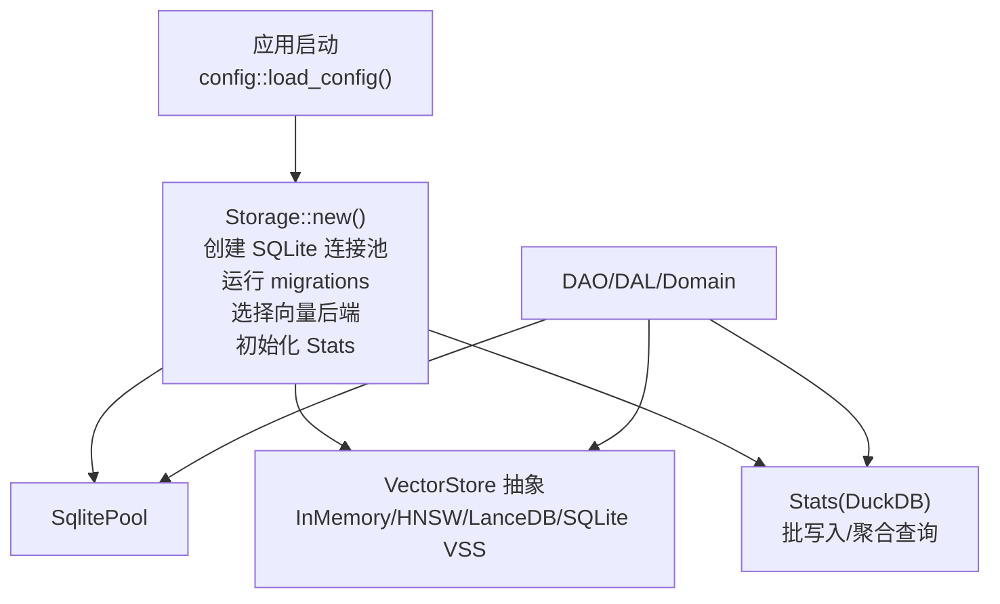
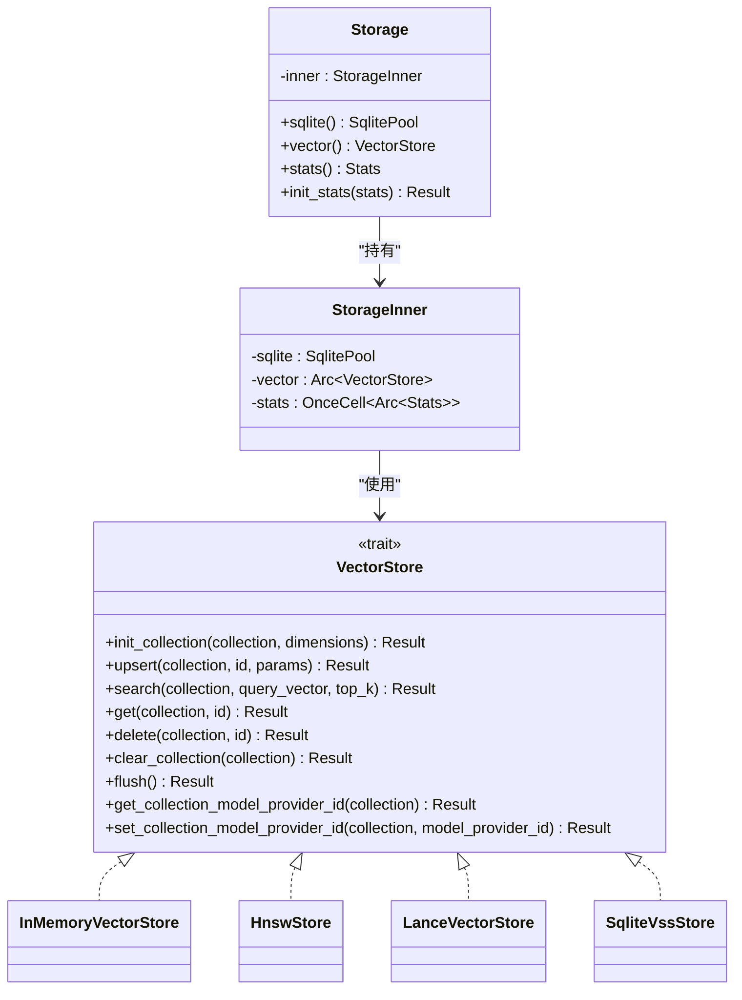
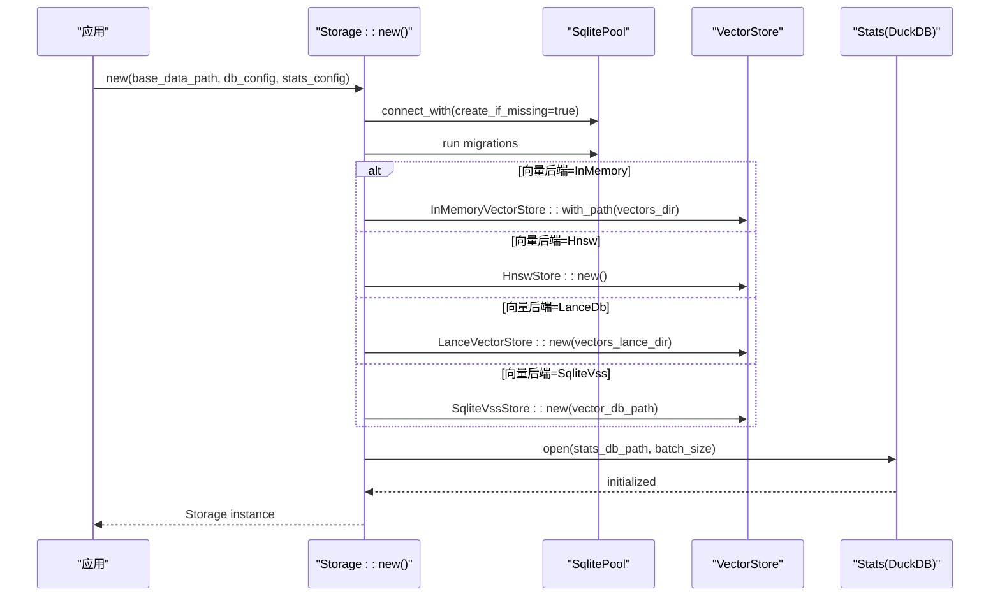
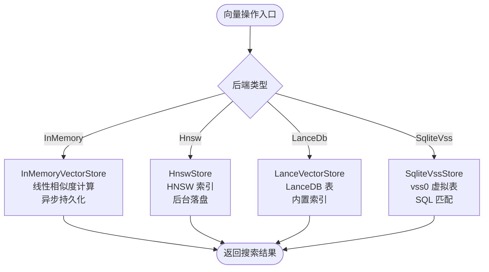
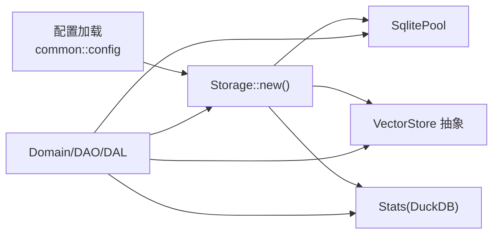

# 存储架构设计

<cite>
**本文引用的文件**
- [src/pkg/storage/mod.rs](src/pkg/storage/mod.rs)
- [src/pkg/storage/vector.rs](src/pkg/storage/vector.rs)
- [src/pkg/storage/hnsw.rs](src/pkg/storage/hnsw.rs)
- [src/pkg/storage/lance.rs](src/pkg/storage/lance.rs)
- [src/pkg/storage/mem_vector.rs](src/pkg/storage/mem_vector.rs)
- [src/config.rs](src/config.rs)
- [common/src/config.rs](common/src/config.rs)
- [migrations/20260505000000_vector_metadata.sql](migrations/20260505000000_vector_metadata.sql)
- [src/pkg/storage/test_support.rs](src/pkg/storage/test_support.rs)
</cite>

### 本文关联的三类文档（四类互引闭环）

**① 设计文档（Design）**：
- [SQLite + SQLx 0.8 存储工程规范](docs/design/sqlx_guide.md) — SQLite STRICT 表模式 + 枚举类型安全映射 + FTS5 全文检索 + .sqlx 离线构建

**② 落地计划（Plan）**：
- [Query 接口分页与 List 接口简化重构](docs/plan/Query接口分页与List接口简化重构.md) — push_query_filters 抽取 + COUNT/LIST WHERE 复用 + 软删除 status!=0 过滤

**④ RAG 原子知识卡**：
- [SQLite + SQLx 0.8 存储工程规范：STRICT 表模式 + FTS5 全文检索 + 枚举 i32 类型安全 + .sqlx 离线构建 + sqlx::test 隔离](docs/wiki/knowledge/zh/SQLite%20+%20SQLx%200.8%20%E5%AD%98%E5%82%A8%E5%B7%A5%E7%A8%8B%E8%A7%84%E8%8C%83%EF%BC%9ASTRICT%20%E8%A1%A8%E6%A8%A1%E5%BC%8F%20+%20FTS5%20%E5%85%A8%E6%96%87%E6%A3%80%E7%B4%A2%20+%20%E6%9E%9A%E4%B8%BE%20i32%20%E7%B1%BB%E5%9E%8B%E5%AE%89%E5%85%A8%20+%20.sqlx%20%E7%A6%BB%E7%BA%BF%E6%9E%84%E5%BB%BA%20+%20sqlx%3A%3Atest%20%E9%9A%94%E7%A6%BB/SQLite%20+%20SQLx%200.8%20%E5%AD%98%E5%82%A8%E5%B7%A5%E7%A8%8B%E8%A7%84%E8%8C%83%EF%BC%9ASTRICT%20%E8%A1%A8%E6%A8%A1%E5%BC%8F%20+%20FTS5%20%E5%85%A8%E6%96%87%E6%A3%80%E7%B4%A2%20+%20%E6%9E%9A%E4%B8%BE%20i32%20%E7%B1%BB%E5%9E%8B%E5%AE%89%E5%85%A8%20+%20.sqlx%20%E7%A6%BB%E7%BA%BF%E6%9E%84%E5%BB%BA%20+%20sqlx%3A%3Atest%20%E9%9A%94%E7%A6%BB.md) — SQLite STRICT + DuckDB 双层存储架构 + 枚举五件套约定 + 10 条硬约束红线

## 目录
1. [简介](#简介)
2. [项目结构](#项目结构)
3. [核心组件](#核心组件)
4. [架构总览](#架构总览)
5. [详细组件分析](#详细组件分析)
6. [依赖关系分析](#依赖关系分析)
7. [性能考量](#性能考量)
8. [故障排查指南](#故障排查指南)
9. [结论](#结论)
10. [附录](#附录)

## 简介
本文件系统化阐述 AI Orz 的存储层设计与实现，重点包括：
- Storage 门面模式的设计理念与实现方式
- 存储抽象层如何统一不同存储后端（SQLite、向量存储多后端、统计系统）
- 存储初始化流程、配置管理与依赖注入模式
- 存储迁移策略、数据备份恢复机制与测试支持功能
- 存储选型指南、性能基准测试方法与容量规划建议
- 存储层的可扩展性设计与未来演进方向

## 项目结构
存储相关代码集中在 src/pkg/storage 模块，提供统一的 Storage 门面与多种向量存储后端；数据库连接池、迁移与统计系统集成在 Storage::new 中完成；配置由 common/src/config.rs 定义并通过应用配置加载。

图表来源
- [src/pkg/storage/mod.rs:56-122](src/pkg/storage/mod.rs#L56-L122)
- [common/src/config.rs:78-114](common/src/config.rs#L78-L114)

章节来源
- [src/pkg/storage/mod.rs:1-212](src/pkg/storage/mod.rs#L1-L212)
- [common/src/config.rs:78-114](common/src/config.rs#L78-L114)

## 核心组件
- Storage 门面：封装 SQLite 连接池、向量存储后端与统计系统，提供可克隆、线程安全的访问接口，并支持全局单例用于无上下文场景。
- VectorStore 抽象：定义统一的向量存储接口，支持 SqliteVssStore、HnswStore、LanceVectorStore、InMemoryVectorStore 等多种实现。
- 配置管理：DatabaseConfig 指定 SQLite 文件名、向量数据库文件名、向量存储类型与 HNSW 索引目录；StatsConfig 控制 DuckDB 统计库路径与批大小。
- 迁移与初始化：通过 sqlx::migrate! 自动执行 migrations 目录下的 SQL 脚本，确保表结构与版本一致。
- 测试支持：提供内存数据库与临时目录的测试构造器，隔离生产环境状态。

章节来源
- [src/pkg/storage/mod.rs:36-179](src/pkg/storage/mod.rs#L36-L179)
- [src/pkg/storage/vector.rs:18-74](src/pkg/storage/vector.rs#L18-L74)
- [common/src/config.rs:78-126](common/src/config.rs#L78-L126)
- [src/pkg/storage/test_support.rs:10-48](src/pkg/storage/test_support.rs#L10-L48)

## 架构总览
Storage 门面采用“门面 + 抽象”的组合：对外暴露简洁 API，内部通过 Arc<dyn VectorStore> 切换具体后端；SQLite 连接池负责结构化数据持久化，向量存储负责语义检索，Stats 负责指标采集与分析。

图表来源
- [src/pkg/storage/mod.rs:36-179](src/pkg/storage/mod.rs#L36-L179)
- [src/pkg/storage/vector.rs:18-74](src/pkg/storage/vector.rs#L18-L74)

章节来源
- [src/pkg/storage/mod.rs:36-179](src/pkg/storage/mod.rs#L36-L179)
- [src/pkg/storage/vector.rs:18-74](src/pkg/storage/vector.rs#L18-L74)

## 详细组件分析

### Storage 门面与初始化流程
- 连接池创建：基于 SqliteConnectOptions 创建连接池，设置最大连接数以适配 SQLite 写并发限制。
- 迁移执行：调用 sqlx::migrate!("./migrations") 自动运行所有迁移脚本，确保数据库结构正确。
- 向量后端选择：根据 DatabaseConfig.vector_store_type 动态选择 InMemory、Hnsw、LanceDB 或 SQLite VSS。
- 统计系统初始化：打开 DuckDB 统计库，设置批大小，初始化默认统计结构，并注册为全局 Stats。
- 全局单例：提供 init/get 方法用于无上下文场景（如 AOP 消费者）。

图表来源
- [src/pkg/storage/mod.rs:56-122](src/pkg/storage/mod.rs#L56-L122)

章节来源
- [src/pkg/storage/mod.rs:56-122](src/pkg/storage/mod.rs#L56-L122)

### 向量存储抽象与多后端实现
- VectorStore Trait：定义集合初始化、插入/更新、搜索、获取、删除、清空、刷新、模型提供者 ID 管理等统一接口。
- InMemoryVectorStore：纯 Rust 实现，零系统依赖，懒加载持久化到 .bin 文件，适合测试与轻量场景。
- HnswStore：基于 instant-distance 的 HNSW 索引，支持余弦距离搜索，后台定时落盘与 Drop 兜底，冷启动加载已有索引。
- LanceVectorStore：基于 LanceDB 的高性能嵌入式向量数据库，内置 HNSW 索引，支持元数据过滤与跨平台稳定运行。
- SqliteVssStore：基于 SQLite vss0 扩展，利用虚拟表进行向量相似性搜索，需要系统依赖。

图表来源
- [src/pkg/storage/vector.rs:18-74](src/pkg/storage/vector.rs#L18-L74)
- [src/pkg/storage/mem_vector.rs:119-276](src/pkg/storage/mem_vector.rs#L119-L276)
- [src/pkg/storage/hnsw.rs:432-617](src/pkg/storage/hnsw.rs#L432-L617)
- [src/pkg/storage/lance.rs:126-365](src/pkg/storage/lance.rs#L126-L365)
- [src/pkg/storage/vector.rs:76-291](src/pkg/storage/vector.rs#L76-L291)

章节来源
- [src/pkg/storage/vector.rs:18-74](src/pkg/storage/vector.rs#L18-L74)
- [src/pkg/storage/mem_vector.rs:119-276](src/pkg/storage/mem_vector.rs#L119-L276)
- [src/pkg/storage/hnsw.rs:432-617](src/pkg/storage/hnsw.rs#L432-L617)
- [src/pkg/storage/lance.rs:126-365](src/pkg/storage/lance.rs#L126-L365)
- [src/pkg/storage/vector.rs:76-291](src/pkg/storage/vector.rs#L76-L291)

### 配置管理与依赖注入
- 配置加载：应用启动时加载 ai_orz.toml，若不存在则从嵌入的默认配置生成；环境变量可覆盖基础数据路径。
- 存储配置：DatabaseConfig 包含 SQLite 文件名、向量数据库文件名、向量存储类型与 HNSW 索引目录；StatsConfig 包含 DuckDB 文件名与批大小。
- 依赖注入：Storage::new 接收配置片段，内部组装 SQLite 连接池、向量后端与 Stats；DAO/DAL/Domain 通过 ctx 传递 Storage 引用，避免全局耦合。

章节来源
- [src/config.rs:26-78](src/config.rs#L26-L78)
- [common/src/config.rs:78-126](common/src/config.rs#L78-L126)
- [src/pkg/storage/mod.rs:56-122](src/pkg/storage/mod.rs#L56-L122)

### 存储迁移策略
- 迁移脚本：migrations 目录下按时间戳命名 SQL 脚本，sqlx::migrate! 自动执行，保证数据库结构一致性。
- 向量元数据：vector_metadata 表记录 collection、source_id、content_hash、model、dimensions、expire_at 等，支持过期清理与重索引判断。
- 幂等性：迁移脚本使用 CREATE TABLE IF NOT EXISTS 与索引创建，确保多次运行安全。

章节来源
- [migrations/20260505000000_vector_metadata.sql:1-16](migrations/20260505000000_vector_metadata.sql#L1-L16)
- [src/pkg/storage/mod.rs:72-76](src/pkg/storage/mod.rs#L72-L76)

### 数据备份恢复机制
- SQLite 备份：直接复制 ai_orz.db 文件即可备份结构化数据；建议使用 WAL 模式提升备份一致性（需结合业务事务边界）。
- 向量数据备份：
  - InMemoryVectorStore：备份 vectors/*.bin 文件。
  - HnswStore：备份 hnsw_index/*.bincode 与 collections_meta.bincode。
  - LanceVectorStore：备份 vectors_lance/* 目录。
  - SqliteVssStore：备份 ai_orz_vector.db 文件。
- 恢复流程：停止服务 → 替换备份文件 → 重启服务 → 验证迁移与索引完整性。

章节来源
- [src/pkg/storage/mod.rs:78-93](src/pkg/storage/mod.rs#L78-L93)
- [src/pkg/storage/hnsw.rs:150-157](src/pkg/storage/hnsw.rs#L150-L157)
- [src/pkg/storage/lance.rs:1-8](src/pkg/storage/lance.rs#L1-L8)
- [src/pkg/storage/mem_vector.rs:51-80](src/pkg/storage/mem_vector.rs#L51-L80)

### 测试支持功能
- 内存数据库：使用 sqlite::memory: 创建独立测试数据库，运行 migrations 后注入 Storage。
- 临时向量目录：为 InMemoryVectorStore 提供临时目录，避免污染生产数据。
- 测试构造器：create_test_storage 与 create_test_storage_with_stats 提供带/不带 Stats 的测试实例。

章节来源
- [src/pkg/storage/test_support.rs:10-48](src/pkg/storage/test_support.rs#L10-L48)

## 依赖关系分析
- Storage 依赖：
  - sqlx::sqlite::SqlitePool：结构化数据存储与查询。
  - VectorStore 抽象：解耦向量存储实现，支持运行时切换。
  - Stats：DuckDB 统计库，用于指标采集与分析。
- 配置依赖：
  - common::config::DatabaseConfig：决定向量后端类型与路径。
  - common::config::StatsConfig：决定统计库路径与批大小。
- DAO/DAL/Domain 依赖：
  - 通过 ctx 传递 Storage 引用，避免全局耦合。
  - 业务逻辑仅依赖 VectorStore 抽象，不感知具体实现。

图表来源
- [common/src/config.rs:78-126](common/src/config.rs#L78-L126)
- [src/pkg/storage/mod.rs:56-122](src/pkg/storage/mod.rs#L56-L122)

章节来源
- [common/src/config.rs:78-126](common/src/config.rs#L78-L126)
- [src/pkg/storage/mod.rs:56-122](src/pkg/storage/mod.rs#L56-L122)

## 性能考量
- SQLite 连接池：最大连接数设置为 5，适配 SQLite 写并发限制，避免锁竞争。
- 向量存储选择：
  - InMemoryVectorStore：适合小规模数据与测试，线性搜索 O(n)。
  - HnswStore：HNSW 索引近似最近邻搜索，适合大规模数据，后台落盘保障持久化。
  - LanceVectorStore：高性能嵌入式向量数据库，内置 HNSW 索引，适合生产级向量检索。
  - SqliteVssStore：依赖系统扩展，适合已有 SQLite VSS 环境的场景。
- 批处理：Stats 使用批写入减少 I/O 开销，提高统计采集性能。
- 索引重建：HnswStore 标记 dirty 并在搜索时按需重建，平衡内存与性能。

章节来源
- [src/pkg/storage/mod.rs:67-70](src/pkg/storage/mod.rs#L67-L70)
- [src/pkg/storage/hnsw.rs:432-617](src/pkg/storage/hnsw.rs#L432-L617)
- [src/pkg/storage/lance.rs:126-365](src/pkg/storage/lance.rs#L126-L365)
- [src/pkg/storage/mem_vector.rs:119-276](src/pkg/storage/mem_vector.rs#L119-L276)

## 故障排查指南
- 迁移失败：检查 migrations 目录权限与 SQL 语法错误；确认 SQLite 文件可写。
- 向量后端初始化失败：
  - SqliteVssStore：确认系统已安装 vss0 扩展；否则降级到内存或 HNSW。
  - HnswStore：检查 hnsw_index 目录权限与磁盘空间。
  - LanceVectorStore：检查 vectors_lance 目录权限与磁盘空间。
- 统计系统异常：确认 DuckDB 文件路径可写；检查批大小配置是否合理。
- 测试环境隔离：使用 test_support 提供的内存数据库与临时目录，避免污染生产数据。

章节来源
- [src/pkg/storage/mod.rs:72-93](src/pkg/storage/mod.rs#L72-L93)
- [src/pkg/storage/vector.rs:245-262](src/pkg/storage/vector.rs#L245-L262)
- [src/pkg/storage/hnsw.rs:190-219](src/pkg/storage/hnsw.rs#L190-L219)
- [src/pkg/storage/lance.rs:43-62](src/pkg/storage/lance.rs#L43-L62)
- [src/pkg/storage/test_support.rs:10-48](src/pkg/storage/test_support.rs#L10-L48)

## 结论
AI Orz 存储层通过 Storage 门面模式与 VectorStore 抽象实现了高度解耦与可扩展的设计。SQLite 连接池管理结构化数据，多种向量存储后端满足不同规模与性能需求，Stats 集成提供指标采集与分析能力。配置管理与依赖注入模式确保了系统的可维护性与可测试性。未来可通过新增 VectorStore 实现进一步扩展向量检索能力，或通过优化连接池与批处理参数提升整体性能。

## 附录

### 存储选型指南
- 小规模/测试：InMemoryVectorStore（零依赖，快速迭代）
- 中等规模/生产：HnswStore（纯 Rust，高性能，持久化）
- 大规模/生产：LanceVectorStore（嵌入式向量数据库，内置索引）
- 已有 SQLite VSS 环境：SqliteVssStore（利用现有扩展）

### 性能基准测试方法
- 向量检索延迟：对比不同后端在相同数据集上的 search(top_k) 延迟分布。
- 吞吐量：模拟高并发 upsert/search 操作，测量 QPS 与 P99 延迟。
- 资源占用：监控内存、CPU 与磁盘 I/O，评估不同后端的资源消耗。
- 持久化影响：评估 HnswStore 后台落盘对检索延迟的影响。

### 容量规划建议
- SQLite：根据业务实体数量估算文件大小，预留 20% 增长空间。
- 向量存储：
  - InMemoryVectorStore：受限于内存，适合小规模数据。
  - HnswStore：根据向量维度与数量估算 .bincode 文件大小。
  - LanceVectorStore：根据向量数量与元数据大小估算目录占用。
- 统计系统：根据指标采集频率与保留策略估算 DuckDB 文件大小。