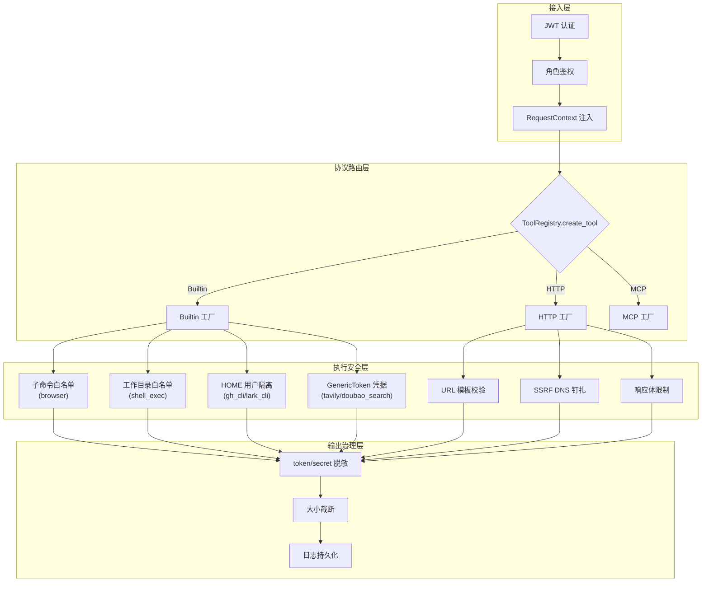
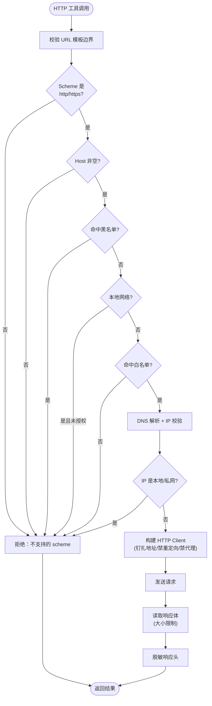
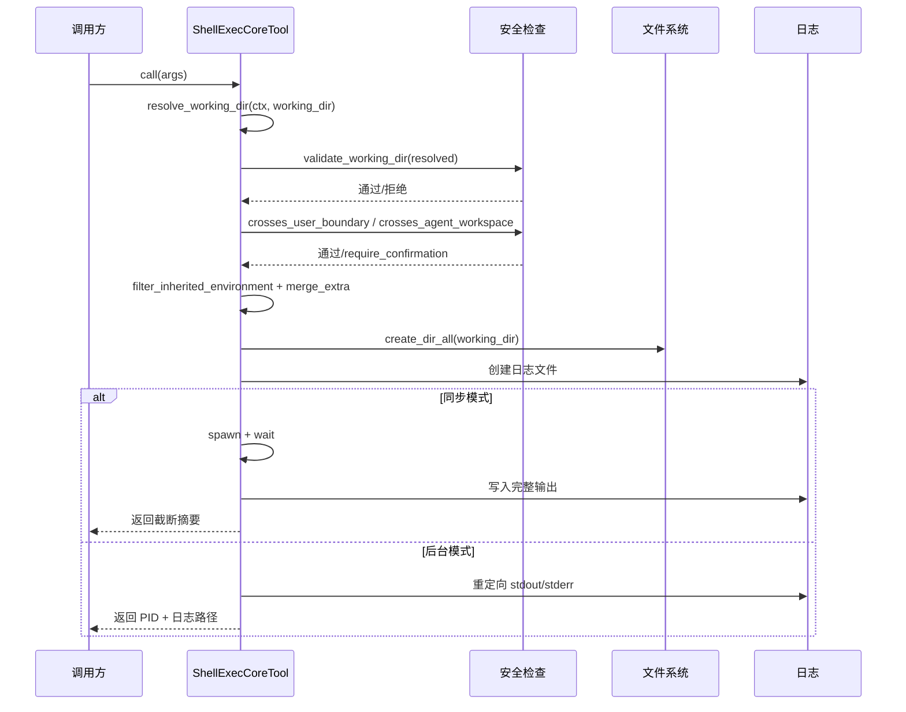
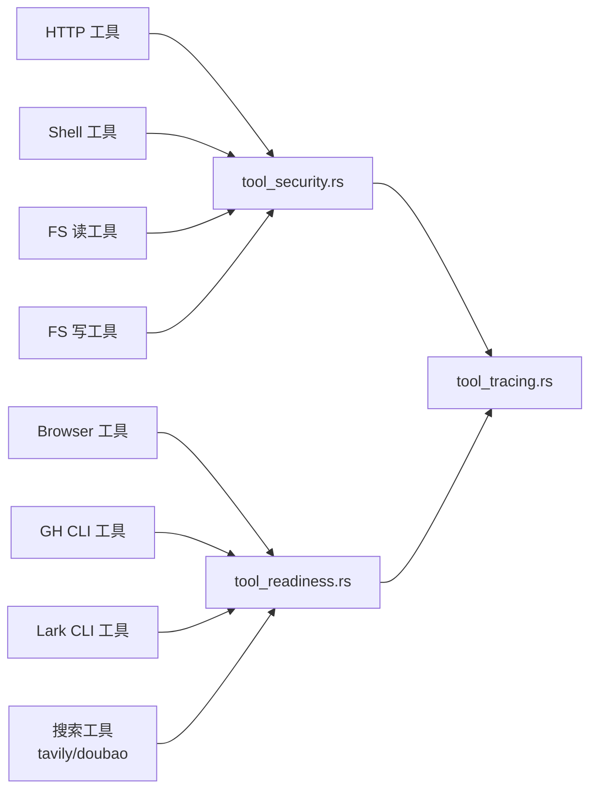

# 工具输出与安全治理

<cite>
**本文引用的文件**
- [tool_security.rs](src/pkg/tool_registry/tool_security.rs)
- [browser.rs](src/pkg/tool_registry/browser.rs)
- [shell_exec.rs](src/pkg/tool_registry/shell_exec.rs)
- [tavily_search.rs](src/pkg/tool_registry/tavily_search.rs)
- [doubao_search.rs](src/pkg/tool_registry/doubao_search.rs)
- [gh_cli.rs](src/pkg/tool_registry/gh_cli.rs)
- [lark_cli.rs](src/pkg/tool_registry/lark_cli.rs)
- [builtin.rs](src/pkg/tool_registry/builtin.rs)
- [tool_readiness.rs](src/pkg/tool_registry/tool_readiness.rs)
- [mod.rs](src/pkg/tool_registry/mod.rs)
- [check_deps.sh](scripts/check_deps.sh)
- [http.rs](src/pkg/tool_registry/http.rs)
- [common/src/redaction/mod.rs](common/src/redaction/mod.rs#L1-L71)
- [common/src/redaction/engine.rs](common/src/redaction/engine.rs#L129-L260)
- [common/src/redaction/rule.rs](common/src/redaction/rule.rs#L49-L171)
- [common/src/redaction/redact.rs](common/src/redaction/redact.rs#L90-L116)
- [src/pkg/mod.rs#redaction](src/pkg/mod.rs#L18-L20)

### 本文关联的三类文档

**① 设计文档（Design）**：
- docs/design/web_search_and_browser_tools_design.md — 浏览器工具与网络搜索工具设计（决策 6/7/11）
- docs/design/runtime_design.md — runtime 三接口工具化复用工具安全控制系统

**② 落地计划（Plan）**：
- docs/plan/浏览器工具与环境就绪提示.md — 浏览器工具与就绪提示落地计划

**③ RAG 原子知识卡**：
- [工具系统三层调用架构：CoreTool trait + Builtin HTTP MCP 三协议路由](docs/wiki/knowledge/zh/工具系统三层调用架构/工具系统三层调用架构.md) — Level3 兄弟卡：工具系统架构骨架
- [工具输出与安全治理](docs/wiki/knowledge/zh/工具输出与安全治理/工具输出与安全治理.md) — 本文对应 RAG 知识卡
- [脱敏引擎下沉 common：fail-closed + ValueRule + 边界统一 + 闭环脱敏](docs/wiki/knowledge/zh/脱敏引擎下沉 common：fail-closed + ValueRule + 边界统一 + 闭环脱敏/脱敏引擎下沉 common：fail-closed + ValueRule + 边界统一 + 闭环脱敏.md) — Level2 新卡：common::redaction 脱敏引擎完整体系
- [Doctor 依赖预检](docs/wiki/knowledge/zh/Doctor%20依赖预检/Doctor%20依赖预检.md) — Level5 卡：工具链依赖预检

**④ 关联 Wiki 长文**：
- [工具安全控制](docs/wiki/zh/content/基础设施/工具注册表/工具安全控制.md) — 基础设施层级的工具安全总览
- [本地文件安全与工作区隔离](docs/wiki/zh/content/基础设施/存储系统/本地文件安全与工作区隔离.md) — 存储层级的路径安全与工作区隔离
</cite>

## 更新摘要
**2026-09-04 更新**：脱敏引擎从 pkg/redaction 下沉到 `common/src/redaction/` 成为前后端共享单一事实源；新增 5 文件分层（rule.rs 规则注册表 + mask.rs 脱敏样式 + policy.rs 场景策略 + engine.rs JSON 遍历+AC 预检文本扫描 + redact.rs `redact!` 宏 autoref specialization 类型分派）；新增 `ValueRule` 值形态识别层（裸 sk-/ghp_/eyJ 前缀凭证兜底）；fail-closed 返回 Result + 命令参数内明文凭证闭环脱敏；系统内部保持原文不动、对外接口按需 `redact!` 的边界决策确立。

**2026-08-19 初始版本**：首次创建，覆盖 HTTP/Builtin/MCP 三协议的安全边界设计、工具输出过滤与脱敏、路径逃逸检查、SSRF 防护、环境变量白名单等核心机制。
**2026-08-24 更新**：新增豆包搜索工具安全说明；Tavily 搜索凭据机制迁移至 GenericToken + platform 二元匹配；统一搜索工具的凭据解析链路；更新就绪探测注册表与故障排查指引。

## 目录
1. [简介](#简介)
2. [项目结构](#项目结构)
3. [核心组件](#核心组件)
4. [架构总览](#架构总览)
5. [详细组件分析](#详细组件分析)
6. [依赖关系分析](#依赖关系分析)
7. [性能与资源限制](#性能与资源限制)
8. [常见故障排查](#常见故障排查)
9. [最佳实践](#最佳实践)
10. [附录：安全配置参考](#附录安全配置参考)

## 简介

本文聚焦 AI Orz 工具系统的**安全边界与输出治理**，围绕「协议层防护 → 执行层隔离 → 输出层脱敏」三层防线展开。核心设计理念为：

- **协议层防护**：HTTP 协议在 URL 模板、域名白/黑名单、SSRF 防护、响应体大小限制等维度建立硬约束
- **执行层隔离**：Builtin 协议在工作目录、环境变量、HOME 隔离、身份边界等维度实现最小权限
- **输出层脱敏**：所有工具的输出在返回给 LLM 之前必须经过 token/secret 脱敏、大小截断、敏感信息过滤三道关卡

工具安全治理的目标不是"绝对安全"，而是"可审计的最小权限"——每一次工具调用都有明确的安全边界、可追溯的日志记录和可配置的白名单策略。

章节来源
- [tool_security.rs:1-653](src/pkg/tool_registry/tool_security.rs#L1-L653)
- [browser.rs:1-529](src/pkg/tool_registry/browser.rs#L1-L529)
- [shell_exec.rs:1-546](src/pkg/tool_registry/shell_exec.rs#L1-L546)
- [gh_cli.rs:1-559](src/pkg/tool_registry/gh_cli.rs#L1-L559)
- [lark_cli.rs:1-478](src/pkg/tool_registry/lark_cli.rs#L1-L478)
- [doubao_search.rs](src/pkg/tool_registry/doubao_search.rs)

## 项目结构

工具安全治理的代码分布在三个层级：

```
src/
├── pkg/
│   ├── tool_registry/
│   │   ├── tool_security.rs      ← 统一安全库（HTTP/FS/脱敏）
│   │   ├── tool_readiness.rs     ← 就绪探测 + 安全引导
│   │   ├── mod.rs                ← 协议路由分发
│   │   ├── builtin.rs            ← Builtin 工厂集合
│   │   ├── browser.rs            ← Browser 工具安全
│   │   ├── shell_exec.rs         ← Shell 工具安全
│   │   ├── gh_cli.rs             ← GH CLI 安全
│   │   ├── lark_cli.rs           ← Lark CLI 安全
│   │   ├── tavily_search.rs      ← Tavily 搜索安全（GenericToken + platform）
│   │   ├── doubao_search.rs      ← 豆包搜索安全（GenericToken + platform）
│   │   ├── http.rs               ← HTTP 协议安全
│   │   └── mcp.rs                ← MCP 协议（stub）
│   └── tool_tracing/
│       ├── entry.rs              ← 调用入口追踪
│       └── logger.rs             ← 日志持久化
├── consumer/
│   ├── tool_exec_log_consumer.rs ← 日志消费
│   └── tool_exec_stats_consumer.rs ← 统计消费
└── middleware/
    ├── jwt_auth.rs               ← 认证中间件
    ├── require_role.rs           ← 鉴权中间件
    └── request_context.rs        ← 上下文中间件
```

章节来源
- [mod.rs:1-137](src/pkg/tool_registry/mod.rs#L1-L137)
- [tool_security.rs:1-653](src/pkg/tool_registry/tool_security.rs#L1-L653)

## 核心组件

### 统一安全库（tool_security.rs）

跨协议复用的安全工具集：

| 功能 | 函数 | 说明 |
|---|---|---|
| SSRF 防护 | `is_local_network_host()` / `is_local_network_ip()` | 覆盖 IPv4/IPv6 全量私有地址段 |
| URL 模板校验 | `validate_url_template_boundary()` | scheme + authority 固定，禁止模板占位符 |
| 域名匹配 | `domain_matches()` | 支持精确域名和子域名通配 |
| DNS 钉扎 | `validate_resolved_addresses()` | DNS 解析后 IP 二次校验 |
| 响应体限制 | `read_limited_response_body()` | 流式读取 + 硬上限拦截 |
| 敏感头脱敏 | `sanitize_response_headers()` | Authorization/Cookie/token 等替换为 `[REDACTED]` |
| 路径安全 | `resolve_and_validate_path()` | 规范化 → 符号链接拒绝 → 白名单范围 |
| 敏感文件检测 | `is_sensitive_filename()` | .env/.pem/.key/id_rsa 等硬拦截 |
| 用户边界 | `crosses_user_boundary()` | 跨用户树访问检测 |
| Agent 边界 | `crosses_agent_workspace()` | 跨 Agent 工作区检测 |

### 就绪探测体系（tool_readiness.rs）

三层就绪提示架构：

- **`ToolReadinessProbe` trait**：统一探测器接口，支持 `user_scoped()` 区分缓存策略
- **CLI 型探测器**：`BrowserCliProbe`、`FixedCliProbe`（lark_cli/gh_cli）
- **Key 型探测器**：`TavilyKeyProbe`（双轨授权：共享 config + 用户凭证库）
- **TTL 缓存**：30 秒窗口，CLI 型按 tool_id 缓存，key 型按 `(tool_id, user_id)` 缓存
- **结构化引导**：`cli_not_installed_json()` / `api_key_missing_json()` 统一格式

### 协议层安全

- **HTTP 协议**：URL 模板校验 → SSRF DNS 钉扎 → 响应大小限制 → 敏感头脱敏
- **Builtin 协议**：白名单 + 路径检查 + 环境变量过滤 + HOME 隔离 + 输出脱敏
- **MCP 协议**：配置驱动（Stage 2 待完善）

章节来源
- [tool_security.rs:1-653](src/pkg/tool_registry/tool_security.rs#L1-L653)
- [tool_readiness.rs:1-429](src/pkg/tool_registry/tool_readiness.rs#L1-L429)

## 架构总览



章节来源
- [mod.rs:90-108](src/pkg/tool_registry/mod.rs#L90-L108)
- [tool_security.rs:92-170](src/pkg/tool_registry/tool_security.rs#L92-L170)

## 详细组件分析

### HTTP 协议安全控制

#### URL 模板边界校验

`validate_url_template_boundary()` 强制执行三条规则：

1. Scheme 必须为 `http` 或 `https`，且不包含 `{{}}` 占位符
2. Authority（host:port）必须固定，不包含 `{{}}` 占位符
3. URL 不得包含 `@` 符号（禁止 userinfo credentials）

路径和查询串部分允许 `{{args.key}}` 格式占位符，由 `validate_supported_placeholders()` 校验。

#### SSRF 防护流程

```
validate_target_url()
  → 1. Scheme 白名单（http/https）
  → 2. Host 非空检查
  → 3. 黑名单域名匹配 → 拒绝
  → 4. 本地网络检查（allow_local_network?）
  → 5. 白名单域名匹配
  → 6. DNS 解析 + IP 二次校验
  → 7. 返回钉扎的 SocketAddr 列表
```

`is_local_network_ip()` 覆盖范围：
- IPv4：loopback/private/link-local/broadcast/unspecified/100.64.0.0/10/192.0.2.0/24/192.168.0.0/16/198.18.0.0/15/198.51.100.0/24/203.0.113.0/24/multicast
- IPv6：loopback/unspecified/IPv4-mapped/NAT64/Teredo/6to4/link-local/site-local/unique-local/2001:db8

#### 响应体与头安全

- `read_limited_response_body()`：先检查 `content-length`，再流式读取中累计超限即拒绝
- `sanitize_response_headers()`：遍历所有头，敏感名（authorization/cookie/set-cookie/api-key/token/secret/password）的 value 替换为 `[REDACTED]`



章节来源
- [tool_security.rs:92-170](src/pkg/tool_registry/tool_security.rs#L92-L170)
- [tool_security.rs:200-231](src/pkg/tool_registry/tool_security.rs#L200-L231)
- [tool_security.rs:233-312](src/pkg/tool_registry/tool_security.rs#L233-L312)

### Shell Exec 安全控制

#### 工作目录白名单

```rust
fn validate_working_dir(&self, resolved: &Path) -> bool {
    let base = get().base_data_path();
    if resolved.starts_with(base) { return true; }
    self.config.additional_allowed_paths()
        .iter().any(|p| resolved.starts_with(Path::new(p)))
}
```

#### 用户/Agent 身份边界

- `crosses_user_boundary()`：目标位于 `{base}/users/{X}` 且 `X != current_user_id` 时视为越界
- `crosses_agent_workspace()`：目标位于 `{base}/agents/{other}` 或 `{base}/users/{any}/agents/{other}` 时视为越界（仅 Agent 调用场景）

#### 环境变量过滤

`filter_inherited_environment()` 白名单机制：
1. 仅透传 `ShellExecConfig.allowed_env` 中的变量
2. 即使在白名单中，仍过滤敏感变量名（home/user/password/token/secret/api_key/aws_access_key_id 等）
3. 支持通过 `params.env` 合并额外环境变量

#### 输出与日志

- stdout/stderr 重定向到按日分区的日志文件 `{base}/tools/shell_exec/logs/{YYYYMMDD}/{call_id}.log`
- 默认最大输出 10MB，超限截断返回摘要 + 完整日志路径
- 同步模式：`wait()` 等待完成；后台模式：立即返回 PID + 日志路径
- 超时处理：`detach`（默认，返回进程句柄供后续查询）或 `kill`（强制终止）



章节来源
- [shell_exec.rs:185-222](src/pkg/tool_registry/shell_exec.rs#L185-L222)
- [shell_exec.rs:223-267](src/pkg/tool_registry/shell_exec.rs#L223-L267)
- [shell_exec.rs:270-528](src/pkg/tool_registry/shell_exec.rs#L270-L528)
- [tool_security.rs:315-574](src/pkg/tool_registry/tool_security.rs#L315-L574)

### Browser 安全控制

#### 子命令白名单

仅开放 22 个原子操作子命令：

| 分类 | 命令 |
|---|---|
| 导航 | open, back, forward, reload |
| 阅读 | read, snapshot, get |
| 交互 | click, dblclick, fill, type, press, hover, select, check, uncheck, scroll |
| 等待/取证 | wait, screenshot, close |

**明确排除**：eval, batch, chat, connect, cookies, storage, upload, network, set, stream, keyboard

#### 安全机制

- **会话隔离**：`--session ai-orz-agent-{agent_id}`，Agent 间页面状态互不干扰
- **spawn 不经 shell**：argv 直拼，无注入面
- **截图产物存储**：经 `ScreenshotStorer` trait 落统一产物存储，返回 `{artifact_id, name}` 引用
- **close --all 拒绝**：会终止所有 Agent 会话，硬拒绝
- **截图路径禁止 Agent 指定**：系统自动生成临时路径，禁止任意写入

章节来源
- [browser.rs:41-66](src/pkg/tool_registry/browser.rs#L41-L66)
- [browser.rs:176-208](src/pkg/tool_registry/browser.rs#L176-L208)
- [browser.rs:209-369](src/pkg/tool_registry/browser.rs#L209-L369)

### GH CLI 安全控制

#### HOME 用户隔离

```rust
pub fn gh_home(base_data_path: &Path, user_id: &str) -> PathBuf {
    crate::pkg::paths::user_home(base_data_path, user_id)
}
```

gh 配置落在 `{home}/.config/gh/`，按用户独立。

#### Token 脱敏输出

`sanitize_gh_output()` 按行过滤：
- GitHub token 前缀：`gho_`, `ghu_`, `ghs_`, `ghr_`, `ghp_`
- 敏感关键字：`token`, `authorization`, `secret`, `password`
- 命中行整行替换为 `[REDACTED]`

#### 首次幂等登录

```
ensure_gh_auth(home_dir, token)
  → marker 记录 token SHA256 指纹（前 16 位）
  → 指纹一致 → 跳过
  → 指纹变更 → gh auth login --with-token（token 走 stdin）
              → gh auth setup-git（git 复用凭证）
              → 写入新 marker
```

章节来源
- [gh_cli.rs:178-262](src/pkg/tool_registry/gh_cli.rs#L178-L262)
- [gh_cli.rs:337-476](src/pkg/tool_registry/gh_cli.rs#L337-L476)

### Lark CLI 安全控制

#### 凭证脱敏输出

`sanitize_lark_output()` 按行过滤：
- `access_token`, `app_secret`, `secret_key`, `tenant_token`, `authorization`
- 命中行整行替换为 `[REDACTED]`

#### 幂等 config 写入

```
ensure_cli_config(home_dir, app_id, app_secret)
  → config.json 已存在 → 跳过
  → 不存在 → lark-cli config init --app-secret-stdin
              （secret 走 stdin，避免进程参数泄露）
```

#### 身份模式对齐

`ensure_default_as(home_dir, mode)`：幂等设置 `config default-as <mode>`，marker 记录当前模式。

章节来源
- [lark_cli.rs:181-238](src/pkg/tool_registry/lark_cli.rs#L181-L238)
- [lark_cli.rs:253-405](src/pkg/tool_registry/lark_cli.rs#L253-L405)

### 搜索工具安全控制

#### 统一凭据机制（GenericToken + platform）

Tavily 和豆包搜索统一使用 `GenericToken` 凭据类型，通过 `platform` 字段区分不同平台：

```
resolve_api_key(ctx)
  → 1. 用户凭证库（按 kind=GenericToken + platform 匹配）→ 命中 → UserCredential
  → 2. 皆缺 → api_key_missing 结构化引导（提示配置通用令牌 + 选对应 platform）
```

#### Tavily Search

- `platform = "tavily"` 标识 Tavily 搜索凭据
- snippet 上限 1000 字符，超限截断并标记 `truncated: true`
- `max_results` 限制 1-10，超限钳制
- 返回 `key_source` 标记授权来源

#### 豆包搜索（Doubao Search）

- `platform = "doubao_search"` 标识豆包搜索凭据
- 支持 web / web_summary / image 三种搜索类型
- snippet 截断：单条摘要上限 1000 字符
- time_range 支持：day / week / month / one_year / no_limit
- SSE 流式响应解析

章节来源
- [tavily_search.rs:47-52](src/pkg/tool_registry/tavily_search.rs#L47-L52)（GenericToken 凭据需求）
- [tavily_search.rs:190-319](src/pkg/tool_registry/tavily_search.rs#L190-L319)
- [doubao_search.rs](src/pkg/tool_registry/doubao_search.rs)（豆包搜索工具实现）
- [identity_credentials.rs](common/src/models/identity_credentials.rs)（GenericToken + platform 校验）

### 文件系统安全控制

#### 路径校验流程

```
resolve_and_validate_path(base_path, user_path, additional_allowed_paths)
  → 1. 敏感文件名检查 → 命中 → 硬拒绝
  → 2. 计算绝对路径（绝对路径直接用，相对路径拼接 base）
  → 3. canonicalize（解析 .. 和 symlinks）
  → 4. 白名单范围检查
     ├─ 命中 base_path → Valid
     ├─ 命中 additional_allowed_paths → Valid
     └─ 均不命中 → NeedConfirmation（需用户确认）
  → 5. 符号链接检查 → 命中 → 硬拒绝
```

#### 用户/Agent 边界检查

- `crosses_user_boundary()`：`{base}/users/{X}` 且 `X != user_id` → 越界
- `crosses_agent_workspace()`：检测跨 Agent 工作区访问（Agent 调用场景）

#### IO 错误脱敏

`sanitize_error()`：移除绝对路径前缀，仅保留文件名，防止路径信息泄露。

章节来源
- [tool_security.rs:335-419](src/pkg/tool_registry/tool_security.rs#L335-L419)
- [tool_security.rs:421-474](src/pkg/tool_registry/tool_security.rs#L421-L474)
- [tool_security.rs:496-573](src/pkg/tool_registry/tool_security.rs#L496-L573)

### 就绪探测体系

#### 探测器架构

```
ToolReadinessProbe trait
  ├── user_scoped() → false (CLI 型按 tool_id 缓存)
  │                   → true (key 型按 tool_id|user_id 缓存)
  └── probe(ctx) → RuntimeReady

ProbeRegistry: HashMap<String, Arc<dyn ToolReadinessProbe>>
Cache: HashMap<String, (RuntimeReady, Instant)> (TTL = 30s)
```

#### 注册的探测器

| tool_id | 类型 | 实现 |
|---|---|---|
| browser | CLI | `BrowserCliProbe`（取 config `[browser].command`） |
| lark_cli | CLI | `FixedCliProbe`（固定命令名 `lark-cli`） |
| gh_cli | CLI | `FixedCliProbe`（固定命令名 `gh`） |
| tavily_search | key | `GenericTokenKeyProbe`（GenericToken + platform="tavily"） |
| doubao_search | key | `GenericTokenKeyProbe`（GenericToken + platform="doubao_search"） |

#### 结构化引导

```json
// CLI 未安装
{
  "success": false,
  "error_code": "cli_not_installed",
  "error": "未找到 {bin} 二进制",
  "install": "brew install ...",
  "hint": "或在 ai_orz.toml 配置绝对路径"
}

// API key 缺失
{
  "success": false,
  "error_code": "api_key_missing",
  "error": "未找到可用的 Tavily API key",
  "guidance": "绑定个人 key 或配置共享 key"
}
```

章节来源
- [tool_readiness.rs:33-54](src/pkg/tool_registry/tool_readiness.rs#L33-L54)
- [tool_readiness.rs:65-84](src/pkg/tool_registry/tool_readiness.rs#L65-L84)
- [tool_readiness.rs:125-176](src/pkg/tool_registry/tool_readiness.rs#L125-L176)
- [tool_readiness.rs:215-233](src/pkg/tool_registry/tool_readiness.rs#L215-L233)

## 依赖关系分析

### 安全库依赖

```
tool_security.rs
  ├── HTTP 协议工具 (http.rs) ← URL 校验/SSRF/响应限制/头脱敏
  ├── Shell 工具 (shell_exec.rs) ← FS 安全（路径/边界）
  ├── FS 读工具 (fs_read.rs) ← FS 安全（路径/敏感文件）
  └── FS 写工具 (fs_write.rs) ← FS 安全（路径/符号链接）
```

### 就绪探测依赖

```
tool_readiness.rs
  ├── browser.rs ← 复用 command_available() + cli_not_installed_json()
  ├── gh_cli.rs ← 复用 command_available() + cli_not_installed_json()
  ├── lark_cli.rs ← 复用 command_available() + cli_not_installed_json()
  └── {tavily_search, doubao_search}.rs ← 复用 api_key_missing_json() + GenericToken 引导
```

### 工具间安全依赖



章节来源
- [tool_security.rs:1-653](src/pkg/tool_registry/tool_security.rs#L1-L653)
- [tool_readiness.rs:1-429](src/pkg/tool_registry/tool_readiness.rs#L1-L429)

## 性能与资源限制

### 默认超时配置

| 工具 | 默认超时 | 硬上限 |
|---|---|---|
| browser | 60s (config) | 可配置 |
| shell_exec | 5 min | 可配置 |
| gh_cli | 60s | 可配置 |
| lark_cli | 60s | 可配置 |
| tavily_search | config `timeout_ms` | 可配置 |
| doubao_search | 30s | 可配置 |
| HTTP 工具 | 30s | 10 min |

### 默认输出大小限制

| 工具 | 默认上限 | 硬上限 |
|---|---|---|
| browser | config `max_output_bytes` | 可配置 |
| shell_exec | 10MB | 可配置 |
| gh_cli | 1MB | 可配置 |
| lark_cli | 1MB | 可配置 |
| tavily_search | 1MB | 可配置 |
| doubao_search | 1MB | 可配置 |
| HTTP 工具 | 1MB | 10MB |

### 就绪探测缓存

- TTL：30 秒
- CLI 型缓存键：`{tool_id}`（全局共享）
- Key 型缓存键：`{tool_id}|{user_id}`（按用户隔离）
- 缓存失效：配置变更或安装完成后调用 `invalidate_cache()`

### 日志文件管理

- 路径：`{base}/tools/{tool_id}/logs/{YYYYMMDD}/{call_id}.log`
- 分区：按日期（YYYYMMDD）
- 清理：按日期目录为单位清理

章节来源
- [tool_security.rs:8-15](src/pkg/tool_registry/tool_security.rs#L8-L15)
- [shell_exec.rs:51-72](src/pkg/tool_registry/shell_exec.rs#L51-L72)
- [gh_cli.rs:40-45](src/pkg/tool_registry/gh_cli.rs#L40-L45)

## 常见故障排查

### Troubleshooting 1：Shell 工具报 "Working directory not in allowed paths"

**排查步骤**：
1. 检查 `working_dir` 参数是否指向 `base_data_path` 或 `additional_allowed_paths` 下
2. 确认 `ShellExecConfig.additional_allowed_paths` 是否已配置
3. 如果路径在允许范围但仍报错，检查路径是否包含符号链接导致 canonicalize 后越界
4. 源码位置：[shell_exec.rs:186-197](src/pkg/tool_registry/shell_exec.rs#L186-L197)

### Troubleshooting 2：HTTP 工具报 "local network target requires allow_local_network=true"

**排查步骤**：
1. 确认目标 URL 的 host 是否为本地/私有网络地址
2. 如果确实需要访问本地网络，在 HTTP 工具配置中设置 `allow_local_network: true`
3. 注意：这会降低安全性，仅在内网部署场景下使用
4. 源码位置：[tool_security.rs:122-124](src/pkg/tool_registry/tool_security.rs#L122-L124)

### Troubleshooting 3：Browser 工具报 "子命令不在白名单内"

**排查步骤**：
1. 检查调用的子命令是否在 `ALLOWED_COMMANDS` 列表中
2. eval/batch/keyboard/cookies/storage 等脚本执行与状态泄露类命令一律拒绝
3. 如需新增子命令，必须评审安全风险后修改 `ALLOWED_COMMANDS`
4. 源码位置：[browser.rs:41-66](src/pkg/tool_registry/browser.rs#L41-L66)

### Troubleshooting 4：gh_cli 报 "未找到 gh 二进制"

**排查步骤**：
1. 确认 `gh` 是否已安装（`brew install gh`）
2. 确认 `gh` 在服务进程的 PATH 中（注意非交互 shell 可能缺 PATH）
3. 可在 `ai_orz.toml` 中配置 PATH 补充
4. 运行 `./scripts/check_deps.sh backend` 或 `make doctor` 预检
5. 源码位置：[tool_readiness.rs:126-135](src/pkg/tool_registry/tool_readiness.rs#L126-L135)

### Troubleshooting 5：工具输出包含 `[REDACTED]` 标记

**排查步骤**：
1. 这是脱敏机制正常工作，表示输出中包含敏感信息（token/secret/password 等）
2. 检查是否有意外的敏感信息泄露到工具输出
3. 如果是合法的 token 展示需求，需要在工具层面特殊处理（不推荐）
4. 源码位置：[gh_cli.rs:183-197](src/pkg/tool_registry/gh_cli.rs#L183-L197)、[lark_cli.rs:181-201](src/pkg/tool_registry/lark_cli.rs#L181-L201)

### Troubleshooting 6：搜索工具报 "api_key_missing"

**排查步骤**：
1. 检查用户是否在"设置 → 身份凭证 → 通用令牌"绑定了 API Key
2. 确认 `platform` 字段选择正确（tavily / doubao_search）
3. 确认凭据状态为 active（非 disabled）
4. 检查 `GenericToken + platform` 二元匹配逻辑是否正确
5. 源码位置：[tavily_search.rs:47-52](src/pkg/tool_registry/tavily_search.rs#L47-L52)、[doubao_search.rs](src/pkg/tool_registry/doubao_search.rs)

章节来源
- [shell_exec.rs:270-528](src/pkg/tool_registry/shell_exec.rs#L270-L528)
- [browser.rs:209-369](src/pkg/tool_registry/browser.rs#L209-L369)
- [gh_cli.rs:337-476](src/pkg/tool_registry/gh_cli.rs#L337-L476)

## 最佳实践

### 配置层面

1. **HTTP 工具**：严格配置 `allowed_domains`，避免使用 `allow_local_network=true`；合理设置 `timeout_ms` 和 `response_max_bytes`
2. **Shell 工具**：`additional_allowed_paths` 最小化；`allowed_env` 仅保留必要变量；默认超时和输出大小根据使用场景调整
3. **Browser 工具**：保持默认子命令白名单，新增前必须评审安全风险；截图产物必须通过 `ScreenshotStorer` 落盘
4. **CLI 工具**（gh_cli/lark_cli）：确保用户 HOME 隔离；凭证走 stdin 传递；定期检查 token/config 有效期

### 开发层面

1. **新增工具必须接入安全库**：涉及 HTTP 调用必须复用 `tool_security.rs` 的 URL 校验和 SSRF 防护；涉及文件操作必须复用 `resolve_and_validate_path()`
2. **新增 CLI 工具必须注册就绪探测器**：在 `tool_readiness.rs::register_default_probes()` 中添加探测器
3. **输出脱敏必须覆盖所有敏感信息**：新增工具的输出过滤必须覆盖 token/secret/password/authorization 等敏感关键字
4. **禁止绕过安全库**：不得在工具实现中直接写 `reqwest::Client` 而跳过 SSRF 防护；不得直接写 `std::fs::read` 而跳过路径校验
5. **就绪缓存必须主动失效**：配置变更后调用 `invalidate_cache()` 确保新配置立即生效

### 运维层面

1. **定期审查审计日志**：关注 `[REDACTED]` 标记出现频率、路径逃逸拦截次数、超时/截断频率
2. **工具链依赖预检**：新环境部署前运行 `make doctor` 确保工具链齐备
3. **权限最小化**：定期审查工具的 `additional_allowed_paths`、`allowed_domains`、`allowed_env` 配置
4. **版本兼容性检查**：Browser 工具的 agent-browser 版本、Dioxus CLI 版本需与前端大版本匹配

章节来源
- [tool_security.rs:1-653](src/pkg/tool_registry/tool_security.rs#L1-L653)
- [tool_readiness.rs:56-121](src/pkg/tool_registry/tool_readiness.rs#L56-L121)

## 附录：安全配置参考

### ai_orz.toml 配置示例

```toml
[browser]
command = "agent-browser"
timeout_ms = 60000
max_output_bytes = 1048576

# 搜索工具凭据统一走用户凭证库（GenericToken + platform）
# 在"设置 → 身份凭证 → 通用令牌"中绑定：
#   - platform = "tavily"  → Tavily 搜索
#   - platform = "doubao_search" → 豆包搜索

# HTTP 工具配置（数据库注册时存储）
# allowed_domains = ["api.example.com"]
# blocked_domains = ["internal.corp"]
# allow_local_network = false
# response_max_bytes = 1048576
# timeout_ms = 30000
```

### Shell 工具安全配置

```json
{
  "default_timeout_ms": 300000,
  "default_max_output_size_bytes": 10485760,
  "additional_allowed_paths": [],
  "allowed_env": ["PATH", "RUST_BACKTRACE"]
}
```

### 环境变量过滤规则

| 类别 | 变量名示例 | 过滤策略 |
|---|---|---|
| 用户身份 | HOME, USER, USERNAME | 即使在白名单也过滤 |
| 凭证类 | PASSWORD, TOKEN, SECRET, API_KEY | 即使在白名单也过滤 |
| 密钥类 | AWS_ACCESS_KEY_ID, AWS_SECRET_ACCESS_KEY | 即使在白名单也过滤 |
| SSH | SSH_AUTH_SOCK | 即使在白名单也过滤 |
| Git | GIT_CONFIG, GIT_SSH | 即使在白名单也过滤 |

### 测试命令

```bash
# 工具就绪探测测试
cargo test -p ai-orz probe::tests

# 路径安全测试
cargo test -p ai-orz tool_security::fs::fs_boundary_tests

# Browser 白名单测试
cargo test -p ai-orz browser::tests::whitelist_excludes_dangerous_commands

# GH 输出脱敏测试
cargo test -p ai-orz gh_cli::tests::sanitize_output_redacts_token_lines

# 依赖预检
make doctor MODE=dev
make doctor MODE=backend FIX=1
```

章节来源
- [shell_exec.rs:40-49](src/pkg/tool_registry/shell_exec.rs#L40-L49)
- [gh_cli.rs:519-531](src/pkg/tool_registry/gh_cli.rs#L519-L531)
- [tool_security.rs:224-252](src/pkg/tool_registry/tool_security.rs#L224-L252)