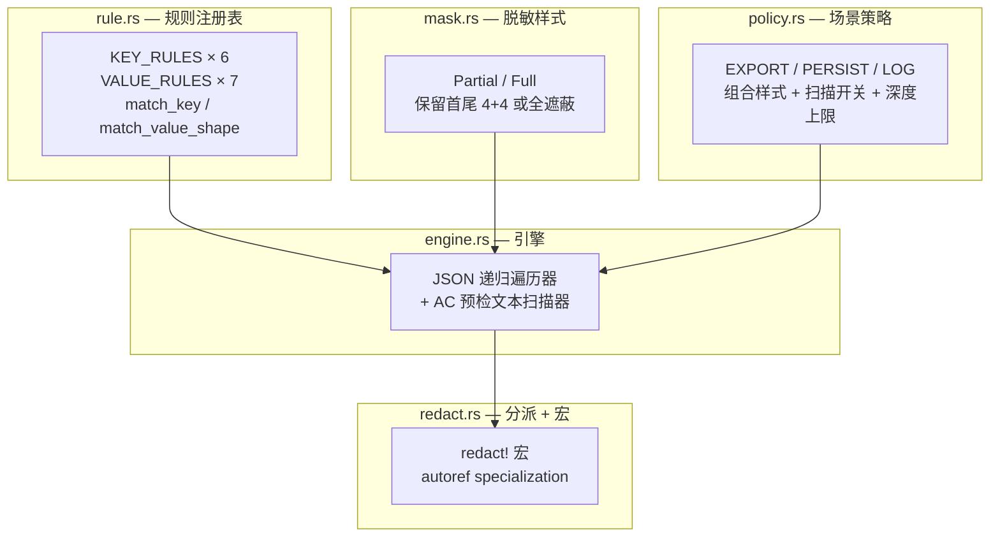

# 脱敏引擎下沉 common

> 从 `pkg/redaction` 搬到 `common/src/redaction/` 的不是文件位置，而是**信任边界**。内部保持原文、出口按需脱敏、fail-closed 三阶段降级——一个引擎同时服务后端 HTTP 出口、前端（未来）和工具调用日志。

```cite
本文引用的文件：
- common/src/redaction/mod.rs#L1-L103
- common/src/redaction/engine.rs#L1-L620
- common/src/redaction/rule.rs#L1-L344
- common/src/redaction/policy.rs#L1-L91
- common/src/redaction/mask.rs#L1-L105
- common/src/redaction/redact.rs#L1-L212
- src/pkg/mod.rs#L18-L20

本文关联三类文档：
① Design
（暂未关联）

② Plan
（暂未关联）

③ RAG 知识卡
- docs/wiki/knowledge/zh/脱敏引擎下沉%20common：fail-closed%20+%20ValueRule%20+%20边界统一%20+%20闭环脱敏/脱敏引擎下沉%20common：fail-closed%20+%20ValueRule%20+%20边界统一%20+%20闭环脱敏.md
- docs/wiki/knowledge/zh/@提及功能（mention）：文本协议%20+%20选择器%20+%20prompt%20注入%20+%20Markdown%20渲染/@提及功能（mention）：文本协议%20+%20选择器%20+%20prompt%20注入%20+%20Markdown%20渲染.md

④ 关联 Wiki 长文
- docs/wiki/zh/content/核心模块/工具与技能/工具系统/工具输出与安全治理.md
- docs/wiki/zh/content/核心模块/处理器层/Finance模块处理器/消息系统处理器.md
```

---

## 1. 简介

AI Orz 的脱敏引擎从后端专属的 `pkg/redaction` 下沉到前后端共享库 `common/src/redaction/`，成为单一事实源。这不是技术重构，而是**安全边界决策**（2026-09-03 用户拍板）的技术落地。

**为什么下沉到 common**：后端 HTTP 出口、工具调用日志、前端（未来）展示层都需要脱敏。如果各自维护一套，规则迭代时会出现「后端加了新凭证类型，前端忘了加」的脱节。下沉到 common 之后，`common::redaction::redact!(response)` 在任何 crate 里都能调用，规则表是唯一的。

**为什么要 fail-closed**：很多脱敏实现会在脱敏失败时回退到原文继续返回。这在安全上是危险的——如果 JSON 往返失败、或遮蔽值无法通过 DTO 反序列化校验，把原文带给调用方等于把凭证泄漏出去。AI Orz 的 `redact!` 宏在失败时返回 `Err`，**绝不把原文带回**。

**边界决策**（`common/src/redaction/mod.rs#L3-L7`）：**系统内部不脱敏，仅在对外接口输出时按需脱敏。** 内部存储（JSONL trace、SQLite、日志）保持原文，风险由访问控制承担；需要脱敏的出口接口在返回前用 `redact!` 宏包一层，不做全局响应改写。

章节来源：`common/src/redaction/mod.rs#L1-L19`

---

## 2. 架构总览

五层架构，上层纯声明、下层做实际脱敏：



- `rule.rs`（`KEY_RULES` 6 条键名规则 + `VALUE_RULES` 7 条值形态规则）声明「匹配什么」
- `mask.rs`（`MaskStyle::Partial` / `MaskStyle::Full`）决定命中后值呈现形态
- `policy.rs`（EXPORT / PERSIST / LOG 三种预设）组合样式 + 扫描开关 + 深度/体积上限
- `engine.rs`（JSON 遍历器 + Aho-Corasick 预检文本扫描器）做实际脱敏
- `redact.rs`（`redact!` 宏）通过 autoref specialization 实现零歧义类型分派

`src/pkg/mod.rs#L18-L20` 保留了 `pub use common::redaction` 兼容转发——旧引用 `crate::pkg::redaction::*` 继续可用，内部实现全部指向 common。

章节来源：`common/src/redaction/mod.rs#L21-L29`, `src/pkg/mod.rs#L18-L20`

---

## 3. 核心组件详解

### 3.1 rule.rs — 规则注册表

**KEY_RULES**（`common/src/redaction/rule.rs#L49-L114`）6 条键名规则：

| 规则名 | patterns | exclude | value_class |
|--------|----------|---------|-------------|
| password | `password, passwd, pwd` | 空 | StringOnly |
| api_key | `api_key, apikey, api-key, access_key` | `name, id, prefix, alias` | StringOnly |
| token | `token` | 22 条 LLM 用量字段（usage/count/total/max/limit/remaining/cost/price/num/size/length/estimate/budget/cached/reasoning/per_/_per_/rate/quota/balance） | StringOnly |
| secret | `secret` | 空 | StringOnly |
| authorization | `authorization, bearer` | 空 | StringOnly |
| credential | `credential` | 空 | StringOnly |

**VALUE_RULES**（`common/src/redaction/rule.rs#L135-L171`）7 条值形态规则——当键名未命中、但值长得像凭证时兜底：

| 规则名 | 前缀 |
|--------|------|
| openai_api_key | `sk-`, `sk_` |
| github_token | `ghp_`, `gho_`, `ghu_`, `ghs_`, `ghr_` |
| gitlab_token | `glpat-` |
| slack_token | `xoxb-`, `xoxp-`, `xoxa-`, `xoxr-` |
| aws_access_key_id | `AKIA`, `ASIA` |
| jwt | `eyJ` |
| stripe_key | `sk_live_`, `rk_live_` |

**类型感知**（`ValueClass` L23-L29）：默认只对字符串值脱敏（`StringOnly`），数值/布尔/null 视为统计值保留——这是避免误伤 `total_tokens: 1536` 这类 LLM 用量字段的主力手段。配合 token 规则的 22 条 exclude 名单做双保险。

**键名匹配**（`match_key` L230-L240）：两级判定——patterns 任一命中 → 再校验 exclude 任一命中则跳过。`contains_ignore_ascii_case`（L218-L225）用字节窗口零分配实现大小写不敏感匹配，实测 10 万次调用从 20.9ms 降到 1.7ms（L5 注释）。

章节来源：`common/src/redaction/rule.rs#L49-L240`

### 3.2 engine.rs — 引擎

**JSON 递归遍历**（`redact_value` L53-L100）：对 Object 的每个键先 `match_key`，命中敏感键 → `redact_matched_value`（键值整体脱敏），未命中 → 递归下钻。Array 同样递归。String 值先走文本扫描（`redact_text`），扫描无命中且 `scan_free_text` 开启时再试值形态兜底（`match_value_shape` L89）。

**AC 预检快速路径**（`precheck` L26-L36, `redact_text` L139-L148）：文本扫描前先用 Aho-Corasick 自动机判断全文是否含任一敏感词（所有 patterns 的并集）。无命中直接返回 `Cow::Borrowed(text)`——零拷贝零分配。预检自动机通过 `OnceLock` 延迟初始化，`warmup()` 在系统启动时调一次（`common/src/redaction/engine.rs#L39-L41`）。

**裸凭证值形态兜底**（`value_shape_boundary_match` L266-L301）：键名没命中但值长得像凭证时，要求必须锚定在 token 边界（前导为空白/引号/分隔符/行首）才匹配——避免把 `"ask-Ed"` 里的 `sk-` 误判为凭证。命中后整串全量遮蔽（`MaskStyle::Full`）。

**扫描循环禁止切片优化**（`common/src/redaction/engine.rs#L9-L11`）：CLI flag 形态 `--token secret123` 的识别依赖左侧 `-` 上下文（L205 的 `bytes[i - 1] == b'-'` 检查）。一旦把扫描区间切掉前导安全区，`--token` 的 `-` 就会丢失导致漏脱敏。实测过该优化，收益为零且引入漏脱，故明令禁止。

**JSON 字符串形态保留引号**（L182-L202）：JSON 形态 `"key":"value"` 脱敏时，mask 生成后左右两侧引号保留（L235-L241）——`text_json_shape_keeps_quotes` 测试（L452-L461）验证脱敏后仍是合法 JSON。

章节来源：`common/src/redaction/engine.rs#L43-L260`

### 3.3 policy.rs — 场景策略

三种策略预设（`common/src/redaction/policy.rs#L39-L65`）：

| 策略 | style | scan_free_text | max_depth | max_text_bytes | 用途 |
|------|-------|----------------|-----------|----------------|------|
| EXPORT | Partial | true | 16 | 1MB | HTTP 对外输出（默认） |
| PERSIST | Partial | true | 16 | 1MB | 内部持久化（当前未启用） |
| LOG | Full | false | 8 | 4KB | 日志输出（当前未启用） |

**为什么 EXPORT 用 Partial**：保留首尾 4+4 字符（如 `sk-a***3456`），便于运维定位"是哪个凭证出问题"。全遮蔽的 `***` 无法区分来源。

**为什么 LOG 关掉自由文本扫描**（`scan_free_text: false`）：日志性能敏感，且日志不直接对外展示——靠键名匹配已足够捕获结构化凭证。压低深度上限（8 vs 16）和单值字节上限（4KB vs 1MB）也是同理。

**为什么 PERSIST 当前未启用**：边界决策说"系统内部不脱敏"，所以 PERSIST 是保留扩展点——如果未来需要为某类落库单独收紧，调整这个常量即可，不影响调用点。

章节来源：`common/src/redaction/policy.rs#L13-L65`

### 3.4 redact.rs — 分派 + 宏

**autoref specialization**（`common/src/redaction/redact.rs#L1-L19`）：Rust 没有原生特化，用「自动引用特化」实现 `redact!` 宏的零歧义分派。

- **第一优先级** `RedactStrDispatch for T: AsRef<str>`（L33-L45）：字符串族 → 文本级扫描。`AsRef<str>` 覆盖 `String` / `&str` / `Cow<str>` / `Box<str>` 等。
- **第二优先级** `RedactSerdeDispatch<T> for &T where T: Serialize + DeserializeOwned + Clone`（L48-L73）：可 JSON 往返类型 → 序列化脱敏反序列化。覆盖 DTO / `Value` / `Vec<T>` / `Option<T>` 等。

原理：宏把表达式包一层 `(&$value).redact_dispatch(..)`。字符串 `&String` 是 `&AsRef<str>`，第一级命中；DTO `&Dto` 不是 `AsRef<str>`，落到第二级。两级 impl 分属不同 trait，无重叠冲突。

**fail-closed 三阶段降级**（L58-L72）：
1. JSON 序列化 → `engine::redact_json` 就地脱敏 → 反序列化
2. 反序列化失败？降级为全遮蔽重试（`mask_all_strings` L76-L88）——递归把所有字符串值替换为 `***`
3. 全遮蔽仍无法反序列化？返回 `Err(serde_json::Error)`——**绝不回退原文**

`macro_fails_closed_when_deserialization_rejects_masks` 测试（L203-L211）验证了第三阶段——`StrictDto` 的自定义反序列化拒绝 `***` 值，两阶段都失败后 `redact!(strict)` 返回 `Err`。

**redact! 宏**（L104-L116）：`redact!(value)` 默认用 EXPORT 策略，`redact!(value, LOG)` 第二参数指定策略。统一返回 `Result`，调用方可以无差别用 `?` 传播（`common::error` 已提供 `From<serde_json::Error>`）。

章节来源：`common/src/redaction/redact.rs#L1-L116`

---

## 4. 数据流

调用 `redact!` 宏到脱敏完成的完整链路：

```
1. 调用方：redact!(response)? 或 redact!("api_key=sk-abcdef123456")?
2. 宏展开：(&expr).redact_dispatch(&EXPORT)
3. autoref specialization 分派：
   ├─ T: AsRef<str> → RedactStrDispatch
   │   → engine::redact_text(text, policy)
   │     → 预检 precheck() 是否命中敏感词？
   │       ├─ 无命中 → Cow::Borrowed（零拷贝返回原文）
   │       └─ 有命中 → scan_and_mask(text, policy)
   │         → 裸凭证值形态兜底 value_shape_boundary_match
   │         → 键名 KV / JSON / CLI flag 形态识别
   │         → mask_value 脱敏
   └─ T: Serialize + DeserializeOwned → RedactSerdeDispatch
       → serde_json::to_value(&value)?
       → engine::redact_json(&mut value, policy)
         → 递归遍历 JSON 树
         → match_key 匹配敏感键 → redact_matched_value
         → 字符串值走 scan_free_text 文本扫描
         → 无命中时 match_value_shape 值形态兜底
       → serde_json::from_value::<T>(value)
         ├─ Ok → 返回脱敏后的 T
         └─ Err → mask_all_strings 全遮蔽重试 → 仍 Err 则返回 Err
4. 失败语义：fail-closed——绝不把原文带回给调用方
```

章节来源：`common/src/redaction/redact.rs#L104-L116`, `common/src/redaction/engine.rs#L43-L148`

---

## 5. 设计决策

**fail-closed 失败语义**（`common/src/redaction/redact.rs#L17-L19`）：很多脱敏实现会在脱敏失败时回退原文。AI Orz 明确禁止——JSON 往返失败、全遮蔽也过不去，就返回 `Err`。调用方拿到 Err 会报错，而不是悄悄把凭证泄漏出去。内部不做任何日志输出，降级策略完全由调用方决定。

**边界统一**（`common/src/redaction/mod.rs#L3-L7`）：内部保持原文（SQLite、JSONL trace、日志文件），对外出口按需 `redact!`。禁止中间层隐式脱敏——脱敏发生在"出系统"那一刻，而不是"写入系统"时。原因：落库脱敏会导致工具调用详情、错误上下文里拿不到原始数据，运维和调试会失明。

**值形态边界安全**（`common/src/redaction/engine.rs#L264-L301`）：`value_shape_boundary_match` 要求前缀必须锚定在 token 边界（前导为空白/引号/分隔符/行首）。`"ask-Ed"` 里的 `sk-` 前导是 `k`（字母），不是 token 边界，所以不会被误判。这是值形态匹配和普通字符串搜索的核心区别。

**LLM 用量字段 exclude 名单**（`common/src/redaction/rule.rs#L66-L93`）：token 规则排除了 22 条用量/成本/限额字段。数值型即使漏出排除词也会由 `ValueClass::StringOnly` 保底（数值不脱敏），但 exclude 名单兜底"以字符串承载的用量值"——避免把 `"total_tokens": "1536"` 这类字符串形式的统计值误伤。

**禁切片优化**（`common/src/redaction/engine.rs#L9-L11`）：CLI flag 形态 `--token secret123` 的识别依赖 `bytes[i - 1] == b'-'`。如果为了性能把扫描区间切掉前导字节，这个 `-` 就丢了，导致漏脱敏。实测过这个"优化"，收益为零且引入 bug，明令禁止。

章节来源：`common/src/redaction/rule.rs#L66-L93`, `common/src/redaction/engine.rs#L9-L11`, `common/src/redaction/engine.rs#L264-L301`, `common/src/redaction/redact.rs#L17-L19`

---

## 6. 性能与安全

**键名判定零分配**（`common/src/redaction/engine.rs#L5-L6`, `common/src/redaction/rule.rs#L218-L225`）：`contains_ignore_ascii_case` 用 `h.windows(n.len()).any(|w| w.eq_ignore_ascii_case(n))` 实现。实测 10 万次调用从 20.9ms 降到 1.7ms——因为不做 `to_lowercase()` 也不构造中间集合。

**AC 预检快速路径无命中零拷贝**（`common/src/redaction/engine.rs#L7-L8`, `common/src/redaction/engine.rs#L139-L148`）：`redact_text` 在 AC 预检无命中时返回 `Cow::Borrowed(text)`——调用方据此跳过写回（`Cow::Borrowed` 表示未修改）。预检自动机用 `OnceLock` 延迟初始化，`warmup()` 在系统启动时提前构建，避免运行期首次调用才构建。

**禁止内部任何日志输出**（`common/src/redaction/mod.rs#L18-L19`）：common::redaction 模块内部只返回 `Result` / 就地改写，观测与降级策略完全由调用方决定。如果引擎内部打了日志，脱敏的凭证会直接泄漏到日志里——安全上完全不可接受。

**JSON 字符串形态保留引号**（`common/src/redaction/engine.rs#L235-L241`）：脱敏后 `{"api_key":"sk-a***3456","n":1}` 仍是合法 JSON。如果吞掉引号变成 `{"api_key":"sk-a***3456","n":1}`，会导致下游 JSON 解析失败。`text_json_shape_keeps_quotes` 测试（L452-L461）锁定了这个行为。

章节来源：`common/src/redaction/engine.rs#L5-L11`, `common/src/redaction/engine.rs#L139-L148`, `common/src/redaction/engine.rs#L235-L241`

---

## 7. 使用指南

### 7.1 调用点示例

**消息失败通知 / API 出口**（HTTP 响应体序列化前最后一道）：

```rust
// src/middleware/api_notice.rs 或 src/handler/*
let response = SomeDto { api_key: "sk-...", max_tokens: 4096 };
Ok(Json(common::redaction::redact!(response)?))
// 或用兼容转发
use crate::pkg::redaction;
Ok(Json(redact!(response)?))
```

**工具调用详情**（消息处理器里）：

```rust
// 工具输出的 note 字段里可能含 --token secret
let dto = ToolOutputDto { note: "git push --token secret123".into(), .. };
let safe_dto = common::redaction::redact!(dto)?;
```

**日志输出**（如果未来启用 LOG 策略）：

```rust
let text = "exec: git push --token secret123";
let safe = common::redaction::redact!(text, common::redaction::policy::LOG)?;
// LOG 策略：scan_free_text=false，可能只脱敏键名匹配的 KV
// 需要自己确认是否能捕获 CLI flag 形态
```

### 7.2 怎么加新凭证规则

**按键名识别**（如私有协议的 `app_secret`）：在 `KEY_RULES` 表（`common/src/redaction/rule.rs#L49-L114`）追加一条 `KeyRule`。其余逻辑零改动。

**按值形态识别**（如新的凭证前缀）：在 `VALUE_RULES` 表（`common/src/redaction/rule.rs#L135-L171`）追加一条 `ValueRule`。引擎与宏无需改动——`value_prefixes()`（L190-L198）会自动把新前缀展平进 AC 预检，`match_value_shape`（L180-L185）会自动匹配。

### 7.3 怎么选策略

默认用 EXPORT（`RedactPolicy::default()`）。只有以下场景考虑 LOG 或自定义策略：

- **日志中间件**：策略明确为 LOG（全遮蔽 + 关自由文本扫描 + 压低深度）
- **深度嵌套 JSON**：自定义 `max_depth`（EXPORT 默认 16，足够覆盖绝大多数业务结构）
- **超大 payload**：调大 `max_text_bytes`（EXPORT 默认 1MB）

章节来源：`common/src/redaction/rule.rs#L49-L171`, `common/src/redaction/redact.rs#L90-L116`

---

## 8. 故障排查指南

### 8.1 脱敏失败报 Err

**症状**：`redact!(value)?` 返回 `Err(serde_json::Error)`，接口直接报错。

**原因**：fail-closed 三阶段都失败——JSON 往返失败 → 全遮蔽重试也失败。最常见的是 DTO 的自定义 `Deserialize` 实现拒绝 `***` 遮蔽值（如 `macro_fails_closed_when_deserialization_rejects_masks` 测试里的 `StrictDto`）。

**排查路径**：看 Err 的 `display()` 输出是什么错误信息。如果是"masked value rejected"，说明 DTO 的 Deserialize 校验太严格——遮蔽值无法通过。

**修复**：要么改 DTO 的 Deserialize 放宽校验（接受 `***`），要么调用方用 `redact_json`（就地改写，不走 JSON 往返，不会触发反序列化校验）。如果是其他 serde 错误，检查字段类型是否支持 `Clone`。

### 8.2 不该脱敏的字段被遮

**症状**：`total_tokens: 1536` 被脱敏了，或者 `api_key_name: "my-key"` 被脱敏了。

**原因**：KEY_RULES 的 patterns 子串匹配命中了（token → total_tokens，api_key → api_key_name），但 exclude 名单没覆盖到。

**排查路径**：在 `common/src/redaction/rule.rs#L230-L240` 的 `match_key` 里打印命中的 rule 和 exclude 结果。对照 `llm_usage_fields_are_not_redacted` 测试（L261-L276）——该测试锁定的 9 个字段不会出问题，新的用量字段需要追加进 token 规则的 exclude 名单。

**修复**：在对应的 KEY_RULE 的 `exclude` 里追加排除词。`api_key_name` 已被排除（L60），`api_key_id` 同样。数值型即使漏出 exclude 也会由 `ValueClass::StringOnly` 保底，但字符串形式的用量值需要 exclude 兜底。

### 8.3 sk- 前缀误判 ask-

**症状**：文本里 `ask-Ed about it` 被脱敏成 `***Ed about it`。

**原因**：`value_shape_boundary_match` 的边界检查漏了。前导 `a`（字母）应该让 `prev_ok` 为 false。

**排查路径**：在 `common/src/redaction/engine.rs#L266-L301` 里检查 `value_shape_boundary_match` 的 `prev_ok` 逻辑。`ask-` 里的 `sk-` 前一个字节是 `a`（字母），不在 `prev_ok` 的 matches 列表里，应该返回 None。如果误判了，说明 `prev_ok` 的字节范围有 bug。对照 `json_value_shape_does_not_touch_plain_values` 测试（L585-L593）。

**修复**：检查 `prev_ok` 的 `matches!` 列表（L268-L286）。如果某个分隔符确实不在列表里（比如中文全角空格），追加进去。

### 8.4 JSON 引号被吞

**症状**：脱敏后 JSON 变成 `{"api_key":"sk-a***3456","n":1}` 没问题，但某些场景下变成了 `{api_key:sk-a***3456}`——引号全没了，下游解析失败。

**原因**：这是一个已知 bug 被 `text_json_shape_keeps_quotes` 测试（L452-L461）锁定了。当前实现里 JSON 形态脱敏会在 mask 值前后手动加回引号（L235-L241）。如果你看到了引号被吞，说明代码路径没走到这里。

**排查路径**：确认脱敏走的是 JSON 形态分支（L184-L192 命中 `b'"'`），而不是裸值形态（L195-L202）。如果 dest 里有空白或畸形输入，`quoted_value_range`（L306-L321）会返回 None 导致跳过，这不会破坏引号——但 `bare_value_end` 裸值分支会吞掉引号。

**修复**：如果 JSON 引号被吞，检查 `scan_and_mask` 里 `quoted_value_range` 是否正确返回了区间；如果是畸形 JSON 输入（未闭合引号），`quoted_value_range` 会返回 None 跳过脱敏——这是"宁可不脱敏也不破坏结构"的策略。

### 8.5 性能异常

**症状**：接口响应变慢，CPU 占用升高，特别是脱敏大 payload 时。

**原因**：最可能的原因是 AC 预检返回了"有敏感词"（`precheck().is_match(text)` 为 true），导致全量 `scan_and_mask` 扫描。如果 payload 很大且真的有敏感词，成本主要在 `scan_and_mask` 的循环里。如果 payload 大但没敏感词，预检应该返回 `Cow::Borrowed`——如果没返回，可能是预检构建有问题。

**排查路径**：`common/src/redaction/engine.rs#L139-L148` 里检查预检结果。如果频繁走了 `scan_and_mask`，看是不是 `scan_free_text` 被意外关闭（LOG 策略会关），或者 `all_patterns()` 里 patterns 太多。对照 `text_returns_borrowed_when_clean` 测试（L528-L540）——无敏感词必须返回 `Cow::Borrowed`。

**修复**：`warmup()` 在系统启动时调用（`common/src/redaction/engine.rs#L39-L41`）确保预检自动机提前构建。如果业务里频繁出现大 payload，考虑在调用点用 `redact_text` 而非 `redact!`（前者能利用 AC 预检快速路径，后者要做 JSON 往返）。

章节来源：`common/src/redaction/redact.rs#L58-L88`, `common/src/redaction/rule.rs#L230-L240`, `common/src/redaction/engine.rs#L266-L301`, `common/src/redaction/engine.rs#L139-L148`

---

## 9. 总结

AI Orz 的脱敏引擎下沉 common 不是一次技术重构，而是**安全边界决策**的技术落地：

- **下沉到 common**：前后端共享单一事实源，规则迭代零脱节风险
- **fail-closed 三阶段降级**：JSON 往返 → 全遮蔽重试 → Err，绝不把原文带出
- **边界统一**：内部保持原文、出口按需脱敏，拒绝中间层隐式脱敏
- **值形态兜底 + 边界安全**：覆盖泛型键下的裸凭证，同时防止 `ask-` 里的 `sk-` 误判
- **性能优先**：键名匹配零分配、AC 预检快速路径、禁止切片优化
- **新增凭证 = 加一行规则**：规则表扩展，引擎和宏零改动

边界决策明确了"谁负责脱敏、在哪里脱敏、脱敏失败怎么办"三个核心问题——这是安全体系能长期稳定的根本保障。

章节来源：`common/src/redaction/mod.rs#L3-L7`, `common/src/redaction/redact.rs#L17-L19`

---

## 10. 附录

### 10.1 KEY_RULES 完整表

| # | 规则名 | patterns | exclude | value_class |
|---|--------|----------|---------|-------------|
| 1 | password | `password, passwd, pwd` | 空 | StringOnly |
| 2 | api_key | `api_key, apikey, api-key, access_key` | `name, id, prefix, alias` | StringOnly |
| 3 | token | `token` | 22 条（usage/count/counts/total/prompt/completion/max/limit/remaining/cost/price/num/size/length/estimate/budget/cached/reasoning/per_/_per_/rate/quota/balance） | StringOnly |
| 4 | secret | `secret` | 空 | StringOnly |
| 5 | authorization | `authorization, bearer` | 空 | StringOnly |
| 6 | credential | `credential` | 空 | StringOnly |

章节来源：`common/src/redaction/rule.rs#L49-L114`

### 10.2 VALUE_RULES 完整表

| # | 规则名 | 前缀（prefixes） | 子串（substrings） |
|---|--------|-------------------|---------------------|
| 1 | openai_api_key | `sk-`, `sk_` | 空 |
| 2 | github_token | `ghp_`, `gho_`, `ghu_`, `ghs_`, `ghr_` | 空 |
| 3 | gitlab_token | `glpat-` | 空 |
| 4 | slack_token | `xoxb-`, `xoxp-`, `xoxa-`, `xoxr-` | 空 |
| 5 | aws_access_key_id | `AKIA`, `ASIA` | 空 |
| 6 | jwt | `eyJ` | 空 |
| 7 | stripe_key | `sk_live_`, `rk_live_` | 空 |

章节来源：`common/src/redaction/rule.rs#L135-L171`

### 10.3 三种 Policy 对比表

| 属性 | EXPORT | PERSIST | LOG |
|------|--------|---------|-----|
| `style` | Partial（保留首尾 4+4） | Partial | Full（全遮蔽 `***`） |
| `scan_free_text` | true | true | false |
| `max_depth` | 16 | 16 | 8 |
| `max_text_bytes` | 1MB | 1MB | 4KB |
| 用途 | HTTP 对外输出（默认） | 内部持久化（未启用） | 日志输出（未启用） |

**Partial 样式示例**（`common/src/redaction/mask.rs#L30-L49`）：

| 原值 | 脱敏后 |
|------|--------|
| `sk-abcdef123456` | `sk-a***3456` |
| `hunter2hunter2` | `hunt***ter2` |
| `短值 hunter2`（不足 16 字符） | `***`（退化为全遮蔽） |

章节来源：`common/src/redaction/policy.rs#L39-L65`, `common/src/redaction/mask.rs#L30-L49`
