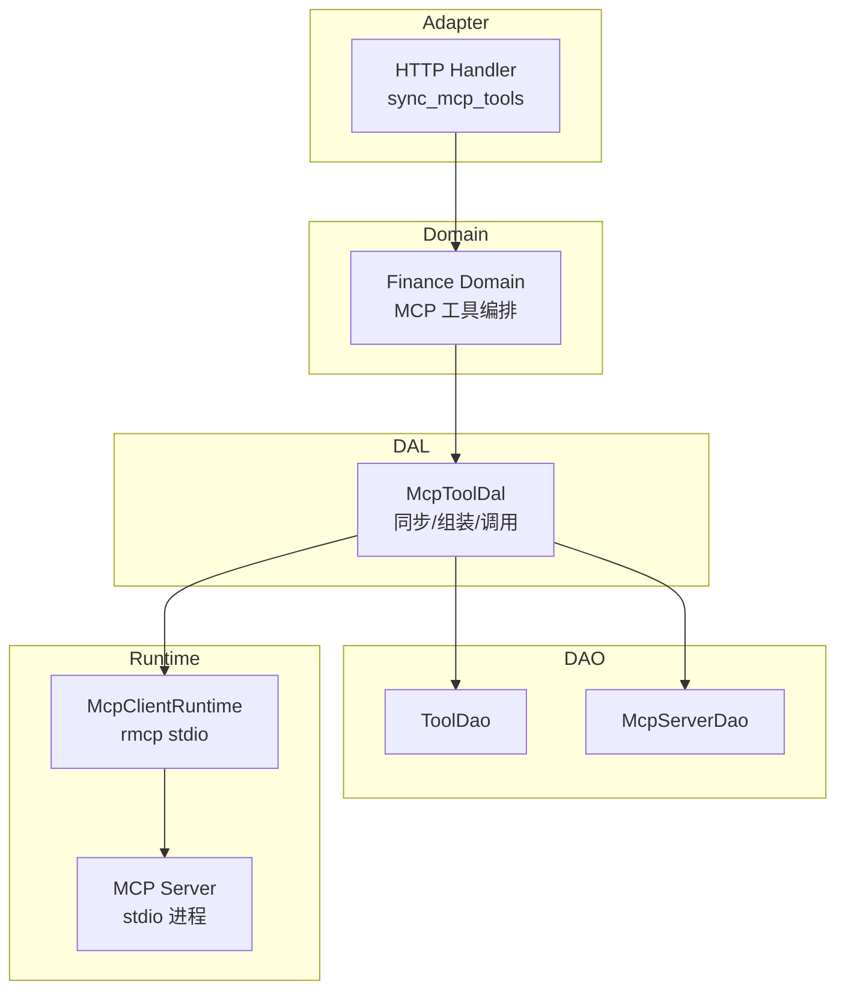
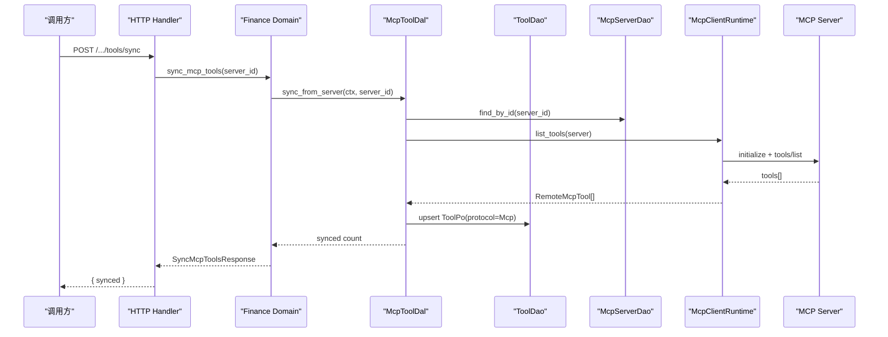
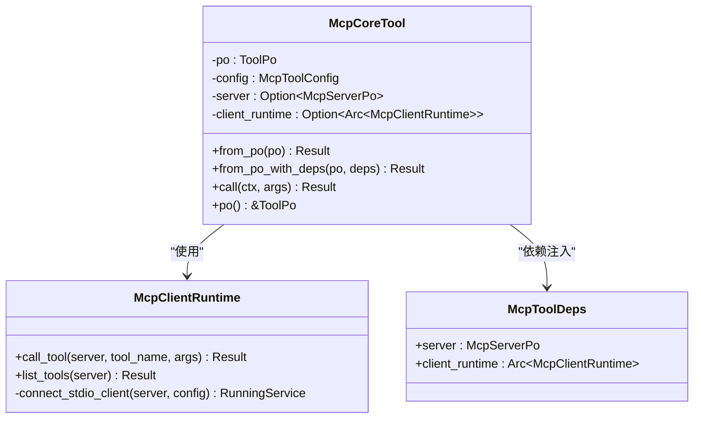
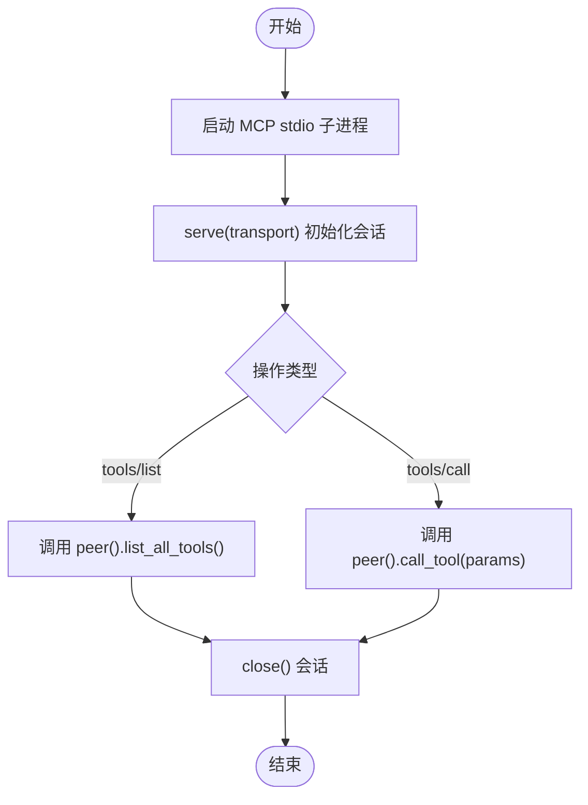
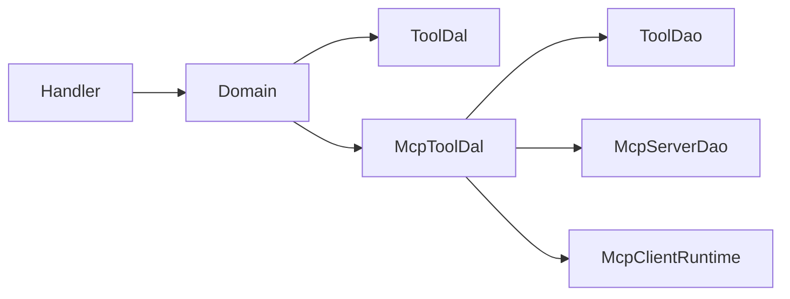

# MCP 工具集成（代码落地层）

<cite>
**本文引用的文件**
- [src/pkg/tool_registry/mcp.rs](src/pkg/tool_registry/mcp.rs)
- [src/models/mcp_server.rs](src/models/mcp_server.rs)
- [common/src/api/mcp_server.rs](common/src/api/mcp_server.rs)
- [src/handlers/finance/mcp_tool/sync_mcp_tools.rs](src/handlers/finance/mcp_tool/sync_mcp_tools.rs)
- [src/pkg/tool_registry/mcp_tests.rs](src/pkg/tool_registry/mcp_tests.rs)
- [docs/mcp_tool_design.md](docs/mcp_tool_design.md)
</cite>

## 目录
1. [简介](#简介)
2. [项目结构](#项目结构)
3. [核心组件](#核心组件)
4. [架构总览](#架构总览)
5. [详细组件分析](#详细组件分析)
6. [依赖关系分析](#依赖关系分析)
7. [性能与连接管理](#性能与连接管理)
8. [故障恢复与错误处理](#故障恢复与错误处理)
9. [配置选项与能力协商](#配置选项与能力协商)
10. [MCP 服务器搭建与调试](#mcp-服务器搭建与调试)
11. [集成示例：连接并调用外部 MCP 服务](#集成示例连接并调用外部-mcp-服务)
12. [结论](#结论)

## 简介
本文件面向需要在系统中集成 Model Context Protocol（MCP）工具的工程师，系统性说明 McpCoreTool 的实现原理、MCP 服务器连接管理、握手流程、消息格式、会话管理、工具发现与动态注册、配置项、连接池与故障恢复策略，以及 MCP 服务器的搭建、调试与监控方法。文档同时提供端到端集成示例，展示如何从管理面同步远端 MCP 工具，并在运行时通过标准 Tool 机制执行。

> 📌 视角说明（AGENTS §2.1.3 Level 3 互补视角平行卡）：
> 本长文是「MCP 工具集成」主题的 **代码落地层** 视角。同主题还有以下平行视角卡，请按需交叉阅读：
> - [MCP 工具集成（入门概览层）](docs/wiki/zh/content/项目概述/核心功能特性/统一工具调用架构/MCP 工具集成.md)

## 项目结构
本项目采用严格四层单向调用：Adapter（HTTP Handler / 公开回调 Handler / AOP Producer）→ Domain → DAL → DAO，禁止跨层调用与同层互调。MCP 相关代码主要分布在以下位置：
- pkg/tool_registry/mcp.rs：MCP 工具运行时与协议实现（McpClientRuntime、McpCoreTool、工厂函数）
- models/mcp_server.rs：MCP Server 持久化模型与配置（McpServerPo、McpServerConfig、传输类型）
- common/api/mcp_server.rs：前后端共享的 MCP Server API DTO
- handlers/finance/mcp_tool/sync_mcp_tools.rs：HTTP Handler，触发远端工具同步
- docs/mcp_tool_design.md：MCP 工具运行面设计文档（含数据模型、DAL/DAO 边界、同步与执行链路）

图表来源
- [src/handlers/finance/mcp_tool/sync_mcp_tools.rs:1-28](src/handlers/finance/mcp_tool/sync_mcp_tools.rs#L1-L28)
- [docs/mcp_tool_design.md:196-321](docs/mcp_tool_design.md#L196-L321)
- [src/pkg/tool_registry/mcp.rs:72-192](src/pkg/tool_registry/mcp.rs#L72-L192)

章节来源
- [docs/mcp_tool_design.md:120-195](docs/mcp_tool_design.md#L120-L195)
- [src/pkg/tool_registry/mcp.rs:1-26](src/pkg/tool_registry/mcp.rs#L1-L26)

## 核心组件
- McpCoreTool：实现 CoreTool 接口的可执行工具对象，封装 ToolPo、McpToolConfig、McpServerPo 与 McpClientRuntime，负责将参数转发到 MCP 服务端执行。
- McpClientRuntime：最小 MCP 客户端运行时，当前仅支持 stdio 传输；负责启动子进程、初始化会话、列出工具、调用工具、超时控制与关闭会话。
- McpToolConfig：保存在 ToolPo.config 中的绑定信息，仅包含 server_id 与 tool_name，不复制敏感连接配置。
- McpServerPo/McpServerConfig：持久化的 MCP Server 连接配置，包含 command/args/env/url/headers/timeout/response_max_bytes 等。
- HTTP Handler sync_mcp_tools：暴露 POST /api/v1/finance/mcp-servers/{server_id}/tools/sync，触发远端工具同步。

章节来源
- [src/pkg/tool_registry/mcp.rs:28-48](src/pkg/tool_registry/mcp.rs#L28-L48)
- [src/pkg/tool_registry/mcp.rs:50-192](src/pkg/tool_registry/mcp.rs#L50-L192)
- [src/models/mcp_server.rs:97-167](src/models/mcp_server.rs#L97-L167)
- [src/handlers/finance/mcp_tool/sync_mcp_tools.rs:1-28](src/handlers/finance/mcp_tool/sync_mcp_tools.rs#L1-L28)

## 架构总览
MCP 工具集成遵循“管理面”和“运行面”分离：
- 管理面：创建/更新/删除 MCP Server，按 server 同步远端 tools/list 为本地 ToolPo，查询与管理状态。
- 运行面：根据 ToolProtocol 路由到 McpToolDal，组装 McpCoreTool，通过 McpClientRuntime 调用 MCP Server 的 tools/call。

图表来源
- [src/handlers/finance/mcp_tool/sync_mcp_tools.rs:1-28](src/handlers/finance/mcp_tool/sync_mcp_tools.rs#L1-L28)
- [docs/mcp_tool_design.md:303-349](docs/mcp_tool_design.md#L303-L349)
- [src/pkg/tool_registry/mcp.rs:90-140](src/pkg/tool_registry/mcp.rs#L90-L140)

章节来源
- [docs/mcp_tool_design.md:303-389](docs/mcp_tool_design.md#L303-L389)

## 详细组件分析

### McpCoreTool 与工具装配
- McpCoreTool 由 ToolPo 与 McpToolDeps（server + client_runtime）装配而成，确保执行时具备完整依赖。
- 工厂函数 create_mcp_tool(po, deps) 负责校验协议与配置，构造可执行工具。
- 非运行时场景可使用 create_tool(po) 生成 stub，便于列表与展示。

图表来源
- [src/pkg/tool_registry/mcp.rs:270-365](src/pkg/tool_registry/mcp.rs#L270-L365)
- [src/pkg/tool_registry/mcp.rs:50-192](src/pkg/tool_registry/mcp.rs#L50-L192)

章节来源
- [src/pkg/tool_registry/mcp.rs:270-365](src/pkg/tool_registry/mcp.rs#L270-L365)

### McpClientRuntime：握手、消息与生命周期
- 握手：通过 rmcp 的 TokioChildProcess 启动 MCP stdio 子进程，serve(transport) 完成 initialize 握手。
- 消息格式：遵循 JSON-RPC 2.0，方法包括 initialize、notifications/initialized、tools/list、tools/call。
- 会话管理：每次调用建立独立会话，调用完成后 close；失败或超时均清理资源。
- 超时控制：连接超时 connect_timeout_ms，调用超时 timeout_ms。
- 失效标记：invalidate_server 后下一次成功调用会清除失效标记并重连。

图表来源
- [src/pkg/tool_registry/mcp.rs:200-240](src/pkg/tool_registry/mcp.rs#L200-L240)
- [src/pkg/tool_registry/mcp.rs:103-192](src/pkg/tool_registry/mcp.rs#L103-L192)

章节来源
- [src/pkg/tool_registry/mcp.rs:72-192](src/pkg/tool_registry/mcp.rs#L72-L192)
- [src/pkg/tool_registry/mcp.rs:200-268](src/pkg/tool_registry/mcp.rs#L200-L268)

### MCP 服务器连接管理与配置
- McpTransport：支持 stdio 与 streamable_http（第一版仅 stdio 可用）。
- McpServerConfig：包含 command/args/env/url/headers/timeout/connect_timeout/response_max_bytes。
- 安全默认值：env 默认不继承系统环境；stdio command 不走 shell；URL/headers/env/detail/error/log 需脱敏。
- 管理面返回脱敏配置：redacted_for_management 对 env、headers、url 进行脱敏。

章节来源
- [src/models/mcp_server.rs:17-167](src/models/mcp_server.rs#L17-L167)
- [common/src/api/mcp_server.rs:10-32](common/src/api/mcp_server.rs#L10-L32)

### 工具发现与动态注册
- 通过 McpClientRuntime.list_tools(server) 获取远端工具元数据。
- 同步逻辑将 RemoteMcpTool 映射为 ToolPo，protocol=ToolProtocol::Mcp，control_mode=Manual，config 仅保存 server_id/tool_name。
- upsert 规则：不存在则创建；已存在需校验协议与绑定一致；保留 created_at/created_by/status，更新 updated_by。

章节来源
- [docs/mcp_tool_design.md:303-349](docs/mcp_tool_design.md#L303-L349)
- [src/pkg/tool_registry/mcp.rs:90-140](src/pkg/tool_registry/mcp.rs#L90-L140)

### 运行时调用与协议路由
- Domain 层按 ToolProtocol 路由：Builtin/Http 走通用 ToolDal，MCP 走 McpToolDal。
- Runtime 入口 call_tool_by_id 先读取 Tool 元信息，再委托 call_tool 避免重复查询。
- 执行路径：McpCoreTool.call -> McpClientRuntime.call_tool -> rmcp tools/call。

章节来源
- [docs/mcp_tool_design.md:581-611](docs/mcp_tool_design.md#L581-L611)
- [docs/mcp_tool_design.md:713-766](docs/mcp_tool_design.md#L713-L766)

## 依赖关系分析
- Handler 仅做 DTO 转换，调用 Finance Domain。
- Domain 组合 DAL（ToolDal、McpToolDal），DAL 组合 DAO（ToolDao、McpServerDao）。
- McpToolDal 持有 McpToolCallDaoImpl，后者组合基础 ToolCallDao 与 McpClientRuntime。
- 禁止 DAL 同层互调；协议分发在 Domain 层完成。

图表来源
- [docs/mcp_tool_design.md:152-195](docs/mcp_tool_design.md#L152-L195)
- [docs/mcp_tool_design.md:391-438](docs/mcp_tool_design.md#L391-L438)

章节来源
- [docs/mcp_tool_design.md:152-195](docs/mcp_tool_design.md#L152-L195)

## 性能与连接管理
- 当前实现为每调用新建 stdio 会话，适合低频调用；高并发场景建议后续引入 session cache 与连接复用。
- 超时保护：连接超时与调用超时分别控制，避免阻塞。
- 失效标记：invalidate_server 用于配置变更后重连；成功调用后自动清除失效标记。
- 响应大小限制：response_max_bytes 可用于后续扩展以限制结果体积。

章节来源
- [src/pkg/tool_registry/mcp.rs:107-192](src/pkg/tool_registry/mcp.rs#L107-L192)
- [src/models/mcp_server.rs:117-123](src/models/mcp_server.rs#L117-L123)
- [docs/mcp_tool_design.md:1346-1352](docs/mcp_tool_design.md#L1346-L1352)

## 故障恢复与错误处理
- 错误脱敏：MCP 下层错误统一映射为安全错误，不输出 command/env/headers/url/credential。
- 常见错误：
  - 非 object 参数：拒绝并提示必须为 JSON object。
  - stdio 命令未找到：提示 PATH 中未找到命令，建议使用绝对路径。
  - tools/list/tools/call 失败：返回明确失败原因，不包含敏感细节。
  - 会话关闭失败：记录操作与 server_id，不泄露底层细节。
- 测试覆盖：包括 echo 成功、失败脚本、参数校验、命令解析、会话关闭失败、并发调用等。

章节来源
- [src/pkg/tool_registry/mcp.rs:142-192](src/pkg/tool_registry/mcp.rs#L142-L192)
- [src/pkg/tool_registry/mcp.rs:242-268](src/pkg/tool_registry/mcp.rs#L242-L268)
- [src/pkg/tool_registry/mcp_tests.rs:333-413](src/pkg/tool_registry/mcp_tests.rs#L333-L413)

## 配置选项与能力协商
- McpServerConfig 关键选项：
  - command/args/env：stdio 传输所需。
  - url/headers：streamable_http 传输所需（当前 not implemented）。
  - timeout_ms/connect_timeout_ms/response_max_bytes：运行时控制。
- 能力协商：initialize 阶段返回 protocolVersion、capabilities（如 tools）、serverInfo；随后通过 tools/list 获取具体工具元数据。
- 工具元数据：name、description、inputSchema 被映射为 ToolPo.parameters_schema 与 tags。

章节来源
- [src/models/mcp_server.rs:97-167](src/models/mcp_server.rs#L97-L167)
- [src/pkg/tool_registry/mcp_tests.rs:157-217](src/pkg/tool_registry/mcp_tests.rs#L157-L217)
- [docs/mcp_tool_design.md:323-349](docs/mcp_tool_design.md#L323-L349)

## MCP 服务器搭建与调试
- 搭建步骤：
  - 编写符合 MCP JSON-RPC 2.0 协议的 stdio 程序，实现 initialize、notifications/initialized、tools/list、tools/call。
  - 配置 McpServerPo.config.command/args/env，确保命令可执行且 PATH 正确。
  - 通过 Handler 触发 sync_mcp_tools 同步远端工具。
- 调试方法：
  - 使用测试脚本模拟 MCP 服务器，验证 tools/list 与 tools/call 行为。
  - 检查日志与错误消息是否脱敏，确认无敏感信息泄露。
  - 使用并发测试验证多调用稳定性。

章节来源
- [src/pkg/tool_registry/mcp_tests.rs:157-217](src/pkg/tool_registry/mcp_tests.rs#L157-L217)
- [src/pkg/tool_registry/mcp_tests.rs:415-438](src/pkg/tool_registry/mcp_tests.rs#L415-L438)

## 集成示例：连接并调用外部 MCP 服务
- 管理面同步：
  - 调用 POST /api/v1/finance/mcp-servers/{server_id}/tools/sync，传入 server_id。
  - 成功后本地 ToolPo 新增 protocol=Mcp、control_mode=Manual 的记录。
- 运行时调用：
  - 通过 RuntimeDomain.tool_execution().call_tool_by_id(ctx, tool_id, args) 执行。
  - 内部路由到 McpToolDal.call_tool，最终调用 McpCoreTool.call -> McpClientRuntime.call_tool。
- 示例流程：
  - 创建 MCP Server（stdio 命令指向 Python 脚本）。
  - 同步工具，得到 ToolId 形如 mcp.{server_id}.{tool_name}。
  - 调用该 ToolId，传入 JSON object 参数，获得结构化结果。

章节来源
- [src/handlers/finance/mcp_tool/sync_mcp_tools.rs:1-28](src/handlers/finance/mcp_tool/sync_mcp_tools.rs#L1-L28)
- [docs/mcp_tool_design.md:637-663](docs/mcp_tool_design.md#L637-L663)
- [src/pkg/tool_registry/mcp_tests.rs:283-318](src/pkg/tool_registry/mcp_tests.rs#L283-L318)

## 结论
本实现以 McpCoreTool 为核心，结合 McpClientRuntime 提供最小可用的 MCP stdio 运行时，支持工具发现、动态注册与运行时调用。管理面与运行面清晰分离，错误处理与安全脱敏贯穿全流程。后续可扩展 streamable HTTP 传输、连接池与会话缓存、健康检查与重连策略，以满足更高并发与稳定性需求。