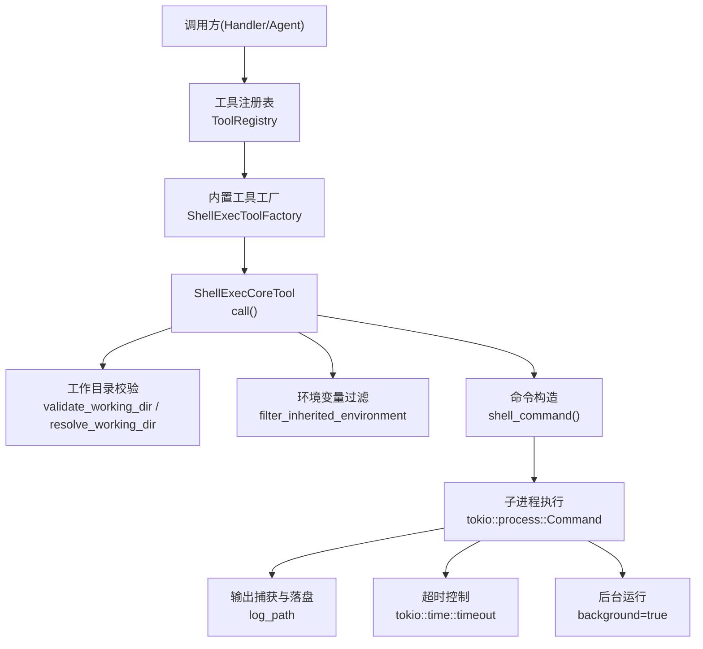
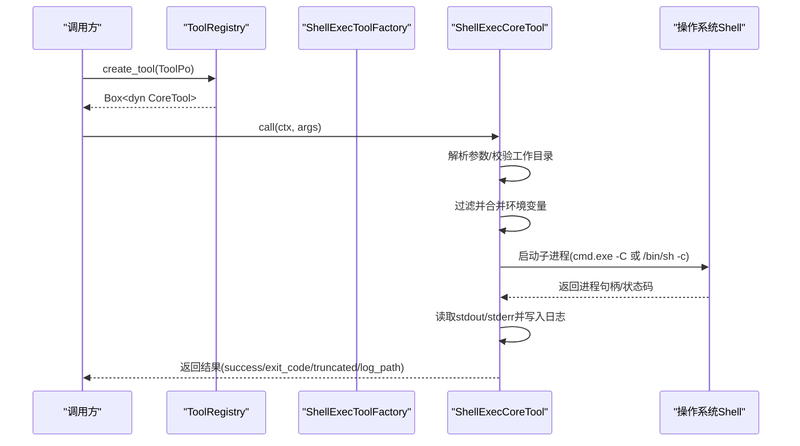
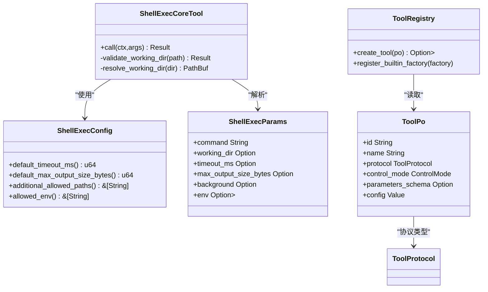
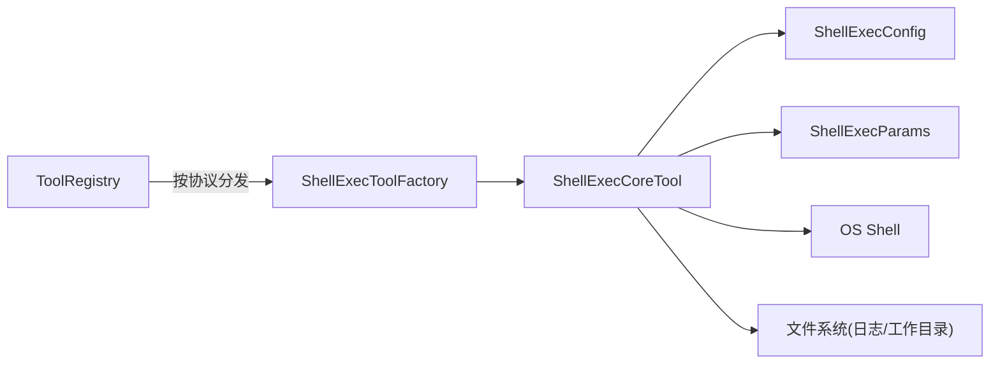

# Shell 执行工具（代码落地层）

<cite>
**本文引用的文件**
- [shell_exec.rs](src/pkg/tool_registry/shell_exec.rs)
- [tool_security.rs](src/pkg/tool_registry/tool_security.rs)
- [mod.rs](src/pkg/tool_registry/mod.rs)
- [tool.rs](common/src/enums/tool.rs)
- [config.rs](src/config.rs)
- [ai_orz.toml](common/config/ai_orz.toml)
- [shell_tests.rs](src/pkg/tool_registry/shell_tests.rs)
</cite>

## 目录
1. [简介](#简介)
2. [项目结构](#项目结构)
3. [核心组件](#核心组件)
4. [架构总览](#架构总览)
5. [详细组件分析](#详细组件分析)
6. [依赖关系分析](#依赖关系分析)
7. [性能与资源限制](#性能与资源限制)
8. [故障排查指南](#故障排查指南)
9. [结论](#结论)
10. [附录：使用示例与安全最佳实践](#附录使用示例与安全最佳实践)

## 简介
本文件为"Shell 执行工具"的完整技术文档，聚焦于安全沙箱、命令白名单与环境变量控制、参数绑定、输出处理、错误捕获、超时控制、进程管理与资源清理。该工具以内置工具（Builtin）形式注册到全局工具注册表，通过统一的 CoreTool 接口调用，支持同步短命令与后台长任务，具备工作目录白名单、环境变量白名单与敏感信息过滤、输出大小限制与日志落盘等能力。

> 📌 视角说明（AGENTS §2.1.3 Level 3 互补视角平行卡）：
> 本长文是「Shell 执行工具」主题的 **代码落地层** 视角。同主题还有以下平行视角卡，请按需交叉阅读：
> - [Shell 执行工具（业务功能层）](docs/wiki/zh/content/功能模块/工具生态系统/内置工具集/Shell%20执行工具.md)
> - [Shell 执行工具（框架层）](docs/wiki/zh/content/基础设施/工具注册表/Shell%20执行工具.md)

## 项目结构
Shell 执行工具位于 pkg/tool_registry 子模块中，围绕以下关键文件组织：
- shell_exec.rs：实现 ShellExecCoreTool、配置、参数解析、环境过滤、命令执行、超时与输出处理、日志落盘。
- tool_security.rs：提供通用安全能力（如路径校验、敏感文件名检测、网络 SSRF 防护等），被文件系统类工具复用。
- mod.rs：全局工具注册表，负责按协议分发创建具体工具实例。
- common/enums/tool.rs：工具协议与控制模式枚举（Builtin/Http/Mcp；Auto/Manual）。
- src/config.rs：应用配置加载，提供 base_data_path 等运行时基础路径。
- common/config/ai_orz.toml：默认配置文件模板。
- shell_tests.rs：针对配置解析、环境变量过滤、参数解析的单元测试。

图表来源
- [mod.rs:29-102](src/pkg/tool_registry/mod.rs#L29-L102)
- [shell_exec.rs:93-149](src/pkg/tool_registry/shell_exec.rs#L93-L149)
- [shell_exec.rs:158-484](src/pkg/tool_registry/shell_exec.rs#L158-L484)

章节来源
- [mod.rs:29-102](src/pkg/tool_registry/mod.rs#L29-L102)
- [shell_exec.rs:93-149](src/pkg/tool_registry/shell_exec.rs#L93-L149)

## 核心组件
- ShellExecConfig：工具配置项，包含默认超时、最大输出字节数、额外允许路径、允许的环境变量名白名单。
- ShellExecParams：调用参数，包括 command、working_dir、timeout_ms、max_output_size_bytes、background、env。
- ShellExecCoreTool：实现 CoreTool::call，完成参数校验、工作目录校验、环境准备、命令执行、输出处理、超时与后台模式。
- ToolRegistry：全局注册表，按协议分发创建工具实例；shell_exec 作为 Builtin 类型注册。
- tool_security.fs：提供路径与敏感文件名校验能力，供文件系统工具使用（与 Shell 工具共享安全理念）。

章节来源
- [shell_exec.rs:21-68](src/pkg/tool_registry/shell_exec.rs#L21-L68)
- [shell_exec.rs:71-87](src/pkg/tool_registry/shell_exec.rs#L71-L87)
- [shell_exec.rs:152-166](src/pkg/tool_registry/shell_exec.rs#L152-L166)
- [mod.rs:29-102](src/pkg/tool_registry/mod.rs#L29-L102)
- [tool_security.rs:315-487](src/pkg/tool_registry/tool_security.rs#L315-L487)

## 架构总览
Shell 执行工具遵循“适配器→领域→数据访问”的分层原则，本工具属于 Adapter 层的内置工具实现，通过统一 CoreTool 接口暴露给上层调用者。工具实例由 ToolRegistry 根据 ToolPo 中的协议类型分发创建，ShellExec 对应 Builtin 协议。

图表来源
- [mod.rs:81-102](src/pkg/tool_registry/mod.rs#L81-L102)
- [shell_exec.rs:256-466](src/pkg/tool_registry/shell_exec.rs#L256-L466)

## 详细组件分析

### 安全沙箱机制
- 工作目录白名单
  - 相对路径：始终视为在基目录下。
  - 绝对路径：必须落在 base_data_path 或 additional_allowed_paths 之一内，否则拒绝执行并要求确认。
  - 参考路径解析与校验逻辑。
- 环境变量白名单与敏感过滤
  - 仅继承父进程环境中在白名单内的变量名。
  - 即使出现在白名单中，若键名命中敏感词（如 home、password、token、secret、api_key、aws_*、google_application_credentials、ssh_auth_sock、git_config、git_ssh 等），也会被过滤掉。
  - 支持通过 env 参数追加额外环境变量，最终合并到基础环境。
- 命令执行隔离
  - 通过系统 Shell 执行：Windows 使用 cmd.exe /C，Unix 使用 /bin/sh -c。
  - 工作目录强制设置为用户指定的 working_dir（不存在则自动创建）。
- 输出与日志
  - 同步模式：捕获 stdout/stderr 并写入日志文件；超过 max_output_size_bytes 时截断响应体，但完整输出仍保存到日志文件。
  - 后台模式：将 stdout/stderr 直接重定向到日志文件，立即返回 PID 与 log_path。
- 路径与敏感文件保护（FS 工具共用）
  - 禁止访问敏感文件名（如 .env、.pem、.key、id_rsa 等）与隐藏文件。
  - 路径规范化后检查是否在允许范围内，拒绝符号链接。

章节来源
- [shell_exec.rs:168-207](src/pkg/tool_registry/shell_exec.rs#L168-L207)
- [shell_exec.rs:210-254](src/pkg/tool_registry/shell_exec.rs#L210-L254)
- [shell_exec.rs:295-356](src/pkg/tool_registry/shell_exec.rs#L295-L356)
- [shell_exec.rs:357-466](src/pkg/tool_registry/shell_exec.rs#L357-L466)
- [tool_security.rs:315-487](src/pkg/tool_registry/tool_security.rs#L315-L487)

### 支持的命令类型与参数绑定
- 命令类型
  - 任意可通过系统 Shell 执行的命令（Windows: cmd.exe；Unix: /bin/sh）。
- 参数绑定
  - command：必填，字符串，表示要执行的命令。
  - working_dir：可选，工作目录；相对路径基于 base_data_path 解析。
  - timeout_ms：可选，覆盖默认超时（毫秒）。
  - max_output_size_bytes：可选，覆盖默认最大输出大小（字节）。
  - background：可选，是否后台运行；true 时不等待进程结束。
  - env：可选，键值对形式的附加环境变量。
- 配置项
  - default_timeout_ms：默认超时（毫秒）。
  - default_max_output_size_bytes：默认最大输出（字节）。
  - additional_allowed_paths：额外允许的工作目录前缀。
  - allowed_env：允许从父进程继承的环境变量名白名单。

章节来源
- [shell_exec.rs:21-68](src/pkg/tool_registry/shell_exec.rs#L21-L68)
- [shell_exec.rs:71-87](src/pkg/tool_registry/shell_exec.rs#L71-L87)
- [shell_exec.rs:107-139](src/pkg/tool_registry/shell_exec.rs#L107-L139)

### 环境变量传递
- 继承规则
  - 仅允许白名单中的环境变量名从父进程传入。
  - 敏感键名一律过滤，避免泄露密钥、令牌、SSH 会话等。
- 扩展规则
  - 通过 env 参数注入的变量会合并到基础环境，用于特定命令需要但不希望全局暴露的场景。

章节来源
- [shell_exec.rs:210-254](src/pkg/tool_registry/shell_exec.rs#L210-L254)

### 输出处理、错误捕获与资源清理
- 输出处理
  - 同步模式：读取 stdout 与 stderr，拼接后写入日志文件；响应体最多返回 max_output_size_bytes 字节，超出部分以“已截断”提示并附带日志路径。
  - 后台模式：stdout/stderr 直接写入日志文件，不阻塞返回。
- 错误捕获
  - 进程启动失败：返回 success=false 并附带错误信息与日志路径。
  - 等待失败：尝试 kill 子进程并返回错误。
  - 超时：kill 子进程，返回超时标志与超时时长。
- 资源清理
  - 超时或错误时显式调用 kill 终止子进程。
  - 日志文件路径固定为 base_data_path/tools/shell_exec/logs/{trace_id}.log，便于审计与回溯。

章节来源
- [shell_exec.rs:357-466](src/pkg/tool_registry/shell_exec.rs#L357-L466)

### 超时控制、进程管理与资源限制
- 超时控制
  - 使用 tokio::time::timeout 包裹 wait，超时后终止进程。
  - 默认超时来自配置 default_timeout_ms，可被请求级 timeout_ms 覆盖。
- 进程管理
  - 后台模式：spawn 后立即返回 PID 与日志路径，不持有进程句柄。
  - 同步模式：持有进程句柄直至完成或超时。
- 资源限制
  - 输出大小限制：响应体最多返回 max_output_size_bytes 字节，完整输出仍落盘。
  - 工作目录限制：严格限制在 base_data_path 或 additional_allowed_paths 内。

章节来源
- [shell_exec.rs:281-287](src/pkg/tool_registry/shell_exec.rs#L281-L287)
- [shell_exec.rs:385-466](src/pkg/tool_registry/shell_exec.rs#L385-L466)

### 类图（代码级）

图表来源
- [shell_exec.rs:21-68](src/pkg/tool_registry/shell_exec.rs#L21-L68)
- [shell_exec.rs:71-87](src/pkg/tool_registry/shell_exec.rs#L71-L87)
- [shell_exec.rs:152-166](src/pkg/tool_registry/shell_exec.rs#L152-L166)
- [mod.rs:29-102](src/pkg/tool_registry/mod.rs#L29-L102)
- [tool.rs:9-22](common/src/enums/tool.rs#L9-L22)

## 依赖关系分析
- 工具注册与分发
  - ToolRegistry 维护内置工具工厂映射，按 ToolPo.protocol 分发创建实例。
  - shell_exec 通过实现 BuiltinToolFactory 注册为内置工具。
- 协议与控制模式
  - ToolProtocol 区分 Builtin/Http/Mcp；ControlMode 区分 Auto/Manual。
  - shell_exec 使用 Builtin 协议与 Manual 控制模式。
- 配置与路径
  - base_data_path 来自应用配置，所有日志与工作目录均以其为根。
  - 默认配置文件模板位于 common/config/ai_orz.toml。

图表来源
- [mod.rs:29-102](src/pkg/tool_registry/mod.rs#L29-L102)
- [shell_exec.rs:93-149](src/pkg/tool_registry/shell_exec.rs#L93-L149)
- [config.rs:38-73](src/config.rs#L38-L73)

章节来源
- [mod.rs:29-102](src/pkg/tool_registry/mod.rs#L29-L102)
- [tool.rs:9-22](common/src/enums/tool.rs#L9-L22)
- [config.rs:38-73](src/config.rs#L38-L73)

## 性能与资源限制
- 超时策略
  - 默认超时 300 秒，可通过配置或请求参数调整；超时后强制终止子进程，避免僵尸进程。
- 输出限制
  - 默认最大输出 10MB；超过限制时响应体截断，完整输出保存至日志文件，降低内存占用与网络传输压力。
- 并发与 IO
  - 使用异步 IO 读取流并写入日志，减少阻塞；后台模式避免长时间占用调用线程。
- 路径与权限
  - 工作目录限制在受控范围，防止越权访问；日志文件集中存放便于审计。

[本节为通用性能讨论，不直接分析具体文件]

## 故障排查指南
- 工作目录不在允许范围
  - 现象：返回 require_confirmation 且 error 提示工作目录不在允许路径。
  - 处理：将 working_dir 设置为 base_data_path 或 additional_allowed_paths 下的路径。
- 环境变量未生效
  - 现象：命令找不到依赖或行为异常。
  - 处理：检查 allowed_env 白名单是否包含所需变量；必要时通过 env 参数注入。
- 输出过大导致响应不完整
  - 现象：响应体 truncated=true 并附带日志路径。
  - 处理：查看日志文件获取完整输出；适当增大 max_output_size_bytes。
- 超时
  - 现象：返回 timeout=true 与超时时长。
  - 处理：优化命令耗时或增大 timeout_ms；检查是否存在死锁或外部依赖缓慢。
- 进程未退出
  - 现象：后台进程仍在运行。
  - 处理：通过返回的 PID 进行进程管理；确保业务侧有清理策略。

章节来源
- [shell_exec.rs:264-273](src/pkg/tool_registry/shell_exec.rs#L264-L273)
- [shell_exec.rs:385-466](src/pkg/tool_registry/shell_exec.rs#L385-L466)

## 结论
Shell 执行工具通过工作目录白名单、环境变量白名单与敏感过滤、输出大小限制、超时控制与后台模式，提供了安全可控的 Shell 命令执行能力。其设计遵循分层与单向调用原则，集成到全局工具注册表中，便于统一管理、审计与扩展。建议在生产环境中严格配置 allowed_env、additional_allowed_paths 与超时/输出限制，并结合日志与监控进行持续治理。

[本节为总结性内容，不直接分析具体文件]

## 附录：使用示例与安全最佳实践

### 安全最佳实践
- 最小化环境变量传播
  - 仅将必要变量加入 allowed_env；避免 PATH 以外的系统变量泄露。
  - 不要将密钥、令牌、SSH 会话等敏感信息放入环境变量。
- 严格限制工作目录
  - 使用 base_data_path 或 additional_allowed_paths 限定可访问目录。
  - 避免使用绝对路径指向系统敏感区域。
- 合理设置超时与输出限制
  - 根据命令特性设置合适的 timeout_ms 与 max_output_size_bytes。
  - 对长任务使用 background=true，并通过日志文件追踪输出。
- 审计与回滚
  - 所有执行均有日志落盘，记录 trace_id 对应的日志路径。
  - 结合监控系统对失败率、超时率进行告警。

章节来源
- [shell_exec.rs:210-254](src/pkg/tool_registry/shell_exec.rs#L210-L254)
- [shell_exec.rs:295-356](src/pkg/tool_registry/shell_exec.rs#L295-L356)
- [shell_exec.rs:385-466](src/pkg/tool_registry/shell_exec.rs#L385-L466)

### 常见使用场景示例（描述性）
- 执行短命令并获取输出
  - 参数：command="echo hello"，working_dir 可选，timeout_ms 可选，background=false。
  - 预期：返回 success、exit_code、output（可能截断）、log_path。
- 执行编译或构建任务
  - 参数：command="cargo build"，working_dir 指向项目目录，timeout_ms 适当增大，background=false。
  - 注意：确保 working_dir 在允许范围内；如需额外环境变量，通过 env 注入。
- 后台运行长任务
  - 参数：command 为长耗时命令，background=true。
  - 预期：返回 success、background=true、pid、log_path；通过日志文件观察进度。
- 受限环境执行
  - 参数：仅允许 PATH 环境变量，working_dir 限制在项目目录。
  - 目的：最小化攻击面，避免敏感信息泄露与越权访问。

章节来源
- [shell_exec.rs:71-87](src/pkg/tool_registry/shell_exec.rs#L71-L87)
- [shell_exec.rs:107-139](src/pkg/tool_registry/shell_exec.rs#L107-L139)
- [shell_exec.rs:256-466](src/pkg/tool_registry/shell_exec.rs#L256-L466)

### 测试与验证
- 配置解析与默认值
  - 空配置应解析为默认超时与输出限制；PATH 默认允许。
- 环境变量过滤
  - 白名单外的变量不应出现；敏感变量即使出现在白名单也应被过滤。
- 参数解析
  - 基本与完整参数均应正确解析，包括 command、working_dir、timeout_ms、max_output_size_bytes、background、env。

章节来源
- [shell_tests.rs:4-20](src/pkg/tool_registry/shell_tests.rs#L4-L20)
- [shell_tests.rs:22-41](src/pkg/tool_registry/shell_tests.rs#L22-L41)
- [shell_tests.rs:43-78](src/pkg/tool_registry/shell_tests.rs#L43-L78)
- [shell_tests.rs:80-102](src/pkg/tool_registry/shell_tests.rs#L80-L102)
- [shell_tests.rs:104-145](src/pkg/tool_registry/shell_tests.rs#L104-L145)