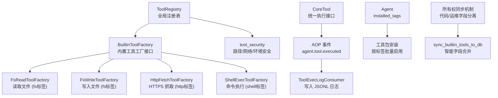
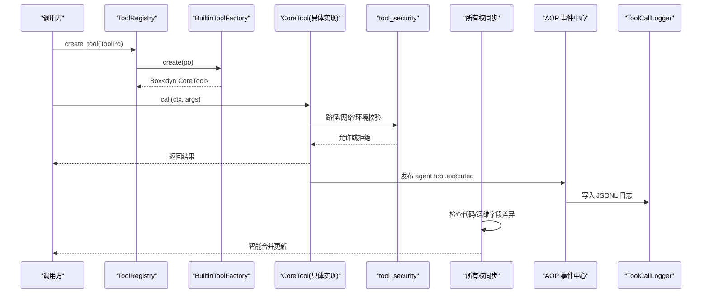
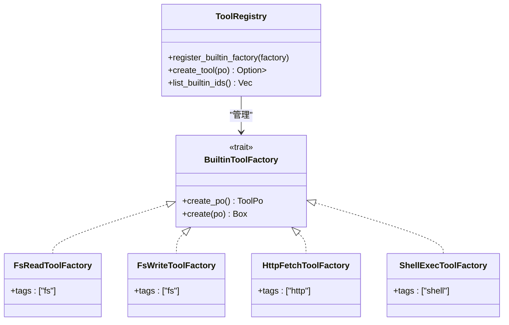
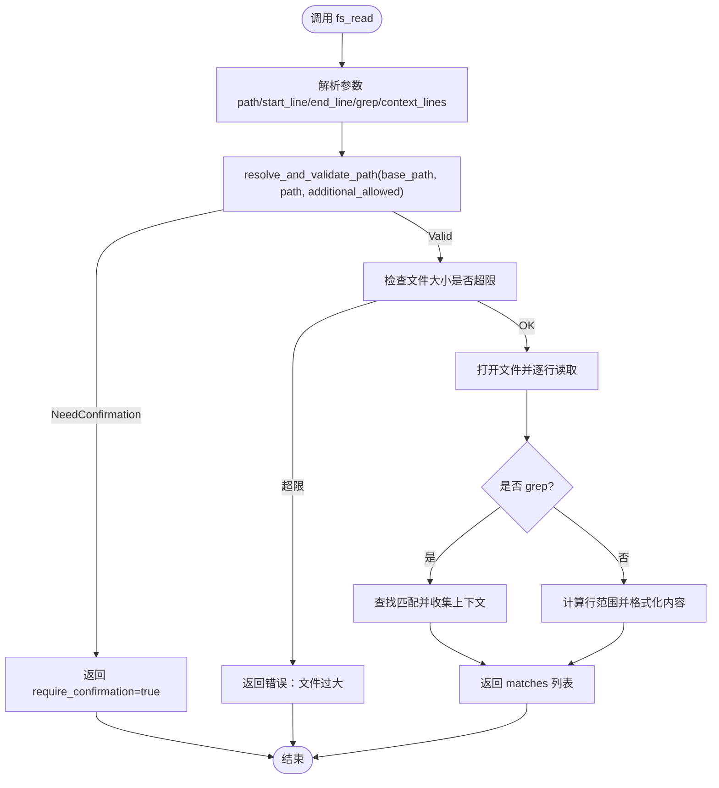
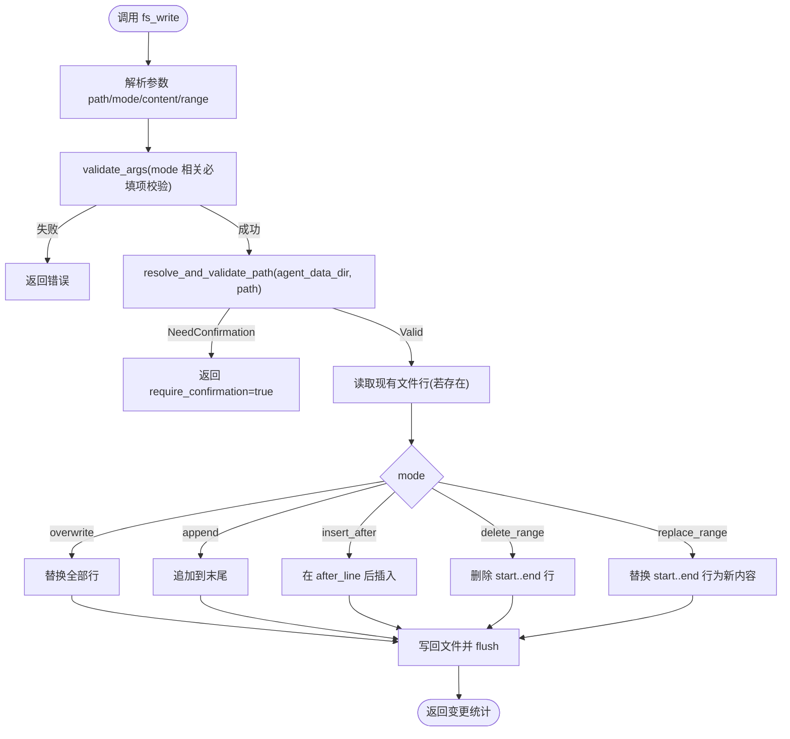
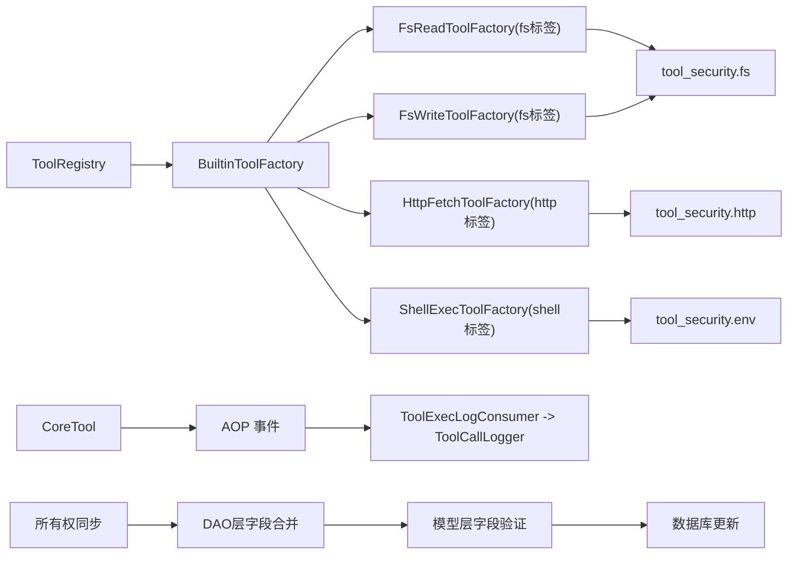

# 内置工具系统（代码落地层）

<cite>
**本文引用的文件**
- [src/pkg/tool_registry/mod.rs](src/pkg/tool_registry/mod.rs)
- [src/pkg/tool_registry/builtin.rs](src/pkg/tool_registry/builtin.rs)
- [src/pkg/tool_registry/fs_read.rs](src/pkg/tool_registry/fs_read.rs)
- [src/pkg/tool_registry/fs_write.rs](src/pkg/tool_registry/fs_write.rs)
- [src/pkg/tool_registry/shell_exec.rs](src/pkg/tool_registry/shell_exec.rs)
- [src/pkg/tool_registry/http_fetch.rs](src/pkg/tool_registry/http_fetch.rs)
- [src/pkg/tool_registry/tool_security.rs](src/pkg/tool_registry/tool_security.rs)
- [src/models/tool.rs](src/models/tool.rs)
- [src/service/dao/tool/sqlite.rs](src/service/dao/tool/sqlite.rs)
- [src/service/dal/tool_test.rs](src/service/dal/tool_test.rs)
- [common/src/api/tool.rs](common/src/api/tool.rs)
- [src/handlers/finance/tool/list_tool_tags.rs](src/handlers/finance/tool/list_tool_tags.rs)
- [src/consumer/tool_exec_log_consumer.rs](src/consumer/tool_exec_log_consumer.rs)
- [src/pkg/tool_tracing/mod.rs](src/pkg/tool_tracing/mod.rs)
</cite>

## 更新摘要
**变更内容**
- 新增所有权字段同步机制：区分代码所有权字段（name、description、control_mode、parameters_schema、tags）与运维所有权字段（config、status），确保版本升级时自动对齐工具定义同时保留用户自定义配置
- 增强内置工具同步逻辑：在 sync_builtin_tools_to_db 中实现智能字段合并，避免覆盖运维配置
- 完善测试覆盖：新增所有权分界刷新的集成测试，验证代码字段刷新和运维字段保留的正确性
- 优化元数据管理：通过 fill_defaults_for_builtin 确保内置工具的默认值设置

## 目录
1. [简介](#简介)
2. [项目结构](#项目结构)
3. [核心组件](#核心组件)
4. [架构总览](#架构总览)
5. [详细组件分析](#详细组件分析)
6. [依赖关系分析](#依赖关系分析)
7. [性能与资源限制](#性能与资源限制)
8. [故障排查指南](#故障排查指南)
9. [结论](#结论)
10. [附录：自定义内置工具开发指南](#附录自定义内置工具开发指南)

## 简介
本文件面向内置工具系统的实现与使用，重点说明工厂模式设计、文件系统读写工具（fs_read、fs_write）的功能与参数、元数据定义、权限控制与沙箱隔离机制、测试策略、错误处理与日志记录，并提供扩展新内置工具的实践指南与常见问题解决方案。

**更新** 新增所有权字段同步机制，支持代码所有权字段与运维所有权字段的智能合并，确保版本升级时既能保持工具定义的统一性，又能保留用户的个性化配置。

> 📌 视角说明（AGENTS §2.1.3 Level 3 互补视角平行卡）：
> 本长文是「内置工具系统」主题的 **代码落地层** 视角。同主题还有以下平行视角卡，请按需交叉阅读：
> - [内置工具系统（框架层）](docs/wiki/zh/content/基础设施/工具注册表/内置工具系统/内置工具系统.md)

## 项目结构
内置工具系统位于 src/pkg/tool_registry 下，采用"注册表 + 工厂"的解耦设计：
- 全局注册表 ToolRegistry 维护各协议的工厂集合，按协议分发创建实例。
- 内置工具通过 BuiltinToolFactory 接口提供默认 ToolPo 与运行时实例构造。
- 安全能力集中在 tool_security 模块，统一约束路径、网络、环境变量等。
- 执行结果与调用轨迹通过 AOP 事件与 ToolCallLogger 持久化。
- **新增** 所有权字段同步机制：在数据库同步过程中智能区分并处理不同所有权的字段。

**图表来源**
- [src/pkg/tool_registry/mod.rs:29-102](src/pkg/tool_registry/mod.rs#L29-L102)
- [src/pkg/tool_registry/builtin.rs:17-43](src/pkg/tool_registry/builtin.rs#L17-L43)
- [src/pkg/tool_registry/tool_security.rs:314-486](src/pkg/tool_registry/tool_security.rs#L314-L486)
- [src/consumer/tool_exec_log_consumer.rs:26-50](src/consumer/tool_exec_log_consumer.rs#L26-L50)
- [src/service/dao/tool/sqlite.rs:344-411](src/service/dao/tool/sqlite.rs#L344-L411)

**章节来源**
- [src/pkg/tool_registry/mod.rs:29-102](src/pkg/tool_registry/mod.rs#L29-L102)
- [src/pkg/tool_registry/builtin.rs:17-43](src/pkg/tool_registry/builtin.rs#L17-L43)

## 核心组件
- CoreTool 统一执行接口：所有工具必须实现 call(ctx, args) 与 po()，便于上层以统一方式调度与追踪。
- ToolRegistry 全局注册表：存储工厂而非实例，按协议分发创建；支持内置、MCP、HTTP 三类工具。
- BuiltinToolFactory 内置工厂接口：每个内置工具提供 create_po() 生成默认元数据，create(po) 构建可执行实例。
- tool_security 安全库：提供路径校验、敏感文件名拦截、SSRF 防护、响应体大小限制、环境变量白名单等。
- ToolTracing + Consumer：通过 AOP 事件 agent.tool.executed 将工具调用轨迹写入 JSONL 日志。
- **新增** 所有权字段同步机制：在工具同步过程中智能区分代码所有权字段和运维所有权字段，实现安全的版本升级。

**章节来源**
- [src/models/tool.rs:16-34](src/models/tool.rs#L16-L34)
- [src/pkg/tool_registry/mod.rs:29-102](src/pkg/tool_registry/mod.rs#L29-L102)
- [src/pkg/tool_registry/builtin.rs:17-43](src/pkg/tool_registry/builtin.rs#L17-L43)
- [src/pkg/tool_registry/tool_security.rs:1-231](src/pkg/tool_registry/tool_security.rs#L1-L231)
- [src/consumer/tool_exec_log_consumer.rs:26-50](src/consumer/tool_exec_log_consumer.rs#L26-L50)

## 架构总览
下图展示了从请求到工具执行的完整链路：注册表根据协议选择工厂，工厂基于数据库中的 ToolPo 构建具体工具实例，执行时受安全层约束，结果经 AOP 事件落盘为 JSONL 日志。**新增** 所有权字段同步机制确保版本升级时的数据安全。

**图表来源**
- [src/pkg/tool_registry/mod.rs:81-102](src/pkg/tool_registry/mod.rs#L81-L102)
- [src/pkg/tool_registry/builtin.rs:27-43](src/pkg/tool_registry/builtin.rs#L27-L43)
- [src/service/dao/tool/sqlite.rs:344-411](src/service/dao/tool/sqlite.rs#L344-L411)
- [src/consumer/tool_exec_log_consumer.rs:26-50](src/consumer/tool_exec_log_consumer.rs#L26-L50)

## 详细组件分析

### 工厂模式与注册表
- 全局注册表 ToolRegistry 持有内置工厂映射，按 ToolPo.protocol 分派创建逻辑。
- 内置工具通过 GENERIC_BUILTIN_TOOLS 集中声明，启动时批量注册。
- 标签分组：每个工厂在 create_po() 中设置特定的 tags 字段，如 fs_read/fs_write 标记为 "fs"，http_fetch 标记为 "http"，shell_exec 标记为 "shell"。
- 优点：新增内置工具只需实现 BuiltinToolFactory 并加入列表，无需改动调度逻辑。

**图表来源**
- [src/pkg/tool_registry/mod.rs:46-102](src/pkg/tool_registry/mod.rs#L46-L102)
- [src/pkg/tool_registry/builtin.rs:17-43](src/pkg/tool_registry/builtin.rs#L17-L43)
- [src/pkg/tool_registry/fs_read.rs:54-100](src/pkg/tool_registry/fs_read.rs#L54-L100)
- [src/pkg/tool_registry/fs_write.rs:48-96](src/pkg/tool_registry/fs_write.rs#L48-L96)
- [src/pkg/tool_registry/http_fetch.rs:23-48](src/pkg/tool_registry/http_fetch.rs#L23-L48)
- [src/pkg/tool_registry/shell_exec.rs:96-153](src/pkg/tool_registry/shell_exec.rs#L96-L153)

**章节来源**
- [src/pkg/tool_registry/mod.rs:46-102](src/pkg/tool_registry/mod.rs#L46-L102)
- [src/pkg/tool_registry/builtin.rs:27-43](src/pkg/tool_registry/builtin.rs#L27-L43)

### 所有权字段同步机制
**新增功能** 内置工具现在支持智能的所有权字段同步，确保版本升级时的数据安全：

- **字段所有权分类**：
  - 代码所有权字段：name、description、control_mode、parameters_schema、tags（由代码定义，升级时自动刷新）
  - 运维所有权字段：config、status（由运维人员配置，升级时保留现场设置）
- **同步逻辑**：在 sync_builtin_tools_to_db 中实现智能字段合并
  - 检测现有工具是否为内置工具类型
  - 比较代码所有权字段是否有变化
  - 仅当代码字段有变化时才更新，同时保留运维字段
  - 无变化时不写库，避免不必要的数据库操作
- **安全保障**：通过字段级别的精确控制，防止意外覆盖用户配置

**章节来源**
- [src/service/dao/tool/sqlite.rs:370-401](src/service/dao/tool/sqlite.rs#L370-L401)
- [src/service/dal/tool_test.rs:516-560](src/service/dal/tool_test.rs#L516-L560)

### 文件系统读取工具（fs_read）
- 功能特性
  - 支持全文读取、按行号范围读取、grep 风格匹配并附带上下文行。
  - 输出包含行号、匹配位置、前后上下文，便于编辑与定位。
- 参数配置
  - path：必填，相对工作目录的文件路径。
  - start_line/end_line：可选，1 起始的行范围。
  - grep：可选，正则/子串匹配模式。
  - context_lines：可选，匹配前后上下文行数，默认 2。
- 使用场景
  - 代码审查、日志分析、文档检索、变更影响面评估。
- 权限与安全
  - 路径解析与校验：仅允许 base_data_path 或 additional_allowed_paths 下的文件，拒绝符号链接与敏感文件名。
  - 大文件保护：超过硬限制（如 10MB）直接拒绝。
  - 越界访问：返回 require_confirmation=true 提示，要求用户确认后再操作。
- 错误处理
  - 参数解析失败、IO 异常均转换为统一错误类型，错误信息脱敏避免泄露绝对路径。

**图表来源**
- [src/pkg/tool_registry/fs_read.rs:125-216](src/pkg/tool_registry/fs_read.rs#L125-L216)
- [src/pkg/tool_registry/tool_security.rs:314-419](src/pkg/tool_registry/tool_security.rs#L314-L419)

**章节来源**
- [src/pkg/tool_registry/fs_read.rs:15-100](src/pkg/tool_registry/fs_read.rs#L15-L100)
- [src/pkg/tool_registry/fs_read.rs:125-216](src/pkg/tool_registry/fs_read.rs#L125-L216)
- [src/pkg/tool_registry/tool_security.rs:314-419](src/pkg/tool_registry/tool_security.rs#L314-L419)

### 文件系统写入工具（fs_write）
- 功能特性
  - 多种原子写入模式：覆盖写入、追加、插入指定行后、删除行范围、替换行范围。
  - 所有修改在内存中完成后再一次性写回，保证一致性。
- 参数配置
  - path：必填，目标文件路径。
  - mode：必填，枚举值包括 overwrite、append、insert_after、delete_range、replace_range。
  - content：部分模式必填（如 overwrite、append、insert_after、replace_range）。
  - after_line/start_line/end_line：按模式需要传入。
- 使用场景
  - 代码生成、配置文件更新、日志归档、批量文本编辑。
- 权限与安全
  - 基于 Agent 数据目录进行路径隔离，防止跨 Agent 干扰。
  - 同样遵循路径白名单、敏感文件名拦截、符号链接拒绝。
- 错误处理
  - 参数校验失败、IO 异常均返回结构化错误；范围非法会给出明确提示。

**图表来源**
- [src/pkg/tool_registry/fs_write.rs:121-275](src/pkg/tool_registry/fs_write.rs#L121-L275)
- [src/pkg/tool_registry/tool_security.rs:314-419](src/pkg/tool_registry/tool_security.rs#L314-L419)

**章节来源**
- [src/pkg/tool_registry/fs_write.rs:16-100](src/pkg/tool_registry/fs_write.rs#L16-L100)
- [src/pkg/tool_registry/fs_write.rs:121-275](src/pkg/tool_registry/fs_write.rs#L121-L275)
- [src/pkg/tool_registry/fs_write.rs:277-323](src/pkg/tool_registry/fs_write.rs#L277-L323)

### HTTP 抓取工具（http_fetch）
- 功能特性
  - 仅允许 HTTPS 公共 URL，禁止重定向、关闭代理、限制响应体大小。
  - 对响应头进行敏感字段脱敏，返回状态码、头部摘要、内容长度与主体。
- 安全机制
  - SSRF 防护：默认拒绝本地网络与私有 IP，支持域名白/黑名单与 DNS 地址钉扎。
  - 超时与大小限制：默认 30s 超时，响应体最大 1MB（硬上限 10MB）。
- 使用场景
  - 获取公开 API 数据、远程配置、在线文档等。

**章节来源**
- [src/pkg/tool_registry/http_fetch.rs:19-143](src/pkg/tool_registry/http_fetch.rs#L19-L143)
- [src/pkg/tool_registry/tool_security.rs:1-231](src/pkg/tool_registry/tool_security.rs#L1-L231)

### Shell 执行工具（shell_exec）
- 功能特性
  - 支持同步执行（带超时与输出截断）与后台运行（PID 与日志路径返回）。
  - 工作目录限制在白名单内，输出按 trace_id 落盘至 tools/shell_exec/logs。
- 安全机制
  - 环境变量白名单过滤，屏蔽敏感变量名；工作目录校验拒绝越权路径。
  - 输出大小限制，超长输出保存为附件并在响应中提示。
- 使用场景
  - 构建脚本、数据处理、系统信息查询、自动化任务。

**章节来源**
- [src/pkg/tool_registry/shell_exec.rs:20-149](src/pkg/tool_registry/shell_exec.rs#L20-L149)
- [src/pkg/tool_registry/shell_exec.rs:256-466](src/pkg/tool_registry/shell_exec.rs#L256-L466)

### 元数据定义与控制模式
- ToolPo 承载工具元数据：id、name、description、protocol、control_mode、config、parameters_schema、tags、status 等。
- 内置工具通过 fill_defaults_for_builtin 确保 protocol=Builtin 且 control_mode 合理默认。
- 控制模式
  - Auto：由框架自动执行（如 fs_read、http_fetch）。
  - Manual：需人工确认或编排（如 shell_exec）。
- **新增** 所有权字段同步：通过智能合并机制确保代码字段更新的同时保留运维配置。

**章节来源**
- [src/models/tool.rs:57-88](src/models/tool.rs#L57-88)
- [src/models/tool.rs:244-283](src/models/tool.rs#L244-283)
- [src/models/tool.rs:259-265](src/models/tool.rs#L259-265)
- [src/pkg/tool_registry/fs_read.rs:54-100](src/pkg/tool_registry/fs_read.rs#L54-100)
- [src/pkg/tool_registry/fs_write.rs:48-96](src/pkg/tool_registry/fs_write.rs#L48-96)
- [src/pkg/tool_registry/shell_exec.rs:93-144](src/pkg/tool_registry/shell_exec.rs#L93-144)

### 权限控制与沙箱隔离
- 文件系统
  - resolve_and_validate_path：基路径 + 额外白名单校验，拒绝符号链接与敏感文件名。
  - fs_write 基于 agent_data_dir 隔离不同 Agent 的数据目录。
- 网络
  - validate_target_url：默认拒绝本地网络，支持域名白/黑名单与 DNS 钉扎。
- 环境变量
  - filter_inherited_environment：仅传递白名单环境变量，屏蔽敏感键名。

**章节来源**
- [src/pkg/tool_registry/tool_security.rs:314-486](src/pkg/tool_registry/tool_security.rs#L314-486)
- [src/pkg/tool_registry/fs_write.rs:132-144](src/pkg/tool_registry/fs_write.rs#L132-144)
- [src/pkg/tool_registry/shell_exec.rs:210-254](src/pkg/tool_registry/shell_exec.rs#L210-254)

### 测试策略
- 单元测试
  - 路径校验与敏感文件名检测：验证正常路径通过、敏感路径拒绝。
  - 参数校验：覆盖各 mode 的必填项组合。
  - HTTP 抓取：验证 HTTPS 允许、HTTP 拒绝、本地/私有 IP 拒绝。
  - **新增** 所有权字段同步测试：验证代码字段刷新和运维字段保留的正确性。
- 集成测试
  - 工具调用流程、AOP 事件消费、JSONL 日志落盘。
  - **新增** 所有权同步集成测试：模拟存量工具升级场景，验证字段合并逻辑。
- 建议
  - 针对边界条件（空输入、超大文件、超时、权限不足）补充用例。
  - 使用临时目录与模拟网络环境提升稳定性。

**章节来源**
- [src/pkg/tool_registry/fs_tests.rs:12-81](src/pkg/tool_registry/fs_tests.rs#L12-81)
- [src/pkg/tool_registry/fs_write.rs:325-426](src/pkg/tool_registry/fs_write.rs#L325-426)
- [src/pkg/tool_registry/http_fetch.rs:145-243](src/pkg/tool_registry/http_fetch.rs#L145-243)
- [src/service/dal/tool_test.rs:516-560](src/service/dal/tool_test.rs#L516-560)

### 错误处理与日志记录
- 错误处理
  - 统一使用 common::error::Result 包装错误，关键错误信息脱敏（如路径）。
  - 越权访问返回 require_confirmation=true，交由上层引导用户确认。
- 日志记录
  - 工具执行完成后发布 agent.tool.executed 事件。
  - ToolExecLogConsumer 订阅事件并写入 ToolCallLogger（每日 JSONL），便于审计与回溯。

**章节来源**
- [src/pkg/tool_registry/fs_read.rs:127-176](src/pkg/tool_registry/fs_read.rs#L127-176)
- [src/pkg/tool_registry/fs_write.rs:123-171](src/pkg/tool_registry/fs_write.rs#L123-171)
- [src/consumer/tool_exec_log_consumer.rs:26-50](src/consumer/tool_exec_log_consumer.rs#L26-50)
- [src/pkg/tool_tracing/mod.rs:1-13](src/pkg/tool_tracing/mod.rs#L1-13)

## 依赖关系分析
- 低耦合：ToolRegistry 不感知具体工具实现，仅依赖 BuiltinToolFactory 接口。
- 安全内聚：tool_security 被多个工具复用，避免重复实现。
- 可观测性：CoreTool 执行结果通过 AOP 事件解耦日志写入。
- **新增** 所有权同步依赖：DAO 层与模型层的紧密协作，确保字段同步的安全性。

**图表来源**
- [src/pkg/tool_registry/mod.rs:46-102](src/pkg/tool_registry/mod.rs#L46-102)
- [src/pkg/tool_registry/tool_security.rs:1-231](src/pkg/tool_registry/tool_security.rs#L1-231)
- [src/service/dao/tool/sqlite.rs:344-411](src/service/dao/tool/sqlite.rs#L344-411)
- [src/consumer/tool_exec_log_consumer.rs:26-50](src/consumer/tool_exec_log_consumer.rs#L26-50)

**章节来源**
- [src/pkg/tool_registry/mod.rs:46-102](src/pkg/tool_registry/mod.rs#L46-102)
- [src/pkg/tool_registry/tool_security.rs:1-231](src/pkg/tool_registry/tool_security.rs#L1-231)

## 性能与资源限制
- 文件读取
  - 硬限制：单次读取最大 10MB，避免 OOM。
  - 流式读取：按行缓冲，减少内存占用。
- 文件写入
  - 内存中先构建新行集再一次性写回，保证原子性；注意大文件写入时的内存峰值。
- HTTP 抓取
  - 默认响应体限制 1MB，硬上限 10MB；禁用重定向与代理，降低攻击面。
- Shell 执行
  - 默认超时 5 分钟，输出上限 10MB；超长输出落盘并以摘要返回。
- **新增** 所有权同步优化
  - 字段差异检测仅在必要时触发数据库更新
  - 无变化时跳过写操作，减少数据库负载
  - 增量更新策略避免全量覆盖
- 建议
  - 对超大文件启用分页/范围读取。
  - 对长耗时任务优先使用 background 模式并监控日志。

## 故障排查指南
- 路径访问被拒
  - 检查是否命中敏感文件名规则或不在白名单路径内；必要时添加 additional_allowed_paths。
- 文件过大
  - fs_read 超过 10MB 会被拒绝；改用 grep 或范围读取。
- 网络请求失败
  - 确认目标为 HTTPS 且非本地/私有 IP；如需访问内网，需在配置中显式允许。
- Shell 执行超时
  - 调整 timeout_ms 或改为 background 模式；查看 tools/shell_exec/logs/{trace_id}.log。
- 日志缺失
  - 确认 AOP 事件已发布且 ToolExecLogConsumer 已注册；检查 JSONL 日志目录权限。
- **新增** 所有权同步问题
  - 检查工具是否为内置工具类型（protocol = Builtin）
  - 确认代码所有权字段确实发生了变化
  - 验证数据库更新语句是否正确执行
  - 检查是否存在并发冲突导致更新失败

**章节来源**
- [src/pkg/tool_registry/fs_read.rs:150-165](src/pkg/tool_registry/fs_read.rs#L150-165)
- [src/pkg/tool_registry/http_fetch.rs:74-90](src/pkg/tool_registry/http_fetch.rs#L74-90)
- [src/pkg/tool_registry/shell_exec.rs:281-287](src/pkg/tool_registry/shell_exec.rs#L281-287)
- [src/consumer/tool_exec_log_consumer.rs:40-50](src/consumer/tool_exec_log_consumer.rs#L40-50)
- [src/service/dao/tool/sqlite.rs:370-401](src/service/dao/tool/sqlite.rs#L370-401)

## 结论
内置工具系统通过工厂模式与注册表实现了高内聚、低耦合的工具生态。fs_read 与 fs_write 提供了安全可控的文件操作能力，配合严格的路径与权限校验，满足多 Agent 协作场景下的数据安全需求。HTTP 抓取与 Shell 执行进一步扩展了外部交互能力，并通过 AOP 与 JSONL 日志保障可观测性。**新增的所有权字段同步机制**使得工具管理更加安全可靠，支持版本升级时既能保持工具定义的统一性，又能保留用户的个性化配置，提升了系统的可维护性和用户体验。遵循本文档的开发指南与最佳实践，可高效扩展新的内置工具并保持系统稳定与安全。

## 附录：自定义内置工具开发指南
- 步骤概览
  1. 实现 BuiltinToolFactory：提供 create_po() 定义默认元数据（id/name/description/parameters_schema/config/control_mode/tags），以及 create(po) 返回 Box<dyn CoreTool>。
  2. 实现 CoreTool：在 call(ctx, args) 中解析参数、执行安全校验、执行业务逻辑并返回 JSON 结果。
  3. 注册工具：在 GENERIC_BUILTIN_TOOLS 中添加 (id, factory)。
  4. 编写测试：覆盖参数校验、安全边界、错误分支与日志落盘。
- 最佳实践
  - 始终使用 tool_security 提供的校验函数，避免自行实现安全逻辑。
  - 对敏感信息进行脱敏，避免在错误消息中泄露路径或密钥。
  - 对长耗时或大数据量操作设置超时与大小限制，必要时采用后台模式。
  - 使用 RequestContext 传递 agent_id、trace_id 等上下文，便于隔离与追踪。
  - **新增** 正确设置工具标签：根据功能域选择合适的标签，便于后续管理和发现。
  - **新增** 考虑所有权字段：理解代码所有权字段和运维所有权字段的区别，合理设计工具的默认配置。
- 常见问题
  - 无法访问路径：检查 base_data_path 与 additional_allowed_paths 配置是否正确。
  - 参数校验失败：核对 parameters_schema 与实际入参类型是否一致。
  - 日志未写入：确认 AOP 事件已发布且消费者已注册。
  - **新增** 所有权同步异常：检查工具协议类型、字段差异检测逻辑、数据库连接状态。
  - **新增** 版本升级问题：确认 sync_builtin_tools_to_db 正确执行，验证字段合并逻辑。
- 示例参考（路径引用）
  - 工厂与注册：[src/pkg/tool_registry/builtin.rs:27-43](src/pkg/tool_registry/builtin.rs#L27-43)
  - 读取工具实现：[src/pkg/tool_registry/fs_read.rs:54-100](src/pkg/tool_registry/fs_read.rs#L54-100)
  - 写入工具实现：[src/pkg/tool_registry/fs_write.rs:48-96](src/pkg/tool_registry/fs_write.rs#L48-96)
  - 安全校验：[src/pkg/tool_registry/tool_security.rs:314-486](src/pkg/tool_registry/tool_security.rs#L314-486)
  - 日志记录：[src/consumer/tool_exec_log_consumer.rs:26-50](src/consumer/tool_exec_log_consumer.rs#L26-50)
  - **新增** 所有权同步：[src/service/dao/tool/sqlite.rs:344-411](src/service/dao/tool/sqlite.rs#L344-411)
  - **新增** 同步测试：[src/service/dal/tool_test.rs:516-560](src/service/dal/tool_test.rs#L516-560)