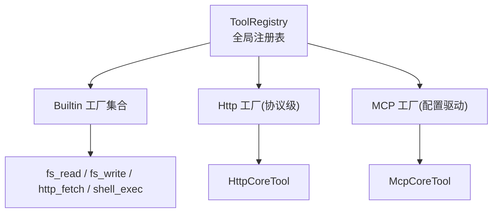
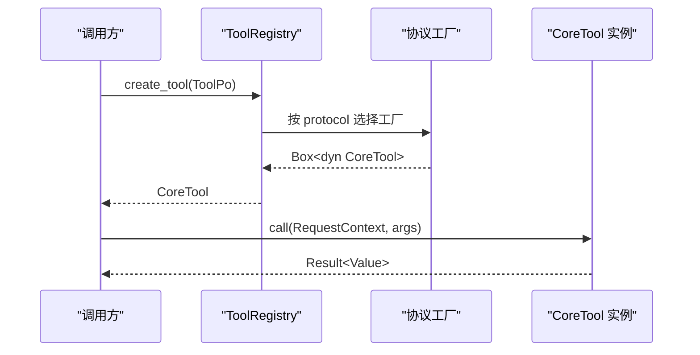
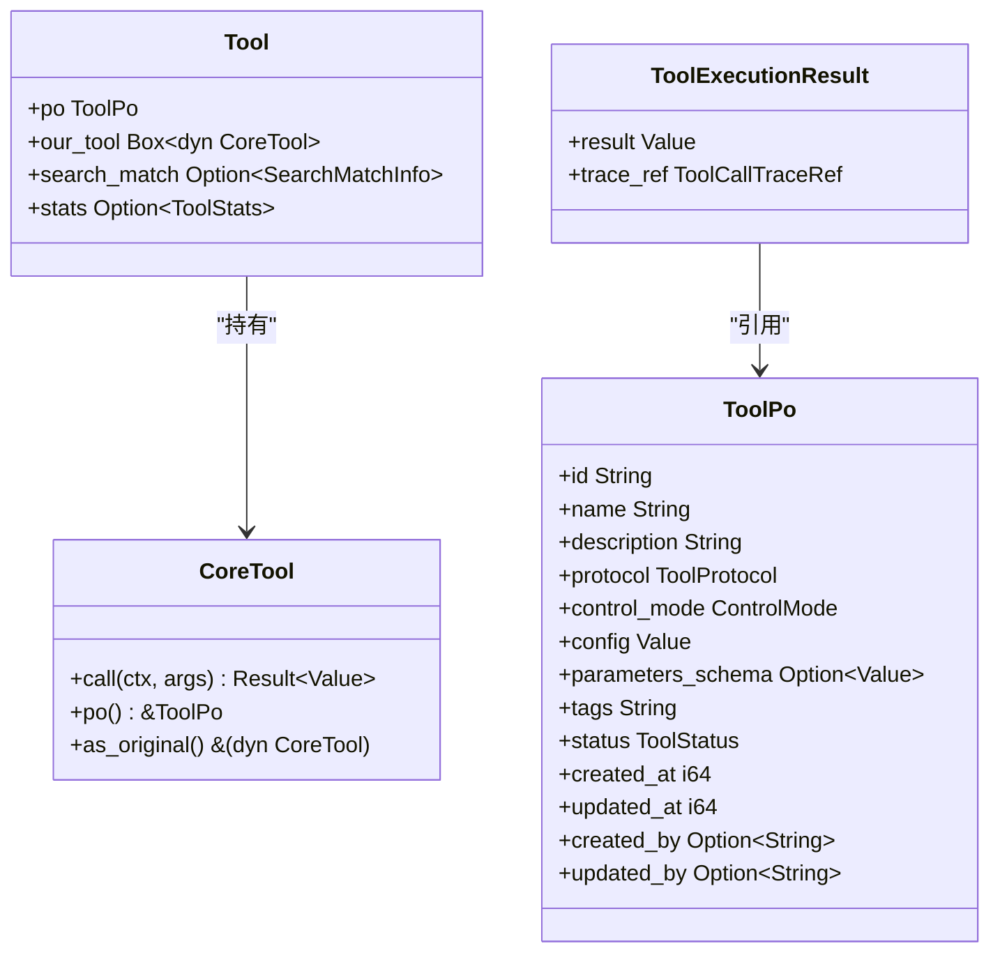
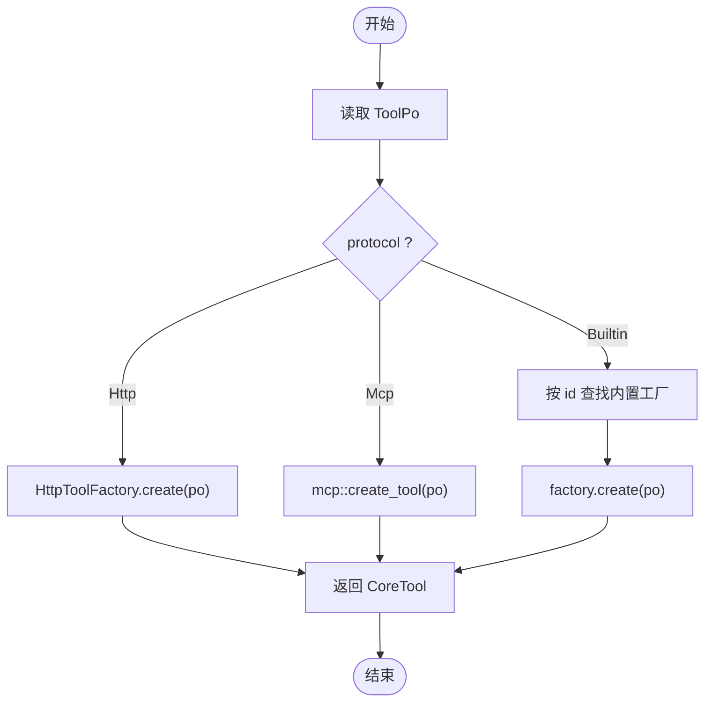
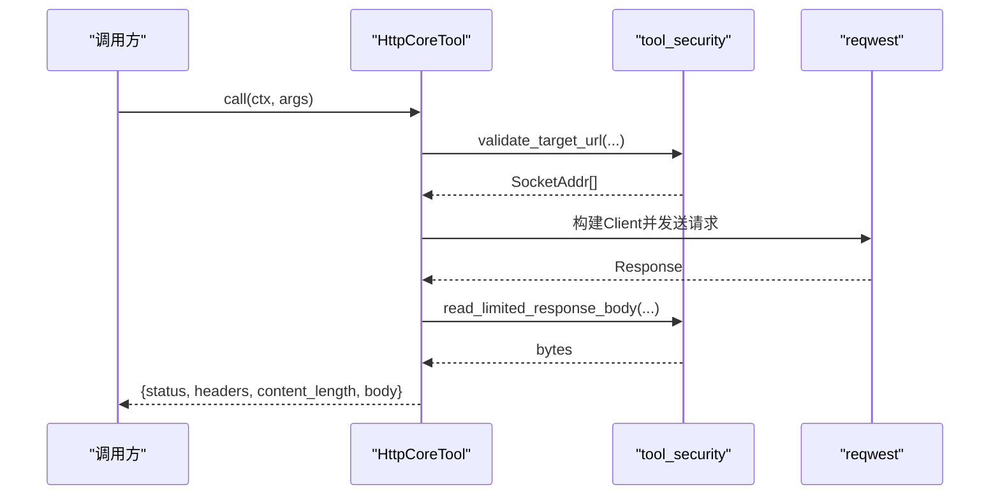
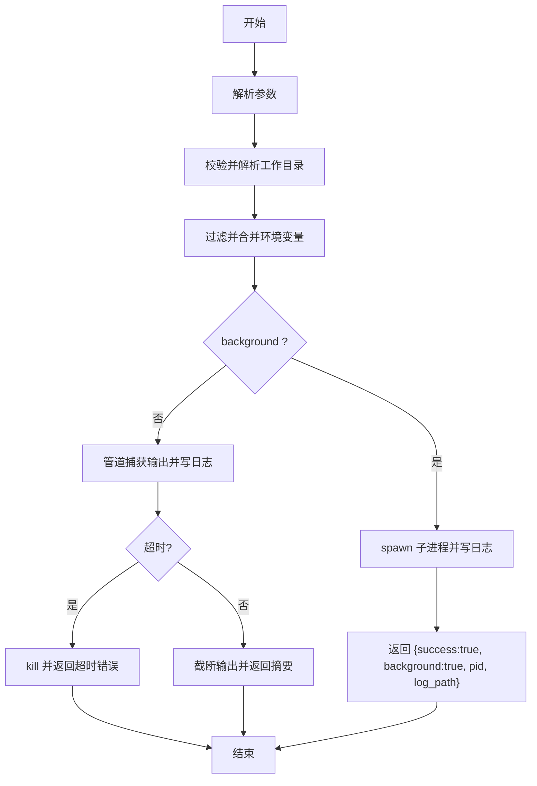
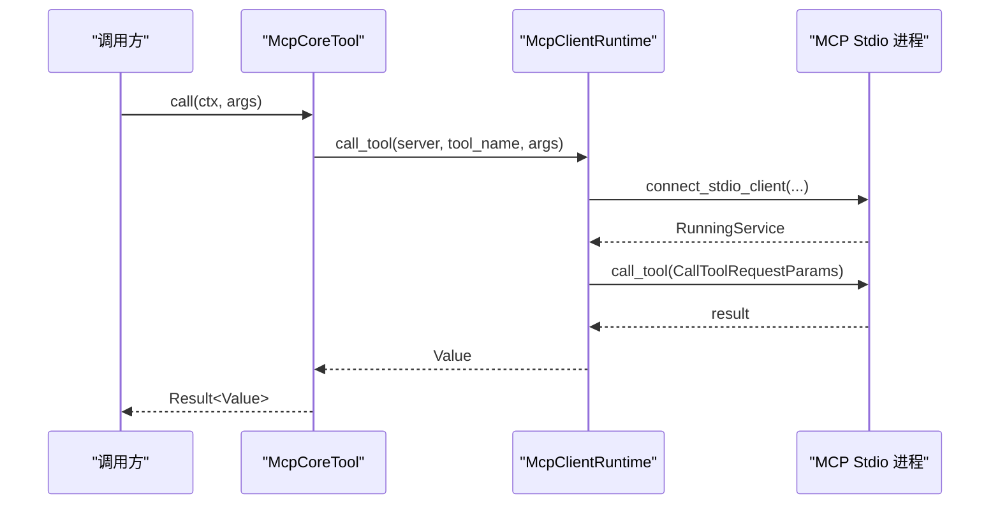
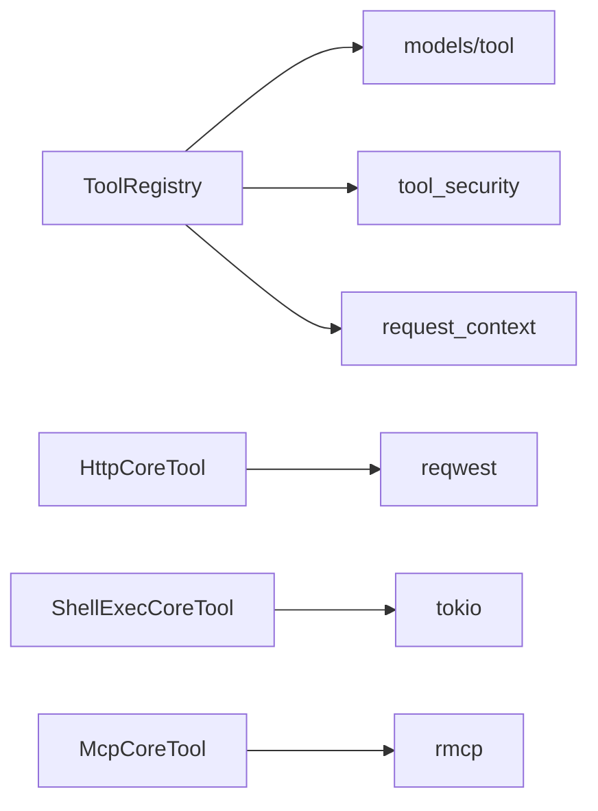

# 工具注册表（代码落地层）

<cite>
**本文引用的文件**
- [src/pkg/tool_registry/mod.rs](src/pkg/tool_registry/mod.rs)
- [src/pkg/tool_registry/builtin.rs](src/pkg/tool_registry/builtin.rs)
- [src/pkg/tool_registry/http.rs](src/pkg/tool_registry/http.rs)
- [src/pkg/tool_registry/shell_exec.rs](src/pkg/tool_registry/shell_exec.rs)
- [src/pkg/tool_registry/mcp.rs](src/pkg/tool_registry/mcp.rs)
- [src/pkg/tool_registry/tool_security.rs](src/pkg/tool_registry/tool_security.rs)
- [src/models/tool.rs](src/models/tool.rs)
- [common/src/models/tool.rs](common/src/models/tool.rs)
- [docs/generic_builtin_tools_design.md](docs/generic_builtin_tools_design.md)
</cite>

## 目录
1. [简介](#简介)
2. [项目结构](#项目结构)
3. [核心组件](#核心组件)
4. [架构总览](#架构总览)
5. [详细组件分析](#详细组件分析)
6. [依赖关系分析](#依赖关系分析)
7. [性能考量](#性能考量)
8. [故障排查指南](#故障排查指南)
9. [结论](#结论)
10. [附录](#附录)

## 简介
本文件为 AI Orz 工具注册表系统的权威技术文档，聚焦抽象接口设计、注册机制与发现算法，并深入解析内置工具、HTTP 工具、Shell 执行工具与 MCP 工具的实现原理。同时覆盖工具生命周期管理、安全控制与权限验证、上下文传递、参数绑定与结果处理，以及开发规范、测试策略、性能优化建议、集成示例、调试方法与故障排查指南。

> 📌 视角说明（AGENTS §2.1.3 Level 3 互补视角平行卡）：
> 本长文是「工具注册表」主题的 **代码落地层** 视角。同主题还有以下平行视角卡，请按需交叉阅读：
> - [工具注册表（框架层）](docs/wiki/zh/content/基础设施/工具注册表/工具注册表.md)

## 项目结构
工具注册表位于 src/pkg/tool_registry，采用“协议即模块”的组织方式：每个协议（Builtin/Http/Mcp）拥有独立的实现与工厂；全局注册表集中维护各协议的工厂映射，并在运行时按 ToolPo 的 protocol 字段分发到对应工厂创建可执行实例。

图表来源
- [src/pkg/tool_registry/mod.rs:29-102](src/pkg/tool_registry/mod.rs#L29-L102)
- [src/pkg/tool_registry/builtin.rs:26-43](src/pkg/tool_registry/builtin.rs#L26-L43)
- [src/pkg/tool_registry/http.rs:23-39](src/pkg/tool_registry/http.rs#L23-L39)
- [src/pkg/tool_registry/mcp.rs:270-365](src/pkg/tool_registry/mcp.rs#L270-L365)

章节来源
- [src/pkg/tool_registry/mod.rs:1-132](src/pkg/tool_registry/mod.rs#L1-L132)
- [src/pkg/tool_registry/builtin.rs:1-44](src/pkg/tool_registry/builtin.rs#L1-L44)

## 核心组件
- CoreTool 抽象接口：统一 call(ctx, args) 与 po() 访问元数据，支持装饰器链式包装。
- ToolPo：工具持久化对象，承载 id/name/description/protocol/config/parameters_schema/tags/status 等。
- ToolRegistry：全局注册表，按协议分发创建可执行工具实例。
- 协议工厂：
  - BuiltinToolFactory：内置工具工厂，提供 create_po() 与 create(po)。
  - HttpToolFactory：HTTP 协议工厂，从 ToolPo.config 构造 HttpCoreTool。
  - McpCoreTool：MCP 工具，通过 server_id + tool_name 绑定远程 MCP 服务工具。

章节来源
- [src/models/tool.rs:16-34](src/models/tool.rs#L16-L34)
- [src/models/tool.rs:57-106](src/models/tool.rs#L57-L106)
- [src/pkg/tool_registry/mod.rs:46-102](src/pkg/tool_registry/mod.rs#L46-L102)
- [src/pkg/tool_registry/builtin.rs:13-24](src/pkg/tool_registry/builtin.rs#L13-L24)
- [src/pkg/tool_registry/http.rs:23-39](src/pkg/tool_registry/http.rs#L23-L39)
- [src/pkg/tool_registry/mcp.rs:270-365](src/pkg/tool_registry/mcp.rs#L270-L365)

## 架构总览
工具注册表遵循四层单向调用原则：Adapter → Domain → DAL → DAO。工具注册表属于 pkg 层基础设施，无业务感知，仅暴露统一的 CoreTool 抽象与注册/发现能力。启动时同步初始化注册表并注册内置工具；运行时根据 ToolPo 动态创建可执行实例，并通过 RequestContext 传递上下文。

图表来源
- [src/pkg/tool_registry/mod.rs:81-102](src/pkg/tool_registry/mod.rs#L81-L102)
- [src/models/tool.rs:16-34](src/models/tool.rs#L16-L34)

章节来源
- [src/pkg/tool_registry/mod.rs:29-102](src/pkg/tool_registry/mod.rs#L29-L102)
- [src/models/tool.rs:16-34](src/models/tool.rs#L16-L34)

## 详细组件分析

### 抽象接口与工具实体
- CoreTool：定义 call(ctx, args) 与 po()，as_original() 用于装饰器解包。
- ToolExecutionResult：封装业务返回值与轻量 trace 引用，避免上层误用 request_id 作为 tool call_id。
- ToolPo：数据库持久化对象，包含协议、控制模式、配置、参数 Schema、标签、状态等。
- Tool：组合 ToolPo 与可执行 CoreTool，并可选携带搜索匹配与统计信息。

图表来源
- [src/models/tool.rs:16-34](src/models/tool.rs#L16-L34)
- [src/models/tool.rs:57-106](src/models/tool.rs#L57-L106)
- [common/src/models/tool.rs:5-22](common/src/models/tool.rs#L5-L22)

章节来源
- [src/models/tool.rs:16-34](src/models/tool.rs#L16-L34)
- [src/models/tool.rs:57-106](src/models/tool.rs#L57-L106)
- [common/src/models/tool.rs:5-22](common/src/models/tool.rs#L5-L22)

### 注册机制与发现算法
- 全局注册表 GLOBAL_TOOL_REGISTRY：懒加载单例，存储各协议工厂。
- 注册流程：
  - 内置工具：通过 BuiltinToolFactory 批量注册，工厂以 id 为键存入 HashMap。
  - HTTP 工具：协议级工厂 DefaultHttpToolFactory，按 ToolPo.config 动态构造。
  - MCP 工具：配置驱动，ToolPo.config 仅保存 server_id + tool_name，运行时由 DAL 注入服务端与客户端运行时。
- 发现算法：create_tool 根据 ToolPo.protocol 分派到对应工厂，返回可执行 CoreTool。

图表来源
- [src/pkg/tool_registry/mod.rs:81-102](src/pkg/tool_registry/mod.rs#L81-L102)
- [src/pkg/tool_registry/builtin.rs:26-43](src/pkg/tool_registry/builtin.rs#L26-L43)
- [src/pkg/tool_registry/http.rs:23-39](src/pkg/tool_registry/http.rs#L23-L39)
- [src/pkg/tool_registry/mcp.rs:357-365](src/pkg/tool_registry/mcp.rs#L357-L365)

章节来源
- [src/pkg/tool_registry/mod.rs:29-132](src/pkg/tool_registry/mod.rs#L29-L132)
- [src/pkg/tool_registry/builtin.rs:26-43](src/pkg/tool_registry/builtin.rs#L26-L43)

### 内置工具（fs_read / fs_write / http_fetch / shell_exec）
- 通用原则：默认拒绝风险操作、错误脱敏、大小限制、沙箱隔离、追踪脱敏。
- 文件读写：路径必须在 base_data_path 或额外允许路径内，拒绝敏感文件名与符号链接，越界需用户确认。
- HTTP Fetch：仅 GET，HTTPS-only（默认），复用 SSRF 防护、DNS pinning、重定向禁用、响应大小限制。
- Shell Exec：支持同步与后台运行，工作目录受限，环境变量白名单过滤，输出截断与日志落盘。

章节来源
- [docs/generic_builtin_tools_design.md:17-26](docs/generic_builtin_tools_design.md#L17-L26)
- [docs/generic_builtin_tools_design.md:186-231](docs/generic_builtin_tools_design.md#L186-L231)
- [docs/generic_builtin_tools_design.md:234-309](docs/generic_builtin_tools_design.md#L234-L309)
- [src/pkg/tool_registry/shell_exec.rs:20-87](src/pkg/tool_registry/shell_exec.rs#L20-L87)

### HTTP 工具实现原理
- 配置模型 HttpToolConfig：method/url/headers/query/body/timeout/response_max_bytes/allowed_status_codes/response_json_pointer/allowed_domains/blocked_domains/allow_local_network。
- 执行流程：参数校验 → URL 模板渲染 → 目标地址安全校验（SSRF）→ 构建 reqwest Client（禁用重定向、代理、DNS pinning）→ 组装请求 → 发送 → 响应体限制与 JSON Pointer 提取 → 标准化返回。
- 安全控制：URL 模板边界校验、占位符白名单（{{args.key}}）、域名白/黑名单、本地网络显式允许、超时与响应大小硬上限。

图表来源
- [src/pkg/tool_registry/http.rs:126-220](src/pkg/tool_registry/http.rs#L126-L220)
- [src/pkg/tool_registry/tool_security.rs:92-170](src/pkg/tool_registry/tool_security.rs#L92-L170)

章节来源
- [src/pkg/tool_registry/http.rs:41-124](src/pkg/tool_registry/http.rs#L41-L124)
- [src/pkg/tool_registry/http.rs:222-594](src/pkg/tool_registry/http.rs#L222-L594)
- [src/pkg/tool_registry/tool_security.rs:1-231](src/pkg/tool_registry/tool_security.rs#L1-L231)

### Shell 执行工具实现原理
- 配置模型 ShellExecConfig：default_timeout_ms/default_max_output_size_bytes/additional_allowed_paths/allowed_env。
- 执行流程：
  - 参数解析与 working_dir 校验（base_data_path 或额外允许路径）。
  - 环境过滤：继承父进程环境变量经白名单过滤，再合并额外 env。
  - 同步执行：捕获 stdout/stderr，写入日志文件，输出截断提示。
  - 后台执行：分离进程，记录 PID 与日志路径，立即返回。
- 安全控制：工作目录沙箱、环境变量白名单、敏感变量过滤、输出大小限制、超时保护。

图表来源
- [src/pkg/tool_registry/shell_exec.rs:256-466](src/pkg/tool_registry/shell_exec.rs#L256-L466)

章节来源
- [src/pkg/tool_registry/shell_exec.rs:20-87](src/pkg/tool_registry/shell_exec.rs#L20-L87)
- [src/pkg/tool_registry/shell_exec.rs:210-254](src/pkg/tool_registry/shell_exec.rs#L210-L254)
- [src/pkg/tool_registry/shell_exec.rs:256-466](src/pkg/tool_registry/shell_exec.rs#L256-L466)

### MCP 工具实现原理
- 配置模型 McpToolConfig：server_id + tool_name，不包含服务器凭据与传输配置。
- 运行时依赖：McpServerPo（transport/command/env/timeout）与 McpClientRuntime（stdio 客户端）。
- 执行流程：
  - 从 ToolPo 解析配置并校验。
  - 通过 DAL 注入 server/runtime 依赖后，建立 stdio 会话，调用 tools/list 或 call_tool。
  - 超时控制、会话关闭失败告警、结果序列化。
- 安全与限制：当前仅实现 stdio 传输；streamable HTTP 未实现；命令路径解析要求绝对路径或 PATH 中可找到。

图表来源
- [src/pkg/tool_registry/mcp.rs:72-192](src/pkg/tool_registry/mcp.rs#L72-L192)
- [src/pkg/tool_registry/mcp.rs:200-240](src/pkg/tool_registry/mcp.rs#L200-L240)

章节来源
- [src/pkg/tool_registry/mcp.rs:28-48](src/pkg/tool_registry/mcp.rs#L28-L48)
- [src/pkg/tool_registry/mcp.rs:72-192](src/pkg/tool_registry/mcp.rs#L72-L192)
- [src/pkg/tool_registry/mcp.rs:200-268](src/pkg/tool_registry/mcp.rs#L200-L268)
- [src/pkg/tool_registry/mcp.rs:270-365](src/pkg/tool_registry/mcp.rs#L270-L365)

### 生命周期管理、安全控制与权限验证
- 生命周期：
  - 启动阶段：注册内置工具工厂至全局注册表。
  - 运行时：按 ToolPo 创建可执行实例；MCP 工具需 DAL 注入 server/runtime。
  - 销毁：工具实例随请求生命周期释放，MCP 会话在调用完成后关闭。
- 安全控制：
  - HTTP：SSRF 防护、域名白/黑名单、本地网络显式允许、禁用重定向与代理、DNS pinning、超时与响应大小限制、响应头脱敏。
  - Shell：工作目录沙箱、环境变量白名单、敏感变量过滤、输出截断、超时保护。
  - 文件：路径规范化与范围校验、敏感文件名拒绝、符号链接拒绝、越界需用户确认。
- 权限验证：
  - 工具状态机：Enabled/Disabled/Stale，管理面不可将 Stale 手动切回正常路径。
  - 控制模式：Auto（Rig 原生自动调用）与 Manual（消息链路），不同协议默认不同控制模式。

章节来源
- [src/pkg/tool_registry/mod.rs:75-102](src/pkg/tool_registry/mod.rs#L75-L102)
- [src/pkg/tool_registry/http.rs:126-220](src/pkg/tool_registry/http.rs#L126-L220)
- [src/pkg/tool_registry/shell_exec.rs:168-207](src/pkg/tool_registry/shell_exec.rs#L168-L207)
- [src/pkg/tool_registry/tool_security.rs:17-170](src/pkg/tool_registry/tool_security.rs#L17-L170)
- [src/models/tool.rs:163-202](src/models/tool.rs#L163-L202)

### 上下文传递、参数绑定与结果处理
- 上下文传递：CoreTool.call 的第一个参数为 RequestContext，跨层使用 ctx.clone() 传递；工具内部可通过 ctx.log_id 生成唯一日志标识。
- 参数绑定：
  - HTTP：基于 parameters_schema 进行严格校验，支持 required、additionalProperties、enum、type 等约束；URL/headers/query/body 模板使用 {{args.key}} 占位符。
  - Shell：参数结构体反序列化为 ShellExecParams，支持覆盖默认超时与输出大小。
  - MCP：参数必须为 JSON 对象，直接透传给远端工具。
- 结果处理：
  - HTTP：返回 {status, headers, content_length, body}，body 支持 JSON Pointer 提取。
  - Shell：返回 success/exit_code/truncated/log_path/output 或后台任务信息。
  - MCP：返回远端工具结果，序列化失败则报错。

章节来源
- [src/pkg/tool_registry/http.rs:230-367](src/pkg/tool_registry/http.rs#L230-L367)
- [src/pkg/tool_registry/shell_exec.rs:256-466](src/pkg/tool_registry/shell_exec.rs#L256-L466)
- [src/pkg/tool_registry/mcp.rs:142-192](src/pkg/tool_registry/mcp.rs#L142-L192)
- [src/models/tool.rs:36-55](src/models/tool.rs#L36-L55)

### 工具开发规范、测试策略与性能优化建议
- 开发规范：
  - 遵循四层单向调用，pkg 层无业务感知。
  - 公共方法首参 ctx: RequestContext，跨层 ctx.clone()。
  - 命名 snake_case，Trait 不加后缀，实现类加 Impl 后缀。
  - 安全默认拒绝，错误信息脱敏，大小限制与超时保护。
- 测试策略：
  - 单元测试：参数校验、模板渲染、安全策略（SSRF、路径沙箱、环境变量过滤）。
  - 集成测试：HTTP 调用、Shell 执行、MCP stdio 会话建立与调用。
  - 覆盖率门槛：PR 38% / main 45%。
- 性能优化：
  - HTTP：连接池复用、禁用重定向与代理、DNS pinning、响应体流式读取与大小限制。
  - Shell：后台任务分离、输出流式写入日志、超时保护。
  - MCP：会话超时与关闭失败告警、命令路径解析优化。

章节来源
- [docs/generic_builtin_tools_design.md:464-507](docs/generic_builtin_tools_design.md#L464-L507)
- [src/pkg/tool_registry/http.rs:561-589](src/pkg/tool_registry/http.rs#L561-L589)
- [src/pkg/tool_registry/shell_exec.rs:281-304](src/pkg/tool_registry/shell_exec.rs#L281-L304)
- [src/pkg/tool_registry/mcp.rs:107-120](src/pkg/tool_registry/mcp.rs#L107-L120)

### 工具集成示例、调试方法与故障排查指南
- 集成示例：
  - 注册内置工具：启动时调用 register_all(registry)。
  - 创建 HTTP 工具：配置 ToolPo.config 为 HttpToolConfig，通过 registry.create_tool 获取可执行实例。
  - 调用 MCP 工具：DAL 注入 server/runtime 后，通过 create_mcp_tool 获取可执行实例。
- 调试方法：
  - 查看工具日志：Shell 执行输出写入 base_data_path/tools/shell_exec/logs/{log_id}.log。
  - 检查参数 Schema：确保 parameters_schema 与实际传入 args 一致。
  - 监控超时与大小限制：调整 timeout_ms 与 response_max_bytes。
- 故障排查：
  - HTTP：检查 allowed_domains/blocked_domains、allow_local_network、URL 模板占位符。
  - Shell：检查工作目录是否在允许范围、环境变量是否被过滤、超时是否设置合理。
  - MCP：检查 server_id 与 tool_name 是否正确、PATH 是否可解析命令、会话初始化是否超时。

章节来源
- [src/pkg/tool_registry/builtin.rs:37-43](src/pkg/tool_registry/builtin.rs#L37-L43)
- [src/pkg/tool_registry/http.rs:116-124](src/pkg/tool_registry/http.rs#L116-L124)
- [src/pkg/tool_registry/shell_exec.rs:295-304](src/pkg/tool_registry/shell_exec.rs#L295-L304)
- [src/pkg/tool_registry/mcp.rs:249-268](src/pkg/tool_registry/mcp.rs#L249-L268)

## 依赖关系分析
工具注册表依赖以下关键模块：
- models/tool：CoreTool 抽象与 ToolPo/Tool 实体。
- tool_security：HTTP/文件安全策略与常量。
- request_context：上下文传递。
- 外部库：reqwest（HTTP）、tokio（异步 IO）、rmcp（MCP 客户端）。

图表来源
- [src/pkg/tool_registry/mod.rs:23-27](src/pkg/tool_registry/mod.rs#L23-L27)
- [src/pkg/tool_registry/http.rs:16-21](src/pkg/tool_registry/http.rs#L16-L21)
- [src/pkg/tool_registry/shell_exec.rs:15-18](src/pkg/tool_registry/shell_exec.rs#L15-L18)
- [src/pkg/tool_registry/mcp.rs:16-19](src/pkg/tool_registry/mcp.rs#L16-L19)

章节来源
- [src/pkg/tool_registry/mod.rs:23-27](src/pkg/tool_registry/mod.rs#L23-L27)
- [src/pkg/tool_registry/http.rs:16-21](src/pkg/tool_registry/http.rs#L16-L21)
- [src/pkg/tool_registry/shell_exec.rs:15-18](src/pkg/tool_registry/shell_exec.rs#L15-L18)
- [src/pkg/tool_registry/mcp.rs:16-19](src/pkg/tool_registry/mcp.rs#L16-L19)

## 性能考量
- HTTP 工具：
  - 禁用重定向与代理，减少不必要跳转与中间环节。
  - DNS pinning 防止 DNS rebinding 攻击，提升安全性与稳定性。
  - 响应体流式读取与大小限制，避免 OOM。
- Shell 工具：
  - 后台任务分离，避免阻塞主流程。
  - 输出流式写入日志，支持大输出截断。
- MCP 工具：
  - 会话超时与关闭失败告警，及时释放资源。
  - 命令路径解析优化，减少 PATH 遍历开销。

[本节为通用性能讨论，不直接分析具体文件]

## 故障排查指南
- HTTP 工具：
  - 检查 URL 模板占位符是否为 {{args.key}} 形式。
  - 确认 allowed_domains/blocked_domains 配置正确。
  - 查看响应状态码是否在 allowed_status_codes 范围内。
- Shell 工具：
  - 检查工作目录是否在 base_data_path 或额外允许路径内。
  - 确认环境变量白名单是否包含必要变量。
  - 查看日志文件路径与输出截断提示。
- MCP 工具：
  - 确认 server_id 与 tool_name 匹配。
  - 检查 PATH 是否可解析命令或使用绝对路径。
  - 关注会话初始化超时与关闭失败告警。

章节来源
- [src/pkg/tool_registry/http.rs:537-559](src/pkg/tool_registry/http.rs#L537-L559)
- [src/pkg/tool_registry/shell_exec.rs:168-207](src/pkg/tool_registry/shell_exec.rs#L168-L207)
- [src/pkg/tool_registry/mcp.rs:249-268](src/pkg/tool_registry/mcp.rs#L249-L268)

## 结论
AI Orz 工具注册表系统通过统一的 CoreTool 抽象与协议化工厂机制，实现了内置工具、HTTP 工具、Shell 执行工具与 MCP 工具的灵活注册与执行。系统强调安全默认拒绝、沙箱隔离、上下文传递与参数强校验，并提供完善的生命周期管理与故障排查能力。遵循开发规范与测试策略，可高效扩展新工具类型并保障系统稳定性与性能。

[本节为总结性内容，不直接分析具体文件]

## 附录
- 术语表：
  - ToolPo：工具持久化对象。
  - CoreTool：工具执行抽象接口。
  - ToolRegistry：全局工具注册表。
  - McpToolConfig：MCP 工具绑定配置。
  - HttpToolConfig：HTTP 工具配置。
  - ShellExecConfig：Shell 执行工具配置。

[本节为概念性内容，不直接分析具体文件]