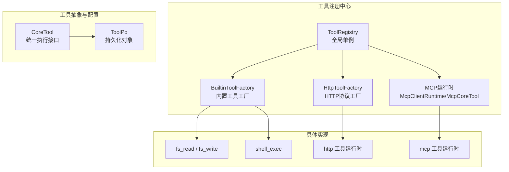
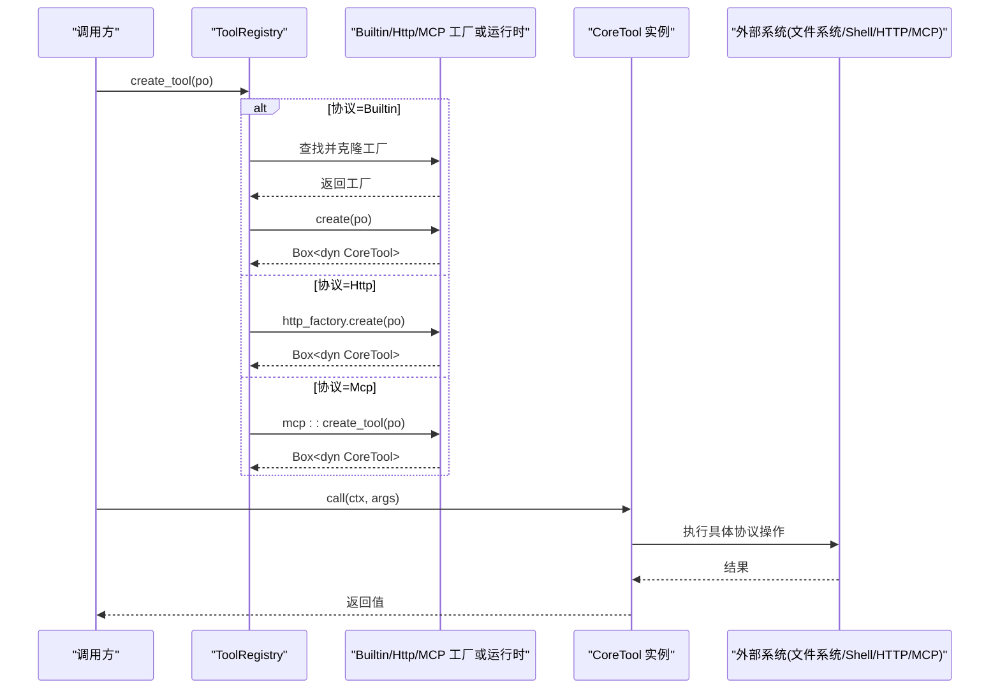
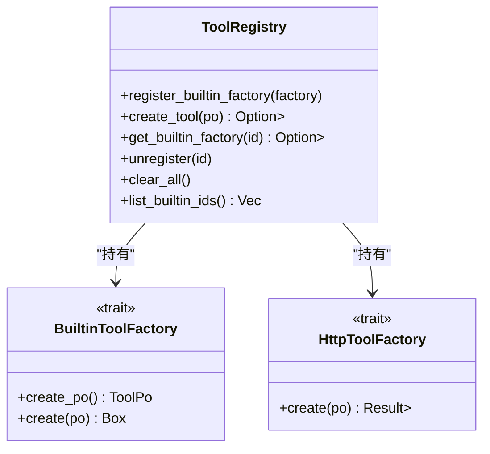
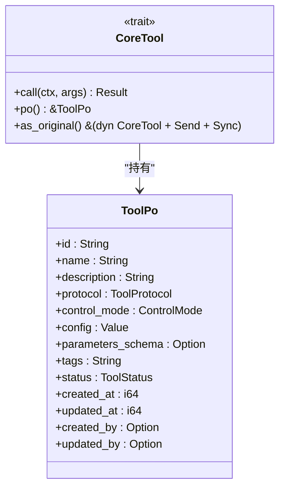
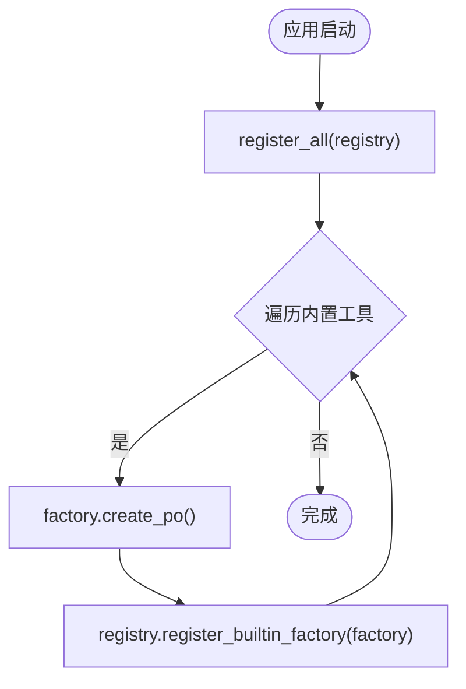
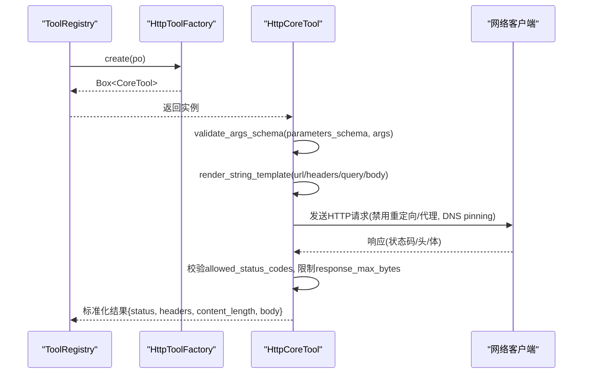
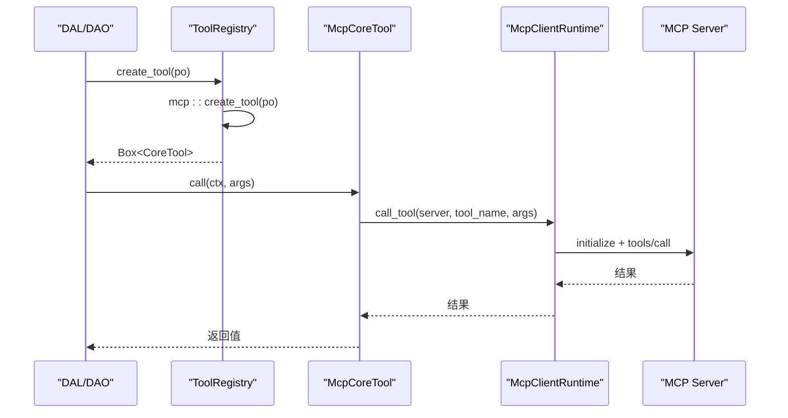
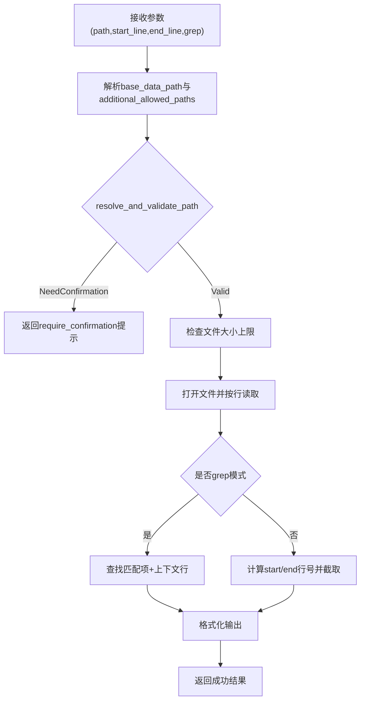
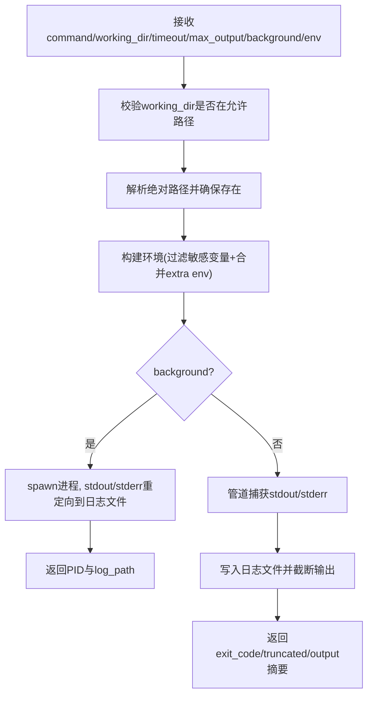
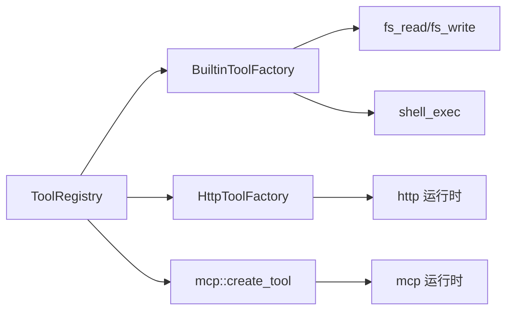

# 核心架构与注册机制（代码落地层）

<cite>
**本文引用的文件**
- [src/pkg/tool_registry/mod.rs](src/pkg/tool_registry/mod.rs)
- [src/models/tool.rs](src/models/tool.rs)
- [src/pkg/tool_registry/builtin.rs](src/pkg/tool_registry/builtin.rs)
- [src/pkg/tool_registry/http.rs](src/pkg/tool_registry/http.rs)
- [src/pkg/tool_registry/mcp.rs](src/pkg/tool_registry/mcp.rs)
- [src/pkg/tool_registry/fs_read.rs](src/pkg/tool_registry/fs_read.rs)
- [src/pkg/tool_registry/shell_exec.rs](src/pkg/tool_registry/shell_exec.rs)
- [docs/generic_builtin_tools_design.md](docs/generic_builtin_tools_design.md)
- [docs/mcp_tool_design.md](docs/mcp_tool_design.md)
</cite>

## 目录
1. [简介](#简介)
2. [项目结构](#项目结构)
3. [核心组件](#核心组件)
4. [架构总览](#架构总览)
5. [详细组件分析](#详细组件分析)
6. [依赖关系分析](#依赖关系分析)
7. [性能考虑](#性能考虑)
8. [故障排查指南](#故障排查指南)
9. [结论](#结论)
10. [附录](#附录)

## 简介
本文件围绕工具注册表的核心架构进行系统化说明，重点解释以下主题：
- ToolRegistry 全局单例设计与并发安全
- 工厂模式与协议分发机制（内置、MCP、HTTP）
- CoreTool 抽象接口的设计原则、方法定义与扩展点
- ToolPo 数据结构、字段含义与验证规则
- 工具发现、缓存策略与生命周期管理
- 注册示例、自定义协议实现指南与性能优化建议

本仓库遵循严格四层单向调用：Adapter → Domain → DAL → DAO；pkg 层为通用基础设施，无业务感知。启动采用两阶段初始化：同步 service::init() 注册单例与 AOP producer/consumer，异步 service::init_base_data() 幂等注入默认基础数据。

> 📌 视角说明（AGENTS §2.1.3 Level 3 互补视角平行卡）：
> 本长文是「核心架构与注册机制」主题的 **代码落地层** 视角。同主题还有以下平行视角卡，请按需交叉阅读：
> - [核心架构与注册机制（框架层）](docs/wiki/zh/content/基础设施/工具注册表/核心架构与注册机制.md)

## 项目结构
工具注册相关代码集中在 src/pkg/tool_registry 与 src/models/tool.rs，配合设计文档 docs/ 中的规范说明。

图表来源
- [src/pkg/tool_registry/mod.rs:29-102](src/pkg/tool_registry/mod.rs#L29-L102)
- [src/models/tool.rs:16-34](src/models/tool.rs#L16-L34)
- [src/pkg/tool_registry/builtin.rs:13-43](src/pkg/tool_registry/builtin.rs#L13-L43)
- [src/pkg/tool_registry/http.rs:23-114](src/pkg/tool_registry/http.rs#L23-L114)
- [src/pkg/tool_registry/mcp.rs:270-365](src/pkg/tool_registry/mcp.rs#L270-L365)

章节来源
- [src/pkg/tool_registry/mod.rs:29-132](src/pkg/tool_registry/mod.rs#L29-L132)
- [src/models/tool.rs:57-106](src/models/tool.rs#L57-L106)

## 核心组件
- ToolRegistry：全局单例，按协议类型分别存储工厂或运行时能力，提供 create_tool(po) 进行协议分发。
- CoreTool：统一的工具执行接口，包含 call(ctx, args)、po()、as_original() 扩展点。
- ToolPo：工具持久化对象，承载 id/name/description/protocol/config/parameters_schema/tags/status 等元信息。
- 工厂与运行时：
  - 内置工具通过 BuiltinToolFactory 创建实例。
  - HTTP 工具通过 HttpToolFactory 从 ToolPo.config 构造可执行 HttpCoreTool。
  - MCP 工具通过 McpClientRuntime 连接外部 MCP Server，构造 McpCoreTool。

章节来源
- [src/pkg/tool_registry/mod.rs:46-102](src/pkg/tool_registry/mod.rs#L46-L102)
- [src/models/tool.rs:16-34](src/models/tool.rs#L16-L34)
- [src/pkg/tool_registry/builtin.rs:13-43](src/pkg/tool_registry/builtin.rs#L13-L43)
- [src/pkg/tool_registry/http.rs:23-114](src/pkg/tool_registry/http.rs#L23-L114)
- [src/pkg/tool_registry/mcp.rs:270-365](src/pkg/tool_registry/mcp.rs#L270-L365)

## 架构总览
下图展示从请求到工具执行的完整流程，包括注册、发现、分发与执行。

图表来源
- [src/pkg/tool_registry/mod.rs:81-102](src/pkg/tool_registry/mod.rs#L81-L102)
- [src/pkg/tool_registry/http.rs:98-114](src/pkg/tool_registry/http.rs#L98-L114)
- [src/pkg/tool_registry/mcp.rs:357-365](src/pkg/tool_registry/mcp.rs#L357-L365)

## 详细组件分析

### ToolRegistry 全局单例与并发安全
- 使用 lazy_static 暴露 GLOBAL_TOOL_REGISTRY，首次访问时自动初始化。
- 内部以 Arc<Mutex<HashMap>> 保护内置工厂集合，确保并发安全。
- 提供 register_builtin_factory、create_tool、get_builtin_factory、unregister、clear_all、list_builtin_ids 等方法。
- create_tool 根据 ToolPo.protocol 分派到对应协议处理路径。

图表来源
- [src/pkg/tool_registry/mod.rs:46-132](src/pkg/tool_registry/mod.rs#L46-L132)
- [src/pkg/tool_registry/builtin.rs:13-24](src/pkg/tool_registry/builtin.rs#L13-L24)
- [src/pkg/tool_registry/http.rs:23-39](src/pkg/tool_registry/http.rs#L23-L39)

章节来源
- [src/pkg/tool_registry/mod.rs:29-132](src/pkg/tool_registry/mod.rs#L29-L132)

### CoreTool 抽象接口与扩展点
- CoreTool 是统一执行接口，要求 Send + Sync + DynClone。
- 关键方法：
  - call(ctx, args) -> Result<Value>：执行工具调用。
  - po() -> &ToolPo：返回工具对应的持久化对象。
  - as_original() -> &(dyn CoreTool + Send + Sync)：用于装饰器链中获取原始工具。
- 管理面占位实现 ManagementOnlyTool 在不可执行场景下返回明确错误。

图表来源
- [src/models/tool.rs:16-34](src/models/tool.rs#L16-L34)
- [src/models/tool.rs:57-88](src/models/tool.rs#L57-L88)

章节来源
- [src/models/tool.rs:16-34](src/models/tool.rs#L16-L34)
- [src/models/tool.rs:57-88](src/models/tool.rs#L57-L88)

### 内置工具注册流程与生命周期
- 通用内置工具通过 GENERIC_BUILTIN_TOOLS 静态列表集中声明，并在 register_all(registry) 中批量注册。
- 每个内置工具实现 BuiltinToolFactory：
  - create_po()：生成默认 ToolPo（含 parameters_schema、控制模式、描述等）。
  - create(po)：基于 ToolPo 构造可执行 CoreTool 实例。
- 生命周期：
  - 启动时注册工厂（仅一次）。
  - 运行时按需从 ToolPo 创建实例（每次调用可能新建），避免共享状态污染。

图表来源
- [src/pkg/tool_registry/builtin.rs:26-43](src/pkg/tool_registry/builtin.rs#L26-L43)

章节来源
- [src/pkg/tool_registry/builtin.rs:13-43](src/pkg/tool_registry/builtin.rs#L13-L43)

### HTTP 工具注册与执行流程
- HTTP 工具为数据库注册、配置驱动，ToolPo.config 存储 HttpToolConfig。
- 协议级工厂 DefaultHttpToolFactory 将 ToolPo 转换为 HttpCoreTool。
- 执行流程包含参数校验、模板渲染、SSRF 防护、超时与响应大小限制、JSON Pointer 提取等。

图表来源
- [src/pkg/tool_registry/http.rs:98-220](src/pkg/tool_registry/http.rs#L98-L220)
- [src/pkg/tool_registry/http.rs:369-491](src/pkg/tool_registry/http.rs#L369-L491)

章节来源
- [src/pkg/tool_registry/http.rs:23-114](src/pkg/tool_registry/http.rs#L23-L114)
- [src/pkg/tool_registry/http.rs:126-220](src/pkg/tool_registry/http.rs#L126-L220)
- [src/pkg/tool_registry/http.rs:369-594](src/pkg/tool_registry/http.rs#L369-L594)

### MCP 工具注册与执行流程
- MCP 工具绑定存储在 ToolPo.config 中（server_id + tool_name），不复制服务器凭据。
- 运行时通过 McpClientRuntime 建立 stdio 会话，调用 tools/list 与 tools/call。
- 支持 server 失效标记与清理，失败后清除失效标记。

图表来源
- [src/pkg/tool_registry/mcp.rs:72-101](src/pkg/tool_registry/mcp.rs#L72-L101)
- [src/pkg/tool_registry/mcp.rs:142-192](src/pkg/tool_registry/mcp.rs#L142-L192)
- [src/pkg/tool_registry/mcp.rs:270-365](src/pkg/tool_registry/mcp.rs#L270-L365)

章节来源
- [src/pkg/tool_registry/mcp.rs:28-48](src/pkg/tool_registry/mcp.rs#L28-L48)
- [src/pkg/tool_registry/mcp.rs:72-192](src/pkg/tool_registry/mcp.rs#L72-L192)
- [src/pkg/tool_registry/mcp.rs:270-365](src/pkg/tool_registry/mcp.rs#L270-L365)

### 文件读取工具（fs_read）
- 作为内置工具，提供范围读取与 grep 匹配，支持上下文行输出。
- 安全沙箱：路径解析与 canonicalize 校验，拒绝越界与敏感文件，超大文件直接拒绝。
- 越界访问返回 require_confirmation=true，强制 Agent 询问用户确认后再继续。

图表来源
- [src/pkg/tool_registry/fs_read.rs:15-122](src/pkg/tool_registry/fs_read.rs#L15-L122)
- [src/pkg/tool_registry/fs_read.rs:125-216](src/pkg/tool_registry/fs_read.rs#L125-L216)
- [src/pkg/tool_registry/fs_read.rs:218-255](src/pkg/tool_registry/fs_read.rs#L218-L255)

章节来源
- [src/pkg/tool_registry/fs_read.rs:15-255](src/pkg/tool_registry/fs_read.rs#L15-L255)

### Shell 执行工具（shell_exec）
- 支持同步执行与后台运行，输出写入日志文件，支持超时与最大输出限制。
- 工作目录限制在 base_data_path 或额外允许路径内，环境变量白名单过滤。
- 平台适配：Windows 使用 cmd.exe，Unix 使用 /bin/sh。

图表来源
- [src/pkg/tool_registry/shell_exec.rs:20-87](src/pkg/tool_registry/shell_exec.rs#L20-L87)
- [src/pkg/tool_registry/shell_exec.rs:151-208](src/pkg/tool_registry/shell_exec.rs#L151-L208)
- [src/pkg/tool_registry/shell_exec.rs:256-465](src/pkg/tool_registry/shell_exec.rs#L256-L465)

章节来源
- [src/pkg/tool_registry/shell_exec.rs:20-490](src/pkg/tool_registry/shell_exec.rs#L20-L490)

### 工具配置对象 ToolPo 的数据结构与验证
- ToolPo 字段涵盖工具标识、名称、描述、协议、控制模式、配置、参数 Schema、标签、状态、审计字段。
- 内置工具可通过 new_builtin 快速创建，自动设置 protocol=Builtin、control_mode=Auto。
- 动态工具需填充 parameters_schema，便于运行时参数校验。
- 标签以 JSON 字符串存储，提供 get_tags 便捷访问。

章节来源
- [src/models/tool.rs:57-88](src/models/tool.rs#L57-L88)
- [src/models/tool.rs:204-283](src/models/tool.rs#L204-L283)

### 工具发现算法、缓存策略与并发安全
- 工具发现：
  - 内置工具：启动时通过 GENERIC_BUILTIN_TOOLS 注册到全局 registry。
  - HTTP/MCP：数据库注册，运行时根据 ToolPo 构造实例。
- 缓存策略：
  - 内置：仅缓存工厂，实例按需创建。
  - MCP：McpClientRuntime 维护 invalidated_servers 集合，失败后清理失效标记。
- 并发安全：
  - 全局 registry 使用 lazy_static + Mutex 保护内置工厂映射。
  - 各协议工厂/运行时具备 Send + Sync 约束，保证多线程安全。

章节来源
- [src/pkg/tool_registry/mod.rs:29-132](src/pkg/tool_registry/mod.rs#L29-L132)
- [src/pkg/tool_registry/mcp.rs:55-101](src/pkg/tool_registry/mcp.rs#L55-L101)

## 依赖关系分析
- ToolRegistry 依赖：
  - 内置工具工厂（BuiltinToolFactory）
  - HTTP 协议工厂（HttpToolFactory）
  - MCP 运行时（mcp::create_tool）
- 具体实现依赖：
  - fs_read/shell_exec 依赖文件系统与安全沙箱函数。
  - http 工具依赖 reqwest、URL 解析与安全策略。
  - mcp 工具依赖 rmcp、TokioChildProcess、超时与序列化。

图表来源
- [src/pkg/tool_registry/mod.rs:46-102](src/pkg/tool_registry/mod.rs#L46-L102)
- [src/pkg/tool_registry/builtin.rs:26-43](src/pkg/tool_registry/builtin.rs#L26-L43)
- [src/pkg/tool_registry/http.rs:23-114](src/pkg/tool_registry/http.rs#L23-L114)
- [src/pkg/tool_registry/mcp.rs:270-365](src/pkg/tool_registry/mcp.rs#L270-L365)

章节来源
- [src/pkg/tool_registry/mod.rs:46-102](src/pkg/tool_registry/mod.rs#L46-L102)
- [src/pkg/tool_registry/builtin.rs:26-43](src/pkg/tool_registry/builtin.rs#L26-L43)
- [src/pkg/tool_registry/http.rs:23-114](src/pkg/tool_registry/http.rs#L23-L114)
- [src/pkg/tool_registry/mcp.rs:270-365](src/pkg/tool_registry/mcp.rs#L270-L365)

## 性能考虑
- 工厂模式减少重复构造成本：仅缓存工厂，实例按需创建，降低内存占用。
- 超时与大小限制：
  - HTTP：默认与硬上限双重保护，防止长尾请求与大响应。
  - MCP：stdio 会话初始化与调用均带超时，避免阻塞。
  - Shell：输出截断与日志落盘，避免内存膨胀。
- 并发安全：Mutex 保护共享状态，避免竞争条件。
- 模板渲染与参数校验前置：尽早失败，减少无效网络/IO 开销。

[本节为通用指导，无需特定文件引用]

## 故障排查指南
- HTTP 工具：
  - 常见错误：非法 URL、不支持的方法、未允许的域名、状态码不在允许列表、JSON Pointer 不存在。
  - 排查要点：检查 ToolPo.config 的 method/url/allowed_domains/response_json_pointer 等字段。
- MCP 工具：
  - 常见错误：缺少 server_id/tool_name、stdio 命令未找到、会话初始化超时、tools/call 失败。
  - 排查要点：确认 McpServerPo 配置正确，PATH 可解析命令，超时合理。
- 文件/Shell 工具：
  - 常见错误：路径越界、敏感文件拒绝、工作目录不允许、环境变量缺失、输出过大。
  - 排查要点：检查 base_data_path 与 additional_allowed_paths，确认权限与大小限制。

章节来源
- [src/pkg/tool_registry/http.rs:369-594](src/pkg/tool_registry/http.rs#L369-L594)
- [src/pkg/tool_registry/mcp.rs:200-268](src/pkg/tool_registry/mcp.rs#L200-L268)
- [src/pkg/tool_registry/fs_read.rs:125-216](src/pkg/tool_registry/fs_read.rs#L125-L216)
- [src/pkg/tool_registry/shell_exec.rs:256-465](src/pkg/tool_registry/shell_exec.rs#L256-L465)

## 结论
工具注册表通过全局单例与工厂模式实现了可扩展、安全的工具生态：
- 统一抽象 CoreTool 屏蔽协议差异。
- ToolRegistry 负责协议分发与生命周期管理。
- 内置、HTTP、MCP 三类工具各有明确的注册与执行路径。
- 安全策略贯穿参数校验、目标地址限制、超时与大小限制。
- 并发安全与缓存策略保障高可用与高性能。

[本节为总结性内容，无需特定文件引用]

## 附录

### 工具注册示例
- 注册内置工具：
  - 在启动阶段调用 register_all(registry)，自动注册 http_fetch、fs_read、fs_write、shell_exec。
- 注册 HTTP 工具：
  - 在数据库中创建 ToolPo，protocol=Http，config 为 HttpToolConfig，运行时由 HttpToolFactory 构造。
- 注册 MCP 工具：
  - 在数据库中创建 ToolPo，protocol=Mcp，config 为 McpToolConfig（server_id + tool_name），运行时由 mcp::create_tool 构造。

章节来源
- [src/pkg/tool_registry/builtin.rs:26-43](src/pkg/tool_registry/builtin.rs#L26-L43)
- [src/pkg/tool_registry/http.rs:23-114](src/pkg/tool_registry/http.rs#L23-L114)
- [src/pkg/tool_registry/mcp.rs:270-365](src/pkg/tool_registry/mcp.rs#L270-L365)

### 自定义协议实现指南
- 新增协议步骤：
  - 定义协议工厂接口（如 HttpToolFactory），实现 create(po)。
  - 在 ToolRegistry 中增加协议分支与存储字段。
  - 实现 CoreTool 的具体实例，封装协议执行逻辑。
  - 在 create_tool 中增加协议分发逻辑。
- 参考现有实现：
  - HTTP：协议级工厂 + 配置驱动。
  - MCP：运行时依赖注入 + 会话管理。

章节来源
- [src/pkg/tool_registry/mod.rs:81-102](src/pkg/tool_registry/mod.rs#L81-L102)
- [src/pkg/tool_registry/http.rs:23-114](src/pkg/tool_registry/http.rs#L23-L114)
- [src/pkg/tool_registry/mcp.rs:270-365](src/pkg/tool_registry/mcp.rs#L270-L365)

### 性能优化建议
- 预编译与懒加载：
  - 内置工具工厂静态初始化，减少启动开销。
- 资源复用：
  - HTTP 客户端可复用（当前实现按请求构建，后续可引入连接池）。
  - MCP 会话按 server_id 管理失效，避免重复初始化。
- 参数校验前置：
  - 提前校验参数与模板，减少无效 IO/网络调用。
- 监控与统计：
  - 结合 AOP 与 stats 模块记录工具调用耗时与错误率。

[本节为通用指导，无需特定文件引用]