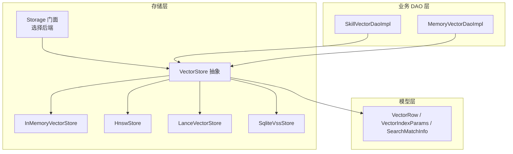
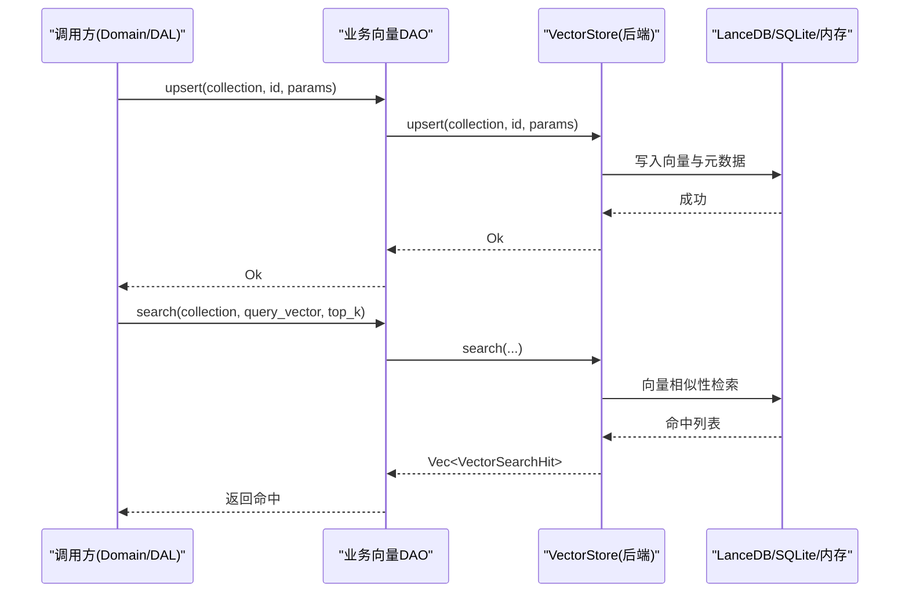
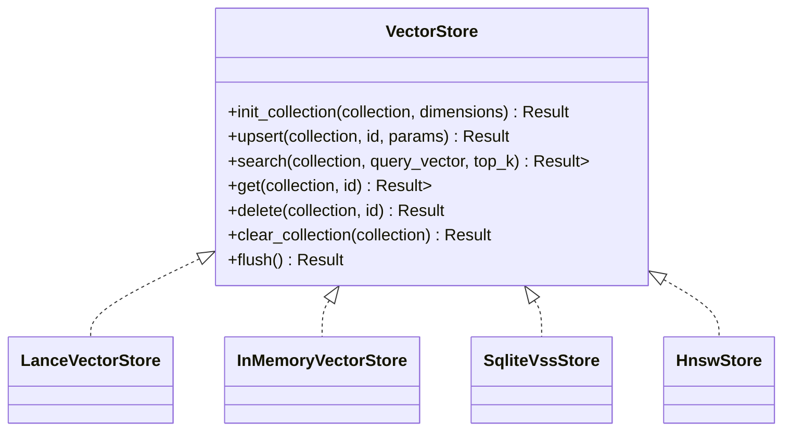
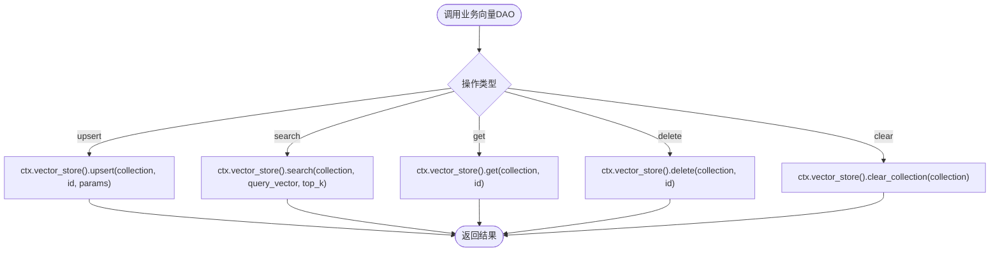
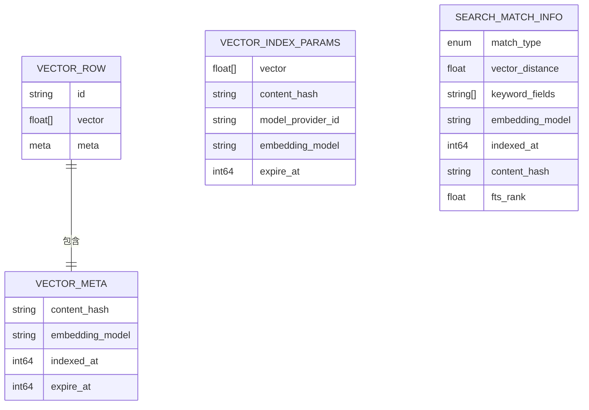
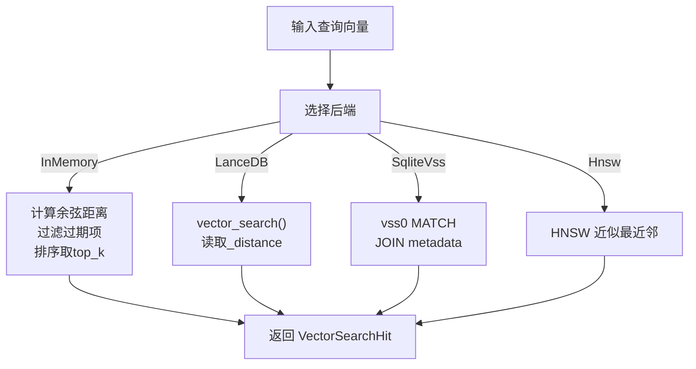
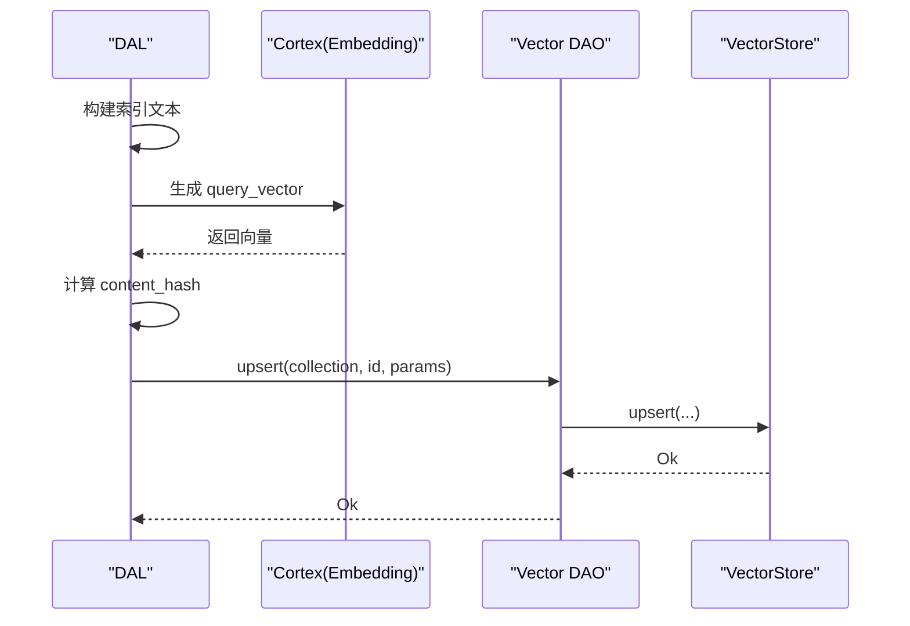
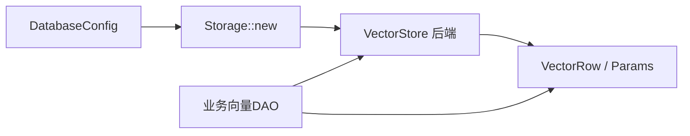
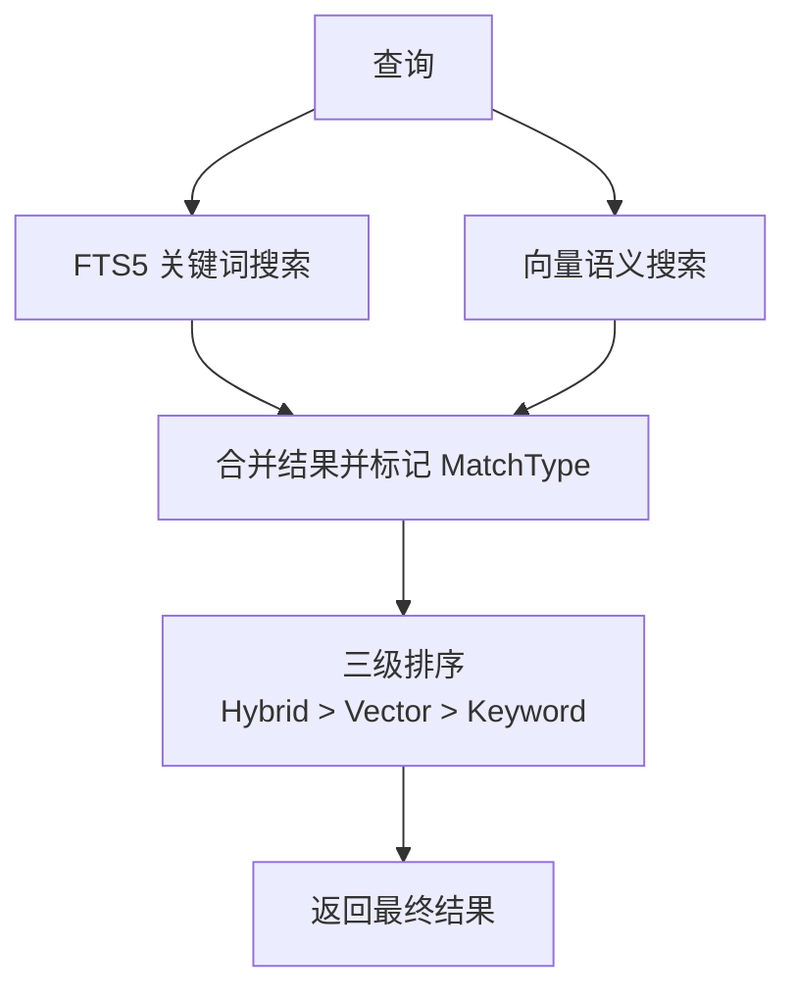

# 向量存储数据访问对象

<cite>
**本文引用的文件**
- [src/pkg/storage/mod.rs](src/pkg/storage/mod.rs)
- [src/pkg/storage/vector.rs](src/pkg/storage/vector.rs)
- [src/pkg/storage/lance.rs](src/pkg/storage/lance.rs)
- [src/pkg/storage/mem_vector.rs](src/pkg/storage/mem_vector.rs)
- [src/models/vector.rs](src/models/vector.rs)
- [src/service/dao/skill/vector.rs](src/service/dao/skill/vector.rs)
- [src/service/dao/memory/vector.rs](src/service/dao/memory/vector.rs)
- [docs/vector_search_architecture.md](docs/vector_search_architecture.md)
</cite>

## 目录
1. [简介](#简介)
2. [项目结构](#项目结构)
3. [核心组件](#核心组件)
4. [架构总览](#架构总览)
5. [详细组件分析](#详细组件分析)
6. [依赖关系分析](#依赖关系分析)
7. [性能与调优](#性能与调优)
8. [故障排除指南](#故障排除指南)
9. [结论](#结论)
10. [附录：查询语法、过滤与排序](#附录：查询语法过滤与排序)

## 简介
本文件面向“向量存储数据访问对象”的完整技术文档，聚焦基于 LanceDB 的向量搜索实现，并覆盖向量嵌入生成、相似度计算、语义检索、索引生命周期管理（创建/更新/删除）、查询语法与排序策略、维度配置、索引参数调优与性能优化策略，以及集成示例与故障排除。

本项目采用分层单向调用：Adapter → Domain → DAL → DAO；通用能力集中在 pkg/storage 层，业务向量 DAO 仅封装集合名与 ID 映射，DAL 负责组合基础 DAO 与向量 DAO，Domain 编排索引生命周期与混合搜索流程。向量存储后端通过统一 VectorStore trait 抽象，支持 InMemory、Hnsw、LanceDB、SqliteVss 多后端切换。

**章节来源**
- [docs/vector_search_architecture.md:11-43](docs/vector_search_architecture.md#L11-L43)

## 项目结构
向量相关代码主要分布在以下位置：
- 通用存储门面与后端实现：src/pkg/storage/*
- 向量数据结构与可向量化 Trait：src/models/vector.rs
- 业务向量 DAO（按实体拆分）：src/service/dao/{skill,memory,task,message,...}/vector.rs
- 架构与设计说明：docs/vector_search_architecture.md

**图表来源**
- [src/pkg/storage/mod.rs:36-153](src/pkg/storage/mod.rs#L36-L153)
- [src/pkg/storage/vector.rs:18-74](src/pkg/storage/vector.rs#L18-L74)
- [src/models/vector.rs:9-67](src/models/vector.rs#L9-L67)

**章节来源**
- [src/pkg/storage/mod.rs:36-153](src/pkg/storage/mod.rs#L36-L153)
- [src/pkg/storage/vector.rs:18-74](src/pkg/storage/vector.rs#L18-L74)
- [src/models/vector.rs:9-67](src/models/vector.rs#L9-L67)

## 核心组件
- Storage 门面：根据配置初始化 SQLite 连接池与向量存储后端（InMemory/Hnsw/LanceDB/SqliteVss），并提供 vector_store() 访问器。
- VectorStore trait：定义 init_collection/upsert/search/get/delete/clear_collection/flush 等统一接口。
- 后端实现：
  - LanceVectorStore：基于 LanceDB 的列式存储与内置 HNSW 索引，持久化到磁盘，支持元数据字段。
  - InMemoryVectorStore：纯 Rust 内存实现，余弦距离，bincode 持久化。
  - SqliteVssStore：基于 SQLite VSS 扩展的虚拟表。
  - HnswStore：纯 Rust HNSW 近似最近邻索引（lazy rebuild + 持久化）。
- 业务向量 DAO：以 Skill/Memory 为例，封装集合名与 ID，调用 ctx.vector_store() 完成 upsert/search/get/delete/clear。
- 数据模型：VectorRow、VectorIndexParams、SearchMatchInfo、MatchType 等，贯穿 DAL/DAL 与存储层。

**章节来源**
- [src/pkg/storage/mod.rs:56-153](src/pkg/storage/mod.rs#L56-L153)
- [src/pkg/storage/vector.rs:18-74](src/pkg/storage/vector.rs#L18-L74)
- [src/pkg/storage/lance.rs:26-124](src/pkg/storage/lance.rs#L26-L124)
- [src/pkg/storage/mem_vector.rs:18-101](src/pkg/storage/mem_vector.rs#L18-L101)
- [src/service/dao/skill/vector.rs:31-84](src/service/dao/skill/vector.rs#L31-L84)
- [src/service/dao/memory/vector.rs:31-147](src/service/dao/memory/vector.rs#L31-L147)
- [src/models/vector.rs:9-168](src/models/vector.rs#L9-L168)

## 架构总览
向量搜索在系统中的职责边界与调用链如下：
- 存储层（pkg/storage）：纯底层能力，不感知业务。
- 业务向量 DAO：只负责集合名与 ID 映射，调用存储层。
- DAL：组合基础 DAO（FTS5）与向量 DAO，执行混合搜索与结果合并排序。
- Domain：编排索引生命周期（创建/更新/删除时触发向量化与 upsert），处理降级与重建任务。

**图表来源**
- [src/service/dao/skill/vector.rs:36-84](src/service/dao/skill/vector.rs#L36-L84)
- [src/pkg/storage/vector.rs:18-74](src/pkg/storage/vector.rs#L18-L74)
- [src/pkg/storage/lance.rs:126-282](src/pkg/storage/lance.rs#L126-L282)

**章节来源**
- [docs/vector_search_architecture.md:46-68](docs/vector_search_architecture.md#L46-L68)
- [src/service/dao/skill/vector.rs:36-84](src/service/dao/skill/vector.rs#L36-L84)
- [src/pkg/storage/lance.rs:126-282](src/pkg/storage/lance.rs#L126-L282)

## 详细组件分析

### 向量存储抽象与后端实现
- VectorStore trait 定义了统一的集合初始化、upsert、search、get、delete、clear、flush 等方法，所有后端必须实现。
- LanceVectorStore：
  - 懒加载表缓存，首次访问时检查/创建表 schema（id、vector(FixedSizeList)、content_hash、embedding_model、indexed_at、expire_at）。
  - upsert：先 delete 旧记录，再追加新 RecordBatch。
  - search：使用 vector_search API 获取 _distance 列，转换为 VectorSearchHit。
  - get：按 id 查询单条记录。
  - clear：清空集合并移除缓存。
- InMemoryVectorStore：
  - 内存集合 + bincode 持久化，异步落盘。
  - cosine_distance 计算余弦距离，过滤过期条目后排序取 top_k。
- SqliteVssStore：
  - 使用 vss0 扩展虚拟表，元数据表维护 source_id 与 rowid 映射。
  - search 返回距离与元数据，原始向量不存储。
- HnswStore：
  - 纯 Rust HNSW 索引，lazy rebuild，支持 flush 持久化。

**图表来源**
- [src/pkg/storage/vector.rs:18-74](src/pkg/storage/vector.rs#L18-L74)
- [src/pkg/storage/lance.rs:26-124](src/pkg/storage/lance.rs#L26-L124)
- [src/pkg/storage/mem_vector.rs:18-101](src/pkg/storage/mem_vector.rs#L18-L101)

**章节来源**
- [src/pkg/storage/vector.rs:18-74](src/pkg/storage/vector.rs#L18-L74)
- [src/pkg/storage/lance.rs:26-124](src/pkg/storage/lance.rs#L26-L124)
- [src/pkg/storage/mem_vector.rs:18-101](src/pkg/storage/mem_vector.rs#L18-L101)

### 业务向量 DAO（以 Skill 与 Memory 为例）
- SkillVectorDaoImpl：
  - upsert_vector：调用 ctx.vector_store().upsert("skills", skill_id, params)。
  - search_vector：调用 ctx.vector_store().search("skills", query_vector, top_k)。
  - get_vector_row/delete_vector/clear_collection：对应操作。
- MemoryVectorDaoImpl：
  - 区分 short_term 与 knowledge_node 两个集合，分别提供 upsert/search/get/delete/clear。

**图表来源**
- [src/service/dao/skill/vector.rs:36-84](src/service/dao/skill/vector.rs#L36-L84)
- [src/service/dao/memory/vector.rs:36-147](src/service/dao/memory/vector.rs#L36-L147)

**章节来源**
- [src/service/dao/skill/vector.rs:36-84](src/service/dao/skill/vector.rs#L36-L84)
- [src/service/dao/memory/vector.rs:36-147](src/service/dao/memory/vector.rs#L36-L147)

### 向量数据结构与可向量化 Trait
- VectorRow：包含 id、vector、meta（content_hash、embedding_model、indexed_at、expire_at）。
- VectorIndexParams：upsert 所需参数，含向量、内容哈希、模型信息、过期时间。
- SearchMatchInfo：混合搜索结果标记 match_type（Vector/Keyword/Hybrid），附带向量距离、关键词命中字段、BM25 评分等。
- Vectorizable：实体自描述哪些字段参与向量化、集合名、过期策略与重索引判断。

**图表来源**
- [src/models/vector.rs:9-67](src/models/vector.rs#L9-L67)
- [src/models/vector.rs:94-168](src/models/vector.rs#L94-L168)

**章节来源**
- [src/models/vector.rs:9-67](src/models/vector.rs#L9-L67)
- [src/models/vector.rs:94-168](src/models/vector.rs#L94-L168)

### 相似度计算与语义检索
- InMemoryVectorStore：使用余弦距离 1 - cos(θ)，过滤过期项后排序取 top_k。
- LanceVectorStore：使用 LanceDB 内置向量检索，返回 _distance 列。
- SqliteVssStore：使用 vss0 扩展 MATCH 查询，返回 distance。
- HnswStore：基于 instant-distance 的 HNSW 近似最近邻检索。

**图表来源**
- [src/pkg/storage/mem_vector.rs:103-117](src/pkg/storage/mem_vector.rs#L103-L117)
- [src/pkg/storage/mem_vector.rs:188-228](src/pkg/storage/mem_vector.rs#L188-L228)
- [src/pkg/storage/lance.rs:201-282](src/pkg/storage/lance.rs#L201-L282)
- [src/pkg/storage/vector.rs:126-173](src/pkg/storage/vector.rs#L126-L173)

**章节来源**
- [src/pkg/storage/mem_vector.rs:103-117](src/pkg/storage/mem_vector.rs#L103-L117)
- [src/pkg/storage/lance.rs:201-282](src/pkg/storage/lance.rs#L201-L282)
- [src/pkg/storage/vector.rs:126-173](src/pkg/storage/vector.rs#L126-L173)

### 索引生命周期管理（创建/更新/删除）
- 创建：DAL 层在业务实体创建后，构建索引文本，调用 Cortex 生成 Embedding，计算 content_hash，构造 VectorIndexParams 并 upsert。
- 更新：当内容变化（needs_reindex）时重新 upsert；若未变化则跳过 Embedding 调用。
- 删除/归档：主动调用 delete 清理向量索引；FTS5 由数据库触发器自动同步。
- 重建：switch embedding provider 时，后台异步任务 clear_collection → 查全量 PO → embed → upsert，支持进度查询与并发控制。

**图表来源**
- [docs/vector_search_architecture.md:120-130](docs/vector_search_architecture.md#L120-L130)
- [docs/vector_search_architecture.md:476-493](docs/vector_search_architecture.md#L476-L493)

**章节来源**
- [docs/vector_search_architecture.md:120-130](docs/vector_search_architecture.md#L120-L130)
- [docs/vector_search_architecture.md:476-493](docs/vector_search_architecture.md#L476-L493)

## 依赖关系分析
- Storage 门面依赖 DatabaseConfig.vector_store_type 决定后端实例。
- 业务向量 DAO 依赖 RequestContext.vector_store() 访问统一后端。
- 后端实现依赖各自库（LanceDB、instant-distance、sqlite vss0）。
- 数据模型被存储层与业务 DAO 共同复用。

**图表来源**
- [src/pkg/storage/mod.rs:56-93](src/pkg/storage/mod.rs#L56-L93)
- [src/pkg/storage/vector.rs:18-74](src/pkg/storage/vector.rs#L18-L74)
- [src/models/vector.rs:9-67](src/models/vector.rs#L9-L67)

**章节来源**
- [src/pkg/storage/mod.rs:56-93](src/pkg/storage/mod.rs#L56-L93)
- [src/pkg/storage/vector.rs:18-74](src/pkg/storage/vector.rs#L18-L74)
- [src/models/vector.rs:9-67](src/models/vector.rs#L9-L67)

## 性能与调优
- 后端选择：
  - 生产环境推荐 LanceDB（内置 HNSW，列式存储，持久化）。
  - 开发/测试可用 InMemory（零系统依赖，bincode 持久化）。
  - HnswStore 适合纯 Rust 场景，支持 lazy rebuild 与持久化。
- 维度配置：
  - 表 schema 或集合初始化时使用 dimensions 指定向量维度，需与 Embedding 模型输出一致。
- 索引参数调优：
  - top_k：控制返回数量，影响延迟与召回率。
  - expire_at：对短期记忆等设置 TTL，减少无效数据。
  - content_hash：避免重复向量化，节省 API 成本。
- 性能优化策略：
  - 批量 upsert：LanceDB 使用 RecordBatch 批量写入。
  - 表缓存：LanceDB 内部缓存 Table 引用，减少打开开销。
  - 异步持久化：InMemory 异步落盘，不阻塞主流程。
  - 降级策略：向量写入失败仅 warn，不影响主流程（FTS5 仍可用）。

**章节来源**
- [src/pkg/storage/lance.rs:134-199](src/pkg/storage/lance.rs#L134-L199)
- [src/pkg/storage/mem_vector.rs:175-186](src/pkg/storage/mem_vector.rs#L175-L186)
- [docs/vector_search_architecture.md:178-184](docs/vector_search_architecture.md#L178-L184)
- [docs/vector_search_architecture.md:438-446](docs/vector_search_architecture.md#L438-L446)

## 故障排除指南
- 向量写入失败：
  - 现象：upsert 报错但不影响主流程。
  - 处理：记录 warn 日志，继续执行；后续可通过重建任务修复。
- 维度不匹配：
  - 现象：search 或 upsert 报维度错误。
  - 处理：确认 Embedding 模型输出维度与集合初始化 dimensions 一致。
- 后端不可用：
  - 现象：LanceDB/SqliteVss 连接失败。
  - 处理：检查路径权限、扩展加载（vss0）、端口/文件锁；必要时回退到 InMemory。
- 重建冲突：
  - 现象：已有重建任务运行时再次 switch 返回 409。
  - 处理：等待当前任务完成或取消；前端轮询进度。

**章节来源**
- [docs/vector_search_architecture.md:120-130](docs/vector_search_architecture.md#L120-L130)
- [docs/vector_search_architecture.md:465-474](docs/vector_search_architecture.md#L465-L474)

## 结论
本项目通过统一的 VectorStore 抽象与多后端实现，实现了可扩展、可替换的向量存储能力。DAL 层组合 FTS5 与向量搜索，提供混合检索与三态匹配排序；Domain 层负责索引生命周期与降级策略。LanceDB 作为默认生产后端，具备高性能与持久化优势；InMemory/Hnsw/SqliteVss 为不同场景提供备选方案。通过合理的维度配置、索引参数调优与性能优化策略，可在保证召回率的同时满足低延迟需求。

## 附录：查询语法、过滤与排序
- 查询语法：
  - 向量搜索：传入 query_vector 与 top_k，后端执行相似性检索。
  - 关键词搜索：FTS5 关键词匹配，支持中文分词。
- 过滤条件：
  - 过期过滤：expire_at > now 的条目参与检索。
  - 业务过滤：DAL 层将向量候选 ID 与业务 Query 条件组合过滤。
- 结果排序：
  - 三级排序：Hybrid > Vector > Keyword。
  - 组内细排：向量组按 distance 升序，关键词组按 BM25 评分升序。

**图表来源**
- [docs/vector_search_architecture.md:72-118](docs/vector_search_architecture.md#L72-L118)

**章节来源**
- [docs/vector_search_architecture.md:72-118](docs/vector_search_architecture.md#L72-L118)