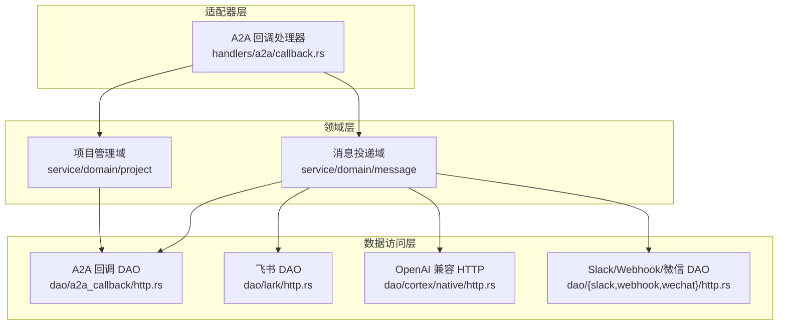
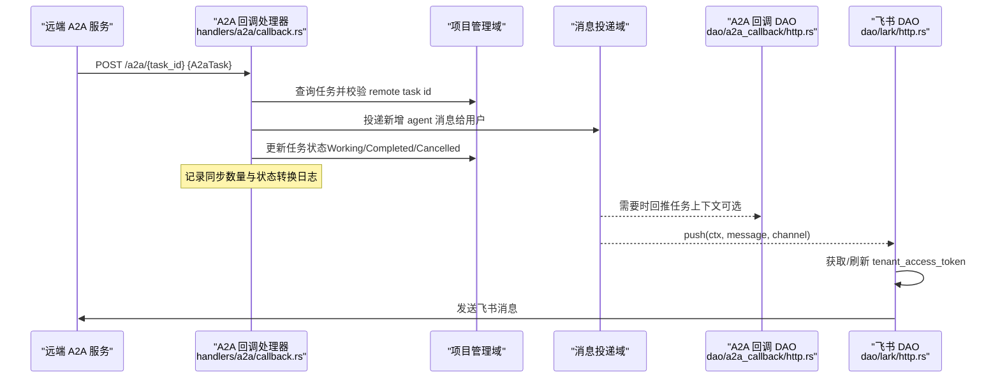
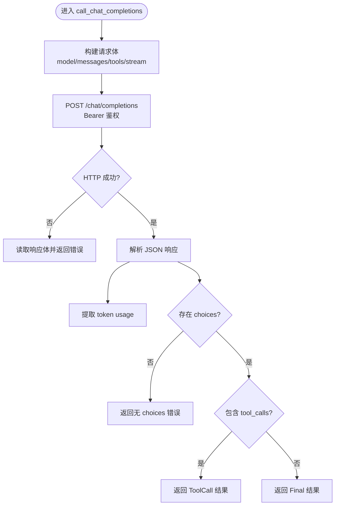
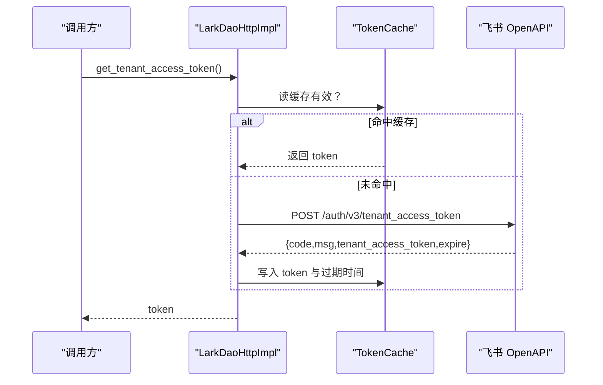
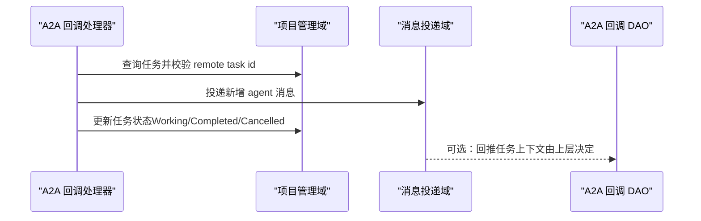
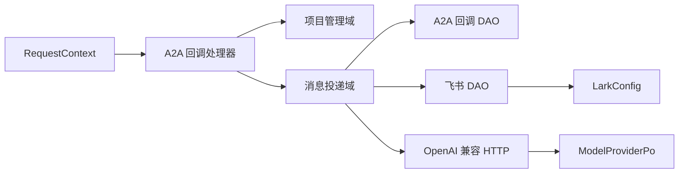

# 外部 API 数据访问对象

<cite>
**本文引用的文件**
- [src/service/dao/cortex/native/http.rs](src/service/dao/cortex/native/http.rs)
- [src/service/dao/lark/http.rs](src/service/dao/lark/http.rs)
- [src/service/dao/slack/http.rs](src/service/dao/slack/http.rs)
- [src/service/dao/webhook/http.rs](src/service/dao/webhook/http.rs)
- [src/service/dao/wechat/http.rs](src/service/dao/wechat/http.rs)
- [src/service/dao/a2a_callback/http.rs](src/service/dao/a2a_callback/http.rs)
- [src/handlers/a2a/callback.rs](src/handlers/a2a/callback.rs)
- [common/src/config.rs](common/src/config.rs)
- [common/src/error/mod.rs](common/src/error/mod.rs)
</cite>

## 目录
1. [简介](#简介)
2. [项目结构](#项目结构)
3. [核心组件](#核心组件)
4. [架构总览](#架构总览)
5. [详细组件分析](#详细组件分析)
6. [依赖关系分析](#依赖关系分析)
7. [性能与并发](#性能与并发)
8. [故障排除指南](#故障排除指南)
9. [结论](#结论)

## 简介
本文件面向“外部 API 数据访问对象”，聚焦 HTTP 客户端封装与第三方服务集成，覆盖 OpenAI 兼容模型调用、A2A 回调、飞书、Slack、Webhook、微信等渠道。文档从系统架构、组件职责、数据流、错误处理、认证授权、请求签名、限流与连接池、重试与超时、日志记录等方面展开，并提供可操作的集成示例与排障建议。

## 项目结构
本项目遵循严格四层单向调用：Adapter（HTTP Handler / 公开回调 Handler / AOP Producer）→ Domain → DAL → DAO。DAO 层负责与外部 HTTP 服务交互；DAL 层对外暴露业务实体接口；Domain 层承载业务规则；Adapter 层仅做协议适配与路由。

图表来源
- [src/handlers/a2a/callback.rs:17-198](src/handlers/a2a/callback.rs#L17-L198)
- [src/service/dao/a2a_callback/http.rs:41-157](src/service/dao/a2a_callback/http.rs#L41-L157)
- [src/service/dao/lark/http.rs:219-289](src/service/dao/lark/http.rs#L219-L289)
- [src/service/dao/cortex/native/http.rs:82-202](src/service/dao/cortex/native/http.rs#L82-L202)

章节来源
- [src/handlers/a2a/callback.rs:17-198](src/handlers/a2a/callback.rs#L17-L198)
- [src/service/dao/a2a_callback/http.rs:41-157](src/service/dao/a2a_callback/http.rs#L41-L157)
- [src/service/dao/lark/http.rs:219-289](src/service/dao/lark/http.rs#L219-L289)
- [src/service/dao/cortex/native/http.rs:82-202](src/service/dao/cortex/native/http.rs#L82-L202)

## 核心组件
- OpenAI 兼容模型调用（Chat Completions / Embeddings / 多模态 Embeddings）
  - 统一通过 reqwest 发起 POST 请求，使用 Bearer Token 鉴权，解析标准响应并提取工具调用或最终回答。
  - 支持多种提供商默认 base_url，可按 provider 配置覆盖。
- 飞书渠道推送与事件监听
  - 获取 tenant_access_token 并缓存（提前刷新），发送文本消息到 open_id，管理 WebSocket 长连接生命周期。
- A2A 回调
  - 将本地任务状态与消息同步至远端 A2A 服务端；回调处理器接收远端状态变更，更新本地任务状态并向用户投递消息。
- Slack / Webhook / 微信
  - 当前为占位实现，返回“不支持”错误，便于后续扩展。

章节来源
- [src/service/dao/cortex/native/http.rs:15-36](src/service/dao/cortex/native/http.rs#L15-L36)
- [src/service/dao/cortex/native/http.rs:82-202](src/service/dao/cortex/native/http.rs#L82-L202)
- [src/service/dao/cortex/native/http.rs:204-309](src/service/dao/cortex/native/http.rs#L204-L309)
- [src/service/dao/lark/http.rs:80-217](src/service/dao/lark/http.rs#L80-L217)
- [src/service/dao/a2a_callback/http.rs:41-157](src/service/dao/a2a_callback/http.rs#L41-L157)
- [src/handlers/a2a/callback.rs:17-198](src/handlers/a2a/callback.rs#L17-L198)
- [src/service/dao/slack/http.rs:39-59](src/service/dao/slack/http.rs#L39-L59)
- [src/service/dao/webhook/http.rs:39-62](src/service/dao/webhook/http.rs#L39-L62)
- [src/service/dao/wechat/http.rs:39-59](src/service/dao/wechat/http.rs#L39-L59)

## 架构总览
下图展示一次“远程 A2A 回调触发 → 本地任务状态更新 → 向用户投递消息”的完整流程，以及“本地消息推送至飞书”的并行链路。

图表来源
- [src/handlers/a2a/callback.rs:17-198](src/handlers/a2a/callback.rs#L17-L198)
- [src/service/dao/a2a_callback/http.rs:41-157](src/service/dao/a2a_callback/http.rs#L41-L157)
- [src/service/dao/lark/http.rs:219-289](src/service/dao/lark/http.rs#L219-L289)

## 详细组件分析

### OpenAI 兼容 HTTP 客户端（cortex/native/http.rs）
- 职责
  - 统一封装 Chat Completions、Embeddings、多模态 Embeddings 调用。
  - 根据 ProviderType 选择默认 base_url，支持按 provider 配置覆盖。
  - 使用 Bearer Token 进行鉴权，解析响应并提取 tool_calls 或最终内容。
- 关键流程
  - 构建请求体（messages、tools、stream=false）。
  - 发送请求并检查状态码，失败时返回结构化错误。
  - 解析 usage 与 choices，区分工具调用与最终回答。
- 错误与日志
  - 网络异常、JSON 解析失败、空 choices 均转换为内部错误。
  - 使用 log_debug 记录请求摘要（URL、模型名、消息数）。

图表来源
- [src/service/dao/cortex/native/http.rs:82-202](src/service/dao/cortex/native/http.rs#L82-L202)

章节来源
- [src/service/dao/cortex/native/http.rs:15-36](src/service/dao/cortex/native/http.rs#L15-L36)
- [src/service/dao/cortex/native/http.rs:82-202](src/service/dao/cortex/native/http.rs#L82-L202)
- [src/service/dao/cortex/native/http.rs:204-309](src/service/dao/cortex/native/http.rs#L204-L309)

### 飞书渠道（lark/http.rs）
- 职责
  - 获取并缓存 tenant_access_token（带提前刷新与双重检查锁）。
  - 发送文本消息到指定 open_id。
  - 启动/停止事件监听 WebSocket 长连接。
- 认证与鉴权
  - 使用 app_id/app_secret 获取 tenant_access_token，并在后续消息发送中通过 Bearer 传递。
- 错误处理
  - 配置缺失、token 为空、API 返回非零 code 均转换为 ThirdPartyError。
- 日志
  - 推送成功记录 channel_id、open_id、lark_message_id。

图表来源
- [src/service/dao/lark/http.rs:80-153](src/service/dao/lark/http.rs#L80-L153)

章节来源
- [src/service/dao/lark/http.rs:22-78](src/service/dao/lark/http.rs#L22-L78)
- [src/service/dao/lark/http.rs:80-217](src/service/dao/lark/http.rs#L80-L217)
- [src/service/dao/lark/http.rs:219-289](src/service/dao/lark/http.rs#L219-L289)

### A2A 回调（a2a_callback/http.rs 与 handlers/a2a/callback.rs）
- 职责
  - 回调 DAO：将本地项目/消息序列化为 A2aTask，POST 到远端 webhook_url，设置超时与错误映射。
  - 回调处理器：接收远端 A2aTask，校验任务关联，增量同步 agent 消息，更新本地任务状态。
- 数据流
  - 处理器从项目域获取任务，过滤 role=agent/assistant 的消息，计算新增条数，调用消息投递域发送到用户。
  - 更新任务标签中的已同步消息计数，必要时转换任务状态。
- 错误与日志
  - 缺少 webhook_url/scope_project 返回 InvalidRequest。
  - 远端返回非 2xx 状态码，记录状态码与响应体。
  - 所有关键步骤均有日志输出。

图表来源
- [src/handlers/a2a/callback.rs:17-198](src/handlers/a2a/callback.rs#L17-L198)
- [src/service/dao/a2a_callback/http.rs:41-157](src/service/dao/a2a_callback/http.rs#L41-L157)

章节来源
- [src/service/dao/a2a_callback/http.rs:41-157](src/service/dao/a2a_callback/http.rs#L41-L157)
- [src/handlers/a2a/callback.rs:17-198](src/handlers/a2a/callback.rs#L17-L198)

### Slack / Webhook / 微信（占位实现）
- 现状
  - 三个渠道均为占位实现，push 与 test_connection 返回“不支持”错误。
- 扩展建议
  - 参照飞书 DAO 模式，增加配置加载、HTTP 客户端、鉴权与重试逻辑。
  - 在消息投递域中按渠道类型分发到对应 DAO。

章节来源
- [src/service/dao/slack/http.rs:39-59](src/service/dao/slack/http.rs#L39-L59)
- [src/service/dao/webhook/http.rs:39-62](src/service/dao/webhook/http.rs#L39-L62)
- [src/service/dao/wechat/http.rs:39-59](src/service/dao/wechat/http.rs#L39-L59)

## 依赖关系分析
- 模块耦合
  - A2A 回调处理器依赖项目域与消息域；A2A 回调 DAO 依赖项目域与消息域以构造 A2aTask。
  - 飞书 DAO 依赖全局配置（LarkConfig）与 reqwest 客户端。
  - OpenAI 兼容 HTTP 依赖模型提供者配置（ModelProviderPo）与通用错误模型。
- 外部依赖
  - reqwest 用于 HTTP 通信。
  - serde/serde_json 用于序列化/反序列化。
  - common::error 提供统一错误类型与宏。
  - common::config 提供应用级配置（含飞书与 A2A Server）。

图表来源
- [src/handlers/a2a/callback.rs:17-198](src/handlers/a2a/callback.rs#L17-L198)
- [src/service/dao/a2a_callback/http.rs:41-157](src/service/dao/a2a_callback/http.rs#L41-L157)
- [src/service/dao/lark/http.rs:219-289](src/service/dao/lark/http.rs#L219-L289)
- [src/service/dao/cortex/native/http.rs:82-202](src/service/dao/cortex/native/http.rs#L82-L202)
- [common/src/config.rs:490-549](common/src/config.rs#L490-L549)

章节来源
- [common/src/config.rs:490-549](common/src/config.rs#L490-L549)
- [common/src/error/mod.rs:1-25](common/src/error/mod.rs#L1-L25)

## 性能与并发
- 连接复用
  - 各 DAO 使用 reqwest::Client 实例；建议在应用启动时创建共享 Client 并通过单例注入，避免频繁握手开销。
- 令牌缓存
  - 飞书 token 采用内存缓存与读写锁保护，减少重复鉴权请求。
- 超时控制
  - A2A 回调 DAO 对远端请求设置 10 秒超时，防止阻塞。
- 限流策略
  - 当前代码未内置显式限流；可在上游消费者配置中通过并发度与队列休眠参数控制整体吞吐。
- 重试机制
  - 当前 HTTP 调用未实现自动重试；建议在通用 HTTP 封装层引入指数退避重试（针对 5xx、网络抖动）。
- 日志与可观测性
  - 关键路径使用 log_debug/log_info/log_warn 记录上下文信息，便于定位问题。

[本节为通用指导，不直接分析具体文件]

## 故障排除指南
- 飞书推送失败
  - 检查 LarkConfig 是否启用且 app_id/app_secret 正确。
  - 确认 open_id 配置存在；查看 token 获取日志与返回码。
  - 若 WebSocket 事件监听冲突，确保只启动一次监听器。
- A2A 回调失败
  - 校验 webhook_url 与 scope_project 是否存在。
  - 检查远端返回状态码与响应体；关注 10 秒超时是否合理。
  - 核对任务 remote task id 是否匹配。
- OpenAI 兼容调用失败
  - 确认 base_url 与 model_name 正确；检查 Bearer Token。
  - 关注 JSON 解析错误与空 choices；查看 usage 字段是否正确。
- Slack / Webhook / 微信
  - 当前为占位实现，需先实现具体推送逻辑后再测试。

章节来源
- [src/service/dao/lark/http.rs:102-153](src/service/dao/lark/http.rs#L102-L153)
- [src/service/dao/a2a_callback/http.rs:41-157](src/service/dao/a2a_callback/http.rs#L41-L157)
- [src/service/dao/cortex/native/http.rs:130-202](src/service/dao/cortex/native/http.rs#L130-L202)
- [src/service/dao/slack/http.rs:39-59](src/service/dao/slack/http.rs#L39-L59)
- [src/service/dao/webhook/http.rs:39-62](src/service/dao/webhook/http.rs#L39-L62)
- [src/service/dao/wechat/http.rs:39-59](src/service/dao/wechat/http.rs#L39-L59)

## 结论
本仓库的外部 API 数据访问对象以 DAO 层为核心，围绕 OpenAI 兼容模型调用、飞书渠道、A2A 回调实现了稳定可靠的 HTTP 封装与第三方集成。当前实现具备基础鉴权、错误映射与日志记录能力；在连接池复用、自动重试与限流方面仍有优化空间。建议逐步完善 Slack/Webhook/微信渠道，并在通用 HTTP 层引入重试与限流策略，以提升整体鲁棒性与可观测性。