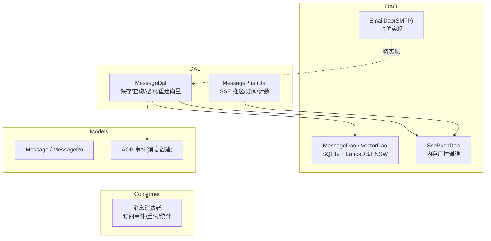
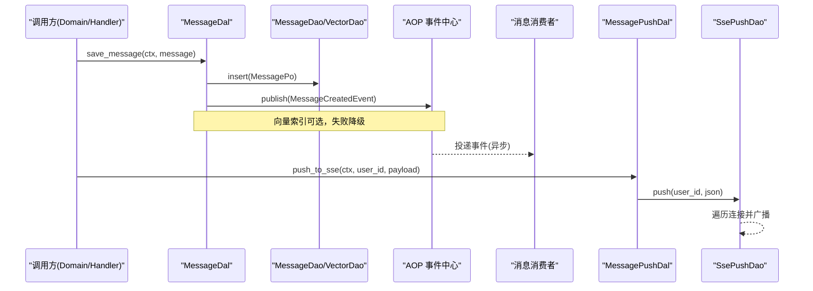
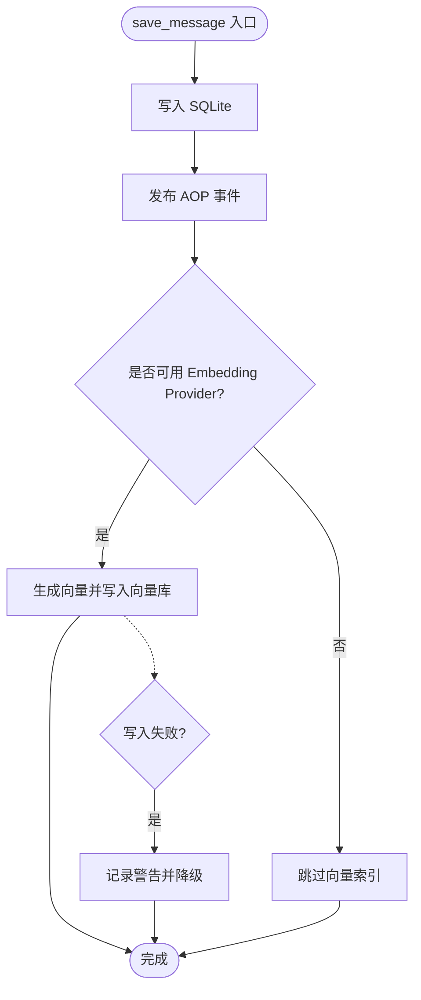
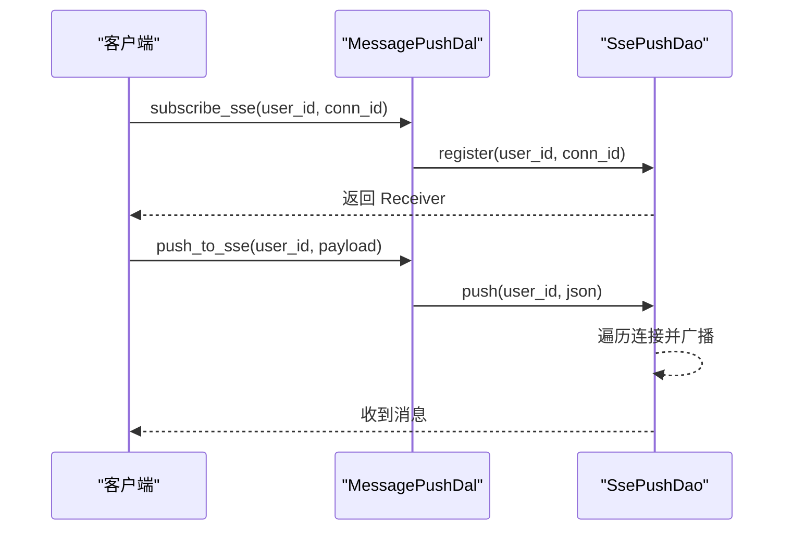
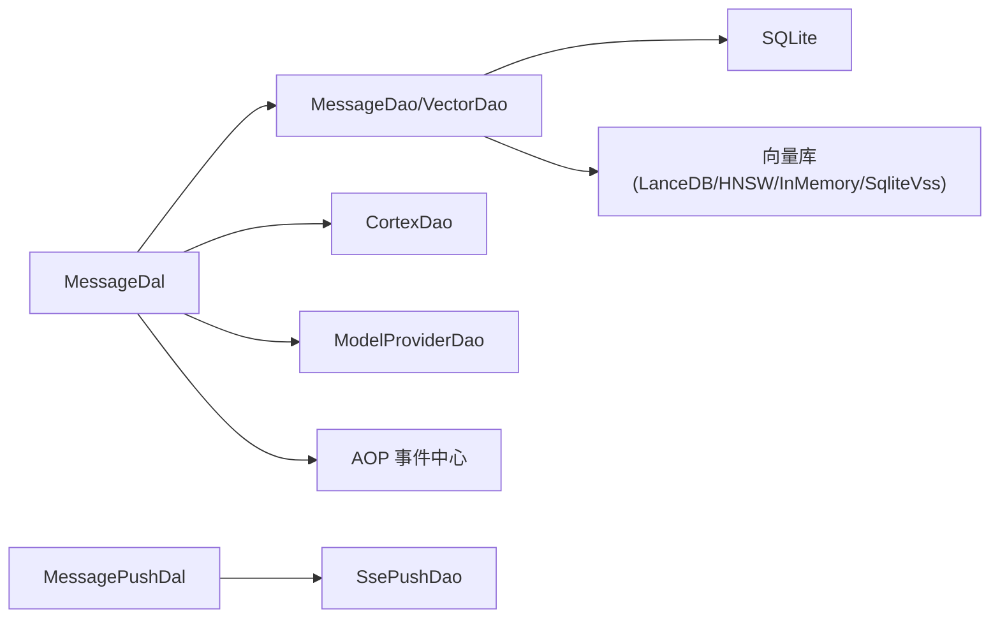

# 消息系统数据访问对象

<cite>
**本文引用的文件**
- [src/service/dal/message.rs](src/service/dal/message.rs)
- [src/service/dao/message_push.rs](src/service/dao/message_push.rs)
- [src/service/dal/message_push.rs](src/service/dal/message_push.rs)
- [src/models/message.rs](src/models/message.rs)
- [src/service/dao/email/smtp.rs](src/service/dao/email/smtp.rs)
- [src/consumer/message.rs](src/consumer/message.rs)
- [src/pkg/aop/core/event.rs](src/pkg/aop/core/event.rs)
- [migrations/20260420000000_initial.sql](migrations/20260420000000_initial.sql)
</cite>

## 目录
1. [简介](#简介)
2. [项目结构](#项目结构)
3. [核心组件](#核心组件)
4. [架构总览](#架构总览)
5. [详细组件分析](#详细组件分析)
6. [依赖关系分析](#依赖关系分析)
7. [性能与扩展性](#性能与扩展性)
8. [故障排查指南](#故障排查指南)
9. [结论](#结论)
10. [附录：集成示例与监控告警](#附录：集成示例与监控告警)

## 简介
本文件面向“消息系统数据访问对象”，聚焦以下能力的数据访问实现与底层操作：
- 邮件发送（SMTP）：接口定义与占位实现，便于后续接入真实 SMTP。
- WebSocket/SSE 消息推送：连接管理、广播分发、在线用户统计。
- 异步事件处理：基于 AOP 事件中心的消息持久化后发布、消费与去重。
- 消息持久化、状态跟踪与失败重试：通过 DAL/DAO 分层封装，结合向量索引降级与日志告警。
- 连接管理、批量发送与性能优化策略：内存广播通道、读写锁、并发安全与可观测性。
- 系统集成示例与监控告警配置：从 DAL 到 DAO 的调用路径、错误降级与可观测点。

本项目遵循四层单向调用：Adapter → Domain → DAL → DAO；PO 仅在 DAO/DAL 内部使用；Domain 输入为 Command/Query，输出业务实体与内部事件；service 层公共方法首参为 RequestContext，跨层传递使用 ctx.clone()。

## 项目结构
围绕消息系统的代码主要分布在 service 层的 DAL 与 DAO，以及 models 中的消息实体与事件模型：
- DAL（数据访问层）：对外暴露业务语义接口，组合多个 DAO 完成复杂流程（如保存消息、向量化、搜索合并）。
- DAO（数据访问对象）：具体存储与外部通道实现（如 SSE 推送、未来可扩展的 SMTP 邮件）。
- Models：消息实体 Message/MessagePo、工具调用消息、任务分配消息等，承载持久化与事件序列化。
- Consumer：异步消费者，订阅 AOP 事件并执行下游动作（如通知、重试、统计）。

图表来源
- [src/service/dal/message.rs:124-193](src/service/dal/message.rs#L124-L193)
- [src/service/dao/message_push.rs:40-136](src/service/dao/message_push.rs#L40-L136)
- [src/service/dal/message_push.rs:61-114](src/service/dal/message_push.rs#L61-L114)
- [src/models/message.rs:204-247](src/models/message.rs#L204-L247)

章节来源
- [src/service/dal/message.rs:1-580](src/service/dal/message.rs#L1-L580)
- [src/service/dao/message_push.rs:1-173](src/service/dao/message_push.rs#L1-L173)
- [src/service/dal/message_push.rs:1-163](src/service/dal/message_push.rs#L1-L163)
- [src/models/message.rs:1-690](src/models/message.rs#L1-L690)

## 核心组件
- 消息 DAL（MessageDal）
  - 保存消息：写入 SQLite，发布 AOP 事件，尝试构建向量索引（失败降级）。
  - 查询/列表/计数：透传 DAO，返回业务实体 Message。
  - 搜索：关键词 FTS5 + 向量相似度混合排序，自动降维嵌入失败时回退关键词搜索。
  - 重建向量：清空集合后全量重建，逐条向量化并写入。
- SSE 推送 DAO（SsePushDao）
  - 连接注册/注销：维护 user_id -> connection_id 映射与 broadcast::Sender 表。
  - 推送：按 user_id 查找所有连接，广播 JSON 字符串，统计成功数。
  - 连接计数：用于监控与限流。
- 消息推送 DAL（MessagePushDal）
  - 将业务 payload 序列化为 JSON，委托给 SsePushDao 推送。
  - 提供 subscribe/unsubscribe/connection_count 便捷方法。
- 邮件 DAO（EmailDao, SMTP 实现）
  - 当前为占位实现，返回“不支持”错误，预留 push/test_connection 接口以便后续接入 SMTP。

章节来源
- [src/service/dal/message.rs:124-445](src/service/dal/message.rs#L124-L445)
- [src/service/dao/message_push.rs:19-136](src/service/dao/message_push.rs#L19-L136)
- [src/service/dal/message_push.rs:40-114](src/service/dal/message_push.rs#L40-L114)
- [src/service/dao/email/smtp.rs:1-60](src/service/dao/email/smtp.rs#L1-L60)

## 架构总览
消息系统在 DAL 层统一编排 DAO 能力，并通过 AOP 事件中心解耦持久化与下游消费。SSE 推送作为实时通道，基于内存广播通道实现低延迟分发。邮件通道目前为占位，便于后续接入。

图表来源
- [src/service/dal/message.rs:133-193](src/service/dal/message.rs#L133-L193)
- [src/models/message.rs:204-247](src/models/message.rs#L204-L247)
- [src/service/dal/message_push.rs:72-84](src/service/dal/message_push.rs#L72-L84)
- [src/service/dao/message_push.rs:61-86](src/service/dao/message_push.rs#L61-L86)

## 详细组件分析

### 消息持久化与搜索（MessageDal）
- 保存流程
  - 写入 SQLite（MessageDao.insert），随后发布 AOP 事件（MessageCreatedEvent）。
  - 尝试构建向量索引：若存在默认 Embedding Provider，则调用 Cortex 进行向量化并写入向量库；失败记录警告并降级。
- 查询与列表
  - 通过 MessageDao.query 返回 PO，再转换为业务实体 Message。
- 搜索
  - 关键词匹配：FTS5 检索，附带排名信息。
  - 向量匹配：根据 query_vector 在向量库中检索 Top-K。
  - 结果合并：关键词权重 0.7，向量权重 0.3，去重并按综合得分排序。
- 重建向量
  - 清空集合后全量扫描消息，逐条向量化并 upsert。

图表来源
- [src/service/dal/message.rs:133-193](src/service/dal/message.rs#L133-L193)
- [src/service/dal/message.rs:357-396](src/service/dal/message.rs#L357-L396)
- [src/service/dal/message.rs:448-463](src/service/dal/message.rs#L448-L463)
- [src/service/dal/message.rs:465-518](src/service/dal/message.rs#L465-L518)
- [src/service/dal/message.rs:520-572](src/service/dal/message.rs#L520-L572)

章节来源
- [src/service/dal/message.rs:124-580](src/service/dal/message.rs#L124-L580)
- [src/models/message.rs:249-300](src/models/message.rs#L249-L300)

### SSE 消息推送（MessagePushDal + SsePushDao）
- 连接管理
  - register：为每个连接创建 broadcast::Receiver，维护 user_id 到 connection_id 的映射。
  - unregister：移除连接并从所有用户的连接集合中清理。
  - connection_count：统计某用户在线连接数。
- 推送流程
  - DAL 将业务 payload 序列化为 JSON，DAO 按 user_id 找到所有连接并广播，统计成功数。
- 并发与一致性
  - 使用 RwLock 保护 connections 与 user_connections 两个 HashMap，读多写少场景高效。

图表来源
- [src/service/dal/message_push.rs:72-104](src/service/dal/message_push.rs#L72-L104)
- [src/service/dao/message_push.rs:61-136](src/service/dao/message_push.rs#L61-L136)

章节来源
- [src/service/dal/message_push.rs:1-163](src/service/dal/message_push.rs#L1-L163)
- [src/service/dao/message_push.rs:1-173](src/service/dao/message_push.rs#L1-L173)

### 邮件发送（SMTP 占位）
- 当前 EmailDao 的 SMTP 实现为占位，push 与 test_connection 均返回“不支持”错误。
- 设计意图：预留接口，后续接入真实 SMTP 客户端，复用 MessageChannel 配置与认证信息。

章节来源
- [src/service/dao/email/smtp.rs:1-60](src/service/dao/email/smtp.rs#L1-L60)

### 异步事件处理（AOP 事件中心）
- 消息保存后发布 MessageCreatedEvent，消费者可订阅该事件执行下游逻辑（如通知、重试、统计）。
- 事件顺序键：优先按 task_id，其次 project_id，最后消息 id，保证同任务内顺序消费。
- 优先级与时间戳：默认优先级 5，created_at 来自消息创建时间。

章节来源
- [src/models/message.rs:204-247](src/models/message.rs#L204-L247)
- [src/pkg/aop/core/event.rs:1-200](src/pkg/aop/core/event.rs#L1-L200)
- [src/consumer/message.rs:1-200](src/consumer/message.rs#L1-L200)

## 依赖关系分析
- MessageDal 依赖：
  - MessageDao/MessageVectorDao：SQLite 与向量库（LanceDB/HNSW/InMemory/SqliteVss）。
  - CortexDao/ModelProviderDao：获取默认 Embedding Provider 并执行文本嵌入。
  - AOP：发布消息创建事件。
- MessagePushDal 依赖：
  - SsePushDao：内存广播通道，维护连接映射。
- 模型依赖：
  - Message/MessagePo：持久化结构与业务实体转换。
  - Event：消息事件序列化与顺序键。

图表来源
- [src/service/dal/message.rs:124-193](src/service/dal/message.rs#L124-L193)
- [src/service/dal/message.rs:357-396](src/service/dal/message.rs#L357-L396)
- [src/service/dal/message_push.rs:72-104](src/service/dal/message_push.rs#L72-L104)
- [src/service/dao/message_push.rs:61-136](src/service/dao/message_push.rs#L61-L136)

章节来源
- [src/service/dal/message.rs:1-580](src/service/dal/message.rs#L1-L580)
- [src/service/dal/message_push.rs:1-163](src/service/dal/message_push.rs#L1-L163)
- [src/service/dao/message_push.rs:1-173](src/service/dao/message_push.rs#L1-L173)

## 性能与扩展性
- 向量索引降级
  - 当无可用 Embedding Provider 或嵌入失败时，记录警告并降级为关键词搜索，确保主流程不受影响。
- 搜索合并策略
  - 关键词权重 0.7，向量权重 0.3，去重后按综合得分排序，兼顾精确与召回。
- SSE 推送性能
  - 内存广播通道，O(n) 遍历用户连接；适合中小规模在线用户场景。可通过分片或分区广播进一步优化。
- 并发安全
  - 使用 RwLock 保护连接表与用户映射，读多写少场景下提升吞吐。
- 扩展点
  - 邮件通道：在 EmailDao 中实现 SMTP 推送与连接测试，复用 MessageChannel 配置。
  - 批量发送：可在 DAL 层聚合多条消息后批量写入向量库，减少 IO 次数。
  - 重试机制：在消费者层对失败事件实施指数退避重试，结合持久化队列（如 SQLite 表）保障可靠性。

[本节为通用指导，不直接分析具体文件]

## 故障排查指南
- 向量索引写入失败
  - 现象：保存消息后向量库未更新。
  - 定位：检查是否有默认 Embedding Provider，查看警告日志“向量索引写入失败，已降级”。
  - 处理：修复 Provider 配置或启用降级模式，仅使用关键词搜索。
- SSE 推送无消息
  - 现象：客户端未收到推送。
  - 定位：确认 register 是否成功，connection_count 是否为 0；检查 push 返回的 delivered_count。
  - 处理：确保客户端正确订阅并维持连接；必要时重启服务以清理僵尸连接。
- 邮件功能不可用
  - 现象：调用邮件推送返回“不支持”。
  - 定位：EmailDao SMTP 实现仍为占位。
  - 处理：实现 SMTP 推送逻辑，完善连接测试与错误码。

章节来源
- [src/service/dal/message.rs:150-193](src/service/dal/message.rs#L150-L193)
- [src/service/dao/message_push.rs:61-86](src/service/dao/message_push.rs#L61-L86)
- [src/service/dao/email/smtp.rs:40-59](src/service/dao/email/smtp.rs#L40-L59)

## 结论
消息系统通过 DAL/DAO 分层清晰分离业务语义与存储细节，结合 AOP 事件中心实现异步解耦。SSE 推送提供低延迟实时通信，向量索引增强检索能力并提供降级策略。邮件通道预留接口便于后续接入。整体架构具备高内聚、低耦合、易扩展的特点，满足大规模消息处理与推送需求。

[本节为总结，不直接分析具体文件]

## 附录：集成示例与监控告警
- 集成示例
  - 保存消息并推送：调用 MessageDal.save_message 后，AOP 事件触发消费者；同时调用 MessagePushDal.push_to_sse 推送至前端。
  - 订阅 SSE：客户端调用 subscribe_sse 获取 Receiver，持续接收消息。
  - 重建向量：调用 rebuild_vectors 以恢复向量索引。
- 监控告警
  - 关键指标：SSE 连接数、推送成功率、向量索引写入失败率、Embedding Provider 可用性。
  - 告警规则：当 delivered_count=0 且连接数>0 时告警；向量写入失败率超过阈值时告警。
  - 日志关键字：向量索引写入失败、向量搜索失败、邮件推送不支持。

章节来源
- [src/service/dal/message.rs:398-445](src/service/dal/message.rs#L398-L445)
- [src/service/dal/message_push.rs:72-104](src/service/dal/message_push.rs#L72-L104)
- [src/service/dao/message_push.rs:61-136](src/service/dao/message_push.rs#L61-L136)
- [src/service/dao/email/smtp.rs:40-59](src/service/dao/email/smtp.rs#L40-L59)